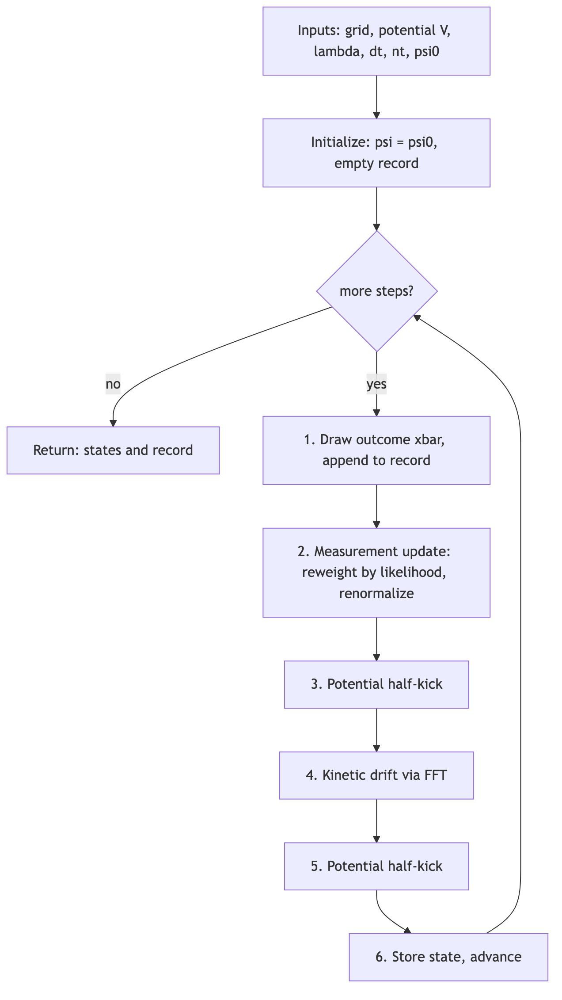
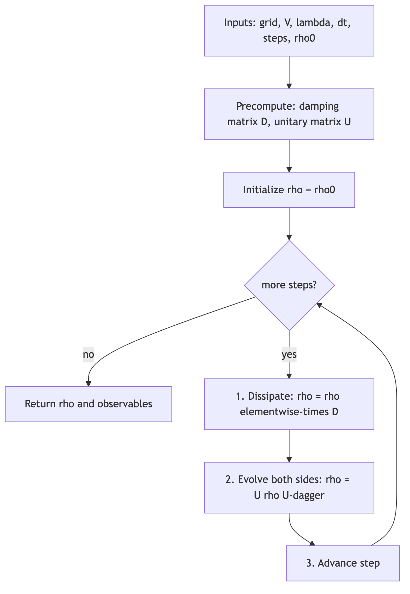
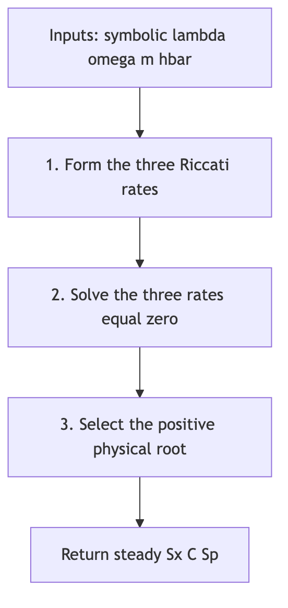
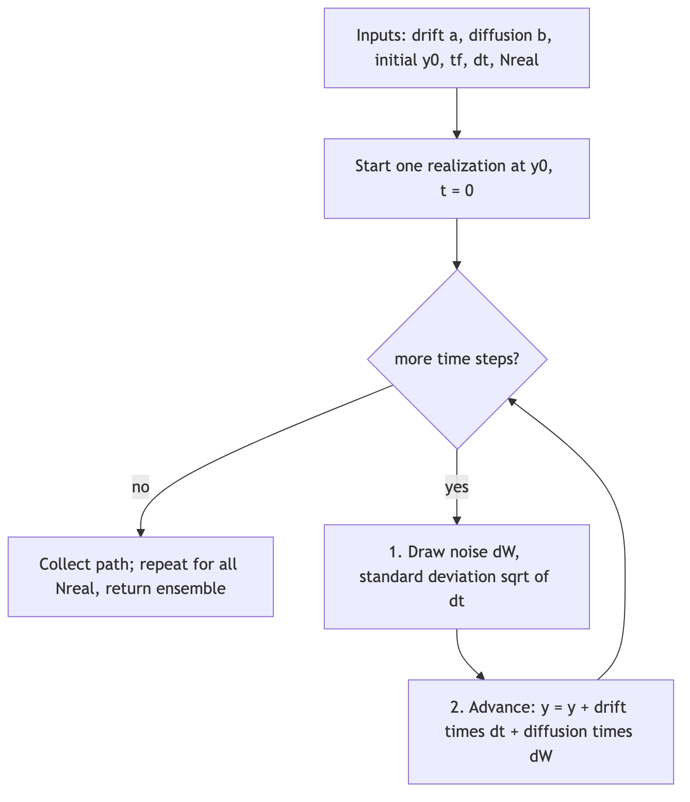
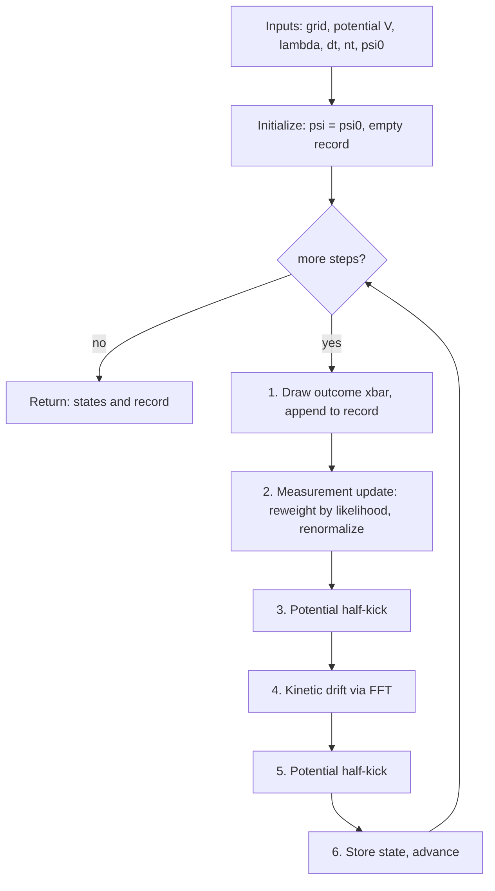
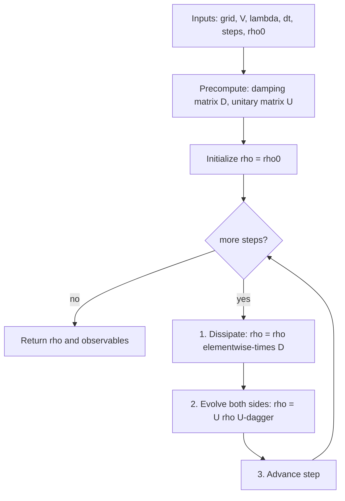
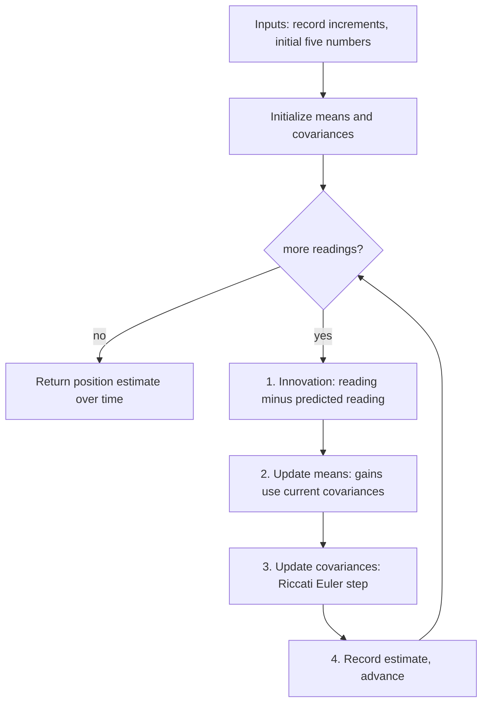
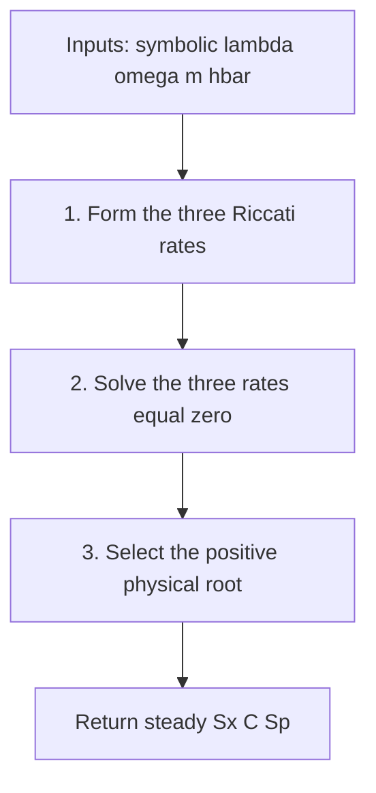
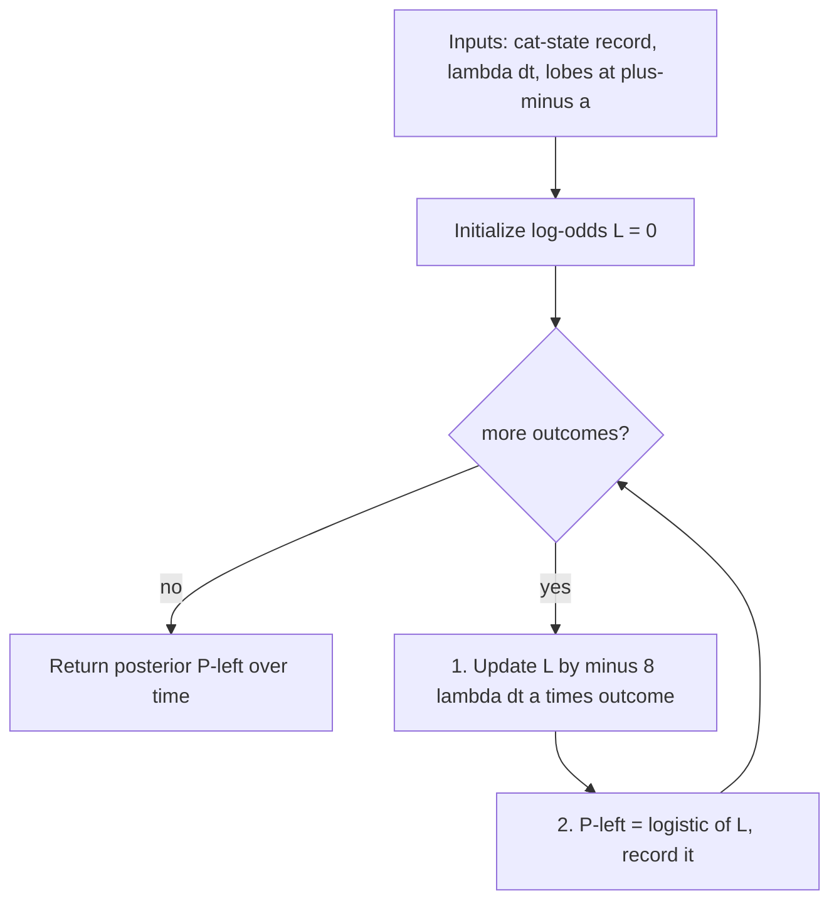
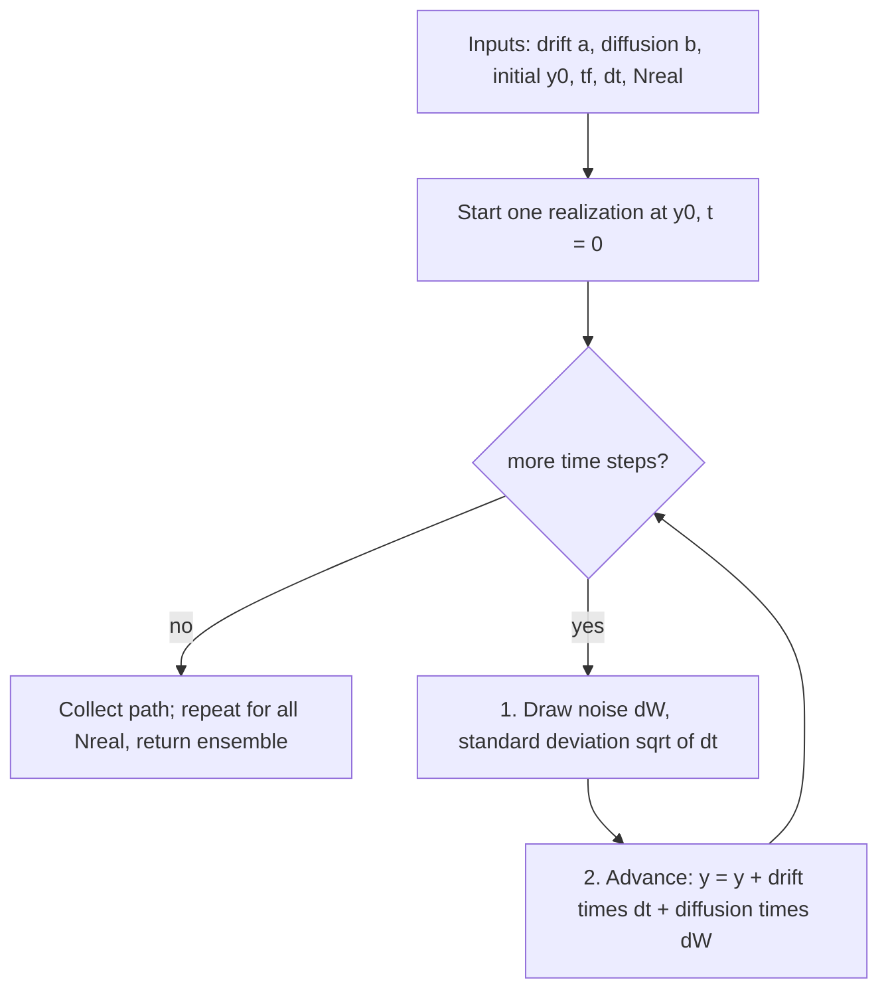

# Simulation Flowcharts: Continuous Measurement in a Potential

Implementation-ready specifications for every simulation in `measurement-in-a-potential.md`. For each simulation the **flowchart and the numbered steps are the same list**: every flowchart box is one numbered step, and each step below repeats that box's wording and then gives the formula (words + formula).

- **Formulas are verified.** Every closed form was checked symbolically in the Wolfram Language with $m,\lambda,\omega,\hbar$ kept general; all twelve checks pass.
- **Flowcharts are PNG images**, so they display in any Markdown viewer; VS Code's built-in preview also renders the `$\dots$` math natively. Editable Mermaid sources are in the appendix.
- **Units:** $\hbar = m = 1$ (kept symbolic only in Simulation 4). Step $dt$, measurement rate $\lambda$, trap frequency $\omega$.

---

## The algorithms in one line, with closed forms

1. **Conditional trajectory.** Measure then move: draw a blurred reading, reweight $\psi$ by the Gaussian likelihood, renormalize, Strang-split the unitary. Reproduces the free-particle steady width $(\hbar/4\lambda m)^{1/4}$; the conditional state stays exactly pure.
2. **Lindblad master equation.** Average over the record: damp $\rho_{ij}$ by $e^{-\frac{\lambda}{2}(x_i-x_j)^2 dt}$, then evolve both sides. Gives $\langle\hat p^2\rangle(t)=\langle\hat p^2\rangle_0+\lambda\hbar^2 t$ (free) and $E(t)=E_0+\lambda\hbar^2 t/2m$, $dE/dt=\lambda\hbar^2/2m$, $dn/dt=\lambda\hbar/2m\omega$ (trap).
3. **Kalman-Bucy filter.** Track five numbers from the record: innovation $\Delta W_f=\Delta Y_k-2\sqrt\lambda\,\langle\hat x\rangle\,dt$, means nudged with gains $2\sqrt\lambda\,\Sigma_x,\ 2\sqrt\lambda\,C$, covariances by a deterministic Riccati step. Recovers $\langle\hat x\rangle(t)$ to grid accuracy from the record alone.
4. **Riccati steady state (symbolic).** $\Sigma_x^{ss}=\frac{1}{2\sqrt2}\sqrt{\dfrac{-m\omega^2+\sqrt{4\hbar^2\lambda^2+m^2\omega^4}}{\lambda^2 m}}$, with $\Sigma_x\Sigma_p-C^2=\hbar^2/4$ and, in $\mu=2\hbar\lambda/m\omega^2$, $\ \Sigma_x^{ss}/\Sigma_x^{zp}=\sqrt{2(\sqrt{1+\mu^2}-1)}/\mu<1$ (weak $\approx1-\mu^2/8$, strong $\approx\sqrt{2/\mu}$).
5. **Cat log-odds inference.** For lobes at $\pm a$, accumulate $L\leftarrow L-8\lambda\,dt\,a\,\bar x_k$ (here $a=6$, so the step is $-48\lambda\,dt\,\bar x_k$); posterior $P_{\text{left}}=1/(1+e^{-L})$.
6. **ItoProcess moment engine ("ito").** Integrate the five-moment Itô SDE $dy=a(y)\,dt+b(y)\,dW$, drift = the Riccati/Hamilton rates, scalar diffusion $b=(2\sqrt\lambda\,\Sigma_x,\ 2\sqrt\lambda\,C,\ 0,0,0)$; equivalent to Euler-Maruyama and to Simulation 3.

---

## Shared foundation (grid, state, moments, conventions)

**Grid.** $n$ points across a periodic box of length $L$: spacing $dx=L/n$, positions $x_j=dx\,j$ for $j=-\tfrac n2,\dots,\tfrac n2-1$, momenta $p_m=\dfrac{2\pi\hbar}{L}\,m$ with $m$ in **FFT-natural order** $[\,0,1,\dots,\tfrac n2-1,\ -\tfrac n2,\dots,-1\,]$. This order must match the DFT so multiplying $\mathrm{FFT}(\psi)$ by a function of $p$ lands each amplitude on its own momentum.

**State.** Pure: $\psi\in\mathbb C^{\,n}$ with $\sum_j|\psi_j|^2=1$. Mixed: $\rho\in\mathbb C^{\,n\times n}$.

**Initial Gaussian** of width $s$, center $x_0$, mean momentum $p_0$: $\ \psi_j=\exp\!\big(-\frac{(x_j-x_0)^2}{4s^2}+\frac{i\,p_0\,x_j}{\hbar}\big)$, then normalize.

**Moments.** $\ \langle\hat x\rangle=\sum_j x_j|\psi_j|^2,\qquad \Sigma_x=\sum_j x_j^2|\psi_j|^2-\langle\hat x\rangle^2 .$

**DFT convention (critical).** Use the numpy `fft`/`ifft` pair (Wolfram `FourierParameters -> {0,-1}`): forward with no prefactor, inverse with $1/n$, and the FFT-natural momentum order above.

**Hamiltonian.** $\hat H=\hat p^2/2m+V(\hat x)$. Only $V$ changes: free $V=0$; trap $V(x)=\tfrac12 m\omega^2 x^2$.

**Detector model (verified).** One reading is $\bar x=X+\xi$ with $X\sim|\psi|^2$ and $\xi\sim\mathcal N(0,\sigma^2)$, standard deviation $\sigma=1/\sqrt{4\lambda\,dt}$. Likelihood $P(\bar x\mid x)\propto e^{-2\lambda\,dt\,(x-\bar x)^2}$; Kraus operator $\hat M(\bar x)\propto e^{-\lambda\,dt\,(x-\bar x)^2}$ obeys $|\hat M|^2=$ that likelihood.

---

## 1. Conditional quantum trajectory (grid split-operator)

**Purpose.** One monitored run: evolve the pure conditional state while a detector emits a noisy record; return the states and the record.

**Inputs.** grid $(n,L)$; potential $V$; rate $\lambda$; step $dt$; count $n_t$; initial $\psi^{(0)}$ (normalized). **Reproduces** the free-particle steady width $(\hbar/4\lambda m)^{1/4}$; conditional purity $1$.

**Steps.** Set $\psi\leftarrow\psi^{(0)}$ and an empty record; repeat while steps remain:

1. **Draw outcome $\bar x$, append to record.** Sample index $j$ with probability $|\psi_j|^2$, set $X=x_j$; draw $\xi\sim\mathcal N(0,\sigma^2)$ with $\sigma=\dfrac{1}{\sqrt{4\lambda\,dt}}$; set $\bar x=X+\xi$.
2. **Measurement update: reweight by likelihood, renormalize.** $\ \psi_j\leftarrow e^{-\lambda\,dt\,(x_j-\bar x)^2}\,\psi_j\ \forall j$, then $\psi\leftarrow\psi/\lVert\psi\rVert$.
3. **Potential half-kick.** $\ \psi_j\leftarrow e^{-\,i\,V(x_j)\,dt/(2\hbar)}\,\psi_j$.
4. **Kinetic drift via FFT.** $\ \psi\leftarrow\mathrm{IFFT}\!\big(e^{-\,i\,p_m^2\,dt/(2m\hbar)}\;\mathrm{FFT}(\psi)\big)$.
5. **Potential half-kick.** repeat step 3.
6. **Store state, advance.** save $\psi$; go to the next reading.

**Notes.** Steps 1-2 are independent of $\hat H$; only 3-5 use $V$. Half/full/half gives $O(dt^2)$ error. The record feeds Simulation 3 as $\Delta Y_k=2\sqrt\lambda\,dt\,\bar x_k$.

---

## 2. Unconditional master equation (Lindblad density matrix)

**Purpose.** The averaged state (record discarded), obeying $\dfrac{d\rho}{dt}=-\dfrac{i}{\hbar}[\hat H,\rho]-\dfrac{\lambda}{2}\big[\hat x,[\hat x,\rho]\big]$; it decoheres and heats.

**Inputs.** grid $(n,L)$ (small, cost $O(n^3)$/step); $V$; $\lambda$; $dt$; step count; initial $\rho^{(0)}=\psi^{(0)}\psi^{(0)\dagger}$. **Closed forms (verified):** $\langle\hat p^2\rangle(t)=\langle\hat p^2\rangle_0+\lambda\hbar^2 t$ (free); $dE/dt=\lambda\hbar^2/2m$, $dn/dt=\lambda\hbar/2m\omega$ (trap).

**Steps.** **Precompute** the damping matrix $D_{ij}=\exp\!\big(-\tfrac{\lambda}{2}(x_i-x_j)^2\,dt\big)$ and the unitary matrix $U$ (its $k$-th column is one split-operator step, Simulation 1 steps 3-5, applied to the basis vector $e_k$). Then from $\rho\leftarrow\rho^{(0)}$, repeat:

1. **Dissipate: $\rho\leftarrow\rho\odot D$** ($\odot$ = elementwise/Hadamard product).
2. **Evolve both sides: $\rho\leftarrow U\,\rho\,U^\dagger$.**
3. **Advance step.**

**Observables from $\rho$.**
$$\langle\hat x^2\rangle=\mathrm{Re}\!\sum_j\rho_{jj}\,x_j^2,\quad
\langle\hat p^2\rangle=\mathrm{Re}\,\mathrm{Tr}(\rho P_2),\quad
\text{purity}=\mathrm{Re}\,\mathrm{Tr}(\rho^2),\quad
E=\frac{\langle\hat p^2\rangle}{2m}+\tfrac12 m\omega^2\langle\hat x^2\rangle,$$
with $P_2$ the spectral $\hat p^2$ matrix ($k$-th column $=\mathrm{IFFT}(p_m^2\,\mathrm{FFT}(e_k))$).

**Notes.** Equals the ensemble average of Simulation 1, $\rho=\mathbb E[\psi\psi^\dagger]$. A coarse grid underestimates the heating.

---

## 3. Five-number Kalman-Bucy filter

**Purpose.** Reconstruct $\langle\hat x\rangle(t)$ in the trap from the record alone, with five numbers $(\langle\hat x\rangle,\langle\hat p\rangle,\Sigma_x,C,\Sigma_p)$.

**Inputs.** record increments $\Delta Y_k=2\sqrt\lambda\,dt\,\bar x_k$; parameters $\lambda,dt,\omega,m,\hbar$; initial $(\langle\hat x\rangle,\langle\hat p\rangle,\Sigma_x,C,\Sigma_p)=(0,0,\Sigma_x^{zp},0,\Sigma_p^{zp})$ with $\Sigma_x^{zp}=\frac{\hbar}{2m\omega},\ \Sigma_p^{zp}=\frac{\hbar m\omega}{2}$.

**Steps.** For each $\Delta Y_k$ in order, using the **pre-step** values on every right-hand side:

1. **Innovation: reading minus predicted reading.** $\ \Delta W_f=\Delta Y_k-2\sqrt\lambda\,\langle\hat x\rangle\,dt$.
2. **Update means: gains use current covariances.**
$$\langle\hat x\rangle\leftarrow\langle\hat x\rangle+\frac{\langle\hat p\rangle}{m}\,dt+2\sqrt\lambda\,\Sigma_x\,\Delta W_f,\qquad
\langle\hat p\rangle\leftarrow\langle\hat p\rangle-m\omega^2\langle\hat x\rangle\,dt+2\sqrt\lambda\,C\,\Delta W_f .$$
3. **Update covariances: Riccati Euler step.**
$$\Sigma_x\leftarrow\Sigma_x+dt\Big(\tfrac{2C}{m}-4\lambda\Sigma_x^2\Big),\ \
C\leftarrow C+dt\Big(\tfrac{\Sigma_p}{m}-m\omega^2\Sigma_x-4\lambda\Sigma_x C\Big),\ \
\Sigma_p\leftarrow\Sigma_p+dt\Big(-2m\omega^2 C+\lambda\hbar^2-4\lambda C^2\Big).$$
4. **Record estimate, advance.** save $\langle\hat x\rangle$; its stream over $k$ is the position estimate.

**Notes.** Compute steps 1-2 with the pre-step $\langle\hat x\rangle,\Sigma_x,C$ (do not overwrite the covariances first); the $\langle\hat x\rangle$ in the momentum drift is also the pre-step value. Covariances are deterministic and identical in every run; only the means carry the record's randomness.

---

## 4. Symbolic Riccati steady state

**Purpose.** The steady conditional covariances in closed form, before any numerics. Symbolic algebra, not a stochastic run.

**Steps.**

1. **Form the three Riccati rates** in $(\Sigma_x,C,\Sigma_p)$:
$$r_1=\frac{2C}{m}-4\lambda\Sigma_x^2,\quad r_2=\frac{\Sigma_p}{m}-m\omega^2\Sigma_x-4\lambda\Sigma_x C,\quad r_3=-2m\omega^2 C+\lambda\hbar^2-4\lambda C^2 .$$
2. **Solve the three rates equal zero,** $\{r_1=r_2=r_3=0\}$, for $(\Sigma_x,C,\Sigma_p)$ (several algebraic roots).
3. **Select the positive physical root** ($\Sigma_x>0,\ \Sigma_p>0$ for all positive parameters).

**Result (verified).**
$$\Sigma_x^{ss}=\frac{1}{2\sqrt2}\sqrt{\frac{-m\omega^2+\sqrt{4\hbar^2\lambda^2+m^2\omega^4}}{\lambda^2 m}},\qquad
\Sigma_x^{ss}\Sigma_p^{ss}-\big(C^{ss}\big)^2=\frac{\hbar^2}{4},$$
$$\lim_{\omega\to0}\Sigma_x^{ss}=\sqrt{\frac{\hbar}{4\lambda m}},\qquad
\frac{\Sigma_x^{ss}}{\hbar/2m\omega}=\frac{\sqrt{2(\sqrt{1+\mu^2}-1)}}{\mu}<1\ \ (\mu=\tfrac{2\hbar\lambda}{m\omega^2}),$$
with limits $\approx1-\mu^2/8$ (weak) and $\approx\sqrt{2/\mu}$ (strong).

---

## 5. Which-lobe Bayesian log-odds inference (cat state)

**Purpose.** From a cat-state record (packets at $\pm a$), infer which lobe won, from the readings alone.

**Inputs.** record $\bar x_k$ from a Simulation-1 run of a two-lobe initial state; $\lambda,dt$; lobe location $a$. **Closed form (verified):** the per-step increment is $-2\lambda\,dt\,[(\bar x_k+a)^2-(\bar x_k-a)^2]=-8\lambda\,dt\,a\,\bar x_k$ (for $a=6$, $-48\lambda\,dt\,\bar x_k$).

**Steps.** Initialize $L\leftarrow0$ (even prior $P_{\text{left}}=\tfrac12$); for each outcome $\bar x_k$:

1. **Update $L$ by $-8\lambda\,dt\,a\,\bar x_k$.** $\ L\leftarrow L-8\lambda\,dt\,a\,\bar x_k$.
2. **$P_{\text{left}}=$ logistic of $L$, record it.** $\ P_{\text{left}}=\dfrac{1}{1+e^{-L}}$.

**Notes.** Pure post-processing of a record. The belief can lean the wrong way early and still converge; different noise histories select different lobes.

---

## 6. ItoProcess moment integrator (the "ito" cross-check)

**Purpose.** Integrate the same five Gaussian moments (Simulation 3) as an Itô SDE via a general solver. No wavefunction, no renormalization.

**State and SDE.** $y=(\langle\hat x\rangle,\langle\hat p\rangle,\Sigma_x,C,\Sigma_p)$, single scalar Wiener process $W$, $\ dy=a(y)\,dt+b(y)\,dW$ with
$$a(y)=\Big(\tfrac{\langle\hat p\rangle}{m},\ -m\omega^2\langle\hat x\rangle,\ \tfrac{2C}{m}-4\lambda\Sigma_x^2,\ \tfrac{\Sigma_p}{m}-m\omega^2\Sigma_x-4\lambda\Sigma_x C,\ -2m\omega^2 C+\lambda\hbar^2-4\lambda C^2\Big),$$
$$b(y)=\big(2\sqrt\lambda\,\Sigma_x,\ 2\sqrt\lambda\,C,\ 0,\ 0,\ 0\big),\qquad y(0)=(0,0,\Sigma_x^{zp},0,\Sigma_p^{zp}).$$

**Steps (Euler-Maruyama; equals Simulation 3).** For each of $N_{\text{real}}$ realizations, start at $y(0)$ and repeat while $t<t_f$:

1. **Draw noise $dW$, standard deviation $\sqrt{dt}$.** $\ dW\sim\mathcal N(0,\,dt)$.
2. **Advance: $y\leftarrow y+a(y)\,dt+b(y)\,dW$.** then $t\leftarrow t+dt$.

Collect each path; the ensemble over the $N_{\text{real}}$ runs is the output. (The essay uses a higher-order scalar-noise stochastic Runge-Kutta method; the drift and diffusion are identical.)

**Notes.** Drop every $\omega$-term for the free particle. The invariant $\Sigma_x\Sigma_p-C^2=\hbar^2/4$ is attracting, so it monitors accuracy. This five-number route exists only for a quadratic $\hat H$; a steeper potential breaks closure and forces Simulation 1.

---

## Quick chooser

| You want | Use | Section |
|---|---|---|
| one monitored run, any potential | grid split-operator trajectory | 1 |
| the averaged (decohering, heating) state | Lindblad density matrix | 2 |
| position estimate from the record alone (quadratic H) | five-number Kalman-Bucy filter | 3 |
| the steady conditional width, closed form | symbolic Riccati solve | 4 |
| which outcome the record selected | Bayesian log-odds accumulation | 5 |
| moment ensemble via a built-in SDE integrator (quadratic H) | ItoProcess moment engine | 6 |

---

## Appendix: Mermaid sources

The PNGs above were rendered from these. Re-render with `mmdc -i x.mmd -o x.png -b white -s 2` (mermaid-cli), or paste into any Mermaid viewer.

