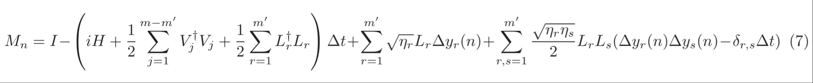
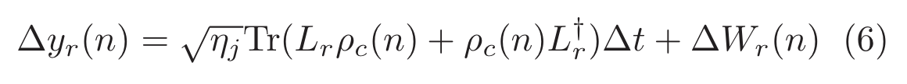
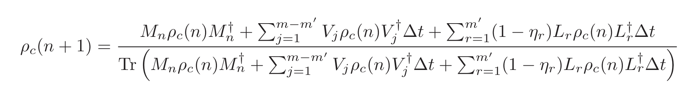

<!-- #| style: Abstract -->
The Quantum Stochastic Master Equation (SME) describes the evolution of an open quantum system interacting with its environment in a probabilistic manner. It extends the Lindblad master equation by incorporating stochastic noise, often modeled using quantum Wiener or Poisson processes. QSMEs are crucial for understanding decoherence, quantum measurement dynamics, and feedback control in quantum information processing.

Dynamical equation of the quantum system:

$d\rho =dt(-i[H,\rho ]+\sum_{i}\Gamma_{i}(V_{i}\rho \, V_{i}^{\dagger }-\frac{1}{2}\{V_{i}^{\dagger }V_{i},\rho \})+\sum_{i}\gamma_{i}(L_{i}\rho \, L_{i}^{\dagger }-\frac{1}{2}\{L_{i}^{\dagger }L_{i},\rho \}))+\sum_{i}\sqrt{\eta_{i}}dw_{i}\sqrt{\gamma_{i}}(L_{i}\, \rho +\rho \, L_{i}^{\dagger }-Tr[L_{i}\, \rho +\rho \, L_{i}^{\dagger }]\rho )$

There are jump/Lindblad operators due to the environment, denoted by $V_{i}$, that contribute only as decoherence term in the dynamical equation (deterministic) with the decoherence rate $\Gamma_{i}$. There are jump/Lindblad operators due to the monitoring of the system (with a corresponding readout), denoted by $L_{i}$, that contribute as decoherence terms and also stochastic terms in the dynamical equation, with the decoherence rate of $\gamma_{i}$ and the measurement channel efficiency of $\eta_{i}$. Their corresponding output signal reads as

$dR_{j}=\sqrt{\eta_{i}}dt\, Tr(L_{i}\rho +\rho L_{i}^{\dagger })+dw_{i}$

We have implemented the efficient numerical scheme proposed in this paper: https://arxiv.org/pdf/1410.5345 The main function for simulation is the following one:

<code>[]()[$\rho _{0}$,H,L,η,V,δt,$t_{f}$</code>] The function for manual evolution, with ρ the initial state, $H$ the Hamiltonian, $L$ the list of jump operators being monitored (and the evolution is conditioned upon their corresponding readout currents), η the readout efficiency, $V$ the list of jump operator not being monitors (e.g. environmental noise; by default it is None), δt the time increment and $t_{f}$ the final time.  We call it manual evolution because we do not use numerical features of Mathematica such as NDSolve or ItoProcess. The main reason for that is we were not able to using those functionalities while preserving important features of a Bloch sphere dynamics.

The readout currents are sowed in 𝒯.

Below examples are taken from Prof. Gabriel T. Landi’s [melt notebook](https://melt1.notion.site/Melt-2d05fca5cfa342e28cafaf6fe26e049e).

### \mathcal{L}[\rho ]=-i\, [\Omega \sigma_{x},\rho ]\, +\, \gamma \, D[\sigma_{z}] and γ >> Ω

Hamiltonian, jump operators and damping rates:

$\mathcal{L}[\rho ]=-i\, [\Omega \sigma_{x},\rho ]\, +\, \gamma \, D[\sigma_{z}]$

```wl
SeedRandom[1];Ω = 1.0;H = Ω QuantumOperator["X"];
```

Jump operators and damping rates (note they are List):

```wl
γs ={2.0};Ls ={QuantumOperator["Z"]};
```

Time increment and final time:

```wl
δt = 0.005;tf = 20.;
```

Initial state:

```wl
ρ0=QuantumState["0"];
```

Solve the Lindblad master equation for the density matrix: $\partial_{t}\rho =-i[H,\rho ]+\sum_{i}\gamma_{i}(L_{i}\rho \, L_{i}^{\dagger }-\frac{1}{2}\{L_{i}^{\dagger }L_{i},\rho \})$

```wl
ρt=QuantumEvolve[H,Ls->γs,ρ0,{t,0,tf}]
```

```wl
MatchQ[{1},None]
```

```wl
trajectory=𝒯[ρ0,H,Sqrt[γs]Ls,δt,tf];//AbsoluteTiming
```

Check if any un-physical state:

```wl
PositiveSemidefiniteMatrixQ/@trajectory//Tally
```

```wl
bloch=Table[Re@Tr[#.PauliMatrix[i]],{i,3}]&/@trajectory;
```

```wl
ListLinePlot[Transpose[bloch]]
```

For each trajectory, find Bloch vector:

```wl
Show[QuantumState["UniformMixture"]["BlochPlot"],ListLinePlot3D[bloch]]
```

### \mathcal{L}[\rho ]=-i\, [\Omega \sigma_{x},\rho ]\, +\, \gamma \, D[\sigma_{z}] and γ << Ω

Hamiltonian, jump operators and damping rates:

$\mathcal{L}[\rho ]=-i\, [\Omega \sigma_{x},\rho ]\, +\, \gamma \, D[\sigma_{z}]$

```wl
SeedRandom[1];Ω = 1.0;H = Ω QuantumOperator["X"];
```

Jump operators and damping rates (note they are List):

```wl
γs ={.1};Ls ={QuantumOperator["Z"]};
```

Time increment and final time:

```wl
δt = 0.005;tf = 20.;
```

Initial state:

```wl
ρ0=QuantumState["0"];
```

Solve the Lindblad master equation for the density matrix: $\partial_{t}\rho =-i[H,\rho ]+\sum_{i}\gamma_{i}(L_{i}\rho \, L_{i}^{\dagger }-\frac{1}{2}\{L_{i}^{\dagger }L_{i},\rho \})$

```wl
ρt=QuantumEvolve[H,Ls->γs,ρ0,{t,0,tf}]
```

Plot the evolution:

```wl
Plot[Evaluate@Re@ρt[t]["BlochVector"],{t,0,tf},PlotRange->All]
```

```wl
average=Table[Evaluate@Re[ρt[t]["BlochVector"]],{t,0,tf,δt}]//Transpose;
```

```wl
trajectory=𝒯[ρ0,H,Sqrt[γs]Ls,δt,tf];//AbsoluteTiming
```

Check if any un-physical state:

```wl
PositiveSemidefiniteMatrixQ/@trajectory//Tally
```

```wl
bloch=Table[Re@Tr[#.PauliMatrix[i]],{i,3}]&/@trajectory;
```

Visualize them:

```wl
Table[ListLinePlot[Transpose[{Range[0,tf,δt],#}]&/@{average[[i]],Transpose@bloch[[All,i]]}],{i,3}]
```

### Diffusion for spontaneous emission

Hamiltonian, jump operators and damping rates:

```wl
SeedRandom[1];Δ=1.;Ω=2.;H = 1/2(Ω QuantumOperator["X"]+Δ QuantumOperator["Z"]);
```

Jump operators and damping rates (note they are List):

```wl
γs ={.2};Ls ={QuantumOperator["J-"]};
```

Time increment and final time:

```wl
δt = 0.01;tf = 10.;
```

Initial state:

```wl
ρ0=QuantumState["+"];
```

Solve the Lindblad master equation for the density matrix: $\partial_{t}\rho =-i[H,\rho ]+\sum_{i}\gamma_{i}(L_{i}\rho \, L_{i}^{\dagger }-\frac{1}{2}\{L_{i}^{\dagger }L_{i},\rho \})$

```wl
ρt=QuantumEvolve[H,Ls->γs,ρ0,{t,0,tf}]
```

Plot the evolution:

```wl
Plot[Evaluate@Re@ρt[t]["BlochVector"],{t,0,tf},PlotRange->All]
```

```wl
average=Table[Evaluate@Re[ρt[t]["BlochVector"]],{t,0,tf,δt}]//Transpose;
```

```wl
trajectory=Table[𝒯[ρ0,H,Sqrt[γs]Ls,δt,tf],200];//AbsoluteTiming
```

Check if any un-physical state:

```wl
Map[PositiveSemidefiniteMatrixQ]/@trajectory//Flatten//Tally
```

```wl
bloch=Map[Table[Re@Tr[#.PauliMatrix[i]],{i,3}]&]/@trajectory;
```

```wl
Table[ListLinePlot[{average[[i]],Mean[(Transpose/@bloch)[[All,i,All]]]}],{i,3}]
```

### Reproducing Fig. 4.6 of Wiseman and Milburn

#### Exp #1

Hamiltonian, jump operators and damping rates:

```wl
SeedRandom[1];Δ=0;Ω=3.;H = 1/2(Ω QuantumOperator["Y"]+Δ QuantumOperator["Z"]);
```

Jump operators and damping rates (note they are List):

```wl
γs ={1};Ls ={QuantumOperator["J-"]};
```

Time increment and final time:

```wl
δt = 0.01;tf = 10.;
```

Initial state:

```wl
ρ0=QuantumState["+"];
```

Solve the Lindblad master equation for the density matrix: $\partial_{t}\rho =-i[H,\rho ]+\sum_{i}\gamma_{i}(L_{i}\rho \, L_{i}^{\dagger }-\frac{1}{2}\{L_{i}^{\dagger }L_{i},\rho \})$

```wl
ρt=QuantumEvolve[H,Ls->γs,ρ0,{t,0,tf}]
```

Plot the evolution:

```wl
Plot[Evaluate@Re@ρt[t]["BlochVector"],{t,0,tf},PlotRange->All,PlotLegends->{"x","y","z"}]
```

Manual simulation:

```wl
trajectory=𝒯[ρ0,H,Sqrt[γs]Ls,δt,tf];
```

Check if any un-physical state:

```wl
PositiveSemidefiniteMatrixQ/@trajectory//Tally
```

```wl
bloch=Table[Re@Tr[#.PauliMatrix[i]],{i,3}]&/@trajectory;
```

```wl
ListLinePlot[Transpose[{ArcTan[#1,#2],#3}&@@@bloch],PlotLegends->{"ϕ","cos[θ]"}]
```

```wl
Show[QuantumState["UniformMixture"]["BlochPlot"],ListLinePlot3D[bloch]]
```

#### Exp #2

Hamiltonian, jump operators and damping rates:

```wl
SeedRandom[1];Δ=0;Ω=3.;H = 1/2(Ω QuantumOperator["Y"]+Δ QuantumOperator["Z"]);
```

Jump operators and damping rates (note they are List):

```wl
γs ={1};Ls ={Exp[i π/2]QuantumOperator["J-"]};
```

Time increment and final time:

```wl
δt = 0.01;tf = 10.;
```

Initial state:

```wl
ρ0=QuantumState["+"];
```

Solve the Lindblad master equation for the density matrix: $\partial_{t}\rho =-i[H,\rho ]+\sum_{i}\gamma_{i}(L_{i}\rho \, L_{i}^{\dagger }-\frac{1}{2}\{L_{i}^{\dagger }L_{i},\rho \})$

```wl
ρt=QuantumEvolve[H,Ls->γs,ρ0,{t,0,tf}]
```

Plot the evolution:

```wl
Plot[Evaluate@Re@ρt[t]["BlochVector"],{t,0,tf},PlotRange->All]
```

Manual

```wl
trajectory=𝒯[ρ0,H,Sqrt[γs]Ls,δt,tf];
```

Check if any un-physical state:

```wl
PositiveSemidefiniteMatrixQ/@trajectory//Tally
```

```wl
bloch=Table[Re@Tr[#.PauliMatrix[i]],{i,3}]&/@trajectory;
```

```wl
ListLinePlot[Transpose[{ArcTan[#1,#2],#3}&@@@bloch],PlotLegends->{"ϕ","cos[θ]"}]
```

```wl
Show[QuantumState["UniformMixture"]["BlochPlot"],ListLinePlot3D[bloch]]
```

### Two-point function for the stochastic homodyne current

Hamiltonian, jump operators and damping rates:

```wl
SeedRandom[1];Δ=0;Ω=3.5;H = 1/2(Ω QuantumOperator["Y"]+Δ QuantumOperator["Z"]);
```

Jump operators and damping rates (note they are List):

```wl
γs ={.7};Ls ={QuantumOperator["J-"]};
```

Time increment and final time:

```wl
δt = 0.01;tf = 4000.;
```

Initial state:

```wl
ρ0=QuantumState["0"];
```

Generate trajectory and output currents:

```wl
{trajectory,{Is}}=Reap@𝒯[ρ0,H,Sqrt[γs]Ls,δt,tf];
```

Check if any un-physical state:

```wl
PositiveSemidefiniteMatrixQ/@trajectory//Tally
```

Since only one jump operator being monitored, only one current:

```wl
I1=Re@Transpose[Is][[1]];
```

Two point correlations:

```wl
ℱ1=TwoPointCorrelation[Chop@Flatten@Is,Floor[8/δt],δt,4];ℱ2=TwoPointCorrelation[butterworthFilter[Chop@Flatten@Is,50,δt],Round[8/δt],δt,4];
```

```wl
ListLinePlot[{ℱ1,ℱ2}]
```

## Initialization

### Install  quantum  paclet

```wl
PacletInstall["https://wolfr.am/DevWQCF",ForceVersionInstall -> True]
<<Wolfram`QuantumFramework`
```

### Manual  evolution

```wl
ClearAll[𝒯,ℛ]
```

Implementation of https://arxiv.org/pdf/1410.5345 to ensure positivity of ρ







```wl
ℛ[ρ_,L_,δt_,δw_,η_]:=MapThread[Sqrt[#3] Tr[(#1+ConjugateTranspose[#1]).ρ]δt+#2&,{L,δw,η}]
```

```wl
𝒯[ρ_,H_,L_,η_:None,V_:None,δt_,tf_]:=Module[{δw,Lmat,Vmat,Hmat,ρ0,Heff,ηm},
ηm=If[MatchQ[η,None],ConstantArray[1,Length[L]],η];ρ0=ρ["Computational"]["DensityMatrix"];Lmat=#["Computational"]["Matrix"]&/@L;Vmat=#["Computational"]["Matrix"]&/@V;Hmat=H["Computational"]["Matrix"];Heff=IdentityMatrix[2]-δt(I Hmat+.5Sum[l.l+ConjugateTranspose[l].l,{l,Lmat}]+If[MatchQ[V,None],0,.5Sum[l.l+ConjugateTranspose[l].l,{l,Vmat}]]);δw=RandomVariate[NormalDistribution[0,Sqrt[δt]],{Length[L],Floor[tf/δt]}];FoldList[Module[{M,st,Υ},Υ=Total[Sqrt[ηm]Lmat Sow@ℛ[#1,Lmat,δt,#2,ηm]];M=Heff+.5Υ.Υ+Υ;st=M.#1.ConjugateTranspose[M]+If[MatchQ[V,None],0,δt Sum[l.#1.ConjugateTranspose[l],{l,Vmat}]]+δt Sum[(1-ηm[[l]])Lmat[[l]].#1.ConjugateTranspose[Lmat[[l]]],{l,Range[Length@Lmat]}];st/Tr[st]]&,ρ0,Transpose[δw]]]
```

### Two  point  correlation and Butterworth filter

Gabriel’ s function :

```wl
Clear[TwoPointCorrelation];TwoPointCorrelation[data_,hmax_,dt_:None,steps_:1]:=Module[{𝒩=Length@data,ave = Mean[data],vec1,M,corr},vec1 = data〚1;;𝒩-hmax〛;M = Table[data〚1+i;;𝒩-hmax+i〛,{i,1,hmax,steps}];corr=1/𝒩(M.vec1-ave^2);If[dt===None,corr,{dt Range[1, hmax,steps],corr}]]
```

https://mathematica.stackexchange.com/questions/46500/data-filtering-using-butterworth-filter

```wl
Clear[butterworthFilter];butterworthFilter[data_,ωc_,dt_:1,order_:2]:=Module[{f,b},f=RecurrenceFilter[ToDiscreteTimeModel[ButterworthFilterModel[{"Lowpass",order,ωc }],dt],data];b=RecurrenceFilter[ToDiscreteTimeModel[ButterworthFilterModel[{"Lowpass",order,ωc }],dt],Reverse[data]];(f+Reverse[b])/2]
```
