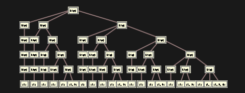
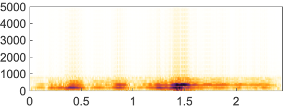

# InverseShortTimeFourier | [SpanFromLeft]

> [InverseShortTimeFourier](https://reference.wolfram.com/language/ref/InverseShortTimeFourier.html)[*input*] — reconstructs the signal from short-time Fourier data.
> [InverseShortTimeFourier](https://reference.wolfram.com/language/ref/InverseShortTimeFourier.html)[*input*,*n*] — assumes the spectrogram data was computed with partitions of length `*n*`.
> [InverseShortTimeFourier](https://reference.wolfram.com/language/ref/InverseShortTimeFourier.html)[*input*,*n*,*d*] — assumes partitions with offset `*d*`.
> [InverseShortTimeFourier](https://reference.wolfram.com/language/ref/InverseShortTimeFourier.html)[*input*,*n*,*d*,*wfun*] — assumes a smoothing window `*wfun*` was applied to each partition.

## Details and Options

[InverseShortTimeFourier](https://reference.wolfram.com/language/ref/InverseShortTimeFourier.html) computes an inverse of the short-time Fourier transform (STFT).

To compute the short-time Fourier transform of lists and audio signals, use [ShortTimeFourier](https://reference.wolfram.com/language/ref/ShortTimeFourier.html).

Possible types of `*input*` include:

*stfdata* | a [ShortTimeFourierData](https://reference.wolfram.com/language/ref/ShortTimeFourierData.html) object
*complexes* | a 2D complex matrix representing the STFT of a signal

The inverse spectrogram array can be computed from the STFT if the offset `*d*` is smaller than half the size of the partition length `*n*`.

The following options can be given:

| [FourierParameters](https://reference.wolfram.com/language/ref/FourierParameters.html) | {1,-1} | Fourier parameters to be used |
| --- | --- | --- |
| [MaxIterations](https://reference.wolfram.com/language/ref/MaxIterations.html) | [Automatic](https://reference.wolfram.com/language/ref/Automatic.html) | maximum number of iterations |
| [SampleRate](https://reference.wolfram.com/language/ref/SampleRate.html) | [Automatic](https://reference.wolfram.com/language/ref/Automatic.html) | the sample rate of the result |

## Examples

### Basic Examples

Short-time Fourier transform and its inverse of an audio signal:

```wolfram
a=Import["ExampleData/rule30.wav"]
```

```wolfram
ShortTimeFourier[a]
(* Output *)
ShortTimeFourierData[]
```

```wolfram
InverseShortTimeFourier[%]
```

### Scope

#### Data

If the input is a complex matrix, the data is assumed to be a full short-time Fourier transform:

```wolfram
InverseShortTimeFourier[]
(* Output *)
{{{0.33203125,0.3310046371230253,0.3279188812452595,0.3227748345564917,0.31558652038563756,0.3063813150878823,0.29520004433477925,0.2820969904113559,12990,0.33203125000000006,0.33203125,0.33203125,0.33203125,0.33203124999999994,0.33203125,0.33203125,0.33203125}}, {{False -> True ->, False -> True ->, False -> True ->, False -> True ->}}}
```

```wolfram
Spectrogram[%]
(* Output *)

```

Audio reconstruction from full short-time Fourier data:

```wolfram
a=ExampleData[{"Audio","Bee"},"Audio"]
```

```wolfram
sa=ShortTimeFourier[a]
(* Output *)
ShortTimeFourierData[]
```

```wolfram
InverseShortTimeFourier[sa]
```

#### Parameters

The partition size should be what was used for computing the short-time Fourier:

```wolfram
a=Audio["ExampleData/rule30.wav"];
stft=ShortTimeFourier[a,2048,512,HannWindow]
(* Output *)
ShortTimeFourierData[]
```

```wolfram
InverseShortTimeFourier[stft]
```

A different value cannot be used for the partition size:

```wolfram
InverseShortTimeFourier[stft,100]
(* Output *)
InverseShortTimeFourier[ShortTimeFourierData[],100]
```

If the input is a complex matrix, the partition size should be the same as its second dimension:

```wolfram
data=stft["Data"]
(* Output *)
{{{{-3.882600054873782+0. ⅈ,2.8700357198471713+0.948397478594273 ⅈ,1.8366802599446808-2.5000759092405382 ⅈ,-5.52959340220708+5.417497516945391 ⅈ,2041,-5.52959340220708-5.417497516945391 ⅈ,1.8366802599446808+2.5000759092405382 ⅈ,2.8700357198471713-0.948397478594273 ⅈ},154,{1}}}, {{False -> True ->, False -> True ->, False -> True ->, False -> True ->}}}
```

```wolfram
Dimensions[data]
(* Output *)
{156,2048}
```

```wolfram
InverseShortTimeFourier[data,2048]
(* Output *)
{{{6.938893903907228×10^-18,-1.8401522194899655×10^-8,-7.360591530725102×10^-8,-3.3122531872820105×10^-7,-5.888417748400876×10^-7,-4.6002938597355936×10^-7,107901,-4.6002938594406906×10^-7,-2.944208874408605×10^-7,-1.6561265937711095×10^-7,-7.360591534324654×10^-8,-1.8401522178853463×10^-8,-2.6020852139652106×10^-18}}, {{False -> True ->, False -> True ->, False -> True ->, False -> True ->}}}
```

Any other value would be rejected:

```wolfram
InverseShortTimeFourier[data,100]
(* Output *)
{{InverseShortTimeFourier[{{-3.882600054873782+0. ⅈ,2.8700357198471713+0.948397478594273 ⅈ,1.8366802599446808-2.5000759092405382 ⅈ,2042,-5.52959340220708-5.417497516945391 ⅈ,1.8366802599446808+2.5000759092405382 ⅈ,2.8700357198471713-0.948397478594273 ⅈ},154,{1}},100]}, {{False -> True ->, False -> True ->, False -> True ->, False -> True ->}}}
```

By default, the offset used for short-time Fourier is used:

```wolfram
a=Audio["ExampleData/rule30.wav"];
stft=ShortTimeFourier[a,2048,512,HannWindow];
```

```wolfram
InverseShortTimeFourier[stft,Automatic,Automatic]
```

A different partition offset can be used and will result in time stretching:

```wolfram
InverseShortTimeFourier[stft,Automatic, 256]
```

```wolfram
InverseShortTimeFourier[stft,Automatic, 1024]
```

If the input data is a matrix, by default an offset equal to 1/3 of the inferred partition size is used:

```wolfram
InverseShortTimeFourier[stft["Data"],Automatic,Automatic]//Audio
```

The smoothing window can be different from the value stored in the input data:

```wolfram
a=Audio["ExampleData/rule30.wav"];
stft=ShortTimeFourier[a,2048,512,HannWindow]
(* Output *)
ShortTimeFourierData[]
```

```wolfram
InverseShortTimeFourier[stft,Automatic, Automatic,DirichletWindow]
```

### Applications

Zero out a time interval of the short-time Fourier transform:

```wolfram
a=ExampleData[{"Audio","Bee"},"Audio"]
```

```wolfram
Spectrogram[a]
(* Output *)

```

```wolfram
stft=ShortTimeFourier[a]
(* Output *)
ShortTimeFourierData[]
```

Modify the short-time Fourier transform:

```wolfram
data=stft["Data"];
data[[300;;500,All]]=0+I;
stft["Data"]=data;
```

Perform the inverse transform:

```wolfram
InverseShortTimeFourier[stft]
```

```wolfram
Spectrogram[%]
(* Output *)

```

Zero out some frequencies in the short-time Fourier transform of an audio signal:

```wolfram
a=ExampleData[{"Audio","Bee"},"Audio"]
```

```wolfram
Spectrogram[a]
(* Output *)

```

```wolfram
stft=ShortTimeFourier[a];
```

Zero out some frequencies:

```wolfram
data=stft["Data"];
data[[All,10;;-10]]=0+I;
stft["Data"]=data;
```

Perform the inverse transform:

```wolfram
InverseShortTimeFourier[stft]
```

```wolfram
Spectrogram[%]
(* Output *)

```

## Related Guides ▪Fourier Analysis ▪Signal Visualization & Analysis ▪Audio Analysis ▪Audio Representation ▪Summation Transforms

## History Introduced in 2019 (12.0)
