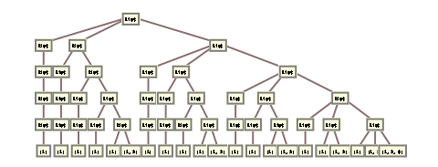
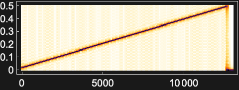
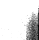
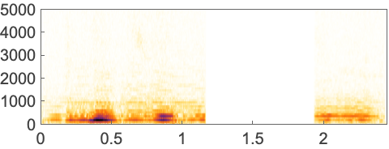

# Periodogram | [SpanFromLeft]

> [Periodogram](https://reference.wolfram.com/language/ref/Periodogram.html)[*list*]  — plots the squared magnitude of the discrete Fourier transform (power spectrum) of `*list*`.
> [Periodogram](https://reference.wolfram.com/language/ref/Periodogram.html)[*list*,*n*] — plots the mean of power spectra of non-overlapping partitions of length `*n*`.
> [Periodogram](https://reference.wolfram.com/language/ref/Periodogram.html)[*list*,*n*,*d*] — uses partitions with offset `*d*`.
> [Periodogram](https://reference.wolfram.com/language/ref/Periodogram.html)[*list*,*n*,*d*,*wfun*] — applies a smoothing window `*wfun*` to each partition.
> [Periodogram](https://reference.wolfram.com/language/ref/Periodogram.html)[*list*,*n*,*d*,*wfun*,*m*] — pads partitions with zeros to length `*m*` prior to the computation of the transform.
> [Periodogram](https://reference.wolfram.com/language/ref/Periodogram.html)[{*list*_1,*list*_2,…},*n*,*d*,*wfun*,*m*] — plots power spectra of several lists.
> [Periodogram](https://reference.wolfram.com/language/ref/Periodogram.html)[*audio*,…] — plots the power spectrum of `*audio*`.
> [Periodogram](https://reference.wolfram.com/language/ref/Periodogram.html)[*video*,…]  — plots the power spectrum of the first audio track in `*video*`.
> [Periodogram](https://reference.wolfram.com/language/ref/Periodogram.html)[{*input*_1,*input*_2,…},…] — plots the power spectra of all `*input*_*i*`.

## Details and Options

[Periodogram](https://reference.wolfram.com/language/ref/Periodogram.html) shows the frequency content of a signal by plotting the magnitude squared of the discrete Fourier transform.

In [Periodogram](https://reference.wolfram.com/language/ref/Periodogram.html)[*list*,*n*,*d*,*wfun*], the smoothing window `*wfun*` can be specified using a window function that will be sampled between $-1/2$ and $1/2$, or a list of length `*n*`. The default window is [DirichletWindow](https://reference.wolfram.com/language/ref/DirichletWindow.html), which effectively does no smoothing.

[Periodogram](https://reference.wolfram.com/language/ref/Periodogram.html)[*list*,*n*] is equivalent to [Periodogram](https://reference.wolfram.com/language/ref/Periodogram.html)[*list*,*n*,*n*,[DirichletWindow](https://reference.wolfram.com/language/ref/DirichletWindow.html),*n*].

[Periodogram](https://reference.wolfram.com/language/ref/Periodogram.html) works with numeric lists as well as [Audio](https://reference.wolfram.com/language/ref/Audio.html) and [Sound](https://reference.wolfram.com/language/ref/Sound.html) objects.

For a multichannel sound object, [Periodogram](https://reference.wolfram.com/language/ref/Periodogram.html) plots power spectra of all channels.

For real input data, [Periodogram](https://reference.wolfram.com/language/ref/Periodogram.html) displays only the first half of the power spectrum due to the symmetry property of the Fourier transform.

Compute the effective power spectrum using [PeriodogramArray](https://reference.wolfram.com/language/ref/PeriodogramArray.html).

[Periodogram](https://reference.wolfram.com/language/ref/Periodogram.html) takes the following options:

| [FourierParameters](https://reference.wolfram.com/language/ref/FourierParameters.html) | {0,1} | Fourier parameters |
| --- | --- | --- |
| [SampleRate](https://reference.wolfram.com/language/ref/SampleRate.html) | [Automatic](https://reference.wolfram.com/language/ref/Automatic.html) | the sample rate |
| [ScalingFunctions](https://reference.wolfram.com/language/ref/ScalingFunctions.html) | {"Linear",dB} | the scaling function |

With the setting [SampleRate](https://reference.wolfram.com/language/ref/SampleRate.html)->*r*, signal frequencies are shown in the range from `0 to `*r*/2

Possible settings for [ScalingFunctions](https://reference.wolfram.com/language/ref/ScalingFunctions.html) include:

[Automatic](https://reference.wolfram.com/language/ref/Automatic.html) | automatic scaling
[None](https://reference.wolfram.com/language/ref/None.html) | linear scaling for $x$ axis and absolute scaling for $y$ axis
*s*_*y* | $y$ axis scaling
{*s*_*x*} | $x$ axis scaling
{*s*_*x*,*s*_*y*} | different scaling functions for the $x$ and $y$ directions

Possible magnitude scalings `*s*_*y*` include:

"Absolute" | absolute scaling
dB | $10 log_{10}|y|^{2}$ decibel scaling (default)
{*f*,*f*^(-1)} | arbitrary scaling using the function `*f*` and its inverse

Possible frequency scalings `*s*_*x*` include:

"Linear" | linear scaling (default)
"Log10" | $log_{10}$ scaling
{*f*,*f*^(-1)} | arbitrary scaling using the function `*f*` and its inverse

The scaling function can be `dB` or `"Absolute"`, which correspond to the decibel and absolute power values, respectively.

[Periodogram](https://reference.wolfram.com/language/ref/Periodogram.html) also accepts all options of [ListLinePlot](https://reference.wolfram.com/language/ref/ListLinePlot.html).

## Examples

### Basic Examples

Power spectrum of a noisy dataset:

```wolfram
data=Table[2 Sin[0.2 π n ]+Sin[0.5 π n]+RandomReal[{-1,1}],{n,0,127}];
Periodogram[data]
```

*([Graphics])*

[Periodogram](https://reference.wolfram.com/language/ref/Periodogram.html) of a [Sound](https://reference.wolfram.com/language/ref/Sound.html) object:

```wolfram
Periodogram[ExampleData[{"Sound","Apollo11ReturnSafely"}]]
(* Output *)

```

Power spectrum of an [Audio](https://reference.wolfram.com/language/ref/Audio.html) object:

```wolfram
Periodogram[ExampleData[{"Audio","Piano"}]]
(* Output *)

```

### Scope

Bartlett's method averages over non-overlapping partitions:

```wolfram
data=Table[2 Sin[0.2 π n ]+Sin[0.35 π n]+RandomReal[{-1,1}],{n,0,255}];
Periodogram[data,64,PlotRange->All]
```

*([Graphics])*

Average overlapping partitions:

```wolfram
Periodogram[data,64,32,PlotRange->All]
```

*([Graphics])*

Welch's method averages over smoothed overlapping partitions:

```wolfram
Periodogram[data,64,32,HammingWindow,PlotRange->All]
```

*([Graphics])*

Pad each partition to increase plot density:

```wolfram
Periodogram[data,64,32,HammingWindow,256,PlotRange->All]
```

*([Graphics])*

Power spectrum of two dual-tone multi-frequency (DTMF) signals:

```wolfram
Periodogram[{Table[Sin[2 Pi 697 t]+Sin[2 Pi 1209 t],{t,0.,0.1,1/8000.}],Table[Sin[2 Pi 852 t]+Sin[2 Pi 1336 t],{t,0.,0.1,1/8000.}]}]
```

*([Graphics])*

Periodogram of a multichannel audio object:

```wolfram
a=Audio[{Table[Sin[2 π 697 t]+Sin[2 π 1209 t],{t,0.,0.3,1/8000.}],Table[Sin[2 π 941 t]+Sin[2 π 1477 t],{t,0.,0.3,1/8000.}]},SampleRate->8000]
(* Output *)

```

```wolfram
Periodogram[a]
```

*([Graphics])*

Periodogram of the audio track of a video:

```wolfram
Periodogram[[VideoBox2]]
(* Output *)

```

### Options

#### AspectRatio

By default, [Periodogram](https://reference.wolfram.com/language/ref/Periodogram.html) uses a fixed height-to-width ratio for the plot:

```wolfram
Periodogram[CompressedData[...]]
```

*([Graphics])*

Make the height the same as the width with [AspectRatio](https://reference.wolfram.com/language/ref/AspectRatio.html)->1:

```wolfram
Periodogram[CompressedData[...],AspectRatio->1]
```

*([Graphics])*

[AspectRatio](https://reference.wolfram.com/language/ref/AspectRatio.html)->[Full](https://reference.wolfram.com/language/ref/Full.html) adjusts the height and width to tightly fit inside other constructs:

```wolfram
plot=Periodogram[CompressedData[...],AspectRatio->Full];
```

```wolfram
{Framed[Pane[plot,{50,100}]],Framed[Pane[plot,{100,100}]],Framed[Pane[plot,{100,50}]]}
(* Output *)
{[Graphics],[Graphics],[Graphics]}
```

#### Axes

By default, [Axes](https://reference.wolfram.com/language/ref/Axes.html) are drawn:

```wolfram
Periodogram[CompressedData[...]]
```

*([Graphics])*

Use [Axes](https://reference.wolfram.com/language/ref/Axes.html)->[False](https://reference.wolfram.com/language/ref/False.html) to turn off axes:

```wolfram
Periodogram[CompressedData[...],Axes->False]
```

*([Graphics])*

Turn on each axis individually:

```wolfram
{Periodogram[CompressedData[...],Axes->{True,False}],Periodogram[CompressedData[...],Axes->{False,True}]}
(* Output *)
{[Graphics],[Graphics]}
```

#### AxesLabel

No axes labels are drawn by default:

```wolfram
Periodogram[CompressedData[...]]
```

*([Graphics])*

Place a label on the $y$ axis:

```wolfram
Periodogram[CompressedData[...],AxesLabel->"Squared magnitude of the DFT"]
```

*([Graphics])*

Specify axes labels:

```wolfram
Periodogram[CompressedData[...],AxesLabel->{label1,label2}]
```

*([Graphics])*

#### AxesOrigin

The position of the axes is determined automatically:

```wolfram
Periodogram[CompressedData[...]]
```

*([Graphics])*

Specify an explicit origin for the axes:

```wolfram
Periodogram[CompressedData[...],AxesOrigin->{.2,0}]
```

*([Graphics])*

#### AxesStyle

Change the style for the axes:

```wolfram
Periodogram[CompressedData[...],AxesStyle->Red]
```

*([Graphics])*

Specify the style of each axis:

```wolfram
Periodogram[CompressedData[...],AxesStyle->{{Thick,Red},{Thick,Blue}}]
```

*([Graphics])*

Use different styles for the ticks and the axes:

```wolfram
Periodogram[CompressedData[...],AxesStyle->Green,TicksStyle->Red]
```

*([Graphics])*

#### DataRange

Use [DataRange](https://reference.wolfram.com/language/ref/DataRange.html) to display the power spectrum on the normalized frequency range `{0,[Pi](https://reference.wolfram.com/language/ref/Pi.html)}` radians per unit time:

```wolfram
data=Table[ Sin[n]+RandomReal[{-1,1}],{n,0,127}];
Periodogram[data, DataRange->#, ScalingFunctions->"Absolute",PlotRange->All]&/@{Automatic,{0, Pi}}
(* Output *)
{[Graphics],[Graphics]}
```

#### FourierParameters

Changing the `a` parameter in [FourierParameters](https://reference.wolfram.com/language/ref/FourierParameters.html) will change the scaling:

```wolfram
data=Table[ Sin[n]+RandomReal[{-1,1}],{n,0,127}];
```

```wolfram
Table[Periodogram[data,ScalingFunctions->"Absolute",FourierParameters->{a,1},PlotRange->All],{a,{0,1}}]
(* Output *)
{[Graphics],[Graphics]}
```

#### ImageSize

Use named sizes such as [Tiny](https://reference.wolfram.com/language/ref/Tiny.html), [Small](https://reference.wolfram.com/language/ref/Small.html), [Medium](https://reference.wolfram.com/language/ref/Medium.html) and [Large](https://reference.wolfram.com/language/ref/Large.html):

```wolfram
{Periodogram[CompressedData[...],ImageSize->Tiny],Periodogram[CompressedData[...],ImageSize->Small]}
(* Output *)
{[Graphics],[Graphics]}
```

Specify the width of the plot:

```wolfram
{Periodogram[CompressedData[...],ImageSize->150],Periodogram[CompressedData[...],AspectRatio->1.5,ImageSize->150]}
(* Output *)
{[Graphics],[Graphics]}
```

Specify the height of the plot:

```wolfram
{Periodogram[CompressedData[...],ImageSize->{Automatic,150}],Periodogram[CompressedData[...],AspectRatio->2,ImageSize->{Automatic,150}]}
(* Output *)
{[Graphics],[Graphics]}
```

Allow the width and height to be up to a certain size:

```wolfram
{Periodogram[CompressedData[...],ImageSize->UpTo[200]],Periodogram[CompressedData[...],AspectRatio->2,ImageSize->UpTo[200]]}
(* Output *)
{[Graphics],[Graphics]}
```

Specify the width and height for a graphic, padding with space if necessary:

```wolfram
Periodogram[CompressedData[...],ImageSize->{200,200},Background->StandardYellow]
```

*([Graphics])*

Setting [AspectRatio](https://reference.wolfram.com/language/ref/AspectRatio.html)->[Full](https://reference.wolfram.com/language/ref/Full.html) will fill the available space:

```wolfram
Periodogram[CompressedData[...],AspectRatio->Full,ImageSize->{200,200},Background->StandardYellow]
```

*([Graphics])*

Use maximum sizes for the width and height:

```wolfram
{Periodogram[CompressedData[...],ImageSize->{UpTo[150],UpTo[100]}],Periodogram[CompressedData[...],AspectRatio->2,ImageSize->{UpTo[150],UpTo[100]}]}
(* Output *)
{[Graphics],[Graphics]}
```

Use [ImageSize](https://reference.wolfram.com/language/ref/ImageSize.html)->[Full](https://reference.wolfram.com/language/ref/Full.html) to fill the available space in an object:

```wolfram
Framed[Pane[Periodogram[CompressedData[...],ImageSize->Full,Background->StandardYellow],{200,100}]]
```

*([Graphics])*

Specify the image size as a fraction of the available space:

```wolfram
Framed[Pane[Periodogram[CompressedData[...],AspectRatio->Full,ImageSize->{Scaled[0.5],Scaled[0.5]},Background->StandardYellow],{200,100}]]
```

*([Graphics])*

#### SampleRate

By default, [Periodogram](https://reference.wolfram.com/language/ref/Periodogram.html) assumes a sampling rate of one sample per time unit:

```wolfram
data=Table[2 Sin[0.2 π n ]+Sin[0.5 π n]+RandomReal[{-1,1}],{n,0,127}];
Periodogram[data]
```

*([Graphics])*

Specify a different sample rate:

```wolfram
Periodogram[data,SampleRate->8]
```

*([Graphics])*

#### ScalingFunctions

By default, [Periodogram](https://reference.wolfram.com/language/ref/Periodogram.html) shows the decibel values of magnitude:

```wolfram
data = Table[Sin[ n]+Sin[2.5 n], {n,0,800}];
Periodogram[data]
```

*([Graphics])*

Show the absolute values of the periodogram magnitude:

```wolfram
Periodogram[data,ScalingFunctions->"Absolute"]
```

*([Graphics])*

#### Ticks

Ticks are placed automatically in each plot:

```wolfram
Periodogram[CompressedData[...]]
```

*([Graphics])*

Use [Ticks](https://reference.wolfram.com/language/ref/Ticks.html)->[None](https://reference.wolfram.com/language/ref/None.html) to not draw any tick marks:

```wolfram
Periodogram[CompressedData[...],Ticks->None]
```

*([Graphics])*

Place tick marks at specific positions:

```wolfram
Periodogram[CompressedData[...],Ticks->{{.1,.3,.4},{-20,-5,15}}]
```

*([Graphics])*

Draw tick marks at the specified positions with the specified labels:

```wolfram
Periodogram[CompressedData[...],Ticks->{{{.1,a},{.3,b},{.4,c}},{{-20,-d},{-5,-e},{15,f}}}]
```

*([Graphics])*

#### TicksStyle

Specify the overall tick style, including the tick labels:

```wolfram
Periodogram[CompressedData[...],TicksStyle->Directive[Red, Thick]]
```

*([Graphics])*

Specify the overall tick style for each of the axes:

```wolfram
Periodogram[CompressedData[...],TicksStyle->{Directive[Blue, Thick],Directive[Red, Thick]}]
```

*([Graphics])*

Specify tick marks with scaled lengths:

```wolfram
Periodogram[CompressedData[...],Ticks->{{{.1,a,.2},{.3,b,{0,.07}},{.4,c,{0,.14}}},{{-20,-d,.03},{-5,-e,.1},{15,f,.19}}}]
```

*([Graphics])*

Customize each tick with position, length, labeling and styling:

```wolfram
Periodogram[CompressedData[...],Ticks->{{{.1,a,.2,Directive[Red,Thick]},{.3,b,{0,.07},Directive[Red,Thick]},{.4,c,{0,.14},Directive[Red,Thick]}},{{-20,-d,.03,Directive[Blue,Thick]},{-5,-e,.1,Directive[Red,Thick]},{15,f,.19,Directive[Red,Thick,Dashed]}}}]
```

*([Graphics])*

### Properties & Relations

[Periodogram](https://reference.wolfram.com/language/ref/Periodogram.html) plots the magnitude squared of the Fourier transform:

```wolfram
data=Table[2 Sin[0.2 π n]+Sin[0.5 π n]+RandomReal[{-1,1}],{n,0,127}];
{Periodogram[data],ListLinePlot[Take[20Log[10,Abs[Fourier[data]]],64],DataRange->{0.,0.5}]}
(* Output *)
{[Graphics],[Graphics]}
```

### Possible Issues

When an explicit [DataRange](https://reference.wolfram.com/language/ref/DataRange.html) is specified, the [SampleRate](https://reference.wolfram.com/language/ref/SampleRate.html) setting is ignored:

```wolfram
data=Table[2 Sin[0.2 π n]+Sin[0.5 π n]+RandomReal[{-1,1}],{n,0,127}];
Periodogram[data,SampleRate->1,DataRange->{0,Pi},PlotRange->All]
```

*([Graphics])*

For very large partitions with a smoothing window, timing is increased due to sampling of the window:

```wolfram
list=RandomReal[1,1000000];
```

```wolfram
AbsoluteTiming[Periodogram[list,100000,Automatic,HannWindow]]
(* Output *)

```

Specify a smaller partition size:

```wolfram
AbsoluteTiming[Periodogram[list,1000,Automatic,HannWindow]]
(* Output *)
{0.1483016,[Graphics]}
```

Timing will be even worse with no partitioning:

```wolfram
AbsoluteTiming[Periodogram[list,Automatic,Automatic,HannWindow]]
(* Output *)

```

## Related Guides ▪Fourier Analysis ▪Signal Visualization & Analysis ▪Signal Processing ▪Audio Analysis ▪Summation Transforms ▪Audio Representation ▪Video Analysis ▪Speech Computation ▪Audio Processing ▪Signal Transforms ▪Video Computation: Update History

## History Introduced in 2012 (9.0) | Updated in 2014 (10.0) ▪ 2016 (11.0) ▪ 2024 (14.1)
