# ShortTimeFourier | [SpanFromLeft]

> [ShortTimeFourier](https://reference.wolfram.com/language/ref/ShortTimeFourier.html)[*data*]  — returns the short-time Fourier transform (STFT) of `*data*` as a [ShortTimeFourierData](https://reference.wolfram.com/language/ref/ShortTimeFourierData.html) object.
> [ShortTimeFourier](https://reference.wolfram.com/language/ref/ShortTimeFourier.html)[*data*,*n*] — uses partitions of length `*n*`.
> [ShortTimeFourier](https://reference.wolfram.com/language/ref/ShortTimeFourier.html)[*data*,*n*,*d*] — uses partitions with offset `*d*`.
> [ShortTimeFourier](https://reference.wolfram.com/language/ref/ShortTimeFourier.html)[*data*,*n*,*d*,*wfun*] — applies a smoothing window `*wfun*` to each partition.
> [ShortTimeFourier](https://reference.wolfram.com/language/ref/ShortTimeFourier.html)[*data*,*n*,*d*,*wfun*,*m*] — pads partitions with zeros to length `*m*` prior to the computation of the transform.

## Details and Options

The short-time Fourier transform (STFT) is a time-frequency representation of a signal and is typically used for transforming, filtering and analyzing the signal in both time and frequency.

[ShortTimeFourier](https://reference.wolfram.com/language/ref/ShortTimeFourier.html)[*data*] computes the discrete Fourier transform (DFT) of partitions of `*data*` and returns a [ShortTimeFourierData](https://reference.wolfram.com/language/ref/ShortTimeFourierData.html) object.

Use [Spectrogram](https://reference.wolfram.com/language/ref/Spectrogram.html) on `*data*` or on the resulting [ShortTimeFourierData](https://reference.wolfram.com/language/ref/ShortTimeFourierData.html) object to plot the spectrogram.

[ShortTimeFourier](https://reference.wolfram.com/language/ref/ShortTimeFourier.html)[*data*] uses partitions of length $n=2^Round[log_{2}(\sqrt{m})+1]$ and offset $d=Round[n/3]$, where $m$ is [Length](https://reference.wolfram.com/language/ref/Length.html)[*data*].

The partition length `*n*` and offset `*d*` can be expressed as integer numbers (interpreted as number of samples) or as time or sample quantities.

If necessary, fixed padding is used on the right to make all the partitions the same size.

In [ShortTimeFourier](https://reference.wolfram.com/language/ref/ShortTimeFourier.html)[*data*,*n*,*d*,*wfun*], the smoothing window `*wfun*` can be specified using a window function that will be sampled between $-1/2$ and $1/2$ or a list of length `*n*`. The default window is [DirichletWindow](https://reference.wolfram.com/language/ref/DirichletWindow.html), which effectively does no smoothing.

The `*data*` can be any of the following:

*list* | a vector of numerical data
*audio* | an [Audio](https://reference.wolfram.com/language/ref/Audio.html) or [Sound](https://reference.wolfram.com/language/ref/Sound.html) object
*video* | a [Video](https://reference.wolfram.com/language/ref/Video.html) object

For multichannel audio objects, the transform is computed over the sum of all channels.

[ShortTimeFourier](https://reference.wolfram.com/language/ref/ShortTimeFourier.html) accepts the [FourierParameters](https://reference.wolfram.com/language/ref/FourierParameters.html) option. The default setting is [FourierParameters](https://reference.wolfram.com/language/ref/FourierParameters.html)->{1,-1}.

## Examples

### Basic Examples

Short-time Fourier transform of a sine wave:

```wolfram
ShortTimeFourier[{0,(1)/(Sqrt[2]),-1,(1)/(Sqrt[2]),0,-(1)/(Sqrt[2]),1,-(1)/(Sqrt[2])},4]
(* Output *)
ShortTimeFourierData[...]
```

Short-time Fourier transform of an audio signal:

```wolfram
ShortTimeFourier[,2048]
(* Output *)
ShortTimeFourierData[]
```

Plot the result:

```wolfram
Spectrogram[%]
(* Output *)

```

### Scope

#### Data

Short-time Fourier transform of an audio recording:

```wolfram
ShortTimeFourier[Import["ExampleData/rule30.wav"]]
(* Output *)
ShortTimeFourierData[]
```

Short-time Fourier transform of an array:

```wolfram
ShortTimeFourier[RandomReal[1,100]]
(* Output *)
ShortTimeFourierData[...]
```

Short-time Fourier transform of the audio track of a video:

```wolfram
ShortTimeFourier[[VideoBox2]]
(* Output *)
ShortTimeFourierData[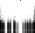]
```

#### Parameters

By default, an automatic partition size is used:

```wolfram
data=Table[Sin[.5n ],{n,0.,100.}];
ShortTimeFourier[data]
(* Output *)
ShortTimeFourierData[...]
```

Specify the number of samples in each partition:

```wolfram
ShortTimeFourier[data,10]
(* Output *)
ShortTimeFourierData[...]
```

Specify the partition size using a time [Quantity](https://reference.wolfram.com/language/ref/Quantity.html):

```wolfram
data=ExampleData[{"Audio","MaleVoice"}];
ShortTimeFourier[data,30]
(* Output *)
ShortTimeFourierData[]
```

By default, an automatic partition offset is used:

```wolfram
data=Table[Sin[.5n ],{n,0.,100.}];
ShortTimeFourier[data,10]
(* Output *)
ShortTimeFourierData[...]
```

Specify the offset using the number of samples:

```wolfram
ShortTimeFourier[data,10,2]
(* Output *)
ShortTimeFourierData[...]
```

Specify the offset using a time [Quantity](https://reference.wolfram.com/language/ref/Quantity.html):

```wolfram
data=ExampleData[{"Audio","MaleVoice"}];
ShortTimeFourier[data,30,10]
(* Output *)
ShortTimeFourierData[]
```

Use [Scaled](https://reference.wolfram.com/language/ref/Scaled.html) to specify offset relative to the partition size:

```wolfram
data=ExampleData[{"Audio","MaleVoice"}];
ShortTimeFourier[data,30,Scaled[1/3]]
(* Output *)
ShortTimeFourierData[]
```

By default, no smoothing is applied to partitions:

```wolfram
data=Table[Sin[.5n ],{n,0.,100.}];
ShortTimeFourier[data,10,2]
(* Output *)
ShortTimeFourierData[...]
```

Using [None](https://reference.wolfram.com/language/ref/None.html) or [DirichletWindow](https://reference.wolfram.com/language/ref/DirichletWindow.html) is equivalent to no smoothing:

```wolfram
ShortTimeFourier[data,10,2,None]
(* Output *)
ShortTimeFourierData[...]
```

Use a [HannWindow](https://reference.wolfram.com/language/ref/HannWindow.html) as smoothing window function:

```wolfram
ShortTimeFourier[data,10,2,HannWindow]
(* Output *)
ShortTimeFourierData[...]
```

Use a precomputed list as smoothing window function:

```wolfram
window=Array[Sin,10,{0.,Pi}];
ShortTimeFourier[data,10,2,window]
(* Output *)
ShortTimeFourierData[...]
```

By default, partitions are not padded:

```wolfram
data=Table[Sin[.5n ],{n,0.,100.}];
ShortTimeFourier[data,10,2,HannWindow]
(* Output *)
ShortTimeFourierData[...]
```

Pad each partition to be 20 samples long:

```wolfram
ShortTimeFourier[data,10,2,HannWindow,20]
(* Output *)
ShortTimeFourierData[...]
```

Specify padding using a time [Quantity](https://reference.wolfram.com/language/ref/Quantity.html):

```wolfram
data=ExampleData[{"Audio","MaleVoice"}];
ShortTimeFourier[data,30,10,HannWindow,50]
(* Output *)
ShortTimeFourierData[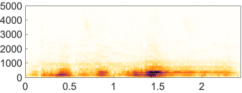]
```

### Options

#### FourierParameters

No normalization:

```wolfram
a=ShortTimeFourier[{1,0,1,0,0,1,0,0,0,1},FourierParameters->{1,1}];
a["Data"]
(* Output *)
{{3.+0. ⅈ,0.2928932188134524+0.2928932188134524 ⅈ,0.+1. ⅈ,1.7071067811865475-1.7071067811865475 ⅈ,1.+0. ⅈ,1.7071067811865475+1.7071067811865475 ⅈ,0.-1. ⅈ,0.2928932188134524-0.2928932188134524 ⅈ},{3.+0. ⅈ,0.7071067811865476-0.7071067811865476 ⅈ,-2.-1. ⅈ,-0.7071067811865476-0.7071067811865476 ⅈ,1.+0. ⅈ,-0.7071067811865476+0.7071067811865476 ⅈ,-2.+1. ⅈ,0.7071067811865476+0.7071067811865476 ⅈ},{5.+0. ⅈ,-1.7071067811865475-1.7071067811865475 ⅈ,0.-1. ⅈ,-0.2928932188134524+0.2928932188134524 ⅈ,-1.+0. ⅈ,-0.2928932188134524-0.2928932188134524 ⅈ,0.+1. ⅈ,-1.7071067811865475+1.7071067811865475 ⅈ},{8.,0.,0.,0.,0.,0.,0.,0.}}
```

Normalization by $1/\sqrt{n}$:

```wolfram
a=ShortTimeFourier[{1,0,1,0,0,1,0,0,0,1},FourierParameters->{0, 1}];
a["Data"]
(* Output *)
{{1.0606601717798212+0. ⅈ,0.10355339059327373+0.10355339059327373 ⅈ,0.+0.35355339059327373 ⅈ,0.6035533905932737-0.6035533905932737 ⅈ,0.35355339059327373+0. ⅈ,0.6035533905932737+0.6035533905932737 ⅈ,0.-0.35355339059327373 ⅈ,0.10355339059327373-0.10355339059327373 ⅈ},{1.0606601717798212+0. ⅈ,0.25-0.25 ⅈ,-0.7071067811865475-0.35355339059327373 ⅈ,-0.25-0.25 ⅈ,0.35355339059327373+0. ⅈ,-0.25+0.25 ⅈ,-0.7071067811865475+0.35355339059327373 ⅈ,0.25+0.25 ⅈ},{1.7677669529663687+0. ⅈ,-0.6035533905932737-0.6035533905932737 ⅈ,0.-0.35355339059327373 ⅈ,-0.10355339059327373+0.10355339059327373 ⅈ,-0.35355339059327373+0. ⅈ,-0.10355339059327373-0.10355339059327373 ⅈ,0.+0.35355339059327373 ⅈ,-0.6035533905932737+0.6035533905932737 ⅈ},{2.82842712474619,0.,0.,0.,0.,0.,0.,0.}}
```

```wolfram
%Sqrt[a["PartitionSize"]]
(* Output *)
{{3.+0. ⅈ,0.2928932188134524+0.2928932188134524 ⅈ,0.+1. ⅈ,1.7071067811865475-1.7071067811865475 ⅈ,1.+0. ⅈ,1.7071067811865475+1.7071067811865475 ⅈ,0.-1. ⅈ,0.2928932188134524-0.2928932188134524 ⅈ},{3.+0. ⅈ,0.7071067811865476-0.7071067811865476 ⅈ,-2.-1. ⅈ,-0.7071067811865476-0.7071067811865476 ⅈ,1.+0. ⅈ,-0.7071067811865476+0.7071067811865476 ⅈ,-2.+1. ⅈ,0.7071067811865476+0.7071067811865476 ⅈ},{5.+0. ⅈ,-1.7071067811865475-1.7071067811865475 ⅈ,0.-1. ⅈ,-0.2928932188134524+0.2928932188134524 ⅈ,-1.+0. ⅈ,-0.2928932188134524-0.2928932188134524 ⅈ,0.+1. ⅈ,-1.7071067811865475+1.7071067811865475 ⅈ},{8.,0.,0.,0.,0.,0.,0.,0.}}
```

Normalization by $1/n$:

```wolfram
a=ShortTimeFourier[{1,0,1,0,0,1,0,0,0,1},FourierParameters->{-1,1}];
a["Data"]
(* Output *)
{{0.375+0. ⅈ,0.03661165235168155+0.03661165235168155 ⅈ,0.+0.125 ⅈ,0.21338834764831843-0.21338834764831843 ⅈ,0.125+0. ⅈ,0.21338834764831843+0.21338834764831843 ⅈ,0.-0.125 ⅈ,0.03661165235168155-0.03661165235168155 ⅈ},{0.375+0. ⅈ,0.08838834764831845-0.08838834764831845 ⅈ,-0.25-0.125 ⅈ,-0.08838834764831845-0.08838834764831845 ⅈ,0.125+0. ⅈ,-0.08838834764831845+0.08838834764831845 ⅈ,-0.25+0.125 ⅈ,0.08838834764831845+0.08838834764831845 ⅈ},{0.625+0. ⅈ,-0.21338834764831843-0.21338834764831843 ⅈ,0.-0.125 ⅈ,-0.03661165235168155+0.03661165235168155 ⅈ,-0.125+0. ⅈ,-0.03661165235168155-0.03661165235168155 ⅈ,0.+0.125 ⅈ,-0.21338834764831843+0.21338834764831843 ⅈ},{1.,0.,0.,0.,0.,0.,0.,0.}}
```

### Applications

Compute the full short-time Fourier transform of a signal:

```wolfram
chirp=Table[Cos[200. π t+2400. π t^2],{t,0.,1.6,1/8000.}];stft=ShortTimeFourier[chirp]
(* Output *)
ShortTimeFourierData[...]
```

Plot of the magnitude of the [ShortTimeFourier](https://reference.wolfram.com/language/ref/ShortTimeFourier.html) data:

```wolfram
Spectrogram[stft]
(* Output *)

```

Apply a smoothing window function:

```wolfram
ShortTimeFourier[chirp,Automatic,Automatic,HannWindow]//Spectrogram
(* Output *)

```

Magnitude spectrum of a single partition:

```wolfram
ListLinePlot[Abs[stft["Data"][[30]]]]
```

*([Graphics])*

Compute the full short-time Fourier transform of a signal:

```wolfram
a=Import["ExampleData/rule30.wav"];
stft=ShortTimeFourier[a,1024,512,HannWindow]
(* Output *)
ShortTimeFourierData[]
```

Compute the magnitude spectrogram:

```wolfram
spectrogram=Abs[stft["Data"][[All,;;Floor[stft["PartitionSize"]/2+1]]]];
spectrogram//MatrixPlot
(* Output *)
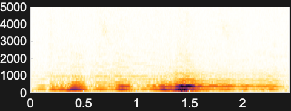
```

Compute the power spectrogram:

```wolfram
powerSpectrogram=spectrogram^2;
powerSpectrogram//MatrixPlot
(* Output *)
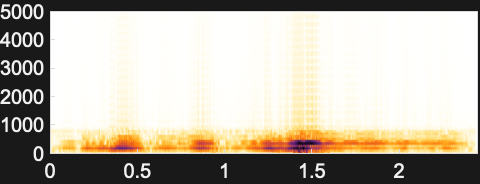
```

Compute the power spectrogram in decibels:

```wolfram
dbSpectrogram=20Log10[powerSpectrogram];
dbSpectrogram//MatrixPlot
(* Output *)
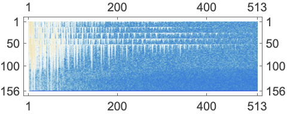
```

Compute the forward and inverse short-time Fourier transform of a signal:

```wolfram
chirp=Table[Sin[ π t+10. π t^2],{t,0.,1.6,1/200.}];
chirp//ListLinePlot
```

*([Graphics])*

Compute the short-time Fourier transform:

```wolfram
stft=ShortTimeFourier[chirp,100,10,HannWindow]
(* Output *)
ShortTimeFourierData[...]
```

Approximate the inverse using [InverseShortTimeFourier](https://reference.wolfram.com/language/ref/InverseShortTimeFourier.html):

```wolfram
InverseShortTimeFourier[stft][[;;Length[chirp]]]//ListLinePlot
```

*([Graphics])*

Denoise a chirp signal:

```wolfram
chirp=Table[Sin[ π t+10. π t^2]+RandomReal[],{t,0.,1.6,1/200.}];
chirp//ListLinePlot
```

*([Graphics])*

Compute the full short-time Fourier transform of the signal:

```wolfram
stft=ShortTimeFourier[chirp,100,10,HannWindow];
stft//Spectrogram
(* Output *)
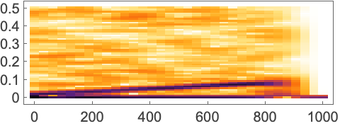
```

Define a nonlinear function to squash low-amplitude components:

```wolfram
g[value_]:=(value Abs[value])/(Abs[value]+20)
Plot[g[x],{x,0,10}]
```

*([Graphics])*

Apply the function to the short-time Fourier transform data:

```wolfram
stft["Data"]=Map[g,stft["Data"],{2}];
stft//Spectrogram
(* Output *)
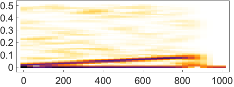
```

Invert the short-time Fourier transform using [InverseShortTimeFourier](https://reference.wolfram.com/language/ref/InverseShortTimeFourier.html):

```wolfram
InverseShortTimeFourier[stft][[;;Length[chirp]]]//ListLinePlot
```

*([Graphics])*

Change the speed of an audio recording using different STFT partition offsets:

```wolfram
a=;
stft=ShortTimeFourier[a,1024,128,HannWindow];
```

Change the `"PartitionOffset"` property:

```wolfram
stft["PartitionOffset"]=100
(* Output *)
ShortTimeFourierData[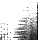]
```

Compute the inverse short-time Fourier transform to speed up the recording:

```wolfram
InverseShortTimeFourier[stft]
```

Slow down an audio signal by resampling the short-time Fourier transform:

```wolfram
a=;
```

```wolfram
stft=ShortTimeFourier[a,1024,128,HannWindow]
(* Output *)
ShortTimeFourierData[]
```

Resample the data:

```wolfram
stft["Data"]=ArrayResample[stft["Data"],{300,1024}];
```

Compute the inverse short-time Fourier transform to get a slowed-down version of the original:

```wolfram
InverseShortTimeFourier[stft]
```

### Properties & Relations

Short-time Fourier transform data is the same as the values computed by [SpectrogramArray](https://reference.wolfram.com/language/ref/SpectrogramArray.html):

```wolfram
data=RandomReal[1,200];
```

```wolfram
ShortTimeFourier[data,100,10,HannWindow]["Data"]==SpectrogramArray[data,100,10,HannWindow]
(* Output *)
True
```

[Spectrogram](https://reference.wolfram.com/language/ref/Spectrogram.html) of the [ShortTimeFourier](https://reference.wolfram.com/language/ref/ShortTimeFourier.html) is equivalent to [Spectrogram](https://reference.wolfram.com/language/ref/Spectrogram.html) of the original signal:

```wolfram
chirp=Table[Sin[ π t+10. π t^2],{t,0.,1.6,1/200.}];
```

```wolfram
ShortTimeFourier[chirp,100,10,HannWindow]//Spectrogram
(* Output *)
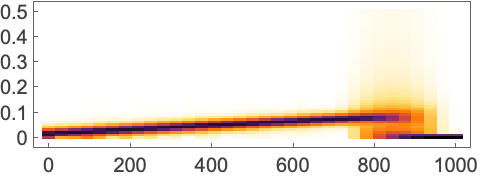
```

```wolfram
Spectrogram[chirp,100,10,HannWindow]
(* Output *)
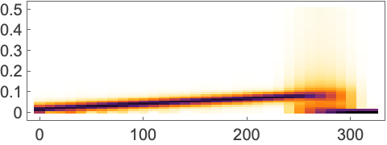
```

Notice that the default partitioning parameters are different:

```wolfram
Spectrogram[#,FrameTicks->False]&/@{chirp,ShortTimeFourier[chirp]}
(* Output *)
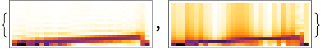
```

## Related Guides ▪Fourier Analysis ▪Audio Analysis ▪Signal Visualization & Analysis ▪Signal Processing ▪Audio Processing ▪Signal Transforms ▪Audio Representation ▪Video Analysis ▪Speech Computation ▪Summation Transforms

## History Introduced in 2019 (12.0) | Updated in 2024 (14.1)
