# Spectrogram | [SpanFromLeft]

> [Spectrogram](https://reference.wolfram.com/language/ref/Spectrogram.html)[*list*]  — plots the spectrogram of `*list*`.
> [Spectrogram](https://reference.wolfram.com/language/ref/Spectrogram.html)[*list*,*n*] — uses partitions of length `*n*`.
> [Spectrogram](https://reference.wolfram.com/language/ref/Spectrogram.html)[*list*,*n*,*d*] — uses partitions with offset `*d*`.
> [Spectrogram](https://reference.wolfram.com/language/ref/Spectrogram.html)[*list*,*n*,*d*,*wfun*] — applies a smoothing window `*wfun*` to each partition.
> [Spectrogram](https://reference.wolfram.com/language/ref/Spectrogram.html)[*list*,*n*,*d*,*wfun*,*m*] — pads partitions with zeros to length `*m*` prior to the computation of the transform.
> [Spectrogram](https://reference.wolfram.com/language/ref/Spectrogram.html)[*audio*,…] — plots the spectrogram of `*audio*`.
> [Spectrogram](https://reference.wolfram.com/language/ref/Spectrogram.html)[*video*]  — plots the spectrogram of the first audio track in `*video*`.

## Details and Options

Spectrogram is also known as time-frequency plot.

A spectrogram is a common visualization technique that shows how the frequency content of a signal changes over time.

[Spectrogram](https://reference.wolfram.com/language/ref/Spectrogram.html) plots the magnitude of the short-time Fourier transform (STFT), computed as a discrete Fourier transform (DFT) of partitions of data.

Compute the short-time Fourier transform of `*list*` using [ShortTimeFourier](https://reference.wolfram.com/language/ref/ShortTimeFourier.html).

[Spectrogram](https://reference.wolfram.com/language/ref/Spectrogram.html)[*list*] uses partitions of length $n=2^Round[log_{2}(\sqrt{m})+1]$ and offset $d=Round[n/3]$, where `*m*` is [Length](https://reference.wolfram.com/language/ref/Length.html)[*list*].

The partition length `*n*` and offset `*d*` can be expressed as an integer number (interpreted as number of samples) or as time or sample quantities.

If necessary, fixed padding is used on the right to make all the partitions the same size.

[Spectrogram](https://reference.wolfram.com/language/ref/Spectrogram.html) displays only the first half of the magnitude of the discrete Fourier transform due to the symmetry property of the transform.

In [Spectrogram](https://reference.wolfram.com/language/ref/Spectrogram.html)[*list*,*n*,*d*,*wfun*], the smoothing window `*wfun*` can be specified using a window function that will be sampled between $-1/2$ and $1/2$ or a list of length `*n*`. The default window is [DirichletWindow](https://reference.wolfram.com/language/ref/DirichletWindow.html), which effectively does no smoothing.

[Spectrogram](https://reference.wolfram.com/language/ref/Spectrogram.html) works with numeric lists as well as [Audio](https://reference.wolfram.com/language/ref/Audio.html) and [Sound](https://reference.wolfram.com/language/ref/Sound.html) objects.

For multichannel sound objects, the spectrogram is computed over the sum of all channels.

[Spectrogram](https://reference.wolfram.com/language/ref/Spectrogram.html) accepts all [ArrayPlot](https://reference.wolfram.com/language/ref/ArrayPlot.html) options with the following additions and changes: [List of all options]

| [AspectRatio](https://reference.wolfram.com/language/ref/AspectRatio.html) | 1/3 | ratio of height to width |
| --- | --- | --- |
| [ColorFunction](https://reference.wolfram.com/language/ref/ColorFunction.html) | [Automatic](https://reference.wolfram.com/language/ref/Automatic.html) | how each cell should be colored |
| [FrameTicks](https://reference.wolfram.com/language/ref/FrameTicks.html) | [Automatic](https://reference.wolfram.com/language/ref/Automatic.html) | what ticks to include on the frame |
| [MaxPlotPoints](https://reference.wolfram.com/language/ref/MaxPlotPoints.html) | [Automatic](https://reference.wolfram.com/language/ref/Automatic.html) | the maximum number of points to include |
| [Method](https://reference.wolfram.com/language/ref/Method.html) | [Automatic](https://reference.wolfram.com/language/ref/Automatic.html) | method used for frequency binning |
| [PlotRange](https://reference.wolfram.com/language/ref/PlotRange.html) | [Automatic](https://reference.wolfram.com/language/ref/Automatic.html) | the range of values to plot |
| [SampleRate](https://reference.wolfram.com/language/ref/SampleRate.html) | [Automatic](https://reference.wolfram.com/language/ref/Automatic.html) | sampling rate assumed for the input list |

Possible settings for [Method](https://reference.wolfram.com/language/ref/Method.html) include:

[Automatic](https://reference.wolfram.com/language/ref/Automatic.html) | automatic choice of binning
"LinearFrequency" | no binning
"MelFrequency" | binning according to the mel scale

Use [Method](https://reference.wolfram.com/language/ref/Method.html)->{"MelFrequency",*n*,*f*_*min*,*f*_*max*} to specify the number of bins `*n*` as well as the minimum and maximum frequencies.

Specific settings for [PlotRange](https://reference.wolfram.com/language/ref/PlotRange.html) can be used to control the maximum frequency:

| "Music" | {0,10000} | common frequency range for music |
| --- | --- | --- |
| "Speech" | {0,5000} | common frequency range for speech |

For the setting [SampleRate](https://reference.wolfram.com/language/ref/SampleRate.html)->*r* and a list of length `*m*`, time is ranged from $0$ to $m/r$, and the frequencies are in the range $0$ to $r/2$.

List of all options

Highlight options with settings specific to Spectrogram

| [AlignmentPoint](https://reference.wolfram.com/language/ref/AlignmentPoint.html) | [Center](https://reference.wolfram.com/language/ref/Center.html) | the default point in the graphic to align with |
| --- | --- | --- |
| [AspectRatio](https://reference.wolfram.com/language/ref/AspectRatio.html) | 1/3 | ratio of height to width |
| [Axes](https://reference.wolfram.com/language/ref/Axes.html) | [False](https://reference.wolfram.com/language/ref/False.html) | whether to draw axes |
| [AxesLabel](https://reference.wolfram.com/language/ref/AxesLabel.html) | [None](https://reference.wolfram.com/language/ref/None.html) | axes labels |
| [AxesOrigin](https://reference.wolfram.com/language/ref/AxesOrigin.html) | [Automatic](https://reference.wolfram.com/language/ref/Automatic.html) | where axes should cross |
| [AxesStyle](https://reference.wolfram.com/language/ref/AxesStyle.html) | {} | style specifications for the axes |
| [Background](https://reference.wolfram.com/language/ref/Background.html) | [None](https://reference.wolfram.com/language/ref/None.html) | background color for the plot |
| [BaselinePosition](https://reference.wolfram.com/language/ref/BaselinePosition.html) | [Automatic](https://reference.wolfram.com/language/ref/Automatic.html) | how to align with a surrounding text baseline |
| [BaseStyle](https://reference.wolfram.com/language/ref/BaseStyle.html) | {} | base style specifications for the graphic |
| [ClippingStyle](https://reference.wolfram.com/language/ref/ClippingStyle.html) | [None](https://reference.wolfram.com/language/ref/None.html) | how to show cells whose values are clipped |
| [ColorFunction](https://reference.wolfram.com/language/ref/ColorFunction.html) | [Automatic](https://reference.wolfram.com/language/ref/Automatic.html) | how each cell should be colored |
| [ColorFunctionScaling](https://reference.wolfram.com/language/ref/ColorFunctionScaling.html) | [True](https://reference.wolfram.com/language/ref/True.html) | whether to scale the argument to [ColorFunction](https://reference.wolfram.com/language/ref/ColorFunction.html) |
| [ColorRules](https://reference.wolfram.com/language/ref/ColorRules.html) | [Automatic](https://reference.wolfram.com/language/ref/Automatic.html) | rules for determining colors from values |
| [ContentSelectable](https://reference.wolfram.com/language/ref/ContentSelectable.html) | [Automatic](https://reference.wolfram.com/language/ref/Automatic.html) | whether to allow contents to be selected |
| [CoordinatesToolOptions](https://reference.wolfram.com/language/ref/CoordinatesToolOptions.html) | [Automatic](https://reference.wolfram.com/language/ref/Automatic.html) | detailed behavior of the coordinates tool |
| [DataRange](https://reference.wolfram.com/language/ref/DataRange.html) | [All](https://reference.wolfram.com/language/ref/All.html) | the range of $x$ and $y$ values to assume |
| [DataReversed](https://reference.wolfram.com/language/ref/DataReversed.html) | [False](https://reference.wolfram.com/language/ref/False.html) | whether to reverse the order of rows |
| [Epilog](https://reference.wolfram.com/language/ref/Epilog.html) | {} | primitives rendered after the main plot |
| [FormatType](https://reference.wolfram.com/language/ref/FormatType.html) | [](https://reference.wolfram.com/language/ref/.html) | the default format type for text |
| [Frame](https://reference.wolfram.com/language/ref/Frame.html) | [Automatic](https://reference.wolfram.com/language/ref/Automatic.html) | whether to draw a frame around the plot |
| [FrameLabel](https://reference.wolfram.com/language/ref/FrameLabel.html) | [None](https://reference.wolfram.com/language/ref/None.html) | labels for rows and columns |
| [FrameStyle](https://reference.wolfram.com/language/ref/FrameStyle.html) | {} | style specifications for the frame |
| [FrameTicks](https://reference.wolfram.com/language/ref/FrameTicks.html) | [Automatic](https://reference.wolfram.com/language/ref/Automatic.html) | what ticks to include on the frame |
| [FrameTicksStyle](https://reference.wolfram.com/language/ref/FrameTicksStyle.html) | {} | style specifications for frame ticks |
| [GridLines](https://reference.wolfram.com/language/ref/GridLines.html) | [None](https://reference.wolfram.com/language/ref/None.html) | grid lines to draw |
| [GridLinesStyle](https://reference.wolfram.com/language/ref/GridLinesStyle.html) | {} | style specifications for grid lines |
| [ImageMargins](https://reference.wolfram.com/language/ref/ImageMargins.html) | 0. | the margins to leave around the graphic |
| [ImagePadding](https://reference.wolfram.com/language/ref/ImagePadding.html) | [All](https://reference.wolfram.com/language/ref/All.html) | what extra padding to allow for labels etc. |
| [ImageSize](https://reference.wolfram.com/language/ref/ImageSize.html) | [Automatic](https://reference.wolfram.com/language/ref/Automatic.html) | the absolute size at which to render the graphic |
| [LabelStyle](https://reference.wolfram.com/language/ref/LabelStyle.html) | {} | style specifications for labels |
| [MaxPlotPoints](https://reference.wolfram.com/language/ref/MaxPlotPoints.html) | [Automatic](https://reference.wolfram.com/language/ref/Automatic.html) | the maximum number of points to include |
| [Mesh](https://reference.wolfram.com/language/ref/Mesh.html) | [False](https://reference.wolfram.com/language/ref/False.html) | whether to draw a mesh |
| [MeshStyle](https://reference.wolfram.com/language/ref/MeshStyle.html) | [GrayLevel](https://reference.wolfram.com/language/ref/GrayLevel.html)[[GoldenRatio](https://reference.wolfram.com/language/ref/GoldenRatio.html)-1] | the style to use for a mesh |
| [Method](https://reference.wolfram.com/language/ref/Method.html) | [Automatic](https://reference.wolfram.com/language/ref/Automatic.html) | method used for frequency binning |
| [PlotLabel](https://reference.wolfram.com/language/ref/PlotLabel.html) | [None](https://reference.wolfram.com/language/ref/None.html) | an overall label for the plot |
| [PlotLegends](https://reference.wolfram.com/language/ref/PlotLegends.html) | [None](https://reference.wolfram.com/language/ref/None.html) | legends for datasets |
| [PlotRange](https://reference.wolfram.com/language/ref/PlotRange.html) | [Automatic](https://reference.wolfram.com/language/ref/Automatic.html) | the range of values to plot |
| [PlotRangeClipping](https://reference.wolfram.com/language/ref/PlotRangeClipping.html) | [False](https://reference.wolfram.com/language/ref/False.html) | whether to clip at the plot range |
| [PlotRangePadding](https://reference.wolfram.com/language/ref/PlotRangePadding.html) | [Automatic](https://reference.wolfram.com/language/ref/Automatic.html) | how much to pad the range of values |
| [PlotRegion](https://reference.wolfram.com/language/ref/PlotRegion.html) | [Automatic](https://reference.wolfram.com/language/ref/Automatic.html) | the final display region to be filled |
| [PlotTheme](https://reference.wolfram.com/language/ref/PlotTheme.html) | [$PlotTheme](https://reference.wolfram.com/language/ref/$PlotTheme.html) | overall theme for the plot |
| [PreserveImageOptions](https://reference.wolfram.com/language/ref/PreserveImageOptions.html) | [Automatic](https://reference.wolfram.com/language/ref/Automatic.html) | whether to preserve image options when displaying new versions of the same graphic |
| [Prolog](https://reference.wolfram.com/language/ref/Prolog.html) | {} | primitives rendered before the main plot |
| [RotateLabel](https://reference.wolfram.com/language/ref/RotateLabel.html) | [True](https://reference.wolfram.com/language/ref/True.html) | whether to rotate `*y*` labels on the frame |
| [SampleRate](https://reference.wolfram.com/language/ref/SampleRate.html) | [Automatic](https://reference.wolfram.com/language/ref/Automatic.html) | sampling rate assumed for the input list |
| [TargetUnits](https://reference.wolfram.com/language/ref/TargetUnits.html) | [Automatic](https://reference.wolfram.com/language/ref/Automatic.html) | units to display in the plot |
| [Ticks](https://reference.wolfram.com/language/ref/Ticks.html) | [Automatic](https://reference.wolfram.com/language/ref/Automatic.html) | axes ticks |
| [TicksStyle](https://reference.wolfram.com/language/ref/TicksStyle.html) | {} | style specifications for axes ticks |

## Examples

### Basic Examples

Spectrogram of a chirp signal:

```wolfram
Spectrogram[Table[Cos[( i)/(4)+((i)/(20))^2],{i,2000}]]
```

*([Graphics])*

Spectrogram of an audio signal:

```wolfram
Spectrogram[]
(* Output *)

```

### Scope

Use a specific window size and offset:

```wolfram
a=AudioGenerator[Sin[2π 1633 #]+Sin[2π 1209 #]&,SampleRate->8000]
```

By default, a suitable window size and offset is chosen:

```wolfram
Spectrogram[a]
(* Output *)

```

Use smaller window size to reduce the frequency resolution:

```wolfram
Spectrogram[a,32,4]
```

*([Graphics])*

Use larger window size to improve the frequency resolution:

```wolfram
Spectrogram[a,512,64]
(* Output *)

```

Specify the smoothing window function:

```wolfram
Spectrogram[a,512,64,HammingWindow]
(* Output *)

```

No smoothing:

```wolfram
Spectrogram[a,512,64,None]
```

*([Graphics])*

Spectrogram of the audio track of a video:

```wolfram
Spectrogram[[VideoBox2]]
(* Output *)

```

### Options

#### AspectRatio

By default, [Spectrogram](https://reference.wolfram.com/language/ref/Spectrogram.html) uses a fixed height-to-width ratio for the plot:

```wolfram
data=Table[Cos[( i)/(4)+((i)/(20))^2],{i,2000}];
```

```wolfram
Spectrogram[data]
```

*([Graphics])*

Make the height the same as the width with [AspectRatio](https://reference.wolfram.com/language/ref/AspectRatio.html)->1:

```wolfram
Spectrogram[data,AspectRatio->1]
```

*([Graphics])*

[AspectRatio](https://reference.wolfram.com/language/ref/AspectRatio.html)->[Automatic](https://reference.wolfram.com/language/ref/Automatic.html) determines the ratio from the plot ranges:

```wolfram
Spectrogram[data,AspectRatio->Automatic]
```

*([Graphics])*

[AspectRatio](https://reference.wolfram.com/language/ref/AspectRatio.html)->[Full](https://reference.wolfram.com/language/ref/Full.html) adjusts the height and width to tightly fit inside other constructs:

```wolfram
plot=Spectrogram[data,AspectRatio->Full];
```

```wolfram
{Framed[Pane[plot,{75,150}]],Framed[Pane[plot,{200,200}]],Framed[Pane[plot,{100,50}]]}
(* Output *)
{[Graphics],[Graphics],[Graphics]}
```

#### Axes

By default, [Spectrogram](https://reference.wolfram.com/language/ref/Spectrogram.html) uses a frame instead of axes:

```wolfram
Spectrogram[Table[Cos[( i)/(4)+((i)/(20))^2],{i,2000}]]
```

*([Graphics])*

Use axes instead of a frame:

```wolfram
Spectrogram[Table[Cos[( i)/(4)+((i)/(20))^2],{i,2000}],Frame->False,Axes->True]
```

*([Graphics])*

Turn on each axis individually:

```wolfram
{Spectrogram[Table[Cos[( i)/(4)+((i)/(20))^2],{i,2000}],Frame->False,Axes->{True,False}],Spectrogram[Table[Cos[( i)/(4)+((i)/(20))^2],{i,2000}],Frame->False,Axes->{False,True}]}
(* Output *)

```

#### AxesLabel

No axes labels are drawn by default:

```wolfram
Spectrogram[Table[Cos[( i)/(4)+((i)/(20))^2],{i,2000}],Frame->False,Axes->True]
```

*([Graphics])*

Place a label on the $y$ axis:

```wolfram
Spectrogram[Table[Cos[( i)/(4)+((i)/(20))^2],{i,2000}],Frame->False,Axes->True,AxesLabel->y]
```

*([Graphics])*

Specify axes labels:

```wolfram
Spectrogram[Table[Cos[( i)/(4)+((i)/(20))^2],{i,2000}],Frame->False,Axes->True,AxesLabel->{x,y}]
```

*([Graphics])*

#### AxesOrigin

The position of the axes is determined automatically:

```wolfram
Spectrogram[Table[Cos[( i)/(4)+((i)/(20))^2],{i,2000}],Frame->False,Axes->True]
```

*([Graphics])*

Specify an explicit origin for the axes:

```wolfram
Spectrogram[Table[Cos[( i)/(4)+((i)/(20))^2],{i,2000}],Frame->False,Axes->True,AxesOrigin->{1000,0}]
```

*([Graphics])*

#### AxesStyle

Change the style for the axes:

```wolfram
Spectrogram[Table[Cos[( i)/(4)+((i)/(20))^2],{i,2000}],Frame->False,Axes->True,AxesStyle->Red]
```

*([Graphics])*

Specify the style of each axis:

```wolfram
Spectrogram[Table[Cos[( i)/(4)+((i)/(20))^2],{i,2000}],Frame->False,Axes->True,AxesStyle->{{Thick,Red},{Thick,Blue}}]
```

*([Graphics])*

Use different styles for the ticks and the axes:

```wolfram
Spectrogram[Table[Cos[( i)/(4)+((i)/(20))^2],{i,2000}],Frame->False,Axes->True,AxesStyle->Green,TicksStyle->Orange]
```

*([Graphics])*

#### ColorFunction

Use a built-in color gradient as the color function:

```wolfram
data=Table[Cos[( i)/(4)+((i)/(20))^2],{i,2000}];
```

```wolfram
Spectrogram[data,ColorFunction->"Aquamarine"]
(* Output *)

```

Use an arbitrary color function:

```wolfram
Spectrogram[data,ColorFunction->(Blend[{White,Orange,Red,Black},#]&)]
```

*([Graphics])*

#### ImageSize

Use named sizes such as [Tiny](https://reference.wolfram.com/language/ref/Tiny.html), [Small](https://reference.wolfram.com/language/ref/Small.html), [Medium](https://reference.wolfram.com/language/ref/Medium.html) and [Large](https://reference.wolfram.com/language/ref/Large.html):

```wolfram
{Spectrogram[Table[Cos[( i)/(4)+((i)/(20))^2],{i,2000}],ImageSize->Tiny],Spectrogram[Table[Cos[( i)/(4)+((i)/(20))^2],{i,2000}],ImageSize->Small]}
(* Output *)

```

Specify the width of the plot:

```wolfram
{Spectrogram[Table[Cos[( i)/(4)+((i)/(20))^2],{i,2000}],ImageSize->150],Spectrogram[Table[Cos[( i)/(4)+((i)/(20))^2],{i,2000}],AspectRatio->1.5,ImageSize->150]}
(* Output *)
{[Graphics],[Graphics]}
```

Specify the height of the plot:

```wolfram
{Spectrogram[Table[Cos[( i)/(4)+((i)/(20))^2],{i,2000}],ImageSize->{Automatic,100}],Spectrogram[Table[Cos[( i)/(4)+((i)/(20))^2],{i,2000}],AspectRatio->2,ImageSize->{Automatic,100}]}
(* Output *)
{[Graphics],[Graphics]}
```

Allow the width and height to be up to a certain size:

```wolfram
{Spectrogram[Table[Cos[( i)/(4)+((i)/(20))^2],{i,2000}],ImageSize->UpTo[200]],Spectrogram[Table[Cos[( i)/(4)+((i)/(20))^2],{i,2000}],AspectRatio->2,ImageSize->UpTo[200]]}
(* Output *)
{[Graphics],[Graphics]}
```

Specify the width and height for a graphic, padding with space if necessary:

```wolfram
Spectrogram[Table[Cos[( i)/(4)+((i)/(20))^2],{i,2000}],ImageSize->{200,100},Background->StandardGray]
(* Output *)
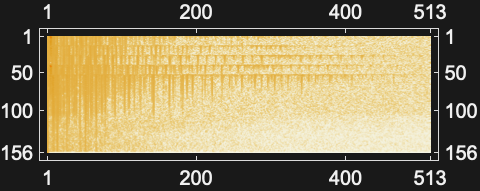
```

Setting [AspectRatio](https://reference.wolfram.com/language/ref/AspectRatio.html)->[Full](https://reference.wolfram.com/language/ref/Full.html) will fill the available space:

```wolfram
Spectrogram[Table[Cos[( i)/(4)+((i)/(20))^2],{i,2000}],AspectRatio->Full,ImageSize->{200,100},Background->StandardGray]
```

*([Graphics])*

Use maximum sizes for the width and height:

```wolfram
{Spectrogram[Table[Cos[( i)/(4)+((i)/(20))^2],{i,2000}],ImageSize->{UpTo[150],UpTo[100]}],Spectrogram[Table[Cos[( i)/(4)+((i)/(20))^2],{i,2000}],AspectRatio->2,ImageSize->{UpTo[150],UpTo[100]}]}
(* Output *)
{[Graphics],[Graphics]}
```

Use [ImageSize](https://reference.wolfram.com/language/ref/ImageSize.html)->[Full](https://reference.wolfram.com/language/ref/Full.html) to fill the available space in an object:

```wolfram
Framed[Pane[Spectrogram[Table[Cos[( i)/(4)+((i)/(20))^2],{i,2000}],ImageSize->Full,Background->StandardGray],{200,100}]]
```

*([Graphics])*

Specify the image size as a fraction of the available space:

```wolfram
Framed[Pane[Spectrogram[Table[Cos[( i)/(4)+((i)/(20))^2],{i,2000}],ImageSize->{Scaled[0.5],Scaled[0.5]},Background->StandardGray],{250,200}]]
```

*([Graphics])*

#### Method

By default, frequency is shown using linear scaling:

```wolfram
a=ExampleData[{"Audio","MaleVoice"},"Audio"]
```

```wolfram
Spectrogram[a]
(* Output *)
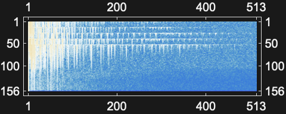
```

Use mel frequency scaling:

```wolfram
Spectrogram[a,Method->"MelFrequency"]
(* Output *)
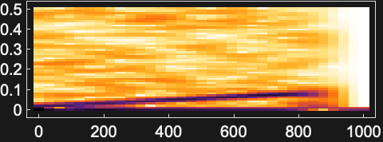
```

#### PlotRange

[PlotRange](https://reference.wolfram.com/language/ref/PlotRange.html)->[Automatic](https://reference.wolfram.com/language/ref/Automatic.html) automatically computes the frequency range to display:

```wolfram
Spectrogram[ExampleData[{"Audio","Apollo11SmallStep"}]]
(* Output *)
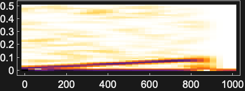
```

This is equivalent to [PlotRange](https://reference.wolfram.com/language/ref/PlotRange.html)->{[All](https://reference.wolfram.com/language/ref/All.html),[Automatic](https://reference.wolfram.com/language/ref/Automatic.html),[All](https://reference.wolfram.com/language/ref/All.html)}:

```wolfram
Spectrogram[ExampleData[{"Audio","Apollo11SmallStep"}],PlotRange->{All,Automatic,All}]
(* Output *)

```

Show the full spectrogram:

```wolfram
Spectrogram[ExampleData[{"Audio","Apollo11SmallStep"}],PlotRange->All]
(* Output *)
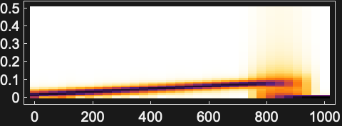
```

Zoom into a specific part of the spectrogram:

```wolfram
Spectrogram[ExampleData[{"Audio","Apollo11SmallStep"}],PlotRange->{{1,3},Automatic}]
(* Output *)
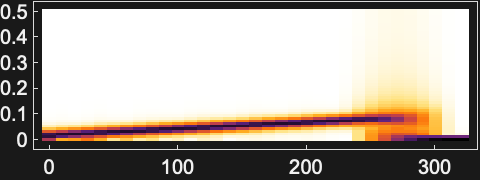
```

Use [PlotRange](https://reference.wolfram.com/language/ref/PlotRange.html)->{*min*,*max*} to control the frequency range of the spectrogram:

```wolfram
Spectrogram[ExampleData[{"Audio","Apollo11SmallStep"}]]
(* Output *)
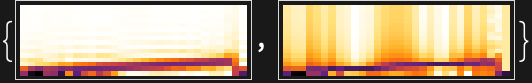
```

Specify range of frequencies:

```wolfram
Spectrogram[ExampleData[{"Audio","Apollo11SmallStep"}],PlotRange->{1000,2000}]
(* Output *)
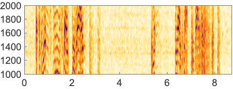
```

Specify maximum frequency:

```wolfram
Spectrogram[ExampleData[{"Audio","Apollo11SmallStep"}],PlotRange->3000]
(* Output *)
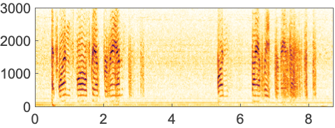
```

#### SampleRate

Specify the sampling rate of the data:

```wolfram
chirp=Table[Cos[800. π t+2800. π t^2],{t,0.,1.6,1/8000.}];
Spectrogram[chirp,SampleRate->8000]
(* Output *)
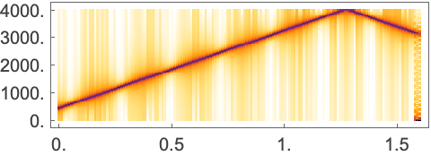
```

#### Ticks

Ticks are placed automatically in each plot:

```wolfram
Spectrogram[Table[Cos[i/4+(i/20)^2],{i,2000}],Frame->False,Axes->True]
```

*([Graphics])*

Use [Ticks](https://reference.wolfram.com/language/ref/Ticks.html)->[None](https://reference.wolfram.com/language/ref/None.html) to not draw any tick marks:

```wolfram
Spectrogram[Table[Cos[i/4+(i/20)^2],{i,2000}],Frame->False,Axes->True,Ticks->None]
```

*([Graphics])*

Place tick marks at specific positions:

```wolfram
Spectrogram[Table[Cos[i/4+(i/20)^2],{i,2000}],Frame->False,Axes->True,Ticks->{{100,1000,1500},{.1,.2,.4}}]
```

*([Graphics])*

Draw tick marks at the specified positions with the specified labels:

```wolfram
Spectrogram[Table[Cos[i/4+(i/20)^2],{i,2000}],Frame->False,Axes->True,Ticks->{{{100,a},{1000,b},{1500,c}},{{.1,d},{.2,e},{.4,f}}}]
```

*([Graphics])*

#### TicksStyle

Specify the overall tick style, including the tick labels:

```wolfram
Spectrogram[Table[Cos[i/4+(i/20)^2],{i,2000}],Frame->False,Axes->True,TicksStyle->Directive[Darker@Green,Bold]]
```

*([Graphics])*

Specify the tick style for each of the axes:

```wolfram
Spectrogram[Table[Cos[i/4+(i/20)^2],{i,2000}],Frame->False,Axes->True,TicksStyle->{Directive[Green,Bold],Directive[Bold, Red]}]
```

*([Graphics])*

Specify tick marks with scaled lengths:

```wolfram
Spectrogram[Table[Cos[i/4+(i/20)^2],{i,2000}],Frame->False,Axes->True,Ticks->{{{100,a,.09},{1000,b,.07},{1500,c,.14}},{{.1,d},{.2,e,.08},{.4,f,.17}}}]
```

*([Graphics])*

Customize each tick with position, length, labeling and styling:

```wolfram
Spectrogram[Table[Cos[i/4+(i/20)^2],{i,2000}],Frame->False,Axes->True,Ticks->{{{100,a,.09,Directive[Thick,Red]},{1000,b,.07,Directive[Thick,Red]},{1500,c,.14,Directive[Thick,Red]}},{{.1,d,.5,Directive[Dashed,Thick,Blue]},{.2,e,.08,Directive[Thick,Blue]},{.4,f,.17,Directive[Thick,Darker@Green]}}}]
```

*([Graphics])*

### Applications

Spectrogram of a sound signal:

```wolfram
Spectrogram[ExampleData[{"Sound","Apollo13Problem"}]]
(* Output *)
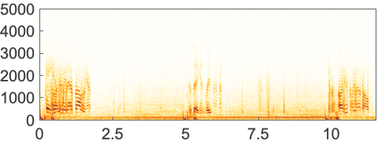
```

Spectrogram of an impulsive sound:

```wolfram
Spectrogram[ExampleData[{"Audio","IRStMarysChurch"}]]
(* Output *)
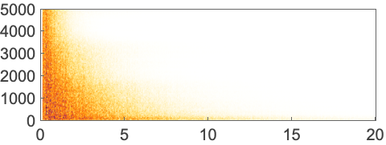
```

Spectrogram of an image:

```wolfram
i=;
```

```wolfram
Spectrogram[Flatten[ImageData[i]],Frame->False]
(* Output *)
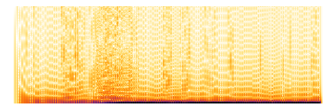
```

### Properties & Relations

Create a spectrogram from the [SpectrogramArray](https://reference.wolfram.com/language/ref/SpectrogramArray.html):

```wolfram
chirp=Table[Cos[800. π t+2800. π t^2],{t,0.,1.6,1/8000.}];
sa=SpectrogramArray[chirp];
```

```wolfram
ListDensityPlot[Transpose[Abs[sa]][[;;128]],Frame->None,AspectRatio->1/3]
(* Output *)
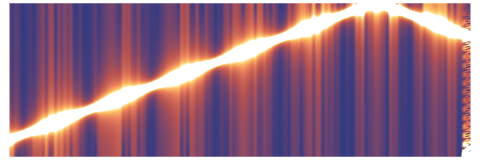
```

Comparison with the default [Spectrogram](https://reference.wolfram.com/language/ref/Spectrogram.html) output:

```wolfram
Spectrogram[chirp,Frame->False]
(* Output *)
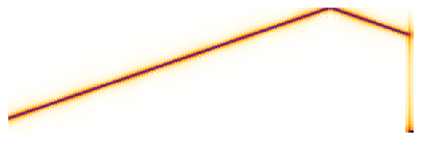
```

### Neat Examples

Sound and spectrogram of dual-tone for Wolfram Research customer service number:

```wolfram
frequencies={0->{941,1336},1->{697,1209},2->{697,1336},3->{697,1477},4->{770,1209},5->{770,1336},6->{770,1477},7->{852,1209},8->{852,1336},9->{852,1477}};
```

```wolfram
number=18009653726;
a=Audio[Join@@(ArrayPad[Table[Sin[2 Pi #[[1]] t]+Sin[2 Pi #[[2]] t],{t,0,0.2,1/8000.}],100,0.]&/@(IntegerDigits[number]/.frequencies)),SampleRate->8000]
```

```wolfram
Spectrogram[a]
(* Output *)
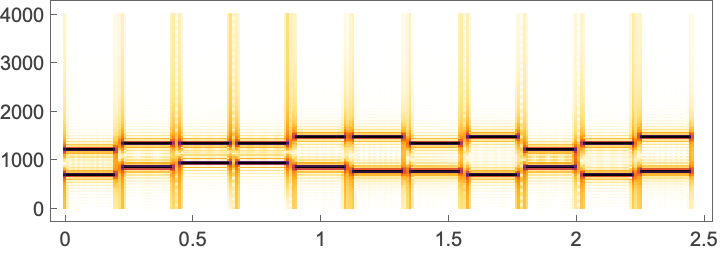
```

## Related Guides ▪Fourier Analysis ▪Signal Processing ▪Speech Computation ▪Signal Visualization & Analysis ▪Audio Analysis ▪Sound and Sonification ▪Summation Transforms ▪Audio Representation ▪Audio Processing ▪Video Analysis ▪Video Computation: Update History

## History Introduced in 2012 (9.0) | Updated in 2014 (10.0) ▪ 2016 (11.0) ▪ 2017 (11.2) ▪ 2024 (14.1)
