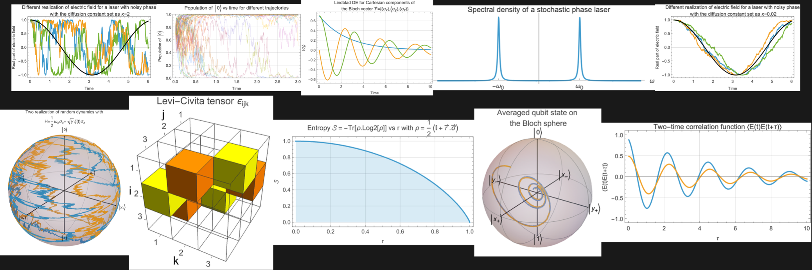

# Qubit Explained

<!-- #| style: Subtitle -->
Bloch Sphere, SU(2) Rotations, Time Evolution, and Measurements A Guided, Computation-First Narrative with the Wolfram Language

<!-- #| style: Author -->
Mads Bahrami (last updated: Feb 19, 2026)

<!-- #| style: Affiliation -->
Wolfram Research Inc, USA



#### Setting the Stage: How This Notebook Flows

This notebook is a computation-first tour of the single qubit, how a two-dimensional Hilbert space description (kets, bras, inner products) turns into the geometric Bloch ball, how measurements (Born rule, eigenbases, projectors) read probabilities directly from amplitudes, why density matrices are required to describe ensembles and mixedness (purity, von Neumann entropy), and how unitary dynamics and spinors live in SU(2) while their visible action on the Bloch vector is an SO(3) rotation. Along the way, we build the Pauli operator toolkit explicitly, Hermiticity, commutators/anticommutators, Levi–Civita structure, Pauli product identities, closed-form exponentials, dynamical equation, collapse of the state during measurment and more, so that every abstract statement is immediately testable computationally and every result can be interpreted both algebraically and geometrically.

In other words, I’ve tried to build a catalogue of computational experiments on single qubits, tools and examples that help you run experiments computationally and learn directly from what you observe. I strongly believe in a computation-first narrative for learning: in a sense, if I cannot compute it, I cannot claim to understand it. This echoes a very [Feynman-y idea](https://digital.archives.caltech.edu/collections/Images/1.10-29/): real understanding shows up when you can do the thing, derive it, predict it, simulate it, estimate it, rather than just repeat/read words.

Before we start, pay attention to a few things. The environment you see is a [Wolfram (Mathematica) notebook](https://www.wolfram.com/notebooks/). Wolfram notebooks consist of [sequences of cells](https://reference.wolfram.com/language/tutorial/WorkingWithCells.html). Look at the right side of this notebook and you can see cell brakets. This notebook is written so that you should evaluate the cells from top to bottom. Although I did my best to make the input cells independent, there are still variables that are defined in earlier cells and used later, meaning some cells depend on previous ones. You should be mindful of these dependencies when evaluating the notebook.

Additionally, the story is presented as a continuous sequence, like a movie. I have added a few headings to help with transitions from one topic to another, but I have avoided breaking the narrative into rigid sections. Sometimes a feature or property is introduced and used before we explain why it applies or unpack the underlying mathematical details. This is intentional, because in this notebook the ability to apply an idea often matters more than following an abstract proof first. Overall, the rhythm is: concept → computation → interpretation.

Inevitably, some of the code in this notebook will look complicated at first. My suggestion is to focus on the output and its meaning before worrying about every detail of the input code. Once you understand what a piece of code is doing conceptually, then go back and unpack how it is written.

Remember that you are not locked into the code as given. You can (and should) modify it, try your own variations, and run your own numerical experiments. Almost every line in this notebook could be written in several different ways, and exploring those alternatives is one of the best ways to learn.

One of the strengths of the Wolfram Mathematica notebook environment is precisely this interactive, exploratory style. If you are using the cloud version, you can click “Make Your Own Copy” to duplicate the notebook and edit it freely. If you are working locally, save your own version and experiment with it. The notebook interface is a powerful medium for computational thinking and simulation; it is worth taking the time to get comfortable with it and really use it as a laboratory for your ideas.

If you have any suggestions or questions, please reach out to us at [quantum@wolfram.com](mailto:quantum@wolfram.com)

Let’s start!

<!-- Python/Wolfram-Engine setup (run this first) -->

```python
# === Setup: drive the Wolfram Engine from Python via the Wolfram Client Library ===
# This document is the Python edition of "Qubit Explained". Every computation is the
# *exact* Wolfram Language expression from the original, sent to a Wolfram kernel and
# evaluated there. You do not need Mathematica: the free Wolfram Engine is enough.
#
#   pip install wolframclient
#   (install the free Wolfram Engine, then register it once with: wolframscript)
#
# Run the cells top to bottom; state (variables, function definitions) persists in the
# session exactly as in a notebook. Results print as Wolfram InputForm text; plots,
# Bloch spheres, matrices and other visuals are rendered to PNG files (and shown inline
# when you run inside Jupyter).
import os, glob
from wolframclient.evaluation import WolframLanguageSession
from wolframclient.language import wlexpr

def _find_kernel():
    env = os.environ.get("WOLFRAM_KERNEL")
    if env and os.path.exists(env):
        return env
    pats = [
        "/Applications/Wolfram.app/Contents/MacOS/WolframKernel",
        "/Applications/Wolfram Engine.app/Contents/MacOS/WolframKernel",
        "/Applications/Wolfram*.app/Contents/MacOS/WolframKernel",
        "/usr/local/Wolfram/*/Executables/WolframKernel",
        "/usr/local/bin/WolframKernel",
        "C:/Program Files/Wolfram Research/*/*/WolframKernel.exe",
    ]
    found = []
    for p in pats:
        found += sorted(glob.glob(p), reverse=True)
    return found[0] if found else None

_KERNEL = _find_kernel()
session = WolframLanguageSession(_KERNEL) if _KERNEL else WolframLanguageSession()

IMG_DIR = os.path.join(os.getcwd(), "qis-figs")
os.makedirs(IMG_DIR, exist_ok=True)

def wl(code):
    """Evaluate Wolfram Language `code` on the engine and print the result as
    Wolfram InputForm. Large objects (e.g. simulated trajectories) are summarized
    rather than dumped. State persists across calls."""
    wrapped = ("Module[{qisRes = (\n" + code + "\n)},"
               " If[ByteCount[qisRes] > 200000,"
               " \"<<\" <> ToString[Head[qisRes]] <> \" object, ByteCount = \""
               " <> ToString[ByteCount[qisRes]] <> \">>\","
               " ToString[qisRes, InputForm]]]")
    out = session.evaluate(wlexpr(wrapped))
    if isinstance(out, str) and out != "Null":
        print(out)
    return out

def wlshow(code, name):
    """Render a Wolfram visualization to qis-figs/<name>.png and display it inline
    (in Jupyter) or print its path. State persists across calls."""
    path = os.path.join(IMG_DIR, name + ".png")
    p = path.replace("\\", "\\\\")
    res = session.evaluate(wlexpr('Export["' + p + '", (\n' + code + '\n), ImageResolution -> 144]'))
    if res is None or (isinstance(res, str) and "$Failed" in res):
        print("[render failed]", name, "->", res); return None
    try:
        from IPython.display import Image, display
        display(Image(filename=path))
    except Exception:
        print("saved:", path)
    return path
```

#### Complex Numbers as Two Degrees of Freedom

The simplest quantum system we usually consider in quantum mechanics is one whose states live in a two-dimensional Hilbert space, what we call a single qubit. A Hilbert space is a complex vector space equipped with an inner product, and it is complete with respect to the norm induced by that inner product. In such a two-dimensional Hilbert space, the state of the system may be represented in two equivalent-looking but conceptually distinct ways: for an isolated system in a definite pure state, we use a normalized state vector (a two component complex vector); more generally—especially when describing classical uncertainty about preparation, entanglement with an environment, or partial information, we use a density operator/matrix (a 2×2 matrix), which acts on the same Hilbert space and provides the most general description of a qubit’s state. Whether we represent the qubit by a state vector or by a density matrix, the underlying objects are built from complex numbers.

A complex number can be written as $z=x+i\, y$, where $x$ and $y$ are real numbers and i is the imaginary unit, defined by $i^{2}=-1$. The same number can also be written in polar form as $z=r\, e^{i\, \varphi }$, where $r=\lvert z\rvert$ is the absolute value (modulus) of $z$, and φ is its argument (angle). The complex conjugate of $z$, denoted by $z^{*}$, is given by $z^{*}=x-i\, y$, or equivalently $z=r\, e^{-i\, \varphi }$ in polar form. In short, a complex number contains two real degrees of freedom.

Compute the complex conjugate of $3+2i$:

```python
wl(r'''Conjugate[3 + 2 I]''')
```

Find $3+2i$ in polar form:

```python
wl(r'''AbsArg[3 + 2 I]''')
```

Verify that the polar form is the same as the original complex number:

```python
wl(r'''#1 E^(I #2) & @@ AbsArg[3 + 2 I] == 3 + 2 I''')
```

As said, the complex number $3+2i$ has two degrees of freedom: $\{3,2\}$. Using them, one can construct the polar form of the complex number.

```python
wl(r'''ToPolarCoordinates[{3, 2}]''')
```

Multiplication of a complex number by its complex conjugate is always a non-negative real number. This product is written as $z^{*}z$ or $z\, z^{*}$, and is usually denoted by the absolute square $\lvert z\rvert ^{2}$. Given the polar form, one can write $\lvert z\rvert ^{2}=r^{2}$. The usual norm of $z$ (also called the modulus) is $\lvert z\rvert =r$.

#### State Vectors and Normalization (Norms, Global Phase, Degrees of Freedom)

For a two-level quantum system (qubit), a pure state is represented (up to an overall complex phase such as $e^{i\, \varphi }$) by a two-component complex vector, usually called the state vector. For example, the vector $\{1/2,i\sqrt{3}/2\}$ represents a pure quantum state. We will assume that all state vectors are normalized, meaning that their norm is equal to 1. For a vector $\vec{v}$ with components $v_{0}$ and $v_{1}$, i.e. $\vec{v}=\{v_{0},v_{1}\}$ , the norm is defined as $\lVert \vec{v}\rVert =\sqrt{\vec{v}^{*}.\vec{v}}=\sqrt{\lvert v_{0}\rvert ^{2}+\lvert v_{1}\rvert ^{2}}$, where * denotes the complex conjugate and “·” denotes the usual dot product. The complex conjugate of a vector is obtained by taking the complex conjugate of each of its components.

Calculate the complex conjugate of $\{1/2,i\sqrt{3}/2\}$:

```python
wl(r'''Conjugate[{1, I Sqrt[3]}/2]''')
```

Calculate norm of $\{1/2,i\sqrt{3}/2\}$:

```python
wl(r'''Norm[{1, I Sqrt[3]}/2]''')
```

Calculate norm of $\{1/2,i\sqrt{3}/2\}$ explicitly as $\sqrt{v^{*}.v}$:

```python
wl(r'''With[{vector = {1, I Sqrt[3]}/2}, Sqrt[Conjugate[vector] . vector]]''')
```

Calculate norm of $\{Cos[\theta /2],e^{i\, \phi }Sin[\theta /2]\}$:

```python
wl(r'''FullSimplify[
 Norm[{Cos[\[Theta]/2], 
   E^(I \[Phi]) Sin[\[Theta]/2]}], (\[Theta] | \[Phi]) \[Element] 
  Reals]''')
```

Calculate norm of the state vector $\{\alpha ,\beta \}$:

```python
wl(r'''Norm[{\[Alpha], \[Beta]}]''')
```

Since the norm of a state vector is not automatically equal to one, we often multiply the vector by an overall (nonzero) scalar factor, typically called a normalization factor, to ensure the state is normalized.

Normalize the state vector $\{\alpha ,\beta \}$:

```python
wl(r'''Normalize[{\[Alpha], \[Beta]}]''')
```

In the above example, $1/\sqrt{Abs[\alpha ]^{2}+Abs[\beta ]^{2}}$ is the normalization factor.

Verify the norm is now 1:

```python
wl(r'''Norm@Normalize[{\[Alpha], \[Beta]}] // FullSimplify''')
```

As mentioned before, for a qubit, the state vector is represented by a two-component complex-valued vector, for example $\{c_{1},\, c_{2}\}\in \mathbb{C}^{2}$. The numbers $c_{1}$ and $c_{2}$ are called (probability) amplitudes. They are the coefficients of the basis states in the linear combination that describes the quantum superposition.

Multiplying a state vector by an overall complex phase factor $e^{i\varphi }$ does not change the physical quantum state it represents, because all physical predictions (for example, measurement probabilities, which depend on absolute squares of amplitudes $\lvert c_{j}\rvert ^{2}$) are unchanged by a global phase.

Compute probabilities and verify two states $\{\alpha ,\beta \}$ and $e^{i\varphi }\{\alpha ,\beta \}$ are physically the same:

```python
wl(r'''FullSimplify[
 Abs[{\[Alpha], \[Beta]}]^2 == 
  Abs[E^(I \[CurlyPhi]) {\[Alpha], \[Beta]}]^2, \[CurlyPhi] \
\[Element] Reals]''')
```

We will discuss measurement probabilities in more detail later.

#### The Most General Pure Qubit State

When we want to write a general pure state of a single qubit, we can choose a global phase so that the first component of the state vector is real (as if in the polar form, we set its argument as zero), while the second component may be complex. If we also require the state to be normalized, the most general pure qubit state can be written as $\{Cos[\theta /2],e^{i\, \phi }Sin[\theta /2]\}$ where $0<=\theta <=\pi $ and $0<=\phi <=2\pi $. We will discuss the motivation to have $\theta /2$ rather than $\theta \, $ soon when we introduce Bloch sphere. Let’s rephrase this idea differently.

The state vector of a single qubit can be written as $\{\alpha ,\beta \}$ with $\alpha ,\beta \in \mathbb{C}$. This means the state is specified by two complex numbers, i.e., four real parameters, i.e. $\{r_{0}e^{i\, \varphi _{0}},r_{1}e^{i\, \varphi _{1}}\}$. Imposing normalization, removes one real degree of freedom, and identifying state vectors that differ only by an overall complex phase removes another real degree of freedom. Mathematically it means: $\{r_{0}\, e^{i\, \varphi _{0}},r_{1}e^{i\, \varphi _{1}}\}->1/\sqrt{r_{0}^{2}+r_{1}^{2}}\{r_{0}\, e^{i\, \varphi _{0}},r_{1}e^{i\, \varphi _{1}}\}->e^{i\, \varphi _{0}}/\sqrt{r_{0}^{2}+r_{1}^{2}}\{r_{0},r_{1}e^{i\, (\varphi _{1}-\varphi _{0})}\}->\{r,\sqrt{1-r^{2}}e^{i\, \varphi }\}$. Therefore, a pure qubit state is fully characterized by only two real parameters.

#### Bra–Ket Notation and Inner Products

In the quantum mechanics literature, a state vector is usually denoted by a ket. For example, $|\psi \rangle$ can represent a generic pure state such as $|\psi \rangle=\{Cos[\theta /2],e^{i\, \phi }Sin[\theta /2]\}$. The Hermitian conjugate (complex conjugate transpose) of a ket is denoted by a bra. For the state above, the corresponding bra is $\langle \psi |=\{Cos[\theta /2],e^{-i\, \phi }Sin[\theta /2]\}$. The inner product of two states $|\psi _{1}\rangle$ and $|\psi _{2}\rangle$ is written as $\langle \psi _{1}|\psi _{2}\rangle $, which means the dot product of the bra $\langle \psi _{1}|$ with the ket $|\psi _{2}\rangle$.

Define $|\psi _{1}\rangle$ and $|\psi _{2}\rangle$:

```python
wl(r'''\[Psi]1 = {Cos[\[Theta]1/2], E^(I \[Phi]1) Sin[\[Theta]1/2]};
\[Psi]2 = {Cos[\[Theta]2/2], E^(I \[Phi]2) Sin[\[Theta]2/2]};''')
```

Calculate their inner product:

```python
wl(r'''FullSimplify[
 Conjugate[\[Psi]1] . \[Psi]2, (\[Theta]1 | \[Theta]2 | \[Phi]1 | \
\[Phi]2) \[Element] Reals]''')
```

Note that Mathematica does not force the “row vs. column” distinction for rank-1 lists (what we usually call vectors) in the same way introductory linear algebra does. A vector is represented as a single list, rather than explicitly as a $1\times n$ row matrix or an $n\times 1$ column matrix. As a result, [Transpose](https://reference.wolfram.com/language/ref/Transpose.html) has no visible effect on a vector (a 1D list), while it does change a matrix (a 2D list) by swapping rows and columns.

Visualize the transposition on a vector as described in linear algebra:

```python
wlshow(r'''With[{m = {{ColorData[97][1], ColorData[97][2]}}}, 
 Row[{ArrayPlot[m, ImageSize -> Tiny, Mesh -> All, MeshStyle -> Black],
    "\!\(\*OverscriptBox[\(\[LongRightArrow]\), \(Transpose\)]\)", 
   ArrayPlot[Transpose@m, ImageSize -> Tiny, Mesh -> All, 
    MeshStyle -> Black]}]]''', "fig-001")
```

Visualize the transposition on a matrix:

```python
wlshow(r'''With[{m = {{ColorData[97][1], ColorData[97][2]}, {ColorData[97][3], 
     ColorData[97][4]}}}, 
 Row[{ArrayPlot[m, ImageSize -> Tiny, Mesh -> All, MeshStyle -> Black],
    "\!\(\*OverscriptBox[\(\[LongRightArrow]\), \(Transpose\)]\)", 
   ArrayPlot[Transpose@m, ImageSize -> Tiny, Mesh -> All, 
    MeshStyle -> Black]}]]''', "fig-002")
```

If one is very serious about keeping the convention of linear algebra for vectors (as a $1\times n$ row matrix or an $n\times 1$ column matrix), then one should consider a construct as $\vec{v}=\{\{v_{1},v_{2}\}\}$. However, I will adopt the usual Mathematica’s convention with $\vec{v}=\{v_{1},v_{2}\}$.

If one is very serious about preserving the usual linear-algebra convention, treating vectors explicitly as either a $1\times n$ row matrix or an $n\times 1$ column matrix, then it can be helpful to represent a “row vector” as a nested list. For example, one may define $\vec{v}=\{\{v_{1},v_{2}\}\}$ which is a $1\times 2$ matrix in Mathematica. In that representation, operations like Transpose behave exactly as in linear algebra, converting $\vec{v}=\{\{v_{1},v_{2}\}\}$ into the corresponding $2\times 1$ matrix $\vec{v}^{T}=\{\{v_{1}\},\{v_{2}\}\}$. However, in what follows I will adopt Mathematica’s usual convention and represent a vector simply as a one-dimensional list, $\vec{v}=\{v_{1},v_{2}\}$, keeping in mind that this suppresses the row/column distinction unless we deliberately reintroduce it.

Verify that transposition does not change $\vec{v}=\{v_{1},v_{2}\}$:

```python
wl(r'''With[{vec = Array[\[FormalV], 2]}, Transpose[vec] == vec]''')
```

Verify that transposition changes $\vec{v}=\{\{v_{1},v_{2}\}\}$:

```python
wl(r'''With[{vec = Array[\[FormalV], 2]}, Transpose[{vec}] === vec]''')
```

#### Computational Basis and Superposition

The state vector $\{\alpha ,\beta \}$ can be also written as $\alpha \, \{1,0\}+\beta \, \{0,1\}$. The purpose of this representation is to express the state in a specific basis. In a two-dimensional Hilbert space, the unit vectors $\{1,0\}$ and $\{0,1\}$ form an orthonormal basis, which means any state vector can be written as a linear combination of them. By convention, we usually define $|0\rangle=\{1,0\}$ and $|1\rangle=\{0,1\}$. So a general qubit state can be written as $|\psi \rangle=\alpha |0\rangle+\beta |1\rangle$. Note that in some literature the opposite convention is also used, with $|1\rangle=\{1,0\}$ and $|0\rangle=\{0,1\}$. In the context of quantum computing, the standard orthonormal basis whose elements are unit vectors is called the computational basis. The basis isn’t just bookkeeping: it corresponds to a measurement choice. Writing the state in a basis is how amplitudes become experimental probabilities.

One can verify that $\{1,\, 0\}$ and $\{0,\, 1\}$ form an orthonormal set by checking their inner products: each vector has norm 1, and their inner product with each other is 0. Equivalently, if we place the computational basis as the columns (or rows) of a matrix, the resulting matrix is the identity matrix, which reflects the fact that they form an orthonormal basis.

Verify that stacking the computational basis vectors as the rows of a matrix yields the identity matrix:

```python
wl(r'''{{1, 0}, {0, 1}} == IdentityMatrix[2]''')
```

#### The Bloch Vector Map: Turning a Qubit into Geometry

Let’s focus on a generic qubit state vector $\{\alpha ,\beta \}$ with $\alpha ,\beta \in \mathbb{C}$, assumed to be normalized $\lvert \alpha \rvert ^{2}+\lvert \beta \rvert ^{2}=1$. Define a three-component real vector as $\vec{n}=\{2Re[\alpha ^{*}\, \beta ],2Im[\alpha ^{*}\, \beta ],\lvert \alpha \rvert ^{2}-\lvert \beta \rvert ^{2}\}$. This vector $\vec{n}$ is called the Bloch vector associated with the state vector $\{\alpha ,\, \beta \}$.

Define a function that takes $\{\alpha ,\beta \}$ and returns the Bloch vector:

```python
wl(r'''ClearAll[BlochVector]''')
wl(r'''BlochVector[stateVector_?VectorQ] := 
 Module[{\[Alpha], \[Beta]}, {\[Alpha], \[Beta]} = 
   stateVector; {2 Re[\[Beta] Conjugate@\[Alpha]], 
   2 Im[\[Beta] Conjugate@\[Alpha]], Abs[\[Alpha]]^2 - Abs[\[Beta]]^2}]''')
```

This definition isn’t arbitrary: for a normalized pure state $|\psi \rangle$, the three component of Bloch vector are exactly the expectation-value of Pauli operators $\langle \psi |\sigma _{j}|\psi \rangle$ with $j=x,y,z$. That’s why the Bloch vector is operational: it’s what you can measure.

Verify that the norm of the Bloch vector is equal to the squared norm of the state vector:

```python
wl(r'''With[{stateVector = {\[Alpha], \[Beta]}}, 
  Norm[BlochVector[stateVector]] == 
   Norm[stateVector]^2] // FullSimplify''')
```

Therefore, the norm of the Bloch vector for a normalized pure state is always 1. This means that, as we consider all possible normalized pure qubit states, their Bloch vectors lie on the unit sphere in three dimensions. This unit sphere is called the Bloch sphere (or the Poincaré sphere in the context of optics).

Visualize the Bloch sphere:

```python
wlshow(r'''ResourceFunction[
ResourceObject[<|"Name" -> "BlochSpherePlot", 
    "ShortName" -> "BlochSpherePlot", 
    "UUID" -> "fcb3b840-6ae5-4883-a256-1573cc958ffc", 
    "ResourceType" -> "Function", "Version" -> "1.0.0", 
    "Description" -> "Plot the Bloch sphere", 
    "RepositoryLocation" -> URL[
     "https://www.wolframcloud.com/obj/resourcesystem/api/1.0"], 
    "SymbolName" -> "FunctionRepository`$\
260e867144764f229d14c35cdf9d34d9`BlochSpherePlot", 
    "FunctionLocation" -> CloudObject[
     "https://www.wolframcloud.com/obj/858bce1b-d11f-4b5c-8673-\
c3107cef60fb"]|>, \
{ResourceSystemBase -> "https://www.wolframcloud.com/obj/\
resourcesystem/api/1.0"}]][ImageSize -> Small]''', "fig-003")
```

As you can see, the axes are labeled in a particular way. These labels correspond to kets that represent eigenstates of the Pauli matrices. We shall discuss them in more detail later.

There are, of course, different conventions for denoting these kets. For example, in optics it is common to use different labels for the same states, such as those corresponding to horizontal/vertical, diagonal/antidiagonal, or right/left circular photon polarization.

Visualize the Bloch sphere using labels from Optics:

```python
wlshow(r'''ResourceFunction[
ResourceObject[<|"Name" -> "BlochSpherePlot", 
    "ShortName" -> "BlochSpherePlot", 
    "UUID" -> "fcb3b840-6ae5-4883-a256-1573cc958ffc", 
    "ResourceType" -> "Function", "Version" -> "1.0.0", 
    "Description" -> "Plot the Bloch sphere", 
    "RepositoryLocation" -> URL[
     "https://www.wolframcloud.com/obj/resourcesystem/api/1.0"], 
    "SymbolName" -> "FunctionRepository`$\
260e867144764f229d14c35cdf9d34d9`BlochSpherePlot", 
    "FunctionLocation" -> CloudObject[
     "https://www.wolframcloud.com/obj/858bce1b-d11f-4b5c-8673-\
c3107cef60fb"]|>, \
{ResourceSystemBase -> "https://www.wolframcloud.com/obj/\
resourcesystem/api/1.0"}]][ImageSize -> Small, "Labels" -> "Optics"]''', "fig-004")
```

#### The Bloch Vector: Cartesian and Spherical Coordinates

Recall that a pure qubit state, in its most general form, can be written as $|\psi \rangle=\{Cos[\theta /2],e^{i\, \phi }Sin[\theta /2]\}$. A key result is that the angles θ and ϕ are exactly the usual spherical coordinates on the Bloch sphere. In what follows, we will show this explicitly by direct computation.

Calculate the Bloch vector for the state $|\psi \rangle=\{Cos[\theta /2],e^{i\, \phi }Sin[\theta /2]\}$:

```python
wl(r'''FullSimplify[
 BlochVector[{Cos[\[Theta]/2], 
   E^(I \[Phi]) Sin[\[Theta]/2]}], (\[Theta] | \[Phi]) \[Element] 
  Reals]''')
```

As one can see, angles θ and ϕ are exactly the standard spherical coordinates on the unit sphere.

Transform a point on the unit sphere from spherical coordinates, specified by $\{1,\theta ,\phi \}$, into Cartesian coordinates:

```python
wl(r'''CoordinateTransform["Spherical" -> "Cartesian", {1, \[Theta], \[Phi]}]''')
```

Now the motivation for having θ/2 in the state vector is clear: if we used θ instead of θ/2, the components of the Bloch vector would involve 2θ, and we would obtain an extra factor of 2 in the spherical angles on the Bloch sphere.

Calculate the Bloch vector for the state$|\psi \rangle=\{Cos[\theta ],e^{i\, \phi }Sin[\theta ]\}$:

```python
wl(r'''FullSimplify[
 BlochVector[{Cos[\[Theta]], 
   E^(I \[Phi]) Sin[\[Theta]]}], (\[Theta] | \[Phi]) \[Element] Reals]''')
```

That said, the main motivation for $\theta /2$ choice rather $\theta $ comes from the fact that [SU(2)](https://mathworld.wolfram.com/SpecialUnitaryGroup.html) acts on the Bloch vector as an [SO(3)](https://mathworld.wolfram.com/SpecialOrthogonalGroup.html) rotation. It means if you rotate the qubit state by a unitary (a $2\times 2$ SU(2) matrix), then the corresponding Bloch arrow rotates in ordinary 3D space by a rotation matrix $\mathcal{R}$ (a $3\times 3$ SO(3) matrix): from “spinor dance” to “arrow dance”. We shall discuss this later.

So this is a very interesting analogy. The quantum state vector $\{Cos[\theta /2],e^{i\, \phi }Sin[\theta /2]\}$ is mapped into a vector in $\mathbb{R}^{3}$ that is fully parametrized by $\{r,\theta ,\phi \}$ where $r=1$ for pure states. Later on, we will introduce another class of quantum states called mixed states that correspond to points inside of the Bloch sphere (meaning $r<1$).

#### Pauli Matrices Appear: Axes, Eigenstates, and Bloch-Sphere Landmarks

Let’s look at the Bloch sphere again.

```python
wlshow(r'''ResourceFunction[
ResourceObject[<|"Name" -> "BlochSpherePlot", 
    "ShortName" -> "BlochSpherePlot", 
    "UUID" -> "fcb3b840-6ae5-4883-a256-1573cc958ffc", 
    "ResourceType" -> "Function", "Version" -> "1.0.0", 
    "Description" -> "Plot the Bloch sphere", 
    "RepositoryLocation" -> URL[
     "https://www.wolframcloud.com/obj/resourcesystem/api/1.0"], 
    "SymbolName" -> "FunctionRepository`$\
260e867144764f229d14c35cdf9d34d9`BlochSpherePlot", 
    "FunctionLocation" -> CloudObject[
     "https://www.wolframcloud.com/obj/858bce1b-d11f-4b5c-8673-\
c3107cef60fb"]|>, \
{ResourceSystemBase -> "https://www.wolframcloud.com/obj/\
resourcesystem/api/1.0"}]][ImageSize -> Small]''', "fig-005")
```

As mentioned, the axis labels correspond to kets that represent eigenstates of the Pauli matrices.

Show matrix form of Pauli operators (matrices) together with the identity operator:

```python
wlshow(r'''AssociationThread[{"\[DoubleStruckCapitalI]", 
  "\!\(\*SubscriptBox[\(\[Sigma]\), \(x\)]\)", 
  "\!\(\*SubscriptBox[\(\[Sigma]\), \(y\)]\)", 
  "\!\(\*SubscriptBox[\(\[Sigma]\), \(z\)]\)"}, 
 MatrixForm /@ Table[PauliMatrix[j], {j, 0, 3}]]''', "fig-006")
```

Another common notation for Pauli matrices is $\sigma _{1}$, $\sigma _{2}$ and $\sigma _{3}$. Note that the identity matrix can be denoted by $\sigma _{0}$. Of course, the more common notation for the identity operator is $\mathbb{I}$.

```python
wlshow(r'''AssociationThread[{"\!\(\*SubscriptBox[\(\[Sigma]\), \(0\)]\)", 
  "\!\(\*SubscriptBox[\(\[Sigma]\), \(1\)]\)", 
  "\!\(\*SubscriptBox[\(\[Sigma]\), \(2\)]\)", 
  "\!\(\*SubscriptBox[\(\[Sigma]\), \(3\)]\)"}, 
 MatrixForm /@ Table[PauliMatrix[j], {j, 0, 3}]]''', "fig-007")
```

Let us now focus more closely on the concept of eigenstates. An eigenstate of an operator is a state such that, when the operator acts on it, the result is the same state multiplied by a constant, called the eigenvalue. Mathematically, this is written as $A|\psi _{a}\rangle=a|\psi _{a}\rangle$, where $A$ is the operator/matrix, $|\psi _{a}\rangle$ is the eigenstate, and $a$ is the eigenvalue.

Show $\{1,0\}$ is the eigenstate of Pauli-Z with the eigenvalue $+1$:

```python
wl(r'''With[{vec = {1, 0}}, PauliMatrix[3] . vec == vec]''')
```

Show $\{0,1\}$ is the eigenstate of Pauli-Z with the eigenvalue $-1$:

```python
wl(r'''With[{vec = {0, 1}}, PauliMatrix[3] . vec == -vec]''')
```

Calculate the eigenvalues of Pauli-X:

```python
wl(r'''Eigenvalues[PauliMatrix[1]]''')
```

Calculate the eigenstates of Pauli-X:

```python
wl(r'''Eigenvectors[PauliMatrix[1]]''')
```

Show $\{-1,1\}$ is the eigenstate of Pauli-X with the eigenvalue $-1$:

```python
wl(r'''With[{vec = {-1, 1}}, PauliMatrix[1] . vec == -vec]''')
```

If we multiply an eigenstate by a nonzero constant, it is still an eigenstate of the same operator with the same eigenvalue.

Show that $-1/\sqrt{2}\{-1,1\}=1/\sqrt{2}\{1,-1\}$ is eigenstate of Pauli-X with the eigenvalue $-1$:

```python
wl(r'''With[{vec = 1/Sqrt[2] {1, -1}}, PauliMatrix[1] . vec == -vec]''')
```

Show that $1/\sqrt{2}\{1,1\}$ is eigenstate of Pauli-X with the eigenvalue $+1$:

```python
wl(r'''With[{vec = 1/Sqrt[2] {1, 1}}, PauliMatrix[1] . vec == vec]''')
```

Let’s plot normalized eigenstates of Pauli-X operator in the Bloch sphere.

```python
wlshow(r'''ResourceFunction[
ResourceObject[<|"Name" -> "BlochSpherePlot", 
    "ShortName" -> "BlochSpherePlot", 
    "UUID" -> "fcb3b840-6ae5-4883-a256-1573cc958ffc", 
    "ResourceType" -> "Function", "Version" -> "1.0.0", 
    "Description" -> "Plot the Bloch sphere", 
    "RepositoryLocation" -> URL[
     "https://www.wolframcloud.com/obj/resourcesystem/api/1.0"], 
    "SymbolName" -> "FunctionRepository`$\
260e867144764f229d14c35cdf9d34d9`BlochSpherePlot", 
    "FunctionLocation" -> CloudObject[
     "https://www.wolframcloud.com/obj/858bce1b-d11f-4b5c-8673-\
c3107cef60fb"]|>, \
{ResourceSystemBase -> "https://www.wolframcloud.com/obj/\
resourcesystem/api/1.0"}]][Normalize /@ Eigenvectors[PauliMatrix[1]], 
 ImageSize -> Small]''', "fig-008")
```

As one can see, the eigenstates of Pauli-X lie along the x-axis of the Bloch sphere, with the +1 eigenstate pointing in the positive x direction and the −1 eigenstate in the negative x direction. Note they are usually denoted as $|x_{\pm }\rangle=\{1,\pm 1\}/\sqrt{2}$.

Calculate Bloch vectors corresponding to eigenstates of Pauli-X:

```python
wlshow(r'''AssociationThread[{"\!\(\*TemplateBox[{\nSubscriptBox[\"x\", \"+\"]},\
\n\"Ket\"]\)", 
  "\!\(\*TemplateBox[{\nSubscriptBox[\"x\", \"-\"]},\n\"Ket\"]\)"}, 
 BlochVector@*Normalize /@ Eigenvectors[PauliMatrix[1]]]''', "fig-009")
```

In a similar manner, eigenstates of Pauli-Y lie along y-axis. They are usually denoted as $|y_{\pm }\rangle=\{1,\pm i\}/\sqrt{2}$.

Compute Bloch vector for eigenstates of Pauli-Y:

```python
wlshow(r'''AssociationThread[{"\!\(\*TemplateBox[{\nSubscriptBox[\"y\", \"+\"]},\
\n\"Ket\"]\)", 
  "\!\(\*TemplateBox[{\nSubscriptBox[\"y\", \"-\"]},\n\"Ket\"]\)"}, 
 BlochVector@*Normalize /@ Eigenvectors[PauliMatrix[2]]]''', "fig-010")
```

Plot eigenstates of Pauli-Y in the Bloch sphere:

```python
wlshow(r'''ResourceFunction[
ResourceObject[<|"Name" -> "BlochSpherePlot", 
    "ShortName" -> "BlochSpherePlot", 
    "UUID" -> "fcb3b840-6ae5-4883-a256-1573cc958ffc", 
    "ResourceType" -> "Function", "Version" -> "1.0.0", 
    "Description" -> "Plot the Bloch sphere", 
    "RepositoryLocation" -> URL[
     "https://www.wolframcloud.com/obj/resourcesystem/api/1.0"], 
    "SymbolName" -> "FunctionRepository`$\
260e867144764f229d14c35cdf9d34d9`BlochSpherePlot", 
    "FunctionLocation" -> CloudObject[
     "https://www.wolframcloud.com/obj/858bce1b-d11f-4b5c-8673-\
c3107cef60fb"]|>, \
{ResourceSystemBase -> "https://www.wolframcloud.com/obj/\
resourcesystem/api/1.0"}]][Normalize /@ Eigenvectors[PauliMatrix[2]], 
 ImageSize -> Small]''', "fig-011")
```

The eigenstates of Pauli-Y are also denoted by $|R\rangle=|y_{+}\rangle$ and $|L\rangle=|y_{-}\rangle$, following a standard convention in optics and photon polarization.

Plot eigenstates of Pauli-Y in the Bloch sphere using optics labels:

```python
wlshow(r'''ResourceFunction[
ResourceObject[<|"Name" -> "BlochSpherePlot", 
    "ShortName" -> "BlochSpherePlot", 
    "UUID" -> "fcb3b840-6ae5-4883-a256-1573cc958ffc", 
    "ResourceType" -> "Function", "Version" -> "1.0.0", 
    "Description" -> "Plot the Bloch sphere", 
    "RepositoryLocation" -> URL[
     "https://www.wolframcloud.com/obj/resourcesystem/api/1.0"], 
    "SymbolName" -> "FunctionRepository`$\
260e867144764f229d14c35cdf9d34d9`BlochSpherePlot", 
    "FunctionLocation" -> CloudObject[
     "https://www.wolframcloud.com/obj/858bce1b-d11f-4b5c-8673-\
c3107cef60fb"]|>, \
{ResourceSystemBase -> "https://www.wolframcloud.com/obj/\
resourcesystem/api/1.0"}]][Normalize /@ Eigenvectors[PauliMatrix[2]], 
 ImageSize -> Small, "Labels" -> "Optics"]''', "fig-012")
```

The computational basis corresponds to the eigenstates of Pauli-Z and is aligned with the z-axis.

Plot eigenstates of Pauli-Z in the Bloch sphere:

```python
wlshow(r'''ResourceFunction[
ResourceObject[<|"Name" -> "BlochSpherePlot", 
    "ShortName" -> "BlochSpherePlot", 
    "UUID" -> "fcb3b840-6ae5-4883-a256-1573cc958ffc", 
    "ResourceType" -> "Function", "Version" -> "1.0.0", 
    "Description" -> "Plot the Bloch sphere", 
    "RepositoryLocation" -> URL[
     "https://www.wolframcloud.com/obj/resourcesystem/api/1.0"], 
    "SymbolName" -> "FunctionRepository`$\
260e867144764f229d14c35cdf9d34d9`BlochSpherePlot", 
    "FunctionLocation" -> CloudObject[
     "https://www.wolframcloud.com/obj/858bce1b-d11f-4b5c-8673-\
c3107cef60fb"]|>, \
{ResourceSystemBase -> "https://www.wolframcloud.com/obj/\
resourcesystem/api/1.0"}]][Normalize /@ Eigenvectors[PauliMatrix[3]], 
 ImageSize -> Small]''', "fig-013")
```

Compute Bloch vectors for eigenstates of Pauli-Z:

```python
wlshow(r'''AssociationThread[{"\!\(\*TemplateBox[{\nSubscriptBox[\"z\", \"+\"]},\
\n\"Ket\"]\)", 
  "\!\(\*TemplateBox[{\nSubscriptBox[\"z\", \"-\"]},\n\"Ket\"]\)"}, 
 BlochVector@*Normalize /@ Eigenvectors[PauliMatrix[3]]]''', "fig-014")
```

The most generic pure qubit state, $|\psi \rangle=\{Cos[\theta /2],e^{i\, \phi }Sin[\theta /2]\}$, is given by the Bloch vector $\{Cos[\phi ]\, Sin[\theta ],Sin[\theta ]\, Sin[\phi ],Cos[\theta ]\}$ with θ and ϕ spherical-coordinate angles. Let’s visualize it.

```python
wlshow(r'''Manipulate[ResourceFunction[
ResourceObject[<|"Name" -> "BlochSpherePlot", 
     "ShortName" -> "BlochSpherePlot", 
     "UUID" -> "fcb3b840-6ae5-4883-a256-1573cc958ffc", 
     "ResourceType" -> "Function", "Version" -> "1.0.0", 
     "Description" -> "Plot the Bloch sphere", 
     "RepositoryLocation" -> URL[
      "https://www.wolframcloud.com/obj/resourcesystem/api/1.0"], 
     "SymbolName" -> "FunctionRepository`$\
260e867144764f229d14c35cdf9d34d9`BlochSpherePlot", 
     "FunctionLocation" -> CloudObject[
      "https://www.wolframcloud.com/obj/858bce1b-d11f-4b5c-8673-\
c3107cef60fb"]|>, \
{ResourceSystemBase -> "https://www.wolframcloud.com/obj/\
resourcesystem/api/1.0"}]][{Cos[\[Phi]] Sin[\[Theta]], 
   Sin[\[Theta]] Sin[\[Phi]], Cos[\[Theta]]}, ImageSize -> 270, 
  "NumberOfGreatCircles" -> 4, 
  "NumberOfSmallCircles" -> 3], {{\[Theta], \[Pi]/3, 
   "Polar angle \[Theta]"}, 
  0, \[Pi]}, {{\[Phi], \[Pi]/4, "Azimuthal angle \[Phi]"}, 0, 2 \[Pi]},
  Item["State vector \!\(\*FormBox[\(\*TemplateBox[{\"\[Psi]\"},\n\
\"Ket\"] = {Cos[\[Theta]/2], \*SuperscriptBox[\(\[ExponentialE]\), \(\
\[ImaginaryI]\\\ \[Phi]\)] Sin[\[Theta]/2]}\),
TraditionalForm]\)", Alignment -> Center], 
 Item["Bloch vector \!\(\*FormBox[\({Cos[\[Phi]]\\\ Sin[\[Theta]], \
Sin[\[Theta]]\\\ Sin[\[Phi]], Cos[\[Theta]]}\),
TraditionalForm]\)", Alignment -> Center], SaveDefinitions :> True]''', "fig-015")
```

The Pauli matrices are among the most important observables for single-qubit systems. A quantum observable is a physical quantity (like energy, position, spin) represented by a linear operator that is Hermitian. A linear operator $A$ on a finite-dimensional Hilbert space is Hermitian if $A=A^{\dagger }$ where † means the conjugate transpose.

The conjugate transpose (also called the Hermitian conjugate in quantum mechanics) of a matrix is obtained by taking the transpose (switching rows and columns) and then taking the complex conjugate of each entry. The order of these two operations does not matter: you can transpose first and then conjugate, or conjugate first and then transpose.

```python
wlshow(r'''ClearAll[A];
With[{a = Array[Subscript[A, ##] &, {2, 2}]}, 
  Row[{a, " \!\(\*OverscriptBox[\(\[LongRightArrow]\), \(\\\ \
\(Conjugate\(\\\ \)\(transpose\)\(\\\ \)\)\)]\) ", 
    ConjugateTranspose[a]}]] // TraditionalForm''', "fig-016")
```

Impose the Hermiticity condition on $2\times 2$ matrix:

```python
wl(r'''With[{a = Array[Subscript[A, ##] &, {2, 2}]}, 
 Reduce[a == ConjugateTranspose[a]]]''')
```

As one can see, the diagonal elements of a Hermitian matrix must be real, and the off-diagonal elements must be complex conjugates of each other. This means any $2\times 2$ Hermitian matrix can be written as $\begin{pmatrix}a_{1} & a_{2}+i\, a_{3} \\ a_{2}-i\, a_{3} & a_{4}\end{pmatrix}$ where $a_{1,2,3,4}\in \mathbb{R}$.

For a 2x2 matrix, visualize diagonal and off-diagonal elements:

```python
wlshow(r'''Legended[
 MatrixPlot[{{1, -1}, {-1, 1}}, ImageSize -> Tiny, 
  ColorRules -> {1 -> ColorData[97][1], -1 -> ColorData[97][2]}], 
 SwatchLegend[{ColorData[97][1], 
   ColorData[97][2]}, {"Diagonal elements", "Off-diagonal elements"}]]''', "fig-017")
```

Verify that Pauli operators are Hermitian:

```python
wl(r'''Table[HermitianMatrixQ[PauliMatrix[j]], {j, 3}]''')
```

For a Hermitian operator, the eigenvalues are real numbers. This follows from the condition $A=A^{\dagger }$: if $A|\psi _{a}\rangle=a|\psi _{a}\rangle$, then one can show that $a=a^{*}$ which means the eigenvalue $a$ must be a real number.

For a generic 2×2 Hermitian matrix, verify that eigenvalues are always real:

```python
wl(r'''FullSimplify[
 Eigenvalues[{{a1, a2 + I a3}, {a2 - I a3, a4}}] \[Element] 
  Reals, (a1 | a2 | a3 | a4) \[Element] Reals]''')
```

Let’s also verify these features numerically by generating a random 2×2 Hermitian matrix and checking that its diagonal entries are real, its off-diagonal entries are complex conjugates of each other, and its eigenvalues are real.

Generate a random $2\times 2$ Hermitian matrix:

```python
wlshow(r'''hermitian = 
  With[{a = 
     RandomComplex[{-1 - I, 1 + I}, {2, 2}]}, (a + 
      ConjugateTranspose[a])/2];
hermitian // Chop // MatrixForm''', "fig-018")
```

Verify that this matrix is Hermitian:

```python
wl(r'''HermitianMatrixQ[hermitian]''')
```

Verify that its diagonal entries are real:

```python
wl(r'''Chop[Diagonal[hermitian]] \[Element] Reals''')
```

Verify that its off-diagonal entries are complex conjugates of each other:

```python
wl(r'''hermitian[[1, 2]] == Conjugate[hermitian[[2, 1]]]''')
```

Verify that its eigenvalues are real:

```python
wl(r'''Eigenvalues[hermitian] \[Element] Reals''')
```

Additionally, for a Hermitian operator, eigenstates corresponding to different eigenvalues are orthogonal.

Verify that for a generic Hermitian operator as $\begin{pmatrix}a_{1} & a_{2}+i\, a_{3} \\ a_{2}-i\, a_{3} & a_{4}\end{pmatrix}$ with $a_{1,2,3,4}\in \mathbb{R}$, eigenstates are orthogonal:

```python
wl(r'''FullSimplify[
 Conjugate[#1] . #2 & @@ 
  Eigenvectors[{{a1, a2 + I a3}, {a2 - I a3, a4}}], (a1 | a2 | a3 | 
    a4) \[Element] Reals]''')
```

Verify that the eigenstates of the numerical Hermitian operator above are orthogonal:

```python
wl(r'''Conjugate[#1] . #2 & @@ Eigenvectors[hermitian] // Chop''')
```

Note the orthogonality condition can be also written as $\langle v_{i}|v_{j}\rangle \propto \delta _{i,j}$ where $\delta _{i,j}$ is the Kronecker delta, which is zero if $i$ is different from $j$, and one if $i$ is the same as: $\delta _{i,j}=\begin{cases}1 & i=j \\ 0 & i\ne j\end{cases}$ .

#### Changing Basis: Unitary Matrices as Basis Machines

Eigenstates of an observable can be chosen to form an orthonormal basis for the corresponding Hilbert space (assuming the observable has a complete set of eigenstates; we shall discuss these details). Such a basis is usually called as eigenbasis. Let’s focus more on the concept of basis for the Hilbert space. The computational basis is not the only way to define a basis (recall that the computational basis is unit vectors). There are infinitely many possible bases for a Hilbert space. For example, any $2\times 2$ unitary matrix defines a new orthonormal basis for a two-dimensional Hilbert space when applied to the computational basis vectors. A unitary matrix is a matrix such that $U.U^{\dagger }=\mathbb{I}$.

Generate a random $2\times 2$ unitary matrix (using [Haar-measure](https://mathworld.wolfram.com/HaarMeasure.html)):

```python
wlshow(r'''u = RandomVariate@CircularUnitaryMatrixDistribution[2];
u // MatrixForm''', "fig-019")
```

Verify that it is unitary:

```python
wl(r'''Chop[u . ConjugateTranspose[u]] == IdentityMatrix[2]''')
```

The reason we use [Chop](https://reference.wolfram.com/language/ref/Chop.html) in the code above is that the computation may involve small numerical errors due to machine precision. [Chop](https://reference.wolfram.com/language/ref/Chop.html) sets these tiny residual values to zero, making the result easier to interpret.

```python
wl(r'''u . ConjugateTranspose[u]''')
```

In a different way, one can say a unitary matrix is a matrix such that $U^{-1}=U^{\dagger }$.

For $u$ matrix generated above, verify that $U^{-1}=U^{\dagger }$:

```python
wl(r'''Inverse[u] == ConjugateTranspose[u]''')
```

In the Wolfram Language, one can directly check if a matrix is unitary or not, using [UnitaryMatrixQ](https://reference.wolfram.com/language/ref/UnitaryMatrixQ.html).

```python
wl(r'''UnitaryMatrixQ[u]''')
```

Now transform the computational basis using the above unitary matrix. This produces a new pair of vectors, $\{U|0\rangle,U|1\rangle\}$, that define a new basis.

```python
wl(r'''{u . {1, 0}, u . {0, 1}}''')
```

Notice that this algebraic computation, applying $U$ to the computational basis vectors, is equivalent to reading off the columns of the unitary matrix $U$. In fact, the first column is $U|0\rangle=U.\{1,0\}$ and the second column is $U|1\rangle=U.\{0,1\}$, both written in the computational basis.

Verify that new basis vectors are the same as columns of $u$:

```python
wl(r'''{u . {1, 0}, u . {0, 1}} == Transpose[u]''')
```

If we stack new vectors $\{U|0\rangle,U|1\rangle\}$ as the rows or columns of a matrix, we can then verify that the matrix is unitary, which means that the new vectors form an orthonormal set.

Stack new vectors as the rows of a matrix, and verify the result is unitary:

```python
wl(r'''With[{m = {u . {1, 0}, u . {0, 1}}}, 
 Chop[m . ConjugateTranspose[m]] == IdentityMatrix[2]]''')
```

Stack new vectors as the columns of a matrix, and verify the result is unitary:

```python
wl(r'''With[{m = Transpose@{u . {1, 0}, u . {0, 1}}}, 
 Chop[m . ConjugateTranspose[m]] == IdentityMatrix[2]]''')
```

Note the orthonormality condition can be also written as $\langle v_{i}|v_{j}\rangle =\delta _{i,j}$. In words, the inner product of two basis vectors is 1 when they are the same vector and 0 when they are different.

#### Coordinates of the Same State in Different Bases

Now let’s discuss how to compute the representation of qubit states in a new basis.

Define a normal random state vector:

```python
wl(r'''\[Psi] = Normalize[RandomComplex[{-1 - I, 1 + I}, 2]]''')
```

Verify that $\psi $ is normalized:

```python
wl(r'''Norm[\[Psi]]''')
```

Compute the normalization factor (which is expected to be 1):

```python
wl(r'''Conjugate[\[Psi]] . \[Psi]''')
```

Let’s define a new orthonormal basis. To do this, we use the random $2\times 2$ unitary matrix generated before and take its rows as the basis vectors for the same two-dimensional Hilbert space.

```python
wl(r'''{v1, v2} = u''')
```

When we define the basis vector like above, the unitarity condition can be written as $U.U^{\dagger }=\{\vec{v}_{1},\vec{v}_{2}\}.\{\vec{v}_{1},\vec{v}_{2}\}^{\dagger }=\{\{\vec{v}_{1}.\vec{v}_{1}^{*},\vec{v}_{1}.\vec{v}_{2}^{*}\},\{\vec{v}_{2}.\vec{v}_{1}^{*},\vec{v}_{2}.\vec{v}_{2}^{*}\}\}$. Keep in mind that $v_{1,2}$ are vectors. Therefore, the orthonormality condition, $\langle v_{i}|v_{j}\rangle =v_{i}^{*}.v_{j}=\delta _{i,j}$ is the same as unitarity condition of $u$ matrix.

Verify explicitly the orthonormality of new basis elements:

```python
wl(r'''Chop@{{v1 . Conjugate[v1], v1 . Conjugate[v2]}, {v2 . Conjugate[v1], 
    v2 . Conjugate[v2]}} == IdentityMatrix[2]''')
```

The above relation is the same as checking $U.U^{\dagger }=\mathbb{I}$ with $U=\{\vec{v}_{1},\vec{v}_{2}\}$.

In order to express a state vector in the new basis $v_{1,2}$, we should find the coefficients $c_{1}$ and $c_{2}$ in the linear combination $|\psi \rangle=c_{1}|v_{1}\rangle+c_{2}|v_{2}\rangle$. To do this, we use the orthonormality of the basis vectors. If we multiply this equation on the left by the bra $\langle v_{1}|$, only the coefficient of $|v_{1}\rangle$ survives: $\langle v_{1}|\psi \rangle =c_{1}\langle v_{1}|v_{1}\rangle +c_{2}\langle v_{1}|v_{2}\rangle =c_{1}$ because $\langle v_{i}|v_{j}\rangle =\delta _{i,j}$. Similarly, $\langle v_{2}|\psi \rangle =c_{1}\langle v_{2}|v_{1}\rangle +c_{2}\langle v_{2}|v_{2}\rangle =c_{2}$. Thus, in general, the expansion coefficients are given by $c_{j}=\langle v_{j}|\psi \rangle $.

Compute the state vector in the new basis:

```python
wl(r'''newStateVector = {Conjugate[v1] . \[Psi], Conjugate[v2] . \[Psi]}''')
```

In a simpler code, the above computation can be done as follows (keep in mind $U=\{\vec{v}_{1},\vec{v}_{2}\}$:

```python
wl(r'''Conjugate[u] . \[Psi]''')
```

Let’s perform a similar calculation in a different basis. This time, consider the normalized eigenstates of the Pauli-X operator.

Define $|x_{\pm }\rangle$:

```python
wl(r'''plus = {1, 1}/Sqrt[2];
minus = {1, -1}/Sqrt[2];''')
```

Verify that these states form an orthonormal set:

```python
wl(r'''With[{m = {plus, minus}}, 
 m . ConjugateTranspose[m] == IdentityMatrix[2]]''')
```

Compute the state vector in the Pauli-X basis:

```python
wl(r'''newStateVectorX = Conjugate[{plus, minus}] . \[Psi]''')
```

Note that although the coordinate representation of a state vector is different in different bases, the physical state itself is the same. If you reconstruct the state by taking the appropriate linear combination in any given basis, you obtain the same vector in Hilbert space, as expected.

Verify $|\psi \rangle=c_{1}|v_{1}\rangle+c_{2}|v_{2}\rangle=k_{+}|x_{+}\rangle+k_{-}|x_{-}\rangle$:

```python
wl(r'''\[Psi] == newStateVector . {v1, v2} == newStateVectorX . {plus, minus}''')
```

#### Measurement as Probabilities: Born Rule in the Eigenbasis

What is the main motivation for expressing a state in different bases? Besides mathematical advantages that may simplify calculations, an especially important reason comes from quantum measurement. Experimental data are obtained as probabilities for different measurement outcomes, and these probabilities can be read directly from the coefficients in the expansion of the state in a chosen basis.

According to the Born rule, if a quantum state is written in the orthonormal eigenbasis of an observable as $|\psi \rangle=\sum _{j}c_{j}|v_{j}\rangle$, then the probability of obtaining the eigenvalue corresponding to the eigenstate $|v_{j}\rangle$ is given by the absolute square of the coefficient: $P_{j}=\lvert c_{j}\rvert ^{2}$.

Given the state ψ defined above, calculate the probability of obtaining $|x_{\pm }\rangle$ if measuring Pauli-X:

```python
wlshow(r'''AssociationThread[{"\!\(\*TemplateBox[{\nSubscriptBox[\"x\", \"+\"]},\
\n\"Ket\"]\)", 
  "\!\(\*TemplateBox[{\nSubscriptBox[\"x\", \"-\"]},\n\"Ket\"]\)"}, 
 Abs[newStateVectorX]^2]''', "fig-020")
```

Given the state ψ defined above, calculate the probability of obtaining $|y_{\pm }\rangle$ if measuring Pauli-Y:

```python
wlshow(r'''right = {1, I}/Sqrt[2];
left = {1, -I}/Sqrt[2];
newStateVectorY = {Conjugate[right] . \[Psi], 
   Conjugate[left] . \[Psi]};
AssociationThread[{"\!\(\*TemplateBox[{\nSubscriptBox[\"y\", \"+\"]},\
\n\"Ket\"]\)", 
  "\!\(\*TemplateBox[{\nSubscriptBox[\"y\", \"-\"]},\n\"Ket\"]\)"}, 
 Abs[newStateVectorY]^2]''', "fig-021")
```

#### Expectation Values: Two Equivalent Computations

Additionally, one can compute the expectation (mean) value of an observable. Given an operator $A$, the expectation value in a normalized state $|\psi \rangle$ is $\langle \psi |A|\psi \rangle$, which can be also written as $\langle \psi |A|\psi \rangle=\langle A\rangle =\sum _{j}a_{j}\, P_{j}=\sum _{j}a_{j}\, \lvert c_{j}\rvert ^{2}$ with $a_{j}$ the eigenvalues and $P_{j}$ the corresponding probability.

Compute the expectation value of Pauli-X using $\, \langle \psi |X|\psi \rangle$:

```python
wl(r'''Conjugate[\[Psi]] . PauliMatrix[1] . \[Psi] // Chop''')
```

Compute the expectation value of Pauli-X using $\, \sum _{j}a_{j}\, \lvert c_{j}\rvert ^{2}$:

```python
wl(r'''{1, -1} . Abs[newStateVectorX]^2''')
```

Compute the expectation value of Pauli-Y using $\, \langle \psi |Y|\psi \rangle$:

```python
wl(r'''Conjugate[\[Psi]] . PauliMatrix[2] . \[Psi] // Chop''')
```

Compute the expectation value of Pauli-Y using $\, \sum _{j}a_{j}\, \lvert c_{j}\rvert ^{2}$:

```python
wl(r'''{1, -1} . Abs[newStateVectorY]^2''')
```

Before we move on to the next topic, let us summarize the most important points we have learned so far:

- A pure state of a single qubit can be represented by a two-component vector {α, β}, where α and β are complex numbers, also called as quantum amplitudes in a given basis.

- The above representation is always defined with respect to a chosen basis. Always keep that in mind: the components {α, β} tell you how the state is expanded in that particular basis

- A normalized pure state of a single qubit can be fully described in its most general form by a two-component vector $\{Cos[\theta /2],e^{i\phi }Sin[\theta /2]\}$ with $0<=\theta <=\pi $ and $0<=\phi <=2\pi $.

- Any normalized pure qubit state can be also represented as a point in three-dimensional space on the unit sphere, called the Bloch sphere. The corresponding Bloch vector is $\{Sin[\theta ]Cos[\phi ],Sin[\theta ]Sin[\phi ],Cos[\theta ]\}$.

- When an observable is measured, you should write the quantum state in the eigenbasis of that observable as $|\psi \rangle=\sum _{j}c_{j}|v_{j}\rangle$ where the index $j$ runs over the eigenvalues, and $|v_{j}\rangle$ is the corresponding normalized eigenstate. Then the probability of obtaining outcome $a_{j}$ (i.e., the eigenvalue associated with $|v_{j}\rangle$) is given by the absolute square of the amplitude: $P_{j}=\lvert c_{j}\rvert ^{2}$.

- There are infinitely many ways to choose a basis, and the choice depends on many factors, often computational convenience. In practice, eigenbases of observables are among the most commonly used bases.

Note that the measurement description we discussed above is usually called as the projective measurement. Measurements can be beyond projective: positive operator-valued measure (POVM). We shall discuss them later.

#### Why Pure-State Vectors Aren’t Enough: The Stern–Gerlach Experiment

Although many things can be computed using only state vectors and pure states, there are situations where this description is not sufficient. For example, in the famous Stern–Gerlach experiment—where a beam of silver atoms is sent through an inhomogeneous magnetic field—the initial state of the atoms (even if we approximate each atom only by its electron spin) is typically an ensemble of states rather than a single pure state.

In the Stern–Gerlach experiment, silver atoms are emitted from an oven and then pass through an external magnetic field with a strong gradient along a chosen direction. When a detector screen is placed at an appropriate distance, one observes two distinct spots, corresponding to the two possible outcomes (eigenvalues) of the spin observable along that direction, typically written as $\vec{n}.\vec{S}$, where $\vec{n}$ is a unit vector specifying the measurement axis and $\vec{S}$ is the spin operator. The spin operator is $\vec{S}=1/2\vec{\sigma }$ with $\vec{\sigma }=\{\sigma _{x},\sigma _{y},\sigma _{z}\}$ the Pauli operators.

```python
wlshow(r'''Manipulate[Graphics3D[{
GeometricTransformation[{Yellow, 
Point[
RandomSample[
Table[{x, 1.1, (1/8) Exp[-(2.5 x)^2] - 0.75}, {x, -0.3, 0.3, 0.01}], 
IntegerPart[60 t]]], 
Point[
RandomSample[
Table[{x, 1.1, (-(1/8)) Exp[-(2.5 x)^2] - 0.75}, {x, -0.3, 0.3, 
         0.01}], 
IntegerPart[60 t]]], 
Polygon[{{-0.5, 0, 0}, {-0.5, 0, 1}, {0.5, 0, 1}, {0.5, 0., 
       0.}, {0, 0, -0.5}}], 
Polygon[{{-0.5, -3, 0}, {-0.5, -3, 1}, {0.5, -3, 1}, {0.5, -3, 
        0.}, {0, -3, -0.5}}], 
Polygon[{{-0.5, 0, 0}, {-0.5, 0, 1}, {-0.5, -3, 1}, {-0.5, -3, 0.}}], 
     
Polygon[{{0.5, 0, 0}, {0.5, 0, 1}, {0.5, -3, 1}, {0.5, -3, 0.}}], 
Polygon[{{0.5, 0, 1}, {0.5, -3, 1}, {-0.5, -3, 1}, {-0.5, 0, 1}}], 
Polygon[{{0.5, 0, 0}, {0.5, -3, 0}, {0, -3, -0.5}, {0, 0, -0.5}}], 
Polygon[{{-0.5, 0, 0}, {-0.5, -3, 0}, {0, -3, -0.5}, {0, 0, -0.5}}], 
Cuboid[{-0.5, 0, -1}, {0.5, -3, -2}], Red, 
PointSize[0.01], 
Point[
Transpose[{
RandomReal[{-0.1, 0.1}, 20], 
RandomReal[{-4.5, 0}, 20], 
RandomReal[{-0.7, -0.8}, 20]}]], 
Point[
Transpose[
({
RandomReal[{-0.2, 0.2}, 5], #, #/5 - 0.75}& )[
RandomReal[{0, 1}, 5]]]], 
Point[
Transpose[
({
RandomReal[{-0.1, 0.1}, 5], #, -(#/5) - 0.75}& )[
RandomReal[{0, 1}, 5]]]], LightGray, 
Thickness[0.02], 
Line[{{0, -4.5, -0.75}, {0, 0, -0.75}}], 
Line[{{0, 1, -0.6}, {0, 0, -0.75}}], 
Line[{{0, 1, -0.9}, {0, 0, -0.75}}], Orange, 
Cylinder[{{0, -4.5, -0.75}, {0, -5, -0.75}}, 0.2], 
Opacity[0.5]}, 
RotationTransform[\[Theta], {0, -5, -0.75} - {0, -4.5, -0.75}, {0, \
-4.5, -0.75}]], {
Opacity[0.4], Blue, 
Polygon[{{-1, 1.1, -1.75}, {-1, 1.1, 0.25}, {1, 1.1, 0.25}, {1, 
       1.1, -1.75}}], Green, 
Polygon[{{-1, -3.5, -0.6}, {-1, -3.5, 0.25}, {1, -3.5, 
       0.25}, {1, -3.5, -0.6}}], 
Polygon[{{-1, -4, -1.75}, {-1, -4, -0.9}, {1, -4, -0.9}, {1, -4, \
-1.75}}], 
Polygon[{{-1, -3.5, -1.75}, {-1, -3.5, -0.9}, {1, -3.5, -0.9}, {1, \
-3.5, -1.75}}], 
Polygon[{{-1, -4, -0.6}, {-1, -4, 0.25}, {1, -4, 
       0.25}, {1, -4, -0.6}}]}, {
Text["Source", {0, -5, 0}], 
Text["Collimators", {0, -4, 1}], 
Text["Detector", {0, 1, 1}], 
Text["External magnetic field", {0, -2, 2}]}}, Boxed -> False, 
  ViewPoint -> {3, -1.5, 1}, 
    ImageSize -> 300], {{t, .35, "Number of particles"}, 0, 
  1}, {{\[Theta], 0, "Angle of external field gradient"}, 0, 2 \[Pi]},
  SaveDefinitions -> True]''', "fig-022")
```

The demonstration above is modified from [an example](https://demonstrations.wolfram.com/SternGerlachExperiment/) in the Wolfram Demonstration Project.

The beam of atoms coming out of the source (a hot oven) is an unpolarized beam (i.e., with no preferred spin direction). Therefore, the probabilities of obtaining spin up and spin down are 1/2 and 1/2 along any measurement direction (specified by $\vec{n}$); the measurement outcomes are equiprobable. In this experiment, state vector cannot fully describe the system. Instead, we use a density matrix (or density operator). The unique qubit state that gives 1/2–1/2 probabilities for every axis is $\rho \, =\mathbb{I}\, /2$ (the maximally mixed state with 𝕀 the 2×2 identity matrix). No pure state can do that.

#### No Pure State Can Be Unpolarized in Every Basis

Let’s explore why a state vector description fails for the Stern-Gerlach experiment above. Let’s assume that there is a state vector $\{Cos[\theta /2],e^{i\, \phi }Sin[\theta /2]\}$ that can generate probabilities $\{1/2,1/2\}$ for any measurement in any basis. Note that our state vector is the most generic pure state of a qubit. We will consider three cases: measurement along the z-direction (measuring Pauli-Z), along the x-direction (measuring Pauli-X), and along the y-direction (measuring Pauli-Y).

Compute the measurement probabilities when Pauli-Z is measured:

```python
wl(r'''FullSimplify[
 Abs[{Cos[\[Theta]/2], 
    E^(I \[Phi]) Sin[\[Theta]/2]}]^2, (\[Theta] | \[Phi]) \[Element] 
  Reals]''')
```

Imposing the condition that $Cos[\theta /2]^{2}=Sin[\theta /2]^{2}=1/2$ implies that θ can be $\pi /2$.

```python
wl(r'''Solve[Cos[\[Theta]/2]^2 == 1/2 && Sin[\[Theta]/2]^2 == 1/2 && 
   0 <= \[Theta] <= \[Pi], \[Theta]] // FullSimplify''')
```

Using this result, let us compute the measurement probabilities in the Pauli-X basis. We will first transform the state into the eigenbasis of Pauli-X and then calculate the corresponding probabilities.

Compute the state in the eigenbasis of Pauli-X:

```python
wl(r'''stateVectorPauliX = 
 Conjugate[{plus, minus}] . {Cos[\[Theta]/2], 
   E^(I \[Phi]) Sin[\[Theta]/2]}''')
```

Impose the condition on θ and calculate probabilities:

```python
wl(r'''Abs[stateVectorPauliX]^2 /. {\[Theta] -> \[Pi]/2} // FullSimplify''')
```

Imposing the condition that $Cos[\phi /2]^{2}=Sin[\phi /2]^{2}=1/2$ implies that ϕ can be $\pi /2,3\pi /2$.

```python
wl(r'''Solve[Cos[\[Phi]/2]^2 == 1/2 && Sin[\[Phi]/2]^2 == 1/2 && 
   0 <= \[Phi] <= 2 \[Pi], \[Phi]] // FullSimplify''')
```

So far, we have found pure states that give probability 1/2 for each outcome in measurements of both Pauli-X and Pauli-Z. Now we turn our attention to measurements of Pauli-Y.

If we impose the previous conditions into the measurement probabilities in the Pauli-Y basis, one finds the measurement probabilities can be only 0 or 1, which contradicts the experimental result. Let’s show this explicitly.

Compute the state in the eigenbasis of Pauli-Y:

```python
wl(r'''stateVectorPauliY = 
 Conjugate[{right, left}] . {Cos[\[Theta]/2], 
   E^(I \[Phi]) Sin[\[Theta]/2]}''')
```

Find probabilities after imposing conditions for θ and ϕ:

```python
wl(r'''Abs[stateVectorPauliY]^2 /. {\[Theta] -> \[Pi]/2, \[Phi] -> \[Pi]/
    2} // FullSimplify''')
wl(r'''Abs[stateVectorPauliY]^2 /. {\[Theta] -> \[Pi]/2, \[Phi] -> (3 \[Pi])/
    2} // FullSimplify''')
```

The result shows that the pure state cannot yield 1/2 measurement probabilities in every basis. This motivates a more general description of quantum states using a density matrix. First, we will focus on the density matrix description of pure states and then we will introduce another class of states called the mixed states that can fully describe Stern-Gerlach experimental results.

#### Density Matrices: What They Are and How to Read Their Entries

The density matrix description of a qubit is given by a $2\times 2$ matrix, usually denoted by ρ, that is Hermitian and positive semidefinite. We will discuss these properties in detail later. First, a brief comment on matrix notation: the elements of a matrix ρ are usually written as $\rho _{i,j}$ (or $\rho _{ij}$), where $i$ labels the row and $j$ labels the column.

Show the matrix form of a 2x2 density matrix:

```python
wlshow(r'''Array[Subscript[\[Rho], ##] &, {2, 2}] // MatrixForm''', "fig-023")
```

There is another common notation that refers directly to the $|0\rangle$ and $|1\rangle$ states. In this notation, the matrix elements are written as $\rho _{ij}=\langle i|\rho |j\rangle $ with $i,\, j\, \in \, \{0,\, 1\}$, so that, for example, $\rho _{01}=\langle 0|\rho |1\rangle $ or $\rho _{11}=\langle 1|\rho |1\rangle $ . We will discuss this notation in details later.

Define the computational basis:

```python
wl(r'''{zero, one} = IdentityMatrix[2]''')
```

Define a 2x2 density matrix:

```python
wlshow(r'''r = Array[Subscript[\[Rho], ##] &, {2, 2}];
r // MatrixForm''', "fig-024")
```

Compute $\rho _{00}=\langle 0|\rho |0\rangle $:

```python
wl(r'''Conjugate[zero] . r . zero''')
```

Compute $\rho _{01}=\langle 0|\rho |1\rangle $:

```python
wl(r'''Conjugate[zero] . r . one''')
```

Compute $\rho _{10}=\langle 1|\rho |0\rangle $:

```python
wl(r'''Conjugate[one] . r . zero''')
```

Compute $\rho _{11}=\langle 1|\rho |1\rangle $:

```python
wl(r'''Conjugate[one] . r . one''')
```

#### Basis-Dependence Returns: Density Matrices in Different Bases

Let’s express the same density matrix in a different perspective: the Pauli-X basis $\{|x_{+}\rangle,|x_{-}\rangle\}$.

Compute $\rho _{++}=\langle +|\rho |+\rangle $:

```python
wl(r'''Conjugate[plus] . r . plus // FullSimplify''')
```

Compute $\rho _{+-}=\langle +|\rho |-\rangle $:

```python
wl(r'''Conjugate[plus] . r . minus // FullSimplify''')
```

Compute $\rho _{-+}=\langle -|\rho |+\rangle $:

```python
wl(r'''Conjugate[minus] . r . plus // FullSimplify''')
```

Compute $\rho _{--}=\langle -|\rho |-\rangle $:

```python
wl(r'''Conjugate[minus] . r . minus // FullSimplify''')
```

As one can see, much like the state vector, the density-matrix representation also depends on the chosen basis. In a different basis, it takes a different matrix form, even though it describes the same physical state. Let’s remind ourselves of this feature by doing some computations for the state vector first, and then we will extend the same idea to the density matrix.

Consider a symbolic state vector in the computational basis:

```python
wl(r'''ClearAll[c0, c1, cR, cL]''')
wl(r'''\[Psi] = {c0, c1};''')
```

Calculate its presentation in the Pauli-Y basis:

```python
wl(r'''{cR, cL} = Conjugate[{right, left}] . \[Psi]''')
```

Confirm that the linear combination $c_{0}|0\rangle+c_{1}|1\rangle$ describes the same state as $c_{R}|R\rangle+c_{L}|L\rangle\, $:

```python
wl(r'''{cR, cL} . {right, left} == {c0, c1} // FullSimplify''')
```

As one can see, a state vector written in a given basis is a linear combination of that basis’s elements, with complex amplitudes as coefficients. An important question, then, is: what is the corresponding representation for the density matrix? How do we represent a density operator in different bases? We have already shown how to compute matrix elements such as $\langle v_{i}|\rho |v_{j}\rangle $. But how do we represent the density matrix as a whole in a chosen basis, and how does that representation transform when we change the basis?

#### Outer Products and Projectors

The answer is that, once a basis $\{|v_{j}\rangle\}$ is chosen, the density operator ρ is represented by its matrix of elements $\rho _{ij}=\langle v_{i}|\rho |v_{j}\rangle $, and we can reconstruct the full operator from these numbers as $\rho =\sum _{i,j}\rho _{ij}|v_{i}\rangle\langle v_{j}|$. Here $|v_{i}\rangle\langle v_{j}|$ is an outer product: a ket times a bra, which produces an operator (a matrix). In coordinates, if $|v_{i}\rangle$ is represented by an $n$-component vector, then the outer product $|v_{i}\rangle\langle v_{j}|$ is an $n\times n$ matrix, exactly what is implemented as (vector) ⊗ (conjugate vector).

Compute $|0\rangle\langle 0|$:

```python
wlshow(r'''MatrixForm@TensorProduct[{1, 0}, Conjugate@{1, 0}]''', "fig-025")
```

Compute $|0\rangle\langle 1|$:

```python
wlshow(r'''MatrixForm@TensorProduct[{1, 0}, Conjugate@{0, 1}]''', "fig-026")
```

Compute $|1\rangle\langle 0|$:

```python
wlshow(r'''MatrixForm@TensorProduct[{0, 1}, Conjugate@{1, 0}]''', "fig-027")
```

Compute $|1\rangle\langle 1|$:

```python
wlshow(r'''MatrixForm@TensorProduct[{0, 1}, Conjugate@{0, 1}]''', "fig-028")
```

For $|v_{1}\rangle=\{\alpha _{1},\beta _{1}\}$ and $|v_{2}\rangle=\{\alpha _{2},\beta _{2}\}$, compute $|v_{1}\rangle\langle v_{2}|$:

```python
wlshow(r'''TensorProduct[{\[Alpha]1, \[Beta]1}, 
  Conjugate@{\[Alpha]2, \[Beta]2}] // TraditionalForm''', "fig-029")
```

Since $\{|v_{j}\rangle\}$ are vectors, it would be same to use TensorProduct or KroneckerProduct, in Mathematica. Let’s verify that:

```python
wl(r'''KroneckerProduct[{\[Alpha]1, \[Beta]1}, 
  Conjugate@{\[Alpha]2, \[Beta]2}] == 
 TensorProduct[{\[Alpha]1, \[Beta]1}, Conjugate@{\[Alpha]2, \[Beta]2}]''')
```

Therefore, for a pure state $|\psi \rangle$, one can compute the corresponding density operator as the projector onto that state as $\rho =|\psi \rangle\langle \psi |$.

Compute the density matrix (projector) for $|x_{+}\rangle$:

```python
wlshow(r'''TensorProduct[plus, Conjugate@plus] // MatrixForm''', "fig-030")
```

Compute the density matrix (projector) for $|x_{-}\rangle$:

```python
wlshow(r'''TensorProduct[minus, Conjugate@minus] // MatrixForm''', "fig-031")
```

Compute the density matrix (projector) for $|y_{+}\rangle$:

```python
wlshow(r'''TensorProduct[right, Conjugate@right] // MatrixForm''', "fig-032")
```

Compute the density matrix (projector) for $|y_{-}\rangle$:

```python
wlshow(r'''TensorProduct[left, Conjugate@left] // MatrixForm''', "fig-033")
```

Note that all above projectors are defined in the computational basis. for example, the projector $|y_{+}\rangle\langle y_{+}|$is given as $\begin{pmatrix}1 & 0 \\ 0 & 0\end{pmatrix}$ in the eigenbasis of Pauli-Y.

Compute the density matrix for the generic pure state $|\psi \rangle=\{Cos[\theta /2],e^{i\, \phi }Sin[\theta /2]\}$:

```python
wlshow(r'''With[{\[Psi] = {Cos[\[Theta]/2], E^(I \[Phi]) Sin[\[Theta]/2]}}, 
  FullSimplify[
   TensorProduct[\[Psi], 
    Conjugate@\[Psi]], (\[Theta] | \[Phi]) \[Element] 
    Reals]] // MatrixForm''', "fig-034")
```

Note that in all previous examples, the pure state was normalized ($\langle \psi |\psi \rangle =1$). This normalization is reflected in the density matrix by the fact that its trace is one: $Tr[\rho ]=1$. The trace of a matrix is defined as the sum of its diagonal elements.

For a generic $2\times 2$ matrix, compute its trace:

```python
wl(r'''Tr[Array[Subscript[\[Rho], ##] &, {2, 2}]]''')
```

#### Expectation Values via Trace

Now let’s focus on what it means for a density matrix to be Hermitian and positive semidefinite. Hermiticity means that ρ equals its own conjugate transpose, $\rho =\rho ^{\dagger }$. This guarantees that the expectation value $\langle A\rangle =Tr[\rho .A]$ is real for every Hermitian observable $A$.

Compute the expectation value of Pauli-X for the generic pure state $|\psi \rangle=\{Cos[\theta /2],e^{i\, \phi }Sin[\theta /2]\}$ as $\langle \psi |\sigma _{x}|\psi \rangle $:

```python
wl(r'''With[{\[Psi] = {Cos[\[Theta]/2], E^(I \[Phi]) Sin[\[Theta]/2]}}, 
 FullSimplify[
  Conjugate[\[Psi]] . 
   PauliMatrix[1] . \[Psi], (\[Theta] | \[Phi]) \[Element] Reals]]''')
```

Compute the expectation value of Pauli-X for the generic pure state $|\psi \rangle=\{Cos[\theta /2],e^{i\, \phi }Sin[\theta /2]\}$ as <code>[Tr]()[ρ.$\sigma _{x}$]</code>:

```python
wl(r'''With[{\[Psi] = {Cos[\[Theta]/2], 
    E^(I \[Phi]) Sin[\[Theta]/2]}}, {\[Rho] = 
   TensorProduct[\[Psi], Conjugate@\[Psi]]}, 
 FullSimplify[
  Tr[PauliMatrix[1] . \[Rho]], (\[Theta] | \[Phi]) \[Element] Reals]]''')
```

Compute the expectation value of Pauli-Y for the generic pure state $|\psi \rangle=\{Cos[\theta /2],e^{i\, \phi }Sin[\theta /2]\}$ as <code>[Tr]()[ρ.$\sigma _{y}$]</code>:

```python
wl(r'''With[{\[Psi] = {Cos[\[Theta]/2], 
    E^(I \[Phi]) Sin[\[Theta]/2]}}, {\[Rho] = 
   TensorProduct[\[Psi], Conjugate@\[Psi]]}, 
 FullSimplify[
  Tr[PauliMatrix[2] . \[Rho]], (\[Theta] | \[Phi]) \[Element] Reals]]''')
```

Compute the expectation value of Pauli-Z for the generic pure state $|\psi \rangle=\{Cos[\theta /2],e^{i\, \phi }Sin[\theta /2]\}$ as <code>[Tr]()[ρ.$\sigma _{z}$]</code>:

```python
wl(r'''With[{\[Psi] = {Cos[\[Theta]/2], 
    E^(I \[Phi]) Sin[\[Theta]/2]}}, {\[Rho] = 
   TensorProduct[\[Psi], Conjugate@\[Psi]]}, 
 FullSimplify[
  Tr[PauliMatrix[3] . \[Rho]], (\[Theta] | \[Phi]) \[Element] Reals]]''')
```

Have you noticed something interesting about the expectation values of the Pauli operators we calculated above? Let’s recall an important feature: for the pure qubit state $|\psi \rangle=\{Cos[\theta /2],e^{i\, \phi }Sin[\theta /2]\}$, the corresponding Bloch vector is the unit vector $\vec{n}=\{Cos[\phi ]Sin[\theta ],Sin[\phi ]Sin[\theta ],Cos[\theta ]\}$. As you may have noticed, the expectation values of the Pauli operators match the components of this Bloch vector: $\vec{n}=\{\langle \sigma _{x}\rangle ,\langle \sigma _{y}\rangle ,\langle \sigma _{z}\rangle \}$.

#### Hermiticity Condition on Density Matrices

Pauli operators together with the identity form a complete basis for the space of linear operators on a two-dimensional Hilbert space. In other words, $\{\mathbb{I},\sigma _{x},\sigma _{y},\sigma _{z}\}$ is a complete basis. This means any operator can be written as a linear superposition of these basis operators. In particular, one can write the density matrix as $\rho =c_{0}\mathbb{I}+c_{1}\sigma _{x}+c_{2}\sigma _{y}+c_{3}\sigma _{z}$. Let’s explore these coefficients in more detail.

Show $\rho =c_{0}\mathbb{I}+c_{1}\sigma _{x}+c_{2}\sigma _{y}+c_{3}\sigma _{z}$ in the matrix form:

```python
wlshow(r'''Array[Subscript[c, #] &, 4, 0] . 
  Table[PauliMatrix[j], {j, 0, 3}] // MatrixForm''', "fig-035")
```

Pauli operators are traceless matrices, meaning their trace is zero.

Verify that Pauli operators are traceless:

```python
wl(r'''Tr /@ Table[PauliMatrix[j], {j, 3}]''')
```

Therefore, one finds: $Tr[\rho ]=c_{0}Tr[\mathbb{I}]=2c_{0}$.

Verify that $Tr[\rho ]=2c_{0}$ with $\rho =c_{0}\mathbb{I}+c_{1}\sigma _{x}+c_{2}\sigma _{y}+c_{3}\sigma _{z}$:

```python
wl(r'''Tr[Array[Subscript[c, #] &, 4, 0] . Table[PauliMatrix[j], {j, 0, 3}]]''')
```

Assuming that the density matrix is normalized, this implies that $c_{0}=1/2$. Therefore, we can rescale the coefficients $c_{\mu }$ by a factor 2, and write: $\rho =1/2(\mathbb{I}+r_{x}\sigma _{x}+r_{y}\sigma _{y}+r_{z}\sigma _{z})=1/2(\mathbb{I}+\vec{r}.\vec{\sigma })$ with $\vec{r}=\{r_{x},r_{y},r_{z}\}$ the Bloch vector and $\vec{\sigma }=\{\sigma _{x},\sigma _{y},\sigma _{z}\}$. This representation automatically implies unit trace.

Define a function that takes a Bloch vector in Cartesian form ($\{r_{x},r_{y},r_{z}\}$) and returns the corresponding qubit density matrix:

```python
wl(r'''DensityMatrix[{rx_, ry_, rz_}] := 
 1/2 {1, rx, ry, rz} . Table[PauliMatrix[j], {j, 0, 3}]''')
```

Calculate trace of ρ with $\rho =1/2(\mathbb{I}+\vec{r}.\vec{\sigma })$:

```python
wl(r'''ClearAll[rx, ry, rz]''')
wl(r'''Tr[DensityMatrix[{rx, ry, rz}]] // FullSimplify''')
```

Given $\rho =1/2(\mathbb{I}+\vec{r}.\vec{\sigma })$, verify that $det[\rho ]=1/4(1-r^{2})$:

```python
wl(r'''Det[DensityMatrix[{rx, ry, rz}]] // FullSimplify''')
```

Now let’s impose Hermiticity on the density matrix. Since the density matrix $\rho =1/2(\mathbb{I}+\vec{r}.\vec{\sigma })$ must satisfy $\rho =\rho ^{\dagger }$, and Pauli matrices are Hermitian, the immediate consequence is that the coefficients $\{r_{x},r_{y},r_{z}\}$ must be real numbers. In other words, $\vec{r}$ must be a real vector.

Impose Hermiticity of $\rho =1/2(\mathbb{I}+\vec{r}.\vec{\sigma })$:

```python
wl(r'''With[{\[Rho] = DensityMatrix[{rx, ry, rz}]}, 
 Reduce[\[Rho] == ConjugateTranspose[\[Rho]]]]''')
```

As one can see, Hermiticity of ρ implies that $\{r_{x},r_{y},r_{z}\}\in \mathbb{R}$.

#### Positivity, Eigenvalues, and the Meaning of Bloch Vector’s Lenght

The density matrix must be positive semidefinite, which is the mathematical way of saying that all predicted probabilities are nonnegative. This implies that all eigenvalues of the density matrix must be nonnegative. To explore this, first let’s calculate the eigenvalues of the density matrix.

Compute eigenvalues of the density matrix $\rho =1/2(\mathbb{I}+\vec{r}.\vec{\sigma })$:

```python
wl(r'''Eigenvalues[DensityMatrix[{rx, ry, rz}]] // FullSimplify''')
```

Since $\vec{r}=\{r_{x},r_{y},r_{z}\}\in \mathbb{R}$, then the second eigenvalue would be automatically nonnegative; so positivity reduces to requiring that the first eigenvalue should be nonnegative which means $r<=1$ with $r=\sqrt{r_{x}^{2}+r_{y}^{2}+r_{z}^{2}}$. Geometrically, this is exactly the condition that $\{r_{x},r_{y},r_{z}\}$ lies inside the unit ball (the Bloch ball). Points on the surface satisfy $r=1$ and correspond to pure states. Points strictly inside satisfy $r<1$ and correspond to mixed states.

Recall that the Bloch vector can be represented either in Cartesian coordinates $\{r_{x},r_{y},r_{z}\}$ or in spherical coordinates $\{r,\theta ,\phi \}$, which are related by $r_{x}=r\, Cos[\phi ]\, Sin[\theta ]$, $r_{y}=r\, Sin[\phi ]\, Sin[\theta ]$, and $r_{z}=r\, Cos[\theta ]$ with $0<=r<=1$, $0<=\theta <=\pi $ and $0<=\phi <=2\pi $.

Transform the Bloch vector from Cartesian coordinate to spherical one:

```python
wl(r'''ClearAll[rx, ry, rz]''')
wl(r'''ToSphericalCoordinates[{rx, ry, rz}]''')
```

Transforming the Bloch vector from spherical coordinate to Cartesian one:

```python
wl(r'''ClearAll[r, \[Theta], \[Phi]]''')
wl(r'''FromSphericalCoordinates[{r, \[Theta], \[Phi]}]''')
```

#### Purity and von Neumann Entropy: Quantifying Mixedness

One can quantify if a state in pure or mixed. One measure is purity which is defined as $Tr[\rho ^{2}]=1/2(1+r^{2})$. For a pure state ($r=1$), purity will be 1, while mixed states ($r<1$) have $Tr[\rho ^{2}]<1$.

Verify that $Tr[\rho ^{2}]=1/2(1+r^{2})$:

```python
wl(r'''With[{\[Rho] = DensityMatrix[{rx, ry, rz}]}, 
  Tr[\[Rho] . \[Rho]]] // FullSimplify''')
```

An example of a mixed state is a classical ensemble. For example, consider an ensemble prepared in $|0\rangle$ with probability 0.4 and in $|1\rangle$ with probability 0.6. This correspond to a dephased (classical) mixture in the computational basis. The dephased (classical) mixture in the computational basis has the general form of $p|0\rangle\langle 0|+(1-p)|1\rangle\langle 1|$.

Calculate the density matrix of above example:

```python
wlshow(r'''0.4 TensorProduct[{1, 0}, {1, 0}] + 
  0.6 TensorProduct[{0, 1}, {0, 1}] // MatrixForm''', "fig-036")
```

Verify that the above state is mixed by calculating its purity:

```python
wl(r'''With[{\[Rho] = 
   0.4 TensorProduct[{1, 0}, {1, 0}] + 
    0.6 TensorProduct[{0, 1}, {0, 1}]}, Tr[\[Rho] . \[Rho]]]''')
```

which is less than one, thus the state is a mixed state.

Let’s generalize the function BlochVector we introduced before so that it also accepts density matrices and returns the corresponding Bloch vector.

```python
wl(r'''ClearAll[BlochVector]''')
wl(r'''BlochVector[v_?VectorQ] := 
 Module[{\[Alpha], \[Beta]}, {\[Alpha], \[Beta]} = 
   v; {2 Re[\[Beta] Conjugate@\[Alpha]], 
   2 Im[\[Beta] Conjugate@\[Alpha]], Abs[\[Alpha]]^2 - Abs[\[Beta]]^2}]''')
wl(r'''BlochVector[\[Rho]_?MatrixQ] := 
 Table[Tr[\[Rho] . PauliMatrix[j]], {j, 3}]''')
```

Compute the Bloch vector (in Cartesian coordinates) for the mixed state defined above:

```python
wl(r'''With[{\[Rho] = 
   0.4 TensorProduct[{1, 0}, {1, 0}] + 
    0.6 TensorProduct[{0, 1}, {0, 1}]}, BlochVector[\[Rho]]]''')
```

Compute the Bloch vector for a dephased classical mixture $p|0\rangle\langle 0|+(1-p)|1\rangle\langle 1|$:

```python
wl(r'''ClearAll[p]''')
wl(r'''With[{\[Rho] = 
   p TensorProduct[{1, 0}, {1, 0}] + (1 - p) TensorProduct[{0, 
       1}, {0, 1}]}, FullSimplify[BlochVector[\[Rho]], 0 <= p <= 1]]''')
```

Another useful way to quantify “mixedness” is the von Neumann entropy, which gives an information-theoretic meaning to how uncertain (or mixed) a quantum state is. It is defined as $\mathcal{S}=-Tr[\rho .Log2[\rho ]]$ where the logarithm is taken in base 2 (giving entropy in bits).

Compute the von Neumann entropy for the density matrix $\rho =1/2(\mathbb{I}+\vec{r}.\vec{\sigma })$:

```python
wl(r'''With[{\[Rho] = 
    DensityMatrix[{rx, ry, rz}]}, -Tr[\[Rho] . MatrixLog[\[Rho]]]/
   Log[2]] // FullSimplify''')
```

As one can see, the von Neumann entropy for $\rho =1/2(\mathbb{I}+\vec{r}.\vec{\sigma })$ depends only on $r$.

Plot the von Neumann entropy for the density matrix $\rho =1/2(\mathbb{I}+\vec{r}.\vec{\sigma })$ as a function of $r$.

```python
wlshow(r'''Plot[-((2 r ArcTanh[r] + Log[1/4 - 1/4 r] + Log[1 + r])/Log[4]), {r, 
  0, 1}, Sequence[
 PlotRange -> All, AspectRatio -> 1/2, Filling -> 0, 
  FrameLabel -> {"r", "\[ScriptCapitalS]"}, GridLines -> Automatic, 
  Frame -> True, 
  PlotLabel -> "Entropy \!\(TraditionalForm\`\[ScriptCapitalS] = \
\(-Tr[\[Rho] . Log2[\[Rho]]]\)\) vs r with \
\!\(TraditionalForm\`\[Rho] = \*FractionBox[\(1\), \(2\)] \((\
\[DoubleStruckCapitalI] + \*OverscriptBox[\(r\), \(\[RightVector]\)] \
. \*OverscriptBox[\(\[Sigma]\), \(\[RightVector]\)])\)\)"]]''', "fig-037")
```

#### Hilbert–Schmidt Operator Basis: Why the Pauli Expansion Always Works

Let’s focus again on the operator basis in a two-dimensional Hilbert space. Earlier, we wrote the density matrix in the form $\rho =c_{0}\mathbb{I}+c_{1}\sigma _{x}+c_{2}\sigma _{y}+c_{3}\sigma _{z}$, but we did not explain why this decomposition is always possible for any density matrix. Now let’s explore in detail why any $2\times 2$ density operator can indeed be expanded in this Pauli–identity basis $\{\mathbb{I},\sigma _{x},\sigma _{y},\sigma _{z}\}$. For Pauli-identity basis, let’s use the notation $\{\sigma _{0},\sigma _{1},\sigma _{2},\sigma _{3}\}=\{\sigma _{\mu }\}$ (with $\mu =0,1,2,3$) which is more convenient for what we want to explore next. We will show that this basis is Hilbert-Schmidt orthogonal, i.e. $Tr[\sigma _{\mu }^{\dagger }.\sigma _{\nu }]\propto \delta _{\mu \bigvee }$. If $Tr[\sigma _{\mu }^{\dagger }.\sigma _{\nu }]=\delta _{\mu \bigvee }$, then the basis is called Hilbert-Schmidt orthonormal.

Verify that the basis $\{\sigma _{0},\sigma _{1},\sigma _{2},\sigma _{3}\}$ is Hilbert–Schmidt orthogonal:

```python
wlshow(r'''gram = With[{basis = Table[PauliMatrix[j], {j, 0, 3}]}, 
   Outer[Tr[ConjugateTranspose[#1] . #2] &, basis, basis, 1]];
gram // MatrixForm''', "fig-038")
```

The above matrix is called the Gram matrix 𝒢. Since $det[\mathcal{G}]\ne 0$ (which means 𝒢 is invertible), then the basis set $\{\sigma _{\mu }\}$ is linearly independent. We have 4 elements in the basis set $\{\sigma _{\mu }\}$ and they are linearly independent; thus it means the set is a complete basis. In general, a complete basis for the space of operators on an $n$-dimensional Hilbert space has $n^{2}$ elements and its Gram matrix is invertible ($det[\mathcal{G}]\ne 0$).

Calculate the determinant of the Gram matrix:

```python
wl(r'''Det[gram]''')
```

Note that the above Gram matrix is proportional to the identity, i.e. $\mathcal{G}=2\mathbb{I}$. Recall that the identity matrix has elements $\mathbb{I}_{ij}=\delta _{ij}$. So the set $\{\sigma _{0},\sigma _{1},\sigma _{2},\sigma _{3}\}$ is Hilbert-Schmidt orthogonal, i.e. $\mathcal{G}_{\mu \nu }\propto \delta _{\mu \nu }$. Note that <code>[Tr]()[$A^{\dagger }$B]</code> is called the Hilbert–Schmidt inner product (also denoted as $\langle A,B\rangle $). Since all Pauli matrices and identify matrix are Hermitian ($\sigma _{\mu }^{\dagger }=\sigma _{\mu }$), Hilbert-Schmidt orthogonal for them can be also written as $Tr[\sigma _{\mu }.\sigma _{\nu }]=\mathcal{G}_{\mu \nu }=2\delta _{\mu \bigvee }$.

#### How Density Matrices Transform Under Basis Change

Now let’s see how we can transform a density matrix from one basis to another. We will assume both bases are orthonormal. Denote the first basis by $\{|\zeta _{j}\rangle\}$ and the second by $\{|\omega _{j}\rangle\}$. Define the change-of-basis (unitary) matrix by its elements $U_{ij}=\langle \omega _{i}|\xi _{j}\rangle $. With this convention, if a state $|\psi _{\xi }\rangle$ is in the $\xi $-basis and $|\psi _{\omega }\rangle$ in the $\omega $-basis, then the coordinates transform as $|\psi _{\omega }\rangle=U|\psi _{\xi }\rangle$; so $U$ maps coordinate vectors in basis ξ to coordinate vectors in basis ω. Note that the state in Hilbert space doesn’t change; only its coordinates do. Additionally, the density matrix transforms as $\rho _{u}=U\, \rho _{v}\, U^{\dagger }$. Let’s do these calculations for some examples.

Find the change-of-basis (unitary) matrix that transforms state coordinates from the Pauli-Y to the Pauli-X basis:

```python
wlshow(r'''uYtoX = Outer[Conjugate[#1] . #2 &, 1/Sqrt[2] {{1, 1}, {1, -1}}, 
   1/Sqrt[2] {{1, I}, {1, -I}}, 1];
uYtoX // MatrixForm''', "fig-039")
```

Transform $|\psi _{y}\rangle=c_{R}|R\rangle+c_{L}|L\rangle$ to Pauli-X basis:

```python
wl(r'''ClearAll[c];
uYtoX . {Subscript[c, R], Subscript[c, L]}''')
```

Compute $\langle x_{\pm }|\psi _{y}\rangle $ explicitly and verify it is the same as above result:

```python
wl(r'''With[{\[Psi]Y = 
   Subscript[c, R] {1, I}/Sqrt[2] + 
    Subscript[c, L] {1, -I}/Sqrt[
     2]}, {Conjugate[{1, 1}/Sqrt[2]] . \[Psi]Y, 
    Conjugate[{1, -1}/Sqrt[2]] . \[Psi]Y} == 
   uYtoX . {Subscript[c, R], Subscript[c, L]} // FullSimplify]''')
```

Compute the density matrix of the state $|\psi _{y}\rangle=c_{R}|R\rangle+c_{L}|L\rangle$ in the Pauli Y basis:

```python
wlshow(r'''\[Rho]Y = 
  TensorProduct[{Subscript[c, R], Subscript[c, L]}, 
   Conjugate[{Subscript[c, R], Subscript[c, L]}]];
\[Rho]Y // TraditionalForm''', "fig-040")
```

Note that the density matrix is in the Pauli Y basis. Now transform it into Pauli-X basis:

```python
wlshow(r'''uYtoX . \[Rho]Y . ConjugateTranspose[uYtoX] // 
  Simplify // TraditionalForm''', "fig-041")
```

Confirm the result is the same as the state vector transformation in the previous step:

```python
wl(r'''With[{vec = uYtoX . {Subscript[c, R], Subscript[c, L]}}, 
  TensorProduct[vec, Conjugate[vec]] == 
   uYtoX . \[Rho]Y . ConjugateTranspose[uYtoX]] // FullSimplify''')
```

For a single qubit, the most famous mixed state is the maximally mixed state: $\rho =\mathbb{I}/2$. One can show that its representation is the same in any basis, because the transformation is described as $U.\rho .U^{\dagger }=U.\mathbb{I}.U^{\dagger }/2=U.U\, ^{\dagger }/2=\mathbb{I}/2$.

Now that we can represent states geometrically, let’s focus on their movement: what operations move us around the Bloch sphere, and how does the algebra of those operations encode 3D rotations?

#### Unitaries and SU(2): The Home of Single-Qubit Dynamics

Let’s focus more on unitary operators for qubits. SU(2) is the mathematical home of all physically distinct single-qubit unitary operations. For all $2\times 2$ unitaries we have $U(2)=\{U\in \mathbb{C}^{2\times 2}|U\, ^{\dagger }\, U=\mathbb{I}\}$. SU(2) group has unitaries with determinant 1: $SU(2)=\{U\in U(2)|det(U)=1\}$. For any element in SU(2), a very handy characterization is: $U=\begin{pmatrix}a & b \\ -b^{*} & a^{*}\end{pmatrix}$ with $\lvert a\rvert ^{2}+\lvert b\rvert ^{2}=1$. This shows SU(2) has 3 real degrees of freedom (like a 3D rotation). SU(2) describes all “qubit rotations” (up to an overall phase).

Define a function that generates random special unitary matrices (elements of SU(2)) sampled from the Haar measure:

```python
wl(r'''RandomSU2[] := 
 With[{u = RandomVariate@CircularUnitaryMatrixDistribution[2]}, 
  u/Sqrt[Det[u]] // Chop]''')
```

For a random SU(2) element, verify that it has the form $U=\begin{pmatrix}a & b \\ -b^{*} & a^{*}\end{pmatrix}$:

```python
wl(r'''With[{u = RandomSU2[]}, 
 u[[1, 1]] == Conjugate[u[[2, 2]]] && u[[1, 2]] == -Conjugate[u[[2, 1]]]]''')
```

#### Lie Groups and Lie Algebras: Generators, Exponentials, and Conventions

You may have noticed we used the term “group” when referring to SU(2). What is a group in this context? A group is a set of objects that you can compose (or “multiply”) in a way that behaves nicely: (i) combining two objects keeps you inside the set (closure), (ii) there is an identity element that does nothing, and (iii) every element has an inverse that undoes it. In our setting, the objects are matrices and the “multiplication” is ordinary matrix multiplication. So SU(2) is a matrix group: multiply two SU(2) matrices and you get another SU(2) matrix.

What makes SU(2) especially important in quantum mechanics is that it’s also continuous: its elements vary smoothly with real parameters, and you can move from one element to a nearby one by making an arbitrarily small change. A group equipped with this kind of smooth structure is called a Lie group.

Once we know the group is smooth, it makes sense to study it “from the inside out”: start at the identity (the “do nothing” transformation) and ask what infinitesimal transformations are possible. The collection of these infinitesimal directions is the Lie algebra. The Lie group describes finite transformations, while the Lie algebra describes the infinitesimal generators that, when exponentiated, produce finite transformations.

Pauli operators (the Pauli matrices) are “generators of SU(2)” because, up to a constant factor, they form a basis for the Lie algebra of SU(2), and exponentiating elements of that Lie algebra produces every SU(2) matrix. The generators of a Lie group are elements of its Lie algebra. For SU(2), the Lie algebra is: $\mathfrak{s}\mathfrak{u}(2)=\{X\in \mathbb{C}^{2\times 2}:X^{\dagger }=-X,Tr[X]=0\}$, i.e. traceless anti-Hermitian matrices. So this implies that $\{i\sigma _{x},i\sigma _{y},i\sigma _{z}\}\in \mathfrak{s}\mathfrak{u}(2)$. Equivalently, one may use $\{-i\sigma _{x},-i\sigma _{y},-i\sigma _{z}\}\in \mathfrak{s}\mathfrak{u}(2)$.

Verify that multiplying Pauli operators by i or $-i$ makes them anti-Hermitian:

```python
wl(r'''Table[With[{x = I PauliMatrix[j], y = -I PauliMatrix[j]}, 
  ConjugateTranspose[x] == -x && ConjugateTranspose[y] == -y], {j, 3}]''')
```

Verify that Pauli operators are also traceless:

```python
wl(r'''Table[With[{x = I PauliMatrix[j]}, Tr[x] == 0], {j, 3}]''')
```

#### Commutators, Levi–Civita, and the Pauli Product Identity

A hallmark of “being the generators” is satisfying the right Lie bracket relations (the commutation relations). The Lie bracket relation of $A$ and $B$ is defined as $[A,B]=A.B-B.A$. Denoting 𝔰𝔲(2) generators as $\{J_{i}\}$, their canonical commutation relation is $[J_{i},J_{j}]=i\, \sum _{k}\varepsilon _{ijk}J_{k}$ where $\varepsilon _{ijk}$ is the 3-dimensional Levi-Civita totally antisymmetric tensor. Note that the relation $[J_{i},J_{j}]=i\, \sum _{k}\varepsilon _{ijk}J_{k}$ is often written in the shorthand form $[J_{i},J_{j}]=i\, \varepsilon _{ijk}J_{k}$ where the repeated index (here $k$) is understood to be summed over ([Einstein summation](https://mathworld.wolfram.com/EinsteinSummation.html) convention).

Dimensions of 3D Levi-Civita tensor:

```python
wl(r'''LeviCivitaTensor[3] // TensorDimensions''')
```

Visualize 3D Levi-Civita tensor:

```python
wlshow(r'''ArrayPlot3D[LeviCivitaTensor[3], Axes -> True, AxesStyle -> Opacity[0],
  TicksStyle -> Opacity[1], Mesh -> All, 
 ColorRules -> {1 -> Yellow, -1 -> Orange}, Boxed -> False, 
 PlotLegends -> Automatic, 
 PlotLabel -> 
  "Levi-Civita tensor \!\(\*SubscriptBox[\(\[Epsilon]\), \(ijk\)]\)", 
 ImageSize -> Small, 
 AxesLabel -> (Style[#, 14, Black, Opacity[1]] & /@ {"k", "j", "i"})]''', "fig-042")
```

Note that the above $3\times 3\times 3$ cube has only 6 nonzero cells. In 3D, the Levi–Civita symbol $\varepsilon _{ijk}$ is best understood as “orientation (right-hand rule) packaged into indices.” Using the cyclic order 1→2→3→1: if (i, j, k) follows this cycle (e.g., $\varepsilon _{231}$), then $\varepsilon _{ijk}=1$; if it runs against the cycle (e.g., $\varepsilon _{132}$), then $\varepsilon _{ijk}=-1$; and if any index is repeated, then $\varepsilon _{ijk}=0$. One of the important use of $\varepsilon _{ijk}$ is in the cross product’s multiplication table: $(\vec{a}\times \vec{b})_{i}=\sum _{j,k}\varepsilon _{ijk}a_{j}b_{k}$.

Verify that $(\vec{a}\times \vec{b})_{i}=\sum _{j,k}\varepsilon _{ijk}a_{j}b_{k}$:

```python
wl(r'''With[{v1 = Array[Subscript[\[FormalA], ##] &, 3], 
  v2 = Array[Subscript[\[FormalB], ##] &, 3]}, 
 Cross[v1, v2] == 
  TensorContract[
   TensorProduct[LeviCivitaTensor[3], v1, v2], {{2, 4}, {3, 5}}]]''')
```

Note that the equation $(\vec{a}\times \vec{b})_{i}=\sum _{j,k}\varepsilon _{ijk}a_{j}b_{k}$ is written only for $i$-th element of 3-component vector $\vec{a}\times \vec{b}$. n the code above, the left-hand side is represented as <code>[Cross]()[v1,v2]</code>. On the right-hand side, we first form the tensor product of the Levi–Civita symbol $\varepsilon _{ijk}$, $\vec{a}$, and $\vec{b}$ by <code>[TensorProduct]()[[LeviCivitaTensor]()[3],v1,v2]</code>. This produces a tensor with five indices: the first three indices correspond to $\varepsilon _{ijk}$, the fourth index corresponds to the components of $\vec{a}$, and the fifth index corresponds to the components of $\vec{b}$. The summation over $j$ is then implemented by contracting the second and fourth indices, and the summation over $k$ is implemented by contracting the third and fifth indices.

The triple product is where the geometry application of $\varepsilon _{ijk}$ becomes obvious: $\vec{a}.(\vec{b}\times \vec{c})=\sum _{i,j,k}\varepsilon _{ijk}a_{i}b_{j}c_{k}$. This equals the signed volume of the parallelepiped formed by $\{\vec{a},\vec{b},\vec{c}\}$. The signed volume is positive if $\{\vec{a},\vec{b},\vec{c}\}$ is right-handed, it is negative if left-handed, and zero if they’re coplanar.

Visualize the parallelepiped and signed volume for three sets of $\{\vec{a},\vec{b},\vec{c}\}$ that are right-handed, left-handed, and coplanar respectively:

```python
wlshow(r'''Row[Module[{v1, v2, v3, signedVolume},
    {v1, v2, v3} = #;
    signedVolume = Det[Transpose@{v1, v2, v3}];
    Graphics3D[{
      {Opacity[0.2], Parallelepiped[{0, 0, 0}, {v1, v2, v3}]},
      {Black, Thick, Arrow[{{0, 0, 0}, #}] & /@ {v1, v2, v3}},
      {Text[
        "\!\(\*SubscriptBox[OverscriptBox[\(v\), \(\[RightVector]\)], \
\(1\)]\)", 1.1 v1], 
       Text["\!\(\*SubscriptBox[OverscriptBox[\(v\), \(\[RightVector]\
\)], \(2\)]\)", 1.1 v2], 
       Text["\!\(\*SubscriptBox[OverscriptBox[\(v\), \(\[RightVector]\
\)], \(3\)]\)", 1.1 v3]}
      }, Boxed -> False, 
     PlotLabel -> 
      "Signed volume is " <> ToString[Round[signedVolume, .01]], 
     ImageSize -> Small]] & /@ {{{1, 0, 0}, {0, 2, 0}, {0, 
     1, .5}}, {{0, 1, 0}, {1.5, .5, 0}, {0, .5, 1}}, {{0, 1, 
     0}, {1.5, .5, 0}, {1, .7, 0}}}]''', "fig-043")
```

Verify that $\vec{a}.(\vec{b}\times \vec{c})=\sum _{i,j,k}\varepsilon _{ijk}a_{i}b_{j}c_{k}$:

```python
wl(r'''With[{v1 = Array[Subscript[\[FormalA], ##] &, 3], 
   v2 = Array[Subscript[\[FormalB], ##] &, 3], 
   v3 = Array[Subscript[\[FormalC], ##] &, 3]}, 
  v1 . Cross[v2, v3] == 
   TensorContract[
    TensorProduct[LeviCivitaTensor[3], v1, v2, 
     v3], {{1, 4}, {2, 5}, {3, 6}}]] // FullSimplify''')
```

Verify that $\vec{a}.(\vec{b}\times \vec{c})=det[\begin{pmatrix}a_{1} & b_{1} & c_{1} \\ a_{2} & b_{2} & c_{2} \\ a_{3} & b_{3} & c_{3}\end{pmatrix}]$:

```python
wl(r'''With[{v1 = Array[Subscript[\[FormalA], ##] &, 3], 
   v2 = Array[Subscript[\[FormalB], ##] &, 3], 
   v3 = Array[Subscript[\[FormalC], ##] &, 3]}, 
  v1 . Cross[v2, v3] == Det[Transpose[{v1, v2, v3}]]] // FullSimplify''')
```

Additionally, the 3D Levi–Civita symbol obeys the contraction identity: $\sum _{i}\varepsilon _{ijk}\varepsilon _{imn}=\delta _{jm}\delta _{kn}-\delta _{jn}\delta _{km}$.

Verify that $\sum _{i}\varepsilon _{ijk}\varepsilon _{imn}=\delta _{jm}\delta _{kn}-\delta _{jn}\delta _{km}$:

```python
wl(r'''TensorContract[
  TensorProduct[LeviCivitaTensor[3], LeviCivitaTensor[3]], {{1, 4}}] ==
 With[{t = TensorProduct[IdentityMatrix[3], IdentityMatrix[3]]}, 
  TensorTranspose[t, {1, 3, 2, 4}] - TensorTranspose[t, {1, 4, 3, 2}]]''')
```

Note that in the above code, the right-hand side of the identity $\sum _{i}\varepsilon _{ijk}\varepsilon _{imn}=\delta _{jm}\delta _{kn}-\delta _{jn}\delta _{km}$ is implemented as follows. First, we form the tensor product of two Levi–Civita tensors and then contract over the appropriate pair of indices to mimic the summation over $i$ (namely the first index of $\varepsilon _{ijk}$ with the first index of $\varepsilon _{imn}$). On the right-hand side, products of Kronecker deltas can be implemented as tensor products of two 3×3 identity matrices (since each index runs from 1 to 3), but one must pay close attention to the index order. If we take the index order on the left-hand side to be $(j,k,m,n)$, then the first term corresponds to the ordering $(j,m,k,n)$, while the second term corresponds to $(j,n,k,m)$. Therefore, a suitable transposition (i.e., a permutation of tensor indices) is needed to match the desired ordering before combining the two terms.

Now let’s focus on how the Levi–Civita symbol appears in the commutation relations of the Pauli operators. This is something we will use soon when we connect Pauli matrices to the Lie algebra 𝔰𝔲(2). But first, a few comments on matrix multiplication.  In general, matrix multiplication is not commutative: $A.B!=B.A$. That said, some pairs of matrices do commute. For example, the identity matrix commutes with every matrix: $[\mathbb{I},A]=0$. Also, any matrix commutes with itself: $[A,A]=0$. This implies, a matrix commutes with any function of itself (when defined): $[A,f(A)]=0$.

Verify that $[\sqrt{\sigma _{j}},\sigma _{j}]=0$:

```python
wl(r'''Table[With[{v = MatrixPower[PauliMatrix[j], 1/2]}, 
  Commutator[v, PauliMatrix[j], Dot] == DiagonalMatrix[{0, 0}]], {j, 
  3}]''')
```

Verify that $[e^{\sigma _{j}},\sigma _{j}]=0$:

```python
wl(r'''Table[With[{v = MatrixExp[PauliMatrix[j]]}, 
  Commutator[v, PauliMatrix[j], Dot] == DiagonalMatrix[{0, 0}]], {j, 
  3}]''')
```

The Pauli matrices satisfy the fundamental product rule: $\sigma _{i}\sigma _{j}=\delta _{ij}\mathbb{I}+i\sum _{k}\varepsilon _{ijk}\sigma _{k}$.

Verify that $\sigma _{i}\sigma _{j}=\delta _{ij}\mathbb{I}+i\sum _{k}\varepsilon _{ijk}\sigma _{k}$:

```python
wl(r'''With[{\[Sigma] = Table[PauliMatrix[j], {j, 3}]}, 
 Outer[Dot, \[Sigma], \[Sigma], 1] == 
  TensorProduct[IdentityMatrix[3], IdentityMatrix[2]] + 
   I TensorContract[
     TensorProduct[LeviCivitaTensor[3], \[Sigma]], {{3, 4}}]]''')
```

The above relation gives you both the commutator and anticommutator immediately. For commutator, Pauli operators obey $[\sigma _{i},\sigma _{j}]=2i\sum _{k}\varepsilon _{ijk}\sigma _{k}$.

Verify that $[\sigma _{i},\sigma _{j}]=2i\sum _{k}\varepsilon _{ijk}\sigma _{k}$:

```python
wl(r'''With[{\[Sigma] = Table[PauliMatrix[j], {j, 3}]}, 
 Outer[Commutator[#1, #2, Dot] &, \[Sigma], \[Sigma], 1] == 
  2 I TensorContract[
    TensorProduct[LeviCivitaTensor[3], \[Sigma]], {{3, 4}}]]''')
```

For anticommutator, one gets: $\{\sigma _{i},\sigma _{j}\}=2\delta _{ij}\mathbb{I}$.

Verify that $\{\sigma _{i},\sigma _{j}\}=2\delta _{ij}\mathbb{I}$:

```python
wl(r'''With[{\[Sigma] = Table[PauliMatrix[j], {j, 3}]}, 
 Outer[Anticommutator[#1, #2, Dot] &, \[Sigma], \[Sigma], 1] == 
  2 TensorProduct[IdentityMatrix[3], IdentityMatrix[2]]]''')
```

An important fact is that any $2\times 2$ Hermitian traceless matrix can be written as a real linear combination of the Pauli matrices: $H=\vec{a}.\vec{\sigma }=a_{x}\sigma _{x}+a_{y}\sigma _{y}+a_{z}\sigma _{z}$ with $\{a_{x},a_{y},a_{z}\}\in \mathbb{R}$. So from this point on, whenever you see a formula as $\vec{a}.\vec{\sigma }$, think of it as a Hermitian traceless matrix. Notice that there is no identity term here, precisely because $H$ is traceless. Physically, an identity contribution in a generator only produces an overall global phase under exponentiation, and that global phase does not affect a qubit state. With these facts in mind, we will now explore useful relations and identities among Hermitian traceless matrices of the form $\vec{a}.\vec{\sigma }$.

For $H=a_{x}\sigma _{x}+a_{y}\sigma _{y}+a_{z}\sigma _{z}$ with $\{a_{x},a_{y},a_{z}\}\in \mathbb{R}$, verify that $H$ is Hermitian and also traceless:

```python
wl(r'''With[{h = {c1, c2, c3} . Table[PauliMatrix[j], {j, 3}]}, 
 Tr[h] == 0 && 
  FullSimplify[
   h == ConjugateTranspose[h], (c1 | c2 | c3) \[Element] Reals]]''')
```

Given a Hermitian traceless operator $H=\vec{a}.\vec{\sigma }=\sum _{j=1}^{3}a_{j}\sigma _{j}$, one finds $a_{j}=Tr[H.\sigma _{j}]/2$.

The above algebraic relations have some important consequences: they tell us exactly how dot products and cross products of ordinary 3D vectors get “translated” into products of qubit operators built from Pauli matrices: $(\vec{a}.\vec{\sigma })(\vec{b}.\vec{\sigma })=(\vec{a}.\vec{b})\mathbb{I}+i(\vec{a}\times \vec{b}).\vec{\sigma }$  From this single formula, the commutator and anticommutator follow immediately and reveal two complementary pieces of physics: the commutator captures the “non-commuting rotation” structure, while the anticommutator captures the symmetric overlap: $[\vec{a}.\vec{\sigma },\vec{b}.\vec{\sigma }]=2i(\vec{a}\times \vec{b}).\vec{\sigma }$ $\{\vec{a}.\vec{\sigma },\vec{b}.\vec{\sigma }\}=2(\vec{a}.\vec{b}).\mathbb{I}$ We will soon discuss the implications and applications of these relations for describing generic rotations of a qubit state.

Verify that $(\vec{a}.\vec{\sigma })(\vec{b}.\vec{\sigma })=(\vec{a}.\vec{b})\mathbb{I}+i(\vec{a}\times \vec{b}).\vec{\sigma }$:

```python
wl(r'''With[{\[Sigma] = Table[PauliMatrix[j], {j, 3}], 
   vec1 = Array[\[FormalA], 3], 
   vec2 = Array[\[FormalB], 
     3]}, (vec1 . \[Sigma]) . (vec2 . \[Sigma]) == (vec1 . 
       vec2) IdentityMatrix[2] + 
    I Cross[vec1, vec2] . \[Sigma]] // FullSimplify''')
```

Verify that $[\vec{a}.\vec{\sigma },\vec{b}.\vec{\sigma }]=2i(\vec{a}\times \vec{b}).\vec{\sigma }$:

```python
wl(r'''With[{\[Sigma] = Table[PauliMatrix[j], {j, 3}], 
   vec1 = Array[\[FormalA], 3], vec2 = Array[\[FormalB], 3]}, 
  Commutator[(vec1 . \[Sigma]), (vec2 . \[Sigma]), Dot] == 
   2 I  Cross[vec1, vec2] . \[Sigma]] // FullSimplify''')
```

Verify that $\{\vec{a}.\vec{\sigma },\vec{b}.\vec{\sigma }\}=2(\vec{a}.\vec{b}).\mathbb{I}$:

```python
wl(r'''With[{\[Sigma] = Table[PauliMatrix[j], {j, 3}], 
   vec1 = Array[\[FormalA], 3], vec2 = Array[\[FormalB], 3]}, 
  Anticommutator[(vec1 . \[Sigma]), (vec2 . \[Sigma]), Dot] == 
   2  (vec1 . vec2) IdentityMatrix[2]] // FullSimplify''')
```

#### From Algebra to Rotations

From $(\vec{a}.\vec{\sigma })(\vec{b}.\vec{\sigma })=(\vec{a}.\vec{b})\mathbb{I}+i(\vec{a}\times \vec{b}).\vec{\sigma }$, we get $(\vec{n}.\vec{\sigma })^{2}=(\vec{n}.\vec{n})=\mathbb{I}$ where $\vec{n}$ is a unit vector. This implies $(\vec{n}.\vec{\sigma })^{2m}=\mathbb{I}$ and $(\vec{n}.\vec{\sigma })^{2m+1}=\vec{n}.\vec{\sigma }$. Using these relations in the power-series expansion of the exponential $e^{-i\, \alpha /2\, \vec{n}.\vec{\sigma }}$, we find: $e^{-i\, \alpha /2\, \vec{n}.\vec{\sigma }}=Cos[\alpha /2]\mathbb{I}-i\, Sin[\alpha /2]\vec{n}.\vec{\sigma }$.

Verify that $e^{-i\, \alpha /2\, \vec{n}.\vec{\sigma }}=Cos[\alpha /2]\mathbb{I}-i\, Sin[\alpha /2]\vec{n}.\vec{\sigma }$:

```python
wl(r'''With[{n = {Cos[\[Phi]] Sin[\[Theta]], Sin[\[Phi]] Sin[\[Theta]], 
     Cos[\[Theta]]}}, {\[Sigma] = Table[PauliMatrix[j], {j, 3}]}, {u =
     FullSimplify@MatrixExp[-I \[Alpha]/2 n . \[Sigma]]}, 
  u == Cos[\[Alpha]/2] IdentityMatrix[2] - 
    I Sin[\[Alpha]/2] n . \[Sigma]] // FullSimplify''')
```

Verify that $e^{-i\, \alpha /2\, \vec{n}.\vec{\sigma }}$ is unitary:

```python
wl(r'''With[{n = {Cos[\[Phi]] Sin[\[Theta]], Sin[\[Phi]] Sin[\[Theta]], 
    Cos[\[Theta]]}}, {\[Sigma] = Table[PauliMatrix[j], {j, 3}]}, {u = 
   FullSimplify@MatrixExp[-I \[Alpha]/2 n . \[Sigma]]}, 
 FullSimplify[
  u . ConjugateTranspose[u] == ConjugateTranspose[u] . u == 
   IdentityMatrix[2], (\[Theta] | \[Phi] | \[Alpha]) \[Element] Reals]]''')
```

Verify that $det[e^{-i\, \alpha /2\, \vec{n}.\vec{\sigma }}]=1$:

```python
wl(r'''With[{n = {Cos[\[Phi]] Sin[\[Theta]], Sin[\[Phi]] Sin[\[Theta]], 
    Cos[\[Theta]]}}, {\[Sigma] = Table[PauliMatrix[j], {j, 3}]}, {u = 
   FullSimplify@MatrixExp[-I \[Alpha]/2 n . \[Sigma]]}, 
 FullSimplify[Det[u], (\[Theta] | \[Phi] | \[Alpha]) \[Element] Reals]]''')
```

Therefore, $e^{-i\, \alpha /2\, \vec{n}.\vec{\sigma }}$ satisfies two conditions of SU(2): it is unitary with the determinant 1.

Let’s recall why we dove into the algebraic properties of the Pauli operators. The transformation of a qubit state is described (up to an irrelevant global phase) by unitary operators in SU(2), the set of $2\times 2$ unitary matrices with determinant 1. To understand these finite transformations, it is often useful to study the associated Lie algebra 𝔰𝔲(2), which captures the “infinitesimal moves” around the identity.  The Lie algebra 𝔰𝔲(2) consists of $2\times 2$ matrices $X$ that are anti-Hermitian ($X^{\dagger }=-X$) and traceless ($Tr[X]=0$). This matters because exponentiation turns infinitesimal generators into finite group elements: if $X\in \mathfrak{s}\mathfrak{u}(2)$, then $e^{X}\in SU(2)$. The anti-Hermitian implies that $(e^{X})^{\dagger }=e^{X^{\dagger }}=e^{-X}$. Since $e^{-X}$ is the inverse of $e^{X}$, so one finds: $(e^{X})^{\dagger }e^{X}=e^{-X}e^{X}=\mathbb{I}$. Therefore, $e^{X}$ is unitary. A standard identity from linear algebra is: $det[e^{X}]=e^{Tr[X]}$. If $Tr[X]=0$, then $det[e^{X}]=1$. So both SU(2) conditions hold for $e^{X}$.

For a $2\times 2$ matrix, verify that $det[e^{X}]=e^{Tr[X]}$:

```python
wl(r'''With[{m = Array[\[FormalA], {2, 2}]}, 
 Det[MatrixExp[m]] == Exp[Tr[m]] // FullSimplify]''')
```

Recall that $\vec{a}.\vec{\sigma }$ is a Hermitian traceless operator. But elements of 𝔰𝔲(2) are anti-Hermitian traceless, so they’re $X=-i\, \vec{a}.\vec{\sigma }$. Splitting $\vec{a}$ into “magnitude × direction”, one gets: $X=-i\, \alpha \, \vec{n}.\vec{\sigma }$ with $\vec{n}$ a unit vector. You may have noticed we could have chosen $+i$ instead of $-i$. Switching the sign is just a convention: it corresponds to reversing the sense of the generated rotation (equivalently, replacing the unitary by its inverse). Geometrically, it’s clockwise versus counterclockwise rotation about the same axis, depending on your sign convention. Importantly, the choice $X\, =\, -i(\ldots )$ matches the standard convention in the time-dependent Schrödinger equation for the time-evolution operator, and we will return to these details later.

Verify that both $i\, \sigma _{j}$ and $-i\, \sigma _{j}$ are anti-Hermitian and traceless:

```python
wl(r'''With[{\[Sigma] = 
   Table[PauliMatrix[j], {j, 
     3}]}, (-I #) == -ConjugateTranspose[(-I #)] && (I #) == \
-ConjugateTranspose[(I #)] & /@ \[Sigma]]''')
```

#### SU(2) Acts as SO(3) on the Bloch Vector

Another important convention we should clarify is the factor of 1/2 in the generator: $X=-i\, \alpha /2\, \vec{n}.\vec{\sigma }$. This factor is chosen so that the symbol α equals the actual physical rotation angle on the Bloch sphere. In other words, the corresponding SU(2) unitary is $U=e^{-i\, \alpha /2\, \vec{n}.\vec{\sigma }}$ and it acts on a qubit state (written as a density matrix) by: $\rho ->U.\rho .U^{\dagger }$ with $\rho =1/2(\mathbb{I}+\vec{r}.\vec{\sigma })$ and $\vec{r}$ the Bloch vector. If we write the transformed state as $U.\rho .U^{\dagger }=1/2(\mathbb{I}+\vec{v}.\vec{\sigma })$, then the new Bloch vector is $\vec{v}=\mathcal{R}_{n}(\alpha ).\vec{r}$ where $\mathcal{R}_{n}(\alpha )\in SO(3)$ is an ordinary 3D rotation of the Bloch sphere about the axis $\vec{n}$ by the angle α. Recall SO(3) is the set of all $3\times 3$ real matrices $\mathcal{R}$ that rotate vectors in 3D. Also note that $-u$ also produces the same 3D rotation (i.e., the same transformed state).

For $U=e^{-i\, \alpha /2\, \vec{n}.\vec{\sigma }}$ and $\rho =1/2(\mathbb{I}+\vec{r}.\vec{\sigma })$, calculate the new Bloch sphere $U.\rho .U^{\dagger }=1/2(\mathbb{I}+\vec{v}.\vec{\sigma })$:

```python
wl(r'''ClearAll[\[Alpha], \[Phi], \[Theta], rx, ry, rz]''')
wl(r'''vSU2 = With[{n = {Cos[\[Phi]] Sin[\[Theta]], Sin[\[Phi]] Sin[\[Theta]],
      Cos[\[Theta]]}}, {\[Sigma] = 
    Table[PauliMatrix[j], {j, 3}]}, {u = 
    FullSimplify@MatrixExp[-I \[Alpha]/2 n . \[Sigma]]}, {\[Rho] = 
    DensityMatrix[{rx, ry, rz}]}, 
  FullSimplify[
   BlochVector[
    u . \[Rho] . 
     ConjugateTranspose[u]], (\[Theta] | \[Phi] | \[Alpha] | rx | ry |
       rz) \[Element] Reals]]''')
```

Calculate $\mathcal{R}_{n}(\alpha ).\vec{r}$:

```python
wl(r'''ClearAll[\[Alpha], \[Phi], \[Theta], rx, ry, rz]''')
wl(r'''vSO3 = With[{n = {Cos[\[Phi]] Sin[\[Theta]], Sin[\[Phi]] Sin[\[Theta]],
      Cos[\[Theta]]}}, 
  FullSimplify[
   RotationTransform[\[Alpha], n][{rx, ry, 
     rz}], (\[Theta] | \[Phi] | \[Alpha] | rx | ry | rz) \[Element] 
    Reals]]''')
```

Show two results are the same:

```python
wl(r'''vSU2 == vSO3 // FullSimplify''')
```

So we showed that SU(2) unitary $e^{-i\, \alpha /2\, \vec{n}.\vec{\sigma }}$ is reproduced by SO(3) rotation $\mathcal{R}_{n}(\alpha )$.

In short, a single qubit can be pictured as a point on the Bloch sphere, and unitary transformations of qubit state act like rotations of that sphere. SO(3) is the mathematical name for ordinary 3D rotations of that Bloch-sphere “arrow,” the same kind of rotations you’d apply to a rigid object in space.  SU(2) is the mathematical home of the actual qubit operations themselves (again, focusing on the “pure rotation” part and ignoring overall global phase). When you apply an SU(2) operation to the qubit’s state, its visible effect on the Bloch sphere is an SO(3) rotation. The Lie algebra 𝔰𝔲(2) is the “infinitesimal” version of SU(2): it describes the instantaneous, tiny rotation tendencies you can apply at the identity operation. Practically, 𝔰𝔲(2) is where the generators live (the basic rotation directions you can turn on for a short time), and exponentiating those infinitesimal generators produces the finite SU(2) unitaries you use on a qubit.

#### The Double Cover: Why 2π Looks Like Identity on the Sphere but Not in SU(2)

That said, there is a subtlety worth some discussion. SU(2) contains more information than the Bloch arrow shows: two different SU(2) operations can produce the exact same SO(3) rotation on the Bloch sphere, differing only by an overall sign on the underlying state. That’s why a 360° rotation returns the Bloch arrow to itself but does not fully return the underlying SU(2) description; you need 720° to come back exactly.

Calculate $e^{-i\, \alpha /2\, \vec{n}.\vec{\sigma }}$ for $\alpha =2\pi $:

```python
wl(r'''ClearAll[\[Phi], \[Theta]]''')
wlshow(r'''With[{n = {Cos[\[Phi]] Sin[\[Theta]], Sin[\[Phi]] Sin[\[Theta]], 
     Cos[\[Theta]]}, \[Sigma] = 
    Table[PauliMatrix[j], {j, 3}], \[Alpha] = 2 \[Pi]}, 
  FullSimplify@MatrixExp[-I \[Alpha]/2 n . \[Sigma]]] // MatrixForm''', "fig-044")
```

Calculate $\mathcal{R}_{n}(\alpha )$ for $\alpha =2\pi $:

```python
wl(r'''ClearAll[\[Phi], \[Theta]]''')
wlshow(r'''With[{n = {Cos[\[Phi]] Sin[\[Theta]], Sin[\[Phi]] Sin[\[Theta]], 
     Cos[\[Theta]]}, \[Alpha] = 2 \[Pi]}, 
  FullSimplify[
   RotationMatrix[\[Alpha], n], (\[Theta] | \[Phi]) \[Element] 
    Reals]] // MatrixForm''', "fig-045")
```

As one can see, $e^{-i\, 2\pi /2\, \vec{n}.\vec{\sigma }}=-\mathbb{I}_{2}$ but $\mathcal{R}_{n}(2\pi )=\mathbb{I}_{3}$ ($\mathbb{I}_{n}$ means $n\times n$ identity matrix). That extra minus sign is a global phase of π $(e^{i\pi }=-1$): it multiplies the whole state by the same complex factor. Global phase has no effect on qubit measurement probabilities, so the Bloch sphere doesn’t change. In other words, $e^{-i\, \alpha /2\, \vec{n}.\vec{\sigma }}$ and $-e^{-i\, \alpha /2\, \vec{n}.\vec{\sigma }}$ produce the same movement of the Bloch vector, hence the same SO(3) rotation. That’s the “two-to-one” relationship: each visible 3D rotation corresponds to two SU(2) matrices, $e^{-i\, \alpha /2\, \vec{n}.\vec{\sigma }}$ and $-e^{-i\, \alpha /2\, \vec{n}.\vec{\sigma }}$.

Yet we can press the question: how do we render this invisible sign observable? The answer lies in interferometry, we divide the quantum system into two paths so that only one experiences the $2\pi $ rotation, and then recombine them. The resulting relative phase manifests as a measurable interference effect. To explore this computationally, however, we must first discuss time evolution. We will therefore return to this important question later. For now, let us take a closer look at the algebraic properties of some of those exponential matrices we discussed above.

As you may recall from our discussion of matrix bases, the identity together with the Pauli matrices provides a basis for $2\times 2$ operators. This means any operator can be written as a linear combination $A=\sum _{\mu =0}^{3}a_{\mu }\sigma _{\mu }$ where $\sigma _{0}=\mathbb{I}$ and $\sigma _{1,2,3}=\sigma _{x,y,z}$. For Hermitian operators, the coefficients $a_{\mu }$ are real.  We then noted that, when we use such operators as generators of unitaries, we can often ignore the identity contribution and focus on the traceless part $\sum _{j=1}^{3}a_{j}\sigma _{j}=\vec{a}.\vec{\sigma }$. The reason is that an identity term in the generator only produces an overall global phase in the unitary, which does not affect a single-qubit state. Still, this feature deserves a bit more discussion, and we will clarify precisely when and why the identity part can be dropped.

#### Splitting Exponentials and Ignoring the Identity Term (Zassenhaus Insight)

Let’s start by looking at exponentials of two or more operators, in the form $e^{A+B}$. Operator exponentials do not behave like exponentials of numbers. For ordinary numbers, we can split cleanly: $e^{a+b}=e^{a}e^{b}$ with $\{a,b\}\in \mathbb{C}$. But for operators, order matters, and in general $e^{A+B}!=e^{A}e^{B}$ when $[A,B]\ne 0$. The “price” we pay for noncommutativity is a structured collection of correction terms built from commutators. One way to write this is the Zassenhaus formula: $e^{A+B}=e^{A}e^{B}\prod _{k=2}^{\infty }e^{\mathcal{W}_{k}}$. Each $\mathcal{W}_{k}$ is a correction of order $k$, meaning it is made from $k$ operator factors overall. Moreover, each $\mathcal{W}_{k}$ is built from nested commutators (also called Lie monomials), such as $[A,[A,B]]$ or $[B,[A,[A,B]]]$. With more operators, the same idea appears: $e^{A_{1}+\ldots +A_{n}}=e^{A_{1}}\ldots \, e^{A_{n}}\prod _{k=2}^{\infty }e^{\mathcal{W}_{k}}$ where each $\mathcal{W}_{k}$ is a sum of all the independent nested-commutator “shapes” of total degree $k$, with coefficients chosen so that the product equals the original exponential exactly. For example, $\mathcal{W}_{3}$ contains degree-3 commutators like $[A_{i},[A_{j},A_{k}]]$. This structure is especially important because commutators of elements in a Lie algebra stay in the same Lie algebra. So every $\mathcal{W}_{k}$ remains in the same Lie algebra generated by the original operators. In practice, the Zassenhaus formula is a disciplined way to replace one complicated exponential of a sum by a product of simpler exponentials, together with an orderly hierarchy of commutator-built correction exponentials.

Show a few terms in the Zassenhaus formula for $e^{A+B}=e^{A}e^{B}\prod _{k=2}e^{\mathcal{W}_{k}}$:

```python
wlshow(r'''ClearAll[A, B];
Grid[Table[{Subscript["\[ScriptCapitalW]", n], 
   TraditionalForm@ResourceFunction[
ResourceObject[<|"Name" -> "ZassenhausTerms", 
        "ShortName" -> "ZassenhausTerms", 
        "UUID" -> "2f3af1fe-2038-454d-928f-8f9a68dfdbfc", 
        "ResourceType" -> "Function", "Version" -> "1.1.0", 
        "Description" -> "Generate terms in the Zassenhaus formula", 
        "RepositoryLocation" -> URL[
         "https://www.wolframcloud.com/obj/resourcesystem/api/1.0"], 
        "SymbolName" -> "FunctionRepository`$\
f824943f857d4d28a1db4ee6b8cc9d97`ZassenhausTerms", 
        "FunctionLocation" -> CloudObject[
         "https://www.wolframcloud.com/obj/9a598a1b-b5bb-4f2f-8405-\
2e5b258da354"]|>, ResourceSystemBase -> Automatic]][{ A, B}, n, 
     "CommutatorForm" -> True]}, {n, 2, 4}], Frame -> All, 
 Alignment -> Left]''', "fig-046")
```

For example, consider the operator exponential $e^{-i/2(\theta _{3}\, \sigma _{3}+\theta _{2}\sigma _{2})}$. Because $\sigma _{3}$ and $\sigma _{2}$ do not commute ($[\sigma _{2},\sigma _{3}]=2i\sigma _{1}$), we can use the Zassenhaus formula to split it into a product of simpler exponentials plus a commutator correction. Keeping only the first correction term, we obtain: $e^{-i/2(\theta _{3}\, \sigma _{3}+\theta _{2}\sigma _{2})}\approx e^{-i/2\theta _{3}\, \sigma _{3}}e^{-i/2\theta _{2}\sigma _{2}}e^{-i/4\theta _{2}\, \theta _{3}\sigma _{1}}$. Note that this approximation depends on the ordering. If we start instead with the exponential of $\sigma _{2}$, we get: $e^{-i/2(\theta _{3}\, \sigma _{3}+\theta _{2}\sigma _{2})}\approx e^{-i/2\theta _{2}\, \sigma _{2}}e^{-i/2\theta _{3}\sigma _{3}}e^{i/4\theta _{2}\, \theta _{3}\sigma _{1}}$.

Verify that $e^{-i/2(\theta _{3}\, \sigma _{3}+\theta _{2}\sigma _{2})}\approx e^{-i/2\theta _{3}\, \sigma _{3}}e^{-i/2\theta _{2}\sigma _{2}}e^{-i/4\theta _{2}\, \theta _{3}\sigma _{1}}$ by first computing the first correction term of Zassenhaus formula ($\mathcal{W}_{2}$) and then find its representation in Pauli operators as $\mathcal{W}_{2}=\sum _{j=1}^{3}a_{j}\sigma _{j}$ :

```python
wl(r'''ClearAll[\[Theta]];
With[{\[Sigma] = Table[PauliMatrix[j], {j, 3}], \[ScriptCapitalW] = 
   ResourceFunction[
ResourceObject[<|"Name" -> "ZassenhausTerms", 
       "ShortName" -> "ZassenhausTerms", 
       "UUID" -> "2f3af1fe-2038-454d-928f-8f9a68dfdbfc", 
       "ResourceType" -> "Function", "Version" -> "1.1.0", 
       "Description" -> "Generate terms in the Zassenhaus formula", 
       "RepositoryLocation" -> URL[
        "https://www.wolframcloud.com/obj/resourcesystem/api/1.0"], 
       "SymbolName" -> "FunctionRepository`$\
f824943f857d4d28a1db4ee6b8cc9d97`ZassenhausTerms", 
       "FunctionLocation" -> CloudObject[
        "https://www.wolframcloud.com/obj/9a598a1b-b5bb-4f2f-8405-\
2e5b258da354"]|>, 
      ResourceSystemBase -> Automatic]][{(-I Subscript[\[Theta], 3])/
      2 PauliMatrix[3], (-I Subscript[\[Theta], 2])/2 PauliMatrix[2]},
     2, Dot]}, Tr[\[ScriptCapitalW] . #] & /@ \[Sigma]/2]''')
```

Verify that $e^{-i/2(\theta _{3}\, \sigma _{3}+\theta _{2}\sigma _{2})}\approx e^{-i/2\theta _{2}\, \sigma _{2}}e^{-i/2\theta _{3}\sigma _{3}}e^{i/4\theta _{2}\, \theta _{3}\sigma _{1}}$ by first computing the first correction term of Zassenhaus formula ($\mathcal{W}_{2}$) and then find its representation in Pauli operators as $\mathcal{W}_{2}=\sum _{j=1}^{3}a_{j}\sigma _{j}$ :

```python
wl(r'''ClearAll[\[Theta]];
With[{\[Sigma] = Table[PauliMatrix[j], {j, 3}], \[ScriptCapitalW] = 
   ResourceFunction[
ResourceObject[<|"Name" -> "ZassenhausTerms", 
       "ShortName" -> "ZassenhausTerms", 
       "UUID" -> "2f3af1fe-2038-454d-928f-8f9a68dfdbfc", 
       "ResourceType" -> "Function", "Version" -> "1.1.0", 
       "Description" -> "Generate terms in the Zassenhaus formula", 
       "RepositoryLocation" -> URL[
        "https://www.wolframcloud.com/obj/resourcesystem/api/1.0"], 
       "SymbolName" -> "FunctionRepository`$\
f824943f857d4d28a1db4ee6b8cc9d97`ZassenhausTerms", 
       "FunctionLocation" -> CloudObject[
        "https://www.wolframcloud.com/obj/9a598a1b-b5bb-4f2f-8405-\
2e5b258da354"]|>, 
      ResourceSystemBase -> Automatic]][{(-I Subscript[\[Theta], 2])/
      2 PauliMatrix[2], (-I Subscript[\[Theta], 3])/2 PauliMatrix[3]},
     2, Dot]}, Tr[\[ScriptCapitalW] . #] & /@ \[Sigma]/2]''')
```

An immediate consequence of the Zassenhaus formula is that we can always separate the identity part of an operator and ignore its physical effect, because the identity commutes with every operator. In other words: $e^{a_{0}\mathbb{I}+\vec{a}.\vec{\sigma }}=e^{a_{0}\mathbb{I}}e^{\vec{a}.\vec{\sigma }}=e^{a_{0}}e^{\vec{a}.\vec{\sigma }}$. The factor $e^{a_{0}}$ is just an overall scalar (a global phase when $a_{0}$ is purely imaginary), so the physically relevant transformation is carried by $e^{\vec{a}.\vec{\sigma }}$ alone.

Verify that $e^{a_{0}\mathbb{I}}.\vec{x}=e^{a_{0}}\vec{x}$ for any generic vector $\vec{x}$:

```python
wl(r'''With[{x = Array[\[FormalV], 2]}, 
 MatrixExp[Subscript[\[FormalA], 0] IdentityMatrix[2]] . x == 
  E^Subscript[\[FormalA], 0] x]''')
```

Let’s recall what we have learned from these discussions. SU(2) is a set of 2×2 matrices closed under multiplication with an identity and inverses, and because the matrices vary smoothly with real parameters it is a Lie group. We then moved “inside” the group by looking at infinitesimal motions around the identity, which form the Lie algebra 𝔰𝔲(2), the traceless anti-Hermitian 2×2 matrices. The Pauli matrices (multiplied by i or $-i$, with a conventional 1/2 factor) provide a basis for this Lie algebra, and their commutators are encoded by the Levi-Civita symbol, mirroring the structure of 3D cross products. Using Pauli product identities, we showed how dot and cross products translate into operator products, and how exponentiating an 𝔰𝔲(2) element produces a general SU(2) unitary of the form $e^{-i\, \alpha /2\vec{a}.\vec{\sigma }}$ with the closed-form cosine-sine expansion: $e^{-i\, \alpha /2\, \vec{n}.\vec{\sigma }}=Cos[\alpha /2]\mathbb{I}-i\, Sin[\alpha /2]\vec{n}.\vec{\sigma }$. Finally, we connected SU(2) actions on qubit states to SO(3) rotations of the Bloch vector under $\rho ->U.\rho .U^{\dagger }$, explained why the identity part of a generator only contributes an irrelevant global phase, and highlighted the double-cover subtlety: $u$ and $-u$ give the same Bloch-sphere rotation, so 2π returns the Bloch vector but 4π is needed to return the SU(2) element.

#### Euler Angles: Decomposition of a Unitary Transformation

Every physically relevant single-qubit transformation corresponds to a rotation of the Bloch sphere. So if unitaries are rotations, the next question is practical: how do we describe any rotation in a way that is easy to build? In SU(2), the transformation is described by $e^{-i\, \alpha /2\, \vec{n}.\vec{\sigma }}$ in Hilbert space, while in SO(3) it is given by $\mathcal{R}_{\alpha }(\vec{n})$ which is a rotation by angle α around the unit vector $\vec{n}$ happening of $\mathbb{R}^{3}$.

Generate 3D rotation around the $z$-axis by $\pi /2$:

```python
wlshow(r'''RotationMatrix[\[Pi]/2, {0, 0, 1}] // MatrixForm''', "fig-047")
```

Transform the Bloch vector $\{1,0,0\}$ (corresponding to $|x_{+}\rangle$) by $\mathcal{R}_{z}(\pi /2)$:

```python
wl(r'''RotationMatrix[\[Pi]/2, {0, 0, 1}] . {1, 0, 0}''')
```

Visualize the transformation of $\{1,0,0\}$ by $\mathcal{R}_{z}(\theta )$ for different values of θ:

```python
wlshow(r'''Manipulate[Show[ResourceFunction[
ResourceObject[<|"Name" -> "BlochSpherePlot", 
      "ShortName" -> "BlochSpherePlot", 
      "UUID" -> "fcb3b840-6ae5-4883-a256-1573cc958ffc", 
      "ResourceType" -> "Function", "Version" -> "1.0.0", 
      "Description" -> "Plot the Bloch sphere", 
      "RepositoryLocation" -> URL[
       "https://www.wolframcloud.com/obj/resourcesystem/api/1.0"], 
      "SymbolName" -> "FunctionRepository`$\
260e867144764f229d14c35cdf9d34d9`BlochSpherePlot", 
      "FunctionLocation" -> CloudObject[
       "https://www.wolframcloud.com/obj/858bce1b-d11f-4b5c-8673-\
c3107cef60fb"]|>, ResourceSystemBase -> Automatic]][{{1, 0, 0}, 
    RotationMatrix[\[Theta], {0, 0, 1}] . {1, 0, 0}}, 
   ImageSize -> 270, 
   PlotLabel -> "Rotation around z-axis by angle \[Theta]\n"], 
  Graphics3D[{Opacity[.5], 
    Polygon[{{0, 0, 0}, 
      Sequence @@ 
       Table[{Cos[th], Sin[th], 0}, {th, 
         Range[0, \[Theta], \[Theta]/100]}]}]}]], {{\[Theta], 1, 
   "Rotation angle \[Theta]"}, 0, 2 \[Pi]}]''', "fig-048")
```

In several experimental settings especially nuclear magnetic resonance (NMR) and optical/quantum control, these abstract rotation operators aren’t treated as just matrices. They’re spoken about as physical control actions you apply to the system. So a rotation like $\mathcal{R}_{z}(\theta )$ is naturally described in the language of the lab: it’s a $z$-axis rotation by an angle θ, commonly referred to as a “Z pulse” of strength (or phase) θ. You’ll often hear it called a $Z_{\theta }$ pulse, and in some communities it’s described directionally as $Z^{+}$ to emphasize a positive (right-hand) rotation about the $z$-axis, with θ specifying how far you rotate.

Visualize how $X_{\pi /2}$, $X_{\pi }$, $Y_{\pi /2}$, and $Y_{\pi }$ pulses transform $|0\rangle$:

```python
wlshow(r'''Manipulate[Legended[ResourceFunction[
ResourceObject[<|"Name" -> "BlochSpherePlot", 
      "ShortName" -> "BlochSpherePlot", 
      "UUID" -> "fcb3b840-6ae5-4883-a256-1573cc958ffc", 
      "ResourceType" -> "Function", "Version" -> "1.0.0", 
      "Description" -> "Plot the Bloch sphere", 
      "RepositoryLocation" -> URL[
       "https://www.wolframcloud.com/obj/resourcesystem/api/1.0"], 
      "SymbolName" -> "FunctionRepository`$\
260e867144764f229d14c35cdf9d34d9`BlochSpherePlot", 
      "FunctionLocation" -> CloudObject[
       "https://www.wolframcloud.com/obj/858bce1b-d11f-4b5c-8673-\
c3107cef60fb"]|>, ResourceSystemBase -> Automatic]][{{0, 0, 1}, 
    pulse . {0, 0, 1}}, ImageSize -> 150], 
  SwatchLegend[{ColorData[97][1], 
    ColorData[97][2]}, {"\!\(\*TemplateBox[{\"0\"},\n\"Ket\"]\)", 
    "Pulse\!\(\*TemplateBox[{\"0\"},\n\"Ket\"]\)"}]], {{pulse, 
   RotationMatrix[\[Pi]/2, {1, 0, 0}], 
   "Pulse"}, {RotationMatrix[\[Pi]/2, {1, 0, 0}] -> 
    "\!\(\*SubscriptBox[\(X\), \(\[Pi]/2\)]\)", 
   RotationMatrix[\[Pi], {1, 0, 0}] -> 
    "\!\(\*SubscriptBox[\(X\), \(\[Pi]\)]\)", 
   RotationMatrix[\[Pi]/2, {0, 1, 0}] -> 
    "\!\(\*SubscriptBox[\(Y\), \(\[Pi]/2\)]\)", 
   RotationMatrix[\[Pi], {0, 1, 0}] -> 
    "\!\(\*SubscriptBox[\(Y\), \(\[Pi]\)]\)"}}]''', "fig-049")
```

Visualize how a sequence of pulses as first $X_{\pi /3}$ followed $Y_{\pi }$ transform $|0\rangle$ and compare it with the case that pulses are applied in the order of first $Y_{\pi }$ and then $X_{\pi /3}$:

```python
wlshow(r'''With[{y = RotationMatrix[\[Pi], {0, 1, 0}], 
  x = RotationMatrix[\[Pi]/3, {1, 0, 0}]},
 Row[{ResourceFunction[
ResourceObject[<|"Name" -> "BlochSpherePlot", 
       "ShortName" -> "BlochSpherePlot", 
       "UUID" -> "fcb3b840-6ae5-4883-a256-1573cc958ffc", 
       "ResourceType" -> "Function", "Version" -> "1.0.0", 
       "Description" -> "Plot the Bloch sphere", 
       "RepositoryLocation" -> URL[
        "https://www.wolframcloud.com/obj/resourcesystem/api/1.0"], 
       "SymbolName" -> "FunctionRepository`$\
260e867144764f229d14c35cdf9d34d9`BlochSpherePlot", 
       "FunctionLocation" -> CloudObject[
        "https://www.wolframcloud.com/obj/858bce1b-d11f-4b5c-8673-\
c3107cef60fb"]|>, ResourceSystemBase -> Automatic]][{{0, 0, 1}, 
     y . x . {0, 0, 1}}, ImageSize -> 150, 
    PlotLabel -> 
     "First \!\(\*SubscriptBox[\(X\), \(\[Pi]/2\)]\), then \
\!\(\*SubscriptBox[\(Y\), \(\[Pi]/2\)]\)\n"], "  ", ResourceFunction[
ResourceObject[<|"Name" -> "BlochSpherePlot", 
       "ShortName" -> "BlochSpherePlot", 
       "UUID" -> "fcb3b840-6ae5-4883-a256-1573cc958ffc", 
       "ResourceType" -> "Function", "Version" -> "1.0.0", 
       "Description" -> "Plot the Bloch sphere", 
       "RepositoryLocation" -> URL[
        "https://www.wolframcloud.com/obj/resourcesystem/api/1.0"], 
       "SymbolName" -> "FunctionRepository`$\
260e867144764f229d14c35cdf9d34d9`BlochSpherePlot", 
       "FunctionLocation" -> CloudObject[
        "https://www.wolframcloud.com/obj/858bce1b-d11f-4b5c-8673-\
c3107cef60fb"]|>, ResourceSystemBase -> Automatic]][{{0, 0, 1}, 
     x . y . {0, 0, 1}}, ImageSize -> 150, 
    PlotLabel -> 
     "First \!\(\*SubscriptBox[\(Y\), \(\[Pi]/2\)]\), then \
\!\(\*SubscriptBox[\(X\), \(\[Pi]/2\)]\)\n"]}]]''', "fig-050")
```

As one can see in above example, the order in which the control pulses are applied is crucial because the corresponding rotation operators (matrices) generally do not commute. As one can see, in a quantum system, this non-commutativity means that applying pulse $X_{\pi /3}$ followed by pulse $Y_{\pi }$ produces a different overall state rotation than applying $Y_{\pi }$ followed by $X_{\pi /3}$.

Verify that $X_{\pi /3}$ and $Y_{\pi }$ do not commute:

```python
wl(r'''Commutator[RotationMatrix[\[Pi]/3, {1, 0, 0}], 
  RotationMatrix[\[Pi], {0, 1, 0}], Dot] != {{0, 0}, {0, 0}}''')
```

Assume the initial qubit state is represented by the Bloch vector $\vec{r}_{1}$. We now seek a rotation that maps $\vec{r}_{1}->\vec{r}_{2}$. Geometrically, this is a rigid rotation in the plane spanned by $\vec{r}_{1}$ and $\vec{r}_{2}$, through the angle between the two vectors. The plane spanned by $\vec{r}_{1}$ and $\vec{r}_{2}$ is also fully specified by the the vector cross product $\vec{r}_{1}$ and $\vec{r}_{2}$. In short, the rotation is given by $\mathcal{R}_{\vec{n}_{1}\times \vec{n}_{2}}(ArcCos[\vec{n}_{1}.\vec{n}_{2}])$ with unit vectors $\vec{n}_{j}=\vec{r}_{j}/|\vec{r}_{j}|$.

For two Bloch vectors, visualize the plane spanned by them and also the perpendicular vector defining it:

```python
wlshow(r'''{r1, r2} = Normalize /@ {{-0.37, -0.88, -0.3}, {0.6, -0.66, 0.45}};
With[{\[Theta] = VectorAngle[r1, r2], n = Cross[r1, r2]}, {
  \[ScriptCapitalR] = 
   ImplicitRegion[
    n . {x, y, z} == 0 && x^2 + y^2 + z^2 <= 1/2 && 
     Cross[r1, {x, y, z}] . n >= 0 && 
     Cross[{x, y, z}, r2] . n >= 0, {x, y, z}]},
 Legended[Show[ResourceFunction[
ResourceObject[<|"Name" -> "BlochSpherePlot", 
       "ShortName" -> "BlochSpherePlot", 
       "UUID" -> "fcb3b840-6ae5-4883-a256-1573cc958ffc", 
       "ResourceType" -> "Function", "Version" -> "1.0.0", 
       "Description" -> "Plot the Bloch sphere", 
       "RepositoryLocation" -> URL[
        "https://www.wolframcloud.com/obj/resourcesystem/api/1.0"], 
       "SymbolName" -> "FunctionRepository`$\
260e867144764f229d14c35cdf9d34d9`BlochSpherePlot", 
       "FunctionLocation" -> CloudObject[
        "https://www.wolframcloud.com/obj/858bce1b-d11f-4b5c-8673-\
c3107cef60fb"]|>, ResourceSystemBase -> Automatic]][{r1, r2, n}], 
   Region@\[ScriptCapitalR], 
   Graphics3D[{{Opacity[.5], InfinitePlane[{0, 0, 0}, {r1, r2} ]}}], 
   PlotRange -> {{-1, 1}, {-1, 1}, {-1, 1}}, Boxed -> False], 
  SwatchLegend[
   Table[ColorData[97][j], {j, 
     3}], {"\!\(\*FormBox[SubscriptBox[OverscriptBox[\(r\), \(\
\[RightVector]\)], \(1\)],
TraditionalForm]\)", 
    "\!\(\*FormBox[SubscriptBox[OverscriptBox[\(r\), \(\[RightVector]\
\)], \(2\)],
TraditionalForm]\)", 
    "\!\(\*FormBox[SubscriptBox[OverscriptBox[\(r\), \(\[RightVector]\
\)], \(1\)],
TraditionalForm]\)\[Times]\!\(\*FormBox[SubscriptBox[OverscriptBox[\(\
r\), \(\[RightVector]\)], \(2\)],
TraditionalForm]\)"}]]]''', "fig-051")
```

Given two vectors above ($\vec{r}_{1}$ and $\vec{r}_{2}$), generate the rotation matrix that rotates by the angle between vectors, in the plane spanned by vectors:

```python
wlshow(r'''RotationMatrix[VectorAngle[r1, r2], Cross[r1, r2]] // MatrixForm''', "fig-052")
```

Verify that above rotation transform $\vec{r}_{1}$ into $\vec{r}_{2}$:

```python
wl(r'''RotationMatrix[VectorAngle[r1, r2], Cross[r1, r2]] . r1 == r2''')
```

Perform the same transformation in SU(2) and verify that $\rho _{2}=U.\rho _{1}.U^{\dagger }$ with $\rho _{j}=1/2(\mathbb{I}+\vec{r}_{j}.\vec{\sigma })$ and $U=e^{-i\, \theta \, \vec{n}.\vec{\sigma }}$ where $\theta $ is the angle between $\vec{r}_{1}$ and $\vec{r}_{2}$ and $\vec{n}=\vec{r}_{1}\times \vec{r}_{2}/|\vec{r}_{1}\times \vec{r}_{2}|$:

```python
wl(r'''With[{\[Sigma] = Table[PauliMatrix[j], {j, 3}], \[Theta] = 
   VectorAngle[r1, r2], 
  n = Normalize[Cross[r1, r2]]}, {u = 
   MatrixExp[-I \[Theta]/2 n . \[Sigma]]}, 
 Chop[u . DensityMatrix[r1] . ConjugateTranspose[u]] == 
  DensityMatrix[r2]]''')
```

Therefore, given any initial qubit state (represented by a Bloch vector), one can find a proper transformation (a unitary operator) that maps it into any desired qubit state (represented by another Bloch vector). So the problem “how do I implement an arbitrary single-qubit unitary/gate?” is in practice “how do I build an arbitrary 3D rotation?” However, transformation by angle θ around a desired unit vector $\vec{n}$ is not usually easy to implement experimentally. Because hardware rarely says, “Sure, pick any axis $\vec{n}$ in 3D and rotate about it.” Hardware is more like: “I can rotate around these axes very well (fast), and around that axis in a special way (cheap or virtual).” So the real need is not just to describe a rotation, but to factor it into rotations about axes your system can actually perform cleanly. That is exactly what Euler decomposition does.

Euler decomposition states that any 3D rotation can be expressed as a product of three rotations about fixed axes: $\mathcal{R}_{\vec{n}}(\theta )=\mathcal{R}_{\vec{n}_{1}}(\alpha )\mathcal{R}_{\vec{n}_{2}}(\beta )\mathcal{R}_{\vec{n}_{3}}(\gamma )$. In other words, it provides a constructive recipe: by choosing the angles α, β, and γ and applying these three elementary rotations in the correct order, one can reproduce any desired rotation.

Compute Euler angles α, β, and γ in the Euler-decomposed 3D rotation $\mathcal{R}_{\vec{n}}(\pi /3)=\mathcal{R}_{z}(\alpha )\mathcal{R}_{y}(\beta )\mathcal{R}_{z}(\gamma )$ with $\vec{n}=\{Cos[\pi /8],Sin[\pi /8],0\}$:

```python
wl(r'''EulerAngles[
  RotationMatrix[\[Pi]/3, {Cos[\[Pi]/8], Sin[\[Pi]/8], 
    0}]] // FullSimplify''')
```

The decomposition above uses the standard ZYZ Euler convention. In pulse-language, it says that a rotation by $\pi /3$ around $\vec{n}$ can be implemented as the ordered sequence a $Z_{3\pi /8}$, followed by $Y_{\pi /3}$ and then $Z_{-3\pi /8}$.

Verify that $\mathcal{R}_{y}(\alpha )\mathcal{R}_{z}(\beta )\mathcal{R}_{y}(\gamma )$ with α, β and γ computed above returns the same rotation as $\mathcal{R}_{\vec{n}}(\pi /3)$:

```python
wl(r'''Module[{\[Alpha], \[Beta], \[Gamma]},
  {\[Alpha], \[Beta], \[Gamma]} = 
   EulerAngles[RotationMatrix[\[Pi]/3, {Cos[\[Pi]/8], Sin[\[Pi]/8], 0}]];
  RotationMatrix[\[Alpha], {0, 0, 1}] . 
    RotationMatrix[\[Beta], {0, 1, 0}] . 
    RotationMatrix[\[Gamma], {0, 0, 1}] == 
   RotationMatrix[\[Pi]/3, {Cos[\[Pi]/8], Sin[\[Pi]/8], 
     0}]] // FullSimplify''')
```

We can translate the Euler decomposition from SO(3) to SU(2) just as naturally. In SU(2) the same rotation is implemented by the Euler-product unitary $e^{-i\, \alpha /2\sigma _{z}}e^{-i\, \beta /2\sigma _{y}}e^{-i\, \gamma /2\sigma _{z}}$ with α, β and γ are the angles obtained above. One can verify that this unitary is equivalent to the axis-angle form $e^{-i\, \pi /3/2\vec{n}.\vec{\sigma }}$ with $\vec{n}=\{Cos[\pi /8],Sin[\pi /8],0\}$.

Confirm SU(2) version of above rotation which means $\mathcal{R}_{\vec{n}}(\pi /3)=\mathcal{R}_{z}(\alpha )\mathcal{R}_{y}(\beta )\mathcal{R}_{z}(\gamma )$ has a SU(2) counterpart as $e^{-i\pi /3/2\vec{n}.\vec{\sigma }}=e^{-i\, \alpha /2\sigma _{z}}e^{-i\, \beta /2\sigma _{y}}e^{-i\, \gamma /2\sigma _{z}}$:

```python
wl(r'''Module[{n, \[Sigma], \[Alpha], \[Beta], \[Gamma]},
  {\[Alpha], \[Beta], \[Gamma]} = 
   EulerAngles[RotationMatrix[\[Pi]/3, {Cos[\[Pi]/8], Sin[\[Pi]/8], 0}]];
  \[Sigma] = Table[PauliMatrix[j], {j, 3}];
  n = {Cos[\[Pi]/8], Sin[\[Pi]/8], 0};
  MatrixExp[-I \[Alpha]/2 PauliMatrix[3]] . 
    MatrixExp[-I \[Beta]/2 PauliMatrix[2]] . 
    MatrixExp[-I \[Gamma]/2 PauliMatrix[3]] == 
   MatrixExp[-I (\[Pi]/3)/2 n . \[Sigma]]
  ] // FullSimplify''')
```

Now let’s compute $\mathcal{R}_{\vec{n}}(\pi /3)$ with $\vec{n}=\{Cos[\pi /8],Sin[\pi /8],0\}$ in different convention of Euler angels, for example XYX: $\, \mathcal{R}_{\vec{n}}(\pi /3)=\mathcal{R}_{x}(\alpha )\mathcal{R}_{y}(\beta )\mathcal{R}_{x}(\gamma ).$

Compute Euler angles α, β, and γ in the XYX Euler-decomposed 3D rotation $\mathcal{R}_{\vec{n}}(\pi /3)=\mathcal{R}_{x}(\alpha )\mathcal{R}_{y}(\beta )\mathcal{R}_{x}(\gamma )$ with $\vec{n}=\{Cos[\pi /8],Sin[\pi /8],0\}$:

```python
wl(r'''EulerAngles[
  RotationMatrix[\[Pi]/3, {Cos[\[Pi]/8], Sin[\[Pi]/8], 0}], {1, 2, 
   1}] // FullSimplify''')
```

Make the above results numeric:

```python
wl(r'''EulerAngles[
  RotationMatrix[\[Pi]/3, {Cos[\[Pi]/8], Sin[\[Pi]/8], 0}], {1, 2, 
   1}] // N''')
```

Therefore, in the language of control pulses, a rotation by $\pi /3$ around $\vec{n}$ can be synthesized as an ordered pulse sequence: $X_{0.490}$, followed by $Y_{0.385}$ and then $X_{0.490}$.

#### Projectors as Measurements: Yes/No Questions and State Filtering

Now let’s shift our focus on measurement and start by introducing the idea of projectors. For a single qubit, a projector is the mathematical object that represents a yes/no measurement question, and it also captures the corresponding state update when the answer is “yes.” A projector 𝒫 is a 2×2 matrix that satisfies $\mathcal{P}^{2}=\mathcal{P}$ (idempotent: applying it twice is the same as applying it once), and $\mathcal{P}=\mathcal{P}^{\dagger }$ (Hermitian: so measurement probabilities are real).  These properties imply that the eigenvalues of a projector can only be 0 or 1, corresponding to “reject” or “accept.” Geometrically, a projector keeps the component of a state lying in a particular subspace and discards the rest. For a single qubit, these subspaces are the one-dimensional eigenspaces associated with a specific measurement outcome.

For example, let’s define two projectors onto $|0\rangle$ and $|1\rangle$: $\mathcal{P}_{0}=|0\rangle\langle 0|$ and $\mathcal{P}_{1}=|1\rangle\langle 1|$. They satisfy $\mathcal{P}_{i}^{2}=\mathcal{P}_{i}$, $\mathcal{P}_{i}=\mathcal{P}_{i}^{\dagger }$, $\mathcal{P}_{1}\mathcal{P}_{0}=\mathcal{P}_{0}\mathcal{P}_{1}=0$ (mutually exclusive outcomes), and $\mathcal{P}_{0}+\mathcal{P}_{1}=\mathbb{I}$ (outcomes cover all possibilities).

Verify that $\mathcal{P}_{i}^{2}=\mathcal{P}_{i}$ and $\mathcal{P}_{i}=\mathcal{P}_{i}^{\dagger }$:

```python
wl(r'''Table[With[{Pj = TensorProduct[j, Conjugate@j]}, 
  Pj == ConjugateTranspose[Pj] && Pj . Pj == Pj], {j, {{1, 0}, {0, 1}}}]''')
```

Verify that $\mathcal{P}_{1}\mathcal{P}_{0}=\mathcal{P}_{0}\mathcal{P}_{1}=0$:

```python
wl(r'''Module[{P0, P1}, {P0, P1} = 
  Table[TensorProduct[j, Conjugate@j], {j, {{1, 0}, {0, 1}}}]; 
 P0 . P1 == P1 . P0 == {{0, 0}, {0, 0}}]''')
```

Verify that $\mathcal{P}_{0}+\mathcal{P}_{1}=\mathbb{I}$

```python
wl(r'''Module[{P0, P1}, {P0, P1} = 
  Table[TensorProduct[j, Conjugate@j], {j, {{1, 0}, {0, 1}}}]; 
 P0 + P1 == IdentityMatrix[2]]''')
```

Given a density matrix $\rho =1/2(\mathbb{I}+\vec{r}.\vec{\sigma })$, the probability of obtaining outcome 0 in the computational-basis measurement is $p(0)=\langle 0|\rho |0\rangle $ which is equivalently written using the projector $\mathcal{P}_{0}$ as $p(0)=Tr[\mathcal{P}_{0}\rho ]$.Likewise, the probability of obtaining outcome 1 is $p(1)=\langle 1|\rho |1\rangle =Tr[\mathcal{P}_{1}\rho ]$. Geometrically, applying $\mathcal{P}_{0}$ keeps only the $|0\rangle$ component of a state, while applying $\mathcal{P}_{1}$ keeps only the $|1\rangle$ component. In other words, each projector “filters” the state down to the part that lies in the corresponding measurement subspace.

Verify that $p(0)=\langle 0|\rho |0\rangle =Tr[\mathcal{P}_{0}\rho ]$ with $\rho =1/2(\mathbb{I}+\vec{r}.\vec{\sigma })$:

```python
wl(r'''ClearAll[r, \[Phi], \[Theta]]''')
wl(r'''Module[{zero, P0, 
  vec = r {Cos[\[Phi]] Sin[\[Theta]], Sin[\[Phi]] Sin[\[Theta]], 
     Cos[\[Theta]]}, \[Sigma] = Table[PauliMatrix[j], {j, 3}], \[Rho]},
 \[Rho] = 1/2 (IdentityMatrix[2] + vec . \[Sigma]);
 zero = {1, 0};
 P0 = TensorProduct[zero, Conjugate@zero];
 FullSimplify[
  Tr[P0 . \[Rho]] == 
   Conjugate[zero] . \[Rho] . zero, (\[Theta] | \[Phi]) \[Element] 
   Reals]]''')
```

Verify that $p(0)=\langle 0|\rho |0\rangle =Tr[\mathcal{P}_{0}\rho ]$ with $\rho =1/2(\mathbb{I}+\vec{r}.\vec{\sigma })$:

```python
wl(r'''ClearAll[r, \[Phi], \[Theta]]''')
wl(r'''Module[{one, P1, 
  vec = r {Cos[\[Phi]] Sin[\[Theta]], Sin[\[Phi]] Sin[\[Theta]], 
     Cos[\[Theta]]}, \[Sigma] = Table[PauliMatrix[j], {j, 3}], \[Rho]},
 \[Rho] = DensityMatrix[vec];
 one = {0, 1};
 P1 = TensorProduct[one, Conjugate@one];
 FullSimplify[
  Tr[P1 . \[Rho]] == 
   Conjugate[one] . \[Rho] . one, (\[Theta] | \[Phi]) \[Element] 
   Reals]]''')
```

Given the superposition $|\psi \rangle=\alpha |0\rangle+\beta |1\rangle$, verify that $\mathcal{P}_{0}|\psi \rangle=\alpha |0\rangle=\{\alpha ,0\}$:

```python
wl(r'''ClearAll[\[Alpha], \[Beta]]''')
wl(r'''With[{\[Psi] = {\[Alpha], \[Beta]}, 
  proj = TensorProduct[{1, 0}, Conjugate@{1, 0}]}, proj . \[Psi]]''')
```

Given the superposition $|\psi \rangle=\alpha |0\rangle+\beta |1\rangle$, verify that $\mathcal{P}_{1}|\psi \rangle=\beta |1\rangle=\{0,\beta \}$:

```python
wl(r'''ClearAll[\[Alpha], \[Beta]]''')
wl(r'''With[{\[Psi] = {\[Alpha], \[Beta]}, 
  proj = TensorProduct[{0, 1}, Conjugate@{0, 1}]}, proj . \[Psi]]''')
```

#### General Spin Measurement

For any unit vector $\vec{n}$, let’s define an observable in the form $A=\vec{n}.\vec{\sigma }$ whose eigenvalues are $+1$ and $-1$.

Verify that eigenvalues of $\vec{n}.\vec{\sigma }$ are $\pm 1$:

```python
wl(r'''ClearAll[\[Phi], \[Theta]]''')
wl(r'''With[{n = {Cos[\[Phi]] Sin[\[Theta]], Sin[\[Phi]] Sin[\[Theta]], 
    Cos[\[Theta]]}, \[Sigma] = Table[PauliMatrix[j], {j, 3}]}, 
 FullSimplify[
  Eigenvalues[n . \[Sigma]], (\[Theta] | \[Phi]) \[Element] Reals]]''')
```

Find eigenvectors of of $\vec{n}.\vec{\sigma }$:

```python
wl(r'''ClearAll[\[Phi], \[Theta]]''')
wl(r'''With[{n = {Cos[\[Phi]] Sin[\[Theta]], Sin[\[Phi]] Sin[\[Theta]], 
    Cos[\[Theta]]}, \[Sigma] = Table[PauliMatrix[j], {j, 3}]}, 
 FullSimplify[
  Eigenvectors[n . \[Sigma]], (\[Theta] | \[Phi]) \[Element] Reals]]''')
```

As we mentioned before, multiplying an eigenstate by an overall (nonzero) factor still gives an eigenstate with the same eigenvalue, so we can choose a convenient and conventional normalization and phase. For the operator $\vec{n}.\vec{\sigma }$, a standard choice of eigenstates is $|n_{+}\rangle=\{Cos[\theta /2],e^{i\phi }Sin[\theta /2]\}$ and $|n_{-}\rangle=\{Sin[\theta /2],-e^{i\phi }Cos[\theta /2]\}$

Verify that $|n_{+}\rangle=\{Cos[\theta /2],e^{i\phi }Sin[\theta /2]\}$ is the eigenstate of $\vec{n}.\vec{\sigma }$ with $+1$ eigenvalue:

```python
wl(r'''ClearAll[\[Phi], \[Theta]]''')
wl(r'''With[{n = {Cos[\[Phi]] Sin[\[Theta]], Sin[\[Phi]] Sin[\[Theta]], 
    Cos[\[Theta]]}, \[Sigma] = 
   Table[PauliMatrix[j], {j, 3}]}, {vecP = {Cos[\[Theta]/2], 
    E^(I \[Phi]) Sin[\[Theta]/2]}}, 
 FullSimplify[
  n . \[Sigma] . vecP == vecP, (\[Theta] | \[Phi]) \[Element] Reals]]''')
```

Verify that $|n_{-}\rangle=\{Sin[\theta /2],-e^{i\phi }Cos[\theta /2]\}$ is the eigenstate of $\vec{n}.\vec{\sigma }$ with $-1$ eigenvalue:

```python
wl(r'''ClearAll[\[Phi], \[Theta]]''')
wl(r'''With[{n = {Cos[\[Phi]] Sin[\[Theta]], Sin[\[Phi]] Sin[\[Theta]], 
    Cos[\[Theta]]}, \[Sigma] = 
   Table[PauliMatrix[j], {j, 
     3}]}, {vecM = {Sin[\[Theta]/2], -E^(I \[Phi]) Cos[\[Theta]/2]}}, 
 FullSimplify[
  n . \[Sigma] . vecM == -vecM, (\[Theta] | \[Phi]) \[Element] Reals]]''')
```

The corresponding projectors are given by $\mathcal{P}_{n_{\pm }}=1/2(\mathbb{I}\pm \vec{n}.\vec{\sigma })=|n_{\pm }\rangle\langle n_{\pm }|$.

Verify that $\mathcal{P}_{n_{\pm }}=1/2(\mathbb{I}\pm \vec{n}.\vec{\sigma })$ are projectors ($\mathcal{P}_{n_{\pm }}=\mathcal{P}_{n_{\pm }}^{2}$, $\mathcal{P}_{n_{\pm }}=\mathcal{P}_{n_{\pm }}^{\dagger }$ and $\mathcal{P}_{n_{+}}+\mathcal{P}_{n_{-}}=\mathbb{I}$):

```python
wl(r'''ClearAll[\[Phi], \[Theta]]''')
wl(r'''With[{n = {Cos[\[Phi]] Sin[\[Theta]], Sin[\[Phi]] Sin[\[Theta]], 
    Cos[\[Theta]]}, \[Sigma] = Table[PauliMatrix[j], {j, 3}]}, {P1 = 
   1/2 (IdentityMatrix[2] + n . \[Sigma]), 
  P2 = 1/2 (IdentityMatrix[2] - n . \[Sigma])}, 
 FullSimplify[
  P1 . P1 == P1 && P1 == ConjugateTranspose[P1] && P2 . P2 == P2 && 
   P2 == ConjugateTranspose[P2] && 
   P1 + P2 == IdentityMatrix[2], (\[Theta] | \[Phi]) \[Element] Reals]]''')
```

Verify that $|n_{+}\rangle\langle n_{+}|=1/2(\mathbb{I}+\vec{n}.\vec{\sigma })$:

```python
wl(r'''ClearAll[\[Phi], \[Theta]]''')
wl(r'''With[{n = {Cos[\[Phi]] Sin[\[Theta]], Sin[\[Phi]] Sin[\[Theta]], 
    Cos[\[Theta]]}, \[Sigma] = 
   Table[PauliMatrix[j], {j, 3}]}, {vec = {Cos[\[Theta]/2], 
    E^(I \[Phi]) Sin[\[Theta]/2]}}, 
 FullSimplify[
  TensorProduct[vec, Conjugate@vec] == 
   DensityMatrix[n], (\[Theta] | \[Phi]) \[Element] Reals]]''')
```

Verify that $|n_{-}\rangle\langle n_{-}|=1/2(\mathbb{I}-\vec{n}.\vec{\sigma })$:

```python
wl(r'''ClearAll[\[Phi], \[Theta]]''')
wl(r'''With[{n = {Cos[\[Phi]] Sin[\[Theta]], Sin[\[Phi]] Sin[\[Theta]], 
    Cos[\[Theta]]}, \[Sigma] = 
   Table[PauliMatrix[j], {j, 
     3}]}, {vec = {Sin[\[Theta]/2], -E^(I \[Phi]) Cos[\[Theta]/2]}}, 
 FullSimplify[
  TensorProduct[vec, Conjugate@vec] == 
   DensityMatrix[-n], (\[Theta] | \[Phi]) \[Element] Reals]]''')
```

#### Born Rule in Bloch Form

Therefore, the probability of obtaining the eigenvalue $\pm 1$ when measuring $\vec{n}.\vec{\sigma }$ given the density matrix $\rho =1/2(\mathbb{I}+\vec{r}.\vec{\sigma })$ would be given by $p(n_{\pm })=Tr[\rho .\mathcal{P}_{n_{+}}]=1/2(1\pm \vec{n}.\vec{r})$.

Verify that $p(n_{+})=Tr[\rho .\mathcal{P}_{n_{+}}]=1/2(1+\vec{n}.\vec{r})$.

```python
wl(r'''ClearAll[\[Phi], \[Theta], r, \[Phi]r, \[Theta]r]
Module[{n, blochvector, \[Sigma], proj, \[Rho]},
 (*define Pauli vector*)
 \[Sigma] = Table[PauliMatrix[j], {j, 3}];
 (*define a Bloch vector*)
 blochvector = 
  r {Cos[\[Phi]r] Sin[\[Theta]r], Sin[\[Phi]r] Sin[\[Theta]r], 
    Cos[\[Theta]r]};
 (*define the density matrix*)
 \[Rho] = DensityMatrix[blochvector];
 (*define a unit vector*)
 n = {Cos[\[Phi]] Sin[\[Theta]], Sin[\[Phi]] Sin[\[Theta]], 
   Cos[\[Theta]]};
 (*define the projector to positive eigenstate*)
 proj = DensityMatrix[n];
 (*confirm identity*)
 FullSimplify[
  Tr[proj . \[Rho]] == 
   1/2 (1 + 
      n . blochvector), (r | \[Theta]r | \[Phi]r | \[Theta] | \[Phi]) \
\[Element] Reals]]''')
```

Verify that $p(n_{-})=Tr[\rho .\mathcal{P}_{n_{-}}]=1/2(1-\vec{n}.\vec{r})$.

```python
wl(r'''ClearAll[\[Phi], \[Theta], r, \[Phi]r, \[Theta]r]
Module[{n, blochvector, \[Sigma], proj, \[Rho]},
 (*define Pauli vector*)
 \[Sigma] = Table[PauliMatrix[j], {j, 3}];
 (*define a Bloch vector*)
 blochvector = 
  r {Cos[\[Phi]r] Sin[\[Theta]r], Sin[\[Phi]r] Sin[\[Theta]r], 
    Cos[\[Theta]r]};
 (*define the density matrix*)
 \[Rho] = DensityMatrix[blochvector];
 (*define a unit vector*)
 n = {Cos[\[Phi]] Sin[\[Theta]], Sin[\[Phi]] Sin[\[Theta]], 
   Cos[\[Theta]]};
 (*define the projector to positive eigenstate*)
 proj = DensityMatrix[-n];
 (*confirm identity*)
 FullSimplify[
  Tr[proj . \[Rho]] == 
   1/2 (1 - 
      n . blochvector), (r | \[Theta]r | \[Phi]r | \[Theta] | \[Phi]) \
\[Element] Reals]]''')
```

Verify that the expectation value when measuring $\vec{n}.\vec{\sigma }$ is $\langle \vec{n}.\vec{\sigma }\rangle =\vec{n}.\vec{r}$:

```python
wl(r'''ClearAll[\[Phi], \[Theta], r, \[Phi]r, \[Theta]r]
Module[{n, blochvector, \[Sigma], Pplus, \[Rho]},
 (*define Pauli vector*)
 \[Sigma] = Table[PauliMatrix[j], {j, 3}];
 (*define a Bloch vector*)
 blochvector = 
  r {Cos[\[Phi]r] Sin[\[Theta]r], Sin[\[Phi]r] Sin[\[Theta]r], 
    Cos[\[Theta]r]};
 (*define the density matrix*)
 \[Rho] = DensityMatrix[blochvector];
 (*define a unit vector*)
 n = {Cos[\[Phi]] Sin[\[Theta]], Sin[\[Phi]] Sin[\[Theta]], 
   Cos[\[Theta]]};
 (*confirm identity*)
 FullSimplify[
  Tr[n . \[Sigma] . \[Rho]] == 
   n . blochvector, (r | \[Theta]r | \[Phi]r | \[Theta] | \[Phi]) \
\[Element] Reals]]''')
```

#### Beyond Projective Measurements: POVMs

Recall for spin-measurement along a unit vector $\vec{n}$, the corresponding projectors are given by $\mathcal{P}_{n_{\pm }}=|n_{\pm }\rangle\langle n_{\pm }|=1/2(\mathbb{I}\pm \vec{n}.\vec{\sigma })$ and probabilities are $p(n_{\pm })=Tr[\mathcal{P}_{n_{\pm }}\rho ]$. These measurement scenarios are usually called PVM (projective-valued measure): you pick an orthonormal basis $\{|n_{\pm }\rangle\}$ and the outcomes correspond to orthogonal projectors. That’s great, but it’s not general enough for what real experiments and real information-theory tasks demand. In many situations we also want measurements that extract only partial information (so-called unsharp or weak measurements) because we want to trade information gain for reduced disturbance, or because we are continuously monitoring a system.

Let’s focus on a specific unsharp measurement. An “unsharp Pauli-X” measurement is what you get when you want to ask the qubit a X-question, “are you more like $|x_{+}\rangle$ or $|x_{-}\rangle$?”, but you don’t want to force a fully projective collapse, or your apparatus simply can’t resolve X perfectly. Instead of returning a crisp yes/no that perfectly separates $|x_{+}\rangle$ from $|x_{-}\rangle$, the device returns a noisy answer: it is biased toward “+” when the qubit has positive X-polarization and biased toward “−” when it has negative X-polarization, but the bias is smaller than a sharp measurement would give. Operationally, it’s like measuring X and then flipping the classical outcome with some probability, or like coupling weakly to the qubit so you only extract partial X-information.

Mathematically, the above scenario can be described by by two effects: $\mathcal{E}_{+}$ and $\mathcal{E}_{-}$ where $\mathcal{E}_{\pm }=1/2(\mathbb{I}\pm \eta \, \sigma _{x})$ with η the sharpness (or measurement strength). The set $\{\mathcal{E}_{+},\mathcal{E}_{-}\}$ is usually called POVM for “Positive Operator-Valued Measure” (sometimes also written “Probability Operator-Valued Measure”).

Show the matrix form of $\mathcal{E}_{\pm }$:

```python
wl(r'''ClearAll[\[Eta]]''')
wlshow(r'''\[ScriptCapitalE] = {1/2 (IdentityMatrix[2] + \[Eta] PauliMatrix[1]), 
   1/2 (IdentityMatrix[2] - \[Eta] PauliMatrix[1])};
AssociationThread[{"\!\(\*SubscriptBox[\(\[ScriptCapitalE]\), \
\(+\)]\)", "\!\(\*SubscriptBox[\(\[ScriptCapitalE]\), \(-\)]\)"}, 
 MatrixForm /@ \[ScriptCapitalE]]''', "fig-053")
```

Verify that $\mathcal{E}_{\pm }$ are positive semi-definite (eigenvalues equal or larger than zero):

```python
wl(r'''Map[FullSimplify[# >= 0, 0 <= \[Eta] <= 1] &]@*
  Eigenvalues /@ \[ScriptCapitalE]''')
```

Verify that $\mathcal{E}_{\pm }$ are Hermitian:

```python
wl(r'''FullSimplify[# == ConjugateTranspose[#], 
   0 <= \[Eta] <= 1] & /@ \[ScriptCapitalE]''')
```

Verify that $\mathcal{E}_{+}+\mathcal{E}_{-}=\mathbb{I}$:

```python
wl(r'''Total[\[ScriptCapitalE]] == IdentityMatrix[2] // FullSimplify''')
```

Using Born rule for POVMs one gets $p_{k}=Tr[\mathcal{E}_{k}\rho ]$. Writing $\rho =1/2(\mathbb{I}+\vec{r}.\vec{\sigma })$ one finds that $p_{\pm }=1/2(1\pm \eta \, r_{x})$ where $r_{x}=\langle \sigma _{x}\rangle $. So unsharp X measurement only “sees” the x-component of the Bloch vector, scaled by η.

Verify that $p_{\pm }=1/2(1\pm \eta \, r_{x})$:

```python
wl(r'''ClearAll[rx, ry, rz]''')
wlshow(r'''FullSimplify /@ 
 AssociationThread[{"\!\(\*SubscriptBox[\(p\), \(+\)]\)", 
   "\!\(\*SubscriptBox[\(p\), \(-\)]\)"}, 
  With[{r = {rx, ry, rz}}, {\[Rho] = DensityMatrix[r]}, 
   Tr[# . \[Rho]] & /@ \[ScriptCapitalE]]]''', "fig-054")
```

#### POVMs: Post-Measurement States

As you may recall, for projective measurement, the post-measurement state was the eigenstate corresponding to the observed eigenvalue. In other words, the state collapses into one of the eigenstates of the observable. For POVMs, the effects $\mathcal{E}_{\pm }$ fix the statistics. But the post-measurement state depends on how you implement the measurement physically. A set of operators $\{\mathcal{M}_{j}\}$ (Kraus/measurement operators) defines how the state updates conditioned on outcome $j$: the probability is given by $p(j)=Tr[\mathcal{M}_{j}\rho \, \mathcal{M}_{j}^{\dagger }]$ where the post-measurement state is $\rho _{j}=\mathcal{M}_{j}\rho \, \mathcal{M}_{j}^{\dagger }/p(j)$. So the associated effect is $\mathcal{E}_{j}=\mathcal{M}_{j}^{\dagger }\mathcal{M}_{j}$. This guarantees that $\mathcal{E}_{j}$ is positive semidefinite and also $\sum _{j}\mathcal{E}_{j}=\mathbb{I}$ corresponds to overall probability 1. The equation $\mathcal{E}_{j}=\mathcal{M}_{j}^{\dagger }\mathcal{M}_{j}$ means that $\mathcal{M}_{j}$ is an “amplitude-level” description of producing outcome $j$: squaring it (in the matrix/operator sense) gives the effect that determines probabilities. But many different physical procedures can produce the same probabilities, which is why $\mathcal{M}_{j}$ is not unique even when $\mathcal{E}_{j}$​ is fixed.

The first and most direct way to choose $\mathcal{M}_{j}$ for unsharp measurements is the square-root, often called Lüders-type instrument: $\mathcal{M}_{j}=\sqrt{\mathcal{E}_{j}}$.

Find $\mathcal{M}_{\pm }=\sqrt{\mathcal{E}_{\pm }}$:

```python
wlshow(r'''AssociationThread[{"\!\(\*SubscriptBox[\(\[ScriptCapitalM]\), \
\(+\)]\)", "\!\(\*SubscriptBox[\(\[ScriptCapitalM]\), \(-\)]\)"}, 
 MatrixForm[FullSimplify@MatrixPower[#, 1/2]] & /@ \[ScriptCapitalE]]''', "fig-055")
```

Verify that $\mathcal{E}_{\pm }=\mathcal{M}_{\pm }^{\dagger }\mathcal{M}_{\pm }$:

```python
wl(r'''With[{m = MatrixPower[#, 1/2] & /@ \[ScriptCapitalE]}, 
 FullSimplify[ConjugateTranspose[#] . # & /@ m == \[ScriptCapitalE], 
  0 <= \[Eta] <= 1]]''')
```

Calculation post-measurement states $\rho _{\pm }$:

```python
wl(r'''ClearAll[rx, ry, rz]''')
wlshow(r'''AssociationThread[{"\!\(\*SubscriptBox[\(\[Rho]\), \(+\)]\)", 
  "\!\(\*SubscriptBox[\(\[Rho]\), \(-\)]\)"}, 
 With[{m = MatrixPower[#, 1/2] & /@ \[ScriptCapitalE], 
   r = {rx, ry, rz}}, {\[Rho] = DensityMatrix[r]}, 
  MatrixForm[
     FullSimplify[# . \[Rho] . ConjugateTranspose[#]/
      Tr[# . \[Rho] . ConjugateTranspose[#]], 0 <= \[Eta] <= 1]] & /@ 
   m]]''', "fig-056")
```

Calculation Bloch vectors corresponding to post-measurement states $\rho _{\pm }$:

```python
wl(r'''ClearAll[rx, ry, rz]''')
wlshow(r'''AssociationThread[{"\!\(\*SubscriptBox[\(r\), \(+\)]\)", 
  "\!\(\*SubscriptBox[\(r\), \(-\)]\)"}, 
 With[{m = MatrixPower[#, 1/2] & /@ \[ScriptCapitalE], 
   r = {rx, ry, rz}}, {\[Rho] = DensityMatrix[r]}, 
  FullSimplify[
     BlochVector[# . \[Rho] . ConjugateTranspose[#]/
      Tr[# . \[Rho] . ConjugateTranspose[#]]], 
     0 <= \[Eta] <= 1 && (rx | ry | rz) \[Element] Reals] & /@ m]]''', "fig-057")
```

#### POVMs and Quantum Channels

Now consider the case that you perform a measurement but then you ignore (or don’t record) which outcome happened. This non-selective state is the average over outcomes: $\sum _{J}p(j)\, \rho _{j}=\sum _{j}\mathcal{M}_{j}\rho \, \mathcal{M}_{j}^{\dagger }$. This is the unconditional (non-selective) post-measurement density matrix. It represents the state of the system after the measurement interaction has happened, when you haven’t conditioned on a specific outcome. The form of the transformation $\sum _{j}\mathcal{M}_{j}\rho \, \mathcal{M}_{j}^{\dagger }$ is usually called Kraus form. Any transformation that can be written in the Kraus form as $\rho ->\sum _{j}\mathcal{M}_{j}\rho \, \mathcal{M}_{j}^{\dagger }$ with $\sum _{j}\mathcal{M}_{j}^{\dagger }\mathcal{M}_{j}=\mathbb{I}$ is a linear map that is called a quantum channel, and it is completely positive and trace preserving (CPTP).

Calculate $\mathcal{M}_{+}\rho \, \mathcal{M}_{+}^{\dagger }+\mathcal{M}_{-}\rho \, \mathcal{M}_{-}^{\dagger }$:

```python
wlshow(r'''With[{m = MatrixPower[#, 1/2] & /@ \[ScriptCapitalE], 
   r = {rx, ry, rz}, \[Sigma] = 
    Table[PauliMatrix[j], {j, 3}]}, {\[Rho] = DensityMatrix[r]}, 
  FullSimplify[
   Sum[\[ScriptCapitalK] . \[Rho] . 
     ConjugateTranspose[\[ScriptCapitalK]], {\[ScriptCapitalK], m}], 
   0 <= \[Eta] <= 1 && (rx | ry | rz) \[Element] Reals]] // MatrixForm''', "fig-058")
```

Calculate the Bloch vector for the transformation $\mathcal{M}_{+}\rho \, \mathcal{M}_{+}^{\dagger }+\mathcal{M}_{-}\rho \, \mathcal{M}_{-}^{\dagger }$:

```python
wl(r'''With[{m = MatrixPower[#, 1/2] & /@ \[ScriptCapitalE], 
  r = {rx, ry, rz}, \[Sigma] = 
   Table[PauliMatrix[j], {j, 3}]}, {\[Rho] = DensityMatrix[r]}, 
 FullSimplify[
  BlochVector@
   Sum[\[ScriptCapitalK] . \[Rho] . 
     ConjugateTranspose[\[ScriptCapitalK]], {\[ScriptCapitalK], m}], 
  0 <= \[Eta] <= 1 && (rx | ry | rz) \[Element] Reals]]''')
```

So the unsharp X-measurement preserves the measured component $(r_{x}$) but shrinks the perpendicular components $(r_{y,z}$), which is exactly “measurement-induced decoherence” in the measurement eigenbasis.

Visualize the change in the available space in the Bloch sphere due to unsharp X-measurement:

```python
wlshow(r'''With[{\[Eta] = .75}, Show[ResourceFunction[
ResourceObject[<|"Name" -> "BlochSpherePlot", 
      "ShortName" -> "BlochSpherePlot", 
      "UUID" -> "fcb3b840-6ae5-4883-a256-1573cc958ffc", 
      "ResourceType" -> "Function", "Version" -> "1.0.0", 
      "Description" -> "Plot the Bloch sphere", 
      "RepositoryLocation" -> URL[
       "https://www.wolframcloud.com/obj/resourcesystem/api/1.0"], 
      "SymbolName" -> "FunctionRepository`$\
260e867144764f229d14c35cdf9d34d9`BlochSpherePlot", 
      "FunctionLocation" -> CloudObject[
       "https://www.wolframcloud.com/obj/858bce1b-d11f-4b5c-8673-\
c3107cef60fb"]|>, ResourceSystemBase -> Automatic]][ImageSize -> 250],
   ParametricPlot3D[{Cos[\[Phi]] Sin[\[Theta]], 
    Sin[\[Phi]] Sin[\[Theta]] Sqrt[1 - \[Eta]^2], 
    Cos[\[Theta]] Sqrt[1 - \[Eta]^2]}, {\[Theta], 0, \[Pi]}, {\[Phi], 
    0, 2 \[Pi]}, Boxed -> False, Axes -> False, PlotPoints -> 25, 
   PlotStyle -> Opacity[.5]], 
  PlotLabel -> 
   "Transformed space of states due to\n unsharpe/weak Pauli-X \
measurement\n with the sharpness/strength \[Eta]=0.75"]]''', "fig-059")
```

#### POVMs: Same Statistics, Different Measurements

However, fixing the effects $\mathcal{E}_{j}$ pins down only the statistics of a measurement: for every input state, it tells you the probabilities as $p_{j}=Tr[\mathcal{E}_{j}\rho ]$. But it does not uniquely determine what the measurement does to the system when an outcome occurs. That “what it does” is encoded in the measurement operators (Kraus operators) $\mathcal{M}_{j}$ that realize the same effects through $\mathcal{E}_{j}$. Many different physical procedures (e.g., different hidden detector dynamics, different classical randomizations) can produce exactly the same classical outcome frequencies while disturbing the quantum state in different ways. In other words, a POVM is like specifying the distribution of readouts; specifying a particular set of ℳ’s is specifying the measurement device’s internal mechanism and therefore the back-action.

For example, take $\mathcal{M}_{\pm }$ we defined above. Now define a new implementation as $U_{\pm }\mathcal{M}_{\pm }$ where $U_{\pm }$ are any unitaries. Then, one can show that $(U_{\pm }\mathcal{M}_{\pm })^{\dagger }U_{\pm }\mathcal{M}_{\pm }=\mathcal{M}_{\pm }^{\dagger }U_{\pm }^{\dagger }U_{\pm }\mathcal{M}_{\pm }=\mathcal{M}_{\pm }^{\dagger }\mathcal{M}_{\pm }=\mathcal{E}_{\pm }$ which means POVM (and therefore the probabilities) are exactly unchanged. The new measurement (Kraus operators) can be interpreted like this: you perform the same measurement you always did, but your apparatus is wired so that after it flashes “+” it secretly rotates the qubit by $U_{+}$, and after it flashes “−” it rotates it by $U_{-}$. The readout statistics don’t notice this extra step; the post-measurement state does.

For $U_{+}=e^{-i\, \pi \, \sigma _{z}/4}$ and $U_{-}=\mathbb{I}$, verify that $\mathcal{E}_{\pm }$ remain unchanged:

```python
wl(r'''With[{m = 
   MapThread[
    Dot, {{IdentityMatrix[2], PauliMatrix[3]}, 
     MatrixPower[#, 1/2] & /@ \[ScriptCapitalE]}]}, 
 FullSimplify[ConjugateTranspose[#] . # & /@ m == \[ScriptCapitalE], 
  0 <= \[Eta] <= 1 && (rx | ry | rz) \[Element] Reals]]''')
```

With new Kraus operators $\{e^{-i\, \pi \, \sigma _{z}/4}\mathcal{M}_{+},\mathcal{M}_{-}\}$, calculate the post-measurement states for each outcome:

```python
wl(r'''ClearAll[rx, ry, rz]''')
wlshow(r'''AssociationThread[{"\!\(\*SubscriptBox[\(\[Rho]\), \(+\)]\)", 
  "\!\(\*SubscriptBox[\(\[Rho]\), \(-\)]\)"}, 
 With[{m = 
    MapThread[
     Dot, {{IdentityMatrix[2], PauliMatrix[3]}, 
      MatrixPower[#, 1/2] & /@ \[ScriptCapitalE]}], 
   r = {rx, ry, rz}}, {\[Rho] = DensityMatrix[r]}, 
  MatrixForm[
     FullSimplify[# . \[Rho] . ConjugateTranspose[#]/
      Tr[# . \[Rho] . ConjugateTranspose[#]], 0 <= \[Eta] <= 1]] & /@ 
   m]]''', "fig-060")
```

Calculate the Bloch vector of the non-selective post-measurement state using new Kraus operators $\{e^{-i\, \pi \, \sigma _{z}/4}\mathcal{M}_{+},\mathcal{M}_{-}\}$:

```python
wl(r'''With[{m = 
   MapThread[
    Dot, {{MatrixExp[-I \[Pi]/4 PauliMatrix[3]], IdentityMatrix[2]}, 
     MatrixPower[#, 1/2] & /@ \[ScriptCapitalE]}], 
  r = {rx, ry, rz}}, {\[Rho] = DensityMatrix[r]}, 
 FullSimplify[
  BlochVector@
   Sum[\[ScriptCapitalK] . \[Rho] . 
     ConjugateTranspose[\[ScriptCapitalK]], {\[ScriptCapitalK], m}], 
  0 <= \[Eta] <= 1 && (rx | ry | rz) \[Element] Reals]]''')
```

Visualize the change in the available space in the Bloch sphere due to unsharp X-measurement:

```python
wlshow(r'''Legended[With[{\[Eta] = .75}, Show[ResourceFunction[
ResourceObject[<|"Name" -> "BlochSpherePlot", 
       "ShortName" -> "BlochSpherePlot", 
       "UUID" -> "fcb3b840-6ae5-4883-a256-1573cc958ffc", 
       "ResourceType" -> "Function", "Version" -> "1.0.0", 
       "Description" -> "Plot the Bloch sphere", 
       "RepositoryLocation" -> URL[
        "https://www.wolframcloud.com/obj/resourcesystem/api/1.0"], 
       "SymbolName" -> "FunctionRepository`$\
260e867144764f229d14c35cdf9d34d9`BlochSpherePlot", 
       "FunctionLocation" -> CloudObject[
        "https://www.wolframcloud.com/obj/858bce1b-d11f-4b5c-8673-\
c3107cef60fb"]|>, ResourceSystemBase -> Automatic]][ImageSize -> 250],
   ParametricPlot3D[{Cos[\[Phi]] Sin[\[Theta]], 
     Sin[\[Phi]] Sin[\[Theta]] Sqrt[1 - \[Eta]^2], 
     Cos[\[Theta]] Sqrt[1 - \[Eta]^2]}, {\[Theta], 0, \[Pi]}, {\[Phi],
      0, 2 \[Pi]}, Boxed -> False, Axes -> False, PlotPoints -> 25, 
    PlotStyle -> {ColorData[97][1], Opacity[.5]}], 
   ParametricPlot3D[{1/
      2 (-\[Eta] + Cos[\[Phi]] Sin[\[Theta]] - 
        Sqrt[1 - \[Eta]^2] Sin[\[Theta]] Sin[\[Phi]]), 
     1/2 (\[Eta] + Cos[\[Phi]] Sin[\[Theta]] + 
        Sqrt[1 - \[Eta]^2] Sin[\[Theta]] Sin[\[Phi]]), 
     Sqrt[1 - \[Eta]^2] Cos[\[Theta]]}, {\[Theta], 0, \[Pi]}, {\[Phi],
      0, 2 \[Pi]}, Boxed -> False, Axes -> False, PlotPoints -> 25, 
    PlotStyle -> {ColorData[97][2], Opacity[.5]}], 
   PlotLabel -> 
    "Transformed space of states due to\n unsharpe/weak Pauli-X \
measurement\n with the sharpness/strength \[Eta]=0.75"]], 
 SwatchLegend[{ColorData[97][1], 
   ColorData[97][
    2]}, {"\!\(\*SubscriptBox[\(\[ScriptCapitalM]\), \
\(\[PlusMinus]\)]\)=\!\(\*SqrtBox[SubscriptBox[\(\[ScriptCapitalE]\), \
\(\[PlusMinus]\)]]\)", 
   "\!\(\*SubscriptBox[\(\[ScriptCapitalM]\), \
\(+\)]\)=\!\(\*SuperscriptBox[\(\[ExponentialE]\), \
\(-\*FractionBox[\(\[ImaginaryI]\\\ \[Pi]\\\ \*SubscriptBox[\(\[Sigma]\
\), \(z\)]\), \(4\)]\)]\)\!\(\*SqrtBox[SubscriptBox[\(\
\[ScriptCapitalE]\), \(+\)]]\), \
\!\(\*SubscriptBox[\(\[ScriptCapitalM]\), \
\(-\)]\)=\!\(\*SqrtBox[SubscriptBox[\(\[ScriptCapitalE]\), \(+\)]]\)"}]]''', "fig-061")
```

When you “add a unitary” to a Kraus operator, you are not changing the measurement’s readout statistics, you are changing what happens to the quantum state after the measurement reports an outcome. Think of it as wiring an extra control box after the detector: first the detector produces an outcome label (like “+” or “−”), and then, depending on which label appeared, the control box applies a rotation to the qubit.  The crucial point is that the POVM effects determine only how often each label appears, not what the device does to the state. So you can keep the same effects (and therefore the same outcome probabilities for every input state) while modifying the back-action by appending an outcome-dependent unitary. In practice, this models real experiments where you do feedback, actively correct errors, or simply have hardware that naturally applies a conditional phase or rotation as part of the readout process.  What changes, then, are the post-measurement states. If you look at the state conditioned on a particular outcome, it will generally be a rotated version of the state you would have gotten without that extra unitary. That means if you repeat the measurement, or if you use the post-measurement state as the input to later gates, the subsequent behavior can be very different—even though the measurement’s raw outcome frequencies are identical. In other words, you can make two devices that “report the same results with the same probabilities,” but one of them leaves the system gently nudged toward an eigenstate, while the other one nudges it and then also kicks it (rotates it) in a way that depends on the outcome.

#### Time Evolution: Schrodinger Equation

In quantum mechanics, a pure state is represented by a ket $|\psi \rangle$, and measurement probabilities are determined by inner products, e.g. $\langle \phi |\psi \rangle ^{2}$. For a closed system (no information leaking to an environment), merely letting time pass should not change total probability or alter overlaps between states, otherwise measurement statistics would not be consistent. We therefore require time evolution to preserve norms and inner products: $\langle \psi (t)|\psi (t)\rangle =\langle \psi (0)|\psi (0)\rangle $ and $\langle \phi (t)|\psi (t)\rangle =\langle \phi (0)|\psi (0)\rangle $. The linear maps that preserve inner products are unitary, so the state must evolve as $|\psi (t)\rangle=U(t)|\psi (0)\rangle$ with $U(t)^{\dagger }U(t)=\mathbb{I}$. This is the first key result: time evolution in an isolated quantum system is unitary (we will briefly comment on open systems later).

Next, we assume time evolution is continuous: over a very small time step ($dt$), the state changes only slightly, so $U(dt)$ must be close to the identity. Using the Lie-algebra intuition (as with SU(2) and 𝔰𝔲(2)), the most general form consistent with unitarity is $U(dt)\approx \mathbb{I}-i\, H\, dt$ where $H$ is a Hermitian operator, the infinitesimal generator of unitary evolution. Intuitively, $H$ sets how the state “turns” in Hilbert space as time flows. It is usually called the Hamiltonian operator, which determines the energy of a system.

Finally, we impose the composition law: evolving for time $t$ and then for time $s$ is the same as evolving for time $t+s$: $U(t+s)=U(t)U(s)$. Applying this with ($s=\, dt$) gives $U(t+dt)\approx (\mathbb{I}-i\, H\, dt)U(t)$. Rearranging and taking the limit $dt->0$ yields the differential equation for the propagator, $dU(t)/dt=-i\, H(t)\, U(t)$. Note that most of the time, we do not show explicitly the dependency on time, and write only a shorter version as $dU/dt=-i\, H\, U$. If $H$ is time-independent, the solution is $U(t)=e^{-i\, H\, t}$. Since $|\psi (t)\rangle=U(t)|\psi (0)\rangle$, this immediately implies the time-dependent Schrödinger equation, $i\, d|\psi \rangle/dt=H|\psi \rangle$.

Note that for simplicity, we have set $\hbar $ as 1, or equivalently, throughout we make the replacement: $H->H/\hbar $. The direct consequence is that “energy” is expressed in units of frequency. The constant $\hbar $ is called the reduced Planck constant: $\hbar =h/2\pi $ with $h$ the Planck constant. This is why the Hamiltonian in our equations carries units of frequency rather than energy. It is purely a convention, and one can always restore standard energy units by reinstating ℏ.

Show the value of the reduced Planck constant:

```python
wl(r'''Entity["PhysicalConstant", "ReducedPlanckConstant"][
  EntityProperty["PhysicalConstant", "Value"]] // N''')
```

Find the eigenvalues (energy levels) for the Hamiltonian $H=\omega _{x}\sigma _{x}$:

```python
wl(r'''ClearAll[\[Omega]x]''')
wl(r'''Eigenvalues[\[Omega]x PauliMatrix[1]]''')
```

As we can see, the energy difference between the two eigenlevels (the level splitting) is $2\omega _{x}\sigma _{x}$. A more convenient convention for the Hamiltonian is to write it as $H=1/2\omega _{x}\sigma _{x}$, so that $\omega _{x}$ directly denotes the frequency associated with the level splitting.

Solve the propagator equation $dU/dt=-i\, \omega _{x}/2\, \sigma _{x}U$ for the Hamiltonian $H=1/2\omega _{x}\sigma _{x}$:

```python
wl(r'''ClearAll[u, \[Omega]x, t]''')
wlshow(r'''DSolveValue[{u'[t] == -I \[Omega]x/2 PauliMatrix[1] . u[t], 
   u[0] == IdentityMatrix[2]}, u[t] \[Element] Matrices[{2, 2}], 
  t] // MatrixForm''', "fig-062")
```

Verify that this solution agrees with the exponential form $e^{-i\, \omega _{x}/2\sigma _{x}t}$ since the Hamiltonian $H$ is time-independent:

```python
wl(r'''ClearAll[u, \[Omega]x, t]''')
wl(r'''With[{u = 
   DSolveValue[{u'[t] == -I \[Omega]x/2 PauliMatrix[1] . u[t], 
     u[0] == IdentityMatrix[2]}, u[t] \[Element] Matrices[{2, 2}], t]},
  u == MatrixExp[-I \[Omega]x/2 PauliMatrix[1] t]]''')
```

Given the propagator in above example, $U(t)=e^{-i\, \omega _{x}/2\sigma _{x}t}$, one can find the corresponding rotation in SO(3) $\mathcal{R}_{z}(\omega _{x}t)$. The Bloch vector evolves under the rotation as $\vec{r}(t)=\mathcal{R}_{z}(\omega _{x}t)\vec{r}(0)$.

Compute $\mathcal{R}_{z}(\omega _{x}t)$:

```python
wlshow(r'''RotationMatrix[\[Omega]x t, {1, 0, 0}] // MatrixForm''', "fig-063")
```

Given $\mathcal{R}_{z}(\omega _{x}t)$, calculate the time-dependent formula for the Bloch vector when it is initially prepared at $\vec{r}(0)=\{0,0,1\}$ (corresponding to $|0\rangle$):

```python
wl(r'''RotationMatrix[\[Omega]x t, {1, 0, 0}] . {0, 0, 1}''')
```

For initial state $|\psi (0)\rangle=|0\rangle$ and the Hamiltonian $H=1/2\omega _{x}\sigma _{x}$, calculate the time-evolved state $|\psi (t)\rangle$ as $e^{-i\, H\, t}|\psi (0)\rangle$:

```python
wl(r'''MatrixExp[-I \[Omega]x/2 PauliMatrix[1] t, {1, 0}]''')
```

Calculate the Bloch vector corresponding to the above solution:

```python
wl(r'''FullSimplify[
 BlochVector[{Cos[(t \[Omega]x)/
    2], -I Sin[(t \[Omega]x)/2]}], (t | \[Omega]x) \[Element] Reals]''')
```

As expected, the Bloch vector computed via the SU(2) unitary evolution agrees exactly with the result obtained from the corresponding SO(3) rotation.

Visualize the Bloch-vector trajectory for $H=1/2\omega _{x}\sigma _{x}$ and $|\psi (0)\rangle=|0\rangle$:

```python
wlshow(r'''Manipulate[
 Show[ResourceFunction[
ResourceObject[<|"Name" -> "BlochSpherePlot", 
      "ShortName" -> "BlochSpherePlot", 
      "UUID" -> "fcb3b840-6ae5-4883-a256-1573cc958ffc", 
      "ResourceType" -> "Function", "Version" -> "1.0.0", 
      "Description" -> "Plot the Bloch sphere", 
      "RepositoryLocation" -> URL[
       "https://www.wolframcloud.com/obj/resourcesystem/api/1.0"], 
      "SymbolName" -> "FunctionRepository`$\
260e867144764f229d14c35cdf9d34d9`BlochSpherePlot", 
      "FunctionLocation" -> CloudObject[
       "https://www.wolframcloud.com/obj/858bce1b-d11f-4b5c-8673-\
c3107cef60fb"]|>, ResourceSystemBase -> Automatic]][{0, -Sin[t], 
    Cos[t ]}, 
   PlotLabel -> 
    "Rotation angle is Subscript[\[Omega], x] t = " <> 
     ToString[t/\[Pi]] <> "\[Pi]", ImageSize -> 200], 
  Graphics3D[{Opacity[.5], ColorData[97][2], 
    Polygon[{{0, 0, 0}, {0, 0, 1}/2, 
      Sequence @@ 
       Table[{0, -Sin[\[Theta]], Cos[\[Theta] ]}/2, {\[Theta], 
         Range[0, t, t/100]}]}]}], Boxed -> False], 
 Item["Bloch-vector trajectory for H=\!\(\*FractionBox[\(1\), \
\(2\)]\)\!\(\*SubscriptBox[\(\[Omega]\), \
\(x\)]\)\!\(\*SubscriptBox[\(\[Sigma]\), \(x\)]\)"], {{t, 0, 
   "\!\(\*SubscriptBox[\(\[Omega]\), \(x\)]\)t"}, 0, 2 \[Pi]}]''', "fig-064")
```

As time evolves, the Bloch vector traces out a rotation about the $x$-axis, with a rotation angle that grows with time as $\omega _{x}t$. The frequency $\omega _{x}$ in this context is usually called the Rabi frequency.

#### Time Evolution: Stationary States

Solve Schrodinger equation explicitly for with Hamiltonian $H=1/2\omega _{x}\sigma _{x}$ and the initial state $|\psi (0)\rangle=c_{0}|0\rangle+c_{1}|0\rangle$:

```python
wl(r'''ClearAll[\[Psi], \[Omega]x, \[Omega]y, \[Omega]z, c, t]''')
wl(r'''DSolveValue[{I \[Psi]'[t] == \[Omega]x/
      2 PauliMatrix[1] . \[Psi][t], \[Psi][0] == {Subscript[c, 0], 
     Subscript[c, 1]}}, \[Psi][t] \[Element] Vectors[2], 
  t] // FullSimplify''')
```

From the expression above, we can identify special choices of $c_{0}$ and $c_{1}$ for which the apparent time dependence reduces to a pure global phase. In those cases, the state’s physical content does not change in time. Let’s examine these cases more carefully.

The qubit’s time evolution affects measurement outcomes directly: as the state rotates, the measurement probabilities generally become time-dependent and can vary in a measurable way.

For different initial state with the Hamiltonian $H=1/2\omega _{x}\sigma _{x}$, visualize probabilities of getting 0 and 1 in time:

```python
wlshow(r'''Manipulate[
 prob = Abs[{{Cos[(t \[Omega]x)/
        2], -I Sin[(t \[Omega]x)/2]}, {-I Sin[(t \[Omega]x)/2], 
       Cos[(t \[Omega]x)/2]}} . state]^2;
 Plot[prob, {t, 0, 10}, 
  PlotLegends -> 
   Placed[{"Probabilty of getting 0", "Probabilty of getting 1"}, 
    Below], AxesLabel -> {"Time", "Prob."}, 
  GridLines -> Automatic], {{\[Omega]x, 1, 
   "Frequency \!\(\*SubscriptBox[\(\[Omega]\), \(x\)]\) in \
H=\!\(\*FractionBox[\(1\), \(2\)]\)\!\(\*SubscriptBox[\(\[Omega]\), \
\(x\)]\)\!\(\*SubscriptBox[\(\[Sigma]\), \(x\)]\) "}, 1, 
  10}, {{state, {1, 0}, 
   "Initial State"}, {{1, 0} -> 
    "\!\(\*TemplateBox[{\"0\"},\n\"Ket\"]\)", {0, 1} -> 
    "\!\(\*TemplateBox[{\"1\"},\n\"Ket\"]\)", {1, 1}/Sqrt[2] -> 
    "\!\(\*TemplateBox[{\nSubscriptBox[\"x\", \"+\"]},\n\"Ket\"]\)", \
{1, -1}/Sqrt[2] -> 
    "\!\(\*TemplateBox[{\nSubscriptBox[\"x\", \"-\"]},\n\"Ket\"]\)", \
{1, I}/Sqrt[2] -> 
    "\!\(\*TemplateBox[{\nSubscriptBox[\"y\", \"+\"]},\n\"Ket\"]\)", \
{1, -I}/Sqrt[2] -> 
    "\!\(\*TemplateBox[{\nSubscriptBox[\"y\", \"-\"]},\n\"Ket\"]\)"}, 
  SetterBar}, SaveDefinitions -> True]''', "fig-065")
```

As you may have noticed, the probabilities remain flat (time-independent) if the initial state is chosen to be $|x_{\pm }\rangle$. In other words, with the initial state $|x_{\pm }\rangle$, the evolution by the Hamiltonian $H=1/2\omega _{x}\sigma _{x}$ introduces no observable effects. Let’s explore that in more detail.

For the initial state $|\psi (0)\rangle=|x_{+}\rangle$ and the Hamiltonian $H=1/2\omega _{x}\sigma _{x}$, calculate the time-evolved state:

```python
wl(r'''MatrixExp[-I \[Omega]x/2 PauliMatrix[1] t, {1, 1}/Sqrt[
   2]] // FullSimplify''')
```

As you may notice, because the initial state is an eigenstate of the Hamiltonian ($1/2\omega _{x}\sigma _{x}|x_{+}\rangle=1/2\omega _{x}|x_{+}\rangle$), its time evolution only adds an overall phase $e^{-i\, E\, t}$, where $E$ is the corresponding eigenvalue.

For $|\psi (0)\rangle=|x_{+}\rangle$ and $H=1/2\omega _{x}\sigma _{x}$, verify that $|\psi (t)\rangle=e^{-i\, \omega _{x}/2t}|x_{+}\rangle$:

```python
wl(r'''With[{plus = {1, 1}/Sqrt[2]}, 
  MatrixExp[-I \[Omega]x/2 PauliMatrix[1] t, plus] == 
   E^(-(1/2) I t \[Omega]x) plus] // FullSimplify''')
```

This is why Hamiltonian eigenstates are called stationary states: as time evolves, they acquire only a global phase, which is not observable. Consequently, the physical state remains unchanged in time, hence “stationary.”

#### Time Evolution: the Liouville–von Neumann Equation

Given a propagator $U(t)$, the density matrix evolves as $\rho ->U.\rho .U^{\dagger }$. Using the propagator’s equation of motion, $dU/dt=-i\, H\, U$, one can derive the corresponding evolution for the density matrix: $d\rho /dt=-i\, [H,\rho ]$, which is known as the Liouville–von Neumann equation. Recall from our SU(2) discussion that the most general single-qubit Hamiltonian (up to an irrelevant global phase) can be written as the traceless Hermitian operator $1/2(\omega _{x}\sigma _{x}+\omega _{y}\sigma _{y}+\omega _{z}\sigma _{z})$. We omit the identity term because it only produces a global phase and therefore has no observable effect on the qubit’s dynamics. In what follows, we will focus on the right-hand side of the Liouville–von Neumann equation, the commutator $-i[H,\rho ]$.

For $H=1/2(\omega _{x}\sigma _{x}+\omega _{y}\sigma _{y}+\omega _{z}\sigma _{z})=1/2\vec{\omega }.\vec{\sigma }$, verify that $-i[H,\rho ]$ implies the transformation of the Bloch vector as $\vec{r}->\vec{\omega }\times \vec{r}$:

```python
wl(r'''ClearAll[\[Sigma], \[Omega]x, \[Omega]y, \[Omega]z, rx, ry, rz]''')
wl(r'''With[{\[Sigma] = 
    Table[PauliMatrix[j], {j, 
      3}], \[Omega] = {\[Omega]x, \[Omega]y, \[Omega]z}, 
   r = {rx, ry, rz}}, {h = 1/2 \[Omega] . \[Sigma], \[Rho] = 
    DensityMatrix[r]}, {icom = -I Commutator[h, \[Rho], Dot]}, 
  Table[Tr[x . icom], {x, \[Sigma]}] == 
   Cross[\[Omega], r]] // FullSimplify''')
```

Equivalently, the Liouville–von Neumann equation can be rewritten as an equation of motion for the Bloch vector alone: $d\vec{r}/dt=\vec{\omega }\times \vec{r}$, i.e., the Bloch vector precesses about the effective field $\vec{\omega }$. Note that $d|\vec{r}|^{2}/dt=d(\vec{r}.\vec{r})/dt=d\vec{r}/dt.\vec{r}+\vec{r}.d\vec{r}/dt=2\vec{r}.d\vec{r}/dt=2\vec{r}.(\vec{\omega }\times \vec{r})=0$ because $\vec{\omega }\times \vec{r}$ is perpendicular to both $\vec{\omega }$ and $\vec{r}$. So the motion preserves $|\vec{r}|$ which is what we expected from a unitary transformation, or in the language of SO(3), it’s the signature of a rotation. In other words, pure precession is the “cleanest” kind of qubit motion: the Bloch vector behaves like a rigid arrow on a sphere, rotating around a fixed (or prescribed) axis with no shrinkage and no drift toward equilibrium.

Since $\vec{\omega }\times \vec{r}$ is perpendicular to both $\vec{\omega }$ and $\vec{r}$, it means that $d\vec{r}/dt$ is always perpendicular to $\vec{r}$, implying that $\vec{r}$ is undergoing a steady rotation with angular velocity $\vec{\omega }$. If $\vec{r}$ starts pointing somewhere, its tip will move in a circle (or on a cone) around the axis given by $\vec{\omega }$. This is the standard form of a precession: when a vector’s direction in space slowly rotates around some axis, even though its length stays the same. We shall illustrate with an example.

For the Hamiltonian $H=1/2(\omega _{x}\sigma _{x}+\omega _{z}\sigma _{z})$, find the time-dependent Bloch vector for the initial state $\vec{r}=\{0,0,1\}$:

```python
wl(r'''ClearAll[\[Omega]x, \[Omega]z, t, r]''')
wl(r'''With[{\[Omega] = {\[Omega]x, 0, \[Omega]z}}, {\[ScriptCapitalL] = 
    Map[Cross[#, \[Omega]] &, IdentityMatrix[3]]},
  DSolveValue[{r'[t] == \[ScriptCapitalL] . r[t], r[0] == {0, 0, 1}}, 
    r[t] \[Element] Vectors[3], 
    t] /. {\[Omega]x^2 + \[Omega]z^2 :> \[CapitalOmega]^2, 
    Sqrt[-\[Omega]x^2 - \[Omega]z^2] :> 
     I \[CapitalOmega]}] // FullSimplify''')
```

In the above code, first, we expressed the cross product operation as a matrix multiplication using an antisymmetric matrix ℒ, and then solved the dynamical equation. The replacement that we used, $\Omega =\sqrt{\omega _{x}^{2}+\omega _{z}^{2}}$, is not only a cosmetic touch, but also has direction connection with the corresponding SO(3) rotation. Given $\vec{\omega }=\{\omega _{x},0,\omega _{z}\}$, one can find a unit vector $\vec{n}=\{\omega _{x},0,\omega _{z}\}/\Omega $ such that the above result can be reproduced as $\vec{r}(t)=\mathcal{R}_{\vec{n}}(\Omega \, t)\vec{r}(0)$.

Verify that the above result is the same as s $\vec{r}(t)=\mathcal{R}_{\vec{n}}(\Omega \, t)\vec{r}(0)$:

```python
wl(r'''FullSimplify[
 With[{\[CapitalOmega] = Sqrt[\[Omega]x^2 + \[Omega]z^2]}, 
  RotationMatrix[\[CapitalOmega] t, {\[Omega]x, 
      0, \[Omega]z}/\[CapitalOmega]] . {0, 0, 
     1} == {-((\[Omega]x \[Omega]z (-1 + 
        Cos[t \[CapitalOmega]]))/\[CapitalOmega]^2), -((\[Omega]x Sin[
       t \[CapitalOmega]])/\[CapitalOmega]), (\[Omega]z^2 + \
\[Omega]x^2 Cos[
       t \[CapitalOmega]])/\[CapitalOmega]^2}], (\[Omega]x | \
\[Omega]z | \[CapitalOmega]) \[Element] Reals]''')
```

In fact, the Bloch-vector motion admits a clean geometric picture. The trajectory is always a circle: it is the intersection of the Bloch sphere with the plane that has normal vector $\vec{n}=\{\omega _{x},0,\omega _{z}\}/\Omega $ (recall $\vec{\omega }=\{\omega _{x},0,\omega _{z}\}$) and passes through the initial Bloch vector $\vec{r}(0)$. Equivalently, $\vec{r}(t)$ precesses around the fixed axis $\vec{n}$, tracing the circle cut out by that plane on the sphere. This is what we mentioned before regarding the dynamical equation $d\vec{r}/dt=\vec{\omega }\times \vec{r}$: if $\vec{r}$ starts pointing somewhere, its tip will move in a circle (or on a cone) around the axis given by $\vec{\omega }$.

```python
wlshow(r'''Manipulate[
 With[{initial = FromSphericalCoordinates[{1, \[Pi]/4, 0}]},
  Show[ResourceFunction[
ResourceObject[<|"Name" -> "BlochSpherePlot", 
       "ShortName" -> "BlochSpherePlot", 
       "UUID" -> "fcb3b840-6ae5-4883-a256-1573cc958ffc", 
       "ResourceType" -> "Function", "Version" -> "1.0.0", 
       "Description" -> "Plot the Bloch sphere", 
       "RepositoryLocation" -> URL[
        "https://www.wolframcloud.com/obj/resourcesystem/api/1.0"], 
       "SymbolName" -> "FunctionRepository`$\
260e867144764f229d14c35cdf9d34d9`BlochSpherePlot", 
       "FunctionLocation" -> CloudObject[
        "https://www.wolframcloud.com/obj/858bce1b-d11f-4b5c-8673-\
c3107cef60fb"]|>, ResourceSystemBase -> Automatic]][
    RotationMatrix[
      Sqrt[\[Omega]x^2 + \[Omega]z^2] tf, {\[Omega]x, 0, \[Omega]z}/
      Sqrt[\[Omega]x^2 + \[Omega]z^2]] . initial, 
    "NumberOfGreatCircles" -> 5, "NumberOfSmallCircles" -> 5], 
   Graphics3D[{{Green, PointSize[.02], 
      Point[initial]}, {Text[
       "{\!\(\*SubscriptBox[\(\[Omega]\), \
\(x\)]\),0,\!\(\*SubscriptBox[\(\[Omega]\), \(z\)]\)}", 
       initial + .4 {\[Omega]x, 0, \[Omega]z}/
         Sqrt[\[Omega]x^2 + \[Omega]z^2]]}, {Thick, 
      Arrow[{initial, 
        initial + .3 {\[Omega]x, 0, \[Omega]z}/
          Sqrt[\[Omega]x^2 + \[Omega]z^2]}]}, {Opacity[.5], 
      ColorData[97][2], 
      Hyperplane[{\[Omega]x, 0, \[Omega]z}/
       Sqrt[\[Omega]x^2 + \[Omega]z^2], initial]}}], 
   ParametricPlot3D[
    RotationMatrix[
      Sqrt[\[Omega]x^2 + \[Omega]z^2] t, {\[Omega]x, 0, \[Omega]z}/
      Sqrt[\[Omega]x^2 + \[Omega]z^2]] . initial, {t, 0, tf}, 
    PlotStyle -> Red], PlotRange -> {{-1, 1}, {-1, 1}, {-1, 1}}]], 
 Item["Bloch-vector trajectory with Hamiltonian 1/
   2 (Subscript[\[Omega], x] Subscript[\[Sigma], x] + 
     Subscript[\[Omega], z] Subscript[\[Sigma], z])", 
  Alignment -> Center], {{\[Omega]x, 1, 
   "Rabi rate \!\(\*SubscriptBox[\(\[Omega]\), \(x\)]\)"}, 0, 
  2 \[Pi]}, {{\[Omega]z, .5, 
   "Detuning rate \!\(\*SubscriptBox[\(\[Omega]\), \(z\)]\)"}, 0, 
  2 \[Pi]}, {{tf, 1, "Time"}, 10^-3, 10}]''', "fig-066")
```

#### Time Evolution: Pulses

Recall that any two points on the Bloch sphere can be connected by an SO(3) transformation. In other words, for any initial state and any target state, there exists a rotation that maps one to the other. However, the existence of such a rotation does not mean we can implement it directly in the laboratory: hardware constraints typically restrict which control fields we can apply, along which axes, and with what timing and strength. This is where pulses enter the story. In control language, a pulse is a short, controlled interaction that produces a rotation about a fixed, experimentally accessible axis. If we cannot rotate about an arbitrary axis $\vec{n}$ on demand, we instead build the desired operation from a sequence of simpler rotations about axes we can implement.

A powerful constructive tool for doing this is Euler decomposition: a generic rotation about an arbitrary axis can be written as a product of rotations about fixed axes. Different Euler conventions are commonly used, for example: XYX decomposition $\mathcal{R}_{\vec{n}}(\theta )=\mathcal{R}_{x}(\alpha )\mathcal{R}_{y}(\beta )\mathcal{R}_{x}(\gamma )$, or ZYZ decomposition $\mathcal{R}_{\vec{n}}(\theta )=\mathcal{R}_{z}(\alpha )\mathcal{R}_{y}(\beta )\mathcal{R}_{z}(\gamma )$.

In the language of qubit control, these elementary rotations about fixed axes are precisely what we call pulses. For example, $\mathcal{R}_{x}(\alpha )$ is an $X$-pulse of angle α, denoted $X_{\alpha }$ (and similarly $Y_{\beta }$ or $Z_{\gamma }$). By choosing the angles and applying the pulses in the correct order, we can synthesize the desired rotation, even when the hardware cannot implement it in a single step. A natural next question is: how are these pulses actually generated in the lab?

A simple way to model a pulse is to multiply the control term in the Hamiltonian by a time-dependent envelope that is nonzero only during the pulse window. In the idealized “square-pulse” model, this envelope equals 1 for the pulse duration and 0 otherwise, so the drive is switched on only for a finite time interval and off everywhere else. With this model, the pulse affects the qubit only during its finite duration, which we denote by τ. If the control Hamiltonian $H$ is effectively time-independent throughout that interval, then the net action of the pulse is simply the unitary time evolution generated over the pulse window: $e^{-i\, H\, \tau }$. In other words, once the full duration τ has elapsed, the pulse has implemented the rotation encoded by $H$ and τ, and its effect is completely captured by this propagator. For example, to implement an $X_{\pi /2}$ pulse, we want the pulse unitary to match $X_{\pi /2}=e^{-i\, \pi /2/2\sigma _{x}}$. With a Hamiltonian as $H=1/2\omega _{x}\sigma _{x}$, the pulse implements $e^{-i\, \tau \, \omega _{x}/2\sigma _{x}}$ which corresponds to $\mathcal{R}_{x}(\tau \, \omega _{x})$. Equating exponents (or angles) gives $\tau =\pi /2\omega _{x}$. If the Hamiltonian is time-dependent such as $H=1/2\omega _{x}(t)\sigma _{x}$, because the axis is still fixed, the evolution remains a simple rotation: $\mathcal{R}_{x}(\int _{0}^{\tau }\omega _{x}(t)dt)$ or in SU(2) as $e^{-i/2\int _{0}^{\tau }\omega _{x}(t)dt\, \sigma _{x}}$. So a very interesting takeaway is this: the shape of $\omega _{x}(t)$ does not matter for the final rotation as long as the axis stays fixed and there are no extra terms. Only the area matters. This is why people can trade a square pulse for a Gaussian pulse (for bandwidth/leakage reasons) and still implement the same ideal rotation, pure precession makes that possible.

Visualize Gaussian and square pulses:

```python
wlshow(r'''Manipulate[Quiet@Plot[{\[Piecewise] {
      { 1., \[Mu] - Sqrt[2 Log[2]] \[Sigma] <= 
        x < \[Mu] + Sqrt[2 Log[2]] \[Sigma]},
      {0, \!\(
         TagBox["True",
          "PiecewiseDefault",
          DeletionWarning -> True,
          AutoDelete->False]\)}
     }, Exp[-(x - \[Mu])^2/(2 \[Sigma]^2)]}, {x, -.1, 2}, 
   PlotLabel -> "Square and Gaussian Pulses", 
   PlotLegends -> {"Gaussian pulse", "Square pulse"}, 
   Exclusions -> None, Filling -> 0, 
   AxesLabel -> { "Time", "Pulse magnitude"}, PlotRange -> All, 
   AspectRatio -> 1/3, GridLines -> Automatic], {{\[Mu], .1, 
   "Center of the pulse (max)"}, .1, 
  1}, {{\[Sigma], .03, "Pulse duration (width)"}, .03, .5}]''', "fig-067")
```

Calculate the total area under a Gaussian pulse with envelop $e^{-(t-\mu )^{2}/(2\tau ^{2})}$:

```python
wl(r'''Integrate[
 Exp[-(t - \[Mu])^2/(2 \[Tau]^2)], {t, -\[Infinity], \[Infinity]}, 
 Assumptions -> \[Tau] > 0]''')
```

For a Gaussian pulse, we want the total evolution time to be long enough that the entire Gaussian envelope is effectively contained within it. If the pulse is turned on at $t=0$, and we describe its envelope by a Gaussian centered at time $\mu $ with width $\tau $, then for a clean, well-isolated pulse we choose $\mu $ larger than its width $\mu >\tau $, and we let the evolution run to a final time $t$ that is also much larger than both μ and τ. In this way, the main weight of the Gaussian lies well inside the time window $[0,t]$, and by the time $t$ is reached, the system has effectively “seen” the full Gaussian pulse.

Therefore, for a Hamiltonian as $H=1/2\Omega (t)\sigma _{x}$ with $\Omega (t)=\Omega _{max}e^{-(t-\mu )^{2}/2\tau ^{2}}$, the propagator at time $t$ is given by:

```python
wl(r'''ClearAll[u, \[CapitalOmega]max, t, \[Phi], f]''')
wlshow(r'''u = DSolveValue[{\[FormalU]'[
       t] == -(I/2) \[CapitalOmega]max Exp[-(t - \[Mu])^2/(
        2 \[Tau]^2)] PauliMatrix[1] . \[FormalU][t], \[FormalU][0] == 
      IdentityMatrix[2]}, \[FormalU][t] \[Element] Matrices[{2, 2}], 
    t, Assumptions -> \[Tau] > 0] // FullSimplify;
u // TraditionalForm''', "fig-068")
```

where erf is the gives the error function. One can compute a rotation angle as $\theta _{gauss}=\int _{0}^{t}\Omega (s)ds$ which is Ωmax times the area underneath the envelop (i.e. pulse area):

```python
wl(r'''\[Theta]Gaussian = 
 Integrate[ \[CapitalOmega]max Exp[-(s - \[Mu])^2/(2 \[Tau]^2)], {s, 
   0, t}]''')
```

It can be shown that the above propagator corresponds to an X-pulse with the rotation angle $\theta _{gauss}$:

```python
wl(r'''MatrixExp[-I \[Theta]Gaussian/2 PauliMatrix[1]] == u // FullSimplify''')
```

So in simple term, the pulse area

As one can see below, the error function <code>[Erf]()[x]</code> is $-1$ when $x\ll 0$ and it is $+1$ for $x\gg 0$.

```python
wlshow(r'''Plot[Erf[x], {x, -5, 5}, AspectRatio -> 1/3, GridLines -> Automatic, 
 PlotLabel -> "Error function"]''', "fig-069")
```

Imposing the condition $t\gg \mu \gg \tau $ ensures that the error functions in the exact solution saturate: $Erf[t-\mu /\sqrt{2}\tau ]->1$ and $Erf[\mu /\sqrt{2}\tau ]->1$. In this limit, the Gaussian pulse is effectively fully-contained in the time window $[0,t]$, and the dynamics “sees” the entire pulse. Therefore, the above solution as be approximated by: $(\, \begin{matrix}cos(\sqrt{\pi /2}\, \tau ) & -i\, sin(\sqrt{\pi /2}\, \tau ) \\ -i\, sin(\sqrt{\pi /2}\, \tau ) & cos(\sqrt{\pi /2}\, \tau )\end{matrix}\, )$. Using the fact that the area under the Gaussian envelope is $\sqrt{2\pi }\tau $, the unitary generated by the pulse can be approximated as $e^{-i/2\int _{0}^{t}\omega _{x}(s)ds\, \sigma _{x}}\approx e^{-i\sqrt{2\pi }\tau \, \omega _{x}/2\, \sigma _{x}}$ which reproduce the same result. So, in this regime, the Gaussian pulse behaves like an $X$-pulse whose angle is set by the effective pulse area as $\sqrt{2\pi }\tau \, \omega _{x}$ .

#### Drunken Sailor: Open Quantum Systems

From the very beginning, when we introduced time evolution, we quietly assumed an isolated quantum system: no uncontrolled interactions with anything else. In that ideal setting, the dynamics are unitary and governed solely by the system’s Hamiltonian. In reality, however, almost every quantum system is open: it interacts, often uncontrollably, with its surroundings (the “environment”). Sometimes these environmental couplings are weak or occur on energy/time scales that barely affect the dynamics we care about, so the isolated-system approximation still works well. In many other situations, though, the environment does significantly disturb the system, and we can no longer describe the evolution with a simple unitary propagator. Instead, we must modify our dynamical equations to incorporate these random, uncontrolled influences, this is the central idea behind the theory of open quantum systems.

How do we model random features in the dynamics? Let’s consider a simple example.  Imagine a sailor leaving a pub at night and walking along a long, straight dock. Every second, the sailor takes exactly one step. Because they are drunk, each step is completely random: with probability 1/2 they move one step to the left, and with probability 1/2 they move one step to the right.  To describe this more precisely, imagine the dock divided into equally spaced markers labeled by integers: …, -2, -1, 0, 1, 2, …. The sailor starts at marker 0. After 1 second, they are either at marker +1 (one step to the right) or -1 (one step to the left). After 2 seconds, depending on the sequence of coin-flip-like choices, they might be at +2, 0, or -2. After many steps, their position is some random integer that tells us how far they have wandered from the starting point and in which direction.  This process is called a random walk. In this simple model, time is discrete (1 step, 2 steps, 3 steps, …) and space is also discrete (the sailor can only stand on integer-labeled positions along the dock).

Define a random walk with probability of 1/2 for moving forward or backward:

```python
wl(r'''drunkSailorMotion = RandomWalkProcess[1/2];''')
```

Simulate random paths:

```python
wlshow(r'''Manipulate[
 ListLinePlot[RandomFunction[RandomWalkProcess[1/2], {0, 20}, r], 
  AxesLabel -> {"Steps (time)", "Position (markers)"}, 
  GridLines -> Automatic, PlotMarkers -> Automatic, 
  AspectRatio -> 1/2, 
  PlotLabel -> "Trajectory of drunk sailor movement"], {{r, 1, 
   "Number of paths"}, {1, 2, 3, 4}}]''', "fig-070")
```

As you can see, each time the sailor walks, the sequence of random steps is different, so the trajectory is different and the final position of the drunk sailor also changes from one realization to the next. On average, the sailor tends to stay around the starting point. But sometimes, purely by chance, they drift far to one side. The path is jagged and unpredictable step by step, but statistically we can analyze it.

Denote the number of steps by $t$, calculate the mean value and also the variance of drunk sailor trajectory:

```python
wl(r'''Clear[t]''')
wl(r'''AssociationThread[{"Mean", "Variance"}, {Mean[drunkSailorMotion[t]], 
  Variance[drunkSailorMotion[t]]}]''')
```

This means that if you look at many such drunken walks and collect the final positions after $t$ steps, the average position stays near the starting point (0), but the typical distance from 0 grows. More precisely, the spread of the positions scales like $\sqrt{t}$, so the variance (the square of the spread) grows linearly with $t$.

```python
wl(r'''data = RandomFunction[drunkSailorMotion, {0, 20}, 10^5];
AssociationThread[{"Mean", "Variance"}, 
 N@{Mean[data["SliceData", 20]], Variance[data["SliceData", 20]]}]''')
```

Visualize the histogram of the final position of drunken walks

```python
wlshow(r'''Module[{m, v},
 {m, v} = {Mean[drunkSailorMotion[20]], Variance[drunkSailorMotion[20]]};
 Histogram[data["SliceData", 20], Automatic, "PDF", 
  AxesLabel -> {"Position", "PDF"}, GridLinesStyle -> Red, 
  GridLines -> {{m - Sqrt[v], m, m + Sqrt[v]}, None}, 
  ChartStyle -> Opacity[.5], 
  Ticks -> {{{m - Sqrt[v], 
      "\[LeftAngleBracket]\!\(\*SubscriptBox[\(X\), \(t\)]\)\
\[RightAngleBracket]-\[Sigma]"}, {m, 
      "\[LeftAngleBracket]\!\(\*SubscriptBox[\(X\), \
\(t\)]\)\[RightAngleBracket]"}, {m + Sqrt[v], 
      "\[LeftAngleBracket]\!\(\*SubscriptBox[\(X\), \(t\)]\)\
\[RightAngleBracket]+\[Sigma]"}}, None}, AspectRatio -> 1/3, 
  PlotLabel -> "Histogram of final position of drunken walks"]]''', "fig-071")
```

#### From Sailor to Brownian Particle

Now imagine modifying the drunken sailor’s walk in a particular way. You make each step much smaller – tiny nudges instead of full strides – and you make the steps happen much more frequently, many times per second. In this limit, the sailor no longer appears to jump from marker to marker along the dock. Instead, their position wiggles and wobbles almost continuously, with no obvious pauses between steps. The motion is still random, but it now looks like a continuous, jittery path rather than a sequence of discrete hops. This continuous, randomly fluctuating motion is what we call Brownian motion. In other words, one-dimensional Brownian motion can be thought of as the continuous-time limit of the drunken sailor’s random walk along a line.

A classic physical picture of Brownian motion comes from a tiny grain of pollen or dust floating on the surface of water. To the naked eye, the water seems perfectly still. But under a microscope, the grain does something strange: it jitters, jiggles, and wanders in an irregular way. It does not glide smoothly in a straight line. Instead, it moves in a constantly changing, erratic pattern. The underlying reason is that the water is not truly at rest. It is filled with water molecules moving rapidly due to thermal motion, and these molecules continuously collide with the larger pollen grain from all directions.

Because the grain is much larger than the water molecules, it feels this microscopic bombardment as a sequence of tiny, random kicks. At any instant, the kicks are not perfectly balanced: sometimes there is a bit more push from the left than from the right, or a slightly stronger push from below than from above. As a result, the grain is constantly nudged around in a random fashion. This persistent, irregular motion driven by countless unseen collisions is what we call Brownian motion.

The key ideas are: on short time scales and at the microscopic level, the motion looks highly irregular and is impossible to predict step by step. However, when you look over longer times and across many realizations, the average behavior becomes very regular and can be described statistically. Importantly, we never try to track every individual collision between water molecules and the grain. Instead, we model their combined effect as random kicks that produce the observed Brownian motion.

In reality, the grain moves in two or three dimensions: on the surface of the water or within the fluid. However, to understand the basic idea, it is often enough to focus on just one coordinate, for example its horizontal position along some line. The full trajectory in space is a wiggly path, but if you look only at its projection onto that line, you see a one-dimensional record of how it wanders left and right over time. That single coordinate already captures the essential randomness and statistical behavior. For this reason, we usually start by studying one-dimensional Brownian motion: it is simply a description of how far left or right a particle has wandered along a line as time goes on.

Mathematically, one-dimensional Brownian motion is often written as a stochastic differential equation $dx_{t}=\sqrt{2\mathcal{D}}dW_{t}$ where 𝒟 is the diffusion constant and $W_{t}$ is a Wiener process. A Wiener process is the continuous-time analog of a random walk: it has continuous paths, starts at zero, and its increments over a time interval of length $t$ are normally distributed with mean 0 and variance $t$. Equivalently, the position/state $x$ at time $t$ is a Gaussian random variable whose probability distribution is centered at 0 with a spread that grows like the square root of time (the variance is proportional to $t$). In many soft-matter and biophysics settings, typical diffusion constants are on the order of $\mathcal{D}~10^{-9}\, m^{2}/s$ for small ions in water, and about $10^{-13}-10^{-12}m^{2}/s$ for micron-sized beads in water. Larger particles generally have even smaller diffusion constants. The key physical idea is simple: the smaller the particle and the less viscous the medium, the larger 𝒟 is, and the faster the particle spreads out due to Brownian motion.

Calculate the mean and variance of Wiener process $W_{t}$ (which means a zero drift and one as volatility):

```python
wlshow(r'''With[{Wt = WienerProcess[]}, 
 AssociationThread[{"Mean \[DoubleStruckCapitalE][\!\(\*SubscriptBox[\
\(W\), \(t\)]\)]", 
   "Variance \
\[DoubleStruckCapitalE][\!\(\*SuperscriptBox[SubscriptBox[\(W\), \
\(t\)], \(2\)]\)]-\[DoubleStruckCapitalE][\!\(\*SubscriptBox[\(W\), \
\(t\)]\)\!\(\*SuperscriptBox[\(]\), \(2\)]\)"}, {Mean[Wt[t]], 
   Variance[Wt[t]]}]]''', "fig-072")
```

This means that $W_{t}$ is normally distributed with mean zero and standard deviation $\sqrt{t}$. <code>[]()[…]</code> means expected value. It’s the operator that takes a random variable and returns its average/mean value in the long run (the “probability-weighted average” of all outcomes).

Calculate the mean value of $W_{t}$ using probability theory:

```python
wl(r'''ClearAll[Wt, t]''')
wl(r'''Expectation[Wt, Wt \[Distributed] NormalDistribution[0, Sqrt[t]]]''')
```

Calculate the variance of $W_{t}$ using probability theory ( $\mathbb{E}[W_{t}^{2}]-\mathbb{E}[W_{t}]^{2}$):

```python
wl(r'''ClearAll[Wt, t]''')
wl(r'''Expectation[Wt^2, Wt \[Distributed] NormalDistribution[0, Sqrt[t]]] - 
 Expectation[Wt, Wt \[Distributed] NormalDistribution[0, Sqrt[t]]]^2''')
```

If we include a nonzero drift μ and volatility σ, then after time $t$ the process has mean value $\mu \, t$ and variance $t\, \sigma ^{2}$. Equivalently, it is normally distributed with mean $\mu \, t$ and standard deviation $\sigma \sqrt{t}$.

Calculate the mean and variance of a general Wiener process $X_{t}=\mu \, t+\sigma \, W_{t}$:

```python
wl(r'''ClearAll[\[Mu], \[Sigma]]''')
wlshow(r'''With[{Wt = WienerProcess[\[Mu], \[Sigma]]}, 
 AssociationThread[{"Mean \[DoubleStruckCapitalE][\!\(\*SubscriptBox[\
\(W\), \(t\)]\)]", 
   "Variance \
\[DoubleStruckCapitalE][\!\(\*SuperscriptBox[SubscriptBox[\(W\), \
\(t\)], \(2\)]\)]-\[DoubleStruckCapitalE][\!\(\*SubscriptBox[\(W\), \
\(t\)]\)\!\(\*SuperscriptBox[\(]\), \(2\)]\)"}, {Mean[Wt[t]], 
   Variance[Wt[t]]}]]''', "fig-073")
```

Calculate the mean value of $X_{t}=\mu \, t+\sigma \, W_{t}$ using probability theory:

```python
wl(r'''ClearAll[Wt, \[Sigma], \[Mu], t]''')
wl(r'''Expectation[\[Mu] t + \[Sigma] Wt, 
 Wt \[Distributed] NormalDistribution[0, Sqrt[t]]]''')
```

Calculate the variance of $X_{t}=\mu \, t+\sigma \, W_{t}$ using probability theory:

```python
wl(r'''ClearAll[Wt, \[Sigma], \[Mu], t]''')
wl(r'''Expectation[(\[Mu] t + \[Sigma] Wt)^2, 
  Wt \[Distributed] NormalDistribution[0, Sqrt[t]]] - 
 Expectation[\[Mu] t + \[Sigma] Wt, 
   Wt \[Distributed] NormalDistribution[0, Sqrt[t]]]^2''')
```

Generate an Ito process for a one-dimensional Brownian motion with the diffusion constant 𝒟:

```python
wl(r'''brownian1D[\[ScriptCapitalD]_] := 
  WienerProcess[0, Sqrt[2 \[ScriptCapitalD]]];''')
```

Visualize different realization of one-dimensional Brownian motion with $\mathcal{D}=1$:

```python
wlshow(r'''ListLinePlot[RandomFunction[brownian1D[1], {0., 5., 0.01}, 4], 
 Frame -> True, AspectRatio -> 1/2, GridLines -> Automatic, 
 FrameLabel -> {"Time", "Position"}, 
 PlotLabel -> 
  "Differet paths/realizations of 1D Brownian motion with \
\[ScriptCapitalD]=1"]''', "fig-074")
```

For a given time $t$, determine the mean value and the variance of the final position of the one-dimensional Brownian motion defined above.

```python
wlshow(r'''AssociationThread[{"Mean \[LeftAngleBracket]\!\(\*SubscriptBox[\(X\), \
\(t\)]\)\[RightAngleBracket]", 
  "Variance \
\[LeftAngleBracket]\!\(\*SuperscriptBox[SubscriptBox[\(X\), \(t\)], \
\(2\)]\)\[RightAngleBracket]-\[LeftAngleBracket]\!\(\*SubscriptBox[\(\
X\), \(t\)]\)\!\(\*SuperscriptBox[\(\[RightAngleBracket]\), \
\(2\)]\)"}, {Mean[brownian1D[\[ScriptCapitalD]][t]], 
  Variance[brownian1D[\[ScriptCapitalD]][t]]}]''', "fig-075")
```

Note in above we used another common notation for mean and variance.

Visualize the histogram of the final position of one-dimensional Brownian motion:

```python
wlshow(r'''Module[{\[ScriptCapitalD] = 1, m, v, data},
 data = RandomFunction[brownian1D[\[ScriptCapitalD]], {0., 5., 0.01}, 
    1000]["SliceData", 5];
 {m, v} = {Mean[brownian1D[\[ScriptCapitalD]][5]], 
   Variance[brownian1D[\[ScriptCapitalD]][5]]};
 Histogram[data, Automatic, "PDF", AxesLabel -> {"Position", "PDF"}, 
  GridLinesStyle -> Directive[Red, Thick], 
  GridLines -> {{m - Sqrt[v], m, m + Sqrt[v]}, None}, 
  ChartStyle -> Opacity[.5], 
  Ticks -> {{{m - Sqrt[v], 
      "\[LeftAngleBracket]\!\(\*SubscriptBox[\(X\), \(t\)]\)\
\[RightAngleBracket]-\[Sigma]"}, {m, 
      "\[LeftAngleBracket]\!\(\*SubscriptBox[\(X\), \
\(t\)]\)\[RightAngleBracket]"}, {m + Sqrt[v], 
      "\[LeftAngleBracket]\!\(\*SubscriptBox[\(X\), \(t\)]\)\
\[RightAngleBracket]+\[Sigma]"}}, None}, AspectRatio -> 1/3, 
  PlotLabel -> "Histogram of final position of 1D Brownian motion"]]''', "fig-076")
```

As expected, the numerical simulations show that the ensemble of final positions follows a normal distribution, with mean and standard deviation matching the theoretical predictions.

#### Noisy Phase of a Laser: Brownian Motion!

In many textbooks, an ideal laser is pictured as emitting light at a single, perfectly sharp frequency $\nu _{0}$. You can think of its electric field as a perfectly steady wave: constant amplitude, fixed frequency, and a phase that never drifts. Mathematically, this is written as $E(t)=E_{0}e^{-i(\omega _{0}t+\phi _{0})}$ where $\omega _{0}=2\pi \, \nu _{0}$ is the angular frequency, $\phi _{0}$ is a fixed phase.

Visualize an ideal laser’s electric field:

```python
wlshow(r'''Manipulate[
 Plot[Cos[\[Omega] t + \[Phi]], {t, 0, 10}, Frame -> True, 
  AspectRatio -> 1/2, GridLines -> All, 
  FrameLabel -> {"Time", "Laser's electric field (real part)"}, 
  PlotLabel -> "Perfectly Steady Laser's Electric Field"], {{\[Omega],
    1, "Angular Frequency \!\(\*SubscriptBox[\(\[Omega]\), \(0\)]\) "},
   1, 10}, {{\[Phi], 0, 
   "Phase \!\(\*SubscriptBox[\(\[Phi]\), \(0\)]\) "}, 0, 10}]''', "fig-077")
```

In the real world, a laser is never perfectly clean. It is driven by noisy electronics, mounted on a vibrating table, and coupled to atoms and electromagnetic fields in the cavity that are constantly fluctuating. These imperfections show up primarily as small, random fluctuations in the laser’s phase. The amplitude can remain relatively stable, but the phase does not stay fixed; it drifts and jitters in time. Instead of a perfectly steady phase, you should picture something like the hand of a clock that advances almost uniformly, but is continually given tiny random nudges forward and backward. This is the essence of the noisy phase picture.

We model the random phase $\phi _{t}$ of the laser as a one-dimensional Brownian motion: $d\phi _{t}=\sqrt{2\kappa }dW_{t}$ where κ is the diffusion constant for phase: it tells you how fast the laser’s phase wanders, and is directly connected to the laser’s linewidth. This stochastic dynamical equation implies that $\phi _{t}$ is a Wiener process with zero mean and variance $2\kappa \, t$, which can be written as $\phi (t)=\phi (0)+\sqrt{2\kappa }W_{t}$.

Generate the real part electric field, <code>[Cos]()[$\omega _{0}$t+ϕ(t)]</code> with $\omega _{0}=1$, where the phase follows a one-dimensional Brownian motion:

```python
wl(r'''ClearAll[electricField]''')
wl(r'''electricField[\[Omega]_, \[Kappa]_] := 
 TransformedProcess[
  Cos[\[Omega] t + \[Phi][t]], \[Phi] \[Distributed] 
   WienerProcess[0, Sqrt[2 \[Kappa]]], t]''')
```

Recall that $WienerProcess[0,\sqrt{2\, \kappa }]$ generates a random process with zero mean and variance $2\kappa \, t$.

Compute three realizations of noisy phase, and thus the electric field when the diffusion constant is $\kappa =0.02$ and visualize it:

```python
wlshow(r'''With[{Et = electricField[1, .02]},
 ListLinePlot[
  Append[RandomFunction[Et, {0., 6., 0.01}, 3]["Paths"], 
   Table[{t, Cos[t]}, {t, 0, 6, .01}]], 
  PlotStyle -> {Automatic, Automatic, Automatic, 
    Directive[Thick, Black]}, 
  PlotLegends -> {Sequence @@ 
     Table["A realization of electric field for noisy-phase laser", 3],
     "Electric field of ideal laser"}, AspectRatio -> 1/2, 
  Frame -> True, FrameLabel -> {"Time", "Real part of electric field"},
   PlotLabel -> 
   "Different realization of electric field for a laser with noisy \
phase\n with the diffusion constant set as \[Kappa]=0.02"]]''', "fig-078")
```

As you can see, when the diffusion constant κ is small, the noisy phase stays very close to the ideal deterministic laser, so the Brownian-motion correction to the dynamics is tiny. As κ increases, the phase diffuses more strongly and the laser field deviates more noticeably from the ideal case.

Compute four realizations of noisy phase, and thus the electric field when the diffusion constant is $\kappa =1$ and visualize it:

```python
wlshow(r'''With[{Et = electricField[1, 2]},
 ListLinePlot[
  Append[RandomFunction[Et, {0., 6., 0.01}, 3]["Paths"], 
   Table[{t, Cos[t]}, {t, 0, 6, .01}]], 
  PlotStyle -> {Automatic, Automatic, Automatic, 
    Directive[Thick, Black]}, 
  PlotLegends -> {Sequence @@ 
     Table["A realization of electric field for noisy-phase laser", 3],
     "Electric field of ideal laser"}, AspectRatio -> 1/2, 
  Frame -> True, FrameLabel -> {"Time", "Real part of electric field"},
   PlotLabel -> 
   "Different realization of electric field for a laser with noisy \
phase\n with the diffusion constant set as \[Kappa]=2"]]''', "fig-079")
```

When the diffusion constant is large, the electric field starts to look more like a sequence of random jumps. It tends to linger near $+1$ or $-1$ for a while and then suddenly flip from one to the other. Keep this “jumping between plateaus” picture in mind; we will return to the same behavior when we discuss random quantum dynamics for the Bloch vector.

Now imagine generating a large ensemble of noisy laser traces, each one a different realization of the fluctuating phase. By averaging the electric field over all these realizations at each instant of time, we obtain the noise-averaged behavior of the laser field: the underlying coherent oscillation with the damping effect of phase noise washed into a smooth, averaged signal.

Compute the mean value of electric field (i.e., noise-averaged), given its Ito process:

```python
wl(r'''ClearAll[\[Omega], \[Kappa], t]''')
wl(r'''FullSimplify[Mean[electricField[\[Omega], \[Kappa]][t]], t > 0]''')
```

As you can see, the noisy phase effectively shows up as an exponential damping of the electric field when you look at it over time. To make this more concrete, we can confirm it numerically: generate many different realizations of the laser’s electric field with the same noise statistics, and then compute the average field at each time. This ensemble average will reveal how the coherent oscillation decays due to phase diffusion.

```python
wlshow(r'''With[{\[Kappa] = .2}, {data = 
   RandomFunction[electricField[1, \[Kappa]], {0, 10, .01}, 10^3]}, 
 Plot[{Cos[t], E^(-t \[Kappa]) Cos[t], Mean[data[t]]}, {t, 0, 10}, 
  PlotRange -> All, 
  PlotLegends -> {"No noise case", "Exact noise-averaged data", 
    "Numerical averaging over noise"}, AspectRatio -> 1/2, 
  GridLines -> Automatic, 
  PlotLabel -> 
   "No noise, vs noisy electric field, after averaging over noise\n \
\[Kappa]=0.2 and \[Omega]=1", FrameLabel -> {"Time", "Electric Field"},
   Frame -> True]]''', "fig-080")
```

So let’s rephrase what our simple model is describing. Imagine that at time zero you line up a huge number of microscopic oscillators (e.g., atoms) all with exactly the same phase. In that instant they behave like one big classical arrow/dipole: all the little arrows on the complex plane point the same way and add up to a large net arrow. The electromagnetic field radiated by this ensemble is essentially proportional to that net arrow, i.e. to the ensemble-averaged electric field. So, at the beginning, the “signal” you care about really is the mean field of this collection of oscillators.

As phase diffusion progresses, the individual microscopic oscillators wander in phase and partially cancel, so the mean field decays in time. In our model, that decay is an exponentially damped oscillation. Now given this mechanism, how much power does this thing emit at each frequency? This is what we call as the spectral density. When you ask for the spectral density, you’re really asking, “What is the frequency content of this coherent transient emitted by the decaying dipole?” The appropriate object to Fourier transform is the time-dependent field produced by that dipole, i.e. the mean electric field itself. Because its envelope decays exponentially, its spectrum is Lorentzian, with the linewidth set by the same rate that controls the loss of coherence.

Calculate the spectral density by computing the Fourier transform of the mean electric field:

```python
wl(r'''\[ScriptCapitalS][\[Omega]_, \[Kappa]_, \[Omega]0_] = 
 FourierTransform[E^(-Abs[t] \[Kappa]) Cos[t \[Omega]0], 
   t, \[Omega]] // FullSimplify''')
```

Visualize the spectral density:

```python
wlshow(r'''Manipulate[
 Plot[(Sqrt[
   2/\[Pi]] \[Kappa] (\[Kappa]^2 + \[Omega]^2 + \[Omega]0^2))/(\
(\[Kappa]^2 + (\[Omega] - \[Omega]0)^2) (\[Kappa]^2 + (\[Omega] + \
\[Omega]0)^2)), {\[Omega], -10, 10}, PlotRange -> All, 
  Ticks -> {{{\[Omega]0, 
      "\!\(\*SubscriptBox[\(\[Omega]\), \(0\)]\)"}, {-\[Omega]0, 
      "-\!\(\*SubscriptBox[\(\[Omega]\), \(0\)]\)"}}, None}, 
  PlotLabel -> "Spectral density of a stochastic phase laser", 
  AspectRatio -> 1/3, 
  AxesLabel -> {"\[Omega]", None}], {{\[Kappa], .1, 
   "Diffusion constant \[Kappa]"}, 10^-3, 
  1}, {{\[Omega]0, 4, 
   "Angular frequency \!\(\*SubscriptBox[\(\[Omega]\), \(0\)]\)"}, 1, 
  5}]''', "fig-081")
```

Please note that for any general case, the spectral density should be calculated from two-point correlation functions $\langle E(t)E(t+\tau )\rangle =\mathbb{E}(Cos[\omega 0\, (t+\tau )+\Phi 2]\, Cos[\omega 0\, t+\Phi 1])$ with $\Phi _{1,2}$ random phases. For a two-time correlation you care about a random quantity at one time and the same quantity at another time, and how those two are linked. The covariance matrix is just the compact way to encode that link.  For two times, it has three essential pieces of information: how much the variable fluctuates at the first time, how much it fluctuates at the second time, and how much of those fluctuations are shared between the two times. The shared part is the covariance: if it is large and positive, knowing the value at the first time strongly constrains the likely value at the second time; if it is zero, the two times are effectively independent.  When you compute a two-time correlation function, you are averaging a product that depends on the variable at both times. That average is entirely determined by the joint statistics of the pair, and for a Gaussian process those joint statistics are fully fixed by the covariance matrix. So in practice: the diagonal entries set the “strength” of fluctuations at each time, and the off-diagonal entry encodes the memory between them; together they determine how big the two-time correlation is and how it decays with the time difference.

Calculate the covariance matrix $\phi _{t}$ and $\phi _{t+\tau }$ which is $\Sigma =\begin{pmatrix}Cov[\phi _{t},\phi _{t}] & Cov[\phi _{t},\phi _{t+\tau }] \\ Cov[\phi _{t+\tau },\phi _{t}] & Cov[\phi _{t+\tau },\phi _{t+\tau }]\end{pmatrix}$ with <code>[Cov]()[…]</code> the covariance function:

```python
wl(r'''\[CapitalSigma] = 
 FullSimplify[
  Table[CovarianceFunction[WienerProcess[0, Sqrt[2 \[Kappa]]], t1, 
    t2], {t1, {t, t + \[Tau]}}, {t2, {t, t + \[Tau]}}], \[Tau] > 0]''')
```

Given the covariance matrix Σ, calculate the two-time correlation function $\langle E(t)E(t+\tau )\rangle $:

```python
wl(r'''\[ScriptCapitalC][\[Omega]0_, \[Kappa]_, t_, \[Tau]_] = 
 Expectation[
   Cos[\[Omega]0 (t + \[Tau]) + \[CapitalPhi]2] Cos[\[Omega]0 t + \
\[CapitalPhi]1], {{\[CapitalPhi]1, \[CapitalPhi]2} \[Distributed] 
     MultinormalDistribution[\[CapitalSigma]]}] // FullSimplify''')
```

Visualize the two-time correlation functions:

```python
wlshow(r'''Manipulate[
 Plot[{1/4 E^(-\[Kappa] (4 t + \[Tau]) - 
     I (2 t + \[Tau]) \[Omega]0) (1 + E^(
      2 I (2 t + \[Tau]) \[Omega]0) + 
      E^(4 t \[Kappa] + 
        2 I t \[Omega]0) (1 + E^(2 I \[Tau] \[Omega]0))), 
   1/2 E^(-\[Kappa] \[Tau]) Cos[\[Omega]0 \[Tau]]}, {\[Tau], 0, 10}, 
  PlotRange -> {-1.1, 1.1}, GridLines -> Automatic, Frame -> True, 
  PlotPoints -> 50, 
  PlotLegends -> {"\!\(\*FormBox[\(Two\:f88c\:f88c - \
time\\\ correlation\\\ \[LeftAngleBracket]\(E(t)\) \(E(t\:f88c\:f88c + \
\[Tau])\)\[RightAngleBracket]\),
TraditionalForm]\)", 
    "Stationary limit of two-time correlation\n \
\!\(\*SubscriptBox[\(Limit\), \(t\:f88c -> \[Infinity]\)]\) \
\!\(\*FormBox[\(\[LeftAngleBracket]\(E(t)\) \(E(t\:f88c\:f88c + \
\[Tau])\)\[RightAngleBracket]\),
TraditionalForm]\)=\!\(\*FormBox[\(\[LeftAngleBracket]\(E(0)\) \(E(\
\[Tau])\)\[RightAngleBracket]\),
TraditionalForm]\)"}, 
  PlotLabel -> 
   "Two-time correlation function \[LeftAngleBracket]E(t)E(t+\[Tau])\[RightAngleBracket]",
   AspectRatio -> 1/2, 
  FrameLabel -> {"\[Tau]", "\[LeftAngleBracket]E(t)E(t+\[Tau])\[RightAngleBracket]"}],
 {{\[Omega]0, 2.75, 
   "Laser's angular frequency \!\(\*SubscriptBox[\(\[Omega]\), \(0\)]\
\)"}, 1, 
  10}, {{\[Kappa], .212, 
   "Laser's phase diffusion constant \[Kappa]"}, .1, 
  2}, {{t, .1, "Time t"}, 0, 10}]''', "fig-082")
```

As you can see, for sufficiently large time $t$, the two-time correlation function becomes stationary: it no longer depends on $t$ itself, only on the time difference τ. In this long-time limit we have: $_{t->\infty }\langle E(t)E(t+\tau )\rangle =1/2e^{-\kappa \, \tau }Cos[\omega _{0}\tau ]$. So the correlations decay exponentially in τ with rate κ, while oscillating at the carrier frequency $\omega _{0}$; which is exactly the same as the mean value of the electric field we had calculated before.

#### White Noise: Stratonovich Viewpoint

Now consider a Hamiltonian as $H=1/2\omega _{x}\sigma _{x}+\sqrt{\gamma }\xi (t)\sigma _{z}$ where $\xi (t)$ is white noise, heuristically $\xi (t)=dW_{t}/dt$ with $W_{t}$ a Wiener process. Mathematically, $\xi (t)$ is not an ordinary function, it’s a distribution with zero mean $\langle \xi (t)\rangle =0$ and no time correlation $\langle \xi (t)\xi (s)\rangle =\delta (t-s)$. So a white noise “kicks” the system at each instant, but kicks at different instants are independent. Keep in mind white noise is not a normal function of time, but only a distribution. You never really use $\xi (t)$ directly; you always use its integral over time.

Verify that the two-time correlation function of a white noise is Dirac delta:

```python
wl(r'''CorrelationFunction[WhiteNoiseProcess[], s, t]''')
```

Confirm that the spectral density of a white noise (i.e., Fourier transform of its two-time correlation) is constant/flat:

```python
wl(r'''FourierTransform[DiracDelta[t], t, \[Omega]]''')
```

Now let’s focus on the stochastic Schrödinger equation. We take a qubit with the above random Hamiltonian $d|\psi (t)\rangle/dt=-i(1/2\omega _{x}\sigma _{x}+\sqrt{\gamma }\sigma _{z}\, \xi (t))|\psi _{t}\rangle$. If the noise $\xi (t)$ were an ordinary smooth function of time, this would just be a standard time-dependent Schrödinger equation: $d|\psi (t)\rangle/dt=-i\, H(t)|\psi (t)\rangle$ with $H(t)=1/2\omega _{x}\sigma _{x}+\sqrt{\gamma }\sigma _{z}\, \xi (t)$, i.e. an ordinary differential equation (ODE) with a time-dependent Hamiltonian. For each fixed realization of $\xi (t)$, the Hamiltonian $H(t)$ is Hermitian, so the evolution operator is unitary and the inner product $\langle \psi (t)|\psi (t)\rangle $ is preserved.

Now we idealize the noise: we think of $\xi (t)$ as the limit of a very fast, very jagged random signal (correlation time approaches 0). Mathematically, this limit is described using a Wiener process $W_{t}$ (Brownian motion), whose increment over a small time step is $dW_{t}=W_{t+dt}-W_{t}$. The increment $dW_{t}$ is a random variable with mean zero and variance $dt$: $\mathbb{E}(dW_{t})=0$ and $\mathbb{E}(dW_{t}^{2})=dt$. This means the typical size of $dW_{t}$ is of order$\sqrt{dt}$. Symbolically you can think $dW_{t}~\sqrt{dt}$ and $dW_{t}^{2}~dt$

If we want to keep the rules of ordinary differential equation, then the corresponding dynamical equation is called Stratonovich stochastic differential equation. In Stratonovich form the stochastic Schrödinger equation is written as: $d|\psi (t)\rangle=-i/2\omega _{x}\sigma _{x}|\psi _{t}\rangle dt-i\sqrt{\gamma }\sigma _{z}\, |\psi _{t}\rangle\circ dW_{t}$ where $\circ dW_{t}$ is called Stratonovich differential. It encodes the fact that, in the underlying discrete picture, the noise term is evaluated in a symmetric (midpoint) way inside each short time interval, which is exactly what you get if you start from a smooth noisy Hamiltonian and then let the correlation time of the noise go to zero. With this interpretation, we can formally use the usual rules of calculus (chain rule, change of variables). This is why physicists often like Stratonovich form: it “feels” like ordinary differential equations with a noisy input. There is another, closely related formulation of stochastic differential equations, called the Itô form, which uses a slightly different convention and leads to extra drift terms when we rewrite the equation; we will comment on that later. So in short, when we deal with stochastic differential equations (SDE), one has to always pay attention if SDE is written in Stratonovich or Itô form. We shall start with Stratonovich form and show how the usual algebraic and chain rules of ODE is also applicable here. Later, we will discuss Itô form and you will see much more care needed for, e.g., variable changes.

Since we can use the usual algebra and calculus of ODE in Stratonovich form, we can write the SDE for the density matrix given the random Hamiltonian above as: $d\rho =-i/2\omega _{x}[\sigma _{x},\rho ]dt-i\sqrt{\gamma }[\sigma _{z},\rho ]$∘d$W_{t}$. Let’s write the density matrix as $\rho =1/2(\mathbb{I}+\vec{v}.\vec{\sigma })$ with $\vec{v}$ the Bloch vector $r\{Cos[\phi ]Sin[\theta ],Sin[\phi ]Sin[\theta ],Cos[\theta ]\}$ and find the stochastic dynamical equation of $\{r,\theta ,\phi \}$ in Stratonovich form. As said before, we can use the usual rules of ODE for variable changes.

Calculate the Jacobian matrix $\partial (r,\theta ,\phi )/\partial (x,y,z)$ for the mapping from Cartesian to Spherical coordinate for the Bloch vector:

```python
wl(r'''ClearAll[rx, ry, rz, r, \[Theta], \[Phi]]''')
wlshow(r'''jacobian = 
  FullSimplify[
   CoordinateTransformData["Cartesian" -> "Spherical", 
     "MappingJacobian", {rx, ry, rz}] /. 
    Thread[{rx, ry, rz} -> 
      FromSphericalCoordinates[{r, \[Theta], \[Phi]}]], 
   0 <= r && 0 <= \[Theta] <= \[Pi] && 0 <= \[Phi] <= 2 \[Pi]];
jacobian // MatrixForm''', "fig-083")
```

Calculate terms with $dt$ in the stochastic dynamical equation:

```python
wl(r'''nonRandomTermsSDE = 
 FullSimplify[-I Commutator[1/2 \[Omega]x PauliMatrix[1], 
     DensityMatrix[{x, y, z}], Dot] // 
   BlochVector, {\[Omega]x | \[Gamma] | x | y | z} \[Element] Reals]''')
```

Calculate terms with $\circ dW_{t}$ in the stochastic dynamical equation:

```python
wl(r'''randomTermsSDE = 
 FullSimplify[-I Commutator[Sqrt[\[Gamma]] PauliMatrix[3], 
     DensityMatrix[{x, y, z}], Dot] // 
   BlochVector, {\[Omega]x | \[Gamma] | x | y | z} \[Element] Reals]''')
```

Both of the expressions we derived above are written in terms of the Cartesian components of the Bloch vector. However, our goal is to describe the dynamics in spherical coordinates. To do that, we need two additional steps: first, use the Jacobian of the coordinate transformation to rewrite the results in spherical coordinates; second, wherever Cartesian components still appear, replace them with their explicit expressions in terms of the spherical variables.

We now introduce the replacement rules that map Cartesian components of the Bloch vector to spherical coordinates. Whenever $\{x,y,z\}$ appear, we will substitute them using these relations to express everything in terms of the spherical angles $\{r,\theta ,\phi \}$.

```python
wl(r'''repl = Thread[{x, y, z} -> 
   FromSphericalCoordinates[{r, \[Theta], \[Phi]}]]''')
```

Apply these coordinate transformations to rewrite the dynamics in spherical variables, and obtain the Stratonovich-form stochastic equations for the Bloch vector starting from the initial state $\{r_{0},\theta _{0},\phi _{0}\}$ for given $\omega _{x}$ and γ:

```python
wl(r'''ClearAll[\[Rho]StratonovichSDE];
\[Rho]StratonovichSDE[{\[Omega]x_, \[Gamma]_}, {r0_, \[Theta]0_, \
\[Phi]0_}] = 
 StratonovichProcess[{jacobian . nonRandomTermsSDE, 
     List /@ (jacobian . randomTermsSDE), {r, \[Theta], \[Phi]}} /. 
    repl, {{r, \[Theta], \[Phi]}, {r0, \[Theta]0, \[Phi]0}}, {t, 0}] //
   FullSimplify''')
```

For the spherical coordinates of the Bloch vector, the stochastic dynamics in Stratonovich form can be written as $d\begin{pmatrix}r \\ \theta \\ \phi \end{pmatrix}=\begin{pmatrix}0 \\ -\omega _{x}Sin[\phi ] \\ -\omega _{x}Cos[\phi ]Cot[\theta ]\end{pmatrix}dt+\begin{pmatrix}0 \\ 0 \\ 2\sqrt{\gamma }\end{pmatrix}\circ dW_{t}$. In words: the radius $r$ stays constant, θ evolves deterministically under the coherent drive $\omega _{x}$, and ϕ has both a deterministic part from the drive and a stochastic part from the noise term with strength $2\sqrt{\gamma }$ ​.

Generate 1,000 realization of SDE for the density matrix:

```python
wl(r'''trajectories = 
 RandomFunction[\[Rho]StratonovichSDE[{2, .2}, {1, \[Pi]/4, 0}], {0, 
   10, .001}, 1000]''')
```

Transform $\{r,\theta ,\phi \}$ to $\{x,y,z\}$:

```python
wl(r'''blochVectorTrajectories = 
  MapAt[Apply[#1 {Cos[#3] Sin[#2], Sin[#3] Sin[#2], Cos[#2]} &], 
   trajectories["ValueList"], {All, All}];''')
```

Visualize Cartesian component of Bloch vector for two realizations of random trajectory:

```python
wlshow(r'''Legended[
 Row@MapIndexed[
   ListLinePlot[#1, PlotRange -> All, DataRange -> {0, 10}, 
     GridLines -> Automatic, 
     PlotLabel -> 
      StringJoin[{"x", "y", "z"}[[#2[[1]]]] <> 
        "-component of Bloch vector"], ImageSize -> 250] &, 
   Transpose[blochVectorTrajectories[[;; 2]], Cycles[{{3, 1, 2}}]]], 
 SwatchLegend[{ColorData[97][1], 
   ColorData[97][2]}, {"One realization of random trajectory", 
   "Another realization of random trajectory"}]]''', "fig-084")
```

Visualize Bloch vector for two realizations of random trajectory on the Bloch sphere:

```python
wlshow(r'''Show[ResourceFunction[
ResourceObject[<|"Name" -> "BlochSpherePlot", 
     "ShortName" -> "BlochSpherePlot", 
     "UUID" -> "fcb3b840-6ae5-4883-a256-1573cc958ffc", 
     "ResourceType" -> "Function", "Version" -> "1.0.0", 
     "Description" -> "Plot the Bloch sphere", 
     "RepositoryLocation" -> URL[
      "https://www.wolframcloud.com/obj/resourcesystem/api/1.0"], 
     "SymbolName" -> "FunctionRepository`$\
260e867144764f229d14c35cdf9d34d9`BlochSpherePlot", 
     "FunctionLocation" -> CloudObject[
      "https://www.wolframcloud.com/obj/858bce1b-d11f-4b5c-8673-\
c3107cef60fb"]|>, ResourceSystemBase -> Automatic]][], 
 ListLinePlot3D[blochVectorTrajectories[[;; 2]]], 
 PlotLabel -> 
  "Two realization of random dynamics with\n \
H=\!\(\*FractionBox[\(1\), \(2\)]\)\!\(\*SubscriptBox[\(\[Omega]\), \
\(x\)]\)\!\(\*SubscriptBox[\(\[Sigma]\), \(x\)]\)+\!\(\*SqrtBox[\(\
\[Gamma]\)]\)\[Xi](t)\!\(\*SubscriptBox[\(\[Sigma]\), \(z\)]\)"]''', "fig-085")
```

In analogy with our earlier random-process simulations, a natural question is: what does the density matrix do on average? In other words, if we average over the stochastic fluctuations and keep only the deterministic part, what effective dynamical equation governs the noise-averaged density matrix? Let’s now work this out and see what form that equation takes.

#### From Noise-Averaging to the Lindbald Equation

Let us first examine the many individual realizations we have generated and study their average behavior. This average defines an effective trajectory on the Bloch sphere that represents the ensemble of qubits governed by the random Hamiltonian we are considering. In other words, instead of following a single noisy Bloch vector, we now look at the mean Bloch vector, which captures how the ensemble as a whole evolves under the stochastic dynamics.

Show the noise-averaged trajectory of the Cartesian components of the Bloch vector (the time evolution of the ensemble-averaged qubit state as it moves on the Bloch sphere:

```python
wlshow(r'''ListLinePlot[Transpose@Mean@blochVectorTrajectories, 
 PlotRange -> {-1, 1}, DataRange -> {0, 10}, 
 PlotLegends -> {"x", "y", "z"}, 
 PlotLabel -> 
  "The ensemble-averaged Cartesian components of\n the Bloch vector 
\!\(\*OverscriptBox[\(r\), \
\(\[RightVector]\)]\)={\[LeftAngleBracket]Subscript[\[Sigma], 
    x]\[RightAngleBracket],\[LeftAngleBracket]Subscript[\[Sigma], 
   y]\[RightAngleBracket],\[LeftAngleBracket]Subscript[\[Sigma], 
   z]\[RightAngleBracket]}", GridLines -> Automatic, Frame -> True, 
 FrameLabel -> {"Time", 
   "\!\(\*FormBox[\(\[LeftAngleBracket]\*SubscriptBox[\(\[Sigma]\), \
\(j\)]\[RightAngleBracket]\),
TraditionalForm]\)"}]''', "fig-086")
```

Visualize the noise-averaged trajectory in the Bloch sphere:

```python
wlshow(r'''Show[ResourceFunction[
ResourceObject[<|"Name" -> "BlochSpherePlot", 
     "ShortName" -> "BlochSpherePlot", 
     "UUID" -> "fcb3b840-6ae5-4883-a256-1573cc958ffc", 
     "ResourceType" -> "Function", "Version" -> "1.0.0", 
     "Description" -> "Plot the Bloch sphere", 
     "RepositoryLocation" -> URL[
      "https://www.wolframcloud.com/obj/resourcesystem/api/1.0"], 
     "SymbolName" -> "FunctionRepository`$\
260e867144764f229d14c35cdf9d34d9`BlochSpherePlot", 
     "FunctionLocation" -> CloudObject[
      "https://www.wolframcloud.com/obj/858bce1b-d11f-4b5c-8673-\
c3107cef60fb"]|>, ResourceSystemBase -> Automatic]][ImageSize -> 250],
  ListLinePlot3D[Mean@blochVectorTrajectories, PlotRange -> All], 
 PlotLabel -> "Ensemble-averaged qubit state\n on the Bloch sphere"]''', "fig-087")
```

As you can see, the averaged trajectory precesses around the x-axis, reflecting the coherent rotation generated by the $\sigma _{x}$ term in the random Hamiltonian $H=1/2\omega _{x}\sigma _{x}+\sqrt{\gamma }\xi (t)\sigma _{z}$. At the same time, it spirals inward toward the center of the Bloch sphere, indicating that the state is becoming mixed. This loss of purity is caused by the random $\sigma _{z}$ term, which continuously kicks the Bloch vector in a stochastic way.

Recall the basic statistical properties of Wiener increments: the mean is zero, $\mathbb{E}(dW_{t})=0$, and the second moment is $\mathbb{E}(dW_{t}^{2})=dt$. However, we cannot apply these rules directly to the Stratonovich-form equation, because there the noise appears in terms like $\circ dW_{t}$ (Stratonovich differential), not plain $dW_{t}$. To perform a stochastic average of the dynamics, we must first convert the Stratonovich equation into its equivalent Itô form, and only then take the noise average.

Transform the Stratonovich-form stochastic dynamical equation into its equivalent Itô form, so that the noise terms are written with standard Wiener increments and can be averaged using the usual Itô rules:

```python
wl(r'''\[Rho]ItoSDE = 
 ItoProcess@
  StratonovichProcess[{nonRandomTermsSDE, 
    List /@ randomTermsSDE, {x, y, z}}, {{x, y, z}, {x0, y0, z0}}, {t,
     0}]''')
```

In Mathematica, an Itô process is written in the generic form <code>[ItoProcess]()[{a,b,$r_{t}$},{r,$r_{0}$},t]</code> where $a$ collects the deterministic (non-random) terms, $b$ collects the stochastic (noise) terms, and $r$ denotes the variables of the process. In our example, $r$ is the Bloch vector. In continuous-time notation, this corresponds to a stochastic differential equation of the form $dr_{i}(t)\, a_{i}(t,r(t))dt+b_{i}(t,r(t))dw(t)$. When we perform a stochastic (noise) average, the random increment $dW_{t}$ has zero mean, so the contribution from the noise term averages to zero. As a result, the evolution of the noise-averaged quantity is governed solely by the drift part $a$: after averaging, only the deterministic drift survives in the equation for the mean.

Show $a$ (the drift) in $dr_{i}(t)\, a_{i}(t,r(t))dt+b_{i}(t,r(t))dw(t)$ in the case we studied above:

```python
wlshow(r'''\[Rho]ItoSDE["Drift"] // MatrixForm''', "fig-088")
```

Show $b$ (diffusion) in $dr_{i}(t)\, a_{i}(t,r(t))dt+b_{i}(t,r(t))dw(t)$ in the case we studied above:

```python
wlshow(r'''\[Rho]ItoSDE["Diffusion"] // MatrixForm''', "fig-089")
```

We will not go into the details of deriving the noise-averaged master equation, but we can summarize the main result. Suppose the Hamiltonian has a random part of the form $H=H_{0}+\xi (t)L$ where $H_{0}$ is the deterministic (non-random) contribution and $\xi (t)$ is a white-noise process. After averaging over the noise, the density matrix obeys the master equation $d\rho /dt=-i[H_{0},\rho ]+(L\, \rho \, L^{\dagger }-1/2\{L^{\dagger }L,\rho \})$ which is the standard Lindblad form. If the operator $L$ is Hermitian, this dissipative part can be written more compactly as a double commutator, $d\rho /dt=-i[H_{0},\rho ]-1/2[L,[L,\rho ]]$. In the specific example we studied, the Hamiltonian was $H=1/2\omega _{x}\sigma _{x}+\sqrt{\gamma }\xi (t)\sigma _{z}$ with $L=\sqrt{\gamma }\sigma _{z}$. So the noise-averaged dynamics is described by $d\rho /dt=-i[1/2\omega _{x}\sigma _{x},\rho ]-\gamma /2[\sigma _{z},[\sigma _{z},\rho ]]$.

For the dissipative part of Lindblad equation verify that $L\, \rho \, L^{\dagger }-1/2\{L^{\dagger }L,\rho \}=-1/2[L,[L,\rho ]]$ if $L$ is Hermitian:

```python
wl(r'''FullSimplify[
 With[{\[Rho] = Array[\[FormalR], {2, 2}], 
   l = {{\[FormalA], \[FormalB]}, {Conjugate[\[FormalB]], 
      1 - \[FormalA]}}},
  -1/2 Commutator[l, Commutator[l, r, Dot], Dot] ==
   (l . r . ConjugateTranspose[l] - 
     1/2 Anticommutator[ConjugateTranspose[l] . l, r, 
       Dot])], (\[FormalA] | \[FormalB]) \[Element] Reals]''')
```

If there is more than one Lindblad (jump) operator, the dissipative part of the master equation is just the sum of their individual contributions. The noise-averaged dynamics then takes the form $d\rho /dt=-i[H_{0},\rho ]+\sum _{k}(L_{k}\, \rho \, L_{k}^{\dagger }-1/2\{L_{k}^{\dagger }L_{k},\rho \})$. In Wolfram Mathematica, you can solve this Lindblad master equation numerically using the resource function [LindbladSolve](https://resources.wolframcloud.com/FunctionRepository/resources/LindbladSolve) which takes as input the Hamiltonian, the list of Lindblad operators, the initial state, and the time interval, and returns the time-evolved density matrix symbolically or numerically.

For values of $\omega _{x}$ and γ we used in above simulations, solve the Lindblad equation numerically:

```python
wl(r'''\[Rho]t = With[{\[Omega]x = 2, \[Gamma] = .2}, ResourceFunction[
ResourceObject[<|"Name" -> "LindbladSolve", 
      "ShortName" -> "LindbladSolve", 
      "UUID" -> "2fb9b1f8-48b5-4683-8965-99b71d387bf2", 
      "ResourceType" -> "Function", "Version" -> "1.0.0", 
      "Description" -> "Solve the Lindblad master equation", 
      "RepositoryLocation" -> URL[
       "https://www.wolframcloud.com/obj/resourcesystem/api/1.0"], 
      "SymbolName" -> "FunctionRepository`$\
d7deeb19fe0d4b10a065b53823858cf0`LindbladSolve", 
      "FunctionLocation" -> CloudObject[
       "https://www.wolframcloud.com/obj/d69ea1bb-70ba-41dd-a54f-\
17256089991f"]|>, ResourceSystemBase -> Automatic]][
   1/2 \[Omega]x PauliMatrix[1], {Sqrt[\[Gamma]] PauliMatrix[3]}, 
   DensityMatrix[FromSphericalCoordinates[{1, \[Pi]/4, 0}]], {t, 0, 
    10}]]''')
```

Plot the time-evolution of the Bloch vector in Cartesian coordinate:

```python
wlshow(r'''Plot[Evaluate@Re@Table[Tr[\[Rho]t[t] . PauliMatrix[j]], {j, 3}], {t, 
  0, 10}, PlotRange -> All, PlotLegends -> {"x", "y", "z"}, 
 PlotLabel -> 
  "Lindblad DE for Cartesian components of\n the Bloch vector 
\!\(\*OverscriptBox[\(r\), \
\(\[RightVector]\)]\)={\[LeftAngleBracket]Subscript[\[Sigma], 
    x]\[RightAngleBracket],\[LeftAngleBracket]Subscript[\[Sigma], 
   y]\[RightAngleBracket],\[LeftAngleBracket]Subscript[\[Sigma], 
   z]\[RightAngleBracket]}", Frame -> True, 
 FrameLabel -> {"Time", 
   "\[LeftAngleBracket]\!\(\*SubscriptBox[\(\[Sigma]\), \(j\)]\)\[RightAngleBracket]"},
  GridLines -> Automatic, PlotRange -> {-1, 1}]''', "fig-090")
```

As you can see, this agrees with the result we found earlier by numerically averaging over 1,000 noise realizations, up to the small discrepancies expected from numerical error and the finite number of samples.

```python
wlshow(r'''Legended[Show[ResourceFunction[
ResourceObject[<|"Name" -> "BlochSpherePlot", 
      "ShortName" -> "BlochSpherePlot", 
      "UUID" -> "fcb3b840-6ae5-4883-a256-1573cc958ffc", 
      "ResourceType" -> "Function", "Version" -> "1.0.0", 
      "Description" -> "Plot the Bloch sphere", 
      "RepositoryLocation" -> URL[
       "https://www.wolframcloud.com/obj/resourcesystem/api/1.0"], 
      "SymbolName" -> "FunctionRepository`$\
260e867144764f229d14c35cdf9d34d9`BlochSpherePlot", 
      "FunctionLocation" -> CloudObject[
       "https://www.wolframcloud.com/obj/858bce1b-d11f-4b5c-8673-\
c3107cef60fb"]|>, ResourceSystemBase -> Automatic]][ImageSize -> 200],
   ParametricPlot3D[Re@BlochVector[\[Rho]t[t]], {t, 0, 10}, 
   PlotRange -> All, 
   PlotStyle -> Directive[Opacity[.6], ColorData[97][1]]], 
  ListLinePlot3D[Mean@blochVectorTrajectories, PlotRange -> All, 
   PlotStyle -> Directive[Opacity[.6], ColorData[97][2]]], 
  PlotLabel -> "Averaged qubit state on\n the Bloch sphere"], 
 SwatchLegend[{ColorData[97][1], ColorData[97][2]}, {"Lindblad DE", 
   "Numerically noise-averaged"}]]''', "fig-091")
```

Visualize Bloch vector dynamics for different values of $\omega _{x}$ and γ:

```python
wlshow(r'''Manipulate[state = ResourceFunction[
ResourceObject[<|"Name" -> "LindbladSolve", 
      "ShortName" -> "LindbladSolve", 
      "UUID" -> "2fb9b1f8-48b5-4683-8965-99b71d387bf2", 
      "ResourceType" -> "Function", "Version" -> "1.0.0", 
      "Description" -> "Solve the Lindblad master equation", 
      "RepositoryLocation" -> URL[
       "https://www.wolframcloud.com/obj/resourcesystem/api/1.0"], 
      "SymbolName" -> "FunctionRepository`$\
d7deeb19fe0d4b10a065b53823858cf0`LindbladSolve", 
      "FunctionLocation" -> CloudObject[
       "https://www.wolframcloud.com/obj/d69ea1bb-70ba-41dd-a54f-\
17256089991f"]|>, ResourceSystemBase -> Automatic]][
   1/2 \[Omega]x PauliMatrix[1], {Sqrt[\[Gamma]] PauliMatrix[3]}, 
   1/2 (IdentityMatrix[2] + 
      FromSphericalCoordinates[{1, \[Pi]/4, 0}] . 
       Table[PauliMatrix[j], {j, 3}]), {t, 0, 10}];
 Show[ResourceFunction[
ResourceObject[<|"Name" -> "BlochSpherePlot", 
      "ShortName" -> "BlochSpherePlot", 
      "UUID" -> "fcb3b840-6ae5-4883-a256-1573cc958ffc", 
      "ResourceType" -> "Function", "Version" -> "1.0.0", 
      "Description" -> "Plot the Bloch sphere", 
      "RepositoryLocation" -> URL[
       "https://www.wolframcloud.com/obj/resourcesystem/api/1.0"], 
      "SymbolName" -> "FunctionRepository`$\
260e867144764f229d14c35cdf9d34d9`BlochSpherePlot", 
      "FunctionLocation" -> CloudObject[
       "https://www.wolframcloud.com/obj/858bce1b-d11f-4b5c-8673-\
c3107cef60fb"]|>, ResourceSystemBase -> Automatic]][ImageSize -> 250],
   ParametricPlot3D[
   Re@Table[Tr[state[t] . PauliMatrix[j]], {j, 3}], {t, 0, 10}, 
   PlotRange -> All], 
  PlotLabel -> 
   "Lindbladian Evolution with H = 
    1/2 Subscript[\[Omega], x] Subscript[\[Sigma], x]\n and L = 
    Sqrt[\[Gamma]] Subscript[\[Sigma], z]
      for a fixed time duration"], {{\[Omega]x, 2, 
   "Coherent drive \!\(\*SubscriptBox[\(\[Omega]\), \(x\)]\)"}, 1, 
  10}, {{\[Gamma], .2, "Jump rate \[Gamma]"}, 0, 1}]''', "fig-092")
```

As mentioned before, the key feature of this Lindblad dynamics is that the ensemble of qubits continues to oscillate due to the coherent drive generated by $\sigma _{x}$, but at the same time it gradually loses coherence because of the jump operator $\sigma _{z}$ and the state drifts toward the center of the Bloch sphere (a fully mixed state). The rate of this coherence loss is set by γ: the larger γ is, the faster the Bloch vector collapses toward the center, i.e., the faster the decoherence proceeds.

For 1,000 noise realizations, evaluate the norm of the difference between the numerically noise-averaged Bloch vector and the Bloch vector predicted by the Lindblad equation, over time:

```python
wlshow(r'''ListLinePlot[
 Norm /@ (Mean@blochVectorTrajectories - 
    Table[Re@Table[Tr[\[Rho]t[t] . PauliMatrix[j]], {j, 3}], {t, 0, 
      10, .001}]), DataRange -> {0, 10}, Frame -> True, 
 FrameLabel -> {"Time", "Norm difference"}, 
 PlotLabel -> 
  "Norm difference between the numerically noise-averaged\n Bloch \
vector and the one obtained from the Lindblad equation."]''', "fig-093")
```

#### Collapse as Dynamical Equation and not a Postulate:

In our discussion of quantum measurement, state change was introduced as an extra axiom, the collapse postulate: $\rho ->\mathcal{M}^{\dagger }\rho \, \mathcal{M}$. A natural question is whether this “collapse” can instead be understood as the outcome of continuous dynamics. Collapse models provide a principled route: they posit a fundamental, space–time–filling noise that couples nonlinearly to quantum systems, producing stochastic (Brownian) corrections to Schrödinger evolution. For microscopic systems these corrections are negligible, but they become dominant during measurement, or more generally for large, composite systems through an amplification mechanism, thereby driving a dynamical localization (effective wave-function collapse).

A particularly useful framework is Quantum State Diffusion (QSD), which formulates this idea as a stochastic, nonlinear evolution closely connected to open-quantum-system dynamics and continuous monitoring. In QSD, the density matrix obeys the Itô Stochastic Dynamical Equation (SDE): $d\rho =dt(-i[H,\rho ]+\gamma (L\, \rho \, L^{\dagger }-1/2\{L^{\dagger }L,\rho \}))+dW_{t}\sqrt{\gamma }(L\, \rho +\rho \, L^{\dagger }-Tr[L\, \rho +\rho \, L^{\dagger }]\rho )$ where $H$ is the Hamiltonian, $L$ the measurement (Lindblad) operator, γ the coupling/measurement strength, and $W_{t}$ a Wiener process. The increment $d\rho $ splits into a deterministic drift proportional to $dt$ and a stochastic fluctuation proportional to $dW_{t}$. The term $-i[H,\rho ]$ is the usual unitary Schrödinger (von Neumann) evolution generated by the Hamiltonian $H$. It preserves purity and entropy in isolation and simply rotates the state in Hilbert space; by itself it never collapses anything, it only mixes populations and coherences according to the system’s intrinsic dynamics.  The $dt$ term multiplied by γ is the dissipative Lindblad drift, $\gamma (L\, \rho \, L^{\dagger }\, -\, 1/2\{L^{\dagger }L,\rho \})$. The “jump” part $L\, \rho \, L^{\dagger }$ is the state-update associated with the measurement channel or environmental coupling: it transfers weight toward components favored by the operator $L$. The anticommutator subtraction $\, 1/2\{L^{\dagger }L,\rho \}$ is the compensating damping needed to keep $Tr(\rho )=1$ and maintain complete positivity; physically it attenuates coherences in the eigenbasis picked out by $L^{\dagger }L$ and sets the average decoherence/relaxation rate. Together these two pieces are exactly the unconditional open-system evolution you would get after averaging over all measurement outcomes (i.e., the Lindblad equation): they describe systematic decoherence and dissipation but do not select a specific outcome in a single run.  The noise term $dW_{t}\sqrt{\gamma }(L\, \rho +\rho \, L^{\dagger }-Tr[L\, \rho +\rho \, L^{\dagger }]\rho $ is the conditional, outcome-dependent backaction. The factor $\sqrt{\gamma }$ sets the strength of fluctuations relative to the drift, so stronger monitoring makes the state respond more sharply to the measurement record. The combination $L\, \rho +\rho \, L^{\dagger }$ is the instantaneous “innovation” that tries to push the state toward eigenstates associated with $L$ (more precisely, toward states with definite values of the measured observable when $L$ is Hermitian). The subtraction of $Tr[L\, \rho +\rho \, L^{\dagger }]\rho $ removes the mean component of that push, ensuring the stochastic term is trace-free and centered so that, on average, it vanishes; this is what makes the ensemble average recover the deterministic Lindblad equation while each individual trajectory undergoes random diffusion. Dynamically, this stochastic part continuously amplifies small differences in the state’s overlap with the preferred eigenstates and drives purification: in a single realization it tends to sharpen the state toward a definite measurement outcome, while the Hamiltonian term competes by rotating the state and the Lindblad drift sets the baseline decoherence scale.

Set the density matrix $\rho =1/2(\mathbb{I}+\vec{r}.\vec{\sigma })$, Hamiltonian $H=1/2\omega _{x}\sigma _{x}$ and the Lindblad/jump operator $L=\sigma _{z}$:

```python
wl(r'''ClearAll[x, y, z, \[Gamma], \[Omega]x, \[Rho]]''')
wl(r'''\[Rho] = DensityMatrix[{x, y, z}];
jumpOperator = PauliMatrix[3];
hamiltonianOperator = 1/2 \[Omega]x PauliMatrix[1];''')
```

Compute the non-random terms in the SDE:

```python
wlshow(r'''nonRandomTermsCollapseSDE = -I Commutator[hamiltonianOperator, \[Rho],
        Dot] + \[Gamma] (jumpOperator . \[Rho] . 
         ConjugateTranspose[jumpOperator] - 
        1/2 Anticommutator[
          ConjugateTranspose[jumpOperator] . jumpOperator, \[Rho], 
          Dot]) // BlochVector // FullSimplify;
nonRandomTermsCollapseSDE // MatrixForm''', "fig-094")
```

Compute the random terms in the SDE:

```python
wlshow(r'''randomTermsCollapseSDE = 
  Sqrt[\[Gamma]] (jumpOperator . \[Rho] + \[Rho] . 
        ConjugateTranspose[jumpOperator] - 
       Tr[jumpOperator . \[Rho] + \[Rho] . 
           ConjugateTranspose[jumpOperator]] \[Rho]) // BlochVector //
    FullSimplify;
randomTermsCollapseSDE // MatrixForm''', "fig-095")
```

Therefore, the Bloch-vector components in Cartesian coordinates obey the Itô SDE: $d\begin{pmatrix}x \\ y \\ z\end{pmatrix}=(\, \begin{matrix}-2\, x\, \gamma \\ -2\, y\, \gamma -z\, \omega _{x} \\ y\, \omega _{x}\end{matrix}\, )dt+\sqrt{\gamma }(\, \begin{matrix}-2\, x\, z\, \\ -2\, y\, z\, \\ 2\, (1-z^{2})\, \end{matrix}\, )dW_{t}$ where the drift captures the deterministic decay and Hamiltonian rotation, and the noise term encodes measurement backaction as a state-dependent diffusion on the Bloch ball. For numerical work, Cartesian coordinates are often poorly behaved: discretization can push the trajectory outside the Bloch sphere, producing Bloch vectors with length greater than one and hence unphysical density matrices. To suppress these artifacts, it is preferable to switch to a coordinate system (such as spherical coordinates) whose variables more directly respect the geometric constraints of state space. The key technical step is then to transform this Itô SDE from $\{x,y,z\}$ to $\{r,\theta ,\phi \}$, noting that ordinary chain rules do not apply in Itô calculus and the transformation must be carried out using Itô’s lemma, which includes the second-order correction terms generated by the noise. For this task, we will need both the [Jacobian](https://mathworld.wolfram.com/Jacobian.html) matrix and the [Hessian](https://mathworld.wolfram.com/Hessian.html) tensor. We already computed the Jacobian earlier, but this time let’s rederive it using a different approach.

Compute Jacobian $\mathcal{J}=\partial (r,\theta ,\phi )/\partial (x,y,z)$:

```python
wl(r'''ClearAll[x, y, z]''')
wlshow(r'''jacobian = 
  Grad[#, {x, y, z}] & /@ ToSphericalCoordinates[{x, y, z}] // 
   FullSimplify;
jacobian // MatrixForm''', "fig-096")
```

Dimensions of Jacobian:

```python
wl(r'''Dimensions@jacobian''')
```

Compute Hessian tensor $\mathcal{H}=\partial ^{2}(r,\theta ,\phi )/\partial (x,y,z)\partial (x,y,z)$:

```python
wl(r'''ClearAll[x, y, z]''')
wl(r'''hessian = 
  Grad[Grad[#, {x, y, z}], {x, y, z}] & /@ 
    ToSphericalCoordinates[{x, y, z}] // FullSimplify;''')
```

Dimensions of Hessian:

```python
wl(r'''Dimensions@hessian''')
```

Let’s write the Cartesian Bloch-vector SDE in compact Itô form as $dr=adt+bdW_{t}$ where $r$ is a 3×1 state vector, $a$ is the 3×1 drift field, and $b$ is the 3×1 diffusion field multiplying a single real Wiener increment $dW_{t}$. Now introduce spherical coordinates through a smooth map $u\, =\, f(r)$. The goal is to obtain an SDE directly for u(t) that is equivalent to the Cartesian one, but expressed in the new variables.

Because the driving noise is Brownian, $u(t)=f(r(t))$ is itself an Itô process, and its differential is not given by the ordinary chain rule. Instead Itô’s lemma adds a second-order correction coming from the quadratic variation $dW_{t}^{2}=dt$. Concretely, the Jacobian 𝒥 is the 3×3 matrix of first derivatives, $\mathcal{J}_{ij}=\partial f_{i}/\partial r_{j}$, and the Hessian ℋ is the 3×3×3 tensor of second derivatives, $\mathcal{H}_{ijk}=\partial ^{2}f_{i}/\partial r_{j}\partial r_{k}$. Itô’s lemma then gives, componentwise, $du_{i}\, =\, (\nabla f_{i}\, \cdot \, a)\, dt\, +\, (\nabla f_{i}\, \cdot \, b)\, dW_{t}\, +\, 1/2\, (b^{T}\, \mathcal{H}_{i}\, b)\, dt.$ This shows exactly how the drift changes: it is the Jacobian acting on the original drift plus an extra term that depends on the curvature of the coordinate map and on the diffusion direction $b$. That extra $1/2\, (b^{T}\, \mathcal{H}_{i}\, b)$ term is the Itô correction; it is zero only when $f$ is linear, and it is the price paid for expressing multiplicative noise in curved coordinates.

Packing the three components together yields $b->\mathcal{J}.b$, because diffusion transforms like the first derivative; likewise, the new drift is $a->\mathcal{J}.a+1/2b^{T}.\mathcal{H}^{T}.b$. In this measurement-driven Bloch dynamics, this correction is not a cosmetic detail: it is what prevents you from applying naive calculus and getting the wrong deterministic terms in $\{r,\theta ,\varphi \}$, and it can materially affect whether the transformed SDE respects the intended geometry of the state space under discretization.

Implement the transformations $a->\mathcal{J}.a+1/2b^{T}.\mathcal{H}^{T}.b$ and $b->\mathcal{J}.b$:

```python
wl(r'''newABForIto = 
  FullSimplify[
   With[{a = nonRandomTermsCollapseSDE, 
      b = randomTermsCollapseSDE}, {jacobian . a + 
       Transpose[b] . Transpose[hessian] . b/2, jacobian . b}] /. 
    Thread[{x, y, z} -> FromSphericalCoordinates[{r, \[Theta], \[Phi]}]],
    0 <= r <= 1 && 0 <= \[Theta] <= \[Pi] && 0 <= \[Phi] <= 2 \[Pi]];''')
```

Use the result to obtain the Itô-form SDE for the spherical coordinates:

```python
wl(r'''\[Rho]CollapseSDESpherical = 
 ItoProcess[
  newABForIto, {{r, \[Theta], \[Phi]}, {r0, \[Theta]0, \[Phi]0}}, t]''')
```

Check if the new process is a valid random process:

```python
wl(r'''\[Rho]CollapseSDESpherical // ProcessParameterQ''')
```

Therefore, the Itô-form SDE for the spherical coordinates reads as:  $(\, \begin{matrix}dr \\ d\theta \\ d\phi \end{matrix}\, )=(\, \begin{matrix}-2\, \gamma \, (r^{2}-1)\, sin^{2}(\theta )/r \\ \gamma \, (2/r^{2}-3)\, sin(2\, \theta )-\omega _{x}\, sin(\phi ) \\ -\omega _{x}\, cot(\theta )\, cos(\phi )\end{matrix}\, )dt+(\, \begin{matrix}-2\, \sqrt{\gamma }\, (r^{2}-1)\, cos(\theta ) \\ -2\, \sqrt{\gamma }\, sin(\theta )/r \\ 0\end{matrix}\, )dW_{t}$. In this SDE, gamma sets how fast information about the Pauli-Z eigenvalue is acquired, and $\omega _{x}$ sets how fast the Hamiltonian tries to rotate population out of the Pauli-Z eigenbasis. The competition is controlled almost entirely by the dimensionless ratio $\omega _{x}/\gamma $. When γ dominates ($\gamma \gg \omega _{x}$), the measurement rapidly purifies and localizes the state. This is already visible directly in $dr$ equation because every term is multiplied by $r^{2}-1$: when $r=1$ the radius is frozen (pure states stay pure), while for $r<1$ the dynamics drives $r$ upward toward 1 on a timescale set by $1/\gamma $. At the same time, the angular dynamics pushes theta toward 0 or π, meaning the state localizes near the measurement eigenstates $z\approx +1$ or $z\approx -1$. Once it is near a pole, the stochastic term in $d\theta $ becomes weak because it is proportional to $sin(\theta )$, so the poles are effectively stable endpoints: that is what “collapse” looks like in single trajectories, long plateaus near $z=\pm 1$ after a short transient.

Set the parameters for the random process in the strong-measurement regime ($\gamma \gg \omega _{x}$):

```python
wl(r'''\[CapitalOmega] = 0.3;(*to set the value of \[Omega]x*)
\[CapitalGamma] = 1;(*to set the value of \[Gamma]*)
initialRThetaPhi = {1, \[Pi]/3, \[Pi]/
    3};(*initial spherical coordiante of Bloch vector*)
tf = 3;(*time duration of simulation*)''')
```

Generate 100 different realization (trajectories) of the random process:

```python
wl(r'''trajectoriesCollapseSpherical = 
 RandomFunction[\[Rho]CollapseSDESpherical /. 
   Join[Thread[{\[Omega]x, \[Gamma]} -> {\[CapitalOmega], \
\[CapitalGamma]}], 
    Thread[{r0, \[Theta]0, \[Phi]0} -> initialRThetaPhi]], {0, tf, 
   tf/1000}, 100]''')
```

Recall quantum probabilities are given by $Tr(|n\rangle\langle n|\rho )$. Calculate them for $|0\rangle$ and $|1\rangle$:

```python
wlshow(r'''AssociationThread[{"\!\(\*SubscriptBox[\(p\), \(0\)]\)", 
  "\!\(\*SubscriptBox[\(p\), \(1\)]\)"}, 
 Tr[# . DensityMatrix[
      FromSphericalCoordinates@initialRThetaPhi]] & /@ {{{1, 0}, {0, 
     0}}, {{0, 0}, {0, 1}}}]''', "fig-097")
```

```python
wlshow(r'''AssociationThread[{"\!\(\*SubscriptBox[\(p\), \(0\)]\)", 
  "\!\(\*SubscriptBox[\(p\), \(1\)]\)"}, 
 Tr[# . DensityMatrix[
      FromSphericalCoordinates@{r, \[Theta], \[Phi]}]] & /@ {{{1, 
     0}, {0, 0}}, {{0, 0}, {0, 1}}}]''', "fig-098")
```

Given 100 different realization, compute Bloch trajectories:

```python
wl(r'''blochVectorTrajectoriesCollapse = 
  MapAt[Apply[#1 {Cos[#3] Sin[#2], Sin[#3] Sin[#2], Cos[#2]} &], 
   trajectoriesCollapseSpherical["ValueList"], {All, All}];''')
```

Given the population of $|0\rangle$ which is $1/2(1+z(t))$ with $z(t)$ the z-component of Bloch vector, visualize it for a few trajectories:

```python
wlshow(r'''ListLinePlot[(1 + blochVectorTrajectoriesCollapse[[;; 50, All, 3]])/2,
  PlotRange -> {0, 1}, AspectRatio -> 1/2, Frame -> True, 
 GridLines -> Automatic, PlotStyle -> Thin, DataRange -> {0, tf}, 
 FrameLabel -> {"Time", 
   "Population of \!\(\*TemplateBox[{\"0\"},\n\"Ket\"]\)"}, 
 PlotLabel -> 
  "Population of \!\(\*TemplateBox[{\"0\"},\n\"Ket\"]\) vs time for \
different trajectories"]''', "fig-099")
```

After a time of order $1/\gamma $, you can clearly see a “collapse-to-eigenstates” behavior: for each realization, the population in the $\sigma _{z}$ eigenbasis tends toward either 0 or 1. In the visualization above, we have plotted the population of the state $|0\rangle$ for a few individual trajectories, showing how each one eventually gets pinned close to 0 or close to 1. But why this random “choice” reproduces the Born rule without adding any extra postulate? The martingale connection is the clean mathematical way to explain why! Let’s check that: after a time of order 1/γ, the statistics of the outcomes match the expected quantum probabilities. Concretely, we can take a large ensemble of realizations and, at various times, plot the histogram of the z component of the Bloch vector. This tells us how often the qubit ends up near the north pole (state $|0\rangle$) or the south pole (state $|1\rangle$). The expected behavior is that, after waiting long enough (but not too long if $H!=0$), this histogram approaches the distribution predicted by the initial quantum probabilities.

For all simulated trajectories (ensemble), extract the z-component of the Bloch vector at a chosen time and plot its histogram:

```python
wl(r'''histogramOfResults = 
  MapIndexed[
   Histogram[#1, 10, "Probability", PlotRange -> {{-1, 1}, {0, 1}}, 
     AxesOrigin -> {0, 0}, GridLines -> {Automatic, {3/4, 1/4}}, 
     AspectRatio -> 1/2, 
     PlotLabel -> 
      "Histogram of z-component of\n Bloch vector at time " <> 
       ToString[0.002 #2[[1]]] <> "/\[Gamma]", ImageSize -> Small] &, 
   Transpose[blochVectorTrajectoriesCollapse[[All, All, 3]]]];''')
```

Visualize histograms:

```python
wl(r'''(*you can run this code, but it works good locally and not on cloud*)
(*ListAnimate[histogramOfResults,AnimationRunning->False]*)
(*you can export visualizations into a GIF and then pull in the GIF as\
 a video, which usually works better for cloud*)
(*Export[NotebookDirectory[]<>"histogram-SDE-collapse.GIF",\
histogramOfResults,"GIF"]*)
Video["https://www.wolframcloud.com/obj/246ac6c5-b0df-4ab5-bed3-4cc226\
d5e0bd"]''')
```

As expected, once the evolution time is of the order $1/\gamma $ or more, the frequencies observed in the ensemble histograms approach the quantum probabilities predicted from the initial state.

In that strong-measurement regime, the Hamiltonian $H=1/2\omega _{x}\sigma _{x}$ does not disappear, but it is Zeno-suppressed: instead of smoothly driving Rabi oscillations, it mostly produces rare transitions between the two collapsed poles. The qualitative picture is “stick near $|0\rangle$ or $|1\rangle$, then occasionally switch,” and the switching becomes much rarer as γ increases.

```python
wl(r'''stickSwitch = With[{bs = ResourceFunction[
ResourceObject[<|"Name" -> "BlochSpherePlot", 
         "ShortName" -> "BlochSpherePlot", 
         "UUID" -> "fcb3b840-6ae5-4883-a256-1573cc958ffc", 
         "ResourceType" -> "Function", "Version" -> "1.0.0", 
         "Description" -> "Plot the Bloch sphere", 
         "RepositoryLocation" -> URL[
          "https://www.wolframcloud.com/obj/resourcesystem/api/1.0"], 
         "SymbolName" -> "FunctionRepository`$\
260e867144764f229d14c35cdf9d34d9`BlochSpherePlot", 
         "FunctionLocation" -> CloudObject[
          "https://www.wolframcloud.com/obj/858bce1b-d11f-4b5c-8673-\
c3107cef60fb"]|>, ResourceSystemBase -> Automatic]][]}, 
   Show[bs, 
      Graphics3D[
       Table[{ColorData[97][j], 
         Arrow@Tube[{{0, 0, 0}, #[[j]]}, .02]}, {j, 30}]], 
      ImageSize -> Small, 
      PlotLabel -> "Trajectories in Bloch Sphere"] & /@ 
    Transpose[blochVectorTrajectoriesCollapse, {2, 1, 3}]];''')
```

```python
wl(r'''(*you can run this code, but it works good locally and not on cloud*)
(*ListAnimate[stickSwitch,AnimationRunning->False]*)
(*you can export visualizations into a GIF and then pull in the GIF as\
 a video, which usually works better for cloud*)
(*Export[NotebookDirectory[]<>"stickSwitch-SDE-collapse.GIF",\
stickSwitch,"GIF"]*)
Video["https://www.wolframcloud.com/obj/c04bcfb5-3a1b-4ae2-817a-15c3cb\
e87674"]''')
```

As one can see in above video, in the strong-measurement regime, the measurement continually projects the state toward the z-eigenstates, so a trajectory quickly localizes near $|0\rangle$ or $|1\rangle$ and then sits there in a long plateau. The $\omega _{x}$-drive still tries to rotate the state away from that pole, but any small coherent tilt it creates is immediately “noticed” by the measurement, whose backaction pulls the state back toward an eigenstate. That is the quantum Zeno effect: frequent measurement prevents coherent Rabi motion from developing (look at the video, and how Bloch vectors are giggle around poles).  A switch occurs only when the drive manages to build a small but nonzero admixture of the opposite eigenstate and, during that brief excursion, the noisy measurement record happens to accumulate in favor of the other outcome, after which the state rapidly re-localizes at the opposite pole (watch 00:50 in the video). Because strong measurement keeps the admixture tiny, such successful excursions are rare, so transitions look like sudden jumps between long plateaus.

As mentioned before, the martingale connection is the clean mathematical way to explain random “choice” toward state $|0\rangle$ or $|1\rangle$ reproduces the Born rule without adding any extra postulate. Here, probabilities wander randomly but they do not drift on average toward any outcome. Let’s show this explicitly. Recall that quantum probabilities, $p_{0}=\langle 0|\rho |0\rangle$ and $p_{1}=\langle 1|\rho |1\rangle$, are $1/2(1\pm r\, cos(\theta ))$. Given SDE for the spherical components of Bloch vector, one finds: $dp_{0}=1/2(\omega _{x}r\, sin(\theta )sin(\phi )dt+2\sqrt{\gamma }(1-p_{0}^{2})dW_{t})$ and $dp_{1}=-1/2(\omega _{x}r\, sin(\theta )sin(\phi )dt+2\sqrt{\gamma }(1-p_{1}^{2})dW_{t})$. For $\gamma \gg \omega _{x}$, the drift term (with $dt$) is negligible, thus Itô SDE for probabilities has no deterministic drift term. That is exactly the martingale property. The Born rule then drops out from one very deep but very simple martingale fact: martingales preserve expectation, even at stopping times. Mathematically, it means $\mathbb{E}(p_{0}(t))=p_{0}(0)$ and $\mathbb{E}(p_{1}(t))=p_{1}(0)$ which is exactly the Born rule: the probability of ending in an eigenstate equals the initial population of that eigenstate. This is why people say “Born rule from martingales”: collapse is the almost-sure convergence to 0/1, and the martingale property pins the weights of those endpoints to the initial quantum probabilities.

#### Where This Leaves Us (and What Comes Next)

You now have a complete, computation-first toolkit for understanding a single qubit from multiple, consistent viewpoints: state vectors and bases, the Bloch-sphere and Bloch-ball geometry, how measurement probabilities and expectation values are extracted, why density matrices are necessary for ensembles and mixedness, how unitary dynamics are built from the Pauli algebra and organized by the SU(2) to SO(3) relationship (including the subtle double-cover point), how those unitaries can be implemented dynamically based on Schrodinger equation, and how noise makes everything messy and what to make of it. With these ideas unified, the notebook’s core message becomes practical: prepare a state, change representation when it helps, evolve it, and read predictions directly from the appropriate measurement operators, always able to cross-check algebra with geometry. From here, the most natural continuations are to move beyond ideal projective measurements into more general measurement models, and to treat realistic dynamics such as noise and decoherence, which turn isolated-system rotations into open-system evolution and make the Bloch-ball picture even more valuable.

#### Acknowledgment

Special thanks to Wolfram Research, especially Stephen Wolfram and our R&D team, for their constant support. The tools developed at Wolfram Research continue to empower researchers and computational explorers to discover new ideas and navigate uncharted territories in the vast landscape of computation.  I am deeply grateful to my dear friend and mentor, Michael Trott, who sadly passed away before I completed this draft.