# DSolveValue

> [DSolveValue](https://reference.wolfram.com/language/ref/DSolveValue.html)[*eqn*,*expr*,*x*] — gives the value of `*expr*` determined by a symbolic solution to the ordinary differential equation `*eqn*` with independent variable `*x*`.
> [DSolveValue](https://reference.wolfram.com/language/ref/DSolveValue.html)[*eqn*,*expr*,{*x*,*x*_*min*,*x*_*max*}] — uses a symbolic solution for `*x*` between `*x*_*min*` and `*x*_*max*`.
> [DSolveValue](https://reference.wolfram.com/language/ref/DSolveValue.html)[{*eqn*_1,*eqn*_2,…},*expr*,…] — uses a symbolic solution for a list of differential equations.
> [DSolveValue](https://reference.wolfram.com/language/ref/DSolveValue.html)[*eqn*,*expr*,{*x*_1,*x*_2,…}] — uses a solution for the partial differential equation `*eqn*`.
> [DSolveValue](https://reference.wolfram.com/language/ref/DSolveValue.html)[*eqn*,*expr*,{*x*_1,*x*_2,…}∈Ω] — uses a solution of the partial differential equation `*eqn*` over the region `Ω`.

## Details and Options

[DSolveValue](https://reference.wolfram.com/language/ref/DSolveValue.html) can solve ordinary differential equations (ODEs), partial differential equations (PDEs), differential algebraic equations (DAEs), delay differential equations (DDEs), integral equations, integro-differential equations and hybrid differential equations.

The output from [DSolveValue](https://reference.wolfram.com/language/ref/DSolveValue.html) is controlled by the form of the dependent function, `*u*` or `*u*[*x*]`:

| DSolveValue[*eqn*,*u*,*x*] | *f* | where `*f*` is a pure function |
| --- | --- | --- |
| DSolveValue[*eqn*,*u*[*x*],*x*] | *f*[*x*] | where `*f*[*x*]` is an expression in `*x*` |

[DSolveValue](https://reference.wolfram.com/language/ref/DSolveValue.html) will return a single solution, whereas [DSolve](https://reference.wolfram.com/language/ref/DSolve.html) can return multiple solutions.

[DSolveValue](https://reference.wolfram.com/language/ref/DSolveValue.html) can give solutions that include [Inactive](https://reference.wolfram.com/language/ref/Inactive.html) sums and integrals that cannot be carried out explicitly. Variables `K[1]`, `K[2]`, `…` are used in such cases.

[DSolveValue](https://reference.wolfram.com/language/ref/DSolveValue.html)[*eqn*,*y*[[Infinity](https://reference.wolfram.com/language/ref/Infinity.html)],*x*] gives the limiting value of the solution `*y*` at [Infinity](https://reference.wolfram.com/language/ref/Infinity.html).

Different classes of equations solvable by [DSolveValue](https://reference.wolfram.com/language/ref/DSolveValue.html) include:

*u*'[*x*]==*f*[*x*,*u*[*x*]] | ordinary differential equation
*a* *∂*_*x**u*[*x*,*y*]+*b* *∂*_*y**u*[*x*,*y*]==*f* | partial differential equation
*f*[*u*'[*x*],*u*[*x*],*x*]==0 | differential algebraic equation
*u*'[*x*]==*f*[*x*,*u*[*x*-*x*_1]] | delay differential equation
*u*'[*x*]+∫_*a*^*b**k*[*x*,*t*]*u*[*t*]ⅆ*t*==*f* | integro-differential equation
{…,[WhenEvent](https://reference.wolfram.com/language/ref/WhenEvent.html)[*cond*,*u*[*x*]->*g*]} | hybrid differential equation

[DSolveValue](https://reference.wolfram.com/language/ref/DSolveValue.html)[*u*[*t*]->*sys*,*resp*,*t*] can be used for solving system models, where `*sys*` can be a [TransferFunctionModel](https://reference.wolfram.com/language/ref/TransferFunctionModel.html) or a [StateSpaceModel](https://reference.wolfram.com/language/ref/StateSpaceModel.html) and the response `*resp*` can be one of the following:

"StateResponse" | state response of `*sys*` to the input $u(t)$
"OutputResponse" | output response of `*sys*` to the input $u(t)$

[DSolveValue](https://reference.wolfram.com/language/ref/DSolveValue.html)[*sys*,*resp*,*t*] can be used for solving system models, where `*sys*` can be a [TransferFunctionModel](https://reference.wolfram.com/language/ref/TransferFunctionModel.html) or a [StateSpaceModel](https://reference.wolfram.com/language/ref/StateSpaceModel.html) and the response `*resp*` can be one of the following:

"ImpulseResponse" | output response of `*sys*` for the input [DiracDelta](https://reference.wolfram.com/language/ref/DiracDelta.html)[*t*]
"StepResponse" | output response of `*sys*` for the input [UnitStep](https://reference.wolfram.com/language/ref/UnitStep.html)[*t*]
"RampRespone" | output response of `*sys*` for the input [Ramp](https://reference.wolfram.com/language/ref/Ramp.html)[*t*]

Boundary conditions for ODEs and DAEs can be specified by giving equations at specific points such as `*u*[*x*_1]==*a*`, `*u*'[*x*_2]==*b*`, etc.

Boundary conditions for PDEs can be given as equations `*u*[*x*,*y*_1]==*a*`, [Derivative](https://reference.wolfram.com/language/ref/Derivative.html)[1,0][*u*][*x*,*y*_1]==*b*, etc. or as [DirichletCondition](https://reference.wolfram.com/language/ref/DirichletCondition.html)[*u*[*x*,*y*]==*g*[*x*,*y*],*cond*].

Initial conditions for DDEs can be given as a history function `*g*[*x*]` in the form `*u*[*x*/;*x*<*x*_0]==*g*[*x*]`.

[WhenEvent](https://reference.wolfram.com/language/ref/WhenEvent.html)[*event*,*action**]* may be included in the equations `*eqn*` to specify an `*action*` that occurs when `*event*` becomes [True](https://reference.wolfram.com/language/ref/True.html).

The specification `*u*∈[Vectors](https://reference.wolfram.com/language/ref/Vectors.html)[*n*]` or `*u*∈[Matrices](https://reference.wolfram.com/language/ref/Matrices.html)[{*m*,*n*}]` can be used to indicate that the dependent variable `*u*` is a vector-valued or a matrix-valued variable, respectively. Alternatively, `*u*` can be specified as a [VectorSymbol](https://reference.wolfram.com/language/ref/VectorSymbol.html) or [MatrixSymbol](https://reference.wolfram.com/language/ref/MatrixSymbol.html).  »

The region `Ω` can be anything for which [RegionQ](https://reference.wolfram.com/language/ref/RegionQ.html)[Ω] is [True](https://reference.wolfram.com/language/ref/True.html).

[N](https://reference.wolfram.com/language/ref/N.html)[DSolveValue[...]] calls [NDSolveValue](https://reference.wolfram.com/language/ref/NDSolveValue.html) or [ParametricNDSolveValue](https://reference.wolfram.com/language/ref/ParametricNDSolveValue.html) for differential equations that cannot be solved symbolically.

The following options can be given:

| [Assumptions](https://reference.wolfram.com/language/ref/Assumptions.html) | [$Assumptions](https://reference.wolfram.com/language/ref/$Assumptions.html) | assumptions on parameters |
| --- | --- | --- |
| [DiscreteVariables](https://reference.wolfram.com/language/ref/DiscreteVariables.html) | {} | discrete variables for hybrid equations |
| [GeneratedParameters](https://reference.wolfram.com/language/ref/GeneratedParameters.html) | [C](https://reference.wolfram.com/language/ref/C.html) | how to name generated parameters |
| [Method](https://reference.wolfram.com/language/ref/Method.html) | [Automatic](https://reference.wolfram.com/language/ref/Automatic.html) | what method to use |

[GeneratedParameters](https://reference.wolfram.com/language/ref/GeneratedParameters.html) control the form of generated parameters; for ODEs and DAEs these are by default constants [C](https://reference.wolfram.com/language/ref/C.html)[*n*] and for PDEs they are arbitrary functions [C](https://reference.wolfram.com/language/ref/C.html)[*n*][…].

## Examples

### Basic Examples

Solve a differential equation:

```wolfram
DSolveValue[y'[x]+y[x]==a Sin[x],y[x],x]
(* Output *)
ℯ^-x 1+(1)/(2) a (-Cos[x]+Sin[x])
```

Include a boundary condition:

```wolfram
DSolveValue[{y'[x]+y[x]==a Sin[x],y[0]==0},y[x],x]
(* Output *)
-(1)/(2) a ℯ^-x (-1+ℯ^x Cos[x]-ℯ^x Sin[x])
```

Get a "pure function" solution for $y$:

```wolfram
sol=DSolveValue[{y'[x]+y[x]==a Sin[x],y[0]==0},y,x]
(* Output *)
Function[{x},-(1)/(2) a ℯ^-x (-1+ℯ^x Cos[x]-ℯ^x Sin[x])]
```

Plot the solution:

```wolfram
Plot[Table[sol[x]/.{a->i},{i,7}],{x,-2,10}]
(* Output *)

```

Obtain the value of the solution at a point:

```wolfram
DSolveValue[{y''[x]+y[x]==0,y[0]==0,y'[0]==1},y[3],x]
(* Output *)
Sin[3]
```

Derivative of the solution:

```wolfram
DSolveValue[{y''[x]+y[x]==0,y[0]==0,y'[0]==1},y'[x],x]
(* Output *)
Cos[x]
```

### Scope

#### Basic Uses

Compute the general solution of a first-order differential equation:

```wolfram
DSolveValue[y'[x]==3y[x],y[x],x]
(* Output *)
ℯ^(3 x) 1
```

Obtain a particular solution by adding an initial condition:

```wolfram
DSolveValue[{y'[x]==3y[x],y[0]==5},y[x],x]
(* Output *)
5 ℯ^(3 x)
```

Plot the general solution of a differential equation:

```wolfram
sol=DSolveValue[{y'[x]==-y[x]},y[x],x]
(* Output *)
ℯ^-x 1
```

Plot the solution curves for two different values of the arbitrary constant [C](https://reference.wolfram.com/language/ref/C.html)[1]:

```wolfram
Plot[{sol/.1->2,sol/.1->3},{x,1,4}]
```

*([Graphics])*

Plot the solution of a boundary value problem:

```wolfram
sol=DSolveValue[{y'[x]==-3y[x]^2,y[1]==2},y[x],x]
(* Output *)
(2)/(-5+6 x)
```

```wolfram
Plot[sol,{x,1,4}]
```

*([Graphics])*

Verify the solution of a first-order differential equation by using `*y*` in the second argument:

```wolfram
eqns={y'[x]==y[x]+a Cos[x],y[0]==3};
```

```wolfram
sol=DSolveValue[eqns,y,x]
(* Output *)
Function[{x},(1)/(2) (6 ℯ^x+a ℯ^x-a Cos[x]+a Sin[x])]
```

```wolfram
eqns/.{y->sol}//Simplify
(* Output *)
{True,True}
```

Obtain the general solution of a higher-order differential equation:

```wolfram
DSolveValue[{y''[x]+4y[x]==7},y[x],x]
(* Output *)
(7)/(4)+1 Cos[2 x]+2 Sin[2 x]
```

Particular solution:

```wolfram
DSolveValue[{y''[x]+4y[x]==7,y[0]==1,y'[0]==2},y[x],x]
(* Output *)
(1)/(4) (7-3 Cos[2 x]+4 Sin[2 x])
```

Solve a system of differential equations:

```wolfram
eqns={y^′[x]==y[x]-a z[x],z^′[x]==y[x]-z[x],y[0]==1,z[0]==4};
```

```wolfram
sol=DSolveValue[eqns,{y,z},x]
(* Output *)
{Function[{x},(ℯ^(-Sqrt[1-a] x) (-1+Sqrt[1-a]+4 a+ℯ^(2 Sqrt[1-a] x)+Sqrt[1-a] ℯ^(2 Sqrt[1-a] x)-4 a ℯ^(2 Sqrt[1-a] x)))/(2 Sqrt[1-a])],Function[{x},(ℯ^(-Sqrt[1-a] x) (3+4 Sqrt[1-a]-3 ℯ^(2 Sqrt[1-a] x)+4 Sqrt[1-a] ℯ^(2 Sqrt[1-a] x)))/(2 Sqrt[1-a])]}
```

Plot the solution:

```wolfram
ParametricPlot[Evaluate[Table[{sol[[1]][x],sol[[2]][x]},{a,3,8}]],{x,0,10}]
(* Output *)

```

Verify the solution:

```wolfram
eqns/.Thread[{y,z}->sol]//Simplify
(* Output *)
{True,True,True,True}
```

Solve a system of differential-algebraic equations:

```wolfram
sol=DSolveValue[{y'[x]-3z[x]==Sin[x],y[x]+z[x]==1/5,y[Pi/2]==1/2},{y,z},x]
(* Output *)
{Function[{x},(1)/(10) (2-Cos[x]+3 Sin[x])],Function[{x},(1)/(10) (Cos[x]-3 Sin[x])]}
```

```wolfram
Plot[Evaluate[{sol[[1]][x],sol[[2]][x],sol[[1]][x]+sol[[2]][x]}],{x,2,16},PlotLegends->{y[x],z[x],y[x]+z[x]}]
```

*([Graphics])*

Solve a partial differential equation:

```wolfram
z:=u[x,y]
```

```wolfram
p:=D[u[x,y],x]
```

```wolfram
q:=D[u[x,y],y]
```

```wolfram
eqn=p+3q+z==1;
```

```wolfram
sol=DSolveValue[eqn,u,{x,y}]
(* Output *)
Function[{x,y},ℯ^-x (ℯ^x+1[-3 x+y])]
```

Obtain a particular solution:

```wolfram
sol/.1->Sin
(* Output *)
Function[{x,y},ℯ^-x (ℯ^x+Sin[-3 x+y])]
```

Plot the solution:

```wolfram
Plot3D[%[x,y],{x,-3,3},{y,-3,3},PlotRange->All]
(* Output *)

```

Use different names for the arbitrary constants in the general solution:

```wolfram
DSolveValue[y''[x]-4y[x]==0,y[x],x]
(* Output *)
ℯ^(2 x) 1+ℯ^(-2 x) 2
```

```wolfram
DSolveValue[y''[x]-4y[x]==0,y[x],x,GeneratedParameters->f]
(* Output *)
ℯ^(2 x) f[1]+ℯ^(-2 x) f[2]
```

Solve a delay differential equation:

```wolfram
DSolveValue[{x'[t]==x[t-1]^2,x[t/;t<=0]==a t},x[t],{t,0,2}]
(* Output *)
{, {{a t, t<=0}, {(1)/(3) (3 a^2 t-3 a^2 t^2+a^2 t^3), 0<t<=1}, {(1)/(126) (42 a^2-163 a^4+686 a^4 t-1176 a^4 t^2+1064 a^4 t^3-553 a^4 t^4+168 a^4 t^5-28 a^4 t^6+2 a^4 t^7), 1<t<=2}, {Indeterminate, True}}}
```

Plot the solution for different values of the parameter:

```wolfram
Plot[Evaluate[Table[%,{a,1,5}]],{t,-1,2}]
```

*([Graphics])*

Solve a hybrid differential equation:

```wolfram
DSolveValue[{y''[t]==-981/100,y[0]==5,y'[0]==0,WhenEvent[y[t]==0,y'[t]->-(7/10)y'[t]]},y[t],{t,0,4}]
(* Output *)
{, {{5-(981 t^2)/(200), 0<=t<=(10 Sqrt[(10)/(109)])/(3)}, {(3)/(200) (-800+34 Sqrt[1090] t-327 t^2), (10 Sqrt[(10)/(109)])/(3)<t<=8 Sqrt[(10)/(109)]}, {(3 (-13520+289 Sqrt[1090] t-1635 t^2))/(1000), 8 Sqrt[(10)/(109)]<t<=(169 Sqrt[(2)/(545)])/(3)}, {(-687154+11169 Sqrt[1090] t-49050 t^2)/(10000), (169 Sqrt[(2)/(545)])/(3)<t<=4}, {Indeterminate, True}}}
```

This system models a bouncing ball:

```wolfram
Plot[%,{t,0,4}]
```

*([Graphics])*

Apply [N](https://reference.wolfram.com/language/ref/N.html)[DSolveValue[…]] to invoke [NDSolveValue](https://reference.wolfram.com/language/ref/NDSolveValue.html) if symbolic solution fails:

```wolfram
DSolveValue[{y''[x]+x^2y'[x]+Sin[y[x]]==1,y[0]==1,y'[0]==1},y,{x,0,4}]
(* Output *)
DSolveValue[{Sin[y[x]]+x^2 y^′[x]+y^′′[x]==1,y[0]==1,y^′[0]==1},y,{x,0,4}]
```

Find the numeric solution:

```wolfram
f=N[%]
(* Output *)
InterpolatingFunction[...]
```

```wolfram
Plot[f[x],{x,0,4}]
```

*([Graphics])*

Find the general solution of an ODE with quantities:

```wolfram
DSolveValue[x^′′[t]==5,x[t],t]
(* Output *)
1+2 t+((5)/(2)) t^2
```

Solve an initial-value problem:

```wolfram
DSolveValue[{x^′′[t]==5,x[0]==3,x^′[0]==7},x[t],t]
(* Output *)
3+(7) t+((5)/(2)) t^2
```

#### Linear Differential Equations

Exponential equation:

```wolfram
DSolveValue[{y'[x]==ay[x],y[0]==1},y[x],x]
(* Output *)
ℯ^(a x)
```

Inhomogeneous first-order equation:

```wolfram
DSolveValue[y'[x]+x y[x]==Cos[x],y[x],x]
(* Output *)
ℯ^(-(x^2)/(2)) 1+(1)/(2) ℯ^((1)/(2)-(x^2)/(2)) Sqrt[(π)/(2)] (Erfi[(-ⅈ+x)/(Sqrt[2])]+Erfi[(ⅈ+x)/(Sqrt[2])])
```

Solve a boundary value problem:

```wolfram
sol=DSolveValue[{y''[x]-x y[x]==0,y[0]==1,y[9]==1},y[x],x]
(* Output *)
(Sqrt[3] AiryAi[x]-AiryBi[x]-3^(2/3) AiryAi[x] AiryBi[9] Gamma[(2)/(3)]+3^(2/3) AiryAi[9] AiryBi[x] Gamma[(2)/(3)])/(Sqrt[3] AiryAi[9]-AiryBi[9])
```

Plot the solution:

```wolfram
Plot[sol,{x,-10,10}]
```

*([Graphics])*

Second-order equation with constant coefficients:

```wolfram
DSolveValue[y''[x]+4y'[x]+5y[x]==0,y[x],x]
(* Output *)
ℯ^(-2 x) 2 Cos[x]+ℯ^(-2 x) 1 Sin[x]
```

Cauchy-Euler equation:

```wolfram
DSolveValue[x^2y''[x]+4x y'[x]+7y[x]==0,y[x],x]
(* Output *)
(2 Cos[(1)/(2) Sqrt[19] Log[x]])/(x^(3/2))+(1 Sin[(1)/(2) Sqrt[19] Log[x]])/(x^(3/2))
```

Second-order equation with variable coefficients, solved in terms of elementary functions:

```wolfram
DSolveValue[x y''[x]+2y'[x]-x y[x]==Sin[x],y,x]
(* Output *)
Function[{x},(ℯ^-x 1)/(x)+(ℯ^x 2)/(2 x)-(Sin[x])/(2 x)]
```

Airy's equation:

```wolfram
DSolveValue[y''[x]-x y[x]==0,y[x],x]
(* Output *)
AiryAi[x] 1+AiryBi[x] 2
```

Spheroidal equation:

```wolfram
DSolveValue[(1-x^2)y''[x]-2x y'[x]+(49-49x^2-16/(1-x^2)+SpheroidalEigenvalue[5,4,7])y[x]==
0,y[x],x]
(* Output *)
1 SpheroidalPS[5,4,7,x]+2 SpheroidalQS[5,4,7,x]
```

Equations with nonrational coefficients:

```wolfram
DSolveValue[y''[x]+(8+3Cos[x]^2)y[x]==0,y[x],x]
(* Output *)
1 MathieuC[(19)/(2),-(3)/(4),x]+2 MathieuS[(19)/(2),-(3)/(4),x]
```

```wolfram
DSolveValue[y''[x]+(9+Sech[x]^2)y[x]==0,y[x],x]
(* Output *)
1 LegendreP[(1)/(2) (-1+Sqrt[5]),3 ⅈ,Tanh[x]]+2 LegendreQ[(1)/(2) (-1+Sqrt[5]),3 ⅈ,Tanh[x]]
```

```wolfram
DSolveValue[y''[x]==Exp[-x]y[x],y[x],x]
(* Output *)
BesselI[0,2 Sqrt[ℯ^-x]] 1+2 BesselK[0,2 Sqrt[ℯ^-x]] 2
```

Higher-order equations:

```wolfram
DSolveValue[y'''[x]+4y'[x]==5y[x],y,x]
(* Output *)
Function[{x},ℯ^x 3+ℯ^(-x/2) 2 Cos[(Sqrt[19] x)/(2)]+ℯ^(-x/2) 1 Sin[(Sqrt[19] x)/(2)]]
```

Solution in terms of hypergeometric functions:

```wolfram
DSolveValue[3x^3y''''[x]+19x^2y'''[x]+(2x-3x^2)y''[x]+(2-9x)y'[x]-3y[x]==0,y[x],x]
(* Output *)
-(-1)^(2/3) x^(5/3) 2 HypergeometricPFQ[{(8)/(3)},{(11)/(3)-Sqrt[5],(11)/(3)+Sqrt[5]},x]+(-1)^(-1-Sqrt[5]) x^(-1-Sqrt[5]) 3 HypergeometricPFQ[{-Sqrt[5]},{1-2 Sqrt[5],-(5)/(3)-Sqrt[5]},x]+(-1)^(-1+Sqrt[5]) x^(-1+Sqrt[5]) 4 HypergeometricPFQ[{Sqrt[5]},{-(5)/(3)+Sqrt[5],1+2 Sqrt[5]},x]+1 HypergeometricPFQ[{1,1},{-(2)/(3),2-Sqrt[5],2+Sqrt[5]},x]
```

Fourth-order equation solved in terms of Kelvin functions:

```wolfram
DSolveValue[(525+x^4)y[x]-51(-x y'[x]+x^2 y''[x])+ 2x^3y'''[x]+x^4 y''''[x]==0,y[x],x]
(* Output *)
4 KelvinBei[5,x]+3 KelvinBer[5,x]+2 KelvinKei[5,x]+1 KelvinKer[5,x]
```

Higher-order inhomogeneous equation with constant coefficients:

```wolfram
DSolveValue[y^(4)[x]+5y'''[x]+2y[x]==x E^3x Cos[3x],y[x],x]
(* Output *)
ℯ^(x <|icon -> Root, small -> "-4.98", approx -> -4.983843893638884, interp -> Root[2, +, 5, #, ^, 3, +, #, ^, 4, &, 1, 0], head -> Root, big -> 2+5 #1^3+#1^4&, degree -> 4, shortDegree -> 4, number -> 1|>) 1+ℯ^(x <|icon -> Root, small -> "-0.780", approx -> -0.7796388260821075, interp -> Root[2, +, 5, #, ^, 3, +, #, ^, 4, &, 2, 0], head -> Root, big -> 2+5 #1^3+#1^4&, degree -> 4, shortDegree -> 4, number -> 2|>) 2+ℯ^(x <|icon -> Root, small -> "0.382"-"0.607" ⅈ, approx -> Complex[0.3817413598604956, -0.6074494163930674], interp -> Root[2, +, 5, #, ^, 3, +, #, ^, 4, &, 3, 0], head -> Root, big -> 2+5 #1^3+#1^4&, degree -> 4, shortDegree -> 4, number -> 3|>) 3+ℯ^(x <|icon -> Root, small -> "0.382"+"0.607" ⅈ, approx -> Complex[0.3817413598604956, 0.6074494163930674], interp -> Root[2, +, 5, #, ^, 3, +, #, ^, 4, &, 4, 0], head -> Root, big -> 2+5 #1^3+#1^4&, degree -> 4, shortDegree -> 4, number -> 4|>) 4-(1)/(22404634562)ℯ^(3 x) (-26914788 Cos[3 x]+31328936 x Cos[3 x]-8230653 Sin[3 x]-14288535 x Sin[3 x])
```

#### Nonlinear Differential Equations

Homogeneous equation:

```wolfram
DSolveValue[y'[x]-Sqrt[(y[x]/x)]==y[x]/x,y,x]
(* Output *)
Function[{x},(1)/(4) (x 1^2+2 x 1 Log[x]+x Log[x]^2)]
```

Solution in terms of [WeierstrassP](https://reference.wolfram.com/language/ref/WeierstrassP.html):

```wolfram
DSolveValue[y''[x]==y[x]^2+1,y,x]
(* Output *)
Function[{x},6^(1/3) WeierstrassP[(x+1)/(6^(1/3)),{-2 6^(1/3),2}]]
```

Solve a boundary value problem:

```wolfram
DSolveValue[{y''[x]==y[x]^3,y[0]==5,y'[0]==25/Sqrt[2]},y[x],x]
(* Output *)
-(10)/(-2+5 Sqrt[2] x)
```

Solve a nonlinear first-order ODE:

```wolfram
DSolveValue[2 x Sqrt[(1-x)/(1+x)] (1+x) ArcSech[x]^2-ℯ^(ℯ^((f[x])/(ArcSech[x]))+(f[x])/(ArcSech[x])) f[x]-ℯ^(ℯ^((f[x])/(ArcSech[x]))+(f[x])/(ArcSech[x])) x Sqrt[(1-x)/(1+x)] (1+x) ArcSech[x] f^′[x]==0,f[x],x]
(* Output *)
ArcSech[x] Log[Log[2 x+1]]
```

#### Systems of Differential Equations

Diagonal linear system:

```wolfram
DSolveValue[{y'[x]==x^2y[x],z'[x]==5z[x]}, {y[x],z[x]},x]
(* Output *)
{ℯ^((x^3)/(3)) 1,ℯ^(5 x) 2}
```

Inhomogeneous linear system with constant coefficients:

```wolfram
sol[x_]=With[{θ=Pi/3},DSolveValue[{y'[x]==Cos[θ]y[x]-Sin[θ]z[x]+1,z'[x]==Sin[θ]y[x]+Cos[θ]z[x],y[0]==1,z[0]==1},{y[x], z[x]},x]]
(* Output *)
{(1)/(2) (3 ℯ^(x/2) Cos[(Sqrt[3] x)/(2)]-Cos[(Sqrt[3] x)/(2)]^2-2 ℯ^(x/2) Sin[(Sqrt[3] x)/(2)]+Sqrt[3] ℯ^(x/2) Sin[(Sqrt[3] x)/(2)]-Sin[(Sqrt[3] x)/(2)]^2),(1)/(2) (2 ℯ^(x/2) Cos[(Sqrt[3] x)/(2)]-Sqrt[3] ℯ^(x/2) Cos[(Sqrt[3] x)/(2)]+Sqrt[3] Cos[(Sqrt[3] x)/(2)]^2+3 ℯ^(x/2) Sin[(Sqrt[3] x)/(2)]+Sqrt[3] Sin[(Sqrt[3] x)/(2)]^2)}
```

```wolfram
Plot[sol[x],{x,0,9}]
```

*([Graphics])*

Linear system with rational function coefficients:

```wolfram
DSolveValue[{y^′[x]==-(4 y[x])/(x)+(4 z[x])/(x),z^′[x]==((4)/(x)-(x)/(4)) y[x]-(4 z[x])/(x)},{y[x],z[x]},x]
(* Output *)
{(BesselJ[4,x] 1)/(x^4)+(BesselY[4,x] 2)/(x^4),((BesselJ[3,x])/(8 x^3)-(BesselJ[5,x])/(8 x^3)) 1+((BesselY[3,x])/(8 x^3)-(BesselY[5,x])/(8 x^3)) 2}
```

Nonlinear system:

```wolfram
DSolveValue[ {y'[x]==Exp[z[x]]+1,z'[x]==y[x]-x},{y[x],z[x]},x]//Quiet
(* Output *)
{x+Sqrt[2] Sqrt[1] Tan[(1)/(2) (Sqrt[2] x Sqrt[1]+2 Sqrt[2] Sqrt[1] 2)],Log[1+1 Tan[(1)/(2) (Sqrt[2] x Sqrt[1]+2 Sqrt[2] Sqrt[1] 2)]^2]}
```

Solve a linear system of ODEs using vector variables:

```wolfram
m={{4,-6},{1,-1}};
```

```wolfram
DSolveValue[x'[t]==m.x[t],x[t]∈Vectors[2],t]
(* Output *)
{ℯ^t (-2+3 ℯ^t) 1-6 ℯ^t (-1+ℯ^t) 2,ℯ^t (-1+ℯ^t) 1-ℯ^t (-3+2 ℯ^t) 2}
```

Alternatively, define $x$ as a [VectorSymbol](https://reference.wolfram.com/language/ref/VectorSymbol.html):

```wolfram
x=VectorSymbol[x,2]
(* Output *)
x
```

```wolfram
DSolveValue[x'[t]==m.x[t],x[t],t]
(* Output *)
{ℯ^t (-2+3 ℯ^t) 1-6 ℯ^t (-1+ℯ^t) 2,ℯ^t (-1+ℯ^t) 1-ℯ^t (-3+2 ℯ^t) 2}
```

Solve a linear system of four ODEs using matrix variables:

```wolfram
m={{0,1},{-1,0}};
x0={{1,2},{3,4}};
```

```wolfram
(sol=DSolveValue[{x'[t]==m.x[t],x[0]==x0},Element[x[t],Matrices[{2,2}]],t])//MatrixForm
(* Output *)
({{Cos[t]+3 Sin[t], 2 (Cos[t]+2 Sin[t])}, {3 Cos[t]-Sin[t], 2 (2 Cos[t]-Sin[t])}})
```

Alternatively, define $x$ as a [MatrixSymbol](https://reference.wolfram.com/language/ref/MatrixSymbol.html):

```wolfram
x=MatrixSymbol[x,{2,2}]
(* Output *)
x
```

```wolfram
(sol=DSolveValue[{x'[t]==m.x[t],x[0]==x0},x[t],t])//MatrixForm
(* Output *)
({{Cos[t]+3 Sin[t], 2 (Cos[t]+2 Sin[t])}, {3 Cos[t]-Sin[t], 2 (2 Cos[t]-Sin[t])}})
```

Plot the solution:

```wolfram
Plot[Evaluate[Flatten[sol]],{t,0,10}]
```

*([Graphics])*

Solve inhomogeneous linear system of ODEs with constant coefficients:

```wolfram
m={{2,-1},{1,-2}};
```

```wolfram
g={(2t-5)Cos[3t],(3t+2)Sin[3t]} E^-2t;
```

```wolfram
DSolveValue[x'[t]-m.x[t]==g,Element[x[t],Vectors[2]],t]
(* Output *)
{(1)/(6) ℯ^(-Sqrt[3] t) (3-2 Sqrt[3]+3 ℯ^(2 Sqrt[3] t)+2 Sqrt[3] ℯ^(2 Sqrt[3] t)) 1-(ℯ^(-Sqrt[3] t) (-1+ℯ^(2 Sqrt[3] t)) 2)/(2 Sqrt[3])+ℯ^(-2 t) ((991)/(1352)-(27 t)/(52)) Cos[3 t]+ℯ^(-2 t) (-(209)/(676)+(9 t)/(26)) Sin[3 t],(ℯ^(-Sqrt[3] t) (-1+ℯ^(2 Sqrt[3] t)) 1)/(2 Sqrt[3])-(1)/(6) ℯ^(-Sqrt[3] t) (-3-2 Sqrt[3]-3 ℯ^(2 Sqrt[3] t)+2 Sqrt[3] ℯ^(2 Sqrt[3] t)) 2+ℯ^(-2 t) (-(105)/(169)-(29 t)/(26)) Cos[3 t]+ℯ^(-2 t) ((833)/(1352)-(9 t)/(52)) Sin[3 t]}
```

Solve a coupled system of linear and nonlinear ODEs:

```wolfram
DSolveValue[{y^′[x]==-(4 y[x])/(x)+(4 z[x])/(x),z^′[x]==((4)/(x)-(x)/(4)) y[x]-(4 z[x])/(x),y1^′[x]==1+ℯ^z1[x],z1^′[x]==-x+y1[x],w1'[x]+2 E^w2[x]==0,w2'[x]==-w1[x]},{y[x],z[x],y1[x],z1[x],w1[x],w2[x]},x]//Quiet
(* Output *)
{(BesselJ[4,x] 1)/(x^4)+(BesselY[4,x] 2)/(x^4),((BesselJ[3,x]-BesselJ[5,x]) 1)/(8 x^3)+((BesselY[3,x]-BesselY[5,x]) 2)/(8 x^3),x+Sqrt[2] Sqrt[3] Tan[(1)/(2) (Sqrt[2] x Sqrt[3]+2 Sqrt[2] 2 Sqrt[3])],Log[3+3 Tan[(1)/(2) (Sqrt[2] x Sqrt[3]+2 Sqrt[2] 2 Sqrt[3])]^2],-2 Sqrt[5] Tan[x Sqrt[5]-2 2 Sqrt[5]],Log[5+5 Tan[x Sqrt[5]-2 2 Sqrt[5]]^2]}
```

Solve a Fuchsian system of linear ODEs:

```wolfram
DSolveValue[{y1^′[x]==(y2[x])/((-(2)/(3)+(ⅈ)/(2))+x),y2^′[x]==(y3[x])/(10 ((-4-6 ⅈ)+x)),y3^′[x]==0},{y1[x],y2[x],y3[x]},x]
(* Output *)
{1+(1)/(10) 2 GeneralizedPolyLog[{(2)/(3)-(ⅈ)/(2),4+6 ⅈ},x]+3 Log[1-((24)/(25)+(18 ⅈ)/(25)) x],3+(1)/(10) 2 Log[1-((1)/(13)-(3 ⅈ)/(26)) x],2}
```

Solve a system of linear ODEs with rational function coefficients:

```wolfram
MatrixForm[m={{0,x^4/(x-2)^2,0},{0,0,x/(x^2+1)},{0,0,0}}]
(* Output *)
({{0, (x^4)/((-2+x)^2), 0}, {0, 0, (x)/(1+x^2)}, {0, 0, 0}})
```

```wolfram
DSolveValue[Join[Thread[D[{y1[x],y2[x],y3[x]},x]==m.{y1[x],y2[x],y3[x]}],{y1[0]==1,y2[0]==1,y3[0]==1}],{y1[x],y2[x],y3[x]},x]
(* Output *)
{1-(35 x)/(3)-x^2-(x^3)/(9)+(x (-96+24 x+4 x^2+x^3))/(3 (-2+x))+16 GeneralizedPolyLog[{2,-ⅈ},x]+16 GeneralizedPolyLog[{2,ⅈ},x]+(192)/(5) Log[1-(x)/(2)]-((11)/(5)-(223 ⅈ)/(30)) Log[1-ⅈ x]-(8 Log[1-ⅈ x])/(-2+x)+6 x Log[1-ⅈ x]+x^2 Log[1-ⅈ x]+(1)/(6) x^3 Log[1-ⅈ x]-((11)/(5)+(223 ⅈ)/(30)) Log[1+ⅈ x]-(8 Log[1+ⅈ x])/(-2+x)+6 x Log[1+ⅈ x]+x^2 Log[1+ⅈ x]+(1)/(6) x^3 Log[1+ⅈ x],1+(1)/(2) (Log[1-ⅈ x]+Log[1+ⅈ x]),1}
```

#### Differential-Algebraic Equations

Solve a system of linear differential-algebraic equations:

```wolfram
DSolveValue[{2 y'[x]+z'[x]==4y[x]+x,y[x]-z[x]==1},{y[x],z[x]},x]
(* Output *)
{(1)/(3)+6 ((1)/(288) (-25-12 x)+ℯ^(4 x/3) 1),-(2)/(3)+6 ((1)/(288) (-25-12 x)+ℯ^(4 x/3) 1)}
```

Solve a boundary value problem:

```wolfram
{sol1, sol2}=DSolveValue[{y'[x]-4z[x]==Cos[x], y[x]+z[x]==1/2, y[Pi/2]==1/2},{y,z},x]
(* Output *)
{Function[{x},(1)/(34) ℯ^(-4 x) (-2 ℯ^(2 π)+17 ℯ^(4 x)+8 ℯ^(4 x) Cos[x]+2 ℯ^(4 x) Sin[x])],Function[{x},-(1)/(17) ℯ^(-4 x) (-ℯ^(2 π)+4 ℯ^(4 x) Cos[x]+ℯ^(4 x) Sin[x])]}
```

```wolfram
Plot[{sol1[x],sol2[x],sol1[x]+sol2[x]}, {x,2,16}]
```

*([Graphics])*

An index-2 differential-algebraic equation:

```wolfram
DSolveValue[{x'[t]==x[t]+2y[t],y[t]==x[t]+2^t,x[t]+z[t]==0},{x[t],y[t],z[t]},t]
(* Output *)
{(1)/(8) (-ℯ^(3 t) 1+(16 ℯ^(3 t+t (-3+Log[2])))/(-3+Log[2])),2^t+(1)/(8) (-ℯ^(3 t) 1+(16 ℯ^(3 t+t (-3+Log[2])))/(-3+Log[2])),(1)/(8) (ℯ^(3 t) 1-(16 ℯ^(3 t+t (-3+Log[2])))/(-3+Log[2]))}
```

#### Delay Differential Equations

Solve a delay differential equation:

```wolfram
sol=DSolveValue[{x'[t]==x[t-1]^2,x[t/;t<=0]==a t},x,{t,0,2}]
(* Output *)
Function[{t},{, {{a t, t<=0}, {(1)/(3) (3 a^2 t-3 a^2 t^2+a^2 t^3), 0<t<=1}, {(1)/(126) (42 a^2-163 a^4+686 a^4 t-1176 a^4 t^2+1064 a^4 t^3-553 a^4 t^4+168 a^4 t^5-28 a^4 t^6+2 a^4 t^7), 1<t<=2}, {Indeterminate, True}}}]
```

Plot the solution for different values of the parameter `a`:

```wolfram
Plot[Table[sol[t],{a,1,5}],{t,-1,2}]
```

*([Graphics])*

Solve a system of delay differential equations:

```wolfram
eqns={x'[t]==a y[t-1]+y[t-3],y'[t]==x[t-1], x[t/;t<=0]==t, y[t/;t<=0]==t^2};
```

```wolfram
{sol1,sol2}=DSolveValue[eqns,{x,y},{t,0,5}]
(* Output *)
{Function[{t},{, {{t, t<=0}, {(1)/(3) (27 t+3 a t-9 t^2-3 a t^2+t^3+a t^3), 0<t<=1}, {(1)/(6) (-2 a+54 t+9 a t-18 t^2-6 a t^2+2 t^3+a t^3), 1<t<=2}, {(1)/(60) (-932 a-192 a^2+540 t+1610 a t+360 a^2 t-180 t^2-980 a t^2-260 a^2 t^2+20 t^3+250 a t^3+90 a^2 t^3-25 a t^4-15 a^2 t^4+a t^5+a^2 t^5), 2<t<=3}, {(1)/(120) (-1864 a-546 a^2+900 t+3220 a t+855 a^2 t-240 t^2-1960 a t^2-520 a^2 t^2+20 t^3+500 a t^3+150 a^2 t^3-50 a t^4-20 a^2 t^4+2 a t^5+a^2 t^5), 3<t<=4}, {(1)/(2520)(-419328-162792 a-285898 a^2-66560 a^3+395220 t+195300 a t+390691 a^2 t+98560 a^3 t-132720 t^2-93240 a t^2-220584 a^2 t^2-61824 a^3 t^2+20580 t^3+21000 a t^3+65870 a^2 t^3+21280 a^3 t^3-1470 t^4-2100 a t^4-11060 a^2 t^4-4340 a^3 t^4+42 t^5+84 a t^5+1029 a^2 t^5+525 a^3 t^5-49 a^2 t^6-35 a^3 t^6+a^2 t^7+a^3 t^7), 4<t<=5}, {Indeterminate, True}}}],Function[{t},{, {{t^2, t<=0}, {(1)/(2) (-2 t+t^2), 0<t<=1}, {(1)/(12) (61+11 a-148 t-28 a t+96 t^2+24 a t^2-16 t^3-8 a t^3+t^4+a t^4), 1<t<=2}, {(1)/(24) (122+38 a-296 t-72 a t+192 t^2+48 a t^2-32 t^3-12 a t^3+2 t^4+a t^4), 2<t<=3}, {(1)/(360) (1830+15393 a+3402 a^2-4440 t-22788 a t-5508 a^2 t+2880 t^2+13275 a t^2+3645 a^2 t^2-480 t^3-3780 a t^3-1260 a^2 t^3+30 t^4+540 a t^4+240 a^2 t^4-36 a t^5-24 a^2 t^5+a t^6+a^2 t^6), 3<t<=4}, {(1)/(720) (3660+30786 a+8852 a^2-6960 t-45576 a t-12552 a^2 t+4320 t^2+26550 a t^2+7290 a^2 t^2-600 t^3-7560 a t^3-2200 a^2 t^3+30 t^4+1080 a t^4+360 a^2 t^4-72 a t^5-30 a^2 t^5+2 a t^6+a^2 t^6), 4<t<=5}, {Indeterminate, True}}}]}
```

Plot the solution for different values of the parameter `a`:

```wolfram
ParametricPlot[Table[{sol1[t],sol2[t]},{a,-1,2,1/3}]//Evaluate,{t,0,5},Exclusions->None]
(* Output *)

```

#### Piecewise Differential Equations

Using a piecewise forcing function:

```wolfram
sol=DSolveValue[{y''[x]-y[x]==Max[x,x^2],y[0]==1,y'[0]==2},y[x],x]//Simplify
(* Output *)
{, {{(1)/(2) (ℯ^-x+5 ℯ^x-2 (2+x^2)), x<=0}, {-ℯ^-x+2 ℯ^x-x, 0<x<=1}, {(1)/(2) (ℯ^(1-x)+3 ℯ^(-1+x)-2 ℯ^-x+4 ℯ^x-2 (2+x^2)), True}}}
```

A differential equation with a piecewise coefficient:

```wolfram
DSolveValue[y'[x]+Clip[x]^2y[x]==0,y[x],x]
(* Output *)
ℯ^({, {{-x, x<=-1}, {(2)/(3)-(x^3)/(3), -1<x<=1}, {(4)/(3)-x, True}}}) 1
```

A nonlinear piecewise-defined differential equation:

```wolfram
sol =DSolveValue[{y'[x]==Piecewise[{{Cos[x]^2,x >2}}, y[x]^2/3],y[0]==1},y,x]
(* Output *)
Function[{x},{, {{-(3)/(-3+x), x<=2}, {(1)/(4) (8+2 x-Sin[4]+Sin[2 x]), True}}}]
```

```wolfram
Plot[sol[x], {x,0,7}]
```

*([Graphics])*

Differential equations involving generalized functions:

```wolfram
DSolveValue[y''[x]-y[x]==HeavisideTheta[x],y[x],x]
(* Output *)
ℯ^x 1+ℯ^-x 2+(1)/(2) ℯ^-x (-1+ℯ^x)^2 HeavisideTheta[x]
```

A simple impulse response or Green's function:

```wolfram
DSolveValue[y'[x]+7y[x]==DiracDelta[x],y[x],x]
(* Output *)
ℯ^(-7 x) 1+ℯ^(-7 x) HeavisideTheta[x]
```

Solve a piecewise differential equation on different subintervals of the real line:

```wolfram
DSolveValue[y'[x]==UnitStep[x],y[x],{x,0,1}]
(* Output *)
x+1
```

```wolfram
DSolveValue[y'[x]==UnitStep[x],y,{x,-1,0}]
(* Output *)
Function[{x},1]
```

```wolfram
DSolveValue[y'[x]==UnitStep[x],y,{x,-1,1}]
(* Output *)
Function[{x},1+x UnitStep[x]]
```

#### Hybrid Differential Equations

Solve a first-order differential equation with a time-dependent event:

```wolfram
sol=DSolveValue[{x'[t]==x[t],x[0]==1,WhenEvent[Mod[t,1]==0,x[t]->x[t]+10]},x[t],{t,0,3}]
(* Output *)
{, {{ℯ^t, 0<=t<=1}, {ℯ^(-1+t) (10+ℯ), 1<t<=2}, {ℯ^(-2+t) (10+10 ℯ+ℯ^2), 2<t<=3}, {Indeterminate, True}}}
```

Plot the solution:

```wolfram
Plot[sol,{t,0,4},Exclusions->None]
```

*([Graphics])*

Solve a second-order differential equation with a time-dependent event:

```wolfram
dsol=DSolveValue[{x''[t]==x[t]+t,x[0]==1,x'[0]==3,WhenEvent[Mod[2 t,1]==0,{x[t]->x[t]+t,x'[t]->-x'[t]}]},x,{t,0,4}]
(* Output *)
Function[{t},{, {{-(3 ℯ^-t)/(2)+(5 ℯ^t)/(2)-t, 0<=t<=(1)/(2)}, {(1)/(4) (-3 ℯ^((1)/(2)-t)+10 ℯ^(1-t)-6 ℯ^(-1+t)+5 ℯ^(-(1)/(2)+t)-4 t), (1)/(2)<t<=1}, {-2 ℯ^(1-t)+(5)/(4) ℯ^((3)/(2)-t)-(3)/(4) ℯ^(-(3)/(2)+t)+4 ℯ^(-1+t)-t, 1<t<=(3)/(2)}, {-ℯ^((3)/(2)-t)+4 ℯ^(2-t)-2 ℯ^(-2+t)+3 ℯ^(-(3)/(2)+t)-t, (3)/(2)<t<=2}, {-2 ℯ^(2-t)+3 ℯ^((5)/(2)-t)-ℯ^(-(5)/(2)+t)+6 ℯ^(-2+t)-t, 2<t<=(5)/(2)}, {-(3)/(4) ℯ^((5)/(2)-t)+6 ℯ^(3-t)-2 ℯ^(-3+t)+(21)/(4) ℯ^(-(5)/(2)+t)-t, (5)/(2)<t<=3}, {(1)/(4) (-6 ℯ^(3-t)+21 ℯ^((7)/(2)-t)-3 ℯ^(-(7)/(2)+t)+34 ℯ^(-3+t)-4 t), 3<t<=(7)/(2)}, {(17 ℯ^(4-t))/(2)-(3 ℯ^(-4+t))/(2)+8 ℯ^(-(7)/(2)+t)-t, (7)/(2)<t<=4}, {Indeterminate, True}}}]
```

Plot the solution:

```wolfram
Plot[dsol[t],{t,0,4},Exclusions->None]
```

*([Graphics])*

Solve a system of differential equations with a time-dependent event:

```wolfram
{dsol1,dsol2}=DSolveValue[{x'[t]==y[t],y'[t]==2x[t],x[0]==0,y[0]==1,WhenEvent[Mod[t,1]==0,{x[t]->x[t],y[t]->-y[t]+2}]},{x[t],y[t]},{t,0,4}]
(* Output *)
{{, {{(ℯ^(-Sqrt[2] t) (-1+ℯ^(2 Sqrt[2] t)))/(2 Sqrt[2]), 0<=t<=1}, {(ℯ^(-Sqrt[2] (2+t)) (-2 ℯ^(3 Sqrt[2])+ℯ^(4 Sqrt[2])-ℯ^(2 Sqrt[2] t)+2 ℯ^(Sqrt[2] (1+2 t))))/(2 Sqrt[2]), 1<t<=2}, {(ℯ^(-Sqrt[2] (3+t)) (-3 ℯ^(5 Sqrt[2])+2 ℯ^(6 Sqrt[2])-2 ℯ^(2 Sqrt[2] t)+3 ℯ^(Sqrt[2] (1+2 t))))/(2 Sqrt[2]), 2<t<=3}, {(ℯ^(-Sqrt[2] (4+t)) (-4 ℯ^(7 Sqrt[2])+3 ℯ^(8 Sqrt[2])-3 ℯ^(2 Sqrt[2] t)+4 ℯ^(Sqrt[2] (1+2 t))))/(2 Sqrt[2]), 3<t<=4}, {Indeterminate, True}}},{, {{(1)/(2) ℯ^(-Sqrt[2] t) (1+ℯ^(2 Sqrt[2] t)), 0<=t<=1}, {-(1)/(2) ℯ^(-Sqrt[2] (2+t)) (-2 ℯ^(3 Sqrt[2])+ℯ^(4 Sqrt[2])+ℯ^(2 Sqrt[2] t)-2 ℯ^(Sqrt[2] (1+2 t))), 1<t<=2}, {(1)/(2) ℯ^(-Sqrt[2] (3+t)) (3 ℯ^(5 Sqrt[2])-2 ℯ^(6 Sqrt[2])-2 ℯ^(2 Sqrt[2] t)+3 ℯ^(Sqrt[2] (1+2 t))), 2<t<=3}, {(1)/(2) ℯ^(-Sqrt[2] (4+t)) (4 ℯ^(7 Sqrt[2])-3 ℯ^(8 Sqrt[2])-3 ℯ^(2 Sqrt[2] t)+4 ℯ^(Sqrt[2] (1+2 t))), 3<t<=4}, {Indeterminate, True}}}}
```

```wolfram
ParametricPlot[{dsol1, dsol2},{t,0,4},PlotRange->All,Exclusions->None]
```

*([Graphics])*

Stop the integration when an event occurs:

```wolfram
DSolveValue[{x'[t]==x[t],x[0]==1,WhenEvent[t==2,"StopIntegration"]},x,{t,0,3}]
(* Output *)
Function[{t},{, {{ℯ^t, 0<=t<=2}, {Indeterminate, True}}}]
```

Remove an event after it has occurred once:

```wolfram
sol=DSolveValue[{x''[t]+x[t]==0,x[0]==0,x'[0]==1,WhenEvent[x[t]==0,{x'[t]->-x'[t],"RemoveEvent"}]},x,{t,0,10}]
(* Output *)
Function[{t},{, {{Sin[t], 0<=t<=π}, {-Sin[t], π<t<=10}, {Indeterminate, True}}}]
```

```wolfram
Plot[sol[t],{t,0,10}]
```

*([Graphics])*

Specify that a variable maintains its value between events:

```wolfram
sol=DSolve[{x'[t] ==a[t],x[0]==0, a[0]==1,WhenEvent[Mod[x[t],1]==0,a[t]->- a[t]]},{x,a},{t,0,4},DiscreteVariables->a]
(* Output *)
{{x->Function[{t},{, {{t, 0<=t<=1}, {2-t, 1<t<=2}, {-2+t, 2<t<=3}, {4-t, 3<t<=4}, {Indeterminate, True}}}],a->Function[{t},{, {{1, 0<=t<=1}, {-1, 1<t<=2}, {1, 2<t<=3}, {-1, 3<t<=4}, {Indeterminate, True}}}]}}
```

```wolfram
Plot[x[t]/.sol,{t,0,4}]
```

*([Graphics])*

Prescribe a different action at each event:

```wolfram
sol=DSolveValue[{x'[t]==y[t],y'[t]==1,x[0]==0,y[0]==0,WhenEvent[t==1,x[t]->x[t]+1],WhenEvent[t==2,y[t]->y[t]+2]},{x,y},{t,0,3}]
(* Output *)
{Function[{t},{, {{(t^2)/(2), 0<=t<=1}, {(1)/(2) (2+t^2), 1<t<=2}, {(1)/(2) (-6+4 t+t^2), 2<t<=3}, {Indeterminate, True}}}],Function[{t},{, {{t, 0<=t<=1||1<t<=2}, {2+t, 2<t<=3}, {Indeterminate, True}}}]}
```

```wolfram
ParametricPlot[{sol[[1]][t],sol[[2]][t]},{t,0,3},Exclusions->None]
```

*([Graphics])*

Several events with the same action:

```wolfram
sol=DSolveValue[{x'[t]==1,x[0]==0,WhenEvent[{t==1,t==2},x[t]->x[t]+1]},x,{t,0,3}]
(* Output *)
Function[{t},{, {{t, 0<=t<=1}, {1+t, 1<t<=2}, {2+t, 2<t<=3}, {Indeterminate, True}}}]
```

```wolfram
Plot[sol[t],{t,0,3},Exclusions->None]
```

*([Graphics])*

#### Sturm-Liouville Problems

Solve an eigenvalue problem with Dirichlet conditions:

```wolfram
sol=DSolveValue[{y''[x]+λ y[x]==0,y[0]==0,y[π]==0},y[x],x]
(* Output *)
{, {{1 Sin[x Sqrt[λ]], n∈Integers&&n>=1&&λ==n^2}, {0, True}}}
```

Make a table of the first five eigenfunctions:

```wolfram
eigfuns=Table[sol//.{n->i,λ->n^2}/.{1-> 1},{i,5}]
(* Output *)
{Sin[x],Sin[2 x],Sin[3 x],Sin[4 x],Sin[5 x]}
```

Plot the eigenfunctions:

```wolfram
Plot[Evaluate[eigfuns],{x,0,Pi}]
```

*([Graphics])*

Solve an eigenvalue problem with Neumann conditions:

```wolfram
sol=DSolveValue[{y''[x]+λ y[x]==0,y'[0]==0,y'[π]==0},y[x],x]
(* Output *)
{, {{1 Cos[x Sqrt[λ]], n∈Integers&&n>=0&&λ==n^2}, {0, True}}}
```

Make a table of the first five eigenfunctions:

```wolfram
eigfuns=Table[sol//.{n->i,λ->n^2}/.{1-> 1},{i,5}]
(* Output *)
{Cos[x],Cos[2 x],Cos[3 x],Cos[4 x],Cos[5 x]}
```

Plot the eigenfunctions:

```wolfram
Plot[Evaluate[eigfuns],{x,0,Pi}]
```

*([Graphics])*

Solve an eigenvalue problem with mixed boundary conditions:

```wolfram
sol=DSolveValue[{y''[x]+λ y[x]==0,y[0]==0,y'[π]==0},y[x],x]
(* Output *)
{, {{1 Sin[x Sqrt[λ]], n∈Integers&&n>=1&&λ==(-(1)/(2)+n)^2}, {0, True}}}
```

Make a table of the first five eigenfunctions:

```wolfram
eigfuns=Table[sol//.{n->i,λ->(-(1)/(2)+n)^2}/.{1-> 1},{i,5}]
(* Output *)
{Sin[(x)/(2)],Sin[(3 x)/(2)],Sin[(5 x)/(2)],Sin[(7 x)/(2)],Sin[(9 x)/(2)]}
```

Plot the eigenfunctions:

```wolfram
Plot[Evaluate[eigfuns],{x,0,Pi}]
```

*([Graphics])*

Solve an eigenvalue problem with a Robin condition at the left end of the interval:

```wolfram
sol=DSolveValue[{y''[x]+λ y[x]==0,y[0]+y'[0]==0,y[1]==0},y[x],x]
(* Output *)
{, {{1 (-Sqrt[λ] Cos[x Sqrt[λ]]+Sin[x Sqrt[λ]]), Sqrt[λ] Cos[Sqrt[λ]]==Sin[Sqrt[λ]]}, {0, True}}}
```

Locate the roots of the transcendental eigenvalue equation in the range `10<λ<80:

```wolfram
roots=λ/.Solve[Sqrt[λ] Cos[Sqrt[λ]]==Sin[Sqrt[λ]]&&10<λ<80,λ];data=Table[{λ,0},{λ,roots}];
```

```wolfram
Plot[Sqrt[λ] Cos[Sqrt[λ]]-Sin[Sqrt[λ]],{λ,10,80},Epilog->{PointSize[Large],Red,Point[data]}]
```

*([Graphics])*

Obtain the eigenfunctions within this range by using [Assumptions](https://reference.wolfram.com/language/ref/Assumptions.html):

```wolfram
DSolveValue[{y''[x]+λ y[x]==0,y[0]+y'[0]==0,y[1]==0},y[x],x,Assumptions->1<λ<80]
(* Output *)
{, {{1 (-Sqrt[λ] Cos[x Sqrt[λ]]+Sin[x Sqrt[λ]]), λ==<|icon -> EqnRoot, small -> "20.2", approx -> 20.19072855642663, interp -> Root[-Sin[#, ^, Rational[1, 2]]+Cos[#, ^, Rational[1, 2]]#^Rational[1, 2]&20.19072855642662997452564796127538748749], head -> Root, big -> -Sin[Sqrt[#1]]+Cos[Sqrt[#1]] Sqrt[#1]&, location -> 20.19072855642662997452564796127538748749, multiplicity -> 1|>||λ==<|icon -> EqnRoot, small -> "59.7", approx -> 59.67951594410942, interp -> Root[-Sin[#, ^, Rational[1, 2]]+Cos[#, ^, Rational[1, 2]]#^Rational[1, 2]&59.6795159441094188805499668598608664638], head -> Root, big -> -Sin[Sqrt[#1]]+Cos[Sqrt[#1]] Sqrt[#1]&, location -> 59.6795159441094188805499668598608664638, multiplicity -> 1|>}, {0, True}}}
```

Solve an eigenvalue problem with Robin boundary conditions at both ends:

```wolfram
DSolveValue[{y''[x]+2λ y'[x]+λ^2 y[x]==0,y[1]+y'[1]==0,3y[2]+2y'[2]==0},y[x],x]
(* Output *)
{, {{(ℯ^(-x λ) (2+x (-1+λ)-λ) 1)/(-1+λ), λ==(1)/(2)||λ==2}, {0, True}}}
```

Solve an eigenvalue problem for the Airy operator:

```wolfram
eqns={-y''[x]+x y[x]==λ y[x],y[0]==0,y[1]==0};
```

```wolfram
sol=DSolveValue[eqns,y[x],x,Assumptions->1<λ<200];
```

Eigenvalues for the problem:

```wolfram
eigvals={ToRules[sol[[1,1,2]]]}
(* Output *)
{{λ-><|icon -> EqnRoot, small -> "10.4", approx -> 10.368507161836337, interp -> Root[AiryAi[-, #]AiryBi[1, -, #]-AiryAi[1, -, #]AiryBi[-, #]&10.3685071617373903698], head -> Root, big -> AiryAi[-#1] AiryBi[1-#1]-AiryAi[1-#1] AiryBi[-#1]&, location -> 10.3685071617373903698, multiplicity -> 1|>},{λ-><|icon -> EqnRoot, small -> "40.0", approx -> 39.97874478988336, interp -> Root[AiryAi[-, #]AiryBi[1, -, #]-AiryAi[1, -, #]AiryBi[-, #]&39.9787447898614269817], head -> Root, big -> AiryAi[-#1] AiryBi[1-#1]-AiryAi[1-#1] AiryBi[-#1]&, location -> 39.9787447898614269817, multiplicity -> 1|>},{λ-><|icon -> EqnRoot, small -> "89.3", approx -> 89.32663454247874, interp -> Root[AiryAi[-, #]AiryBi[1, -, #]-AiryAi[1, -, #]AiryBi[-, #]&89.3266345424780715158], head -> Root, big -> AiryAi[-#1] AiryBi[1-#1]-AiryAi[1-#1] AiryBi[-#1]&, location -> 89.3266345424780715158, multiplicity -> 1|>},{λ-><|icon -> EqnRoot, small -> "158.", approx -> 158.41378981431004, interp -> Root[AiryAi[-, #]AiryBi[1, -, #]-AiryAi[1, -, #]AiryBi[-, #]&158.41378981430977769698117916625548925432], head -> Root, big -> AiryAi[-#1] AiryBi[1-#1]-AiryAi[1-#1] AiryBi[-#1]&, location -> 158.41378981430977769698117916625548925432, multiplicity -> 1|>}}
```

Eigenfunctions for this problem are given by:

```wolfram
eigfuns=(sol[[1,1,1]]/.{1-> 1})
(* Output *)
AiryBi[x-λ]-(AiryAi[x-λ] AiryBi[-λ])/(AiryAi[-λ])
```

Plot the eigenfunctions for the range `1<λ<200:

```wolfram
Plot[Evaluate[eigfuns/.eigvals],{x,0,1}]
```

*([Graphics])*

#### Integral Equations

Solve a Volterra integral equation:

```wolfram
eqn=y[x]==x^3+λ∫_0^x(t- x)y[t]ⅆt;
```

```wolfram
sol=DSolveValue[eqn,y[x],x]
(* Output *)
(6 x)/(λ)-(6 Sin[x Sqrt[λ]])/(λ^(3/2))
```

Plot the solution:

```wolfram
Plot[Table[sol,{λ,1,3,0.5}]//Evaluate,{x,0,20}]
(* Output *)

```

Solve a Fredholm integral equation:

```wolfram
eqn=y[x]==Sin[7 x]-(x)/(a)+∫_0^(π)/(2)x y[t]ⅆt;
```

```wolfram
sol=DSolveValue[eqn,y[x],x]
(* Output *)
(56 x-8 a x-56 a Sin[7 x]+7 a π^2 Sin[7 x])/(7 a (-8+π^2))
```

Plot the solution:

```wolfram
Plot[Table[sol,{a,-1,4,0.7}]//Evaluate,{x,0,Pi/2}]
(* Output *)

```

Solve an integro-differential equation:

```wolfram
eqn=y^′[x]==1+Sin[a x]+∫_0^xy[t]ⅆt;
```

Obtain the general solution:

```wolfram
sol1=DSolveValue[eqn,y[x],x]
(* Output *)
ℯ^-x (-1+(1+ℯ^(2 x)) 1)-(a Cos[a x])/(1+a^2)
```

Specify an initial condition to obtain a particular solution:

```wolfram
init=y[0]==-1;
```

```wolfram
sol2=DSolveValue[{eqn,init},y[x],x]
(* Output *)
(ℯ^-x (-2+a-2 a^2+a ℯ^(2 x)-2 a ℯ^x Cos[a x]))/(2 (1+a^2))
```

Plot the solution:

```wolfram
Plot[Table[sol2,{a,-1,4,0.7}]//Evaluate,{x,0,3}]
```

*([Graphics])*

Solve a singular Abel integral equation:

```wolfram
eqn=Sin[a x]==∫_0^x(y[t])/(Sqrt[x-t])ⅆt;
```

```wolfram
sol=DSolveValue[eqn,y[x],x]
(* Output *)
Sqrt[a] Sqrt[(2)/(π)] (Cos[a x] FresnelC[Sqrt[(2)/(π)] Sqrt[a x]]+FresnelS[Sqrt[(2)/(π)] Sqrt[a x]] Sin[a x])
```

Plot the solution:

```wolfram
Plot[Table[sol,{a,1,3,0.7}]//Evaluate,{x,0,9}]
```

*([Graphics])*

Solve a weakly singular Volterra integral equation:

```wolfram
eqn=y[x]==x^a-∫_0^x(y[t])/(Sqrt[x-t])ⅆt;
```

```wolfram
sol=DSolveValue[eqn,y[x],x]
(* Output *)
x^a+(ℯ^(π x) π^-a Gamma[1+a] Gamma[(1)/(2)+a,π x])/(Gamma[(1)/(2)+a])-ℯ^(π x) π^-a Gamma[1+a,π x]
```

Plot the solution:

```wolfram
Plot[Table[sol,{a,1,4,0.7}]//Evaluate,{x,0,2}]
```

*([Graphics])*

Solve a homogeneous Fredholm equation of the second kind:

```wolfram
eqn=y[x]==λ ∫_0^πCos[x+t]y[t]ⅆt;
```

```wolfram
sol=DSolveValue[eqn,y[x],x]
(* Output *)
{, {{(2 2 Sin[x])/(π), λ==-(2)/(π)}, {(2 1 Cos[x])/(π), λ==(2)/(π)}, {0, True}}}
```

Plot the solution:

```wolfram
Plot[Table[sol/.{1-> 1,2->1},{λ,{-2/Pi,2/Pi}}]//Evaluate,{x,0,3π}]
```

*([Graphics])*

#### First-Order Partial Differential Equations

General solution for a linear first-order partial differential equation:

```wolfram
DSolveValue[3D[u[x,y],x]+5D[u[x,y],y]==x ,u[x,y],{x,y}]
(* Output *)
(1)/(6) (x^2+6 1[(1)/(3) (-5 x+3 y)])
```

The solution with a particular choice of the arbitrary function [C](https://reference.wolfram.com/language/ref/C.html)[1]:

```wolfram
%/.{1[e_]:>Sin[e]+Cos[e]}
(* Output *)
(1)/(6) (x^2+6 (Cos[(1)/(3) (-5 x+3 y)]+Sin[(1)/(3) (-5 x+3 y)]))
```

```wolfram
Plot3D[%,{x,-5,5},{y,-5,5}]
(* Output *)

```

Initial value problem for a linear first-order partial differential equation:

```wolfram
DSolveValue[{x D[u[x,y],y]+y D[u[x,y],x] ==
    -4x y u[x,y], u[x,0] == E^(-x^2)}, u[x,y],{x,y}]
(* Output *)
ℯ^(-x^2-y^2)
```

```wolfram
Plot3D[%, {x,-2,2}, {y,-2, 2},ColorFunction->"TemperatureMap"]
```

*([Graphics3D])*

Initial-boundary value problem for a linear first-order partial differential equation:

```wolfram
DSolveValue[{D[u[t,x],t]+D[u[t,x],x]==0,u[t,0]==0,u[0,x]==Sin[x]},u[t,x],{t,x}]
(* Output *)
-HeavisideTheta[-t+x] Sin[t-x]
```

```wolfram
Plot3D[%//Evaluate,{t,0,3},{x,0,3},Exclusions->None]
```

*([Graphics3D])*

General solution for the transport equation:

```wolfram
DSolveValue[D[u[t,x],t]+c D[u[t,x],x]==0,u[t,x],{t,x}]
(* Output *)
1[-c t+x]
```

Initial value problem:

```wolfram
DSolveValue[{D[u[t,x],t]+c D[u[t,x],x]==0,u[0,x]==E^(-x^2)},u[t,x],{t,x}]
(* Output *)
ℯ^(-(-c t+x)^2)
```

Plot the traveling wave with speed `*c**==*1:

```wolfram
Plot[%/.{c-> 1,t-> 3}//Evaluate,{x,0,10},PlotRange->All,Ticks->False,Filling-> Axis,Epilog->Arrow[{{4,4/5},{7,4/5}}]]
(* Output *)

```

General solution for a quasilinear first-order partial differential equation:

```wolfram
DSolveValue[2D[u[x,y],x]+5D[u[x,y],y]==u[x,y]^2+1,u[x,y],{x,y}]//Quiet
(* Output *)
Tan[(1)/(2) (x+2 1[(1)/(2) (-5 x+2 y)])]
```

Initial value problem for a scalar conservation law:

```wolfram
DSolveValue[{D[u[x,y],x]+u[x,y] D[u[x,y],y] == 0,
   u[x,0] == 1/(x+1)},u[x,y],{x,y}]
(* Output *)
(1+y)/(1+x)
```

```wolfram
Plot3D[%,{x,0,3},{y,0,2}]
```

*([Graphics3D])*

Complete integral for a nonlinear first-order Clairaut equation:

```wolfram
DSolveValue[u[x,y]==x  D[u[x,y],x]+y D[u[x,y],y]+Sin[D[u[x,y],x]+D[u[x,y],y]] ,u[x,y],{x,y}]//Quiet
(* Output *)
x 1+y 2+Sin[1+2]
```

#### Hyperbolic Partial Differential Equations

Initial value problem for the wave equation:

```wolfram
weqn=D[u[x,t],{t,2}]==D[u[x,t],{x,2}];
```

```wolfram
ic={u[x,0]== E^(-x^2), Derivative[0,1][u][x,0]==1};
```

```wolfram
DSolveValue[{weqn,ic},u[x,t],{x,t}]
(* Output *)
{, {{(1)/(2) (ℯ^(-(-t+x)^2)+ℯ^(-(t+x)^2))+t, t>=0}, {Indeterminate, True}}}
```

The wave propagates along a pair of characteristic directions:

```wolfram
Plot3D[Evaluate[%],{x,-7,7},{t,0,4},PlotRange->All]
```

*([Graphics3D])*

Initial value problem for the wave equation with piecewise initial data:

```wolfram
weqn=D[u[x,t],{t,2}]==D[u[x,t],{x,2}];
```

```wolfram
ic={u[x,0]==UnitBox[x]+UnitTriangle[x/3], Derivative[0,1][u][x,0]==0};
```

```wolfram
DSolveValue[ {weqn,ic},u[x,t],{x,t}]//Simplify//
(* Output *)
| (1)/(2) (t-x+t+x+(x-t)/(3)+(t+x)/(3)) | t>=0
Indeterminate | True
```

Discontinuities in the initial data are propagated along the characteristic directions:

```wolfram
Plot3D[Evaluate[%],{x,-7,7},{t,0,4},PlotRange->All,PlotPoints->250,Exclusions->None]
(* Output *)

```

Initial value problem with a pair of decaying exponential functions as initial data:

```wolfram
weqn=D[u[x,t],{t,2}]==D[u[x,t],{x,2}];
```

```wolfram
ic={u[x,0]==E^(-(x-6)^2)+E^(-(x+6)^2),
    Derivative[0, 1][u][x,0] == 1/2};
```

```wolfram
sol=DSolveValue[ {weqn,ic},u[x,t],{x,t}]
(* Output *)
{, {{(1)/(2) (ℯ^(-(-6-t+x)^2)+ℯ^(-(6-t+x)^2)+ℯ^(-(-6+t+x)^2)+ℯ^(-(6+t+x)^2))+(t)/(2), t>=0}, {Indeterminate, True}}}
```

Visualize the solution:

```wolfram
Plot3D[Evaluate[sol],{x,-30,30},{t,0,20},PlotRange->All,Exclusions->All,PlotPoints->30,WorkingPrecision->20]//Quiet
(* Output *)

```

Initial value problem for an inhomogeneous wave equation:

```wolfram
weqn={D[u[x, t],{t,2}]==D[u[x,t], {x,2}]+m};
```

```wolfram
ic= {u[x, 0] == Sin[x]-Cos[3*x]/E^(Abs[x]/6),
    Derivative[0, 1][u][x,0] == 0};
```

```wolfram
sol = DSolveValue[{weqn,ic}, u[x,t], {x, t}]
(* Output *)
{, {{(m t^2)/(2)+(1)/(2) (-ℯ^(-(1)/(6) Abs[-t+x]) Cos[3 (-t+x)]-ℯ^(-(1)/(6) Abs[t+x]) Cos[3 (t+x)]-Sin[t-x]+Sin[t+x]), t>=0}, {Indeterminate, True}}}
```

Visualize the solution for different values of `*m*`:

```wolfram
Table[Plot3D[Evaluate[sol],{x,-7,7},{t,0,4},PlotRange->All,Ticks->False],{m,{-1,0,1}}]
(* Output *)

```

Initial value problem for the wave equation with a Dirichlet condition on the half-line:

```wolfram
weqn=D[u[x,t],{t,2}]==D[u[x,t],{x,2}];
```

```wolfram
ic={u[x, 0]==Piecewise[{{Sin[x]^2,Pi<x<2Pi}}], Derivative[0,1][u][x,0]==0};
```

```wolfram
bc=u[0,t]==0;
```

```wolfram
sol=DSolveValue[{weqn,ic,bc},u[x,t],{x,t}];
```

Visualize the solution:

```wolfram
Plot3D[Evaluate[sol],{x,0,12},{t,0,10},Exclusions->None,PlotRange->All,PlotPoints->120]
(* Output *)

```

The wave bifurcates starting from the initial data:

```wolfram
Grid[Partition[Table[Plot[Evaluate[sol],{x,0,20},
Exclusions->None,PlotRange->All],{t,0,12}],3],ItemSize-> 10]
(* Output *)
{{[Graphics], [Graphics], [Graphics]}, {[Graphics], [Graphics], [Graphics]}, {[Graphics], [Graphics], [Graphics]}, {[Graphics], [Graphics], [Graphics]}}
```

Initial value problem for the wave equation with a Neumann condition on the half-line:

```wolfram
weqn=D[u[x,t],{t,2}]==D[u[x,t],{x,2}];
```

```wolfram
ic={u[x,0]==Sin[x]^3,Derivative[0,1][u][x,0]==1-E^(-x/10)};
```

```wolfram
bc=Derivative[1,0][u][0,t]==1;
```

```wolfram
sol=DSolveValue[{weqn,ic ,bc },u[x,t],{x,t}];
```

Visualize the solution:

```wolfram
Plot3D[Evaluate[sol],{x,0,20},{t,0,2},Exclusions->None,PlotRange->All]
```

*([Graphics3D])*

In this example, the wave evolves to a non-oscillating function:

```wolfram
Grid[Partition[Table[Plot[Evaluate[sol],{x,0,20},
Exclusions->None],{t,0,12}],3],ItemSize-> 8]
(* Output *)

```

Dirichlet problem for the wave equation on a finite interval:

```wolfram
weqn=D[u[x,t],{t,2}]== D[u[x, t], {x, 2}];
```

```wolfram
ic={u[x,0]==x^2(Pi-x),Derivative[0,1][u][x, 0]==0};
```

```wolfram
bc={u[0,t]==0,u[Pi,t]==0};
```

The solution is an infinite trigonometric series:

```wolfram
sol=DSolveValue[{weqn,ic,bc}, u[x,t], {x, t}]
(* Output *)
-(4 (1+2 (-1)^K[1]) Cos[t K[1]] Sin[x K[1]])/(K[1]^3)
```

Extract the first three terms from the [Inactive](https://reference.wolfram.com/language/ref/Inactive.html) sum:

```wolfram
asol=TruncateSum[sol,3]
(* Output *)
4 Cos[t] Sin[x]-(3)/(2) Cos[2 t] Sin[2 x]+(4)/(27) Cos[3 t] Sin[3 x]
```

```wolfram
Plot3D[asol,{x,0,Pi},{t,0,4Pi},ColorFunction->Hue]
```

*([Graphics3D])*

The wave executes periodic motion in the vertical direction:

```wolfram
Plot[Evaluate[Table[asol,{t,0,7}]],{x,0,Pi}]
```

*([Graphics])*

Dirichlet problem for the wave equation in a rectangle:

```wolfram
weqn=D[u[x,y,t],{t,2}]==Laplacian[u[x,y,t],{x,y}];
```

```wolfram
ic={u[x,y,0]==(1/10)(x-x^2)(2y-y^2),Derivative[0,0,1][u][x,y,0]==0};
```

```wolfram
bc={u[x,0,t]==0,
 u[0,y,t]==0,u[1,y,t]==0,u[x,2,t]==0};
```

The solution is a doubly infinite trigonometric series:

```wolfram
(sol=FullSimplify[DSolveValue[{weqn,ic, bc},u[x,y,t],{x,y,t}],K[1]∈Integers && K[3]∈Integers&&K[1]>=1&&K[3]>=1])//
(* Output *)
(32 ((-1)^(K[1])-1) ((-1)^(K[3])-1) cos((1)/(2) π t Sqrt(4 K[1]^(2)+K[3]^(2))) sin(π x K[1]) sin((1)/(2) π y K[3]))/(5 π^(6) K[1]^(3) K[3]^(3))
```

Extract a few terms from the [Inactive](https://reference.wolfram.com/language/ref/Inactive.html) sum:

```wolfram
h[x_,y_,t_]=TruncateSum[sol,3]
(* Output *)
(128 Cos[(1)/(2) Sqrt[5] π t] Sin[π x] Sin[(π y)/(2)])/(5 π^6)+(128 Cos[(1)/(2) Sqrt[37] π t] Sin[3 π x] Sin[(π y)/(2)])/(135 π^6)+(128 Cos[(1)/(2) Sqrt[13] π t] Sin[π x] Sin[(3 π y)/(2)])/(135 π^6)+(128 Cos[(3)/(2) Sqrt[5] π t] Sin[3 π x] Sin[(3 π y)/(2)])/(3645 π^6)
```

The two-dimensional wave executes periodic motion in the vertical direction:

```wolfram
Animate[Plot3D[h[x,y,t],{x,0,1},{y,0,2},Ticks->False,PlotRange->{-1/36,1/36},MeshStyle->Red,PerformanceGoal->"Quality"],{t,0,8},SaveDefinitions->True,DefaultDuration->12]
```

Dirichlet problem for the wave equation in a circular disk:

```wolfram
reqn=r D[u[r,t],{t,2}]==D[r D[u[r,t],r],r];
```

```wolfram
ic={u[r,0]==1,Derivative[0,1][u][r,0]==r/3};
```

```wolfram
bc=u[1,t]==0;
```

The solution is an infinite Bessel series:

```wolfram
(sol=DSolveValue[{reqn,ic,bc},u[r,t], {r,t}]//FullSimplify)//
(* Output *)
(2 0 (sin(t 0) _1F_2((3)/(2);1,(5)/(2);-(1)/(4) (0)^(2))+9 1 cos(t 0)))/(9 0 (0^(2)+1^(2)))
```

Extract the first three terms from the [Inactive](https://reference.wolfram.com/language/ref/Inactive.html) sum:

```wolfram
h[r_, t_]=TruncateSum[sol,3]//N;
```

```wolfram
Plot3D[h[r,0.7]/.{r->Sqrt[x^2+y^2]},{x,y}∈Disk[],PlotRange->All,Ticks->None]
(* Output *)

```

General solution for a second-order hyperbolic partial differential equation:

```wolfram
DSolveValue[12 D[u[x,t],{x,2}]==D[u[x,t],{t,2}]+D[u[x,t],x,t], u[x,t],{x,t}]
(* Output *)
1[t-(x)/(4)]+2[t+(x)/(3)]
```

Hyperbolic partial differential equation with non-rational coefficients:

```wolfram
DSolveValue[D[u[x,y],{x,2}]-2Sin[x] D[u[x,y],x,y]-Cos[x]^2 D[u[x,y],{y,2}]-Cos[x]D[u[x,y],y]==0, u[x,y], {x,y} ]
(* Output *)
1[x+y-Cos[x]]+2[-x+y-Cos[x]]
```

Inhomogeneous hyperbolic partial differential equation with constant coefficients:

```wolfram
DSolveValue[3D[u[x,t],{x,2}]-D[u[x,t],{t,2}]+D[u[x,t],x,t]==1,u[x,t],{x,t}]
(* Output *)
(x^2)/(6)+1[t-(1)/(6) (1+Sqrt[13]) x]+2[t-(1)/(6) (1-Sqrt[13]) x]
```

Initial value problem for an inhomogeneous linear hyperbolic system with constant coefficients:

```wolfram
eqns={D[u[x,t],t]==D[v[x,t],x]+1,D[v[x,t],t]==-D[u[x,t],x]-1};
```

```wolfram
ic={u[x,0]==Cos[x]^2,v[x,0]==Sin[x]};
```

```wolfram
sol=DSolveValue[{eqns,ic},{u[x,t],v[x,t]},{x,t}]//FullSimplify
(* Output *)
{(1)/(2)+t+(1)/(2) Cos[2 x] Cosh[2 t]+Cos[x] Sinh[t],-t+Cosh[t] Sin[x] (1+2 Cos[x] Sinh[t])}
```

```wolfram
Plot3D[sol//Evaluate,{x,0,4},{t,0,3},PlotRange->{-70,120}]
(* Output *)

```

#### Parabolic Partial Differential Equations

Initial value problem for the heat equation:

```wolfram
heqn=D[u[x,t],t]==D[u[x,t],{x,2}];
```

```wolfram
ic=u[x, 0] == E^(-x^2);
```

```wolfram
sol=DSolveValue[{heqn,ic },u[x,t],{x,t}]
(* Output *)
(ℯ^(-(x^2)/(1+4 t)))/(Sqrt[4+(1)/(t)] Sqrt[t])
```

```wolfram
Plot3D[Evaluate[sol],{x,-5,5},{t,0,4},PlotRange->All]
```

*([Graphics3D])*

Visualize the diffusion of heat with the passage of time:

```wolfram
Plot[Evaluate[Table[sol, {t, 0, 4}]], {x,-5,5},PlotRange->All,Filling->Axis]//Quiet
```

*([Graphics])*

Initial value problem for the heat equation with piecewise initial data:

```wolfram
heqn=D[u[x,t],t]==D[u[x,t],{x,2}];
```

```wolfram
ic=u[x, 0] == UnitBox[x];
```

The solution is given in terms of the error function [Erf](https://reference.wolfram.com/language/ref/Erf.html):

```wolfram
sol=DSolveValue[{heqn,ic },u[x,t],{x,t}]
(* Output *)
(1)/(2) (Erf[(1-2 x)/(4 Sqrt[t])]+Erf[(1+2 x)/(4 Sqrt[t])])
```

Discontinuities in the initial data are smoothed instantly:

```wolfram
Plot3D[Evaluate[sol],{x,-2,2},{t,0,1},PlotRange->All,PlotPoints->250]
(* Output *)
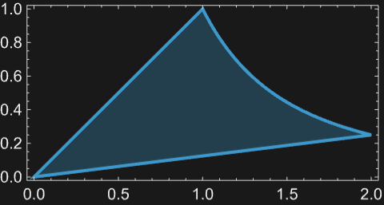
```

Initial value problem for an inhomogeneous heat equation:

```wolfram
heqn=D[u[x,t],t]==D[u[x,t],{x,2}]+m;
```

```wolfram
ic=u[x, 0] == Sin[x];
```

```wolfram
sol=DSolveValue[{heqn,ic },u[x,t],{x,t}]
(* Output *)
m t+ℯ^-t Sin[x]
```

Visualize the growth of the solution for different values of the parameter `*m*`:

```wolfram
Table[Plot3D[Evaluate[sol]/.{m->i},{x,-7,7},{t,0,4},PlotRange->All,Axes->False],{i,{2,0,-2}}]
(* Output *)
{[Graphics3D],[Graphics3D],[Graphics3D]}
```

Dirichlet problem for the heat equation on a finite interval:

```wolfram
heqn=D[u[x,t],t]==D[u[x,t],{x,2}];
```

```wolfram
ic=u[x, 0] ==x(3-x)^2;
```

```wolfram
bc={u[0,t]==0,u[3,t]==0};
```

The solution is a Fourier sine series:

```wolfram
sol=DSolveValue[{heqn,ic,bc },u[x,t],{x,t}]
(* Output *)
(108 (2+(-1)^K[1]) ℯ^(-(1)/(9) π^2 t K[1]^2) Sin[(1)/(3) π x K[1]])/(π^3 K[1]^3)
```

Extract three terms from the [Inactive](https://reference.wolfram.com/language/ref/Inactive.html) sum:

```wolfram
asol=TruncateSum[sol,3]
(* Output *)
(108 ℯ^(-(π^2 t)/(9)) Sin[(π x)/(3)])/(π^3)+(81 ℯ^(-(4 π^2 t)/(9)) Sin[(2 π x)/(3)])/(2 π^3)+(4 ℯ^(-π^2 t) Sin[π x])/(π^3)
```

```wolfram
Plot3D[asol//Evaluate,{x,0,3},{t,0,3/2},Exclusions->None,PlotRange->All]
```

*([Graphics3D])*

Neumann problem for the heat equation on a finite interval:

```wolfram
heqn=D[u[x,t],t]==D[u[x,t],{x,2}];
```

```wolfram
ic=u[x, 0] ==x(3-x);
```

```wolfram
bc={Derivative[1,0][u][0,t]==0,Derivative[1,0][u][3,t]==0};
```

The solution is a Fourier cosine series:

```wolfram
sol=DSolveValue[{heqn,ic,bc },u[x,t],{x,t}]
(* Output *)
(3)/(2)+(2)/(3) -(27 (1+(-1)^K[1]) ℯ^(-(1)/(9) π^2 t K[1]^2) Cos[(1)/(3) π x K[1]])/(π^2 K[1]^2)
```

Extract a few terms from the [Inactive](https://reference.wolfram.com/language/ref/Inactive.html) sum:

```wolfram
asol=TruncateSum[sol,4]
(* Output *)
(3)/(2)+(2)/(3) (-(27 ℯ^(-(4 π^2 t)/(9)) Cos[(2 π x)/(3)])/(2 π^2)-(27 ℯ^(-(16 π^2 t)/(9)) Cos[(4 π x)/(3)])/(8 π^2))
```

```wolfram
Plot3D[asol//Evaluate,{x,0,3},{t,0,1},Exclusions->None,PlotRange->All]
```

*([Graphics3D])*

The solution approaches $\frac{3}{2}$ as $t \to \infty$:

```wolfram
asol/.t->∞
(* Output *)
(3)/(2)
```

Visualize the evolution of the solution to its steady state:

```wolfram
Plot[Evaluate[Table[asol, {t, 0, 1,0.2}]], {x,0,3},PlotRange->All,Filling->Axis]
```

*([Graphics])*

Dirichlet problem for the heat equation in a disk:

```wolfram
rheqn=r D[u[r,t],t]==D[r D[u[r,t],r],r];
```

```wolfram
ic=u[r,0]==1-r;
```

```wolfram
bc=u[1,t]==0;
```

The solution is an infinite Bessel series:

```wolfram
(sol=DSolveValue[{rheqn,ic,bc},u[r,t], {r,t}])//
(* Output *)
(π ℯ^(-t (0)^(2)) 0 (0 1-1 0))/((0)^(2) 1^(2))
```

Extract a few terms from the [Inactive](https://reference.wolfram.com/language/ref/Inactive.html) sum:

```wolfram
h[r_,t_]=TruncateSum[sol,3]//N;
```

Visualize the individual terms of the solution at time `*t*=0.1:

```wolfram
Table[Plot3D[h[r,0.1][[i]]  /.{r->Sqrt[x^2+y^2]}//Evaluate,{x,y}∈Disk[],Ticks->None],{i,3}]
(* Output *)
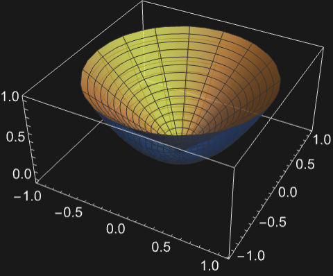
```

Boundary value problem for the Black-Scholes equation:

```wolfram
BlackScholesPDE=D[v[t,s],t]+ 1/2σ^2 s^2 D[v[t,s],{s,2}]+(r-q) s D[v[t,s],s] -r v[t,s]==0;
```

```wolfram
bc=v[T,s]==ψ[s];
```

```wolfram
DSolveValue[{BlackScholesPDE,bc},v[t,s],{t,s}]
(* Output *)
(ℯ^(r (t-T)) ∫_-∞^∞ℯ^(-(((-t+T) (-q+r-(σ^2)/(2))-K[1]+Log[s])^2)/(2 (-t+T) σ^2)) ψ[ℯ^K[1]]ⅆK[1])/(Sqrt[2 π] Sqrt[(-t+T) σ^2])
```

#### Elliptic Partial Differential Equations

Dirichlet problem for the Laplace equation in the upper half-plane:

```wolfram
leqn=Laplacian[u[x,y],{x,y}]==0;
```

```wolfram
bc=u[x,0]==UnitBox[x];
```

```wolfram
sol=DSolveValue[{leqn,bc},u[x,y], {x,y}]
(* Output *)
{, {{({, {{ArcTan[((1)/(2)-x)/(y)]+ArcTan[((1)/(2)+x)/(y)], y>0||x>(1)/(2)||x<-(1)/(2)}, {0, True}}})/(π), y>=0}, {Indeterminate, True}}}
```

Discontinuities in the boundary data are smoothed out:

```wolfram
Plot3D[sol,{x,-3,3},{y,0,5},PlotRange->All,Exclusions->None]
```

*([Graphics3D])*

Dirichlet problem for the Laplace equation in the right half-plane:

```wolfram
leqn=Laplacian[u[x,y],{x,y}]==0;
```

```wolfram
bc=u[0,y]==Sinc[y];
```

```wolfram
sol=DSolveValue[{leqn,bc},u[x,y], {x,y}]
(* Output *)
{, {{(x+(x Cos[y]-y Sin[y]) (-Cosh[x]+Sinh[x]))/(x^2+y^2), x>=0}, {Indeterminate, True}}}
```

Visualize the solution:

```wolfram
Plot3D[sol,{y,-10,10},{x,0,5},PlotRange->All]
```

*([Graphics3D])*

Dirichlet problem for the Laplace equation in the first quadrant:

```wolfram
leqn=Laplacian[u[x,y],{x,y}]==0;
```

```wolfram
bc={u[x,0]==(-1/((x-2)^2+3)),u[0,y]==(1/((y-3)^2+1))};
```

```wolfram
sol=DSolveValue[{leqn,bc},u[x,y], {x,y}];
```

Visualize the solution:

```wolfram
Plot3D[sol,{x,0,10},{y,0,7},PlotRange->All]
```

*([Graphics3D])*

Neumann problem for the Laplace equation in the upper half-plane:

```wolfram
leqn=Laplacian[u[x,y],{x,y}]==0;
```

```wolfram
bc=Derivative[0,1][u][x,0]==UnitBox[x];
```

```wolfram
sol=DSolveValue[{leqn,bc},u[x,y], {x,y}]
(* Output *)
{, {{(1)/(4 π)(-4+4 y ArcCot[(2 y)/(1-2 x)]+4 y ArcTan[((1)/(2)+x)/(y)]-2 Log[4]+Log[(1-2 x)^2+4 y^2]-2 x Log[(1-2 x)^2+4 y^2]+Log[(1+2 x)^2+4 y^2]+2 x Log[(1+2 x)^2+4 y^2]), y>=0}, {Indeterminate, True}}}
```

Visualize the solution:

```wolfram
Plot3D[sol,{x,-3,3},{y,0,5},PlotRange->All,Exclusions->None]
```

*([Graphics3D])*

Dirichlet problem for the Laplace equation in a rectangle:

```wolfram
leqn=Laplacian[u[x,y],{x,y}]==0;
```

```wolfram
bc={u[x,0]==x^2(1-x),u[x,2]==0,u[0,y]==0,u[1,y]==0};
```

The solution is an infinite trigonometric series:

```wolfram
sol=FullSimplify[DSolveValue[{leqn,bc},u[x,y], {x,y}]]
(* Output *)
-(4 (1+2 (-1)^K[1]) Csch[2 π K[1]] Sin[π x K[1]] Sinh[π (2-y) K[1]])/(π^3 K[1]^3)
```

Extract a few terms from the [Inactive](https://reference.wolfram.com/language/ref/Inactive.html) sum:

```wolfram
asol=TruncateSum[sol,4]
(* Output *)
(4 Csch[2 π] Sin[π x] Sinh[π (2-y)])/(π^3)-(3 Csch[4 π] Sin[2 π x] Sinh[2 π (2-y)])/(2 π^3)+(4 Csch[6 π] Sin[3 π x] Sinh[3 π (2-y)])/(27 π^3)-(3 Csch[8 π] Sin[4 π x] Sinh[4 π (2-y)])/(16 π^3)
```

Visualize the solution:

```wolfram
Plot3D[asol,{x,0,1},{y,0,2},PlotRange->All]
```

*([Graphics3D])*

Dirichlet problem for the Laplace equation in a disk:

```wolfram
leqn=Laplacian[u[r,θ],{r,θ},"Polar"]==0;
```

```wolfram
bc=u[3,θ]==Sin[6θ];
```

```wolfram
sol=DSolveValue[{leqn,bc},u[r,θ],{r,θ}]
(* Output *)
(1)/(729) r^6 Sin[6 θ]
```

Visualize the solution:

```wolfram
Plot3D[Evaluate[sol/.{r->Sqrt[x^2+y^2], θ->ArcTan[y/x]}],{x,y}∈Disk[{0,0},3],PlotRange->All,Exclusions->None]
```

*([Graphics3D])*

Dirichlet problem for the Laplace equation in an annulus:

```wolfram
leqn=D[u[r,θ],{r,2}]+(1/r) D[u[r,θ],r]+(1/r^2) D[u[r,θ],{θ,2}]==0;
```

```wolfram
bc={u[1,θ]==0,u[2,θ]==5};
```

```wolfram
sol=DSolveValue[{leqn,bc},u[r,θ],{r,θ}]
(* Output *)
{, {{(5 Log[r])/(Log[2]), 1<=r<=2}, {Indeterminate, True}}}
```

Visualize the solution:

```wolfram
Plot3D[Evaluate[sol/.{r->Sqrt[x^2+y^2], θ->ArcTan[y/x]}],{x,y}∈Annulus[{0,0},{1,2}],PlotRange->All,Exclusions->None]
```

*([Graphics3D])*

Dirichlet problem for the Poisson equation in a rectangle:

```wolfram
peqn=Laplacian[u[x,y],{x,y}]==6x-6y;
```

```wolfram
bc={u[x,0]==1+11x+x^3,u[x,2]==-7+11x+x^3,u[0,y]==1-y^3,u[4,y]==109-y^3};
```

```wolfram
sol=DSolveValue[{peqn,bc},u[x,y],{x,y}]
(* Output *)
1+11 x+x^3-y^3
```

Dirichlet problem for the Helmholtz equation in a rectangle:

```wolfram
heqn={Laplacian[u[x,y],{x,y}]+5 u[x,y]==0};
```

```wolfram
bc={u[x,0]==UnitTriangle[x-2],u[x,2]==0,u[0,y]==0,u[4,y]==0};
```

```wolfram
(sol=DSolveValue[{heqn,bc},u[x,y],{x,y}])//
(* Output *)
(1)/(π^(2) K[1]^(2))64 sin^(3)((1)/(8) π K[1]) (cos((1)/(8) π K[1])+cos((3)/(8) π K[1])) csch((1)/(2) Sqrt(π^(2) K[1]^(2)-80)) sin((1)/(4) π x K[1]) sinh((1)/(4) (2-y) Sqrt(π^(2) K[1]^(2)-80))
```

```wolfram
(1)/(π^(2) K[1]^(2))64 sin^(3)((1)/(8) π K[1]) (cos((1)/(8) π K[1])+cos((3)/(8) π K[1])) csch((1)/(2) Sqrt(π^(2) K[1]^(2)-80)) sin((1)/(4) π x K[1]) sinh((1)/(4) (2-y) Sqrt(π^(2) K[1]^(2)-80))
```

Extract a finite number of terms from the [Inactive](https://reference.wolfram.com/language/ref/Inactive.html) sum:

```wolfram
fsol=TruncateSum[sol,30];
```

Visualize the approximate solution:

```wolfram
Plot3D[fsol//Evaluate,{x,0,4},{y,0,2},PlotRange->All]
```

*([Graphics3D])*

#### General Partial Differential Equations

A potential-free Schrödinger equation with Dirichlet boundary conditions:

```wolfram
eqn=I ℏ D[ψ[x,t],t] == (-ℏ^2)/(2m) D[ψ[x,t],{x,2}];
DSolveValue[{eqn,ψ[a,t]==0,ψ[b,t]==0},ψ[x,t],{x,t}]
(* Output *)
ℯ^(-(ⅈ π^2 t ℏ K[1]^2)/(2 (-a+b)^2 m)) K[1] Sin[(π (-a+x) K[1])/(-a+b)]
```

Extract the first four terms in the solution:

```wolfram
u[x_,t_]=TruncateSum[%,4]
(* Output *)
ℯ^(-(ⅈ π^2 t ℏ)/(2 (-a+b)^2 m)) 1 Sin[(π (-a+x))/(-a+b)]+ℯ^(-(2 ⅈ π^2 t ℏ)/((-a+b)^2 m)) 2 Sin[(2 π (-a+x))/(-a+b)]+ℯ^(-(9 ⅈ π^2 t ℏ)/(2 (-a+b)^2 m)) 3 Sin[(3 π (-a+x))/(-a+b)]+ℯ^(-(8 ⅈ π^2 t ℏ)/((-a+b)^2 m)) 4 Sin[(4 π (-a+x))/(-a+b)]
```

For any choice of the four constants [C](https://reference.wolfram.com/language/ref/C.html)[*k*], `ψ` obeys the equation and boundary conditions:

```wolfram
Simplify[{eqn,ψ[a,t]==0,ψ[b,t]==0} /.ψ->u]
(* Output *)
{True,True,True}
```

Initial value problem for a Schrödinger equation with Dirichlet boundary conditions:

```wolfram
eqn = I  D[ψ[x,t],t] == -2 D[ψ[x,t],{x,2}];
f[x_] := -350+155 x-22 x^2+x^3
sol=DSolveValue[{eqn,ψ[5,t]==0,ψ[10,t]==0,ψ[x,2]==f[x]},ψ,{x,t}]
(* Output *)
Function[{x,t},(100 (7+8 (-1)^K[1]) ℯ^(-(2)/(25) ⅈ π^2 (-2+t) K[1]^2) Sin[(1)/(5) π (-5+x) K[1]])/(π^3 K[1]^3)]
```

Define a family of partial sums of the solution:

```wolfram
u[k_Integer]=TruncateSum[sol,k]
(* Output *)
Function[{x,t},∑_{K[1]=1}^{k}(100 (7+8 (-1)^K[1]) ℯ^(-(2)/(25) ⅈ π^2 (-2+t) K[1]^2) Sin[(1)/(5) π (-5+x) K[1]])/(π^3 K[1]^3)]
```

For each `*k*`, `*u*_*k*` satisfies the differential equation:

```wolfram
Table[eqn /. ψ->u[k],{k,4}]//Simplify
(* Output *)
{True,True,True,True}
```

The boundary conditions are also satisfied:

```wolfram
Table[{u[k][5,t]==0,u[k][10,t]==0},{k,4}]
(* Output *)
{{True,True},{True,True},{True,True},{True,True}}
```

The initial condition is only satisfied for `*u*_∞`, but there is rapid convergence at `*t*==2:

```wolfram
Grid@Partition[Table[Plot[{u[k][x,2],f[x]},{x,5,10},ImageSize->200],{k,4}],2]
(* Output *)
{{[Graphics], [Graphics]}, {[Graphics], [Graphics]}}
```

Solve a Schrödinger equation with potential over the reals:

```wolfram
eqn=I  D[ψ[x,t],t] == - D[ψ[x,t],{x,2}] + 2 x^2ψ[x,t];
```

```wolfram
sol=DSolveValue[{eqn,ψ[-∞,t]==0,ψ[∞,t]==0},ψ[x,t],{x,t}]
(* Output *)
ℯ^(-(x^2)/(Sqrt[2])-2 ⅈ Sqrt[2] t ((1)/(2)+K[1])) K[1] HermiteH[K[1],2^(1/4) x]
```

Extract the first two terms in the solution:

```wolfram
u[x_,t_]=TruncateSum[sol,2]
(* Output *)
ℯ^(-ⅈ Sqrt[2] t-(x^2)/(Sqrt[2])) 0+2 2^(1/4) ℯ^(-3 ⅈ Sqrt[2] t-(x^2)/(Sqrt[2])) x 1
```

For any values of the constants [C](https://reference.wolfram.com/language/ref/C.html)[0] and [C](https://reference.wolfram.com/language/ref/C.html)[1], the equation is satisfied:

```wolfram
Simplify[eqn /. ψ->u]
(* Output *)
True
```

The conditions at infinity are also satisfied:

```wolfram
Limit[u[x,t],x->∞]
(* Output *)
0
```

```wolfram
Limit[u[x,t],x->-∞]
(* Output *)
0
```

Although the function is time dependent, its $L^{2}$-norm is constant:

```wolfram
Integrate[Abs[u[x,t]]^2, {x, -∞, ∞}, Assumptions->t∈Reals]
(* Output *)
(Sqrt[π] (Abs[0]^2+2 Abs[1]^2))/(2^(1/4))
```

Initial value problem for Burgers' equation with viscosity `ν`:

```wolfram
BurgersEqn= D[u[x, t],t]+ u[x, t]D[u[x,t],x] ==ν D[u[x,t],{x,2}];
```

```wolfram
sol=DSolveValue[{BurgersEqn,u[x,0]==UnitBox[x]}, u[x,t],{x,t}];(dsol=sol//FullSimplify)//
(* Output *)
(ℯ^((t+1)/(4 ν)) (erf((2 t-2 x+1)/(4 Sqrt(ν t)))-erf((2 t-2 x-1)/(4 Sqrt(ν t)))))/(ℯ^((t+1)/(4 ν)) (erfc((2 t-2 x-1)/(4 Sqrt(ν t)))-erfc((2 t-2 x+1)/(4 Sqrt(ν t))))+ℯ^((x)/(2 ν)) (erfc((1-2 x)/(4 Sqrt(ν t)))+ℯ^((1)/(2)/ν) erfc((2 x+1)/(4 Sqrt(ν t)))))
```

Plot the solution at different times for `ν=1/40:

```wolfram
Plot[Table[dsol/.{ν-> 1/40},{t,1/100,7}]//Evaluate,{x,-2,3.3},PlotRange->All,Filling->Axis,WorkingPrecision->20]
(* Output *)
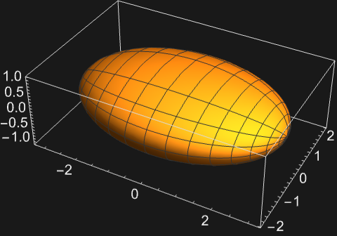
```

Plot the solution for different values of `ν`:

```wolfram
Table[Plot3D[dsol//Evaluate,{x,-2,2},{t,0,5},PlotRange->All,Ticks->False],{ν,{2/3,1/6,1/14}}]
(* Output *)
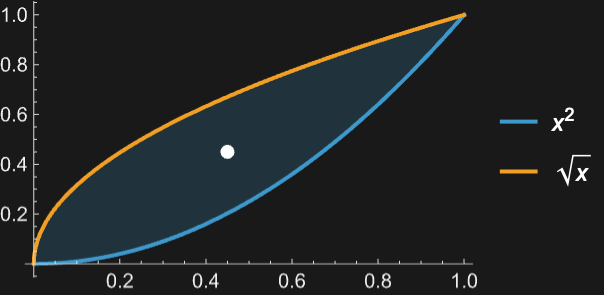
```

Boundary value problem for the Tricomi equation:

```wolfram
TricomiEqn=D[u[x,y],{x,2}]+y D[u[x,y],{y,2}]==0;
```

```wolfram
DSolveValue[{TricomiEqn,u[x,0]==0, Derivative[0,1][u][x,0]==x^2},u[x,y],{x,y}]
(* Output *)
-y (-x^2+y)
```

Visualize the solution:

```wolfram
Plot3D[%//Evaluate, {x,-3,3},{y,0,5}]
```

*([Graphics3D])*

Traveling wave solution for the Korteweg-de Vries (KdV) equation:

```wolfram
KdV = {D[u[x,t],t]+D[u[x,t],{x, 3}]+ 6u[x,t]D[u[x,t],x]==0};
```

```wolfram
sol = DSolveValue[KdV,u[x,t],{x,t}]//Quiet
(* Output *)
-(-8 1^3+2+12 1^3 Tanh[x 1+t 2+3]^2)/(6 1)
```

Obtain a particular solution for a fixed choice of arbitrary constants:

```wolfram
psol=sol/.{1->1,2->-4,3->1/4}//Simplify
(* Output *)
2-2 Tanh[(1)/(4)-4 t+x]^2
```

The wave travels to the right without changing its shape:

```wolfram
Plot[Evaluate[Table[psol,{t,1,12,3}]], {x,-7,35},PlotRange->All,Filling->Axis,Epilog->{Arrow[{{5,1.6},{9,1.6}}],Arrow[{{17,1.6},{21,1.6}}],Arrow[{{29,1.6},{33,1.6}}]}]
(* Output *)
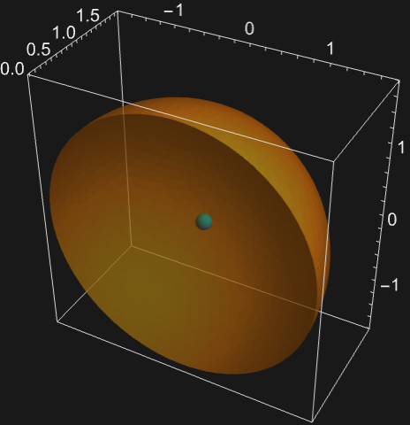
```

#### Partial Differential Equations over Regions

Dirichlet problem for the Laplace equation in a rectangle:

```wolfram
leqn=u[x,y]==0;
```

```wolfram
dcond=DirichletCondition[u[x,y]==Piecewise[{{UnitTriangle[2 x-1],y==0||y==2}},0],True];
```

```wolfram
Ω=Rectangle[{0,0},{1,2}];
```

```wolfram
(sol=FullSimplify[DSolveValue[{leqn,dcond},u[x,y],{x,y}∈Ω]])//
(* Output *)
(8 sin((1)/(2) π K[1]) sech(π K[1]) sin(π x K[1]) cosh(π (y-1) K[1]))/(π^(2) K[1]^(2))
```

Extract the first `100 terms from the [Inactive](https://reference.wolfram.com/language/ref/Inactive.html) sum:

```wolfram
asol=TruncateSum[sol,100];
```

Visualize the solution on the rectangle:

```wolfram
Plot3D[asol//Evaluate,{x,y}∈Ω,PlotRange->All,PlotStyle->Hue[0.2]]
```

*([Graphics3D])*

Dirichlet problem for the Laplace equation in a disk:

```wolfram
leqn=u[x,y]==0;
```

```wolfram
dcond = DirichletCondition[u[x, y]==Sin[6ArcTan[y/x]], True];
```

```wolfram
Ω=Disk[{0,0},3];
```

```wolfram
sol=FullSimplify[DSolveValue[{leqn,dcond},u[x,y],{x,y}∈Ω]]
(* Output *)
(1)/(729) (x^2+y^2)^3 Sin[6 ArcTan[(y)/(x)]]
```

Visualize the solution in the disk:

```wolfram
Plot3D[sol//Evaluate,{x,y}∈Ω,PlotRange->All,PlotStyle->Hue[0.5]]
```

*([Graphics3D])*

Dirichlet problem for the Laplace equation in a right half-plane:

```wolfram
leqn=u[x,y]==0;
```

```wolfram
dcond = DirichletCondition[u[x,y]==1/(1+x^2),True];
```

```wolfram
Ω=HalfPlane[{{0,0},{1,0}},{0,1}];
```

```wolfram
sol=DSolveValue[{leqn,dcond},u[x,y],{x,y}∈Ω]
(* Output *)
(1+y)/(x^2+(1+y)^2)
```

Visualize the solution in the half-plane:

```wolfram
Plot3D[sol//Evaluate,{x,y}∈Ω,PlotRange->All,PlotStyle->Green]
(* Output *)
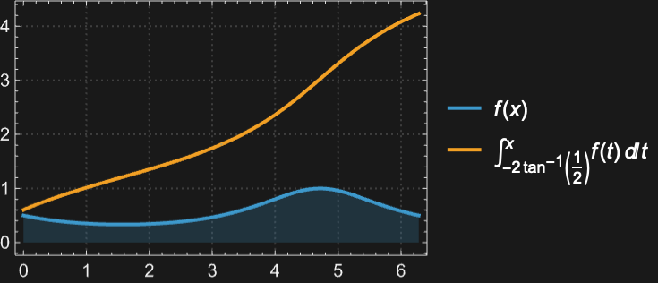
```

#### Fractional Differential Equations

Solve a fractional differential equation of order 1/2:

```wolfram
sol=DSolveValue[CaputoD[y[x],{x,1/2}]-3 y[x]==0,y[x],x]
(* Output *)
ℯ^(9 x) 1 Erfc[-3 Sqrt[x]]
```

Verify the solution:

```wolfram
CaputoD[y[x],{x,1/2}]==3y[x]/.y[x]->sol//FullSimplify
(* Output *)
True
```

Add an initial condition:

```wolfram
sol=DSolveValue[{CaputoD[y[x],{x,1/2}]-3 y[x]==0,y[0]==5},y[x],x]
(* Output *)
5 ℯ^(9 x) Erfc[-3 Sqrt[x]]
```

Plot the solution:

```wolfram
Plot[sol,{x,0,1}]
```

*([Graphics])*

Solve a fractional differential equation containing [CaputoD](https://reference.wolfram.com/language/ref/CaputoD.html) of order 0.7:

```wolfram
sol=DSolveValue[CaputoD[y[x],{x,0.7}]+3 y[x]==0,y[x],x]
(* Output *)
1. 1 MittagLefflerE[0.7,-3. x^0.7]
```

Verify the solution:

```wolfram
CaputoD[y[x],{x,0.7}]+3y[x]==0/.y[x]->sol//FullSimplify
(* Output *)
True
```

Add initial conditions and plot the solution:

```wolfram
sol=DSolveValue[{CaputoD[y[x],{x,0.7}]+3 y[x]==0,y[0]==4},y[x],x];
Plot[sol,{x,0,1}]
```

*([Graphics])*

Solve a fractional differential equation containing two Caputo derivatives of different orders:

```wolfram
sol=DSolveValue[{CaputoD[y[x],{x,3/4}]==-2CaputoD[y[x],{x,1/2}]+ y[x],y[0]==1},y[x],x]
(* Output *)
(1)/(x^(3/4))2 (-(x^(1/4))/(Sqrt[π])-MittagLefflerE[(1)/(4),(1)/(4),-x^(1/4)]-(2 MittagLefflerE[(1)/(4),(1)/(4),(1)/(2) (-1+Sqrt[5]) x^(1/4)])/(-5+Sqrt[5])+(2 MittagLefflerE[(1)/(4),(1)/(4),-(1)/(2) (1+Sqrt[5]) x^(1/4)])/(5+Sqrt[5]))+(1)/(5 x^(3/4) Gamma[(1)/(4)])(-5+5 Gamma[(1)/(4)] MittagLefflerE[(1)/(4),(1)/(4),-x^(1/4)]+Sqrt[5] Gamma[(1)/(4)] MittagLefflerE[(1)/(4),(1)/(4),(1)/(2) (-1+Sqrt[5]) x^(1/4)]-Sqrt[5] Gamma[(1)/(4)] MittagLefflerE[(1)/(4),(1)/(4),-(1)/(2) (1+Sqrt[5]) x^(1/4)])
```

Plot the solution:

```wolfram
Plot[sol,{x,0,1}]
```

*([Graphics])*

Solve a non-homogeneous fractional differential equation of order 1/7:

```wolfram
sol=DSolveValue[{CaputoD[y[x],{x,1/7}]==8 (1-y[x]),y[0]==2},y,x]
(* Output *)
Function[{x},1+MittagLefflerE[(1)/(7),-8 x^(1/7)]]
```

Verify the solution:

```wolfram
{CaputoD[y[x],{x,1/7}]==8 (1-y[x]),y[0]==2}/.y->sol//Simplify
(* Output *)
{True,True}
```

Solve a system of two fractional differential equations:

```wolfram
eqns={CaputoD[x1[t],{t,0.95}]==2x1[t]-x2[t],CaputoD[x2[t],{t,0.95}]==4x1[t]-3x2[t],x1[0]==1.2,x2[0]==4.2};
```

```wolfram
sol=DSolveValue[eqns,{x1,x2},t]
(* Output *)
{Function[{t},1. MittagLefflerE[0.95,-2 t^0.95]+0.2 MittagLefflerE[0.95,t^0.95]],Function[{t},4. MittagLefflerE[0.95,-2 t^0.95]+0.2 MittagLefflerE[0.95,t^0.95]]}
```

Verify the solution:

```wolfram
eqns/.{x1->sol[[1]],x2->sol[[2]]}//Simplify
(* Output *)
{True,True,True,True}
```

Parametrically plot the solution:

```wolfram
ParametricPlot[Evaluate[{sol[[1]][t],sol[[2]][t]}],{t,0,2}]
```

*([Graphics])*

Solve a system of two fractional ODEs in vector form:

```wolfram
m={{0,1},{-1,0}};
a=16/17;
v={-3,5};
sol=DSolveValue[{CaputoD[x[t],{t,a}]==m. x[t],x[0]==v}, Element[x[t], Vectors[2]], t]
(* Output *)
{(-(3)/(2)+(5 ⅈ)/(2)) MittagLefflerE[(16)/(17),-ⅈ t^(16/17)]-((3)/(2)+(5 ⅈ)/(2)) MittagLefflerE[(16)/(17),ⅈ t^(16/17)],((5)/(2)+(3 ⅈ)/(2)) MittagLefflerE[(16)/(17),-ⅈ t^(16/17)]+((5)/(2)-(3 ⅈ)/(2)) MittagLefflerE[(16)/(17),ⅈ t^(16/17)]}
```

Plot the solution:

```wolfram
Plot[Evaluate[sol],{t,0,10}]
```

*([Graphics])*

Parametrically plot the solution:

```wolfram
ParametricPlot[Evaluate[sol],{t,0,20}]
```

*([Graphics])*

Solve a system of three fractional differential equations in vector form:

```wolfram
m={{-1,0,0},{2,1,-9},{3,6,1}};
a=0.95;
v={-3,5,0};
```

```wolfram
sol=DSolveValue[{CaputoD[x[t],{t,a}]==m. x[t],x[0]==v}, Element[x[t], Vectors[3]], t]
(* Output *)
{(-3.+0. ⅈ) MittagLefflerE[0.95,-t^0.95],(1.603448275862069+0. ⅈ) MittagLefflerE[0.95,-t^0.95]+(1.6982758620689655-0.1900466179745569 ⅈ) MittagLefflerE[0.95,(1-3 ⅈ Sqrt[6]) t^0.95]+(1.6982758620689657+0.1900466179745569 ⅈ) MittagLefflerE[0.95,(1+3 ⅈ Sqrt[6]) t^0.95],(-0.3103448275862069+0. ⅈ) MittagLefflerE[0.95,-t^0.95]+(0.15517241379310345+1.3866364348513969 ⅈ) MittagLefflerE[0.95,(1-3 ⅈ Sqrt[6]) t^0.95]+(0.15517241379310345-1.386636434851397 ⅈ) MittagLefflerE[0.95,(1+3 ⅈ Sqrt[6]) t^0.95]}
```

Plot the solution:

```wolfram
Plot[Evaluate[sol],{t,0,1}]
```

*([Graphics])*

Solve a fractional wave equation:

```wolfram
a=19/10;
fweqn=CaputoD[y[t,x],{t,a}]==D[y[t,x],{x,2}];
ic={y[0,x]==Sin[Pi x],Derivative[1,0][y][0,x]==0,y[t,0]==0,y[t,1]==0};
```

```wolfram
sol=DSolveValue[{fweqn,ic},y[t,x],{t,x}]
(* Output *)
MittagLefflerE[(19)/(10),-π^2 t^(19/10)] Sin[π x]
```

Plot the solution:

```wolfram
Plot3D[sol,{x,-5,5},{t,0,1},PlotPoints->25]
(* Output *)
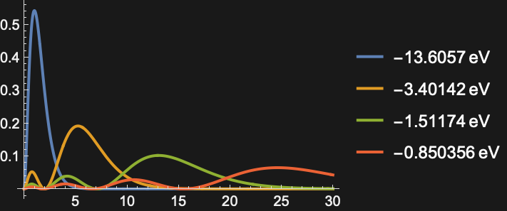
```

#### System Models

Calculate the [OutputResponse](https://reference.wolfram.com/language/ref/OutputResponse.html) and [StateResponse](https://reference.wolfram.com/language/ref/StateResponse.html) of the [StateSpaceModel](https://reference.wolfram.com/language/ref/StateSpaceModel.html) for a sinusoidal input:

```wolfram
DSolveValue[Sin[t]->StateSpaceModel[{{{a}},{{b}},{{c}},{{d}}}],"OutputResponse",t]
(* Output *)
d Sin[t]-(b c (-ℯ^(a t)+Cos[t]+a Sin[t]))/(1+a^2)
```

```wolfram
DSolveValue[Sin[t]->StateSpaceModel[{{{a}},{{b}},{{c}},{{d}}}],"StateResponse",t]
(* Output *)
-(b (-ℯ^(a t)+Cos[t]+a Sin[t]))/(1+a^2)
```

The output response of a transfer function model to a sinusoidal input:

```wolfram
DSolveValue[Sin[10t]-><|model -> Hold[TransferFunctionModel[11+s, s]], format -> StandardForm|>,"OutputResponse",t]
(* Output *)
-(1)/(101) ℯ^-t (-10+10 ℯ^t Cos[10 t]-ℯ^t Sin[10 t])
```

Find the step response, impulse response and ramp response for a transfer function model:

```wolfram
tfm=<|model -> Hold[TransferFunctionModel[15+s+s^2, s]], format -> StandardForm|>;
```

```wolfram
sr=DSolveValue[tfm,"StepResponse",t]//PiecewiseExpand
(* Output *)
{, {{(1)/(95) ℯ^(-t/2) (-19 Cos[(Sqrt[19] t)/(2)]+19 ℯ^(t/2) Cos[(Sqrt[19] t)/(2)]^2-Sqrt[19] Sin[(Sqrt[19] t)/(2)]+19 ℯ^(t/2) Sin[(Sqrt[19] t)/(2)]^2), t>=0}, {0, True}}}
```

```wolfram
ir=DSolveValue[tfm,"ImpulseResponse",t]
(* Output *)
(2 ℯ^(-t/2) HeavisideTheta[t] Sin[(Sqrt[19] t)/(2)])/(Sqrt[19])
```

```wolfram
rr=DSolveValue[tfm,"RampResponse",t]//PiecewiseExpand
(* Output *)
{, {{(1)/(475) ℯ^(-t/2) (19 Cos[(Sqrt[19] t)/(2)]-19 ℯ^(t/2) Cos[(Sqrt[19] t)/(2)]^2+95 ℯ^(t/2) t Cos[(Sqrt[19] t)/(2)]^2-9 Sqrt[19] Sin[(Sqrt[19] t)/(2)]-19 ℯ^(t/2) Sin[(Sqrt[19] t)/(2)]^2+95 ℯ^(t/2) t Sin[(Sqrt[19] t)/(2)]^2), t>0}, {0, True}}}
```

Plot the results:

```wolfram
Plot[{sr,ir,rr},{t,0,10}, PlotRange->All,PlotLegends->{"Step response","Impulse response","Ramp response"}]
(* Output *)
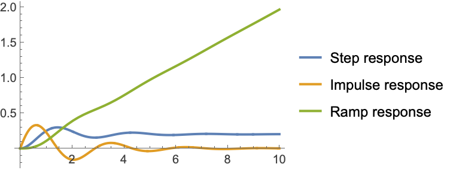
```

The response of a state-space model for nonzero initial conditions:

```wolfram
DSolveValue[{0-><|model -> Hold[StateSpaceModel[-20.80-0.8-2000-110-11000, SamplingPeriod -> None, SystemsModelLabels -> None]], format -> StandardForm|>,{1,0.1,1}},"OutputResponse",t]
(* Output *)
0.+1. ℯ^(-2. t) (1. Cos[0.8 t]+0.1 Sin[0.8 t])
```

Response for a multiple-input, multiple-output transfer function model:

```wolfram
DSolveValue[{Sin[2t-Pi/2],Sin[t]}-><|model -> Hold[TransferFunctionModel[1111s1+s2+s3+s, s]], format -> StandardForm|>,"OutputResponse",{t,0,20}]
(* Output *)
{-(3)/(20) ℯ^(-3 t) (1-5 ℯ^(2 t)+4 ℯ^(3 t) Cos[t]-2 ℯ^(3 t) Sin[t])+(1)/(20) ℯ^(-3 t) (3-5 ℯ^(2 t)+2 ℯ^(3 t) Cos[t]+4 ℯ^(3 t) Sin[t])+(1)/(4) ℯ^(-2 t) (-1+ℯ^(2 t) Cos[2 t]-ℯ^(2 t) Sin[2 t])-(1)/(4) ℯ^(-2 t) (-1+ℯ^(2 t) Cos[2 t]+ℯ^(2 t) Sin[2 t]),-(1)/(20) ℯ^(-3 t) (1-5 ℯ^(2 t)+4 ℯ^(3 t) Cos[t]-2 ℯ^(3 t) Sin[t])+(1)/(20) ℯ^(-3 t) (3-5 ℯ^(2 t)+2 ℯ^(3 t) Cos[t]+4 ℯ^(3 t) Sin[t])-(1)/(4) ℯ^(-2 t) (-1+ℯ^(2 t) Cos[2 t]+ℯ^(2 t) Sin[2 t])}
```

```wolfram
Plot[Evaluate@%,{t,0,20}]
```

*([Graphics])*

Output responses for a state-space model:

```wolfram
sys=StateSpaceModel[<|model -> Hold[TransferFunctionModel[11-a+s-b+s, s]], format -> StandardForm|>]
(* Output *)
<|model -> Hold[StateSpaceModel[a00b10011100]], format -> StandardForm|>
```

```wolfram
DSolveValue[Sin[t]->sys,"OutputResponse",t]
(* Output *)
{{-(-ℯ^(a t)+Cos[t]+a Sin[t])/(1+a^2)},{-(-ℯ^(b t)+Cos[t]+b Sin[t])/(1+b^2)}}
```

This returns the sum of responses:

```wolfram
DSolveValue[Sin[t]->sys,{"OutputResponse",#1+#2&},t]
(* Output *)
-(-ℯ^(a t)+Cos[t]+a Sin[t])/(1+a^2)-(-ℯ^(b t)+Cos[t]+b Sin[t])/(1+b^2)
```

The state response for a generic continuous-time system:

```wolfram
Expand[DSolveValue[{u[t]-><|model -> Hold[StateSpaceModel[ab, SamplingPeriod -> None, SystemsModelLabels -> None]], format -> StandardForm|>,{x_0}},"StateResponse",t]]
(* Output *)
ℯ^(a t) x_0+ℯ^(a t) b ℯ^(-a K[1]) u[K[1]]
```

The response to a unit step input:

```wolfram
DSolveValue[{UnitStep[t]-><|model -> Hold[StateSpaceModel[ab, SamplingPeriod -> None, SystemsModelLabels -> None]], format -> StandardForm|>,{x_0}},"StateResponse",t]
(* Output *)
ℯ^(a t) x_0+(-ℯ^(a t) x_0+(-b+b ℯ^(a t)+a ℯ^(a t) x_0)/(a)) UnitStep[t]
```

The state response of a descriptor [StateSpaceModel](https://reference.wolfram.com/language/ref/StateSpaceModel.html):

```wolfram
Expand[DSolveValue[{u[t]-><|model -> Hold[StateSpaceModel[abcde, SamplingPeriod -> None, SystemsModelLabels -> None]], format -> StandardForm|>,{x_0}},"StateResponse",t]]
(* Output *)
ℯ^((a t)/(e)) x_0+ℯ^((a t)/(e)) (b ℯ^(-(a K[1])/(e)) u[K[1]])/(e)
```

The output response of a descriptor [StateSpaceModel](https://reference.wolfram.com/language/ref/StateSpaceModel.html):

```wolfram
Expand[DSolveValue[{u[t]-><|model -> Hold[StateSpaceModel[abcde, SamplingPeriod -> None, SystemsModelLabels -> None]], format -> StandardForm|>,{x_0}},"OutputResponse",t]]
(* Output *)
c ℯ^((a t)/(e)) x_0+d u[t]+c ℯ^((a t)/(e)) (b ℯ^(-(a K[1])/(e)) u[K[1]])/(e)
```

### Generalizations & Extensions

Obtain an expression for the derivative of the solution:

```wolfram
DSolveValue[{y''[x]+y[x]==0,y[0]==0,y'[0]==1},y'[x],x]
(* Output *)
Cos[x]
```

No boundary condition gives two generated parameters:

```wolfram
DSolveValue[y''[x]+4y[x]==0,y,x]
(* Output *)
Function[{x},1 Cos[2 x]+2 Sin[2 x]]
```

One boundary condition:

```wolfram
DSolveValue[{y''[x]+4y[x]==0,y[0]==1},y,x]
(* Output *)
Function[{x},Cos[2 x]+2 Sin[2 x]]
```

Two boundary conditions:

```wolfram
DSolveValue[{y''[x]+4y[x]==0,y[0]==1,y'[0]==4},y,x]
(* Output *)
Function[{x},Cos[2 x]+2 Sin[2 x]]
```

### Options

#### Assumptions

Solve an eigenvalue problem for a linear second-order differential equation:

```wolfram
DSolveValue[{y''[x]+λy[x]==0,y[0]==0,y[π]==0},y[x],x]
(* Output *)
{, {{1 Sin[x Sqrt[λ]], n∈Integers&&n>=1&&λ==n^2}, {0, True}}}
```

Use [Assumptions](https://reference.wolfram.com/language/ref/Assumptions.html) to specify a range for the parameter `λ`:

```wolfram
DSolveValue[{y''[x]+λy[x]==0,y[0]==0,y[π]==0},y[x],x,Assumptions->0<λ<20]
(* Output *)
{, {{1 Sin[x Sqrt[λ]], λ==1||λ==4||λ==9||λ==16}, {0, True}}}
```

#### DiscreteVariables

Specify that a variable maintains its value between events:

```wolfram
sol=DSolveValue[{x'[t] ==a[t],x[0]==0, a[0]==2,WhenEvent[Mod[x[t],1]==0,a[t]->- a[t]]},{x[t],a[t]},{t,0,2},DiscreteVariables->a]
(* Output *)
{{, {{2 t, 0<=t<=(1)/(2)}, {2-2 t, (1)/(2)<t<=1}, {2 (-1+t), 1<t<=(3)/(2)}, {4-2 t, (3)/(2)<t<=2}, {Indeterminate, True}}},{, {{2, 0<=t<=(1)/(2)}, {-2, (1)/(2)<t<=1}, {2, 1<t<=(3)/(2)}, {-2, (3)/(2)<t<=2}, {Indeterminate, True}}}}
```

```wolfram
Plot[sol[[1]],{t,0,2}]
```

*([Graphics])*

#### GeneratedParameters

Use differently named constants:

```wolfram
DSolveValue[y''[x]==y[x],y[x],x, GeneratedParameters->d]
(* Output *)
ℯ^x d[1]+ℯ^-x d[2]
```

Use subscripted constants:

```wolfram
DSolveValue[y''[x]==y[x],y[x],x,GeneratedParameters->(c_#&)]
(* Output *)
ℯ^x c_1+ℯ^-x c_2
```

Generate uniquely named constants of integration:

```wolfram
DSolveValue[y''[x]==y[x],y[x],x, GeneratedParameters->Unique[C]]
(* Output *)
ℯ^x C$321638[1]+ℯ^-x C$321638[2]
```

The constants of integration are unique across different invocations of [DSolveValue](https://reference.wolfram.com/language/ref/DSolveValue.html):

```wolfram
DSolveValue[y''[x]==y[x],y[x],x, GeneratedParameters->Unique[C]]
(* Output *)
ℯ^x C$321644[1]+ℯ^-x C$321644[2]
```

#### Method

Solve a linear ordinary differential equation:

```wolfram
DSolveValue[{y''[x]+y[x]==0,y[0]==0,y'[0]==1},y[x],x]
(* Output *)
Sin[x]
```

Obtain a solution in terms of [DifferentialRoot](https://reference.wolfram.com/language/ref/DifferentialRoot.html):

```wolfram
DSolveValue[{y''[x]+y[x]==0,y[0]==0,y'[0]==1},y[x],x,Method->"Holonomic"]
(* Output *)
<|head -> DifferentialRoot, big -> {{y[x]+y^′′[x]==0}, {y[0]==0}, {y^′[0]==1}}, small -> y^′′[x], branchcuts -> None|>[x]
```

### Applications

#### Ordinary Differential Equations

Solve a logistic (Riccati) equation:

```wolfram
sol=DSolveValue[{y'[x] == y[x](1-y[x]/27),y[0]==a},y,x]//Quiet
(* Output *)
Function[{x},(27 a ℯ^x)/(27-a+a ℯ^x)]
```

Plot the solution for different initial values:

```wolfram
Plot[sol[x]/.{{a->1/13},{a->1/2},{a-> 4}}//Evaluate,{x,0,18}]
```

*([Graphics])*

Solve a linear pendulum equation:

```wolfram
sol=DSolveValue[{y''[x]+y[x]==0,y[0]==1,y'[0]==1/3},y ,x]
(* Output *)
Function[{x},(1)/(3) (3 Cos[x]+Sin[x])]
```

```wolfram
Plot[sol[x],{x,0,17}]
```

*([Graphics])*

Displacement of a linear, damped pendulum:

```wolfram
sol=DSolveValue[{y''[x]+3y'[x]+40 y[x]==0,y[0]==1,y'[0]==1/3},y,x]
(* Output *)
Function[{x},(1)/(453) ℯ^(-3 x/2) (453 Cos[(Sqrt[151] x)/(2)]+11 Sqrt[151] Sin[(Sqrt[151] x)/(2)])]
```

```wolfram
Plot[sol[x], {x, 0,4}, PlotRange -> All]
```

*([Graphics])*

Directly find the solution in phase space:

```wolfram
phase[x_]=DSolveValue[{y''[x]+3y'[x]+40 y[x]==0,y[0]==1,y'[0]==1/3},{y[x],y'[x]},x];
```

```wolfram
ParametricPlot[phase[x],{x,0,4},PlotRange->All,AspectRatio->1]
```

*([Graphics])*

Study the phase portrait of a dynamical system:

```wolfram
{sol1,sol2}=DSolveValue[{x'[t]==-2y[t]+3x[t],y'[t]==15x[t]-y[t],x[0]==a,y[0]==b},{x,y}, t];
```

```wolfram
ParametricPlot[Evaluate[Table[{sol1[t],sol2[t]}/.{a->1/(13+m), b->1/(15+m)}, {m,0,20,7}]], {t,-2,2}]
(* Output *)
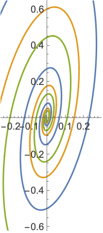
```

Find a power series solution when the exact solution is known:

```wolfram
DSolveValue[{y'[x]+Exp[x]y[x]==1,y[0]==3},y[x] ,x]
(* Output *)
ℯ^(-ℯ^x) (3 ℯ-ExpIntegralEi[1]+ExpIntegralEi[ℯ^x])
```

```wolfram
Series[%,{x,0,7}]
(* Output *)
3-2 x-(x^2)/(2)+(x^3)/(3)+(x^4)/(6)-(x^5)/(120)-(11 x^6)/(360)-(x^7)/(105)+O[x]^8
```

Compute the limiting value of the solution at [Infinity](https://reference.wolfram.com/language/ref/Infinity.html):

```wolfram
DSolveValue[{x''[t]-E^(-x'[t])+x[t]==0,x[0]==1,x'[0]==5},x[∞],t]//Quiet
(* Output *)
1
```

Model a block on a moving conveyor belt anchored to a wall by a spring. Compare positions and velocities for the different values of the parameters of the system (mass of the block, belt speed, friction coefficient, spring constant):

$$
\text{[Graphics]}
$$

```wolfram
beltv[t_]=vb;
spring[x_]=k(l-x);
friction[v_]:=-a(v-beltv[t]);
```

Newton's equation for the block:

```wolfram
sys:={m x''[t]==spring[x[t]]+friction[x'[t]],x[0]==l, x'[0]==0};
```

Solve for position and velocity:

```wolfram
{pos[m_,k_,a_,vb_,t_],vel[m_,k_,a_,vb_,t_]}=DSolveValue[sys,{x[t],x'[t]},{t,0,2}]//FullSimplify
(* Output *)
{(1)/(2 k Sqrt[a^2-4 k m])ℯ^(-((a+Sqrt[a^2-4 k m]) t)/(2 m)) (a (a-Sqrt[a^2-4 k m]) vb-a ℯ^((Sqrt[a^2-4 k m] t)/(m)) (a+Sqrt[a^2-4 k m]) vb+2 ℯ^(((a+Sqrt[a^2-4 k m]) t)/(2 m)) Sqrt[a^2-4 k m] (k l+a vb)),(2 a ℯ^(-(a t)/(2 m)) vb Sinh[(Sqrt[a^2-4 k m] t)/(2 m)])/(Sqrt[a^2-4 k m])}
```

The block stabilizes just above the spring's natural length of $l$:

```wolfram
l=1;
Manipulate[{Plot[{pos[m,k,a,vb,t]},{t,0,2},PlotRange->All,PlotLabel->"Position"],Plot[{vel[m,k,a,vb,t],vb},{t,0,2},PlotRange->All,PlotLabel->"Velocity"]},{{m,1,"mass of the block"},1,10,1},{{k,100,"spring constant"},100,1000,100},{{vb,1,"belt velocity"},1,10,1},{{a,5,"friction coefficient"},5,45,10},SaveDefinitions->True]
```

Use component laws together with Kirchhoff's laws for connections to simulate the response of an RLC circuit to a step impulse in the voltage $v_{1}$ applied at time $t=0.01$:

$$
\text{[Graphics]}
$$

The component laws read $R I_{R}(t)=V_{R}(t)$, $L I_{L}^{'}(t)=V_{L}(t)$, $I_{C}(t)=C V_{C}^{'}(t)$, $V_{C}(t)+V_{L}(t)+V_{R}(t)-V_{1}(t)=0$ and $I_{L}(t)=I_{R}(t)=I_{C}(t)$:

```wolfram
ClearAll[r,l,c];
vR[t_]:=r iL[t];
vL[t_]:=v1[t]-vR[t]-vC[t];
sys={l iL'[t]==vL[t],c vC'[t]==iL[t]};
```

Simulate a step response:

```wolfram
v1[t_]:=UnitStep[t-.01];
ic={iL[0]==0,vC[0]==0};
```

```wolfram
{iL1[r_,c_,l_,t_],vC1[r_,c_,l_,t_]}=DSolveValue[Flatten[{sys,ic}],{iL[t],vC[t]},t];
```

Visualize the response for different values of $R$, $L$ and $C$:

```wolfram
Manipulate[{Plot[Evaluate[{v1[t],Re[vC1[r,c,l,t]]}],{t,0,.03},Filling->{1->0},Ticks->{Range[0.01,0.03,0.01],Automatic},PlotRange->All,PlotLabel->"V_C[t]"],Plot[Evaluate[Re[iL1[r,c,l,t]]],{t,0,.03},Ticks->{Range[0.01,0.03,0.01],Automatic},PlotRange->All,PlotLabel->"I[t]"]},{{r,1,"R"},1,10,1},{{l,10^-2,"L"},10^-2,5 10^-2,10^-2},{{c,10^-4,"C"},10^-4,5 10^-4,10^-4},SaveDefinitions->True]
```

Model the change in height of water in two cylindrical tanks as water flows from one tank to another through a pipe:

$$
\text{[Graphics]}
$$

Use pressure relations $p=\rho g h$ and mass conservation:

```wolfram
p1[t_]:= ρ g h1[t];
p2[t_]:=ρ g h2[t];
```

Model the flow across the pipe with the Hagen-Poiseuille relation:

```wolfram
flowRate=(p1[t]-p2[t])(π pipeDia^4)/(128 μ pipeLen);
massConservation={a1 h1'[t]==-flowRate,a2 h2'[t]==flowRate};
ic={h1[0]==1,h2[0]==0};
```

Simulate the system:

```wolfram
{h1[t_],h2[t_]}=DSolveValue[Flatten[{massConservation,ic}],{h1[t],h2[t]},t]
(* Output *)
{(a1+a2 ℯ^(((-a1-a2) g π pipeDia^4 t ρ)/(128 a1 a2 pipeLen μ)))/(a1+a2),-(a1 (-1+ℯ^(((-a1-a2) g π pipeDia^4 t ρ)/(128 a1 a2 pipeLen μ))))/(a1+a2)}
```

Visualize the solution for particular values of the parameters:

```wolfram
params={pipeLen->0.1,pipeDia->0.2,a1->1,a2->1,ρ->0.2,μ->2 10^-3,g->9.81};
```

```wolfram
Plot[Evaluate[{h1[t],h2[t]}/.params],{t,0,15},PlotRange->All,PlotLegends->{"h_1[t]","h_2[t]"}]
```

*([Graphics])*

Solve the equation of a fractional harmonic oscillator of order 1.9:

```wolfram
DSolveValue[{CaputoD[x[t],{t,1.9}]+ x[t]==0,x[0]==1,x'[0]==0},x[t],t]
(* Output *)
1. MittagLefflerE[1.9,-1. t^1.9]
```

Plot the solution:

```wolfram
fracsol=Plot[%,{t,0,20}]
```

*([Graphics])*

A fractional harmonic oscillator behaves like a damped harmonic oscillator:

```wolfram
dampedOsc=DSolveValue[{x''[t]+a x'[t]+ x[t]==0,x[0]==1,x'[0]==0},x[t],t]//FullSimplify
(* Output *)
ℯ^(-(a t)/(2)) (Cosh[(1)/(2) Sqrt[-4+a^2] t]+(a Sinh[(1)/(2) Sqrt[-4+a^2] t])/(Sqrt[-4+a^2]))
```

Fit the data for a fractional oscillator with the solution of a damped oscillator to determine the corresponding value for damping factor $a$:

```wolfram
data=Cases[InputForm[fracsol],Line[m_]:>m,-1][[1]];
fit=FindFit[data,dampedOsc,a,t]
(* Output *)
{a->0.15210291799651401}
```

Compare the results:

```wolfram
dampedsol=Plot[dampedOsc/.fit,{t,0,20}];
Show[fracsol,dampedsol]
```

*([Graphics])*

Solve the equation of fractional LC electric circuit:

```wolfram
LCeqn[α_,l_,c_]={CaputoD[i[t],{t,α}]+(1)/(l c)i[t]==0,i[0]==0.1,i'[0]==0};
```

```wolfram
LCsol[α_,l_,c_]:=DSolveValue[LCeqn[α,l,c],i[t],t];
```

The classical solution can be obtained for $\alpha=2$:

```wolfram
LCsol[2,l,c]
(* Output *)
0.1 Cos[(t)/(Sqrt[c] Sqrt[l])]
```

Solve the LC circuit equation for $\alpha=1.9$:

```wolfram
LCsol[1.9,l,c]
(* Output *)
0.1 MittagLefflerE[1.9,-(t^1.9)/(c l)]
```

Plot the solutions for various values of equation order $\alpha$:

```wolfram
Plot[Evaluate[{LCsol[2,1,1],LCsol[1.9,1,1],LCsol[1.8,1,1]}],{t,0,10},PlotLegends->{"α=2","α=1.9","α=1.8"}]
```

*([Graphics])*

Solve the equation of fractional RC electric circuit:

```wolfram
RCeqn[α_,r_,c_]={CaputoD[v[t],{t,α}]+(1)/(r c)v[t]==0,v[0]==20};
```

```wolfram
RCsol[α_,r_,c_]:=DSolveValue[RCeqn[α,r,c],v[t],t]
```

The classical solution can be obtained for $\alpha=1$:

```wolfram
RCsol[1,r,c]
(* Output *)
20 ℯ^(-(t)/(c r))
```

Solve the RC circuit equation for $\alpha=0.9$:

```wolfram
RCsol[0.9,r,c]
(* Output *)
20. MittagLefflerE[0.9,-(t^0.9)/(c r)]
```

Plot the solutions for various values of equation order $\alpha$:

```wolfram
Plot[Evaluate[{RCsol[1,10,1],RCsol[0.9,10,1],RCsol[0.8,10,1]}],{t,0,100},PlotLegends->{"α=1","α=0.9","α=0.8"}]
```

*([Graphics])*

#### Hybrid Differential Equations

Model a damped oscillator that gets a kick at regular time intervals:

```wolfram
system={x''[t]+.1x'[t]+x[t]==0,x[0]==1,x'[0]==0};
control=WhenEvent[Mod[t,1]==0,x'[t]->x'[t]+1];
```

```wolfram
sol=DSolveValue[{system,control},x,{t,0,50}];
```

```wolfram
Plot[Evaluate[{sol[t],sol'[t]}],{t,0,50}]
```

*([Graphics])*

Rectify a sine wave:

```wolfram
sol=DSolveValue[{x''[t]+x[t]==0,x[0]==0,x'[0]==1,WhenEvent[x[t]==0,x'[t]->-x'[t]]},x,{t,0,4π}]
(* Output *)
Function[{t},{, {{Sin[t], 0<=t<=π}, {-Sin[t], π<t<=2 π}, {Sin[t], 2 π<t<=3 π}, {-Sin[t], 3 π<t<=4 π}, {Indeterminate, True}}}]
```

```wolfram
Plot[Evaluate[{Sin[t],sol[t]}],{t,0,4π}]
```

*([Graphics])*

Model a ball bouncing down steps:

```wolfram
c=.75;
sol=DSolveValue[{y''[t]==-9.8,y[0]==13.5,y'[0]==5,a[0]==13,WhenEvent[y[t]-a[t]==0,y'[t]->-c y'[t]],WhenEvent[Mod[t,1],a[t]->a[t]-1]},{y,a},{t,0,8},DiscreteVariables->{a}] ;
```

```wolfram
Plot[Evaluate[{y[t],a[t]}/.Thread[{y,a}->sol]],{t,0,8},Filling->{2->0},Exclusions->None]
(* Output *)
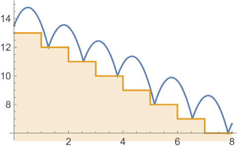
```

In a square box, model a ball that changes direction upon impact with the side walls:

```wolfram
sol=DSolveValue[{x'[t]==a[t],y'[t]==b[t],x[0]==0,y[0]==0,a[0]==1,b[0]==17/12,WhenEvent[x[t]^2==1,a[t]->-a[t]],WhenEvent[y[t]^2==1,b[t]->-b[t]]},{x,y},{t,0,50}, DiscreteVariables->{a,b}];
```

```wolfram
ParametricPlot[{x[t],y[t]}/.Thread[{x,y}->sol],{t,0,50},Frame->True,FrameTicks->None,PlotRange->1,Axes->False]
```

*([Graphics])*

Simulate the system $y^{'}=y+u$ stabilized with a discrete-time controller $u(k \tau)=-2 y(k \tau)$:

```wolfram
system={y'[t]==y[t]+u[t],y[0]==1,u[0]==0};
control=WhenEvent[Mod[t,1]==0,u[t]->-2y[t]];
```

Simulate and visualize:

```wolfram
DSolveValue[{system,control},{y,u},{t,0,20},DiscreteVariables->u];
```

```wolfram
Plot[Evaluate[{u[t],y[t]}/.{Thread[{u,y}->%]}], {t, 0, 10}, PlotRange->{-6,6},Exclusions->None]
```

*([Graphics])*

Control a double integrator using a dead-beat discrete-time controller:

```wolfram
system={x''[t]==u[t],x[0]==1,x'[0]==1,u[0]==-7};
```

Use a dead-beat digital feedback controller $u(k \tau)=-1/\tau^{2}x(k \tau)-3/(2 \tau) x'(k \tau)$:

```wolfram
τ=0.5;
control=WhenEvent[Mod[t,τ]==0,u[t]-> -(1/τ^2)x[t]-(3/(2τ))x'[t]];
```

Simulate and visualize:

```wolfram
DSolveValue[{system,control},{x,u},{t,0,2},DiscreteVariables->u];
```

```wolfram
Plot[Evaluate[{x[t],x'[t],u[t]}/.Thread[{x,u}->%]], {t,0,2}, PlotRange->All,Exclusions->None]
```

*([Graphics])*

Model the position of a moving body with 1 kg mass:

```wolfram
system={x''[t]==u[t],x'[0]==x[0]==0,u[0]==1};
```

Use a sampled proportional-derivative (PD) controller to keep the position constant:

```wolfram
kp=1; td=1;τ=1; xref=1;
control=WhenEvent[Mod[t,τ]==0,u[t]->kp(xref-x[t]-td x'[t])];
```

Simulate and visualize:

```wolfram
DSolveValue[{system,control},{x,u},{t, 0,12}, DiscreteVariables->u];
```

```wolfram
Plot[Evaluate[{xref,x[t],u[t]}/.Thread[{x,u}->%]],{t,0,12},Exclusions->None]
```

*([Graphics])*

Set the physical variable `a` to `0 whenever it becomes negative:

```wolfram
sol = DSolveValue[{a'[t]==-1/11u[t], a[0]==1, u[0]==1,
     WhenEvent[a[t]<0,u[t]->0]},a,{t,0,15}, DiscreteVariables->u]
(* Output *)
Function[{t},{, {{1-(t)/(11), 0<=t<=11}, {0, 11<t<=15}, {Indeterminate, True}}}]
```

```wolfram
Plot[Evaluate[sol[t]],{t,0,15},PlotRange->All]
```

*([Graphics])*

#### Delay Differential Equations

Study the onset of chaos in a dynamical system governed by a delay differential equation:

```wolfram
sol = DSolveValue[{x'[t]==Sign[x[t-2]]-x[t-2], x[t/;t<=0]==0.1}, x, {t,0,30}];
```

```wolfram
ParametricPlot[Evaluate[{x[t-2],x[t]}/.{x->sol}], {t,2,30}]
```

*([Graphics])*

Study the stability of the solutions for a linear delay differential equation:

```wolfram
f[λ_,μ_]:=DSolveValue[{x'[t]==λ x[t] +μ x[t-1],x[t/;t<=0]==1-t},x[t],{t,0,10}]
```

```wolfram
Plot[Evaluate[{f[1/2,-1],f[-7/2,4],f[-5,4]}],{t,0,15},Exclusions-> None]
(* Output *)
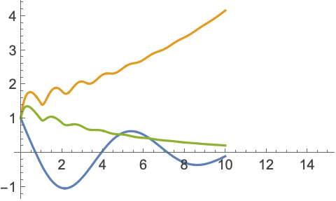
```

#### Integral Equations

The tautochrone problem requires finding the curve down which a bead placed anywhere will fall to the bottom in the same amount of time. Expressing the total fall time in terms of the arc length of the curve and the speed `*v*` yields the Abel integral equation $T=\int \mathrm{d}t=\int 1/v \mathrm{d}s$. Defining the unknown function $h$ by the relationship $\mathrm{d}s=h(y) \mathrm{d}y$ and using the conservation of energy equation $v^{2}/2=g (y_{max}-y)$ yields the explicit equation:

```wolfram
abeleqn=T ==∫_0^y(h[z])/(Sqrt[2g]Sqrt[y-z])ⅆz;
```

Use [DSolveValue](https://reference.wolfram.com/language/ref/DSolveValue.html) to solve the integral equation:

```wolfram
DSolveValue[abeleqn,h[y],y]
(* Output *)
(Sqrt[2] g T)/(π Sqrt[g y])
```

Using the relationship $\mathrm{d}s=\sqrt{\mathrm{d}x^{2}+\mathrm{d}y^{2}}$, solve for $x^{'}(y)$:

```wolfram
dxdy = Sqrt[%^2-1]
(* Output *)
Sqrt[-1+(2 g T^2)/(π^2 y)]
```

Starting the curve from the origin and integrating--with assumptions that ensure the integrand is real-valued--yields $x$ as a function of $y$:

```wolfram
x[y_]=Integrate[dxdy,{y,0,y},Assumptions->(2 g T^2 )/(π^2y)>1 &&y>0]
(* Output *)
(π Sqrt[y (2 g T^2-π^2 y)]+g T^2 (π-2 ArcTan[Sqrt[-1+(2 g T^2)/(π^2 y)]]))/(π^2)
```

Substituting values for $g$ and $T$, use [ParametricPlot](https://reference.wolfram.com/language/ref/ParametricPlot.html) to display the maximal tautochrone curve:

```wolfram
Show[ParametricPlot[{{x[y],y},{-x[y],y}} /. {g->9.8,T->2}, {y,0,(2(9.8)2^2)/(π^2)}],ImageSize->Medium]
```

*([Graphics])*

Making the change of variables $y=\frac{g T^{2} (1-cos(\theta))}{\pi^{2}}$ gives a simple, non-singular parametrization of the curve with $-\pi<\theta<\pi$:

```wolfram
c[θ_] = (g T^2)/(π^2){Sin[θ]+θ,1-Cos[θ]} ;
```

Combining the conservation of energy equation and the chain rule $\frac{\mathrm{d}s}{\mathrm{d}t}=\frac{\mathrm{d}s}{\mathrm{d}\theta}\frac{\mathrm{d}\theta}{\mathrm{d}t}$ produces the following differential equation for $\theta$ as a function of $t$:

```wolfram
FullSimplify[ (Sqrt[2g (Last[c[θMax]] - Last[c[θ]])] )/(Sqrt[c'[θ].c'[θ]]) ,g>0 && T>0]
(* Output *)
(π Sqrt[Cos[θ]-Cos[θMax]])/(T Sqrt[1+Cos[θ]])
```

```wolfram
teqn = θ'[t]==(% /. {θ->θ[t], T->2});
```

This equation can be solved numerically for different starting points:

```wolfram
Θ[t_]=Table[NDSolveValue[{teqn,θ[0]==θMax},θ[t],{t,0,4}],{θMax,{-2 Pi/3,-Pi/2,-Pi/4,-Pi/12}}];
```

Plotting the solutions show that all reach the bottom, $\theta=0$, at the 2 second mark:

```wolfram
Plot[Evaluate[Θ[t]],{t,0,4},PlotTheme->"Scientific"]
```

*([Graphics])*

Visualize the motion along the tautochrone:

```wolfram
{cShape[t_],cBeads[t_]}={c[t], c /@Θ[t]}/. {T->2,g->9.8};
Animate@@{ParametricPlot[cShape[s] ,{s,-Pi,Pi},ImageSize->Medium,Epilog->{AbsolutePointSize[8],Point[cBeads[t]]}],{t,0,4,Appearance->"Labeled"},SaveDefinitions->True,AnimationDirection->ForwardBackward}
```

A spring-mass system, with an attached mass of $g$, has a spring constant of $dynes/cm$ and a damping coefficient of $g/s$. At time $t=0$, the mass is pushed down and then released with a velocity 28 cm/s downward. A force of $dynes$ acts downward on the mass for $t \geq 0$. Find the velocity of the system as a function of time. The integral equation for the velocity is given by the following:

```wolfram
ieqn=3v^′[t]+2 v[t]+40 ∫_0^tv[m]ⅆm==50 Cos[2 t];
```

Initial value of the velocity:

```wolfram
ic=v[0]==28;
```

Solve the integro-differential equation using [DSolveValue](https://reference.wolfram.com/language/ref/DSolveValue.html):

```wolfram
sol=DSolveValue[{ieqn,ic},v[t],t]
(* Output *)
(1)/(14) (7 Cos[2 t]+385 ℯ^(-t/3) Cos[(Sqrt[119] t)/(3)]-49 Sin[2 t]+5 Sqrt[119] ℯ^(-t/3) Sin[(Sqrt[119] t)/(3)])
```

Plot the velocity as a function of time:

```wolfram
Plot[sol,{t,0,8},PlotRange->All, Filling->Axis]
(* Output *)
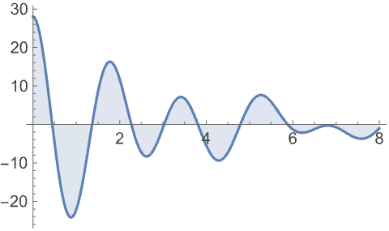
```

Visualize the motion of the physical spring-mass system:

An LRC circuit has a voltage source given by $v(t)=V$. The resistance in the circuit is $\Omega$, the inductance is $H$, and the capacitance is $F$. Initially, the current in the resistor is $A$. Find the current as a function of time:

$$
\text{[Graphics]}
$$

The integral equation for the current is given by:

```wolfram
ieqn=5 i^′[t]+0.2 i[t]+(1)/(0.7)∫_0^ti[m]ⅆm==2 Cos[t];
```

Initial value of the current:

```wolfram
ic=i[0]==1;
```

Solve the integro-differential equation using [DSolveValue](https://reference.wolfram.com/language/ref/DSolveValue.html):

```wolfram
sol=DSolveValue[{ieqn,ic},i[t],t]//FullSimplify//Chop
(* Output *)
0.03126196248564503 Cos[1. t]+ℯ^(-0.020000000000000004 t) (0.9687380375143549 Cos[0.534148187036412 t]-0.33487817368239675 Sin[0.534148187036412 t])+0.5582493301008038 Sin[1. t]
```

Plot the current as a function of time:

```wolfram
Plot[sol,{t,0,80},PlotRange->All, Filling->Axis]
(* Output *)
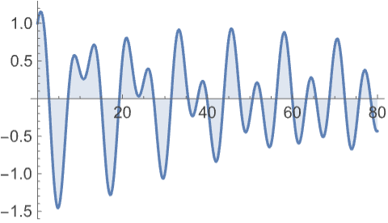
```

A linear Volterra integral equation is equivalent to an initial value problem for a linear differential equation. Verify this relationship for the following Volterra equation:

```wolfram
eqn=y[x]==x^3+λ∫_0^x(t- x)y[t]ⅆt;
```

Solve the integral equation using [DSolveValue](https://reference.wolfram.com/language/ref/DSolveValue.html):

```wolfram
sol=DSolveValue[eqn,y[x],x]
(* Output *)
(6 x)/(λ)-(6 Sin[x Sqrt[λ]])/(λ^(3/2))
```

Set up the corresponding differential equation:

```wolfram
deqn=D[eqn,{x,2}]
(* Output *)
y^′′[x]==6 x-λ y[x]
```

Add two initial conditions since the differential equation is of second order:

```wolfram
init={(eqn/.{x-> 0}),(D[eqn,x]/.{x-> 0})}
(* Output *)
{y[0]==0,y^′[0]==0}
```

The solution of the initial value problem agrees with that of the integral equation:

```wolfram
DSolveValue[{deqn,init},y[x],x]//Simplify
(* Output *)
(6 x)/(λ)-(6 Sin[x Sqrt[λ]])/(λ^(3/2))
```

Plot the solution:

```wolfram
Plot[Table[%,{λ,1,3,0.5}]//Evaluate,{x,0,20},Filling->Axis]
(* Output *)
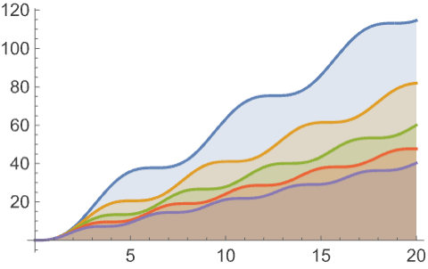
```

#### Classical Partial Differential Equations

Model the vibrations of a string with fixed length, say `π`, using the wave equation:

```wolfram
eqn = D[u[x, t], {t, 2}] == D[u[x, t], {x, 2}];
```

Specify that the ends of the string remain fixed during the vibrations:

```wolfram
bc={u[0,t]==0,u[π,t]==0};
```

Obtain the fundamental and higher harmonic modes of oscillation:

```wolfram
ic={u[x, 0] == Sin[m x], Derivative[0, 1][u][x, 0] == 0};
```

```wolfram
dsol=DSolveValue[{eqn,bc,ic},u[x,t],{x,t},Assumptions->Element[m,Integers]]
(* Output *)
Cos[m t] Sin[m x]
```

Visualize the vibrations of the string for these modes:

```wolfram
Table[Show[Plot[Table[dsol,{t,0,4}]//Evaluate,{x,0,Pi},Ticks->False]],{m,4}]
(* Output *)
{[Graphics],[Graphics],[Graphics],[Graphics]}
```

In general, the solution is composed of an infinite number of harmonics:

```wolfram
ic={u[x, 0] == x(π-x)^2, Derivative[0, 1][u][x, 0] == 0};
```

```wolfram
dsol=DSolveValue[{eqn,bc,ic},u[x,t],{x,t}]/.{K[1]-> m}
(* Output *)
(4 (2+(-1)^m) Cos[m t] Sin[m x])/(m^3)
```

Extract four terms from the [Inactive](https://reference.wolfram.com/language/ref/Inactive.html) sum:

```wolfram
sol[x_,t_]=TruncateSum[dsol,4]
(* Output *)
4 Cos[t] Sin[x]+(3)/(2) Cos[2 t] Sin[2 x]+(4)/(27) Cos[3 t] Sin[3 x]+(3)/(16) Cos[4 t] Sin[4 x]
```

Visualize the vibration of the string:

```wolfram
Animate[Plot[sol[x,t],{x,0,π},PerformanceGoal->"Quality",PlotRange->{-5,5},ImageSize->Medium],{t,0,12},SaveDefinitions->True]
```

Model the oscillations of a circular membrane of radius `1 using the wave equation in 2D:

```wolfram
eqn=r D[u[r,t],{t,2}]==D[r D[u[r,t],r],r];
```

Specify that the boundary of the membrane remains fixed:

```wolfram
bc=u[1,t]==0;
```

Initial condition for the problem:

```wolfram
ic={u[r,0]==0,Derivative[0,1][u][r,0]==1};
```

Obtain a solution in terms of Bessel functions:

```wolfram
(dsol=DSolveValue[{eqn,bc,ic},u[r,t],{r,t}])//
(* Output *)
(2 1 0 sin(t 0))/((0)^(2) (0^(2)+1^(2)))
```

Extract a finite number of terms from the [Inactive](https://reference.wolfram.com/language/ref/Inactive.html) sum:

```wolfram
h[r_,t_]=TruncateSum[dsol,3]//N;
```

Visualize the oscillations of the membrane:

```wolfram
Animate[Plot3D[h[r,t]/.{r->Sqrt[x^2+y^2]},{x,y}∈Disk[],PlotRange->{-1,1},Ticks->None,Mesh->True,MeshStyle->{Red, Blue},PlotStyle->Yellow],{t,0,4},SaveDefinitions->True]
```

Model the flow of heat in a bar of length `1 using the heat equation:

```wolfram
heqn=D[u[x,t],t]==D[u[x,t],{x,2}];
```

Specify the fixed temperature at both ends of the bar:

```wolfram
bc={u[0,t]==20,u[1,t]==50};
```

Specify an initial condition:

```wolfram
ic=u[x,0]==0;
```

Solve the heat equation subject to these conditions:

```wolfram
sol=DSolveValue[{heqn,bc,ic},u[x,t],{x,t}]
(* Output *)
20+30 x-(2 ((20-50 (-1)^K[1]) ℯ^(-π^2 t K[1]^2) Sin[π x K[1]])/(K[1]))/(π)
```

Extract a few terms from the [Inactive](https://reference.wolfram.com/language/ref/Inactive.html) sum:

```wolfram
approxsol=TruncateSum[sol,3]//Expand
(* Output *)
20+30 x-(140 ℯ^(-π^2 t) Sin[π x])/(π)+(30 ℯ^(-4 π^2 t) Sin[2 π x])/(π)-(140 ℯ^(-9 π^2 t) Sin[3 π x])/(3 π)
```

Visualize the evolution of the temperature to a steady state:

```wolfram
Plot[Table[approxsol,{t,0.02,0.5,0.07}]//Evaluate,{x,0,1},AxesOrigin->{0,0}]
```

*([Graphics])*

Obtain the steady-state solution `*v*[*x*]`, which is independent of time:

```wolfram
ssol=DSolveValue[{v''[x]==0,v[0]==20,v[1]==50},v[x],x]//Expand
(* Output *)
20+30 x
```

The steady-state solution is a linear function of `*x*`:

```wolfram
Plot[ssol,{x,0,1}]
```

*([Graphics])*

Model the flow of heat in a bar of length `1 that is insulated at both ends:

```wolfram
heqn=D[u[x,t],t]==D[u[x,t],{x,2}];
```

Specify that no heat flows through the ends of the bar:

```wolfram
bc={Derivative[1,0][u][0,t]==0,Derivative[1,0][u][1,t]==0};
```

Specify an initial condition:

```wolfram
ic=u[x,0]==20+80x;
```

Solve the heat equation subject to these conditions:

```wolfram
sol=DSolveValue[{heqn,bc,ic},u[x,t],{x,t}]
(* Output *)
60+2 (80 (-1+(-1)^K[1]) ℯ^(-π^2 t K[1]^2) Cos[π x K[1]])/(π^2 K[1]^2)
```

Extract a few terms from the [Inactive](https://reference.wolfram.com/language/ref/Inactive.html) sum:

```wolfram
approxsol=TruncateSum[sol,4]//Expand
(* Output *)
60-(320 ℯ^(-π^2 t) Cos[π x])/(π^2)-(320 ℯ^(-9 π^2 t) Cos[3 π x])/(9 π^2)
```

Visualize the evolution of the temperature to the steady state value of `60°`:

```wolfram
Plot[Table[approxsol,{t,0.02,0.9,0.07}]//Evaluate,{x,0,1},AxesOrigin->{0,0},PlotRange->All]
```

*([Graphics])*

Construct a complex analytic function, starting from the values of its real and imaginary parts on the $x$ axis. The real and imaginary parts, `*u*` and `*v*`, satisfy the Cauchy-Riemann equations:

```wolfram
creqns={D[u[x,y],x]==D[v[x,y],y],D[v[x,y],x]==-D[u[x,y],y]};
```

Prescribe the values of `*u*` and `*v*` on the $x$ axis:

```wolfram
xvals={u[x,0]==x^3,v[x,0]==0};
```

Solve the Cauchy-Riemann equations:

```wolfram
sol[x_,y_]=DSolveValue[{creqns,xvals},{u[x,y],v[x,y]},{x,y}]
(* Output *)
{x^3-3 x y^2,3 x^2 y-y^3}
```

Verify that the solutions are harmonic functions:

```wolfram
Laplacian[sol[x,y],{x,y}]
(* Output *)
{0,0}
```

Visualize the streamlines and equipotentials generated by the solution:

```wolfram
ContourPlot[sol[x,y],{x,-5,5},{y,-5,5},ContourStyle->{Red,Blue},PlotTheme->"Marketing"]
```

*([Graphics])*

Construct an analytic function from the solution:

```wolfram
f[x_,y_]=sol[x,y][[1]]+I sol[x,y][[2]]
(* Output *)
x^3-3 x y^2+ⅈ (3 x^2 y-y^3)
```

This represents the function $f(z)=z^{3}$:

```wolfram
(f[x,y]//Factor)/.{x+I y->z}
(* Output *)
z^3
```

#### General Partial Differential Equations

Study the evolution of a smooth solution for Burgers' equation to a shock wave in the limit when the viscosity parameter becomes infinitely small:

```wolfram
eqns ={ D[u[x, t],t] + u[x, t]D[u[x,t],x] == ε D[u[x,t],{x,2}] ,u[x,0]==Piecewise[{{1,x<0}}]};
```

```wolfram
dsol=DSolveValue[eqns, u[x,t],{x,t}]
(* Output *)
(1)/(1+(ℯ^(-(t-2 x)/(4 ε)) (1+Erf[(x)/(2 Sqrt[t ε])]))/(1+Erf[(t-x)/(2 Sqrt[t ε])]))
```

The solution is smooth for any positive value of `ε`:

```wolfram
Plot3D[dsol/.{ε-> 1/10},{x,-2,2},{t,0.001,5}]
```

*([Graphics3D])*

The solution develops a shock discontinuity in the limit when `ε` approaches `0:

```wolfram
Table[Plot3D[dsol/.{ε-> 1/1000},{x,-2,2},{t,0.001,5},Exclusions->All,Ticks->None],{ε,{1/10,1/100,1/1000}}]//Quiet
(* Output *)
{[Graphics3D],[Graphics3D],[Graphics3D]}
```

An electron constrained to move in a one-dimensional box of length `*d*` is governed by the free Schrödinger equation with Dirichlet conditions at the endpoints:

```wolfram
eqn=I ℏ D[ψ[x,t],t] == (-ℏ^2)/(2m) D[ψ[x,t],{x,2}];
bcs = {ψ[0,t]==0,ψ[d,t]==0};
```

The general solution to this equation is a sum of trigonometric-exponential terms:

```wolfram
DSolveValue[Join[{eqn},bcs],ψ[x,t],{x,t}]
(* Output *)
ℯ^(-(ⅈ π^2 t ℏ K[1]^2)/(2 d^2 m)) K[1] Sin[(π x K[1])/(d)]
```

Each term in the sum is called a stationary state as using the sine as initial conditions leads to the positional probability density $\rho=\overline{\psi}\psi$ being time independent. For example:

```wolfram
sol1=DSolveValue[Join[{eqn,ψ[x,0]==Sqrt[(2)/(d)]Sin[Pi(x)/(d)]},bcs],ψ[x,t],{x,t}]
(* Output *)
Sqrt[2] Sqrt[(1)/(d)] ℯ^(-(ⅈ π^2 t ℏ)/(2 d^2 m)) Sin[(π x)/(d)]
```

The resulting probability distribution is independent of time:

```wolfram
ρ1[x_,t_]=Simplify[ComplexExpand[Conjugate[sol1]sol1],d>0]
(* Output *)
(2 Sin[(π x)/(d)]^2)/(d)
```

The normalization of the initial data was chosen so that the integral of the density (the total probability of finding the particle somewhere) is `1:

```wolfram
Integrate[ρ1[x,t],{x,0,d}]
(* Output *)
1
```

Using any other initial condition, even one as simple as a sum of two stationary states, will lead to a complicated, time-dependent density:

```wolfram
sol2=DSolveValue[Join[{eqn,ψ[x,0]==(1)/(Sqrt[d])Sin[Pi(x)/(d)]+(1)/(Sqrt[d])Sin[2Pi(x)/(d)]},bcs],ψ[x,t],{x,t}]
(* Output *)
(ℯ^(-(2 ⅈ π^2 t ℏ)/(d^2 m)) (ℯ^((3 ⅈ π^2 t ℏ)/(2 d^2 m))+2 Cos[(π x)/(d)]) Sin[(π x)/(d)])/(Sqrt[d])
```

This density is not stationary as `*t*` appears in the second and third cosines:

```wolfram
ρ2[x_,t_]=Simplify[ComplexExpand[Conjugate[sol2]sol2],d>0]
(* Output *)
((3+2 Cos[(2 π x)/(d)]+2 Cos[(π (2 d m x-3 π t ℏ))/(2 d^2 m)]+2 Cos[(π (2 d m x+3 π t ℏ))/(2 d^2 m)]) Sin[(π x)/(d)]^2)/(d)
```

Although the probability density is time dependent, its integral is still the constant `1:

```wolfram
Integrate[ρ2[x,t],{x,0,d}]
(* Output *)
1
```

Entering the mass of the electron and the value of $\hbar$ in SI units and setting `*d*` to a typical interatomic distance of 1 nm results in the following density function:

```wolfram
ρe[x_,t_]=ρ2[x,t]/. {ℏ->1.055×10^-34,m->9.109*10^-31,d->10^-9}
(* Output *)
1000000000 (3+2 Cos[1.724444315286965×10^48 (-9.943140748611695×10^-34 t+1.8218000000000004×10^-39 x)]+2 Cos[1.724444315286965×10^48 (9.943140748611695×10^-34 t+1.8218000000000004×10^-39 x)]+2 Cos[2000000000 π x]) Sin[1000000000 π x]^2
```

Visualize the function over the spatial domain and one period in time:

```wolfram
Plot3D[ρe[x 10^-9,t 10^-15]10^-9,{x,0,1},{t,0,3.66},PlotTheme->{"Grid","LargeLabels"},AxesLabel->{"StyleBox[x, "SO"] (nm)","StyleBox[t, "SO"] (fs)", "StyleBox["ρe", "SO"] (nm^-1)"},ImageSize->Medium]
```

*([Graphics3D])*

Viewing the graph as a movie of probability densities, it can be seen that center of the electron moves from side to side of the box:

```wolfram
Animate[Plot[ρe[x,t],{x,0,10^-9},PerformanceGoal->-"Quality",PlotRange->{0,4×10^9},ImageSize->Medium,AxesLabel->{"StyleBox[x, "SO"] (m)", "StyleBox["ρe", "SO"] (m^-1)"}],{t,0,3.66×10^-15},SaveDefinitions->True]
```

Find the value of a European vanilla call option if the underlying asset price and the strike price are both $100, the risk-free rate is 5%, the volatility of the underlying asset is 20%, and the maturity period is 1 year, using the Black-Scholes model:

```wolfram
BlackScholesModel={D[c[t,s],t]+ 1/2σ^2 s^2 D[c[t,s],{s,2}]+r s D[c[t,s],s] -r c[t,s]==0,c[T,s]==Max[s-k,0]};
```

Solve the boundary value problem:

```wolfram
dsol=DSolveValue[BlackScholesModel,c[t,s],{t,s}]
(* Output *)
(1)/(2) ℯ^(-r T) (-ℯ^(r t) k Erfc[((t-T) (2 r-σ^2)+2 Log[k]-2 Log[s])/(2 Sqrt[2] Sqrt[-t+T] σ)]+ℯ^(r T) s Erfc[((t-T) (2 r+σ^2)+2 Log[k]-2 Log[s])/(2 Sqrt[2] Sqrt[-t+T] σ)])
```

Compute the value of the European vanilla option:

```wolfram
dsol/.{t-> 0,s->100,k-> 100, σ-> 0.2,T-> 1,r-> 0.05}
(* Output *)
10.450583572185579
```

Compare with the value given by [FinancialDerivative](https://reference.wolfram.com/language/ref/FinancialDerivative.html):

```wolfram
FinancialDerivative[{"European","Call"}, {"StrikePrice"-> 100.00, "Expiration"->1},  {"InterestRate"-> 0.05, "Volatility" -> 0.2 ,"CurrentPrice"-> 100}]
(* Output *)
10.450583572185565
```

Recover a function from its gradient vector:

```wolfram
sol=DSolveValue[{D[f[x,y], x]==x y Cos[x y]+Sin[x y],
                D[f[x,y],y]==-ℯ^-y+x^2 Cos[x y]},f[x,y],{x,y}]
(* Output *)
ℯ^-y+1+x Sin[x y]
```

The solution represents a family of parallel surfaces:

```wolfram
Plot3D[Table[sol/.{1->k},{k,1,22,5}]//Evaluate,{x,0,10},{y,0,2},PlotRange->All]
(* Output *)
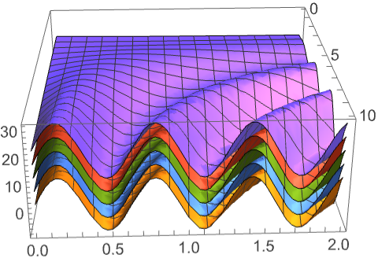
```

Solve a Cauchy problem to generate Stirling numbers:

```wolfram
sol=DSolveValue[{(1-x)D[u[x,y],x]==y u[x, y],u[0, y]==1},u[x,y], {x,y}]
(* Output *)
(-1)^y (-1+x)^-y
```

Use the generating function to obtain Stirling numbers:

```wolfram
Table[(-1)^i SeriesCoefficient[ Series[sol,{x,0,10},{y,0,4}],{10,i}]10!,{i,4}]
(* Output *)
{-362880,1026576,-1172700,723680}
```

```wolfram
StirlingS1[10,Range[4]]
(* Output *)
{-362880,1026576,-1172700,723680}
```

#### System Models

Generate the impulse response for a transfer-function model:

```wolfram
tfm=<|model -> Hold[TransferFunctionModel[15+s+s^2, s]], format -> StandardForm|>;
```

```wolfram
ir[τ_]=DSolveValue[tfm,"ImpulseResponse",τ]
(* Output *)
(2 ℯ^(-τ/2) HeavisideTheta[τ] Sin[(Sqrt[19] τ)/(2)])/(Sqrt[19])
```

Use [UnilateralConvolve](https://reference.wolfram.com/language/ref/UnilateralConvolve.html) to get the output response of the model from a sinusoidal input:

```wolfram
lconv[t_]=UnilateralConvolve[ir[τ],Sin[τ],τ,t]
(* Output *)
(-Sqrt[19] (Cos[t]-4 Sin[t])+ℯ^(-t/2) (Sqrt[19] Cos[(Sqrt[19] t)/(2)]-7 Sin[(Sqrt[19] t)/(2)]))/(17 Sqrt[19])
```

This demonstrates the Laplace convolution of the impulse response and sinusoidal functions:

```wolfram
Animate[
GraphicsRow[{
Plot[{ir[τ],Sin[t-τ]},{τ,0,2Pi},Filling -> Axis, PlotRange -> -11, PlotLabel -> ir[τ], Sin[t-τ]],
Plot[ir[τ] Sin[t-τ]UnitStep[t-τ],{τ,0,2Pi},Filling -> Axis, PlotRange -> -11, PlotLabel -> ir[τ]×Sin[t-τ]],
Plot[lconv[τ],{τ,0,t},Filling -> Axis, PlotRange -> 02Pi-11, PlotLabel -> lconv[τ]]},ImageSize->480],{t,0,2Pi}]
```

Calculate the output response from the sinusoidal input using [DSolveValue](https://reference.wolfram.com/language/ref/DSolveValue.html):

```wolfram
or=DSolveValue[{Sin[t]->tfm},"OutputResponse",t]
(* Output *)
(1)/(323) ℯ^(-t/2) (19 Cos[(Sqrt[19] t)/(2)]-19 ℯ^(t/2) Cos[t] Cos[(Sqrt[19] t)/(2)]^2+76 ℯ^(t/2) Cos[(Sqrt[19] t)/(2)]^2 Sin[t]-7 Sqrt[19] Sin[(Sqrt[19] t)/(2)]-19 ℯ^(t/2) Cos[t] Sin[(Sqrt[19] t)/(2)]^2+76 ℯ^(t/2) Sin[t] Sin[(Sqrt[19] t)/(2)]^2)
```

Compare both results:

```wolfram
or-lconv[t]//FullSimplify
(* Output *)
0
```

Determine the steady-state output value of a stable first-order system in response to a unit step input:

```wolfram
y=DSolveValue[<|model -> Hold[TransferFunctionModel[11+10s, s]], format -> StandardForm|>,"StepResponse",t];y_ss=Limit[y,t->∞]
(* Output *)
1
```

The time constant:

```wolfram
τ=t/.FindRoot[y==(1-(1)/(E)) y_ss,{t,1}]
(* Output *)
9.999999999999998
```

Visualize it:

```wolfram
With[{y1=y/.t->τ},Plot[y,{t,0,40},Epilog->{Dashed,Line[{{τ,0},{τ,y1},{0,y1}}],PointSize[Medium],Point[{{τ,y1}}]}]]
```

*([Graphics])*

Analyze the response of the states to each control input for a multi-input system:

```wolfram
ssm=<|model -> Hold[StateSpaceModel[00-100000103.70-200-0.60-500008.533008.5330.50.500-2.1132.1130.3750.3750000, SamplingPeriod -> None, SystemsModelLabels -> None]], format -> StandardForm|>;
```

```wolfram
MapIndexed[Plot[#,{t,0,5},PlotRange->All,PlotLabel->"Input "<>ToString@First@#2 <>" -> "<> " State "<>ToString@Last@#2]&, DSolveValue[UnitStep[t]->ssm,"StateResponse",t]//Simplify//Chop,{2}]
(* Output *)
{{[Graphics],[Graphics],[Graphics],[Graphics]},{[Graphics],[Graphics],[Graphics],[Graphics]}}
```

The state-space model of a production and inventory systems model with desired production rate and sales rate as inputs and actual production rate and inventory level as states:

```wolfram
ssm=<|model -> Hold[StateSpaceModel[-1-0.1875100.187500-1, SamplingPeriod -> None, SystemsModelLabels -> None]], format -> StandardForm|>;
```

Determine the response for a given production rate and 10% jump in sales from the initial equilibrium condition:

```wolfram
resp=DSolveValue[{{u_1,1.1 x_10}->ssm,{x_10,u_1}},"StateResponse",t]//Expand//Chop
(* Output *)
{1.0999999999999996 x_10+2.0499999999999994 ℯ^(-0.75 t) x_10-2.15 ℯ^(-0.25 t) x_10,0.9999999999999996 u_1-5.866666666666665 x_10-2.7333333333333325 ℯ^(-0.75 t) x_10+8.599999999999998 ℯ^(-0.25 t) x_10}
```

Plot the response for specific initial conditions:

```wolfram
Plot[Evaluate[resp]/.{x_10->1,u_1->6},{t,0,50},PlotStyle->{Thickness[0.005],Dashing[{0.05,0.01}]},PlotRange->All,AxesOrigin->{0,0},PlotLabel->"State response",AxesLabel->{t}]
```

*([Graphics])*

The Clohessy-Wiltshire equations model the relative motion between two satellites orbiting a central body:

$$
\text{[Graphics]}
$$

```wolfram
sat=<|model -> Hold[StateSpaceModel[0100003n^2002n000001000-2n00000000010000-n^20000100000010000001100000010000001000000000000, SamplingPeriod -> None, SystemsModelLabels -> None]], format -> StandardForm|>;
```

Use [DSolveValue](https://reference.wolfram.com/language/ref/DSolveValue.html) to obtain the closed relative orbits from a particular set of launch conditions:

```wolfram
n=0.001;x_0=1;xd_0=0.0005;
x=Map[DSolveValue[{{0,0,0}->sat,{x_0,xd_0,(2xd_0)/(n),-2n x_0,Sequence@@##}},"StateResponse",{t,0,5 (2Pi)/(n)}]&,{{-2 x_0,-2 xd_0},{2 x_0,2 xd_0}}];
```

```wolfram
ParametricPlot3D[{x[[1,1;;5;;2]],x[[2,1;;5;;2]]},{t,0,5 (2Pi)/(n)},BoxRatios->{1,1,1},AxesLabel->{"X","Y","Z"}]
(* Output *)
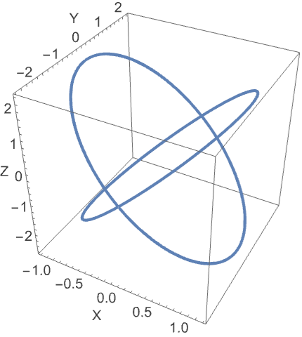
```

### Properties & Relations

[DSolveValue](https://reference.wolfram.com/language/ref/DSolveValue.html) returns an expression for the solution:

```wolfram
DSolveValue[{y'[x]==y[x],y[0]==1},y[x],x]
(* Output *)
ℯ^x
```

[DSolve](https://reference.wolfram.com/language/ref/DSolve.html) returns a rule for the solution:

```wolfram
DSolve[{y'[x]==y[x],y[0]==1},y[x],x]
(* Output *)
{{y[x]->ℯ^x}}
```

Solutions satisfy the differential equation and boundary conditions:

```wolfram
sol=DSolveValue[{y''[x]-y[x]==0,y[0]==1,y'[0]==4},y,x]
(* Output *)
Function[{x},(1)/(2) ℯ^-x (-3+5 ℯ^(2 x))]
```

```wolfram
Simplify[{y''[x]-y[x]==0,y[0]==1,y'[0]==4}/.y-> sol]
(* Output *)
{True,True,True}
```

Differential equation corresponding to [Integrate](https://reference.wolfram.com/language/ref/Integrate.html):

```wolfram
DSolveValue[y'[x]==Exp[x^2],y[x],x]
(* Output *)
1+(1)/(2) Sqrt[π] Erfi[x]
```

```wolfram
Integrate[Exp[x^2],x]
(* Output *)
(1)/(2) Sqrt[π] Erfi[x]
```

Use [NDSolveValue](https://reference.wolfram.com/language/ref/NDSolveValue.html) to find a numerical solution:

```wolfram
exactsol=DSolveValue[{y''[x]+y[x]==0,y[0]==1,y'[0]==0},y,x]
(* Output *)
Function[{x},Cos[x]]
```

```wolfram
Table[exactsol[x],{x,-2., 2}]
(* Output *)
{-0.4161468365471424,0.5403023058681398,1.,0.5403023058681398,-0.4161468365471424}
```

```wolfram
numsol=NDSolveValue[{y''[x] +y[x]==0,y[0]==1,y'[0]==0}, y,{x,-2,2}]
(* Output *)
InterpolatingFunction[...]
```

```wolfram
Table[numsol[x],{x,-2.,2}]
(* Output *)
{-0.4161467979018618,0.5403023217882615,1.,0.5403023217882615,-0.4161467979018618}
```

Use [AsymptoticDSolveValue](https://reference.wolfram.com/language/ref/AsymptoticDSolveValue.html) to find an asymptotic expansion:

```wolfram
dsol=DSolveValue[{y'[x]-2y[x]==0,y[0]==1},y[x],x]
(* Output *)
ℯ^(2 x)
```

```wolfram
Series[%,{x,0,4}]//Normal
(* Output *)
1+2 x+2 x^2+(4 x^3)/(3)+(2 x^4)/(3)
```

```wolfram
AsymptoticDSolveValue[{y'[x]-2y[x]==0,y[0]==1},y[x],{x,0,4}]
(* Output *)
1+2 x+2 x^2+(4 x^3)/(3)+(2 x^4)/(3)
```

Use [DEigensystem](https://reference.wolfram.com/language/ref/DEigensystem.html) to find eigenvalues and eigenfunctions:

```wolfram
{ℒ,ℬ}={-Laplacian[u[x],{x}],DirichletCondition[u[x]==0,True]};
```

Find the complete eigensystem:

```wolfram
DSolveValue[{u''[x]+λ u[x]==0,u[0]==0,u[π]==0},u[x],x]
(* Output *)
{, {{1 Sin[x Sqrt[λ]], n∈Integers&&n>=1&&λ==n^2}, {0, True}}}
```

Find eigenvalues and eigenfunctions:

```wolfram
DEigensystem[{ℒ,ℬ},u[x],{x,0,Pi},3]
(* Output *)
{{1,4,9},{Sin[x],Sin[2 x],Sin[3 x]}}
```

Compute an impulse response using [DSolveValue](https://reference.wolfram.com/language/ref/DSolveValue.html):

```wolfram
DSolveValue[y'''[x]-5y''[x]+9y'[x]-5y[x]==DiracDelta''[x]+2DiracDelta'[x]+DiracDelta[x]&&y[-1]==0&&y'[-1]==0&&y''[-1]==0,y[x],x]//FullSimplify
(* Output *)
-ℯ^x HeavisideTheta[x] (-2+ℯ^x (Cos[x]-7 Sin[x]))
```

The same computation using [InverseLaplaceTransform](https://reference.wolfram.com/language/ref/InverseLaplaceTransform.html):

```wolfram
InverseLaplaceTransform[(s^2+2s+1)/(s^3-5s^2+9s-5),s,x]//FullSimplify
(* Output *)
ℯ^x (2-ℯ^x (Cos[x]-7 Sin[x]))
```

Apply [N](https://reference.wolfram.com/language/ref/N.html)[DSolveValue[…]] to invoke [NDSolveValue](https://reference.wolfram.com/language/ref/NDSolveValue.html) if symbolic solution fails:

```wolfram
DSolveValue[{y''[x]+x^2 y'[x]+Tan[y[x]]==1,y[0]==1,y'[0]==1},y,{x,0,1}]
(* Output *)
DSolveValue[{Tan[y[x]]+x^2 y^′[x]+y^′′[x]==1,y[0]==1,y^′[0]==1},y,{x,0,1}]
```

```wolfram
sol=N[%]
(* Output *)
InterpolatingFunction[...]
```

```wolfram
Table[sol[x],{x,0,1,0.2}]
(* Output *)
{1.,1.1835085974232893,1.3062432598505782,1.322799229770659,1.230383081819063,1.0809571038302617}
```

[CompleteIntegral](https://reference.wolfram.com/language/ref/CompleteIntegral.html) finds a complete integral for a nonlinear PDE:

```wolfram
deqn = D[u[x,y],x]+D[u[x,y],y]^2==3;
```

```wolfram
CompleteIntegral[deqn,u[x,y],{x,y}]
(* Output *)
{{u[x,y]->1+y 2+x (3-2^2)}}
```

[DSolveValue](https://reference.wolfram.com/language/ref/DSolveValue.html) returns the same solution with a warning message:

```wolfram
DSolveValue[deqn,u[x,y],{x,y}]
(* Output *)
DSolveValue
(* Output *)
1+y 2+x (3-2^2)
```

Use [CompleteIntegral](https://reference.wolfram.com/language/ref/CompleteIntegral.html) to find a complete integral for a linear PDE:

```wolfram
deqn = D[u[x,y],x]+2D[u[x,y],y]==1;
```

```wolfram
CompleteIntegral[deqn,u[x,y],{x,y}]
(* Output *)
{{u[x,y]->1+x (1-2 2)+y 2}}
```

[DSolveValue](https://reference.wolfram.com/language/ref/DSolveValue.html) returns the general solution for this PDE:

```wolfram
DSolve[deqn,u[x,y],{x,y}]
(* Output *)
{{u[x,y]->x+1[-2 x+y]}}
```

Use [DFixedPoints](https://reference.wolfram.com/language/ref/DFixedPoints.html) to find the fixed points of a system of two ODEs:

```wolfram
DFixedPoints[{x'[t]==-x[t]-y[t]-1,y'[t]==2x[t]-y[t]+5},{x,y},t]
(* Output *)
{{-2,1}}
```

Use [DStabilityConditions](https://reference.wolfram.com/language/ref/DStabilityConditions.html) to analyze the stability of the fixed point:

```wolfram
DStabilityConditions[{x'[t]==-x[t]-y[t]-1,y'[t]==2x[t]-y[t]+5},{x,y},t]
(* Output *)
{{{-2,1},True}}
```

Solve the system using the fixed point as initial condition:

```wolfram
DSolveValue[{x'[t]==-x[t]-y[t]-1,y'[t]==2x[t]-y[t]+5,x[0]==-2,y[0]==1},{x[t],y[t]},t]//Simplify
(* Output *)
{-2,1}
```

Solve the system for given initial conditions:

```wolfram
sol=DSolveValue[{x'[t]==-x[t]-y[t]-1,y'[t]==2x[t]-y[t]+5,x[0]==3,y[0]==-2},{x[t],y[t]},t]//Simplify
(* Output *)
{-2+5 ℯ^-t Cos[Sqrt[2] t]+(3 ℯ^-t Sin[Sqrt[2] t])/(Sqrt[2]),ℯ^-t (ℯ^t-3 Cos[Sqrt[2] t]+5 Sqrt[2] Sin[Sqrt[2] t])}
```

Plot the solution:

```wolfram
Plot[Evaluate[sol],{t,0,20}]
```

*([Graphics])*

Use system modeling for numerical solutions to larger hierarchical models:

```wolfram
sim=SystemModelSimulate[[Graphics]]
(* Output *)
SystemModelSimulationData[...]
```

Plot the most interesting simulation result variables:

```wolfram
SystemModelPlot[sim]
(* Output *)
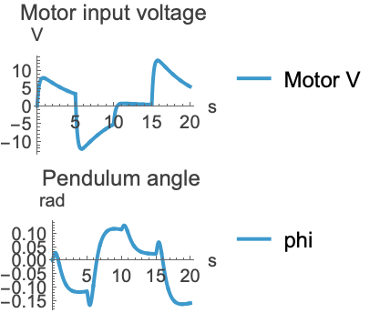
```

### Possible Issues

[DSolveValue](https://reference.wolfram.com/language/ref/DSolveValue.html) returns only a single branch if the solution has multiple branches:

```wolfram
DSolveValue[{y'[x]+y[x]==Sin[x], y'[0]^2==1},y[x],x]
(* Output *)
DSolveValue
(* Output *)
-(1)/(2) ℯ^-x (-3+ℯ^x Cos[x]-ℯ^x Sin[x])
```

Use [DSolve](https://reference.wolfram.com/language/ref/DSolve.html) to get all of the solution branches:

```wolfram
DSolve[{y'[x]+y[x]==Sin[x],y'[0]^2==1},y[x],x]
(* Output *)
{{y[x]->-(1)/(2) ℯ^-x (-3+ℯ^x Cos[x]-ℯ^x Sin[x])},{y[x]->-(1)/(2) ℯ^-x (1+ℯ^x Cos[x]-ℯ^x Sin[x])}}
```

Results may contain inactive integrals:

```wolfram
sol=DSolveValue[y'[x]==f[x],y[x],x]
(* Output *)
1+f[K[1]]
```

Replacing the function $f$ by an expression still returns inactive integrals:

```wolfram
sol/.f->Function[x,0]
(* Output *)
1+0
```

Use [Activate](https://reference.wolfram.com/language/ref/Activate.html) to evaluate integrals:

```wolfram
Activate[%]
(* Output *)
1
```

Capital $K$ and capital $C$ cannot be used as independent variables:

```wolfram
DSolveValue[x'[K]==K^K,x[K],K]
(* Output *)
DSolve
(* Output *)
DSolveValue[x^′[K]==K^K,x[K],K]
```

```wolfram
DSolveValue[x'[C]==C^C,x[C],C]
(* Output *)
DSolve
(* Output *)
DSolveValue[x^′[C]==C^C,x[C],C]
```

Replacing them by lowercase $k$ or lowercase $c$ fixes the issue:

```wolfram
DSolveValue[x'[k]==k^k,x[k],k]
(* Output *)
1+K[1]^K[1]
```

```wolfram
DSolveValue[x'[c]==c^c,x[c],c]
(* Output *)
1+K[1]^K[1]
```

Definitions for an unknown function may affect the evaluation:

```wolfram
y[x_]:=Cos[x]
```

```wolfram
DSolveValue[{y'[x]==0,y[0]==1},y,x]
(* Output *)
DSolveValue
(* Output *)
DSolveValue[{-Sin[x]==0,True},y,x]
```

Clearing the definition for the unknown function fixes the issue:

```wolfram
Clear[y]
```

```wolfram
DSolveValue[{y'[x]==0,y[0]==1},y[x],x]
(* Output *)
1
```

Solve a second-order linear ODE with symbolic parameters:

```wolfram
eqn=y''[x]+(k+g1/(a+x)) y'[x]+(m+g2/(a+x)) y[x]==0;
```

```wolfram
sol=DSolveValue[eqn,y[x],x]
(* Output *)
ℯ^(-(k x)/(2)-(1)/(2) Sqrt[k^2-4 m] x) 1 HypergeometricU[-(2 g2-g1 k-g1 Sqrt[k^2-4 m])/(2 Sqrt[k^2-4 m]),g1,a Sqrt[k^2-4 m]+Sqrt[k^2-4 m] x]+ℯ^(-(k x)/(2)-(1)/(2) Sqrt[k^2-4 m] x) 2 LaguerreL[(2 g2-g1 k-g1 Sqrt[k^2-4 m])/(2 Sqrt[k^2-4 m]),-1+g1,a Sqrt[k^2-4 m]+Sqrt[k^2-4 m] x]
```

The solution obtained is not the general solution of the ODE for specific values of parameters $g_{1}=g_{2}=0$:

```wolfram
sol/.{g1->0,g2->0}//Simplify
(* Output *)
ℯ^(-(1)/(2) (k+Sqrt[k^2-4 m]) x) (1+2)
```

The general solution for this case can be found by substituting parameter values in the equation first:

```wolfram
DSolveValue[eqn/.{g1->0,g2->0},y[x],x]
(* Output *)
ℯ^((1)/(2) (-k-Sqrt[k^2-4 m]) x) 1+ℯ^((1)/(2) (-k+Sqrt[k^2-4 m]) x) 2
```

### Neat Examples

Generate a Cornu spiral:

```wolfram
{x,y,t}=DSolveValue[{x'[s]==Cos[t[s]], y'[s]==Sin[t[s]],t'[s] ==s,x[0]==0,y[0]==0,t[0]==0}, {x,y,t},s]
(* Output *)
{Function[{s},Sqrt[π] FresnelC[(s)/(Sqrt[π])]],Function[{s},Sqrt[π] FresnelS[(s)/(Sqrt[π])]],Function[{s},(s^2)/(2)]}
```

```wolfram
ParametricPlot[{x[s], y[s]}, {s,-10,10}]
```

*([Graphics])*

Solve the sixth symmetric power of the Legendre differential operator:

```wolfram
sol = DSolveValue[(-((192n(1+n)x^5)/(1-x^2)^6)+(2496n(1+n)x^3)/(1-x^2)^5-(8160n^2(1+n)^2x^3)/(1-x^2)^5-(1632n(1+n)x)/(1-x^2)^4+(7824n^2(1+n)^2x)/(1-x^2)^4-(6912n^3(1+n)^3x)/(1-x^2)^4)y[x]+((64x^6)/(1-x^2)^6-(1824x^4)/(1-x^2)^5+(8256n(1+n)x^4)/(1-x^2)^5+(2880x^2)/(1-x^2)^4-(19200n(1+n)x^2)/(1-x^2)^4+(22896n^2(1+n)^2x^2)/(1-x^2)^4-272/(1-x^2)^3+(2208n(1+n))/(1-x^2)^3-(4384n^2(1+n)^2)/(1-x^2)^3+(2304n^3(1+n)^3)/(1-x^2)^3)
y'[x]+(-((2016x^5)/(1-x^2)^5)+(9408x^3)/(1-x^2)^4-(19488n(1+n)x^3)/(1-x^2)^4-(3696x)/(1-x^2)^3+(12768n(1+n)x)/(1-x^2)^3-(9408n^2(1+n)^2x)/(1-x^2)^3)y''[x]+((4816x^4)/(1-x^2)^4-(7168x^2)/(1-x^2)^3+(9632n(1+n)x^2)/(1-x^2)^3+616/(1-x^2)^2-(1456n(1+n))/(1-x^2)^2+(784n^2(1+n)^2)/(1-x^2)^2)y'''[x]+(-((2800x^3)/(1-x^2)^3)+(1400x)/(1-x^2)^2-(1400n(1+n)x)/(1-x^2)^2)
y''''[x]+((560x^2)/(1-x^2)^2-70/(1-x^2)+(56n(1+n))/(1-x^2))y'''''[x]-(42x y''''''[x])/(1-x^2)+y'''''''[x]==0,y[x],x]
(* Output *)
1 LegendreP[n,x]^6+2 LegendreP[n,x]^5 LegendreQ[n,x]+3 LegendreP[n,x]^4 LegendreQ[n,x]^2+4 LegendreP[n,x]^3 LegendreQ[n,x]^3+5 LegendreP[n,x]^2 LegendreQ[n,x]^4+6 LegendreP[n,x] LegendreQ[n,x]^5+7 LegendreQ[n,x]^6
```

## Tech Notes ▪Differential Equations ▪Differential Equation Solving with DSolve ▪Symbolic Solutions of PDEs ▪Introduction to Fractional Calculus ▪Numerical Differential Equation Solving with NDSolve ▪Implementation notes: Algebra and Calculus

## Related Guides ▪Fractional Calculus ▪Differential Equations ▪Differential Operators ▪Partial Differential Equations ▪Solvers over Regions ▪Symbolic Vectors, Matrices and Arrays

## History Introduced in 2014 (10.0) | Updated in 2015 (10.3) ▪ 2016 (11.0) ▪ 2017 (11.2) ▪ 2019 (12.0) ▪ 2021 (13.0) ▪ 2022 (13.2) ▪ 2024 (14.0) ▪ 2025 (14.2) ▪ 2026 (15.0)
