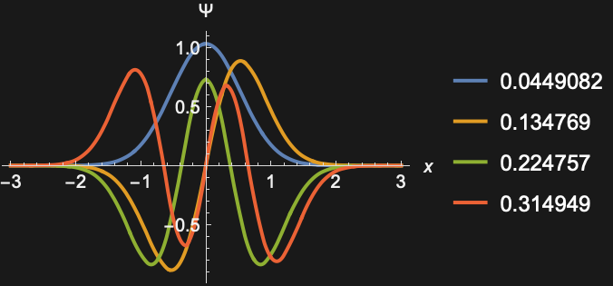

# Fourier | [SpanFromLeft]

> [Fourier](https://reference.wolfram.com/language/ref/Fourier.html)[*list*] — finds the discrete Fourier transform of a list of complex numbers.
> [Fourier](https://reference.wolfram.com/language/ref/Fourier.html)[*list*,{*p*_1,*p*_2,…}] — returns the specified positions of the discrete Fourier transform.

## Details and Options

The discrete Fourier transform `*v*_*s*` of a list `*u*_*r*` of length `*n*` is by default defined to be `(1)/(Sqrt(*n*))∑_{*r*=1}^{*n*}*u*_*r**e*^(2π *i*(*r*-1)(*s*-1)/*n*)`.

Note that the zero frequency term appears at position 1 in the resulting list.

Other definitions are used in some scientific and technical fields.

Different choices of definitions can be specified using the option [FourierParameters](https://reference.wolfram.com/language/ref/FourierParameters.html).

With the setting [FourierParameters](https://reference.wolfram.com/language/ref/FourierParameters.html)->{*a*,*b*}, the discrete Fourier transform computed by [Fourier](https://reference.wolfram.com/language/ref/Fourier.html) is `(1)/(*n*^((1-*a*)/2))∑_{*r*=1}^{*n*}*u*_*r**e*^(2π *i****b*(*r*-1)(*s*-1)/*n*)`.

Some common choices for `{*a*,*b*}` are `{0,1}` (default), `{-1,1}` (data analysis), `{1,-1}` (signal processing).

The setting $b=-1$ effectively corresponds to conjugating both input and output lists.

To ensure a unique inverse discrete Fourier transform, `|*b*|` must be relatively prime to `*n*`.

The list of data supplied to [Fourier](https://reference.wolfram.com/language/ref/Fourier.html) need not have a length equal to a power of two.

The `*list*` given in [Fourier](https://reference.wolfram.com/language/ref/Fourier.html)[*list*] can be nested to represent an array of data in any number of dimensions.

The array of data must be rectangular.

If the elements of `*list*` are exact numbers, [Fourier](https://reference.wolfram.com/language/ref/Fourier.html) begins by applying [N](https://reference.wolfram.com/language/ref/N.html) to them.

[Fourier](https://reference.wolfram.com/language/ref/Fourier.html)[*list*,{*p*_1,*p*_2,…}] is typically equivalent to [Extract](https://reference.wolfram.com/language/ref/Extract.html)[[Fourier](https://reference.wolfram.com/language/ref/Fourier.html)[*list**]*,{*p*_1,*p*_2,…}]. Cases with just a few positions `*p*` are computed using an algorithm that takes less time and memory but is more subject to numerical error, particularly when the length of `*list*` is long.

[Fourier](https://reference.wolfram.com/language/ref/Fourier.html) can be used on [SparseArray](https://reference.wolfram.com/language/ref/SparseArray.html) objects.

## Examples

### Basic Examples

Find a discrete Fourier transform:

```wolfram
Fourier[{1,1,2,2,1,1,0,0}]
(* Output *)
{2.82842712474619+0. ⅈ,-0.5+1.2071067811865475 ⅈ,0.+0. ⅈ,0.5-0.20710678118654746 ⅈ,0.+0. ⅈ,0.5+0.20710678118654746 ⅈ,0.+0. ⅈ,-0.5-1.2071067811865475 ⅈ}
```

Find a power spectrum:

```wolfram
Abs[Fourier[{1,1,2,2,1,1,0,0}]]^2
(* Output *)
{7.999999999999998,1.7071067811865477,0.,0.2928932188134525,0.,0.2928932188134525,0.,1.7071067811865477}
```

### Scope

`*x*` is a list of real values:

```wolfram
x={1,0,0,1,0,0,1};
```

Compute the Fourier transform with machine arithmetic:

```wolfram
Fourier[x]
(* Output *)
{1.1338934190276815+0. ⅈ,0.2730872440409331-0.13151188545021084 ⅈ,0.5295164598590715-0.6639926388028409 ⅈ,-0.046674757881550046+0.2044954757469482 ⅈ,-0.046674757881550046-0.2044954757469482 ⅈ,0.5295164598590715+0.6639926388028409 ⅈ,0.2730872440409331+0.13151188545021084 ⅈ}
```

Compute using 24-digit precision arithmetic:

```wolfram
Fourier[N[x,24]]
(* Output *)
{1.13389341902768168164354960870254018244,0.27308724404093304366422360673911635622-0.13151188545021087883095684649741495161 ⅈ,0.52951645985907151853754851080797877122-0.66399263880284088389801601250227495323 ⅈ,-0.04667475788155010777273904507873500723+0.20449547574694823727102714100031009617 ⅈ,-0.04667475788155010777273904507873500723-0.20449547574694823727102714100031009617 ⅈ,0.52951645985907151853754851080797877122+0.66399263880284088389801601250227495323 ⅈ,0.27308724404093304366422360673911635622+0.13151188545021087883095684649741495161 ⅈ}
```

Compute a 2D Fourier transform:

```wolfram
Fourier[RandomComplex[1+I,{3,6}]]
(* Output *)
{{2.285632926536434+2.742412912623174 ⅈ,-0.24132949363144232-0.0975597997364234 ⅈ,-0.36281180568633065-0.008146497504781032 ⅈ,-0.41791330618071554+0.032244630440243185 ⅈ,0.2492630460728168-0.46297879545812154 ⅈ,0.0663179897299878+0.3426417198192351 ⅈ},{-0.4453914773557703+0.24661428833366736 ⅈ,-0.15770105152440578-0.1979112834046287 ⅈ,-0.4414788944769776+0.08872314927609676 ⅈ,0.1680736637359007+0.29106320551931386 ⅈ,0.04128621361459807+0.19123679777675145 ⅈ,0.23205016283736968-0.14603356281322302 ⅈ},{0.04689535778031751+0.31117631044467053 ⅈ,0.5034725589188928+0.17199133679175896 ⅈ,0.30242747601212-0.8550274666591016 ⅈ,0.21645984076501198-0.10531425932802307 ⅈ,-0.1283765257167701+0.5064322077338724 ⅈ,0.3343609594590163-0.36275497218013936 ⅈ}}
```

`*x*` is a rank 3 tensor with nonzero diagonal:

```wolfram
x=ConstantArray[0,{2,3,4}];x[[1,1,1]]=1;x[[2,2,2]]=1;
```

Compute the 3D Fourier transform:

```wolfram
Fourier[x]
(* Output *)
{{{0.4082482904638631+0. ⅈ,0.20412414523193154+0.20412414523193154 ⅈ,0.+0. ⅈ,0.20412414523193154-0.20412414523193154 ⅈ},{0.10206207261596577+0.1767766952966369 ⅈ,0.02734744993529464-0.10206207261596577 ⅈ,0.3061862178478973-0.1767766952966369 ⅈ,0.38090084052856843+0.10206207261596577 ⅈ},{0.10206207261596577-0.1767766952966369 ⅈ,0.38090084052856843-0.10206207261596577 ⅈ,0.3061862178478973+0.1767766952966369 ⅈ,0.02734744993529464+0.10206207261596577 ⅈ}},{{0.+0. ⅈ,0.20412414523193154-0.20412414523193154 ⅈ,0.4082482904638631+0. ⅈ,0.20412414523193154+0.20412414523193154 ⅈ},{0.3061862178478973-0.1767766952966369 ⅈ,0.38090084052856843+0.10206207261596577 ⅈ,0.10206207261596577+0.1767766952966369 ⅈ,0.02734744993529464-0.10206207261596577 ⅈ},{0.3061862178478973+0.1767766952966369 ⅈ,0.02734744993529464+0.10206207261596577 ⅈ,0.10206207261596577-0.1767766952966369 ⅈ,0.38090084052856843-0.10206207261596577 ⅈ}}}
```

### Options

#### FourierParameters

No normalization:

```wolfram
a=Fourier[{1,0,1,0,0,1,0,0,0,1},FourierParameters->{1,1}]
(* Output *)
{4.+0. ⅈ,1.118033988749895+0.3632712640026803 ⅈ,1.5-0.3632712640026803 ⅈ,-1.118033988749895-1.5388417685876268 ⅈ,1.5-1.5388417685876268 ⅈ,0.+0. ⅈ,1.5+1.5388417685876268 ⅈ,-1.118033988749895+1.5388417685876268 ⅈ,1.5+0.3632712640026803 ⅈ,1.118033988749895-0.3632712640026803 ⅈ}
```

Normalization by $\frac{1}{\sqrt{n}}$:

```wolfram
Fourier[{1,0,1,0,0,1,0,0,0,1}]
(* Output *)
{1.2649110640673518+0. ⅈ,0.3535533905932738+0.11487646027368055 ⅈ,0.4743416490252569-0.11487646027368055 ⅈ,-0.3535533905932738-0.4866244947338651 ⅈ,0.4743416490252569-0.4866244947338651 ⅈ,0.+0. ⅈ,0.4743416490252569+0.4866244947338651 ⅈ,-0.3535533905932738+0.4866244947338651 ⅈ,0.4743416490252569+0.11487646027368055 ⅈ,0.3535533905932738-0.11487646027368055 ⅈ}
```

```wolfram
%Sqrt[10]
(* Output *)
{4.+0. ⅈ,1.118033988749895+0.36327126400268034 ⅈ,1.5-0.36327126400268034 ⅈ,-1.118033988749895-1.5388417685876268 ⅈ,1.5-1.5388417685876268 ⅈ,0.+0. ⅈ,1.5+1.5388417685876268 ⅈ,-1.118033988749895+1.5388417685876268 ⅈ,1.5+0.36327126400268034 ⅈ,1.118033988749895-0.36327126400268034 ⅈ}
```

Normalization by $\frac{1}{n}$:

```wolfram
Fourier[{1,0,1,0,0,1,0,0,0,1},FourierParameters->{-1,1}]
(* Output *)
{0.4+0. ⅈ,0.1118033988749895+0.03632712640026803 ⅈ,0.15000000000000002-0.03632712640026803 ⅈ,-0.1118033988749895-0.15388417685876268 ⅈ,0.15000000000000002-0.15388417685876268 ⅈ,0.+0. ⅈ,0.15000000000000002+0.15388417685876268 ⅈ,-0.1118033988749895+0.15388417685876268 ⅈ,0.15000000000000002+0.03632712640026803 ⅈ,0.1118033988749895-0.03632712640026803 ⅈ}
```

Data from a [Sinc](https://reference.wolfram.com/language/ref/Sinc.html) function with noise:

```wolfram
n=100;
x=Table[Sinc[x-10],{x,n}]+RandomReal[{-.05,.05},{n}];
```

```wolfram
ListPlot[x,PlotRange->All]
```

*([Graphics])*

Ordinary spectrum without normalization:

```wolfram
s=Fourier[x,FourierParameters->{1,1}];
```

Partial spectrum:

```wolfram
p=Fourier[Take[x,20],FourierParameters->{1,20/n}];
```

```wolfram
Show[ListPlot[Abs[s]^2],ListPlot[Abs[p]^2,PlotStyle->Red]]
```

*([Graphics])*

### Applications

#### Computing Spectra

Fourier spectrum of "white noise":

```wolfram
ListLinePlot[Abs[Fourier[RandomReal[1,200]]]^2]
```

*([Graphics])*

Show the logarithmic spectrum, including the first (DC) component:

```wolfram
ListLinePlot[Log[10,Abs[Fourier[RandomReal[1,200]]]^2],PlotRange->All]
```

*([Graphics])*

The spectrum of a pulse is completely flat:

```wolfram
ListLinePlot[Abs[Fourier[Table[KroneckerDelta[i],{i,0,200}]]]]
```

*([Graphics])*

Power spectrum of the Thue-Morse nested sequence [[more info]:](http://www.wolframscience.com/nksonline/page-586)

```wolfram
ListLinePlot[Abs[Fourier[Nest[Flatten[#/.{1->{1,0},0->{0,1}}]&,{1},7]]]]
```

*([Graphics])*

Power spectrum of the Fibonacci nested sequence [[more info]:](http://www.wolframscience.com/nksonline/page-586)

```wolfram
ListLinePlot[Abs[Fourier[Nest[Flatten[#/.{1->{0},0->{1,0}}]&,{0},10]]],PlotRange->All]
```

*([Graphics])*

2D power spectrum of a nested pattern:

```wolfram
data=Table[Mod[Binomial[i,j],2],{i,0,63},{j,0,63}];
```

Plot the nested pattern:

```wolfram
ArrayPlot[data]
```

*([Graphics])*

Find the logarithmic power spectrum:

```wolfram
ArrayPlot[Log[Abs[Fourier[data]]]]
```


Find the Fourier transform of the rule 30 cellular automaton pattern:

```wolfram
ArrayPlot[CellularAutomaton[30,{{1},0},50]]
```

*([Graphics])*

Logarithmic power spectrum:

```wolfram
ArrayPlot[Log[Abs[Fourier[CellularAutomaton[30,{{1},0},50]]]]]
```



#### Filtering Data

Compute discrete cyclic convolutions to smooth a discontinuous function with a Gaussian:

```wolfram
n=100;dx=1./(n-1);
a=Table[UnitStep[x-1/2],{x,0,1,dx}];
b=Table[If[x<=1/2,Exp[-100x^2],Exp[-100(1-x)^2]],{x,0,1,dx}];
b=b/Total[b];
```

```wolfram
{ListPlot[a,Filling->Axis,DataRange->{0,1}],ListPlot[b,Filling->Axis,PlotRange->All,DataRange->{0,1}]}
(* Output *)
{[Graphics],[Graphics]}
```

Compute the cyclic convolution:

```wolfram
c = Chop[InverseFourier[Fourier[a] Fourier[b]]Sqrt[n]];
```

Show the original and smoothed function:

```wolfram
ListPlot[{a,c},DataRange->{0,1}]
```

*([Graphics])*

The convolution is consistent with [ListConvolve](https://reference.wolfram.com/language/ref/ListConvolve.html):

```wolfram
Max[Abs[c - ListConvolve[a,b,{1,1}]]]
(* Output *)
3.3306690738754696×10^-16
```

#### Frequency Identification

Here is some periodic data with some noise:

```wolfram
n = 1000;
per = 12.34;
pdata = Table[Sin[2 π x/per], {x,n}] + RandomReal[.1,{n}];
ListPlot[pdata]
```

*([Graphics])*

Find the maximum modes in the spectrum:

```wolfram
f = Abs[Fourier[pdata]];
peaksize= Last[TakeLargest[f,2]];
peaks= Flatten[Position[f,x_ /; x>= peaksize]]
(* Output *)
{82,920}
```

Get the position corresponding to positive frequencies and show the position on a plot of the spectrum:

```wolfram
pos = First[peaks];
```

```wolfram
Show[ListPlot[f], Graphics[{Red, Point[{pos, f[[pos]]}]}], PlotRange->All]
```

*([Graphics])*

Find a high-resolution spectrum between modes where the maximum was found:

```wolfram
fr = Abs[Fourier[pdata Exp[2 Pi I (pos - 2) N[Range[0, n - 1]]/n], FourierParameters->{0,2/n}]];
frpos = Position[fr, Max[fr]][[1,1]]
(* Output *)
519
```

```wolfram
Show[ListPlot[fr], Graphics[{Red, Point[{frpos, fr[[frpos]]}]}], PlotRange->All]
```

*([Graphics])*

Determine the period from the frequencies:

```wolfram
N[n/(pos - 2 + 2 (frpos - 1)/n)]
(* Output *)
12.340194481465028
```

#### Computing Eigenvectors

`*m*` is a circulant differentiation matrix:

```wolfram
n = 1000;
m = N[SparseArray[{{i_, i_}->-2, {i_, j_}/;Abs[i-j]==1->1, {n,1}->1, {1,n}->1},{n,n}]]
(* Output *)
SparseArray[...]
```

Because $e^{\omega (k-1)}-2 e^{\omega k}+e^{\omega (k+1)}=e^{\omega k} ((e^{-\omega}+e^{\omega})-2)$, the eigenvalues of `*m*` are:

```wolfram
d = Chop[Table[Block[{ω = 2. Pi I j/n}, (ℯ^(-ω)+ℯ^ω)-2],{j,0,n-1}]];
```

The eigenvectors are the columns of the DFT matrix, so Fourier diagonalizes `*m*`:

```wolfram
Max[Abs[m -Map[Fourier, ConjugateTranspose[Map[Fourier,DiagonalMatrix[d]]]]]]
(* Output *)
1.333894165750401×10^-15
```

This allows very efficient computation of [MatrixExp](https://reference.wolfram.com/language/ref/MatrixExp.html)[*m*,*r*] for a particular vector:

```wolfram
r = N[n/2 - Abs[n/2 - Range[n]]];
```

```wolfram
Max[Abs[Fourier[Exp[ d] InverseFourier[r]] - MatrixExp[m,r]]]
(* Output *)
9.098083241547448×10^-13
```

Show the approximate evolution of the heat equation $\frac{\partial u}{\partial t}=\frac{\partial^{2}u}{\partial x^{2}}$ on the unit interval:

```wolfram
x = N[Range[n]/n];ListPlot[Table[Transpose[{x,Fourier[Exp[t d n^2] InverseFourier[r]]}],{t,0,0.05,0.01}], PlotRange->All]
```

*([Graphics])*

#### Fractional Fourier Transform

Define a fractional Fourier transform using different choices of [FourierParameters](https://reference.wolfram.com/language/ref/FourierParameters.html):

```wolfram
data=Table[N[Sin[x+y]],{x,100},{y,100}];
```

```wolfram
Partition[Table[ArrayPlot[Abs[Fourier[data, FourierParameters -> {1, b}]], ColorFunction -> "Rainbow", ColorFunctionScaling -> False, Mesh -> False],
   {b, {1,1.6,2.2,2.8}}], 2]
(* Output *)

```

### Properties & Relations

[InverseFourier](https://reference.wolfram.com/language/ref/InverseFourier.html) inverts [Fourier](https://reference.wolfram.com/language/ref/Fourier.html):

```wolfram
Fourier[{1,0,1,0,1,0}]
(* Output *)
{1.2247448713915892,0.,0.,1.2247448713915892,0.,0.}
```

```wolfram
InverseFourier[%]
(* Output *)
{1.0000000000000002,0.,1.0000000000000002,0.,1.0000000000000002,0.}
```

For real inputs, all elements after the first come in complex conjugate pairs:

```wolfram
Fourier[{1,2,3,4,5,6}]
(* Output *)
{8.573214099741124+0. ⅈ,-1.2247448713915892-2.121320343559643 ⅈ,-1.2247448713915892-0.7071067811865476 ⅈ,-1.2247448713915892+0. ⅈ,-1.2247448713915892+0.7071067811865476 ⅈ,-1.2247448713915892+2.121320343559643 ⅈ}
```

The power spectrum is symmetric:

```wolfram
Abs[Fourier[{1,2,3,4,5,6}]]^2
(* Output *)
{73.50000000000001,6.000000000000001,2.0000000000000004,1.5000000000000002,2.0000000000000004,6.000000000000001}
```

Cyclic convolution corresponds to multiplication of Fourier transforms:

```wolfram
a=RandomReal[1,{1000}];
b=RandomReal[1,{1000}];
```

```wolfram
c1=InverseFourier[Fourier[a]Fourier[b]]Sqrt[1000];
```

```wolfram
c2=ListConvolve[a,b,{1,1}];
```

```wolfram
c1-c2//Norm
(* Output *)
5.569929957561466×10^-12
```

```wolfram
Fourier[{1,1,1,1,1,1}]
(* Output *)
{2.4494897427831783,0.,0.,0.,0.,0.}
```

```wolfram
Abs[Fourier[{1,1,1,1,1,1}]]^2
(* Output *)
{6.000000000000001,0.,0.,0.,0.,0.}
```

$v_{s}$ is given by $\frac{1}{\sqrt{n}}\sum_{r=1}^{n}u_{r}e^{2 \pi i(r-1)(s-1)/n}$:

```wolfram
u=N[{1,2,3,4,5,6,7}];
n = Length[u];
```

```wolfram
v=Table[(1)/(Sqrt[n])∑_{r=1}^{n}u ℯ^((2 ⅈ π (r-1) (s-1))/(n)),{s,1,n}]
(* Output *)
{10.583005244258361,-1.3228756555322945-2.746979603717467 ⅈ,-1.3228756555322945-1.054958132087371 ⅈ,-1.3228756555322945-0.3019377358048386 ⅈ,-1.3228756555322945+0.3019377358048386 ⅈ,-1.3228756555322945+1.054958132087371 ⅈ,-1.3228756555322945+2.746979603717467 ⅈ}
```

```wolfram
Chop[v-Fourier[u]]
(* Output *)
{0,0,0,0,0,0,0}
```

[Fourier](https://reference.wolfram.com/language/ref/Fourier.html) is equivalent to multiplication with [FourierMatrix](https://reference.wolfram.com/language/ref/FourierMatrix.html):

```wolfram
FourierMatrix[6]//MatrixForm
(* Output *)
({{(1)/(Sqrt[6]), (1)/(Sqrt[6]), (1)/(Sqrt[6]), (1)/(Sqrt[6]), (1)/(Sqrt[6]), (1)/(Sqrt[6])}, {(1)/(Sqrt[6]), (ℯ^((ⅈ π)/(3)))/(Sqrt[6]), (ℯ^((2 ⅈ π)/(3)))/(Sqrt[6]), -(1)/(Sqrt[6]), (ℯ^(-(2 ⅈ π)/(3)))/(Sqrt[6]), (ℯ^(-(ⅈ π)/(3)))/(Sqrt[6])}, {(1)/(Sqrt[6]), (ℯ^((2 ⅈ π)/(3)))/(Sqrt[6]), (ℯ^(-(2 ⅈ π)/(3)))/(Sqrt[6]), (1)/(Sqrt[6]), (ℯ^((2 ⅈ π)/(3)))/(Sqrt[6]), (ℯ^(-(2 ⅈ π)/(3)))/(Sqrt[6])}, {(1)/(Sqrt[6]), -(1)/(Sqrt[6]), (1)/(Sqrt[6]), -(1)/(Sqrt[6]), (1)/(Sqrt[6]), -(1)/(Sqrt[6])}, {(1)/(Sqrt[6]), (ℯ^(-(2 ⅈ π)/(3)))/(Sqrt[6]), (ℯ^((2 ⅈ π)/(3)))/(Sqrt[6]), (1)/(Sqrt[6]), (ℯ^(-(2 ⅈ π)/(3)))/(Sqrt[6]), (ℯ^((2 ⅈ π)/(3)))/(Sqrt[6])}, {(1)/(Sqrt[6]), (ℯ^(-(ⅈ π)/(3)))/(Sqrt[6]), (ℯ^(-(2 ⅈ π)/(3)))/(Sqrt[6]), -(1)/(Sqrt[6]), (ℯ^((2 ⅈ π)/(3)))/(Sqrt[6]), (ℯ^((ⅈ π)/(3)))/(Sqrt[6])}})
```

```wolfram
v=FourierMatrix[6].N[{1,2,3,4,5,6}]
(* Output *)
{8.573214099741124+0. ⅈ,-1.2247448713915883-2.1213203435596433 ⅈ,-1.224744871391588-0.7071067811865472 ⅈ,-1.2247448713915894+0. ⅈ,-1.224744871391588+0.7071067811865472 ⅈ,-1.2247448713915883+2.1213203435596433 ⅈ}
```

```wolfram
Chop[v-Fourier[{1,2,3,4,5,6}]]
(* Output *)
{0,0,0,0,0,0}
```

The conjugate transpose of the matrix is equivalent to [InverseFourier](https://reference.wolfram.com/language/ref/InverseFourier.html):

```wolfram
Chop[ConjugateTranspose[FourierMatrix[6]].N[{1,2,3,4,5,6}]-InverseFourier[{1,2,3,4,5,6}]]
(* Output *)
{0,0,0,0,0,0}
```

### Possible Issues

If $b$ is not relatively prime to $n$, the transform may not be invertible:

```wolfram
m=Map[Fourier[#,FourierParameters->{0,2}]&,IdentityMatrix[8]];
MatrixRank[m]
(* Output *)
4
```

Lengths that are powers of 2 or factorizable into a product of small primes will be faster:

```wolfram
Timing[Fourier[RandomReal[1,2^20+1]];]
(* Output *)
{0.324875,Null}
```

```wolfram
FactorInteger[2^20+1]
(* Output *)
{{17,1},{61681,1}}
```

```wolfram
Timing[Fourier[RandomReal[1,2^20]];]
(* Output *)
{0.214545,Null}
```

```wolfram
Timing[Fourier[RandomReal[1,2^20-1]];]
(* Output *)
{0.219906,Null}
```

```wolfram
FactorInteger[2^20-1]
(* Output *)
{{3,1},{5,2},{11,1},{31,1},{41,1}}
```

[Fourier](https://reference.wolfram.com/language/ref/Fourier.html) uses an efficient algorithm when only a small number of coefficients is needed:

```wolfram
data=RandomReal[1,2^20-1];
```

```wolfram
AbsoluteTiming[Fourier[data,{{1},{3},{5}}];]
(* Output *)
{0.016254,Null}
```

```wolfram
MaxMemoryUsed[]
(* Output *)
54192808
```

```wolfram
AbsoluteTiming[Extract[Fourier[data],{{1},{3},{5}}];]
(* Output *)
{0.04692,Null}
```

```wolfram
MaxMemoryUsed[]
(* Output *)
120878072
```

The fast and efficient implementation may result in significant numerical error:

```wolfram
bdata=RandomReal[1,2^20,WorkingPrecision->50];data=N[bdata];pos={{1},{3},{2^20-5}};
AbsoluteTiming[res=Extract[Fourier[bdata],pos]]
(* Output *)
{17.175449,{511.82043652152086968645240347985606534897990591515998925250601720084433632256215,0.1100034759011011978820593432799089038150836805727050806426098942388130442358-0.36193431845314654559158510973037922206933998277469478080912963278785469709599 ⅈ,-0.12847660550386319917036754185563743419866111714035980438445693471882801628034-0.0007674664037072323286543776079165256187777033515128295366267390147970449112 ⅈ}}
```

```wolfram
AbsoluteTiming[Extract[Fourier[data],pos]-res]
(* Output *)
{0.038488,{-5.684341886080802×10^-14-3.804539558816456×10^-17 ⅈ,4.163336342344337×10^-17+0. ⅈ,-2.7755575615628914×10^-17+1.2847795743953228×10^-16 ⅈ}}
```

```wolfram
AbsoluteTiming[Fourier[data,pos]-res]
(* Output *)
{0.018792,{-0.00001041506794763336+0. ⅈ,-0.00015520518812787987+2.986857124409603×10^-7 ⅈ,0.00001995594093895381-8.568787787806807×10^-8 ⅈ}}
```

## Tech Notes ▪Manipulating Numerical Data ▪Discrete Fourier Transforms ▪Implementation notes: Numerical and Related Functions

## Related Guides ▪Summation Transforms ▪Fourier Analysis ▪Signal Processing ▪GPU Computing ▪Data Transforms and Smoothing ▪Signal Transforms ▪Signal Filtering & Filter Design ▪Signal Visualization & Analysis ▪Scientific Data Analysis ▪GPU Computing with NVIDIA ▪GPU Computing with Apple ▪Integral Transforms ▪Computer Vision ▪Audio Analysis ▪Image Filtering & Neighborhood Processing ▪Numerical Data ▪Audio Representation ▪GPU Programming

## Related Links [NKS|Online](http://www.wolframscience.com/nks/search/?q=Fourier) ([A New Kind of Science](http://www.wolframscience.com/nks/))

## History Introduced in 1988 (1.0) | Updated in 1996 (3.0) ▪ 1999 (4.0) ▪ 2000 (4.1) ▪ 2002 (4.2) ▪ 2003 (5.0) ▪ 2012 (9.0)
