# NDSolve | [SpanFromLeft]

> [NDSolve](https://reference.wolfram.com/language/ref/NDSolve.html)[*eqns*,*u*,{*x*,*x*_*min*,*x*_*max*}] — finds a numerical solution to the ordinary differential equations `*eqns*` for the function `*u*` with the independent variable `*x*` in the range `*x*_*min*` to `*x*_*max*`.
> [NDSolve](https://reference.wolfram.com/language/ref/NDSolve.html)[*eqns*,*u*,{*x*,*x*_*min*,*x*_*max*},{*y*,*y*_*min*,*y*_*max*}] — solves the partial differential equations `*eqns*` over a rectangular region.
> [NDSolve](https://reference.wolfram.com/language/ref/NDSolve.html)[*eqns*,*u*,{*x*,*y*}∈Ω] — solves the partial differential equations `*eqns*` over the region `Ω`.
> [NDSolve](https://reference.wolfram.com/language/ref/NDSolve.html)[*eqns*,*u*,{*t*,*t*_*min*,*t*_*max*},{*x*,*y*}∈Ω] — solves the time-dependent partial differential equations `*eqns*` over the region `Ω`.
> [NDSolve](https://reference.wolfram.com/language/ref/NDSolve.html)[*eqns*,{*u*_1,*u*_2,…},…] — solves for the functions `*u*_*i*`.

## Details and Options

[NDSolve](https://reference.wolfram.com/language/ref/NDSolve.html) is a numerical differential equation solver that gives results in terms of [InterpolatingFunction](https://reference.wolfram.com/language/ref/InterpolatingFunction.html) objects.

[NDSolve](https://reference.wolfram.com/language/ref/NDSolve.html)[*eqns*,*u*[*x*],{*x*,*x*_*min*,*x*_*max*}] gives solutions for `*u*[*x*]` rather than for the function `*u*` itself.

Differential equations must be stated in terms of derivatives such as `*u*'[*x*]`, obtained with [D](https://reference.wolfram.com/language/ref/D.html), not total derivatives obtained with [Dt](https://reference.wolfram.com/language/ref/Dt.html).

Partial differential equations may also be specified using the differential operators [Grad](https://reference.wolfram.com/language/ref/Grad.html) (`∇`), [Div](https://reference.wolfram.com/language/ref/Div.html) (`∇.`), [Laplacian](https://reference.wolfram.com/language/ref/Laplacian.html) (`∇^(2)`), and [Curl](https://reference.wolfram.com/language/ref/Curl.html) (`∇⨯`). Typically these operators are used as in [Inactive](https://reference.wolfram.com/language/ref/Inactive.html)[*op*] to keep the operator form from evaluating.

[NDSolve](https://reference.wolfram.com/language/ref/NDSolve.html) solves a wide range of ordinary differential equations as well as many partial differential equations.

[NDSolve](https://reference.wolfram.com/language/ref/NDSolve.html) can also solve many delay differential equations.

In ordinary differential equations, the functions `*u*_*i*` must depend only on the single variable `*t*`. In partial differential equations, they may depend on more than one variable.

[WhenEvent](https://reference.wolfram.com/language/ref/WhenEvent.html)[*event*,*action*] may be included in the equations `*eqns*` to specify an `*action*` that occurs when `*event*` becomes [True](https://reference.wolfram.com/language/ref/True.html).

The differential equations must contain enough initial or boundary conditions to determine the solutions for the `*u*_*i*` completely.

Initial and boundary conditions are typically stated in the form `*u*[*x*_0]==*c*_0, `*u*'[*x*_0]==*dc*_0, etc., but may consist of more complicated equations.

The `*c*_0, `*dc*_0, etc. can be lists, specifying that `*u*[*x*]` is a function with vector or general list values.

Periodic boundary conditions can be specified using `*u*[*x*_0]==*u*[*x*_1]`.

The point `*x*_0 that appears in the initial or boundary conditions need not lie in the range `*x*_*min*` to `*x*_*max*` over which the solution is sought.

Boundary values may also be specified using [DirichletCondition](https://reference.wolfram.com/language/ref/DirichletCondition.html) and [NeumannValue](https://reference.wolfram.com/language/ref/NeumannValue.html).

In delay differential equations, initial history functions are given in the form `*u*[*x*/;*x*<*x*_0]==*c*_0, where `*c*_0 is in general a function of `*x*`.

The differential equations in [NDSolve](https://reference.wolfram.com/language/ref/NDSolve.html) can involve complex numbers.

[NDSolve](https://reference.wolfram.com/language/ref/NDSolve.html) can solve many differential[Hyphen]algebraic equations, in which some of the `*eqns*` are purely algebraic, or some of the variables are implicitly algebraic.

The `*u*_*i*` can be functions of the dependent variables and need not include all such variables.

The following options can be given:

| [AccuracyGoal](https://reference.wolfram.com/language/ref/AccuracyGoal.html) | [Automatic](https://reference.wolfram.com/language/ref/Automatic.html) | digits of absolute accuracy sought |
| --- | --- | --- |
| [Compiled](https://reference.wolfram.com/language/ref/Compiled.html) | [Automatic](https://reference.wolfram.com/language/ref/Automatic.html) | whether expressions should be compiled automatically |
| [DependentVariables](https://reference.wolfram.com/language/ref/DependentVariables.html) | [Automatic](https://reference.wolfram.com/language/ref/Automatic.html) | the list of all dependent variables |
| [EvaluationMonitor](https://reference.wolfram.com/language/ref/EvaluationMonitor.html) | [None](https://reference.wolfram.com/language/ref/None.html) | expression to evaluate whenever the function is evaluated |
| [InitialSeeding](https://reference.wolfram.com/language/ref/InitialSeeding.html) | {} | seeding equations for some algorithms |
| [InterpolationOrder](https://reference.wolfram.com/language/ref/InterpolationOrder.html) | [Automatic](https://reference.wolfram.com/language/ref/Automatic.html) | the continuity degree of the final output |
| [MaxStepFraction](https://reference.wolfram.com/language/ref/MaxStepFraction.html) | 1/10 | maximum fraction of range to cover in each step |
| [MaxSteps](https://reference.wolfram.com/language/ref/MaxSteps.html) | [Automatic](https://reference.wolfram.com/language/ref/Automatic.html) | maximum number of steps to take |
| [MaxStepSize](https://reference.wolfram.com/language/ref/MaxStepSize.html) | [Automatic](https://reference.wolfram.com/language/ref/Automatic.html) | maximum size of each step |
| [Method](https://reference.wolfram.com/language/ref/Method.html) | [Automatic](https://reference.wolfram.com/language/ref/Automatic.html) | method to use |
| [NormFunction](https://reference.wolfram.com/language/ref/NormFunction.html) | [Automatic](https://reference.wolfram.com/language/ref/Automatic.html) | the norm to use for error estimation |
| [PrecisionGoal](https://reference.wolfram.com/language/ref/PrecisionGoal.html) | [Automatic](https://reference.wolfram.com/language/ref/Automatic.html) | digits of precision sought |
| [StartingStepSize](https://reference.wolfram.com/language/ref/StartingStepSize.html) | [Automatic](https://reference.wolfram.com/language/ref/Automatic.html) | initial step size used |
| [StepMonitor](https://reference.wolfram.com/language/ref/StepMonitor.html) | [None](https://reference.wolfram.com/language/ref/None.html) | expression to evaluate when a step is taken |
| [WorkingPrecision](https://reference.wolfram.com/language/ref/WorkingPrecision.html) | [MachinePrecision](https://reference.wolfram.com/language/ref/MachinePrecision.html) | precision to use in internal computations |

[NDSolve](https://reference.wolfram.com/language/ref/NDSolve.html) adapts its step size so that the estimated error in the solution is just within the tolerances specified by [PrecisionGoal](https://reference.wolfram.com/language/ref/PrecisionGoal.html) and [AccuracyGoal](https://reference.wolfram.com/language/ref/AccuracyGoal.html).

The option [NormFunction](https://reference.wolfram.com/language/ref/NormFunction.html)->*f* specifies that the estimated errors for each of the `*u*_*i*` should be combined using `*f*[{*e*_1,*e*_2,…}]`.

[AccuracyGoal](https://reference.wolfram.com/language/ref/AccuracyGoal.html) effectively specifies the absolute local error allowed at each step in finding a solution, while [PrecisionGoal](https://reference.wolfram.com/language/ref/PrecisionGoal.html) specifies the relative local error.

If solutions must be followed accurately when their values are close to zero, [AccuracyGoal](https://reference.wolfram.com/language/ref/AccuracyGoal.html) should be set larger, or to [Infinity](https://reference.wolfram.com/language/ref/Infinity.html).

The default setting of [Automatic](https://reference.wolfram.com/language/ref/Automatic.html) for [AccuracyGoal](https://reference.wolfram.com/language/ref/AccuracyGoal.html) and [PrecisionGoal](https://reference.wolfram.com/language/ref/PrecisionGoal.html) is equivalent to [WorkingPrecision](https://reference.wolfram.com/language/ref/WorkingPrecision.html)/2.

The default setting of [Automatic](https://reference.wolfram.com/language/ref/Automatic.html) for [MaxSteps](https://reference.wolfram.com/language/ref/MaxSteps.html) estimates the maximum number of steps to be taken by [NDSolve](https://reference.wolfram.com/language/ref/NDSolve.html), depending on start and stop time and an estimate of the step size. Should this not be possible, a fixed number of steps is taken.

The setting for [MaxStepFraction](https://reference.wolfram.com/language/ref/MaxStepFraction.html) specifies the maximum step to be taken by [NDSolve](https://reference.wolfram.com/language/ref/NDSolve.html) as a fraction of the range of values for each independent variable.

With [DependentVariables](https://reference.wolfram.com/language/ref/DependentVariables.html)->[Automatic](https://reference.wolfram.com/language/ref/Automatic.html), [NDSolve](https://reference.wolfram.com/language/ref/NDSolve.html) attempts to determine the dependent variables by analyzing the equations given.

[NDSolve](https://reference.wolfram.com/language/ref/NDSolve.html) typically solves differential equations by going through several different stages, depending on the type of equations. With [Method](https://reference.wolfram.com/language/ref/Method.html)->{*s*_1->*m*_1,*s*_2->*m*_2,…}, stage `*s*_*i*` is handled by method `*m*_*i*`. The actual stages used and their order are determined by [NDSolve](https://reference.wolfram.com/language/ref/NDSolve.html), based on the problem to solve.

Possible solution stages are:

"TimeIntegration" | time integration for systems of differential equations
"BoundaryValues" | ordinary differential equation boundary value solutions
"DiscontinuityProcessing" | symbolic processing for handling of discontinuous differential equations
"EquationSimplification" | simplification of equation form for numerical evaluation
"IndexReduction" | symbolic index reduction for differential algebraic equations
"DAEInitialization" | consistent initialization for differential algebraic equations
"PDEDiscretization" | discretization for partial differential equations

With [Method](https://reference.wolfram.com/language/ref/Method.html)->*m*_1 or [Method](https://reference.wolfram.com/language/ref/Method.html)->{*m*_1,*s*_2->*m*_2,…}, the method `*m*_1 is assumed to be for time integration, so [Method](https://reference.wolfram.com/language/ref/Method.html)->*m*_1 is equivalent to [Method](https://reference.wolfram.com/language/ref/Method.html)->{"TimeIntegration"->*m*_1}.

Possible explicit time integration settings for the [Method](https://reference.wolfram.com/language/ref/Method.html) option include:

"Adams" | predictor[Hyphen]corrector Adams method with orders 1 through 12
"BDF" | implicit backward differentiation formulas with orders 1 through 5
"ExplicitRungeKutta" | adaptive embedded pairs of 2(1) through 9(8) Runge-Kutta methods
"IDA" | implicit backward differentiation formulas for DAEs
"ImplicitRungeKutta" | families of arbitrary[Hyphen]order implicit Runge-Kutta methods
"SymplecticPartitionedRungeKutta" | interleaved Runge-Kutta methods for separable Hamiltonian systems

With [Method](https://reference.wolfram.com/language/ref/Method.html)->{"StyleBox[controller, "TI"]",[Method](https://reference.wolfram.com/language/ref/Method.html)->"StyleBox[submethod, "TI"]"} or [Method](https://reference.wolfram.com/language/ref/Method.html)->{"StyleBox[controller, "TI"]",[Method](https://reference.wolfram.com/language/ref/Method.html)->{*m*_1,*m*_2,…}}, possible controller methods include:

"Composition" | compose a list of submethods
"DoubleStep" | adapt step size by the double[Hyphen]step method
"EventLocator" | respond to specified events
"Extrapolation" | adapt order and step size using polynomial extrapolation
"FixedStep" | use a constant step size
"OrthogonalProjection" | project solutions to fulfill orthogonal constraints
"Projection" | project solutions to fulfill general constraints
"Splitting" | split equations and use different submethods
"StiffnessSwitching" | switch from explicit to implicit methods if stiffness is detected

Methods used mainly as submethods include:

"ExplicitEuler" | forward Euler method
"ExplicitMidpoint" | midpoint rule method
"ExplicitModifiedMidpoint" | midpoint rule method with Gragg smoothing
"LinearlyImplicitEuler" | linearly implicit Euler method
"LinearlyImplicitMidpoint" | linearly implicit midpoint rule method
"LinearlyImplicitModifiedMidpoint" | linearly implicit Bader[Hyphen]smoothed midpoint rule method
"LocallyExact" | numerical approximation to locally exact symbolic solution

The setting [InterpolationOrder](https://reference.wolfram.com/language/ref/InterpolationOrder.html)->[All](https://reference.wolfram.com/language/ref/All.html) specifies that [NDSolve](https://reference.wolfram.com/language/ref/NDSolve.html) should generate solutions that use interpolation of the same order as the underlying method used.

## Examples

### Basic Examples

Solve a first-order ordinary differential equation:

```wolfram
s=NDSolve[{y'[x]==y[x]Cos[x+y[x]],y[0]==1},y,{x,0,30}]
(* Output *)
{{y->InterpolatingFunction[...]}}
```

Use the solution in a plot:

```wolfram
Plot[Evaluate[y[x]/.s],{x,0,30},PlotRange->All]
```

*([Graphics])*

Use the function and its derivative in a plot:

```wolfram
ParametricPlot[Evaluate[{y[x],y'[x]}/.s],{x,0,20}]
```

*([Graphics])*

Find specific values:

```wolfram
{y[10.5],y'[12.5]}/.s
(* Output *)
{{0.04693020136366006,0.11379779235510501}}
```

Second-order nonlinear ordinary differential equation:

```wolfram
s=NDSolve[{y''[x]+ Sin[y[x]]y[x]==0,y[0]==1,y'[0]==0},y,{x,0,30}]
(* Output *)
{{y->InterpolatingFunction[...]}}
```

Plot the function and its first two derivatives:

```wolfram
Plot[Evaluate[{y[x],y'[x],y''[x]}/.s],{x,0,30},PlotStyle->Automatic]
```

*([Graphics])*

System of ordinary differential equations:

```wolfram
s=NDSolve[{x'[t]==-y[t]-x[t]^2,y'[t]==2x[t]-y[t]^3,x[0]==y[0]==1},{x,y},{t,20}]
(* Output *)
{{x->InterpolatingFunction[...],y->InterpolatingFunction[...]}}
```

```wolfram
ParametricPlot[Evaluate[{x[t],y[t]}/.s],{t,0,20}]
```

*([Graphics])*

Solve the heat equation in one dimension:

```wolfram
NDSolve[{D[u[t,x],t]==D[u[t,x],x,x],u[0,x]==0,u[t,0]==Sin[t],u[t,5]==0},u,{t,0,10},{x,0,5}]
(* Output *)
{{u->InterpolatingFunction[...]}}
```

```wolfram
Plot3D[Evaluate[u[t,x]/.%],{t,0,10},{x,0,5}, PlotRange->All]
```

*([Graphics3D])*

Alternative form of equation:

```wolfram
NDSolve[{∂_tu[t,x]==∂_x,xu[t,x],u[0,x]==0,u[t,0]==Sin[t],u[t,5]==0},u,{t,0,10},{x,0,5}]
(* Output *)
{{u->InterpolatingFunction[...]}}
```

Solve the Poisson equation over a [Disk](https://reference.wolfram.com/language/ref/Disk.html):

```wolfram
NDSolve[{-Laplacian[u[x,y],{x,y}]==1,DirichletCondition[u[x,y]==0,True]},u,{x,y}∈Disk[]]
(* Output *)
{{u->InterpolatingFunction[...]}}
```

```wolfram
Plot3D[Evaluate[u[x,y]/.%],{x,y}∈Disk[]]
```

*([Graphics3D])*

Find a minimal surface over a [Disk](https://reference.wolfram.com/language/ref/Disk.html) with a sinusoidal boundary condition.

```wolfram
NDSolve[{-((1)/(Sqrt[1+∇_{x,y}u[x,y].∇_{x,y}u[x,y]])) u[x,y]==0,DirichletCondition[u[x,y]==Sin[2π*(x+y)],True]},u,{x,y}∈Disk[]]
(* Output *)
{{u->InterpolatingFunction[...]}}
```

```wolfram
Plot3D[Evaluate[u[x,y]/.%],{x,y}∈Disk[]]
```

*([Graphics3D])*

Solve a coupled nonlinear sine-Gordon equation over a region.

```wolfram
Ω=Polygon[2{{-Pi,-E},{0,-1},{0,0},{Pi,0},{Pi,E},{-Pi,E}}];
NDSolve[{Laplacian[u[x,y],{x,y}]+λ Cos[v[x,y]]  Sin[u[x,y]]==0 ,Laplacian[v[x,y],{x,y}]+λ Sin[u[x,y] ] Sin[v[x,y]]==0,DirichletCondition[{u[x,y]==1/10,v[x,y]==1/20},True]}/.λ->5,{u,v},{x,y}∈Ω]
(* Output *)
{{u->InterpolatingFunction[...],v->InterpolatingFunction[...]}}
```

```wolfram
Plot3D[Evaluate[u[x,y]/.%],{x,y}∈Ω,ImageSize->Medium],Plot3D[Evaluate[v[x,y]/.%],{x,y}∈Ω,ImageSize->Medium]
```

*([Graphics3D])*

### Scope

#### Ordinary Differential Equations

Specify any order equation. Reduction to normal form is done automatically:

```wolfram
NDSolve[{x''[t]+1/10x'[t]+Sin[x[t]]==1/2 Cos[t],x[0]==x'[0]==0},x,{t,0,100}]
(* Output *)
{{x->InterpolatingFunction[...]}}
```

Directly differentiate the solution to make a phase plot:

```wolfram
ParametricPlot[Evaluate[{x[t],x'[t]}/.%],{t,0,100},ColorFunction->Hue]
```

*([Graphics])*

Directly specify a system of equations:

```wolfram
NDSolve[{x^′[t]==-3 (x[t]-y[t]),y^′[t]==-x[t] z[t]+26.5 x[t]-y[t],z^′[t]==x[t] y[t]-z[t],x[0]==z[0]==0,y[0]==1},{x,y,z},{t,0,5}]
(* Output *)
{{x->InterpolatingFunction[...],y->InterpolatingFunction[...],z->InterpolatingFunction[...]}}
```

```wolfram
Plot[Evaluate[{x[t],y[t],z[t]}/.First[%]],{t,0,5}]
```

*([Graphics])*

Solve for a vector-valued function:

```wolfram
s=NDSolve[{y^′′[x]+({{1, 1, 1, 1}, {1, 2, 1, 2}, {1, 1, 3, 1}, {1, 2, 1, 4}}).y[x]==0,y[0]==y^′[0]=={1,1,1,1}},y,{x,0,8}]
(* Output *)
{{y->InterpolatingFunction[...]}}
```

```wolfram
y[5]/.s
(* Output *)
{{0.36310359036080914,0.6584610925358916,1.215740221077966,1.4692304088955441}}
```

Plot the four components of the solution:

```wolfram
Plot[y[x] /. First[s],{x,0,8}]
```

*([Graphics])*

Different equivalent ways of specifying a harmonic oscillator as a second-order equation:

```wolfram
NDSolve[{x''[t]+x[t]==0,x[0]==1,x'[0]==0},x,{t,10}]
(* Output *)
{{x->InterpolatingFunction[...]}}
```

```wolfram
Plot[Evaluate[{x[t],x'[t]}/.First[%]],{t,0,10}]
```

*([Graphics])*

As a system of first-order equations:

```wolfram
NDSolve[{x'[t]==y[t],y'[t]==-x[t],x[0]==1,y[0]==0},{x,y},{t,0,10}]
(* Output *)
{{x->InterpolatingFunction[...],y->InterpolatingFunction[...]}}
```

```wolfram
Plot[Evaluate[{x[t], y[t]} /. First[%]], {t,0,10}]
```

*([Graphics])*

Using a vector variable with the dimension deduced from the initial condition:

```wolfram
NDSolve[{z'[t]=={{0,1},{-1,0}}.z[t],z[0]=={1,0}},z,{t,0,10}]
(* Output *)
{{z->InterpolatingFunction[...]}}
```

```wolfram
Plot[z[t]/.First[%], {t,0,10}]
```

*([Graphics])*

Use matrix-valued variables to compute the fundamental matrix solution:

```wolfram
A=RandomReal[{0,1},{5,5}];
```

```wolfram
fs=x/.First[NDSolve[{x'[t]==A.x[t],x[0]==IdentityMatrix[5]},x,{t,0,1}]]
(* Output *)
InterpolatingFunction[...]
```

Compare to the exact solution:

```wolfram
Plot[Norm[Flatten[fs[t]-MatrixExp[A t]]],{t,0,1}]
```

*([Graphics])*

Define a Van der Pol equation:

```wolfram
vdp={x'[t]==y[t],y'[t]==-x[t]+1000(1-x[t]^2)y[t],x[0]==2,y[0]==0};
```

The solution's stiff behavior that the default solver automatically handles:

```wolfram
sol=NDSolve[vdp,{x,y},{t,2000}]
(* Output *)
{{x->InterpolatingFunction[...],y->InterpolatingFunction[...]}}
```

```wolfram
Plot[Evaluate[x[t]/.sol],{t,0,2000},PlotRange->All]
```

*([Graphics])*

Other methods may not be able to solve this system:

```wolfram
NDSolve[{x^′[t]==y[t],y^′[t]==-x[t]+1000 (1-x[t]^2) y[t],x[0]==2,y[0]==0},{x,y},{t,2000},Method->"ExplicitRungeKutta"]
(* Output *)
NDSolve
(* Output *)
{{x->InterpolatingFunction[...],y->InterpolatingFunction[...]}}
```

Equations can have multiple distinct solutions:

```wolfram
NDSolve[{y^′[x]^2-y[x]^2==0,y[0]^2==4},y[x],{x,1}]
(* Output *)
{{y[x]->InterpolatingFunction[...][x]},{y[x]->InterpolatingFunction[...][x]},{y[x]->InterpolatingFunction[...][x]},{y[x]->InterpolatingFunction[...][x]}}
```

```wolfram
Plot[Evaluate[y[x]/.%],{x,0,1}]
```

*([Graphics])*

The solution `*y*[*x*]` is continuous, as it integrates the piecewise function once:

```wolfram
NDSolve[{y'[x]+Cos[y[x]]==Floor[x],y[0]==1},y,{x,0,3}]
(* Output *)
{{y->InterpolatingFunction[...]}}
```

```wolfram
Plot[Evaluate[y[x]/.%],{x,0,3}]
```

*([Graphics])*

The solution `*y*[*x*]` is differentiable, whereas `*y*'[*x*]` is continuous only:

```wolfram
NDSolve[{y''[x]+y[x]==Floor[x],y[0]==y'[0]==1},y,{x,0,5}]
(* Output *)
{{y->InterpolatingFunction[...]}}
```

```wolfram
Plot[Evaluate[{y[x],y'[x]}/.%],{x,0,5}]
```

*([Graphics])*

#### Partial Differential Equations

Nonlinear advection-diffusion equation in one dimension:

```wolfram
sol = NDSolve[{D[u[t,x], t] == 0.5 D[u[t,x],x,x]+u[t,x]D[u[t,x],x],  u[t,-Pi] == u[t, Pi] == 0 , u[0,x] == Sin[x]}, u, {t,0,2},{x,-Pi, Pi}]
(* Output *)
{{u->InterpolatingFunction[...]}}
```

```wolfram
Plot3D[Evaluate[u[t,x]/. First[sol]],{t,0,2},{x,-Pi, Pi}, PlotRange->All]
(* Output *)

```

Define a system of PDEs of mixed parabolic-hyperbolic type:

```wolfram
pde={∂_tu[t,x]==∂_x((v[t,x]-1) ∂_xu[t,x])+(16 x t-2 t-16 (v[t,x]-1)) (u[t,x]-1)+10 x ℯ^(-4 x),∂_tv[t,x]==∂_{x,2}v[t,x]+∂_xu[t,x]+4 u[t,x]-4+x^2-2 t-10 t ℯ^(-4 x)};
```

```wolfram
bc={u[0,x]==1,v[0,x]==1,u[t,0]==1,v[t,0]==1,3 u[t,1]+u^(0,1)[t,1]==3,5 v^(0,1)[t,1]==ℯ^4 (u[t,1]-1)};
```

```wolfram
NDSolve[{pde,bc},{u,v},{x,0,1},{t,0,2}]
(* Output *)
{{u->InterpolatingFunction[...],v->InterpolatingFunction[...]}}
```

```wolfram
Plot3D[Evaluate[{u[t,x],v[t,x]}/.%],{x,0,1},{t,0,2},PlotStyle->{Directive[Opacity[0.7],Red],Directive[Opacity[0.7],Blue]}]
(* Output *)

```

Nonlinear sine-Gordon equation in two spatial dimensions with periodic boundary conditions:

```wolfram
L = 4;
sol = NDSolve[{D[u[t,x,y], t, t] == D[u[t,x,y], x,x] + D[u[t, x, y], y, y] + Sin[u[t,x,y]], u[t,-L, y] == u[t, L, y], u[t, x, -L] == u[t, x, L], u[0,x, y] == Exp[-(x^2 + y^2)], Derivative[1,0,0][u][0,x,y] == 0}, u, {t,0,L/2}, {x,-L,L},{y,-L,L}]
(* Output *)
{{u->InterpolatingFunction[]}}
```

Plot the solution at the final time:

```wolfram
Plot3D[u[L/2, x, y] /. First[sol], {x,-L,L},{y,-L,L}]
```

*([Graphics3D])*

Plot the time evolution of a radial cross section of the solution:

```wolfram
Plot3D[u[t, x, 0] /. First[sol],{t,0, L/2}, {x,0,L}]
```

*([Graphics3D])*

Solve a wave equation over a region with a slit:

```wolfram
Ω=RegionDifference[RegionDifference[Rectangle[{0,0},{2,1}],Rectangle[{9/10,0},{11/10,4/10}]],Rectangle[{9/10,6/10},{11/10,1}]];
sol=u/.First[NDSolve[{D[u[t,x,y],{t,2}]-Laplacian[u[t,x,y],{x,y}]==0,DirichletCondition[u[t,x,y]==0,True],u[0,x,y]==2*Exp[-125((x-0.25)^2+(y-0.5)^2)],Derivative[1,0,0][u][0,x,y]==0},u,{t,0,2},{x,y}∈Ω]]
(* Output *)
InterpolatingFunction[]
```

```wolfram
ListAnimate[Table[Rasterize[Plot3D[sol[t,x,y],{x,y}∈Ω,PlotRange->{-0.75,2},AspectRatio->Automatic]],{t,0,2,1/25}],SaveDefinitions->True]
```


Solve a Poisson equation with periodic boundary conditions on curved boundaries:

```wolfram
Ω=RegionDifference[RegionUnion[Disk[],Rectangle[{0,-1},{2,1}]],Disk[{2,0}]];
```

```wolfram
ufun=First[u/.NDSolve[{-∇_{x,y}^2u[x,y]==1.,PeriodicBoundaryCondition[u[x,y],(x-2)^2+y^2==1,Function[x,x-{2,0}]],DirichletCondition[u[x,y]==0,(0<x<(2-10^-6)&&(y<=-1||y>=1))]},u,{x,y}∈Ω]]
(* Output *)
InterpolatingFunction[...]
```

Visualize the solution:

```wolfram
ContourPlot[ufun[x,y],{x,y}∈Ω,ColorFunction->"TemperatureMap",AspectRatio->Automatic]
(* Output *)
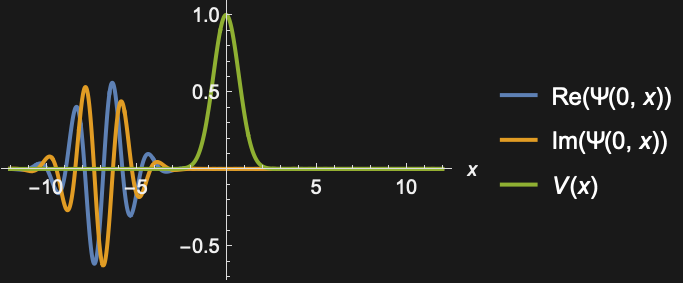
```

#### Boundary Value Problems

A nonlinear multipoint boundary value problem:

```wolfram
sol = NDSolve[{x''[t]==y[t] x[t],y'[t]==2-x[t],x[0]==x[4]==1,y[1]==1},{x,y}, t]
(* Output *)
{{x->InterpolatingFunction[...],y->InterpolatingFunction[...]}}
```

```wolfram
Plot[Evaluate[{x[t], y[t]} /. First[sol]],{t,0,4},Epilog->{Point[{0,1}],Point[{4,1}],Red,Point[{1,1}]}]
```

*([Graphics])*

Solve a nonlinear diffusion equation $\nabla \cdot(-u^{2} \nabla u)=4$ with Dirichlet and Neumann boundary conditions starting from an initial seed of $u=1$.

```wolfram
sol=NDSolve[{(-u[x]^2 u[x])==4+NeumannValue[2.,x==1],DirichletCondition[u[x]==1.,x==0]},u,{x}∈Line[{{0},{1}}],InitialSeeding->{u[x]==1}]
(* Output *)
{{u->InterpolatingFunction[...]}}
```

Visualize the result.

```wolfram
Plot[Evaluate[u[x] /. First[sol]],{x,0,1}]
```

*([Graphics])*

Solve a nonlinear equation $\nabla^{2}u+4 u \nabla u=2$ with Dirichlet boundary conditions starting from an initial seed of $u=1$.

```wolfram
sol=NDSolve[{∇_{x}^2u[x]+4u[x]D[u[x],x]==2,DirichletCondition[u[x]==1.,True]},u,{x}∈Line[{{0},{1}}],InitialSeeding->{u[x]==1}]
(* Output *)
{{u->InterpolatingFunction[...]}}
```

Visualize the result.

```wolfram
Plot[Evaluate[u[x] /. First[sol]],{x,0,1}]
```

*([Graphics])*

Solve a complex-valued nonlinear reaction equation $-\nabla^{2}u+i u^{2}=10$ with Dirichlet boundary conditions:

```wolfram
sol=NDSolve[{-∇_{x}^2u[x]+ⅈ u[x]^2==10,DirichletCondition[u[x]==-6 ⅈ,x==0],DirichletCondition[u[x]==-Sqrt[2] ⅈ,x==1]},u,{x}∈Line[{{0},{1}}]]
(* Output *)
{{u->InterpolatingFunction[...]}}
```

Visualize the result:

```wolfram
ReImPlot[Evaluate[u[x] /. First[sol]],{x,0,1}]
```

*([Graphics])*

Solve a boundary value problem with a nonlinear load term $\nabla^{2}u=sin(u)$:

```wolfram
sol=NDSolve[{∇_{x}^2u[x]==Sin[u[x]],DirichletCondition[u[x]==5.,x==0],DirichletCondition[u[x]==5.1,x==π/2]},u,{x}∈Line[{{0},{π/2}}]]
(* Output *)
{{u->InterpolatingFunction[...]}}
```

Visualize the result:

```wolfram
Plot[Evaluate[u[x] /. First[sol]],{x,0,π/2}]
```

*([Graphics])*

#### Delay Differential Equations

Solve a delay differential with two constant delays and initial history function $cos(t)$:

```wolfram
sol=NDSolve[{x'[t]==x[t](x[t-Pi]-x'[t-1]),x[t/;t<=0]==Cos[t]},x,{t,0,8}]
(* Output *)
{{x->InterpolatingFunction[...]}}
```

Discontinuities are propagated from $t=0$ at intervals equal to the delays:

```wolfram
Plot[Evaluate[{x[t],x'[t]} /. First[sol]],{t,0,8}, PlotRange->All]
```

*([Graphics])*

Investigate stability for a linear delay differential equation:

```wolfram
Manipulate[
Module[{sol,y,t},
sol = First[y /. NDSolve[{y'[t] == λ y[t] + μ y[t - 1], y[t /; t <= 0]==1 - t}, y,
{t,0,10}]];
If[pp, ParametricPlot[{sol[t],sol[t-1]},{t,1,10},PlotRange->{{-3,3},{-3,3}}],
Plot[sol[t],{t,0,10}, PlotRange->{{0,10},{-3,3}}]]],{{pp,False, "Plot in phase plane"},{True, False}},{{λ, -1},-5,5},{{μ,1},-5,5}, FrameLabel->ToString[y'[t] == λ y[t]+μ y[t-1], ]]
```

#### Hybrid and Discontinuous Equations

A differential equation with a discontinuous right-hand side using automatic event generation:

```wolfram
sol=NDSolve[{y'[t]==-Sign[y[t]],y[0]==1},y,{t,0,2}];
```

```wolfram
Plot[y[t]/.sol,{t,0,2},PlotRange->All]
```

*([Graphics])*

A differential equation whose right-hand side changes at regular time intervals:

```wolfram
sol=NDSolve[{y'[t]==a[t],y[0]==0,a[0]==1,WhenEvent[Mod[t,1]==0,a[t]->-a[t]]},y,{t,0,5},DiscreteVariables->a[t]];
```

```wolfram
Plot[y[t]/.sol,{t,0,5}]
```

*([Graphics])*

Reflect a solution across the $y$ axis each time it crosses the negative $x$ axis:

```wolfram
de={x'[t]==y[t],y'[t]==-x[t]+.2 y[t]+1};
ic={x[0]==.5,y[0]==.5};
```

```wolfram
sol=NDSolve[{de,ic,WhenEvent[And[y[t]==0,x[t]<0],x[t]->-x[t]]},{x,y},{t,0,1000}];
```

```wolfram
ParametricPlot[{x[t],y[t]}/.sol,{t,0,200},PlotPoints->200]
```

*([Graphics])*

Periodic solution with sliding mode:

```wolfram
Manipulate[Module[{x0, y0, sol},
{x0, y0} = p; sol =  First[NDSolve[{x'[t]==y[t],y'[t]==If[y[t] - 1>0, -1,.1 y[t] - x[t]],x[0]==x0,y[0]==y0},{x,y},{t,0,20}]];
ParametricPlot[{x[t], y[t]} /. sol,{t,0,20}, PlotRange->{{-1.5,1.5},{-1.5,1.5}}]],
{{p, {-1.5,1.5}},Locator}]
```

#### Differential-Algebraic Equations

Solve a differential equation with $2 x^{2}+y^{2}=1$ as an algebraic constraint:

```wolfram
s=NDSolve[{x'[t]==y[t]^2+x[t]y[t],2x[t]^2+y[t]^2==1,x[0]==0},{x,y},{t,0,10}]
(* Output *)
{{x->InterpolatingFunction[...],y->InterpolatingFunction[...]}}
```

```wolfram
ParametricPlot[Evaluate[{x[t],y[t]}/.s],{t,0,10},PlotRange->All,AspectRatio->1]
```

*([Graphics])*

Solve an ode system with a singular mass matrix:

```wolfram
eqn={x[t]-x'[t]+1,x'[t]*y[t]+2};
NDSolve[{eqn=={0,0},y[0]==-2},{x,y},{t,0,1}]
(* Output *)
NDSolve
(* Output *)
{{x->InterpolatingFunction[...],y->InterpolatingFunction[...]}}
```

The determinant of the Jacobian is zero; the derivative of $y(t)$ is not present:

```wolfram
Det[D[eqn,{{x'[t],y'[t]}}]]
(* Output *)
0
```

Rewrite the equation as a DAE with an algebraic constraint:

```wolfram
eqn={x[t]-x'[t]+1,(x[t]+1)*y[t]+2};
NDSolve[{eqn=={0,0},y[0]==-2},{x,y},{t,0,1}]
(* Output *)
{{x->InterpolatingFunction[...],y->InterpolatingFunction[...]}}
```

Solve a system of differential equation with singular mass-matrix as a DAE:

```wolfram
m={{1,0,0},{0,1,100},{1,1,100}};
s={{0,1,0},{1,1,0},{0,0,0}};
f={Sin[t],Cos[t],3};
```

Inspect the singularity of the mass matrix:

```wolfram
Length[SingularValueList[m]]
(* Output *)
2
```

```wolfram
r=NDSolve[{m.X'[t]==s.X[t]+f,X[0]=={0.8,0.6,1}},{X},{t,0,50},Method->{"EquationSimplification"->"Residual"}]
(* Output *)
{{X->InterpolatingFunction[]}}
```

```wolfram
ParametricPlot3D[Evaluate[X[t]/.r],{t,0,50},BoxRatios->1]
```

*([Graphics3D])*

Solve a DAE by converting it to an index-0 system and solve it as an ODE with invariants:

```wolfram
s=NDSolve[{x'[t]+y[t]==Cos[t],y'[t]+z[t]==Sin[t],x[t]==Cos[t]},{x,y,z},{t,0,5},Method->{"IndexReduction"->{Automatic,"IndexGoal"->0}}];
```

```wolfram
Plot[Evaluate[{x[t],y[t],z[t]}/.s],{t,0,5},ImageSize->150,PlotLegends->{x,y,z}]
```

*([Graphics])*

### Generalizations & Extensions

The names of functions need not be symbols:

```wolfram
eqns={Table[y[i]^′[x]==y[i-1][x]-y[i][x],{i,2,4}],{y[1]^′[x]==-y[1][x],y[5]^′[x]==y[4][x],y[1][0]==1},Table[y[i][0]==0,{i,2,5}]}
(* Output *)
{{y[2]^′[x]==y[1][x]-y[2][x],y[3]^′[x]==y[2][x]-y[3][x],y[4]^′[x]==y[3][x]-y[4][x]},{y[1]^′[x]==-y[1][x],y[5]^′[x]==y[4][x],y[1][0]==1},{y[2][0]==0,y[3][0]==0,y[4][0]==0,y[5][0]==0}}
```

```wolfram
NDSolve[eqns,Table[y[i],{i,5}],{x,10}]
(* Output *)
{{y[1]->InterpolatingFunction[...],y[2]->InterpolatingFunction[...],y[3]->InterpolatingFunction[...],y[4]->InterpolatingFunction[...],y[5]->InterpolatingFunction[...]}}
```

```wolfram
Plot[Evaluate[Table[y[i][x],{i,5}]/.%],{x,0,10}]
```

*([Graphics])*

### Options

#### AccuracyGoal and PrecisionGoal

Use defaults to solve a celestial mechanics equation with sensitive dependence on initial conditions:

```wolfram
eqn=z''[t]==-z[t]/(z[t]^2+((1+ Sin[2 π t]/2)/2)^2)^(3/2);
```

```wolfram
Plot[Evaluate[z[t]/.NDSolve[{eqn,z[0]==1,z'[0]==0},z,{t,0,40}]],{t,0,40}]
```

*([Graphics])*

Higher accuracy and precision goals give a different result:

```wolfram
Plot[Evaluate[z[t]/.NDSolve[{eqn,z[0]==1,z'[0]==0},z,{t,0,40},AccuracyGoal->10,PrecisionGoal->10]],{t,0,40}]
```

*([Graphics])*

Increasing the goals extends the correct solution further:

```wolfram
Plot[Evaluate[z[t]/.NDSolve[{eqn,z[0]==1,z'[0]==0},z,{t,0,40},AccuracyGoal->20,PrecisionGoal->20,WorkingPrecision->35]],{t,0,40}]
(* Output *)
NDSolve
```

*([Graphics])*

#### DependentVariables

Set up a very large system of equations:

```wolfram
n = 1000;
vars = Table[x_i[t], {i, n}];
eqns = Table[j = Mod[i, n] + 1;{x_i'[t] == 1/(x_i[t] + x_j[t])^2, x_i[0] == 1/i}, {i, n}];
```

```wolfram
Short[eqns, 3]
(* Output *)
{{x_1^′[t]==(1)/((x_1[t]+x_2[t])^2),x_1[0]==1},{x_2^′[t]==(1)/((x_2[t]+x_3[t])^2),x_2[0]==(1)/(2)},<<996>>,{x_999^′[t]==(1)/((x_999[t]+x_1000[t])^2),x_999[0]==(1)/(999)},{x_1000^′[t]==(1)/((x_1[t]+x_1000[t])^2),x_1000[0]==(1)/(1000)}}
```

Solve for all the dependent variables, but save only the solution for `x_1:

```wolfram
sol = NDSolve[eqns, x_1, {t,0,100}, DependentVariables->vars]
(* Output *)
{{x_1->InterpolatingFunction[...]}}
```

```wolfram
Plot[x_1[t] /. sol, {t,0,100}, PlotRange->All]
```

*([Graphics])*

#### EvaluationMonitor

Total number of evaluations:

```wolfram
Module[{c=0},NDSolve[{y'[x]==y[x]Cos[x+y[x]],y[0]==1},y,{x,0,30},EvaluationMonitor:>c++];c]
(* Output *)
722
```

The distance between successive evaluations; negative distance means a rejected step:

```wolfram
ListLinePlot[Differences[Reap[NDSolve[{y'[x]==y[x]Cos[x+y[x]],y[0]==1},y,{x,0,30},EvaluationMonitor:>Sow[x]]][[2,1]]]]
```

*([Graphics])*

#### InitialSeedings

Specify an initial seeding of 0 for a boundary value problem:

```wolfram
NDSolveValue[{-2 u[x] u^′[x]-u^′′[x]==1,DirichletCondition[u[x]==0,x==0],DirichletCondition[u[x]==0,x==1]},u,{x}∈Line[{{0},{1}}],InitialSeeding->{u[x]==0}]
(* Output *)
InterpolatingFunction[...]
```

Specify an initial seeding that depends on a spatial coordinate:

```wolfram
NDSolveValue[{-2 u[x] u^′[x]-u^′′[x]==0,DirichletCondition[u[x]==0,x==0],DirichletCondition[u[x]==1,x==1]},u,{x}∈Line[{{0},{1}}],InitialSeeding->{u[x]==x}]
(* Output *)
InterpolatingFunction[...]
```

#### InterpolationOrder

Use [InterpolationOrder](https://reference.wolfram.com/language/ref/InterpolationOrder.html)->[All](https://reference.wolfram.com/language/ref/All.html) to get interpolation the same order as the method:

```wolfram
Timing[a = NDSolve[{x'[t] == y[t], y'[t]== -x[t],x[0]==1, y[0]==0},{x,y},{t,0,1000},InterpolationOrder->All]]
(* Output *)
{0.020772,{{x->InterpolatingFunction[],y->InterpolatingFunction[]}}}
```

This is more time-consuming than the default interpolation order used:

```wolfram
Timing[d = NDSolve[{x'[t] == y[t], y'[t]== -x[t],x[0]==1, y[0]==0},{x,y},{t,0,1000}]]
(* Output *)
{0.007532,{{x->InterpolatingFunction[...],y->InterpolatingFunction[...]}}}
```

It is much better in between steps:

```wolfram
Plot[Evaluate[{First[x[t] /. a],First[x[t]/. d]} - Cos[t]],{t,0,10}, PlotRange->All, PlotStyle->{Directive[Thick, Blue],Red}]
```

*([Graphics])*

#### MaxStepFraction

Features with small relative size in the integration interval can be missed:

```wolfram
Table[Plot[Evaluate[y[x]/.NDSolve[{y''[x]+y[x] ==Exp[-(1000 (x/L - 1/3))^2], y[0]==y'[0]==0},y,{x,L}]], {x,L/4,L/2},PlotRange->All],{L, {1, 10, 100, 1000}}]
(* Output *)
{[Graphics],[Graphics],[Graphics],[Graphics]}
```

Use [MaxStepFraction](https://reference.wolfram.com/language/ref/MaxStepFraction.html) to ensure features are not missed, independent of interval size:

```wolfram
Table[Plot[Evaluate[y[x]/.NDSolve[{y''[x]+y[x]==Exp[-(1000 (x/L - 1/3))^2], y[0]==y'[0]==0},y,{x,L},MaxStepFraction->0.001]], {x,L/4,L/2},PlotRange->All],{L, {1, 10, 100, 1000}}]
(* Output *)
{[Graphics],[Graphics],[Graphics],[Graphics]}
```

#### MaxSteps

Integration stops short of the requested interval:

```wolfram
NDSolve[{y''[x] + x y[x]  == 0, y[0] == 1, y'[0] == 0}, y, {x,0,200},MaxSteps->10^4]
(* Output *)
NDSolve
(* Output *)
{{y->InterpolatingFunction[...]}}
```

More steps are needed to resolve the solution:

```wolfram
sol = NDSolve[{y''[x] + x y[x]  == 0, y[0] == 1, y'[0] == 0}, y, {x,0,200}, MaxSteps->10^6]
(* Output *)
{{y->InterpolatingFunction[...]}}
```

Plot the solution in the phase plane:

```wolfram
ParametricPlot[Evaluate[{y[x], y'[x]} /. First[sol]], {x, 0,200}, ColorFunction->Function[Hue[#3]], AspectRatio->1]
```

*([Graphics])*

For an infinite integration of an oscillator, a maximum number of steps is reached:

```wolfram
NDSolve[{x''[t]+x[t]==0,x[0]==1,x'[0]==0},x,{t,Infinity}]
(* Output *)
NDSolve
(* Output *)
{{x->InterpolatingFunction[...]}}
```

More steps can be requested:

```wolfram
NDSolve[{x''[t]+x[t]==0,x[0]==1,x'[0]==0},x,{t,Infinity},MaxSteps->20000]
(* Output *)
NDSolve
(* Output *)
{{x->InterpolatingFunction[...]}}
```

#### MaxStepSize

The default step control may miss a suddenly varying feature:

```wolfram
Plot[Evaluate[(y[x] /. NDSolve[{y''[x] + (1 +  Sech[1000 (x - Pi)]) y[x] == 0, y[0] == 1, y'[0] == 0}, y,{x,0,10}]) - Cos[x]], {x,0,10}]
```

*([Graphics])*

A smaller [MaxStepSize](https://reference.wolfram.com/language/ref/MaxStepSize.html) setting ensures that [NDSolve](https://reference.wolfram.com/language/ref/NDSolve.html) catches the feature:

```wolfram
Plot[Evaluate[(y[x] /. NDSolve[{y''[x] + (1 +  Sech[1000 (x - Pi)]) y[x] == 0, y[0] == 1, y'[0] == 0}, y,{x,0,10}, MaxStepSize->0.01]) - Cos[x]], {x,0,10}]
```

*([Graphics])*

Attempting to compute the number of positive integers less than $e^{5}$ misses several events:

```wolfram
Block[{n = 0},NDSolve[{y'[t] == y[t], y[-1] == ℯ^-1,WhenEvent[Sin[π y[t]]==0, n++]}, y, {t,5}];n]
(* Output *)
18
```

Setting a small enough [MaxStepSize](https://reference.wolfram.com/language/ref/MaxStepSize.html) ensures that none of the events are missed:

```wolfram
Block[{n = 0},NDSolve[{y'[t] == y[t], y[-1] == ℯ^-1,WhenEvent[Sin[π y[t]]==0, n++]}, y, {t,5},MaxStepSize->0.001];n]
(* Output *)
148
```

#### Method

TimeIntegration  (5)

Specify an explicit Runge-Kutta method to be used for the time integration of a differential equation:

```wolfram
NDSolve[{y'[x]==y[x]Cos[x+y[x]],y[0]==1},y,{x,0,30},Method->{"TimeIntegration"->"ExplicitRungeKutta"}]
(* Output *)
{{y->InterpolatingFunction[...]}}
```

Specify an explicit Runge-Kutta method of order 8 to be used for the time integration:

```wolfram
NDSolve[{y'[x]==y[x]Cos[x+y[x]],y[0]==1},y,{x,0,30},Method->{"TimeIntegration"->{"ExplicitRungeKutta","DifferenceOrder"->8}}]
(* Output *)
{{y->InterpolatingFunction[...]}}
```

Specify an explicit Euler method to be used for the time integration of a differential equation:

```wolfram
NDSolve[{y''[t]==-y[t],y[0]==1,y'[0]==0},y,{t,0,1},Method->{"TimeIntegration"->"ExplicitEuler"}]
(* Output *)
{{y->InterpolatingFunction[...]}}
```

Show differences between values of `*x*` at successive steps with the default solution method:

```wolfram
ListLinePlot[Differences[Reap[NDSolve[{y'[x]==y[x]Cos[x+y[x]],y[0]==1},y,{x,0,30},StepMonitor:>Sow[x]]][[2,1]]],DataRange->{0,30}]
```

*([Graphics])*

An explicit Runge-Kutta method changes the step size less often:

```wolfram
ListLinePlot[Differences[Reap[NDSolve[{y'[x]==y[x]Cos[x+y[x]],y[0]==1},y,{x,0,30},StepMonitor:>Sow[x],Method->{"TimeIntegration"->"ExplicitRungeKutta"}]][[2,1]]],DataRange->{0,30}]
```

*([Graphics])*

Extrapolation tends to take very large steps:

```wolfram
ListLinePlot[Differences[Reap[NDSolve[{y'[x]==y[x]Cos[x+y[x]],y[0]==1},y,{x,0,30},StepMonitor:>Sow[x],Method->{"TimeIntegration"->"Extrapolation"}]][[2,1]]]]
```

*([Graphics])*

PDEDiscretization  (3)

Solutions of Burgers' equation may steepen, leading to numerical instability:

```wolfram
s1=NDSolve[{∂_tu[t,x]==(1)/(1000)∂_x,xu[t,x]- u[t,x]∂_xu[t,x],u[0,x]==Sin[2 π x],u[t,0]==u[t,1]},u,{t,0,2},{x,0,1}]
(* Output *)
NDSolve
(* Output *)
NDSolve
(* Output *)
{{u->InterpolatingFunction[...]}}
```

```wolfram
end = Part[u  /. s1, 1, 1, 1,-1];
Plot[u[end,x] /. s1, {x,0,1}]
```

*([Graphics])*

Specify a spatial discretization sufficiently fine to resolve the front:

```wolfram
s2=NDSolve[{∂_tu[t,x]==(1)/(1000)∂_x,xu[t,x]- u[t,x]∂_xu[t,x],u[0,x]==Sin[2 π x],u[t,0]==u[t,1]},u,{t,0,2},{x,0,1}, Method->{"PDEDiscretization"->{"MethodOfLines", "SpatialDiscretization"->{"TensorProductGrid", "MinPoints"->1000}}}]
(* Output *)
{{u->InterpolatingFunction[]}}
```

```wolfram
end = Part[u  /. s2, 1, 1, 1,-1];
Plot[u[end,x] /. s2, {x,0,1}]
```

*([Graphics])*

After the front forms, the solution decays relatively rapidly:

```wolfram
X = Part[u /. s2, 1, 3, 2];
Plot[Max[u[t, X] /. s2], {t,0,2}]
```

*([Graphics])*

Specify use of the finite element method for spatial discretization:

```wolfram
s2=NDSolve[{∂_tu[t,x]==(1)/(1000)∂_x,xu[t,x],u[0,x]==Sin[2 π x],DirichletCondition[u[t,x]==0,True]},u,{t,0,2},{x,0,1}, Method->{"PDEDiscretization"->{"MethodOfLines", "SpatialDiscretization"->{"FiniteElement"}}}]
(* Output *)
{{u->InterpolatingFunction[...]}}
```

Solve a time-dependent Schrödinger equation on a refined mesh:

```wolfram
solution=NDSolve[{({{-(1)/(2)}}.u[t,x])==ⅈ u^(1,0)[t,x],u[0,x]==ℯ^((-3ⅈ  x-(1)/(20) x^2)),DirichletCondition[u[t,x]==0,True]},u,{t,0,5},{x,-10,10},Method->{"PDEDiscretization"->{"MethodOfLines","SpatialDiscretization"->{"FiniteElement","MeshOptions"->{"MaxCellMeasure"->0.1}}}}]
(* Output *)
{{u->InterpolatingFunction[...]}}
```

Plot the higher-accuracy solution:

```wolfram
Plot3D[Evaluate[Abs[u[t,x]]/.solution],{x,-10,10},{t,0,5},PlotPoints->50,AxesLabel->{x,t}]
(* Output *)
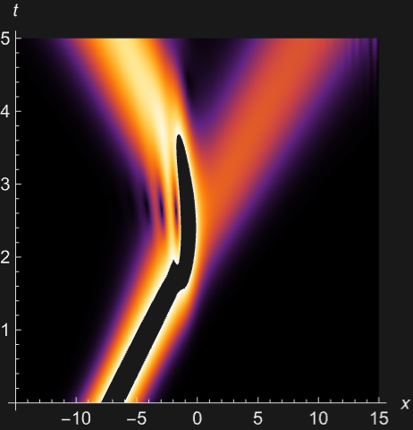
```

BoundaryValues  (1)

Solve a boundary value problem:

```wolfram
sol0 = First[NDSolve[{x''[t] + Sin[x[t]] == 0, x[0] == x[10] == 0},x,t]]
(* Output *)
{x->InterpolatingFunction[...]}
```

With the default option, the method finds the trivial solution:

```wolfram
Table[x[t] /. sol0, {t,0,10}]
(* Output *)
{-2.822862288972411×10^-11,0.7832451461712399,0.9161379503897882,0.3026307165997689,-0.5726632750697015,-0.9614507523040045,-0.5726634013369001,0.30263050283750964,0.9161378791613026,0.78324517542527,1.246256130807254×10^-7}
```

Specify different starting conditions for the `"Shooting"` method to find different solutions:

```wolfram
sols = Map[First[NDSolve[{x''[t] + Sin[x[t]] == 0, x[0] == x[10] == 0},x,t, Method->"BoundaryValues"->{"Shooting", "StartingInitialConditions"->{x[0] == 0, x'[0] == #}}]]&,
{1.5, 1.75, 2}];
Plot[Evaluate[x[t] /. sols], {t,0,10}, PlotStyle->{Brown, Blue, Green}]
```

*([Graphics])*

DiscontinuityProcessing  (1)

[NDSolve](https://reference.wolfram.com/language/ref/NDSolve.html) automatically does processing for discontinuous functions like [Sign](https://reference.wolfram.com/language/ref/Sign.html):

```wolfram
sol1=NDSolve[{x'[t]==Sign[1-x[t]],x[0]==0},x,{t,0,2}]
(* Output *)
{{x->InterpolatingFunction[...]}}
```

If the processing is turned off, [NDSolve](https://reference.wolfram.com/language/ref/NDSolve.html) may fail at the discontinuity point:

```wolfram
NDSolve[{x'[t]==Sign[1-x[t]],x[0]==0},x,{t,0,2}, Method->{"DiscontinuityProcessing"->False}]
(* Output *)
NDSolve
(* Output *)
{{x->InterpolatingFunction[]}}
```

With some time integration methods, the solution may be very inaccurate:

```wolfram
sol2 = NDSolve[{x'[t]==Sign[1-x[t]],x[0]==0},x,{t,0,2}, Method->{"DiscontinuityProcessing"->False, "TimeIntegration"->"Extrapolation"}]
(* Output *)
{{x->InterpolatingFunction[...]}}
```

```wolfram
Plot[{x[t]/.sol1 ,x[t]/.sol2}, {t, 0,2}]
```

*([Graphics])*

An equivalent way to find the solution is to use `"DiscontinuitySignature"`:

```wolfram
sol3=NDSolve[{x^′[t]==v[t],WhenEvent[1==x[t],v[t]->"DiscontinuitySignature"],x[0]==0,v[0]==1},{x,v},{t,0,2}, DiscreteVariables->{Element[v,{-1,0,1}]}]
(* Output *)
{{x->InterpolatingFunction[...],v->InterpolatingFunction[...]}}
```

The solutions are effectively identical:

```wolfram
Table[(x[t]/.sol1) -(x[t]/.sol3), {t, 0,2,.25}]
(* Output *)
{{0.},{0.},{0.},{0.},{0.},{0.},{0.},{0.},{0.}}
```

The discontinuity signature is 0 when the solution is in sliding mode:

```wolfram
Plot[v[t] /. sol3,{t,0,2}]
```

*([Graphics])*

EquationSimplification  (2)

The solution cannot be completed because the square root function is not sufficiently smooth:

```wolfram
NDSolve[{x^′[t]^2+x[t]^2==1,x[0]==1/2},x,{t,0,10 Pi}]
(* Output *)
NDSolve
(* Output *)
NDSolve
(* Output *)
{{x->InterpolatingFunction[]},{x->InterpolatingFunction[]}}
```

One solution can be found by forming a residual and solving as a DAE system:

```wolfram
s1 = NDSolve[{x^′[t]^2+x[t]^2==1,x[0]==1/2},x,{t,0,10 Pi}, Method->{"EquationSimplification"->"Residual"}]
(* Output *)
{{x->InterpolatingFunction[...]}}
```

The other solution branch can be given by specifying a consistent value of $x^{'}$:

```wolfram
s2 = NDSolve[{x^′[t]^2+x[t]^2==1,x[0]==1/2, x'[0]==-Sqrt[3/4]},x,{t,0,10 Pi}, Method->{"EquationSimplification"->"Residual"}]
(* Output *)
{{x->InterpolatingFunction[...]}}
```

```wolfram
Plot[Evaluate[x[t] /. {s1,s2}], {t, 0, 10 Pi}]
```

*([Graphics])*

With the suboption `"SimplifySystem"->[True](https://reference.wolfram.com/language/ref/True.html)`, [NDSolve](https://reference.wolfram.com/language/ref/NDSolve.html) uses symbolic solutions for components with a sufficiently simple form:

```wolfram
sol = NDSolve[{x'[t]+y[t]==Sin[t],y'[t]+z[t]==Sin[t],y[t]==Cos[t],x[0]==1},{x,y,z},{t,0,2Pi},Method->{"EquationSimplification"->{Automatic,
"SimplifySystem"->True}}]
(* Output *)
{{x->InterpolatingFunction[...],y->Function[{t},Cos[t]],z->Function[{t},2 Sin[t]]}}
```

```wolfram
Plot[Evaluate[{x[t],y[t],z[t]}/.sol],{t,0,2Pi},
PlotLegends->{x[t],y[t],z[t]}]
(* Output *)
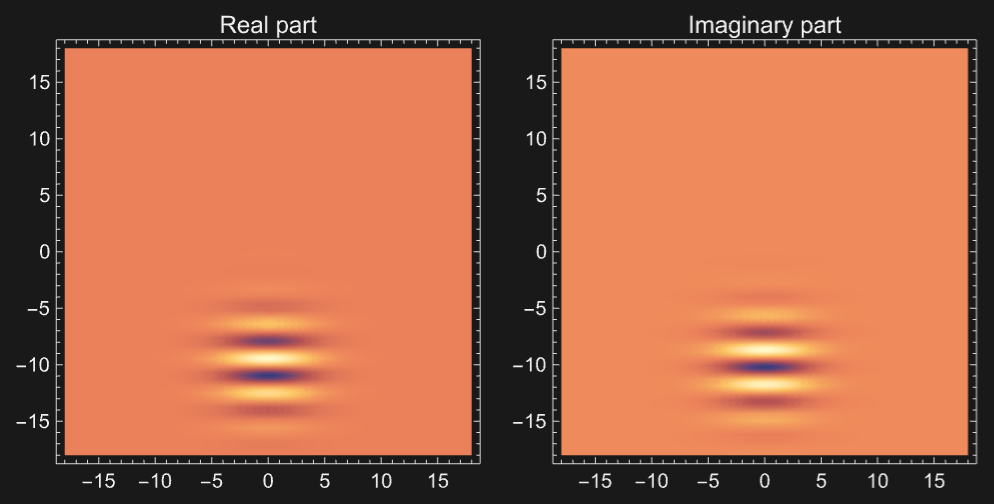
```

IndexReduction  (1)

An index 3 formulation of a constrained pendulum using index reduction:

```wolfram
eqns={x''[t]==T[t]x[t],y''[t]==T[t] y[t]-1,x[t]^2+y[t]^2==1};
init={x[0]==1,y[0]==0,y'[0]==-14/10};
vars={x,y, T};
```

The default method can only solve index 1 problems:

```wolfram
NDSolve[{eqns, init}, vars, {t,0,10}]
(* Output *)
NDSolve
(* Output *)
{{x->InterpolatingFunction[...],y->InterpolatingFunction[...],T->InterpolatingFunction[...]}}
```

The problem resulting from symbolic index reduction can be solved:

```wolfram
s1 = First[NDSolve[{eqns,init},vars,{t,0,10},Method->{"IndexReduction"->True}]]
(* Output *)
{x->InterpolatingFunction[...],y->InterpolatingFunction[...],T->InterpolatingFunction[...]}
```

Solve using reduction to index 0 and a projection method to maintain the constraints:

```wolfram
s2 = First[NDSolve[{eqns,init},vars,{t,0,10},Method->{"IndexReduction"->{True, "ConstraintMethod"->"Projection"}}]]
(* Output *)
{x->InterpolatingFunction[...],y->InterpolatingFunction[...],T->InterpolatingFunction[...]}
```

Plot implicit energy constraint for the two solutions at the time steps:

```wolfram
energy[sol_] := Module[{times = Part[x /. sol, 3, 1], es},
es[t_] = 1+y[t]+(1)/(2) (-y[t] x^′[t]+x[t] y^′[t])^2 /. sol;Transpose[{times,  es[times] - es[0]}]];
```

```wolfram
ListPlot[{energy[s1], energy[s2]}]
```

*([Graphics])*

DAEInitialization  (1)

Use forward collocation for initialization to avoid problems with the [Abs](https://reference.wolfram.com/language/ref/Abs.html) term at 0:

```wolfram
NDSolve[{x'[t]==Abs[u[t]],u[t]==Sin[t],y[t]==x[t],y[0]==10},{x,y,u},{t,0,10}, Method->{"DAEInitialization"->{"Collocation", "CollocationDirection"->"Forward"}}]
(* Output *)
{{x->InterpolatingFunction[...],y->InterpolatingFunction[...],u->InterpolatingFunction[...]}}
```

#### NormFunction

Plot the actual solution error when using different error estimation norms:

```wolfram
L = 10;Table[sol[p] = NDSolve[{D[u[t,x],t,t] == D[u[t,x],x,x], u[0,x] == Exp[-x^2], Derivative[1,0][u][0,x] == -Exp[-x^2], u[t,-L] == u[t,L]}, u, {t,0,4 L},{x,-L,L}, NormFunction->(Norm[#, p]&),Method->{"MethodOfLines","SpatialDiscretization"->{"TensorProductGrid","MaxPoints"->125,"MinPoints"->125,"DifferenceOrder"->"Pseudospectral"}}];
Plot[Evaluate[(u[4L,x] /. sol[p]) -  (Exp[-x^2] - 2Sqrt[π])],{x,-L,L}, PlotRange->All],{p, {1,2,3,∞}}]
(* Output *)
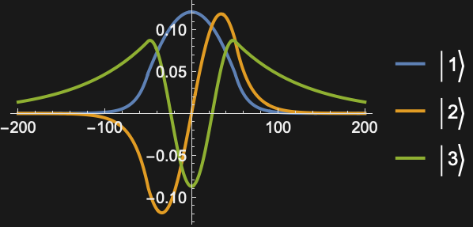
```

A plot of the best solution:

```wolfram
Plot3D[u[t,x] /. sol[1], {t,0,40},{x,-L,L}, Mesh->False, PlotPoints->20]
```

*([Graphics3D])*

#### StartingStepSize

For a very large interval, a short-lived feature near the start may be missed:

```wolfram
feature[t_?NumberQ] := If[t < 1, t Sin[10 Pi t], 0];sol = NDSolve[{x''[t] + 10^-4 x[t] == feature[t],x[0] == x'[0] == 0}, x,  {t, 0, 10000}]
(* Output *)
{{x->InterpolatingFunction[...]}}
```

```wolfram
Max[Abs[x[RandomReal[{0, 10000}, 10000]] /. sol]]
(* Output *)
0.
```

Setting a sufficiently small step size to start with ensures that the input is not missed:

```wolfram
sol = NDSolve[{x''[t] + 10^-4 x[t] == feature[t],x[0] == x'[0] == 0}, x,  {t, 0, 10000}, StartingStepSize->0.1]
(* Output *)
{{x->InterpolatingFunction[...]}}
```

```wolfram
{Plot[x[t] /. sol, {t,0,2}],Plot[x[t] /. sol, {t, 0, 10000}]}
(* Output *)
{[Graphics],[Graphics]}
```

#### StepMonitor

Plot the solution at each point where a step is taken in the solution process:

```wolfram
ListLinePlot[Reap[NDSolve[{y'[x]==y[x]Cos[x+y[x]],y[0]==1},y,{x,0,30},StepMonitor:>Sow[{x,y[x]}]]][[2,1]]]
```

*([Graphics])*

Total number of steps involved in finding the solution:

```wolfram
Module[{c=0},NDSolve[{y'[x]==y[x]Cos[x+y[x]],y[0]==1},y,{x,0,30},StepMonitor:>c++];c]
(* Output *)
337
```

Differences between values of `*x*` at successive steps:

```wolfram
ListLinePlot[Differences[Reap[NDSolve[{y'[x]==y[x]Cos[x+y[x]],y[0]==1},y,{x,0,30},StepMonitor:>Sow[x]]][[2,1]]]]
```

*([Graphics])*

#### WorkingPrecision

Error in the solution to a harmonic oscillator over 100 periods:

```wolfram
T = 200 Pi;
Timing[y[T] /. NDSolve[{y''[x] + y[x] == 0, y[0] == 0, y'[0] == 1},y,{x,0,T}, MaxSteps->Infinity]]
(* Output *)
{0.029,{-3.220875425279086×10^-6}}
```

When the working precision is increased, the local tolerances are correspondingly increased:

```wolfram
Timing[y[T] /. NDSolve[{y''[x] + y[x] == 0, y[0] == 0, y'[0] == 1},y,{x,0,T}, WorkingPrecision->32, MaxSteps->10^6]]
(* Output *)
{1.051,{-9.22631556964666463993566319065316418450031695×10^-14}}
```

With a large working precision, sometimes the `"Extrapolation"` method is quite effective:

```wolfram
Timing[y[T] /. NDSolve[{y''[x] + y[x] == 0, y[0] == 0, y'[0] == 1},y,{x,0,T}, WorkingPrecision->32, Method->"Extrapolation"]]
(* Output *)
{0.328,{-4.601923468309640849364276688805635761477704×10^-16}}
```

Error in the solution to a harmonic oscillator over 100 periods:

```wolfram
T = 200 Pi;
Timing[y[T] /. NDSolve[{y''[x] + y[x] == 0, y[0] == 0, y'[0] == 1},y,{x,0,T}]]
(* Output *)
{0.022,{-3.220875425279086×10^-6}}
```

When the working precision is increased, the local tolerances are correspondingly increased:

```wolfram
Timing[y[T] /. NDSolve[{y''[x] + y[x] == 0, y[0] == 0, y'[0] == 1},y,{x,0,T}, WorkingPrecision->32,MaxSteps->Infinity]]
(* Output *)
{1.032,{-9.22631556964666463993566319065316418450031695×10^-14}}
```

With a large working precision, sometimes the `"Extrapolation"` method is quite effective:

```wolfram
Timing[y[T] /. NDSolve[{y''[x] + y[x] == 0, y[0] == 0, y'[0] == 1},y,{x,0,T}, WorkingPrecision->32, Method->"Extrapolation"]]
(* Output *)
{0.328,{-4.601923468309640849364276688805635761477704×10^-16}}
```

### Applications

#### Ordinary Differential Equations

Simulate Duffing's equation for a particle in a double potential well:

```wolfram
s=NDSolve[{x''[t]+0.15x'[t]-x[t]+x[t]^3==0.3Cos[t],x[0]==-1,x'[0]==1},x,{t,0,50}]
(* Output *)
{{x->InterpolatingFunction[...]}}
```

```wolfram
Plot[Evaluate[x[t]/.s],{t,0,50}]
```

*([Graphics])*

The solution depends strongly on initial conditions:

```wolfram
s=NDSolve[{x''[t]+0.15x'[t]-x[t]+x[t]^3==0.3Cos[t],
 x[0]==-1,x'[0]==1.001},x,{t,0,50}]
(* Output *)
{{x->InterpolatingFunction[...]}}
```

```wolfram
Plot[Evaluate[x[t]/.s],{t,0,50}]
```

*([Graphics])*

The Lorenz equations [[more info](http://mathworld.wolfram.com/LorenzEquations.html)]:

```wolfram
s=NDSolve[{x^′[t]==-3 (x[t]-y[t]),y^′[t]==-x[t] z[t]+26.5 x[t]-y[t],z^′[t]==x[t] y[t]-z[t],x[0]==z[0]==0,y[0]==1},{x,y,z},{t,0,200}]
(* Output *)
{{x->InterpolatingFunction[...],y->InterpolatingFunction[...],z->InterpolatingFunction[...]}}
```

```wolfram
ParametricPlot3D[Evaluate[{x[t],y[t],z[t]}/.s],{t,0,200},PlotPoints->1000,ColorFunction->(Hue[#4]&)]
(* Output *)
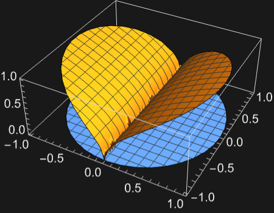
```

The Lotka-Volterra predator-prey equations [[more info](http://mathworld.wolfram.com/Lotka-VolterraEquations.html)]:

```wolfram
NDSolve[{y'[t]==y[t](x[t]-1),x'[t]==x[t](2-y[t]),x[0]==1,y[0]==2.7},{x,y},{t,0,10}]
(* Output *)
{{x->InterpolatingFunction[...],y->InterpolatingFunction[...]}}
```

Phase plane plot:

```wolfram
ParametricPlot[Evaluate[{x[t],y[t]}/.First[%]],{t,0,10}]
```

*([Graphics])*

Look at the appearance of the blue sky catastrophe orbit in the Gavrilov-Shilnikov model:

```wolfram
eqns = {
x'[t]==x[t](2+μ-10(x[t]^2+y[t]^2)) + z[t]^2 + y[t]^2 +2 y[t],
y'[t]==-z[t]^3-(1+y[t])(z[t]^2+y[t]^2+2 y[t])-4 x[t]+μ y[t],
z'[t]==(1+y[t]) z[t]^2 +x[t]^2-ε};
```

```wolfram
Table[Block[{ε=0.0357,T=1000},
sol = First[NDSolve[{eqns, x[0]==y[0]==z[0]==1},{x,y,z},{t,0,T}]];
ParametricPlot3D[Evaluate[{x[t],y[t],z[t]} /. sol],{t,T/4,T}, BoxRatios->1,PlotPoints->1000,PlotRange->All]],{μ,.455,.456,.001}]
(* Output *)
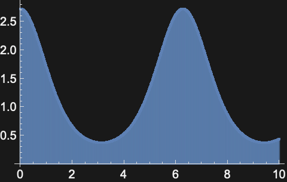
```

Reduced 3-body problem [[more info]](http://www.wolframscience.com/nksonline/page-973a-text):

```wolfram
eqn=z''[t]==-(z[t])/((z[t]^2+((1)/(2) (1+0.1 Sin[2 Pi t]))^2)^(3/2));
```

```wolfram
NDSolve[{eqn,z[0]==1,z'[0]==0},z,{t,0,30}]
(* Output *)
{{z->InterpolatingFunction[...]}}
```

```wolfram
Plot[Evaluate[z[t]/.%],{t,0,30}]
```

*([Graphics])*

A formulation suitable for a number of different initial conditions:

```wolfram
eqn=D[z[t,s],t,t]==-(z[t,s])/((z[t,s]^2+((1)/(2) (1+0.1 Sin[2 Pi t]))^2)^(3/2));
```

```wolfram
sol = NDSolve[{eqn,z[0,s]==s,Derivative[1,0][z][0,s]==0},z,{t,0,10}, {s,1,2}]
(* Output *)
{{z->InterpolatingFunction[...]}}
```

```wolfram
Plot3D[Evaluate[z[tp, z0]/.sol],{tp,0,10},{z0,1,2}]
```

*([Graphics3D])*

#### Partial Differential Equations

A large collection of PDE models from various fields with extensive explanation can found in the [PDE models overview](https://reference.wolfram.com/language/PDEModels/tutorial/PDEModelsOverview.html).

Simple model for soil temperature at depth `*x*` with periodic heating at the surface:

```wolfram
NDSolve[{D[u[t,x],t]==D[u[t,x],x,x],u[0,x]==0,u[t,0]==Sin[t],u[t,5]==0},u,{t,0,10},{x,0,5}]
(* Output *)
{{u->InterpolatingFunction[...]}}
```

```wolfram
Plot3D[Evaluate[u[t,x]/.%],{t,0,10},{x,0,5}, PlotRange->All]
```

*([Graphics3D])*

Simple wave evolution with periodic boundary conditions:

```wolfram
s=NDSolve[{∂_t,tu[t,x]==∂_x,xu[t,x],u[0,x]==ℯ^(-x^2),u^(1,0)[0,x]==0,u[t,-10]==u[t,10]},u,{t,0,40},{x,-10,10}]
(* Output *)
{{u->InterpolatingFunction[]}}
```

Plot the solution:

```wolfram
DensityPlot[Evaluate[First[u[t,x]/.s]],{t,0,40},{x,-10,10},PlotPoints->30]
```

*([Graphics])*

Wolfram's nonlinear wave equation [[more info](http://www.wolframscience.com/nksonline/page-923a-text)]:

```wolfram
s=NDSolve[{∂_t,tu[t,x]==∂_x,xu[t,x]+(1-u[t,x]^2) (1+2 u[t,x]),u[0,x]==ℯ^(-x^2),u^(1,0)[0,x]==0,u[t,-10]==u[t,10]},u,{t,0,10},{x,-10,10}]
(* Output *)
{{u->InterpolatingFunction[...]}}
```

```wolfram
Plot3D[Evaluate[u[t,x]/.s],{t,0,10},{x,-10,10}]
```

*([Graphics3D])*

```wolfram
DensityPlot[Evaluate[u[-t,x]/.s],{x,-10,10},{t,0,-10}]
```

*([Graphics])*

Model with Wolfram's nonlinear wave equation [[more info](http://www.wolframscience.com/nksonline/page-923a-text)] with a Dirichlet condition.

Define initial and boundary conditions:

```wolfram
ics={u[0,x]==Exp[-x^2],Derivative[1,0][u][0,x]==0};
```

```wolfram
bcs=DirichletCondition[u[t,x]==0,True];
```

Solve the equation:

```wolfram
sol=NDSolve[{(1+2 u[t,x]) (-1+u[t,x]^2)+(-u[t,x])+u^(2,0)[t,x]==0,ics,bcs},u,{t,0,10},{x,-10,10}]
(* Output *)
{{u->InterpolatingFunction[...]}}
```

Visualize the result:

```wolfram
Plot3D[u[t,x]/.sol,{x,-10,10},{t,0,10},ColorFunction -> SouthwestColors, Axes -> None, Boxed -> False, ImageSize -> Medium]
```

*([Graphics3D])*

Wolfram's nonlinear wave equation in two space dimensions:

```wolfram
NDSolve[{D[u[t,x,y],t,t]==D[u[t,x,y],x,x]+D[u[t,x,y],y,y]/2+(1-u[t,x,y]^2)(1+2u[t,x,y]),u[0,x,y]==ℯ^(-(x^2+y^2)),u[t,-5,y]==u[t,5,y],u[t,x,-5]==u[t,x,5],u^(1,0,0)[0,x,y]==0},u,{t,0,4},{x,-5,5},{y,-5,5}]
(* Output *)
{{u->InterpolatingFunction[]}}
```

```wolfram
Table[Plot3D[Evaluate[u[t,x,y]/.%],{x,-5,5},{y,-5,5},PlotRange->All],{t,1,4}]
(* Output *)
{[Graphics3D],[Graphics3D],[Graphics3D],[Graphics3D]}
```

A moving soliton driven by a periodic source term in a nonlinear Schrödinger equation:

```wolfram
L=50;
sol=NDSolve[{I D[u[t,x],t]+D[u[t,x],x,x]+2 Abs[u[t,x]]^2 u[t,x]==0.1 (1-Cos[Pi x/L]),u[0,x]==Sech[x] Exp[I x],u[t,-L]==u[t,L]},u,{t,0,10},{x,-L,L}]
(* Output *)
{{u->InterpolatingFunction[]}}
```

```wolfram
Plot3D[Evaluate[Abs[u[t,x]/.First[sol]]],{t,0,10},{x,-L,L},PlotPoints->60,MaxRecursion->3,Mesh->None]
(* Output *)
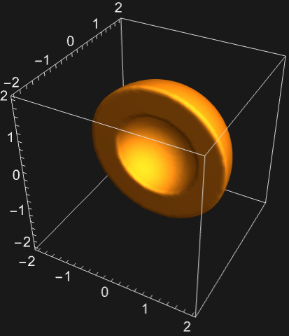
```

A moving soliton under periodic potential in a nonlinear Schrödinger equation:

```wolfram
L=20;
sol=NDSolve[{I D[u[t,x],t]+D[u[t,x],x,x]+2 Abs[u[t,x]]^2 u[t,x]+0.1 (1-Cos[Pi x/L]) u[t,x]==0,u[0,x]==Sech[x]Exp[I x],u[t,-L]==u[t,L]},u,{t,0,15},{x,-L,L}]
(* Output *)
{{u->InterpolatingFunction[...]}}
```

```wolfram
Plot3D[Abs[u[t,x]/.First[sol]],{t,0,15},{x,-L,L},PlotPoints->60,PlotRange->All,MaxRecursion->3]
(* Output *)
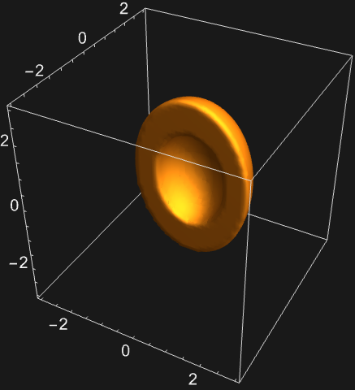
```

Define a Korteweg-de Vries (KdV) equation in canonical form:

```wolfram
KdV = {D[u[x,t],t]+D[u[x,t],{x, 3}]+ 6u[x,t]D[u[x,t],x]==0}
(* Output *)
{u^(0,1)[x,t]+6 u[x,t] u^(1,0)[x,t]+u^(3,0)[x,t]==0}
```

Find a traveling soliton solution with periodic boundary conditions:

```wolfram
sol = NDSolve[{KdV,u[x,0]==2-2 Tanh[(1)/(4)+x]^2,u[-50,t]== u[50,t]},u,{x,-50,50},{t,0,10}]
(* Output *)
{{u->InterpolatingFunction[]}}
```

```wolfram
Plot[Evaluate[Table[u[x,t]/.First[sol],{t,1,12,3}]], {x,-5,50},PlotRange->All,Filling->Axis,Epilog->{Arrow[{{5,1.6},{9,1.6}}],Arrow[{{17,1.6},{21,1.6}}],Arrow[{{29,1.6},{33,1.6}}],Arrow[{{41,1.6},{45,1.6}}]}]
```

*([Graphics])*

Define an alternative form of the KdV equation:

```wolfram
KdV = {D[u[x,t],t]+D[u[x,t],{x, 3}]- 6u[x,t]D[u[x,t],x]==0}
(* Output *)
{u^(0,1)[x,t]-6 u[x,t] u^(1,0)[x,t]+u^(3,0)[x,t]==0}
```

Fission into two solitons from a sech-squared initial condition:

```wolfram
sol=NDSolve[{KdV,u[x,0]==-6 Sech[x]^2,u[-50,t]== u[50,t]},u,{x,-50,50},{t,0,10},Method->{"MethodOfLines","SpatialDiscretization"->{"TensorProductGrid","MaxPoints"->5000,"MinPoints"->5000},Method->"StiffnessSwitching"}]
(* Output *)
{{u->InterpolatingFunction[]}}
```

```wolfram
ListAnimate[Plot[#,{x,-50,50},PlotRange->All]&/@Table[u[x,t]/.First[sol],{t,0,10,0.1}],SaveDefinitions->True]
```

Use Stokes's equation to compute the fluid velocity field in a narrowing channel:

```wolfram
Ω=RegionUnion[Rectangle[{0,0},{1,1/2}],Rectangle[{1,1/10},{2,2/5}]];
{xVel,yVel}={u,v}/.First[NDSolve[{{({{-μ,0},{0,-μ}}.u[x,y])+p^(1,0)[x,y],({{-μ,0},{0,-μ}}.v[x,y])+p^(0,1)[x,y],u^(1,0)[x,y]+v^(0,1)[x,y]}=={0,0,0}/.μ->1,{
DirichletCondition[u[x,y]==4*0.3*y*(0.5-y)/(0.41)^2,x==0.],DirichletCondition[{u[x,y]==0.,v[x,y]==0.},0<x<2],
DirichletCondition[p[x,y]==0.,x== 2]}},{u,v,p},{x,y}∈Ω,Method->{"FiniteElement","InterpolationOrder"->{u->2,v->2,p->1},"MeshOptions"->{"MaxCellMeasure"->0.0005}}]];
```

```wolfram
VectorPlot[{xVel[x,y], yVel[x,y]},{x,y}∈Ω, AspectRatio->Automatic,StreamPoints->6,StreamColorFunctionScaling->False]
(* Output *)
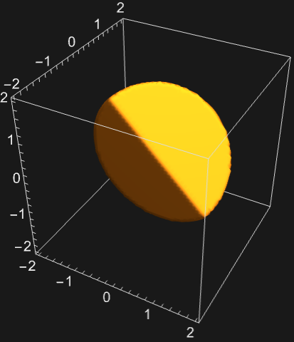
```

Model a temperature field with a heat source in a rod:

```wolfram
vars={Θ[x],{x}};
pars=<|"ThermalConductivity"->0.026,"HeatSource"->1|>;
Ω=Line[{{0},{1}}];
eqn=HeatTransferPDEComponent[vars,pars]==0
(* Output *)
-1.+({{-0.026}}.Θ[x])==0
```

Solve the PDE:

```wolfram
Tfun=NDSolve[{eqn,HeatTemperatureCondition[x==0,vars,pars,<|"SurfaceTemperature"->0|>]},Θ,x∈Ω]
(* Output *)
{{Θ->InterpolatingFunction[...]}}
```

Visualize the solution:

```wolfram
Plot[Θ[x]/.Tfun,{x}∈Ω]
```

*([Graphics])*

Define model variables `*vars*` for a transient acoustic pressure field with model parameters `*pars*`:

```wolfram
vars={p[t,x],t,{x}};
pars=<|"SoundSpeed"->343,"MassDensity"->1.2|>;
```

Define initial conditions `*ics*` of a right-going sound wave $p_{0}$:

```wolfram
p0=D[0.125 Erf[(x-0.5)/0.15],x];
ics={p[0,x]==p0,Derivative[1,0][p][0,x]==-343*D[p0,x]};
```

Set up the equation with a sound hard boundary at the right end:

```wolfram
eqn=AcousticPDEComponent[vars,pars]==AcousticSoundHardValue[x==1,vars,pars]
(* Output *)
({{-0.8333333333333334}}.p[t,x])+7.083216460261739×10^-6 p^(2,0)[t,x]==NeumannValue[0,x==1]
```

Solve the PDE:

```wolfram
pfun=NDSolve[{eqn,ics},p,{t,0,0.003},x∈Line[{{0},{1}}]]
(* Output *)
{{p->InterpolatingFunction[...]}}
```

Visualize the sound field in the time domain:

```wolfram
Manipulate[Plot[Evaluate[p[t,x]/.pfun],{x,0,1},PlotRange -> 02, AxesLabel -> xP],{{t,0},0,0.003,10^-4},SaveDefinitions -> True]
```

Model a 1D chemical species transport through different material with a reaction rate in one. The right side and left side are subjected to a mass concentration and inflow condition, respectively:

$\overset{\overset{           mass transport model              }{\text{OverBrace}}}{\nabla \cdot(-d \nabla c(x))+a c(x)} =\overset{\overset{ mass flux value  }{\text{OverBrace}}}{|_{\Gamma_{x=0}}q(x)}$

Set up the stationary mass transport model variables `*vars*`:

```wolfram
vars={c[x],{x}};
```

Set up a region $\Omega$:

```wolfram
Ω=Line[{{0},{1}}];
```

Specify the mass transport model parameters species diffusivity $d$ and a reaction rate $a$ active in the region $x>1/2$:

```wolfram
pars=<|"DiffusionCoefficient"->0.01,"MassReactionRate"->If[x>1/2,1,0]|>;
```

Specify a species flux boundary condition:

```wolfram
Γ_flux=MassFluxValue[x==0,vars,pars,<|"MassFlux"->1|>]
(* Output *)
NeumannValue[1+c[x] NeumannBoundaryUnitNormal[{x}].{0},x==0]
```

Specify a mass concentration boundary condition:

```wolfram
Γ_C=MassConcentrationCondition[x==1,vars,pars,<|"MassConcentration"->0|>]
(* Output *)
DirichletCondition[c[x]==0,x==1]
```

Set up the equation:

```wolfram
eqn=MassTransportPDEComponent[vars,pars]==Γ_flux
(* Output *)
c[x] If[x>0.5,1.,0.]+({{-0.01}}.c[x])==NeumannValue[1+c[x] NeumannBoundaryUnitNormal[{x}].{0},x==0]
```

Solve the PDE:

```wolfram
cfun=NDSolve[{eqn,Γ_C},c,x∈Ω]
(* Output *)
{{c->InterpolatingFunction[...]}}
```

Visualize the solution:

```wolfram
Show[Plot[Evaluate[c[x]/.cfun],x∈Ω,AxesLabel -> xc],Graphics[DashedGrayLine[0.5-0.10.560]Text[Material 1, 0.2560]Text[Material 2, 0.7560]]]
```

*([Graphics])*

Set up the transient Gray-Scott system of equations and its coefficients:

```wolfram
eqn = {u[t,x,y] (f+v[t,x,y]^2)+(-c1 u[t,x,y])+u^(1,0,0)[t,x,y]==f,v[t,x,y] (f+k-u[t,x,y] v[t,x,y])+(-c2 v[t,x,y])+v^(1,0,0)[t,x,y]==0}//. {c1 -> 2*10^-5, c2 -> c1/4, f -> 1/25, k -> 3/50};
```

As initial conditions, set $u=1/2$ and $v=1$ if $x^{2}+y^{2}<=1/40$, else 0:

```wolfram
ics={u[0,x,y]==1/2,v[0,x,y]==If[x^2+y^2<=1/40,1,0]};
```

Set both $u$ and $v$ to zero on the boundary:

```wolfram
bcs=DirichletCondition[{u[t,x,y]==0,v[t,x,y]==0},True];
```

Solve the system of equations on a refined finite element mesh:

```wolfram
sol=NDSolve[{eqn,bcs,ics},{u,v},{x,y}∈Disk[],{t,0,3000},Method->{"PDEDiscretization"->{"MethodOfLines","SpatialDiscretization"->{"FiniteElement","MeshOptions"->{"MaxCellMeasure"->0.003}}}}];
```

Visualize the result:

```wolfram
frames=Table[ContourPlot[v[t,x,y]/.sol,{x,-1,1},{y,-1,1},Contours -> Range[Part[#, 1], Part[#, 2], 1, /, 4, ), Part[#, 2], -, Part[#, 1], )], &, ), [, MinMax[ReplaceAll[v[ValuesOnGrid], sol]]SelectWithContents -> TrueSelectable -> False]],{t,100,2000,25}];
ListAnimate[frames,SaveDefinitions -> True]
```

Set up the transient Landau-Ginzburg equations:

```wolfram
eqn={u^(1,0)[t,x]+(-u[t,x])+(-v[t,x])-u[t,x]+(u[t,x]-2 v[t,x]) (u[t,x]^2+v[t,x]^2)==0,v^(1,0)[t,x]+u[t,x]+(-v[t,x])-v[t,x]+(2 u[t,x]+v[t,x]) (u[t,x]^2+v[t,x]^2)==0};
```

Set up initial conditions such that machine underflow is avoided:

```wolfram
exp[x_]:=If[x<Log[$MinMachineNumber],0.,Exp[x]]
ics={u[0,x]==1-exp[-x^2],v[0,x]==exp[-(10-x)^2]};
```

Specify boundary conditions:

```wolfram
bcs={u[t,-50]==1,u[t,50]==1,v[t,-50]==0,v[t,50]==0};
```

Solve the equations on a mesh with specified spacing:

```wolfram
sol=NDSolve[{eqn,ics,bcs},{u,v},{t,0,40},{x,-50,50},Method->{"MethodOfLines","SpatialDiscretization"->{"FiniteElement","MeshOptions"->{"MaxCellMeasure"->0.4}}}];
```

Visualize the result:

```wolfram
DensityPlot[Evaluate[Sqrt[(u[t,x]^2+v[t,x]^2)/.sol]],{x,-50,50},{t,0,40},PlotRange -> All, MaxRecursion -> 8, PlotPoints -> 100, Frame -> None, Axes -> None, ImageSize -> Medium]
(* Output *)
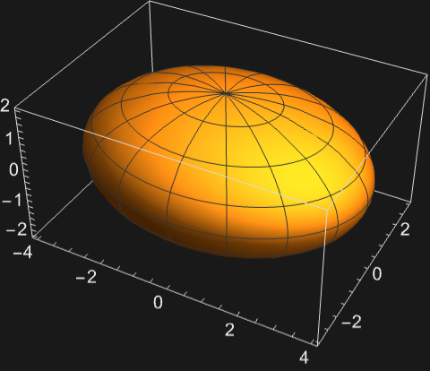
```

The Black-Scholes equation: the goal is to determine the price of a European vanilla call option using the Black-Scholes model, given that both the underlying asset price $S$ and the strike price $K$ are $$100$, the risk-free interest rate $r$ is $5 %$, the asset's volatility $\sigma$ is $20 %$, and the option has a maturity period $t_{end}$ of one year.

Define the parameters:

```wolfram
pars={tEnd->1,k->100,σ->0.2,r-> 0.05}
(* Output *)
{tEnd->1,k->100,σ->0.2,r->0.05}
```

Define the bounds for the asset's price $S$:

```wolfram
{lower,upper}={0,3k}/.pars
(* Output *)
{0,300}
```

Define the PDE and replace parameters:

```wolfram
BSPDE=-r V[t,s]+r s V^(0,1)[t,s]+(1)/(2) s^2 σ^2 V^(0,2)[t,s]+V^(1,0)[t,s]==0/.pars
(* Output *)
-0.05 V[t,s]+0.05 s V^(0,1)[t,s]+0.020000000000000004 s^2 V^(0,2)[t,s]+V^(1,0)[t,s]==0
```

Set up the terminal condition:

```wolfram
terminalBC=V[tEnd,s]==Max[0,s-k]/.pars
(* Output *)
V[1,s]==Max[0,-100+s]
```

The boundary conditions are chosen so that at the lower bound, where the asset price is very low, the option is worth zero. The condition at the upper bound comes from the put-call parity.

Specify boundary conditions:

```wolfram
bcs={DirichletCondition[V[t,s]==upper-k ℯ^(-r(tEnd-t)),s==upper],DirichletCondition[V[t,s]==0,s==lower]}/.pars
(* Output *)
{DirichletCondition[V[t,s]==300-100 ℯ^(-0.05 (1-t)),s==300],DirichletCondition[V[t,s]==0,s==0]}
```

Solve the PDE on a refined mesh:

```wolfram
sol=NDSolve[{BSPDE,terminalBC,bcs},V,{t,0,tEnd}/.pars,{s,lower,upper},Method->{"MethodOfLines","SpatialDiscretization"->{"FiniteElement","MeshOptions"->{"MaxCellMeasure"->0.1}}}]
(* Output *)
{{V->InterpolatingFunction[]}}
```

Check the value of the option for an asset price of $100$ at time $t=0$:

```wolfram
V[0,100]/.sol[[1]]
(* Output *)
10.450516851337039
```

Plot the obtained numerical solution for the whole time range:

```wolfram
Plot3D[V[t,s]/.sol,{s,50,150},{t,0,1},ColorFunction -> BlueGreenYellow, AxesLabel -> stock price, stimeoption price]
(* Output *)
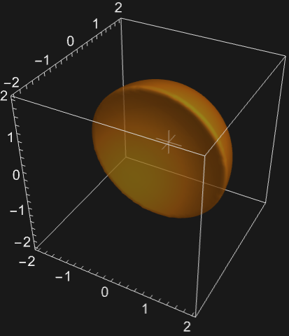
```

Define a function to get the price of the option using the [FinancialDerivative](https://reference.wolfram.com/language/ref/FinancialDerivative.html) function:

```wolfram
optionPrice[s0_]:=FinancialDerivative@@ReplaceAll[{{"European","Call"}, {"StrikePrice"-> k, "Expiration"->tEnd}, {"InterestRate"-> r, "Volatility" -> σ ,"CurrentPrice"->s0}},pars]
```

Inspect the conventionally true value given by [FinancialDerivative](https://reference.wolfram.com/language/ref/FinancialDerivative.html):

```wolfram
optionPrice[100]
(* Output *)
10.450583572185565
```

Calculate the error between the two values:

```wolfram
trueVal=optionPrice[100];
numericalVal=V[0,100]/.sol[[1]];
PercentForm[(Abs[trueVal-numericalVal])/(trueVal)]
(* Output *)
"0.0006384%"
```

Plot the difference between the numerical solution at time $0$ and the conventionally true solution:

```wolfram
Plot[optionPrice[s0]-V[0,s0]/.sol,{s0,0,200}/.pars,AxesLabel -> stock priceoption price, PlotLabel -> Difference, PlotRange -> All]
```

*([Graphics])*

#### Delay Differential Equations

View solutions of the Mackey-Glass delay differential equation for respiratory dynamics:

```wolfram
Manipulate[
Module[{sol,x,t},
sol = First[ NDSolve[{x'[t] == a x[t - τ]/(1 + x[t - τ]^10) -b  x[t], x[t /; t <= 0]==1/2},x,{t,0,500}]];
ParametricPlot[Evaluate[{x[t], x[t - τ]} /. sol],{t,300,500}, PlotRange->{{0,2},{0,2}}]],{{a,.2},0,1},{{b,.1},0,1},
{{τ,17},1,20}]
```

#### Hybrid Differential Equations

Simulate a bouncing ball that retains 95% of its velocity in each bounce:

```wolfram
NDSolve[{y''[t]==-9.81,y[0]==5,y'[0]==0,WhenEvent[y[t]==0,y'[t]->-0.95y'[t]]},y,{t,0,10}];
```

```wolfram
Plot[y[t]/.%,{t,0,10}]
```

*([Graphics])*

Model a ball bouncing down steps:

```wolfram
ballsteps=NDSolve[{x''[t]==0,y''[t]==-9.8,y[0]==6,y'[0]==0,x[0]==0,x'[0]==1,a[0]==5,WhenEvent[Mod[x[t],1]==0,If[a[t]>0,a[t]->a[t]-1,"RemoveEvent"]],WhenEvent[y[t]==a[t],{x'[t],y'[t]}->.9{x'[t], -y'[t]}]},{x,y,a},{t,0,15},DiscreteVariables->{a}];
```

```wolfram
Show[ParametricPlot[Evaluate[{{x[t],y[t]},{x[t],a[t]}} /. ballsteps],{t,0,15}], Plot[{0,Floor[6-x]},{x,-1,15}, Filling->{2->0}, Exclusions->None],Frame->{{True,False},{True,False}},FrameLabel->{x,y}]
```

*([Graphics])*

Each time a linear oscillator solution crosses the negative $x$ axis, reflect it across the $y$ axis:

```wolfram
de[δ_]:={x_1'[t]==x_2[t],x_2'[t]==-x_1[t]+2δ x_2[t]+1};
ic={x_1[0]==.5,x_2[0]==.5};
```

```wolfram
{sol,{points}}=NDSolve[{de[0.1],ic,WhenEvent[And[x_2[t]==0,x_1[t]<0],{x_1[t]->-x_1[t],Sow[-x_1[t]]}]},{x_1,x_2},{t,0,1000}]//Reap;
```

The solution of this reset oscillator exhibits chaotic behavior:

```wolfram
Map[ParametricPlot[{x_1[t], x_2[t]}/.sol, {t, 0, #}, PlotPoints->500,PlotRange->{{-1,3},{-2,2}}]&,{10,100,400}]
(* Output *)
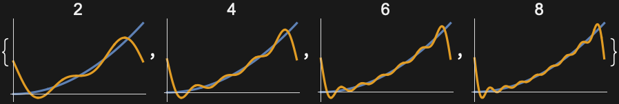
```

Plot the solution on the negative $x$ axis with a histogram of the reflection points:

```wolfram
Grid[{{Histogram[points,{-1,0, .05}]},{ParametricPlot[{x_1[t], x_2[t]}/.sol, {t, 0, 1000}, PlotRange->{{-1,0},{-0.3,0}},PlotPoints->2000,Axes->None]}}]
(* Output *)
{{[Graphics]}, {[Graphics]}}
```

Model a one-degree-of-freedom impact oscillator with sinusoidal forcing:

```wolfram
sol[ω_]:=With[{r=0.95},
NDSolve[{u'[t]==v[t],v'[t]==-u[t]+Cos[ω t],u[0]==0,v[0]==0,WhenEvent[u[t]==0,v[t]->-r v[t]]},{u, v},{t,0,300}]];
```

```wolfram
Table[ParametricPlot[Evaluate[{u[t],v[t]}/.sol[ω]],{t,200,300}, PlotPoints->200,PlotRange->{{-.1,1},{-1,1}}],{ω,{3,2.76,2.9}}]
(* Output *)
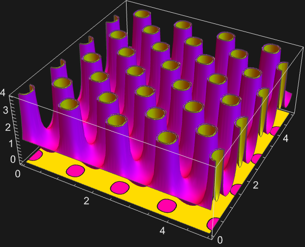
```

Model a damped oscillator that gets a kick at regular time intervals:

```wolfram
system={x''[t]+.1x'[t]+x[t]==0,x[0]==1,x'[0]==0};
control=WhenEvent[Mod[t,1],x'[t]->x'[t]+1];
```

```wolfram
sol=NDSolve[{system,control},x,{t,0,100}]
(* Output *)
{{x->InterpolatingFunction[...]}}
```

```wolfram
Plot[Evaluate[{x[t],x'[t]}/.sol],{t,0,100},PlotPoints->120]
```

*([Graphics])*

The trajectory eventually settles into a consistent orbit:

```wolfram
ParametricPlot[{x[t],x'[t]}/.sol,{t,90,100},AspectRatio->1]
```

*([Graphics])*

#### Mechanical Systems

Model the motion of a pendulum in Cartesian coordinates. Derive the governing equations using Newton's second law of motion, $m x^{'}^{'}(t)=\sum F_{x}$ and $m y^{'}^{'}(t)=\sum F_{y}$, with a force diagram:

$$
\text{[Graphics]}
$$

```wolfram
deqns={x''[t]==λ[t] x[t],y''[t]==λ[t] y[t]-9.81};
aeqns={x[t]^2+y[t]^2==1^2};
ics={x[0]==1,y'[0]==1};
```

Simulate the system:

```wolfram
sol1=NDSolve[{deqns,aeqns,ics},{x,y,λ},{t,0,5},Method -> {"IndexReduction" -> True}];
```

```wolfram
Plot[Evaluate[{x[t],y[t]}/.sol1],{t,0,5}]
```

*([Graphics])*

Add damping to the pendulum so that it slows down over time:

```wolfram
deqns2={x''[t]==λ[t]x[t]-0.5 x'[t], y''[t]==λ[t] y[t]-9.8-0.5 y'[t]};
```

```wolfram
sol2=NDSolve[{deqns2,aeqns,ics},{x,y,λ},{t,0,20},Method -> {"IndexReduction" -> True}];
```

The pendulum stabilizes at the vertical fixed point:

```wolfram
Plot[Evaluate[{x[t],y[t]}/.sol2],{t,0,20}]
(* Output *)
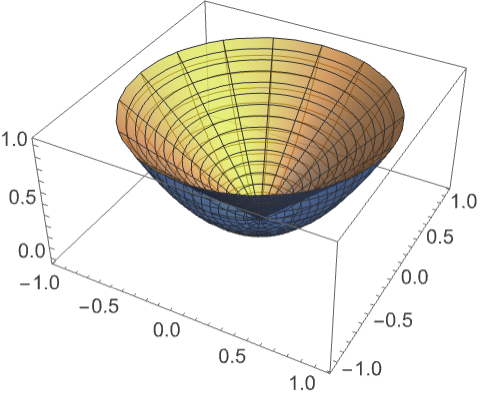
```

Change the rod to a stiff spring by modifying the constraint $x(t)^{2}+y(t)^{2}=l^{2}$:

```wolfram
aeqns3={Sqrt[x[t]^2+y[t]^2](1+λ[t] κ)==1};
κ=5 10^-4;
```

```wolfram
sol3=Quiet@NDSolve[{deqns,aeqns3,ics},{x,y,λ},{t,0,5},Method->{"IndexReduction"->True},AccuracyGoal->6];
```

The solution contains high-frequency spring oscillations:

```wolfram
Plot[Evaluate[{x[t],y[t]}/.sol3],{t,0,5}]
```

*([Graphics])*

Model a double pendulum of unit mass and length that is released from the horizontal plane. Begin by deriving the equations of motion using Newton's second law:

$$
\text{[Graphics]}
$$

```wolfram
deqns={x1''[t]==λ1[t] x1[t]-λ2[t](x2[t]-x1[t]), y1''[t]==λ1[t] y1[t]-λ2[t](y2[t]-y1[t])-9.81,
x2''[t]==λ2[t](x2[t]-x1[t]),y2''[t]==λ2[t] (y2[t]-y1[t])- 9.81};
aeqns={x1[t]^2+y1[t]^2==1,(x2[t]-x1[t])^2+(y2[t]-y1[t])^2 ==1};
ics={x1[0]==1,y1'[0]==1,x2[0]==2,y2'[0]==1};
```

Simulate the system by enforcing the equations and constraints as invariants:

```wolfram
sol=Quiet@NDSolve[{deqns,aeqns,ics},{x1,y1,x2,y2,λ1,λ2},{t,0,15},Method->{"IndexReduction"->{True,"ConstraintMethod"->"Projection"}}] ;
```

Visualize the motion of the double pendulum:

```wolfram
Animate[Graphics[{{Thickness[0.02],Red,Line[{{0,0},{x1[t],y1[t]}}]},{Thickness[0.02],Blue,Line[{{x1[t],y1[t]},{x2[t],y2[t]}}]}}/.sol,PlotRange->{{-2.1,2.1},{0.6,-2.1}},Frame -> True],{t,0,15},SaveDefinitions->True,AnimationRunning->False]
```

Model a block on a moving conveyor belt anchored to a wall by a spring using different models for the friction force $F_{f}$, including viscous, Coulomb, Stribeck, and static. Compare positions and velocities for the different models:

$$
\text{[Graphics]}
$$

```wolfram
m=l=1.;
beltv[t_]=.1;
spring[x_]=1000.(l-x);
```

Newton's equation for the block:

```wolfram
sys:={m x''[t]==spring[x[t]]+friction[x'[t]],x[0]==1, x'[0]==0};
```

*Viscous friction* is proportional to the relative velocity $F_{visc}=-\alpha v$:

```wolfram
viscous[v_]:=-30.(v-beltv[t]);
friction[v_]:=viscous[v];
```

```wolfram
{pos1,vel1}=NDSolveValue[sys,{x[t],x'[t]},{t,0,2}];
```

The block stabilizes just above the spring's natural length of 1:

```wolfram
{Plot[{pos1},{t,0,1},PlotRange->All],Plot[{vel1,beltv[t]},{t,0,1},PlotRange->All]}
(* Output *)
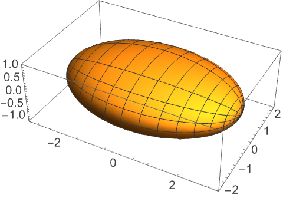
```

*Coulomb friction* is proportional to the sign of relative velocity $F_{coul}=\beta sgn(v)$:

```wolfram
coulomb[v_]:=-25.Sign[v-beltv[t]];
friction[v_]:=viscous[v]+coulomb[v];
```

```wolfram
{pos2,vel2}=NDSolveValue[sys,{x[t],x'[t]},{t,0,20}];
```

The block moves with the belt until the spring force is strong enough:

```wolfram
{Plot[{pos2},{t,0,1},PlotRange->All],Plot[{vel2,beltv[t]},{t,0,1},PlotRange->All]}
(* Output *)
{[Graphics],[Graphics]}
```

*Stribeck friction* is a refined Coulomb friction $F_{str}=\gamma sgn(v) e^{-2 \left|v\right|}$:

```wolfram
stribeck[v_]:=-.3Sign[v]Exp[-2Abs[v]];
friction[v_]:=viscous[v]+coulomb[v]+stribeck[v];
```

```wolfram
{pos3,vel3}=NDSolveValue[sys,{x[t],x'[t]},{t,0,20}];
```

The variation at low velocities is slightly reduced:

```wolfram
{Plot[{pos3},{t,0,1},PlotRange->All],Plot[{vel3,beltv[t]},{t,0,1},PlotRange->All]}
(* Output *)
{[Graphics],[Graphics]}
```

*Static friction* holds the block in place until the spring force exceeds some value `μ` depending on roughness of surfaces. Use the discrete variable `*stuck*` set to 1 when the block is stuck and 0 otherwise:

```wolfram
friction[v_]:=viscous[v]+coulomb[v]+stribeck[v];
```

```wolfram
staticsys:={x''[t]==If[stuck[t]==1,beltv'[t],spring[x[t]]+friction[x'[t]]],x[0]==1, x'[0]==0};
```

Check whether the spring force is smaller than `μ`, and if the block is not moving relative to the belt:

```wolfram
μ=100;
stick=WhenEvent[x'[t]==beltv[t],stuck[t]->Boole[spring[x[t]]^2<μ^2]];
slip=WhenEvent[spring[x[t]]^2>μ^2,stuck[t]->0];
```

```wolfram
{pos4,vel4}=NDSolveValue[{staticsys,stick,slip,stuck[0]==0},{x[t],x'[t]},{t,0,8},DiscreteVariables->stuck[t]];
```

The block repeatedly sticks to the belt, then slips away due to the spring force:

```wolfram
{Plot[{pos4},{t,0,2},PlotRange->All],Plot[{vel4,beltv[t]},{t,0,2},PlotPoints->100,PlotRange->All]}
(* Output *)
{[Graphics],[Graphics]}
```

Compare the different models:

```wolfram
Plot[{pos1,pos2,pos3,pos4},{t,0,2},PlotRange->{0.9,1.1},PlotLegends->{viscous,"Coulomb","Stribeck",static}]
```

*([Graphics])*

#### Electrical Systems

Simulate the response of an RLC circuit to a step in the voltage $v_{1}$ at time $t=0.01$:

$$
\text{[Graphics]}
$$

Use component laws together with Kirchhoff's laws for connections:

```wolfram
components={r iR[t]==vR[t],l iL'[t]==vL[t],iC[t]==c vC'[t]};
connections={vR[t]+vL[t]+vC[t]-v1[t]==0,iL[t]==iR[t],iR[t]==iC[t]};
```

Simulate a step response:

```wolfram
ic={iR[0]==0,iL[0]==0,iC[0]==0,vR[0]==0,vL[0]==0,vC[0]==0};
params={r->5,l->10^-2,c->10^-4};
```

```wolfram
v1[t_]:=UnitStep[t-.01];
```

```wolfram
sol=NDSolve[{components,connections,ic}/.params,vC,{t,0,.03}];
```

```wolfram
Plot[Evaluate[{v1[t],vC[t]}/.sol],{t,0,.03},Filling->{1->0},Ticks->{Range[0.01,0.03,0.01],Automatic},PlotRange->{0,1.5}]
```

*([Graphics])*

Simulate the response of an RLC circuit to a step in the voltage $v_{1}$ at time $t=0.01$:

$$
\text{[Graphics]}
$$

```wolfram
components2={r1 iR1[t]==vR1[t],l iL'[t]==vL[t],iC[t]==c vC'[t],r2 iR2[t]==vR2[t]};
connections2={vL[t]+vR2[t]==v1[t],vR1[t]+vC[t]==vR2[t],iL[t]==iR1[t]+iR2[t],iR1[t]==iC[t]};
```

Simulate a step response:

```wolfram
ic2={iR1[0]==0,iR2[0]==0,iL[0]==0,iC[0]==0,vR1[0]==0,vR2[0]==0,vL[0]==0,vC[0]==0};
params2={r1->5,r2->10,l->10^-2,c->10^-4};
```

```wolfram
v1[t_]:=UnitStep[t-.01];
```

```wolfram
sol2=NDSolve[{components2,connections2,ic2}/.params2,vC,{t,0,.03}];
```

Show the step response:

```wolfram
Plot[Evaluate[{v1[t],vC[t]}/.sol2],{t,0,.03},Filling->{1->0},Ticks->{Range[0.01,0.03,0.01],Automatic},PlotRange->{0,1.5}]
```

*([Graphics])*

Simulate the behavior of a parallel RLC circuit:

$$
\text{[Graphics]}
$$

```wolfram
components={r iR[t]==vR[t],l iL'[t]==vL[t],iC[t]==c vC'[t]};
connections={iC[t]+iR[t]+iL[t]==i1[t],v[t]==vR[t],vR[t]==vL[t],vL[t]==vC[t]};
```

Show the response under a constant input current:

```wolfram
i1[t_]:=1;
```

```wolfram
ic={v[0]==vR[0]==vR[0]==vC[0]==iR[0]==iL[0]==iC[0]==0};
params={r->10,c->10^-3,l->0.4};
sol=NDSolve[{components,connections,iL[0]==0,v[0]==0}/.params,{iR,iL,iC,v},{t,0,0.2},AccuracyGoal->7];
```

Show the currents in the R, L, C components and the resulting voltage:

```wolfram
{Plot[Evaluate[{iR[t],iL[t],iC[t]}/.sol],{t,0,0.2}],Plot[v[t]/.sol,{t,0,0.2}]}
(* Output *)
{[Graphics],[Graphics]}
```

Model a transistor-amplifier circuit:

$$
\text{[Graphics]}
$$

The input voltage $ve$ varies sinusoidally:

```wolfram
ve[t_]:=(4/10) Sin[200 Pi t];
params={vb->6,r0->1000,r1->9000,r2->9000,r3->9000,r4->9000,r5->9000,α->99/100,β->10^-6,c1->10^-6,c2->2 10^-6,c3->3 10^-6};
```

The transistor dispatches the voltage in a nonlinear way, depending on $v_{2}-v_{3}$:

```wolfram
v23[t_]=β (Exp[(v2[t]-v3[t])/.026]-1);
```

Use Ohm's law and Kirchhoff's law to determine the governing equations for each node:

```wolfram
node1=c1 (v2'[t]-v1'[t])==v1[t]/r0-ve[t]/r0;
node2=c1(v1'[t]-v2'[t])==(1-α)v23[t]+v2 [t]/r1+v2[t]/r2-vb/r2;
node3=c2 v3'[t]==v23[t]-v3[t]/r3;
node4=c3(v4'[t]-v5'[t])==vb/r4-v4[t]/r4-α v23[t];
node5=c3(v4'[t]-v5'[t])==v5[t]/r5;
ics={v1[0]==0,v2[0]==vb/2,v3[0]==vb/2,v4[0]==vb,v5[0]==0};
```

Simulate the singular system of equations:

```wolfram
sol=NDSolve[{node1,node2,node3,node4,node5,ics}/.params,{v1,v2,v3,v4,v5},{t,0,0.2},Method->{"EquationSimplification"->"Residual"}] ;
```

The transistor amplifies voltage $v_{4}$ relative to $v_{3}$:

```wolfram
Plot[Evaluate[{v3[t],v4[t]}/.sol],{t,0,0.2},PlotRange->All]
```

*([Graphics])*

Model a DC-to-DC *boost converter* from input voltage level `*vi*` to desired output voltage level `*vd*` using a pulse-width modulated feedback control `*q*[*t*]`:

$$
\text{[Graphics]}
$$

Use Kirchhoff's laws to get a model for the circuit above:

```wolfram
system={vo'[t] ==q[t]i[t]/c -vo[t]/(r c),i'[t]==-q[t]vo[t]/l +vi/l,vo[0]==0,i[0]==0};
```

The control signal `*q*[*t*]` will switch the transistor on for a fraction `*vi*/*vd*` of each period `τ`:

```wolfram
control={q[0]==1,WhenEvent[Mod[t,τ]==(vi/vd)τ,q[t]->0],WhenEvent[Mod[t,τ]==0,q[t]->1]};
```

Boost from a lower voltage `*vi*=24 to a higher voltage `*vd*=36:

```wolfram
pars={vi->24,vd->36,r->22,l->2 10^-1,c->1 10^-4,τ->5 10^-5};
```

```wolfram
sol=NDSolve[{system,control}/.pars,{vo,i,q},{t,0,.2}, DiscreteVariables->q];
```

```wolfram
{Plot[{vo[t]/.sol,vd/.pars},{t,0,.2}, PlotRange->All],Plot[q[t]/.sol,{t,0,.0004}]}
(* Output *)
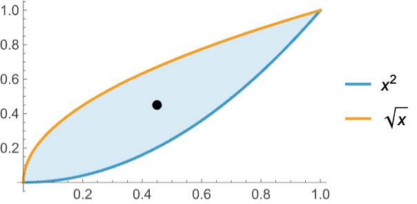
```

Model a DC-to-DC *buck-boost converter* from input voltage level `*vi*` to desired output voltage level `*vo*` using a pulse-width modulated feedback control `*q*[*t*]`:

$$
\text{[Graphics]}
$$

Use Kirchhoff's laws to get a model for the circuit above:

```wolfram
system={i'[t]==q[t]vi/l-(1-q[t])vo[t]/l ,vo'[t] ==i[t]/c -vo[t]/(r c),vo[0]==0,i[0]==0};
```

The control signal `*q*[*t*]` will switch the transistor on for a fraction `*vd*/(*vi*+*vd*)` of each period:

```wolfram
control={q[0]==1,WhenEvent[Mod[t,τ]==(vd/(vi+vd))τ,q[t]->0],WhenEvent[Mod[t,τ]==0,q[t]->1]};
```

Boost from a lower voltage `*vi*=24 to a higher voltage `*vd*=36:

```wolfram
pars={vi->24,vd->36,r->22,l->2 10^-2,c->4 10^-6,τ->5 10^-5};
```

```wolfram
sol=NDSolve[{system,control}/.pars,{vo,i,q},{t,0,.2}, DiscreteVariables->q];
```

```wolfram
{Plot[{vo[t]/.sol,vd/.pars},{t,0,.02}, PlotRange->All],Plot[q[t]/.sol,{t,0,.0004}]}
(* Output *)
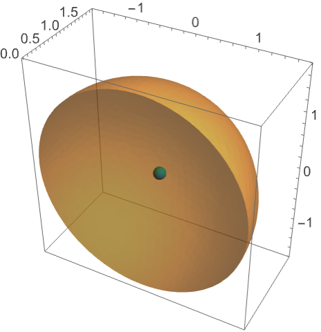
```

Buck from a higher voltage `*vi*=24 to a lower voltage `*vd*=16:

```wolfram
pars={vi->24,vd->16,r->22,l->2 10^-2,c->4 10^-6,τ->5 10^-5};
```

```wolfram
sol=NDSolve[{system,control}/.pars,{vo,i,q},{t,0,.2}, DiscreteVariables->q];
```

```wolfram
{Plot[{vo[t]/.sol,vd/.pars},{t,0,.02}, PlotRange->All],Plot[q[t]/.sol,{t,0,.0004}]}
(* Output *)
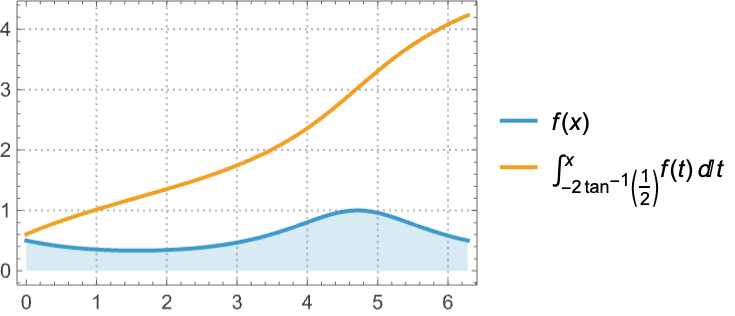
```

#### Hydraulic Systems

Model the change in height of water in two cylindrical tanks as water flows from one tank to another through a pipe:

$$
\text{[Graphics]}
$$

Use pressure relations $p=\rho g h$ and mass conservation:

```wolfram
pressureEqns={p1[t]== ρ g h1[t],p2[t]==ρ g h2[t]};
massConservation={a1 h1'[t]==-flowRate,a2 h2'[t]==flowRate};
```

Model the flow across the pipe with the Hagen-Poiseuille relation:

```wolfram
flowRate=(p1[t]-p2[t])(π pipeDia^4)/(128 μ pipeLen);
```

Simulate the system:

```wolfram
params={pipeLen->0.1,pipeDia->0.2,ρ->0.2,μ->2 10^-3,g->9.81};
{a1,a2}={1,1};
```

```wolfram
sol=NDSolve[{pressureEqns,massConservation,h1[0]==1,h2[0]==0}/.params,{h1,h2,p1,p2},{t,0,15}] ;
```

```wolfram
Plot[Evaluate[{h1[t],h2[t]}/.sol],{t,0,15}, PlotRange -> All]
```

*([Graphics])*

Model the second tank as a leaky tank:

```wolfram
massConservation={a1 h1'[t]==-flowRate,a2 h2'[t]==flowRate-a2 h2[t]/10};
```

```wolfram
sol=NDSolve[{pressureEqns,massConservation,h1[0]==1,h2[0]==0}/.params,{h1,h2,p1,p2},{t,0,80}] ;
```

Due to the leak in the second tank, both tanks will eventually drain out:

```wolfram
Plot[Evaluate[{h1[t],h2[t]}/.sol],{t,0,80}, PlotRange -> All,AxesOrigin -> {0,0}]
```

*([Graphics])*

Model the change in height of water in two hemispherical tanks as water flows from one tank to another through a pipe:

$$
\text{[Graphics]}
$$

```wolfram
pressureEqns={p1[t]== ρ g h1[t],p2[t]==ρ g h2[t]};
massConservation={a1 h1'[t]==-flowRate,a2 h2'[t]==flowRate};
```

```wolfram
flowRate=(p1[t]-p2[t])(π pipeDia^4)/(128 μ pipeLen);
params={pipeLen->0.1,pipeDia->0.2,ρ->0.2,μ->2 10^-3,g->9.81};
```

```wolfram
r1=1;r2=1;
hemisphereArea[r_,h_]:=Pi (2 r h-h^2);
a1=hemisphereArea[r1,h1[t]];
a2=hemisphereArea[r2,h2[t]];
```

```wolfram
sol2=NDSolve[{pressureEqns,massConservation,h1[0]==1,h2[0]==10^-5}/.params,{h1,h2,p1,p2},{t,0,15}] ;
```

```wolfram
Plot[Evaluate[{h1[t],h2[t]}/.sol2],{t,0,15},PlotRange->All]
```

*([Graphics])*

Model the change in height of water in three tanks such that one tank feeds water to the other tanks:

$$
\text{[Graphics]}
$$

```wolfram
pressureEqns={p1[t]==ρ g h1[t],p2[t]==ρ g h2[t],p3[t]==ρ g h3[t]};
massConservation={a1 h1'[t]==-flowRate,a2 h2'[t]==flowRate1,a3 h3'[t]==flowRate2};
```

Model the flow across the pipe with the Hagen-Poiseuille relation:

```wolfram
flowRate=(p1[t]-pB[t])(π pipeDia^4)/(128μ pipeLenB);
flowRate1=(pB[t]-p2[t])(π pipeDia^4)/(128μ pipeLen1);
flowRate2=(pB[t]-p3[t])(π pipeDia^4)/(128μ pipeLen2);
```

The flow rate from the first pipe will equal the sum of the flow rates in other two pipes:

```wolfram
flowRateConstraint=flowRate==flowRate1+flowRate2;
```

Simulate the system:

```wolfram
params={pipeLenB->0.1,pipeLen1->0.1,pipeLen2->0.2,pipeDia->.2,ρ->.2,μ->2 10^-3,g->9.81};
{a1,a2,a3}={1,1,1};
```

```wolfram
sol=NDSolve[{pressureEqns,massConservation,flowRateConstraint,h1[0]==1,h2[0]==0,h3[0]==0}/.params,{h1,h2,h3},{t,0,15}];
```

```wolfram
Plot[Evaluate[{h1[t],h2[t],h3[t]}/.sol],{t,0,15},PlotRange->All]
```

*([Graphics])*

Model the third tank as a leaky tank:

```wolfram
massConservation={a1 h1'[t]==-flowRate,a2 h2'[t]==flowRate1,a3 h3'[t]==flowRate2-a3 h3[t]/10};
```

```wolfram
sol=NDSolve[{pressureEqns,massConservation,flowRateConstraint,h1[0]==1,h2[0]==0,h3[0]==0}/.params,{h1,h2,h3},{t,0,90}] ;
```

The first two tanks reach equilibrium and then drain at the same rate:

```wolfram
Plot[Evaluate[{h1[t],h2[t],h3[t]}/.sol],{t,0,90},PlotRange->All]
```

*([Graphics])*

#### Chemical Systems

Model the kinetics of an autocatalytic reaction:

[Graphics]

The rate equations are given as:

```wolfram
{r1,r2,r3}={k1 a[t],k2 b[t]^2,k3 b[t] c[t]};
eqns={a'[t]==-r1+r3,b'[t]==r1-r2-r3};
```

The concentration of the species `a`, `b`, `c` should always be a constant:

```wolfram
eqEqn={a[t]+b[t]+c[t]==1};
icEqn={a[0]==1,b[0]==0,c[0]==0};
```

Solve and visualize the evolution of the three species:

```wolfram
params={k1->0.04,k2->3 10^7,k3->10^4};
sol=NDSolve[{eqns,eqEqn,icEqn}/.params,{a,b,c},{t,0,10^8}];
```

```wolfram
LogLinearPlot[Evaluate[#[t]/.sol],{t,10^-6,10^8}, PlotRange->All,PlotLabel->#[t]]& /@ {a,b,c}
(* Output *)
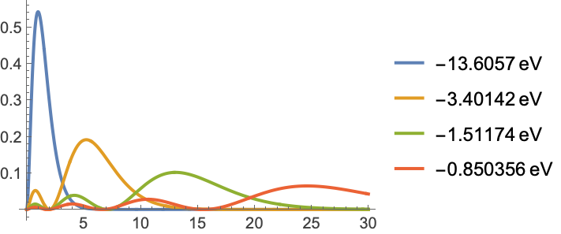
```

Model a chemical process of two species, FLB and ZHU, that are continuously mixed with carbon dioxide:

[Graphics]

The inflow of carbon dioxide per volume unit is denoted by:

```wolfram
Fin=klA (pCO2/H - CO2[t]);
```

The rate equations are given as:

```wolfram
r1=k1 FLB[t]^2CO2[t]^0.5;
r2=k2 FLBT[t] ZHU[t];
r3=(k2/KK)FLB[t] ZLA[t];
r4=k3 FLB[t]ZHU[t]^2 CO2[t];
r5=k4 FLBZHU[t]CO2[t]^0.5;
eqns={FLB'[t]==-2 r1+r2-r3-r4,CO2'[t]==-0.5 r1-r4-0.5r5+Fin,FLBT'[t]==r1-r2+r3,ZHU'[t]==-r2+r3-2 r4,ZLA'[t]==r2-r3+r5};
```

Equilibrium equation is given as:

```wolfram
eqEqn=Ks FLB[t] ZHU[t]==FLBZHU[t];
```

Solve the equations and determine the concentration change in `FLB`, `ZHU`, `CO2, and `ZLA`:

```wolfram
params={k1->18.7,k2->0.58,k3->0.09,k4->0.42,KK->34.4,klA->3.3,Ks->115.83,pCO2->0.9,H->737};
```

```wolfram
ic={FLB[0]==0.444,CO2[0]==0.00123,FLBT[0]==0,ZHU[0]==0.007,ZLA[0]==0};
```

```wolfram
sol=NDSolve[{eqns,eqEqn,ic}/.params,{FLB,ZHU,CO2,ZLA},{t,0,200}];
```

```wolfram
Plot[Evaluate[#[t]/.sol],{t,0,200}, PlotRange->All,PlotLabel->#[t]]& /@ {FLB,ZHU,CO2,ZLA}
(* Output *)
{[Graphics],[Graphics],[Graphics],[Graphics]}
```

### Properties & Relations

Symbolic versus numerical differential equation solving:

```wolfram
DSolve[{y''[x]+y[x]==Cos[x],y[0]==y'[0]==0},y,x]
(* Output *)
{{y->Function[{x},(1)/(4) (-2 Cos[x]+2 Cos[x]^3+2 x Sin[x]+Sin[x] Sin[2 x])]}}
```

```wolfram
NDSolve[{y''[x]+y[x]==Cos[x],y[0]==y'[0]==0},y,{x,0,20}]
(* Output *)
{{y->InterpolatingFunction[...]}}
```

```wolfram
Plot[Evaluate[y[x]/.%],{x,0,20}]
```

*([Graphics])*

The defining equation for [JacobiSN](https://reference.wolfram.com/language/ref/JacobiSN.html):

```wolfram
NDSolve[{y'[x]^2==(1-y[x]^2)(1- y[x]^2/2),y[0]==0},y,{x,0,1.5}]
(* Output *)
{{y->InterpolatingFunction[...]},{y->InterpolatingFunction[...]}}
```

```wolfram
Plot[Evaluate[y[x]/.%],{x,0,1.5}]
```

*([Graphics])*

```wolfram
Plot[JacobiSN[x,1/2],{x,0,1.5}]
```

*([Graphics])*

Numerically compute values of an integral at different points in an interval:

```wolfram
iv = Table[{x, NIntegrate[Sin[Exp[s]], {s, 0, x}]}, {x,0,3,.25}]
(* Output *)
{{0.,0.},{0.25,0.2259882299920528},{0.5,0.4730479976194906},{0.75,0.709540439767007},{1.,0.8749571987803856},{1.25,0.8879990172574581},{1.5,0.7120350249749674},{1.75,0.49508378585658475},{2.,0.5509351737392814},{2.25,0.7284694489767151},{2.5,0.5519902414453264},{2.75,0.6877455856287154},{3.,0.6061244734187705}}
```

For functions of the independent variable, [NDSolve](https://reference.wolfram.com/language/ref/NDSolve.html) effectively gives an indefinite integral:

```wolfram
sol = NDSolve[{y'[x] == Sin[Exp[x]],y[0] == 0},  y, {x, 0, 3}]
(* Output *)
{{y->InterpolatingFunction[...]}}
```

```wolfram
Plot[Evaluate[y[x] /. sol], {x,0,3}, Epilog->Map[Point, iv]]
```

*([Graphics])*

Finding an event is related to finding a root of a function of the solution:

```wolfram
ev[t_?NumberQ]:=First[y[t]/.NDSolve[{y''[x]+y[x]==0,y[0]==1,y'[0]==0},y,{x,t}]]
```

```wolfram
Plot[ev[t],{t,0,3}]
```

*([Graphics])*

```wolfram
FindRoot[ev[t],{t,1}]
(* Output *)
{t->1.570796364662529}
```

Event location finds the root accurately and efficiently:

```wolfram
NDSolve[{y''[x] + y[x] == 0, y[0] == 1, y'[0] == 0, WhenEvent[y[x]==0, "StopIntegration"]},y,{x, ∞}]
(* Output *)
{{y->InterpolatingFunction[...]}}
```

This gives $y(10)$ as a function of $y^{'}(0)$ for a differential equation:

```wolfram
y_10[yp0_?NumberQ] := First[y[10] /. NDSolve[{y''[x] + Sin[y[x]] == 0, y[0] == 1, y'[0] == yp0},y,{x,10}]]
```

```wolfram
Plot[y_10[y_0^′], {y_0^′, -2,2}]
```

*([Graphics])*

Find a root of $y_{10} (y_{0}^{'})=0$:

```wolfram
FindRoot[y_10[y_0^′] == 0, {y_0^′,-1.5}]
(* Output *)
{y->-1.5608322791016915}
```

Solve the equivalent boundary value problem:

```wolfram
Plot[Evaluate[{y[x], y'[x]} /. NDSolve[{y''[x] + Sin[y[x]] == 0, y[0] == 1,y[10] == 0}, y,x]],{x,0,10}]
```

*([Graphics])*

Use [NDSolve](https://reference.wolfram.com/language/ref/NDSolve.html) as a solver for a [SystemModel](https://reference.wolfram.com/language/ref/SystemModel.html):

```wolfram
sim=SystemModelSimulate[[Graphics],Method->"NDSolve"]
(* Output *)
SystemModelSimulationData[...]
```

Plot variables from the simulation result:

```wolfram
SystemModelPlot[sim,{y,z}]
(* Output *)
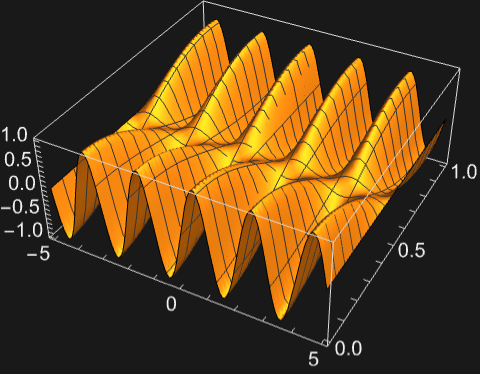
```

Use [SystemModel](https://reference.wolfram.com/language/ref/SystemModel.html) to model larger hierarchical models:

```wolfram
sim=SystemModelSimulate[[Graphics]]
(* Output *)
SystemModelSimulationData[...]
```

Plot the tank levels in the tank system over time:

```wolfram
SystemModelPlot[sim,{"tank1.h","tank2.h","tank3.h"},PlotRange->All]
(* Output *)
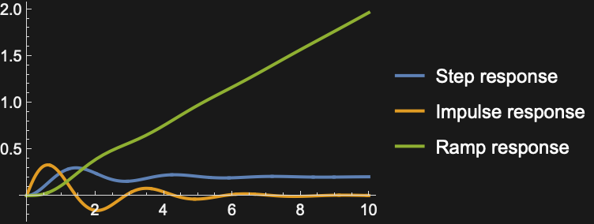
```

### Possible Issues

Many [NDSolve](https://reference.wolfram.com/language/ref/NDSolve.html) messages have specific message reference pages implemented. See how to access them in the [Understand Error Messages](https://reference.wolfram.com/language/workflow/UnderstandErrorMessages.html) workflow.

#### Numerical Error

The error tends to grow as you go further from the initial conditions:

```wolfram
NDSolve[{y''[x]+y[x]==0,y[0]==1,y'[0]==0},y,{x,0,100}]
(* Output *)
{{y->InterpolatingFunction[...]}}
```

Find the difference between numerical and exact solutions:

```wolfram
Plot[Evaluate[y[x]-Cos[x]/.%],{x,0,100}]
```

*([Graphics])*

Error for a nonlinear equation:

```wolfram
NDSolve[{y''[x]==y[x](y[x]^2-3/2),y[0]==0,y'[0]==1},y,{x,0,10}]
(* Output *)
{{y->InterpolatingFunction[...]}}
```

```wolfram
Plot[Evaluate[y[x]-JacobiSN[x,1/2]/.%],{x,0,10}]
```

*([Graphics])*

For high-order methods, the default interpolation may have large errors between steps:

```wolfram
sol = NDSolve[{y''[x]==y[x](y[x]^2-3/2),y[0]==0,y'[0]==1},y,{x,0,10},Method->{"ExplicitRungeKutta", "DifferenceOrder"->8}]
(* Output *)
{{y->InterpolatingFunction[...]}}
```

```wolfram
Plot[(y''[x] - y[x](y[x]^2-3/2)) /. sol, {x,0,10}, PlotRange->All]
```

*([Graphics])*

Interpolation with the order corresponding to the method reduces the error between steps:

```wolfram
dsol = NDSolve[{y''[x]==y[x](y[x]^2-3/2),y[0]==0,y'[0]==1},y,{x,0,10},Method->{"ExplicitRungeKutta", "DifferenceOrder"->8}, InterpolationOrder->All]
(* Output *)
{{y->InterpolatingFunction[...]}}
```

```wolfram
Plot[(y''[x] - y[x](y[x]^2-3/2)) /. dsol, {x,0,10}, PlotRange->All]
```

*([Graphics])*

Some of the algorithms the finite element method uses are not deterministic. This means some randomness is used during these algorithms and will result in slightly different results if the same input is run:

```wolfram
pdesolver:=First[u/.NDSolve[{Laplacian[u[x,y],{x,y}]+1==0,DirichletCondition[u[x,y]==0,True]},u,{x,0,1},{y,0,1}]]
```

Solve the same PDE twice. There can be a small difference in the solutions:

```wolfram
MinMax[pdesolver["ValuesOnGrid"]-pdesolver["ValuesOnGrid"]]
(* Output *)
{-6.245004513516506×10^-17,1.8041124150158794×10^-16}
```

#### Differential Algebraic Equations

[NDSolve](https://reference.wolfram.com/language/ref/NDSolve.html) cannot automatically handle systems of index greater than 1:

```wolfram
s=NDSolve[{x'''[t]+y[t]==Cos[t],x[t]==Sin[t],x[0]==0,x'[0]==1,x''[0]==0},{x,y},{t,0,2 Pi}]
(* Output *)
NDSolve
(* Output *)
{{x->InterpolatingFunction[...],y->InterpolatingFunction[...]}}
```

High-index systems can be solved by performing index reduction on the system:

```wolfram
s=NDSolve[{x'''[t]+y[t]==Cos[t],x[t]==Sin[t],x[0]==0,x'[0]==1,x''[0]==0},{x,y},{t,0,2 Pi},Method->{"IndexReduction"->Automatic}]
(* Output *)
{{x->InterpolatingFunction[...],y->InterpolatingFunction[...]}}
```

```wolfram
Plot[Evaluate[{x[t],y[t]}/.s],{t,0,2 Pi}]
```

*([Graphics])*

Here is a system of differential-algebraic equations:

```wolfram
DAE = {x_1^′[t]==x_3[t],x_2[t] (1-x_2[t])==0,x_1[t] x_2[t]+x_3[t] (1-x_2[t])==t};
```

Find the solution with $x_{1}^{'}(0)=1$:

```wolfram
sol = NDSolve[{DAE,x_1'[0]== 1},{x_1,x_2,x_3}, {t,0,1}]
(* Output *)
{{x_1->InterpolatingFunction[...],x_2->InterpolatingFunction[...],x_3->InterpolatingFunction[...]}}
```

[NDSolve](https://reference.wolfram.com/language/ref/NDSolve.html) may change the specified initial conditions if it cannot find the solution with $x_{1}^{'}(0)=0$:

```wolfram
sol = NDSolve[{DAE,x_1'[0]== 0},{x_1,x_2,x_3}, {t,0,1}]
(* Output *)
NDSolve
(* Output *)
{{x_1->InterpolatingFunction[...],x_2->InterpolatingFunction[...],x_3->InterpolatingFunction[...]}}
```

```wolfram
x_1'[0] /. sol
(* Output *)
{1.}
```

Change the initial starting guess for the iterations to avoid such issues:

```wolfram
sol = NDSolve[{DAE,x_1'[0]==0},{x_1,x_2,x_3},{t,0,1}, Method -> {"DAEInitialization" -> {"Collocation", "DefaultStartingValue" -> 0}}]
(* Output *)
{{x_1->InterpolatingFunction[...],x_2->InterpolatingFunction[...],x_3->InterpolatingFunction[...]}}
```

[NDSolve](https://reference.wolfram.com/language/ref/NDSolve.html) is limited to index 1, but the solution with $x_{2}(0)=1$ has index 2:

```wolfram
sol = NDSolve[{DAE,x_1[0] == 0, x_2[0]== 1, x_3[0] == 1},{x_1,x_2,x_3}, {t,0,1}]
(* Output *)
NDSolve
(* Output *)
NDSolve
(* Output *)
{{x_1->InterpolatingFunction[...],x_2->InterpolatingFunction[...],x_3->InterpolatingFunction[...]}}
```

To solve high-index systems, use index reduction to reduce the DAE to index 1:

```wolfram
sol = NDSolve[{DAE,x_1[0] == 0, x_2[0]== 1, x_3[0] == 1},{x_1,x_2,x_3}, {t,0,1}, Method -> {"IndexReduction" -> True,"DAEInitialization" -> "Collocation"}]
(* Output *)
{{x_1->InterpolatingFunction[...],x_2->InterpolatingFunction[...],x_3->InterpolatingFunction[...]}}
```

The default method may not be able to converge to the default tolerances:

```wolfram
s=100;
dae={x'[t]==-(xs[t]-ys[t]),y'[t]==(xs[t]-ys[t]),xs[t]==s x[t],ys[t]==s y[t],x[0]==1,y[0]==0,xs[0]==s,ys[0]==0};
```

```wolfram
NDSolve[dae,{x,y},{t,0,1}]
(* Output *)
NDSolve
(* Output *)
{{x->InterpolatingFunction[...],y->InterpolatingFunction[...]}}
```

With lower [AccuracyGoal](https://reference.wolfram.com/language/ref/AccuracyGoal.html) and [PrecisionGoal](https://reference.wolfram.com/language/ref/PrecisionGoal.html) settings, a solution is found:

```wolfram
NDSolve[dae,{x,y},{t,0,1},AccuracyGoal->6,PrecisionGoal->6]
(* Output *)
{{x->InterpolatingFunction[...],y->InterpolatingFunction[...]}}
```

The `"StateSpace"` time integration method can solve this with default tolerances:

```wolfram
NDSolve[dae,{x,y},{t,0,1},Method->{"TimeIntegration"->"StateSpace"}]
(* Output *)
{{x->InterpolatingFunction[...],y->InterpolatingFunction[...]}}
```

#### Partial Differential Equations

A large collection of PDE models from various fields with extensive explanation can found in the [PDE models overview](https://reference.wolfram.com/language/PDEModels/tutorial/PDEModelsOverview.html).

Define a nonlinear PDE:

```wolfram
L=20;
wpde={∂_t,tu[t,x]==∂_x,xu[t,x]+(1-u[t,x]^2) (1+2 u[t,x]),u[0,x]==ℯ^(-x^2),u^(1,0)[0,x]==0,u[t,-L]==u[t,L]};
```

The spatial discretization is based on the initial value, which varies less than the final value:

```wolfram
s1=NDSolve[wpde,u,{t,0,L},{x,-L,L}]
(* Output *)
NDSolve
(* Output *)
{{u->InterpolatingFunction[...]}}
```

By increasing the minimal number of spatial grid points, you can accurately compute the final value:

```wolfram
s2=NDSolve[wpde,u,{t,0,20},{x,-L,L},Method->{"PDEDiscretization"->{"MethodOfLines", "SpatialDiscretization"->{"TensorProductGrid", "MinPoints"->750}}}]
(* Output *)
{{u->InterpolatingFunction[]}}
```

The plot demonstrates the onset of a spatially more complex solution:

```wolfram
DensityPlot[Evaluate[u[-t,x]/.First[s2]],{x,-L,L},{t,0,-L},PlotPoints->50]
(* Output *)
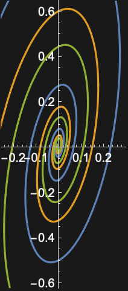
```

Define a heat equation with an initial value that is a step function:

```wolfram
hpde={D[u[t,x],t] ==  D[u[t,x],x,x], u[0,x] == UnitStep[1/2 - x], u[t,0] == 1, u[t,1] == 0};
```

Discontinuities in the initial value may result in too many spatial grid points:

```wolfram
Plot3D[Evaluate[u[t,x] /. NDSolve[hpde, u, {t,0,.01},{x,0,1}]],{x,0,1}, {t,0,.01}]
(* Output *)
NDSolve
(* Output *)
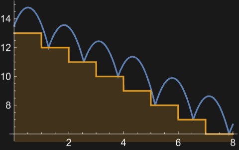
```

Setting the number of spatial grid points smaller results in essentially as good a solution:

```wolfram
Plot3D[Evaluate[u[t,x] /. NDSolve[hpde, u, {t,0,.01},{x,0,1}, Method->{"PDEDiscretization"->{"MethodOfLines", "SpatialDiscretization"->{"TensorProductGrid", "MaxPoints"->100}}}]],{x,0,1}, {t,0,.01}]
(* Output *)
NDSolve
(* Output *)
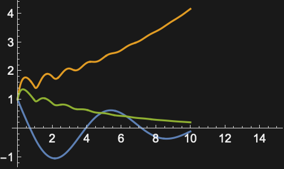
```

Define a Laplace equation with initial values:

```wolfram
lpde={D[u[x,y],x,x] + D[u[x,y],y,y] == 0, u[x,0] == Sin[Pi x], Derivative[0,1][u][x,0] == 0, u[0,y] == u[1,y] == 0};
```

The solver only works for equations well posed as initial value (Cauchy) problems:

```wolfram
sol = NDSolve[lpde,u,{x,0,1}, {y,0,1}]
(* Output *)
NDSolve
(* Output *)
{{u->InterpolatingFunction[...]}}
```

The ill-posedness shows up as numerical instability:

```wolfram
Plot3D[Evaluate[u[x,y] /. sol], {x,0,1}, {y, 0, 1}, PlotRange->All]
(* Output *)
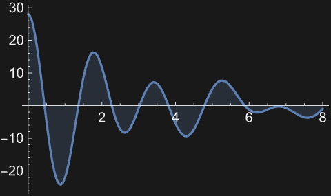
```

#### Boundary Value Problems

This finds a trivial solution of a boundary value problem:

```wolfram
Plot[Evaluate[{y[x], y'[x]} /. NDSolve[{y''[x] + Sin[y[x]] == 0, y[0] == 0,y[10] == 0}, y,x]],{x,0,10}]
```

*([Graphics])*

You can find other solutions by giving starting conditions for the solution search:

```wolfram
Table[Plot[Evaluate[{y[x], y'[x]} /. NDSolve[{y''[x] + Sin[y[x]] == 0, y[0] == 0,y[10] == 0}, y,x, Method->{"BoundaryValues"->{"Shooting", "StartingInitialConditions"->{y[0] == 0, y'[0] ==i}}}]],{x,0,10}],{i,1,2}]
(* Output *)
{[Graphics],[Graphics]}
```

#### Definitions for Unknown Functions

Definitions for an unknown function may affect the evaluation:

```wolfram
y[x_]:=Cos[x]
```

```wolfram
NDSolve[{y'[x]==0,y[0]==1},y,{x,0,1}]
(* Output *)
NDSolve
(* Output *)
NDSolve[{-Sin[x]==0,True},y,{x,0,1}]
```

Clearing the definition for the unknown function fixes the issue:

```wolfram
Clear[y]
```

```wolfram
NDSolve[{y'[x]==0,y[0]==1},y,{x,0,1}]
(* Output *)
{{y->InterpolatingFunction[...]}}
```

## Tech Notes ▪Numerical Differential Equations ▪Numerical Solution of Differential Equations ▪Advanced Numerical Differential Equation Solving in the Wolfram Language ▪Numerical Mathematics in the Wolfram Language ▪PDE Models Overview ▪Symbolic Solution of Differential Equations ▪Implementation notes: Numerical and Related Functions

## Related Guides ▪Equation Solving ▪Differential Equations ▪Partial Differential Equations ▪Solvers over Regions ▪Geometric Computation ▪Mesh-Based Geometric Regions ▪Systems Modeling ▪Symbolic Vectors, Matrices and Arrays ▪Physics & Chemistry: Data and Computation ▪Numerical Evaluation & Precision ▪Calculus ▪Differential Operators ▪Scientific Models ▪Life Sciences & Medicine: Data & Computation ▪Matrix Decompositions

## Related Links [NKS|Online](http://www.wolframscience.com/nks/search/?q=NDSolve) ([A New Kind of Science](http://www.wolframscience.com/nks/))

## History Introduced in 1991 (2.0) | Updated in 1996 (3.0) ▪ 2003 (5.0) ▪ 2007 (6.0) ▪ 2008 (7.0) ▪ 2012 (9.0) ▪ 2014 (10.0) ▪ 2019 (12.0)
