# NIntegrate | [SpanFromLeft]

> [NIntegrate](https://reference.wolfram.com/language/ref/NIntegrate.html)[*f*,{*x*,*x*_*min*,*x*_*max*}] — gives a numerical approximation to the integral $\int_{x_{\mathit{min}}}^{x_{\mathit{max}}} f d x$.
> [NIntegrate](https://reference.wolfram.com/language/ref/NIntegrate.html)[*f*,{*x*,*x*_*min*,*x*_*max*},{*y*,*y*_*min*,*y*_*max*},…]  — gives a numerical approximation to the multiple integral $\int_{x_{\mathit{min}}}^{x_{\mathit{max}}}d x \int_{y_{\mathit{min}}}^{y_{\mathit{max}}}d y \ldots f$.
> [NIntegrate](https://reference.wolfram.com/language/ref/NIntegrate.html)[*f*,{*x*,*y*,…}∈*reg*] — integrates over the geometric region `*reg*`.

## Details and Options

Multiple integrals use a variant of the standard iterator notation. The first variable given corresponds to the outermost integral and is done last.

[NIntegrate](https://reference.wolfram.com/language/ref/NIntegrate.html) by default tests for singularities at the boundaries of the integration region and at the boundaries of regions specified by settings for the [Exclusions](https://reference.wolfram.com/language/ref/Exclusions.html) option.

[NIntegrate](https://reference.wolfram.com/language/ref/NIntegrate.html)[*f*,{*x*,*x*_0,*x*_1,…,*x*_*k*}] tests for singularities in a one-dimensional integral at each of the intermediate points `*x*_*i*`. If there are no singularities, the result is equivalent to an integral from `*x*_0 to `*x*_*k*`. You can use complex numbers `*x*_*i*` to specify an integration contour in the complex plane.

The following options can be given:

| [AccuracyGoal](https://reference.wolfram.com/language/ref/AccuracyGoal.html) | [Infinity](https://reference.wolfram.com/language/ref/Infinity.html) | digits of absolute accuracy sought |
| --- | --- | --- |
| [EvaluationMonitor](https://reference.wolfram.com/language/ref/EvaluationMonitor.html) | [None](https://reference.wolfram.com/language/ref/None.html) | expression to evaluate whenever `*expr*` is evaluated |
| [Exclusions](https://reference.wolfram.com/language/ref/Exclusions.html) | [None](https://reference.wolfram.com/language/ref/None.html) | parts of the integration region to exclude |
| MaxPoints | [Automatic](https://reference.wolfram.com/language/ref/Automatic.html) | maximum total number of sample points |
| [MaxRecursion](https://reference.wolfram.com/language/ref/MaxRecursion.html) | [Automatic](https://reference.wolfram.com/language/ref/Automatic.html) | maximum number of recursive subdivisions |
| [Method](https://reference.wolfram.com/language/ref/Method.html) | [Automatic](https://reference.wolfram.com/language/ref/Automatic.html) | method to use |
| MinRecursion | 0 | minimum number of recursive subdivisions |
| [PrecisionGoal](https://reference.wolfram.com/language/ref/PrecisionGoal.html) | [Automatic](https://reference.wolfram.com/language/ref/Automatic.html) | digits of precision sought |
| [WorkingPrecision](https://reference.wolfram.com/language/ref/WorkingPrecision.html) | [MachinePrecision](https://reference.wolfram.com/language/ref/MachinePrecision.html) | the precision used in internal computations |

[NIntegrate](https://reference.wolfram.com/language/ref/NIntegrate.html) usually uses adaptive algorithms, which recursively subdivide the integration region as needed. `MinRecursion` specifies the minimum number of recursive subdivisions to try. [MaxRecursion](https://reference.wolfram.com/language/ref/MaxRecursion.html) gives the maximum number.

[NIntegrate](https://reference.wolfram.com/language/ref/NIntegrate.html) usually continues doing subdivisions until the error estimate it gets implies that the final result achieves either the [AccuracyGoal](https://reference.wolfram.com/language/ref/AccuracyGoal.html) or the [PrecisionGoal](https://reference.wolfram.com/language/ref/PrecisionGoal.html) specified.

For low-dimensional integrals, the default setting for [PrecisionGoal](https://reference.wolfram.com/language/ref/PrecisionGoal.html) is related to [WorkingPrecision](https://reference.wolfram.com/language/ref/WorkingPrecision.html). For high-dimensional integrals, it is typically taken to be a fixed value, usually `2

You should realize that with sufficiently pathological functions, the algorithms used by [NIntegrate](https://reference.wolfram.com/language/ref/NIntegrate.html) can give wrong answers. In most cases, you can test the answer by looking at its sensitivity to changes in the setting of options for [NIntegrate](https://reference.wolfram.com/language/ref/NIntegrate.html).

Possible explicit settings for the [Method](https://reference.wolfram.com/language/ref/Method.html) option include:

"GlobalAdaptive" | global adaptive integration strategy
"LocalAdaptive" | local adaptive integration strategy
"DoubleExponential" | double exponential quadrature
"MonteCarlo" | Monte Carlo integration
"AdaptiveMonteCarlo" | adaptive Monte Carlo integration
"QuasiMonteCarlo" | quasi Monte Carlo integration
"AdaptiveQuasiMonteCarlo" | adaptive quasi Monte Carlo integration

With [Method](https://reference.wolfram.com/language/ref/Method.html)->{"StyleBox[strategy, "TI"]",[Method](https://reference.wolfram.com/language/ref/Method.html)->"StyleBox[rule, "TI"]"} or [Method](https://reference.wolfram.com/language/ref/Method.html)->{"StyleBox[strategy, "TI"]",[Method](https://reference.wolfram.com/language/ref/Method.html)->{*rule*_1,*rule*_2,…}} possible strategy methods include:

"GlobalAdaptive" | subdivide based on global error estimates
"LocalAdaptive" | subdivide based only on local error estimates

Methods used as rules include:

"CartesianRule" | multidimensional product of rules
"ClenshawCurtisRule" | Clenshaw-Curtis rule
"GaussKronrodRule" | Gauss points with Kronrod extension
"LevinRule" | Levin-type oscillatory rules
"LobattoKronrodRule" | Gauss-Lobatto points with Kronrod extension
"MultidimensionalRule" | multidimensional symmetric rule
"MultipanelRule" | combination of 1D rules
"NewtonCotesRule" | Newton-Cotes rule
"RiemannRule" | Riemann sum rule
"TrapezoidalRule" | uniform points in one dimension

With the setting [Method](https://reference.wolfram.com/language/ref/Method.html)->"StyleBox[rule, "TI"]", the strategy method will be selected automatically.

Additional method suboptions can be given in the form [Method](https://reference.wolfram.com/language/ref/Method.html)->{…,*opts*}.

[NIntegrate](https://reference.wolfram.com/language/ref/NIntegrate.html) symbolically analyzes its input to transform oscillatory and other integrands, subdivide piecewise functions, and select optimal algorithms.

The method suboption `"SymbolicProcessing"` specifies the maximum number of seconds for which to attempt performing symbolic analysis of the integrand.

[N](https://reference.wolfram.com/language/ref/N.html)[[Integrate](https://reference.wolfram.com/language/ref/Integrate.html)[…]] calls [NIntegrate](https://reference.wolfram.com/language/ref/NIntegrate.html) for integrals that cannot be done symbolically.

[NIntegrate](https://reference.wolfram.com/language/ref/NIntegrate.html) first localizes the values of all variables, then evaluates `*f*` with the variables being symbolic, and then repeatedly evaluates the result numerically.

[NIntegrate](https://reference.wolfram.com/language/ref/NIntegrate.html) has attribute [HoldAll](https://reference.wolfram.com/language/ref/HoldAll.html) and effectively uses [Block](https://reference.wolfram.com/language/ref/Block.html) to localize variables.

## Examples

### Basic Examples

Compute a numerical integral:

```wolfram
NIntegrate[Sin[Sin[x]],{x,0,2}]
(* Output *)
1.2470560582440045
```

Compute a multidimensional integral (with singularity at the origin):

```wolfram
NIntegrate[(1)/(Sqrt[x^1+y^2+z^3]),{x,0,1},{y,0,1},{z,0,1}]
(* Output *)
1.0885005611188985
```

Compute areas and volumes for implicitly defined regions:

```wolfram
NIntegrate[Boole[1/4<=x^2+(2y)^2<=1&&y>x],{x,-1,1},{y,-1,1}]
(* Output *)
0.5890486132378816
```

```wolfram
RegionPlot[1/4<=x^2+(2y)^2<=1&&y>x,{x,-1,1},{y,-1,1}]
```

*([Graphics])*

Integrate over any region:

```wolfram
ℛ=ConvexHullMesh[RandomReal[1,{50,3}]]
```

*([Graphics3D])*

```wolfram
NIntegrate[x^2y^2z^2,{x,y,z}∈ℛ]
(* Output *)
0.012409408039979973
```

Integrate oscillatory and other complicated functions:

```wolfram
NIntegrate[(1)/(x)Cos[Log[x]/x],{x,0,1}]
(* Output *)
0.3233674295756092
```

```wolfram
Plot[(1)/(x)Cos[Log[x]/x],{x,0,1},PlotRange->15]
```

*([Graphics])*

### Scope

#### Basic Uses

Integrate functions over a finite real range:

```wolfram
NIntegrate[Exp[Exp[-x]],{x,0,5}]
(* Output *)
6.311152837456818
```

```wolfram
NIntegrate[x^x,{x,1,5}]
(* Output *)
1241.0332840494054
```

An infinite real range:

```wolfram
NIntegrate[(1)/(1+x^2),{x,0,∞}]
(* Output *)
1.570796326794894
```

```wolfram
NIntegrate[Exp[ⅈ x^2],{x,-∞,∞}]
(* Output *)
1.2533140768076687+1.2533141901656355 ⅈ
```

Get results at high precision:

```wolfram
NIntegrate[(1)/(1+Sqrt[x]),{x,0,1},PrecisionGoal->100,WorkingPrecision->200]
(* Output *)
0.61370563888010938116553575708364686384899973127948949175863998101321275606061056878827334600716262491599703795885862853262895952848373888593465849672984807613854988384502718906646349188763555174624320478215271014
```

Integrate along a complex line, finite or infinite:

```wolfram
NIntegrate[Sqrt[x],{x,I,3-I}]
(* Output *)
3.79213993471113-2.2113136245269387 ⅈ
```

```wolfram
NIntegrate[(Sinh[x])/(x),{x,0,I ∞}]
(* Output *)
-9.483638083064695×10^-14+1.5707963267964877 ⅈ
```

Along a piecewise linear contour in the complex plane:

```wolfram
NIntegrate[(1)/(z+1/2),{z,1,ℯ^((ⅈ π)/(3)),ℯ^((2 ⅈ π)/(3)),-1,ℯ^(-(2 ⅈ π)/(3)),ℯ^(-(ⅈ π)/(3)),1}]
(* Output *)
-1.1102230246251565×10^-16+6.283185307177492 ⅈ
```

Along a circular contour in the complex plane:

```wolfram
NIntegrate[(ⅈ Exp[ⅈ ω])/(Exp[ⅈ ω]+1/2),{ω,0,2π}]
(* Output *)
-1.1570744362643381×10^-12+6.2831853071794095 ⅈ
```

Plot the real part of a function and paths of integration:

```wolfram
lpath=Graphics@Arrow@({Re[#],Im[#]}&/@Exp[2π ⅈ/6 Range[0,6]]);
```

```wolfram
cpath=ParametricPlot[{Cos[θ],Sin[θ]},{θ,0,2π},Axes->None]/.Line->Arrow;
```

```wolfram
Show[DensityPlot[Re[(1)/(a+1/2+ⅈ b)],{a,-1.2,1.2},{b,-1.2,1.2}],lpath,cpath]
```

*([Graphics])*

Vector- and tensor-valued functions:

```wolfram
NIntegrate[{x,(1)/(Sqrt[x]),Sin[x]},{x,0,5}]
(* Output *)
{12.500000000000016,4.472135954999586,0.7163378145367736}
```

```wolfram
NIntegrate[({{x, Sqrt[x], x^(1/3)}, {Sqrt[x], x^(1/3), x^(1/4)}, {x^(1/3), x^(1/4), x^(1/5)}}),{x,0,5}]//MatrixForm
(* Output *)
({{12.500000000000016, 7.453559924999336, 6.412409800037647}, {7.453559924999336, 6.412409800037647, 5.981395124884907}, {6.412409800037647, 5.981395124884907, 5.748873589421756}})
```

Multivariate functions:

```wolfram
NIntegrate[(BesselJ[3,y])/(x+1),{x,0,5},{y,0,5}]
(* Output *)
1.9431032021532155
```

```wolfram
NIntegrate[Exp[-x+y],{x,0,∞},{y,0,1}]
(* Output *)
1.7182818217912892
```

The bounds for an integration variable can depend on the previous variables:

```wolfram
NIntegrate[Sin[5x y+y^2]+1,{x,-1,1},{y,-Sqrt[1-x^2],Sqrt[1-x^2]}]
(* Output *)
3.4367788544445332
```

Plot the integrand over the integration region:

```wolfram
Plot3D[Sin[5x y+y^2]+1,{x,-1,1},{y,-Sqrt[1-x^2],Sqrt[1-x^2]},Filling->0,Mesh->None]
```

*([Graphics3D])*

Integrate over regions defined by inequalities:

```wolfram
NIntegrate[Boole[x^2+2y^2+3z^2<1&&-1<x<y<z<1],{x,-∞,∞},{y,-∞,∞},{z,-∞,∞}]
(* Output *)
0.30132771363408317
```

Plot the integration region:

```wolfram
RegionPlot3D[x^2+2y^2+3z^2<1&&-1<x<y<z<1,{x,-1,1},{y,-1,1},{z,-1,1},Mesh->None,PlotPoints->50]
```

*([Graphics3D])*

Integrate over any geometric region including special regions:

```wolfram
NIntegrate[1,{x,y,z}∈Cone[]]
(* Output *)
2.0943950160977494
```

```wolfram
Graphics3D[Cone[]]
```

*([Graphics3D])*

Formula regions:

```wolfram
ℛ=ImplicitRegion[x^2+2y^2+3z^2<1&&-1<x<y<z<1,{x,y,z}];
```

```wolfram
NIntegrate[1,{x,y,z}∈ℛ]
(* Output *)
0.30132771363408317
```

Mesh regions:

```wolfram
ℛ=DelaunayMesh[RandomReal[1,{50,2}]]
```

*([Graphics])*

```wolfram
NIntegrate[1,{x,y}∈ℛ]
(* Output *)
0.6411444042838305
```

Find the volume of the unit ball in five dimensions:

```wolfram
NIntegrate[1,{x_1,x_2,x_3,x_4,x_5}∈Ball[5]]
(* Output *)
5.2637890373008505
```

The surface area of the standard cylinder, by computing a surface integral:

```wolfram
NIntegrate[1,{x,y,z}∈RegionBoundary[Cylinder[]]]
(* Output *)
18.849555929199745
```

The length of an ellipse, by computing a line integral:

```wolfram
NIntegrate[1,{x,y}∈Circle[{0,0},{2,1}]]
(* Output *)
9.688448220547714
```

Multivariate integrals using Monte Carlo methods:

```wolfram
NIntegrate[1/(1+∑_{i}^{100}x[i]^i),
Evaluate[Sequence@@Table[{x[i],0,1},{i,100}]]]
(* Output *)
0.2241840243973438
```

#### Singular Integrals

Integrate functions with algebraic singularities at the endpoints:

```wolfram
NIntegrate[{(1)/(Sqrt[x]),(1)/(x^(1/5)),(1)/(x^(4/5))},{x,0,1}]
(* Output *)
{2.000000000000003,1.2500000000000029,5.000000000000005}
```

```wolfram
NIntegrate[{(1)/(Sqrt[1-x]),(1)/((1-x)^(1/5)),(1)/((1-x)^(4/5))},{x,0,1}]
(* Output *)
{2.000000000000015,1.2500000000000033,5.000000000000479}
```

Plot over the integration range:

```wolfram
Table[Plot[f,{x,0,1},PlotLabel->Row[f,", "],Filling->Axis,PlotRange->{0,4}],{f,{{(1)/(Sqrt[x]),(1)/(x^(1/5)),(1)/(x^(4/5))},{(1)/(Sqrt[1-x]),(1)/((1-x)^(1/5)),(1)/((1-x)^(4/5))}}}]
(* Output *)
{[Graphics],[Graphics]}
```

Logarithmic singularities at endpoints:

```wolfram
NIntegrate[{Log[x],Log[Log[x]]},{x,0,1}]
(* Output *)
{-0.9999999999999977,-0.5772156649015308+3.1415926535898113 ⅈ}
```

```wolfram
NIntegrate[{Sqrt[Log[x]],Log[x]^2},{x,0,1}]
(* Output *)
{0.+0.8862269254527615 ⅈ,1.9999999999999927}
```

Plot over the integration range:

```wolfram
Table[Plot[f,{x,0,1},Filling->Axis,PlotLabel->Row[f,", "]],{f,{{Log[x],Re@Log[Log[x]]},{Im@Sqrt[Log[x]],Log[x]^2}}}]
(* Output *)
{[Graphics],[Graphics]}
```

Singularities at both endpoints:

```wolfram
NIntegrate[{(1)/(Sqrt[1-x] x^(1/5)),(1)/(Sqrt[1-x] x^(4/5)),(Log[2 x])/(Sqrt[1-x])},{x,0,1}]
(* Output *)
{2.299287818447987,6.268653124086057,0.1588830833596822}
```

Plot over the integration range:

```wolfram
Plot[{(1)/(Sqrt[1-x] x^(1/5)),(1)/(Sqrt[1-x] x^(4/5)),(Log[2 x])/(Sqrt[1-x])},{x,0,1}]
```

*([Graphics])*

Test for singularities interior to the integration region using [Exclusions](https://reference.wolfram.com/language/ref/Exclusions.html):

```wolfram
NIntegrate[(1)/(Sqrt[Sin[x]]),{x,0,10},Exclusions->Sin[x]==0]
(* Output *)
10.488230183119374-6.769465582609066 ⅈ
```

```wolfram
NIntegrate[Sqrt[Log[x-7]],{x,0,20},Exclusions->{7,8}]
(* Output *)
25.881678170702184+8.56065310746049 ⅈ
```

Plot over the integration range:

```wolfram
Table[Plot[{Re[f],Im[f]},{x,0,20},PlotLabel->Style[{Re[f],Im[f]},Small],Filling->Axis],{f,{(1)/(Sqrt[Sin[x]]),Sqrt[Log[x-7]]}}]
(* Output *)
{[Graphics],[Graphics]}
```

Multivariate integrals of functions with singularities at edges and corners:

```wolfram
NIntegrate[{(1)/(Sqrt[x]),Log[y],(Log[y])/(x^(4/5))},{x,0,1},{y,0,1}]
(* Output *)
{2.000000004027416,-1.0000000019073618,-4.999999984381157}
```

```wolfram
NIntegrate[{(1)/(Sqrt[x+y]),Log[x y]},{x,0,1},{y,0,1}]
(* Output *)
{1.1045695042415091,-1.9999999933008263}
```

Plot over the integration range:

```wolfram
Table[Plot3D[f,{x,0,1},{y,0,1},PlotLabel->f,PlotPoints->35,Mesh->None],{f,{(1)/(Sqrt[x]),Log[y],(Log[y])/(x^(4/5))}}]
(* Output *)
{[Graphics3D],[Graphics3D],[Graphics3D]}
```

Singularities at the corners of multidimensional integration regions:

```wolfram
NIntegrate[{(1)/(Sqrt[x+y]),Log[x+ y],(Log[x+y])/(Sqrt[1-x y])},{x,0,1},{y,0,1}]
(* Output *)
{1.1045695042415091,-0.11370563893353465,-0.0341229292405495}
```

Plot over the integration range:

```wolfram
Table[Plot3D[f,{x,0,1},{y,0,1},PlotLabel->f,Mesh->None],{f,{(1)/(Sqrt[x+y]),Log[x+ y],(Log[Sqrt[x+y]])/(Sqrt[1-x y])}}]
(* Output *)
{[Graphics3D],[Graphics3D],[Graphics3D]}
```

Multivariate integral with a singularity at an interior point:

```wolfram
NIntegrate[Log[2-Sin[x]-Sin[y]],{x,0,4},{y,0,4},Exclusions->{{(π)/(2),(π)/(2)}}]
(* Output *)
-2.41907689141434
```

Several interior point singularities:

```wolfram
pl=RandomReal[{0,4},{10,2}];
f=Sum[1/Norm[{x,y}-p],{p,pl}];
```

```wolfram
NIntegrate[f,{x,0,4},{y,0,4},Exclusions->pl]//Quiet
(* Output *)
120.56982417209801
```

Plot over the integration range:

```wolfram
Table[Plot3D[g,{x,0,4},{y,0,4},Mesh->None,PlotStyle->Yellow],{g,{Log[2-Sin[x]-Sin[y]],f}}]
(* Output *)
{[Graphics3D],[Graphics3D]}
```

Multivariate integral of a function that is singular at curves satisfying an equation:

```wolfram
NIntegrate[(1)/(Sqrt[Cos[x y]]),{x,0,5},{y,0,5},Exclusions->Cos[x y]==0]
(* Output *)
21.53813688691868-19.535698616152068 ⅈ
```

Plot over the integration range:

```wolfram
Plot3D[{Re[(1)/(Sqrt[Cos[x y]])],Im[(1)/(Sqrt[Cos[x y]])]},{x,0,5},{y,0,5},Exclusions->Cos[x y]==0,Mesh->None,PlotStyle->{Yellow,Magenta},PlotPoints->35]
(* Output *)
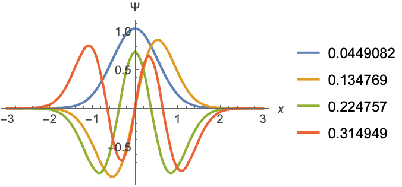
```

Cauchy principal value of functions with non-integrable singularities:

```wolfram
NIntegrate[(1)/(x-x^2),{x,-1,2},Method->"PrincipalValue",Exclusions->x-x^2==0]
(* Output *)
1.3862943611192309
```

```wolfram
NIntegrate[(1)/(Log[x]),{x,0,10},Method->"PrincipalValue",Exclusions->1]
(* Output *)
6.16559950480432
```

#### Piecewise Integrals

Piecewise functions with finitely many cases:

```wolfram
NIntegrate[UnitStep[(x-1)(x-2)(x-5)(x-6)],{x,0,10}]
(* Output *)
8.000000000000009
```

```wolfram
NIntegrate[Boole[(x-1)(x-2)<=(x-5)(x-6)],{x,0,10}]
(* Output *)
3.500000000000004
```

```wolfram
NIntegrate[Min[(x-1)(x-3),(x-5)(x-7)],{x,0,10}]
(* Output *)
19.333333333333393
```

```wolfram
Table[Plot[f,{x,0,10},Filling->Axis,PlotLabel->Style[f,Small]],{f,{UnitStep[(x-1)(x-2)(x-5)(x-6)],Boole[(x-1)(x-2)<=(x-5)(x-6)],Min[(x-1)(x-3),(x-5)(x-7)]}}]
(* Output *)
{[Graphics],[Graphics],[Graphics]}
```

Piecewise functions with infinitely many cases:

```wolfram
NIntegrate[Floor[x^2],{x,0,5}]
(* Output *)
39.3662197249219
```

```wolfram
NIntegrate[FractionalPart[x],{x,0,5}]
(* Output *)
2.5000000000000027
```

```wolfram
NIntegrate[PrimePi[x^2],{x,0,5}]
(* Output *)
16.771904183203223
```

```wolfram
Table[Plot[f,{x,0,5},Filling->Axis,PlotLabel->Style[f,Small],PlotPoints->100],{f,{Floor[x^2],FractionalPart[x],PrimePi[x^2]}}]
(* Output *)
{[Graphics],[Graphics],[Graphics]}
```

Composition with any other function:

```wolfram
NIntegrate[Exp[UnitStep[(x-1)(x-2)(x-5)]],{x,0,10}]
(* Output *)
20.309690970754293
```

```wolfram
NIntegrate[Sin[Min[(x-1),(x-5)(x-7)]],{x,0,10}]
(* Output *)
2.1689595191060453
```

```wolfram
NIntegrate[BesselJ[2,FractionalPart[x]],{x,0,10}]
(* Output *)
0.39629238599893263
```

```wolfram
Table[Plot[f,{x,0,5},Filling->Axis,PlotLabel->Style[f,Small],PlotPoints->100],{f,{Exp[UnitStep[(x-1)(x-2)(x-5)]],Sin[Min[(x-1),(x-5)(x-7)]],BesselJ[2,FractionalPart[x]]}}]
(* Output *)
{[Graphics],[Graphics],[Graphics]}
```

Use [Exclusions](https://reference.wolfram.com/language/ref/Exclusions.html) to explicitly specify discontinuities or sharp corners:

```wolfram
NIntegrate[{Log[-3+ⅈ x],Sqrt[-1+ⅈ x]},{x,-2,3},Exclusions->{0}]
(* Output *)
{6.020709295140845+2.4495369711445445 ⅈ,2.6513350744828457+1.3582889377505403 ⅈ}
```

```wolfram
NIntegrate[{Re[EllipticF[x,2]],Im[EllipticF[x,2]]},{x,-2,3},Exclusions->Csc[x]^2==2]
(* Output *)
{1.8040988882992464,-2.4208948071351646}
```

Plot over the integration range:

```wolfram
Table[Plot[f,{x,-2,3},Filling->Axis,PlotLabel->Row[f,", "]],{f,{{Im[Log[-3+ⅈ x]],Im[Sqrt[-1+ⅈ x]]},{Re[EllipticF[x,2]],Im[EllipticF[x,2]]}}}]
(* Output *)
{[Graphics],[Graphics]}
```

Multivariate piecewise integrals with finitely many cases:

```wolfram
NIntegrate[Max[ x y^2,x^2y],{x,-2,2},{y,-2,2}]
(* Output *)
12.799999999999997
```

```wolfram
NIntegrate[Max[Abs[x^2-y],Abs[x-y^2]],{x,-2,2},{y,-2,2}]
(* Output *)
35.767699098449086-3.269229368127778×10^-32 ⅈ
```

```wolfram
NIntegrate[x y Floor[x y],{x,-2,2},{y,-2,2}]
(* Output *)
28.503956553151042
```

```wolfram
Table[Plot3D[f,{x,-2,2},{y,-2,2},PlotPoints->35,Mesh->None,ExclusionsStyle->{None,Red},PlotLabel->f],{f,{Max[ x y^2,x^2y],Max[ Abs[ x^2 -y], Abs[x-y^2]],x y Floor[x y]}}]
(* Output *)
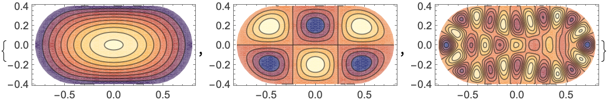
```

Explicitly specify discontinuities and sharp corners:

```wolfram
NIntegrate[Sqrt[x+ⅈ y],{x,-2,2},{y,-2,2},Exclusions->y==0]
(* Output *)
12.392427154032804-2.6645352591003757×10^-15 ⅈ
```

Plot real and imaginary parts over the region:

```wolfram
Plot3D[{Re[Sqrt[x+ⅈ y]],Im[Sqrt[x+ⅈ y]]},{x,-2,2},{y,-2,2},Mesh->None,ExclusionsStyle->{None,Red},PlotStyle->{Lighter[Purple,0.5],White}]
```

*([Graphics3D])*

Integrate over 2D regions:

```wolfram
NIntegrate[Boole[x<=2y+1&&y>x-1],{x,-2,2},{y,-2,2}]
(* Output *)
9.75
```

```wolfram
NIntegrate[Boole[x^2+y^2<1],{x,-2,2},{y,-2,2}]
(* Output *)
3.1415926509824335
```

```wolfram
NIntegrate[Boole[1/4<=x^2+y^2<=1&&y>=0&&y>=-x],{x,-2,2},{y,-2,2}]
(* Output *)
0.8835729336790225
```

```wolfram
Table[RegionPlot[r,{x,-2,2},{y,-2,2},PlotLabel->Style[r,Small]],{r,{x<=2y+1&&y>x-1,x^2+y^2<1,1/4<=x^2+y^2<=1&&y>=0&&y>=-x}}]
(* Output *)
{[Graphics],[Graphics],[Graphics]}
```

Integrate over 3D regions:

```wolfram
NIntegrate[Boole[x<=2y+3z+1&&y>x-z],{x,-2,2},{y,-2,2},{z,-2,2}]
(* Output *)
29.861111111111107
```

```wolfram
NIntegrate[Boole[x^2+2y^2+z^2<=1],{x,-2,2},{y,-2,2},{z,-2,2}]
(* Output *)
2.961921955957402
```

```wolfram
NIntegrate[(2x^2+3y^2) Boole[x^2+y^2+z^2<=1&&3x^2+3y^2<=z^2], {x,-1,1} ,{y,-1,1}, {z,-1,1}]
(* Output *)
0.10774163479742023
```

```wolfram
Table[RegionPlot3D[r,{x,-1,1},{y,-1,1},{z,-1,1},PlotLabel->r],{r,{x<=2y+3z+1&&y>x-z,x^2+2y^2+z^2<=1,x^2+y^2+z^2<=1&&3x^2+3y^2<=z^2}}]
(* Output *)
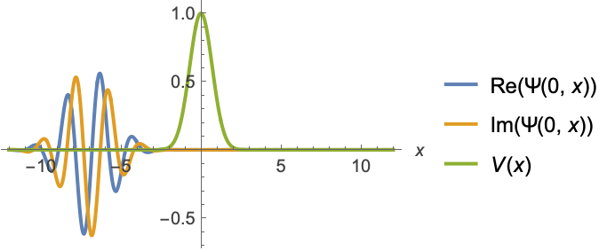
```

Integrate over $n$-dimensional regions:

```wolfram
NIntegrate[Boole[x<=2y+3z+w+1&&y>x-z+w],{x,-2,2},{y,-2,2},{z,-2,2},{w,-2,2}]
(* Output *)
101.42013888888887
```

```wolfram
NIntegrate[Boole[x^2+y^2+z^2+w^2<=1],{x,-2,2},{y,-2,2},{z,-2,2},{w,-2,2}]
(* Output *)
4.934802283564913
```

#### Oscillatory Integrals

Integrating a highly oscillatory elementary function over a finite range:

```wolfram
NIntegrate[{Cos[x],Sin[x]},{x,1,10^4}]
(* Output *)
{-1.147085373696145,1.4924576741271522}
```

```wolfram
NIntegrate[{Exp[x ⅈ],2^(x ⅈ)},{x,1,10^4}]
(* Output *)
{-1.1470853736961484+1.4924576741271547 ⅈ,0.3757442557929067+0.4791586221547359 ⅈ}
```

Plot over $\frac{1}{100}$ the range:

```wolfram
Table[Plot[f,{x,1,100},PlotLabel->f],{f,{{Cos[x],Sin[x]},Im@{Exp[x ⅈ],2^(x ⅈ)}}}]
(* Output *)
{[Graphics],[Graphics]}
```

Highly oscillatory special functions:

```wolfram
NIntegrate[{BesselJ[1,x],BesselY[2,x]},{x,1,10^4}]
(* Output *)
{0.772293846911345,-0.932452973597199}
```

```wolfram
NIntegrate[{BesselI[1,x ⅈ],BesselK[2,x ⅈ]},{x,1,10^4}]
(* Output *)
{1.469487575124191×10^-17+0.7722938469113467 ⅈ,-1.4646937058354577+1.5028185767244888 ⅈ}
```

```wolfram
NIntegrate[{AiryAi[-x],AiryBi[-x]/Sqrt[x]},{x,0,10^4}]
(* Output *)
{0.6671617418978015,0.6285846184518259}
```

```wolfram
NIntegrate[{SinIntegral[x],CosIntegral[x]},{x,1,10^4}]
(* Output *)
{15706.476913116268,0.5041622835509028}
```

```wolfram
NIntegrate[{FresnelC[x/10],FresnelS[x/10]},{x,0,10^4}]
(* Output *)
{5000.000168166001,4996.817072852491}
```

Plot over $\frac{1}{100}$ the range:

```wolfram
Table[Plot[f,{x,1,100},PlotLabel->Row[f,","]],{f,{{BesselJ[1,x],BesselY[2,x]},Im@{BesselI[1,x ⅈ],BesselK[2,x ⅈ]},{AiryAi[-x],AiryBi[-x]/Sqrt[x]},{SinIntegral[x],CosIntegral[x]},{FresnelC[x/10],FresnelS[x/10]}}}]
(* Output *)
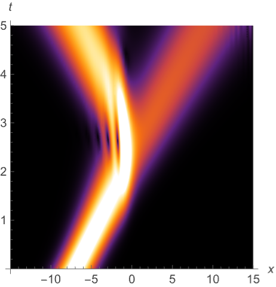
```

Integrate oscillatory functions over an infinite range:

```wolfram
NIntegrate[{Cos[x],Sin[x]}Exp[-x^2],{x,1,∞}]
(* Output *)
{0.034019864716817894,0.12973820736901592}
```

```wolfram
NIntegrate[{Exp[x ⅈ],2^(x ⅈ)}Exp[-x^2],{x,1,∞}]
(* Output *)
{0.03401986079007078+0.1297382012528925 ⅈ,0.08366172067926915+0.1082610651090497 ⅈ}
```

Oscillatory special functions over an infinite range:

```wolfram
NIntegrate[{BesselJ[1,x],BesselY[2,x]},{x,1,∞}]
(* Output *)
{0.7651976865599586,-0.925356265991774}
```

```wolfram
NIntegrate[{BesselI[1,x ⅈ],BesselK[2,x ⅈ]},{x,1,∞}]
(* Output *)
{0.+0.7651976865598564 ⅈ,-1.4535462236145547+1.5085468643752766 ⅈ}
```

```wolfram
NIntegrate[{AiryAi[-x],AiryBi[-x]},{x,1,∞}]
(* Output *)
{0.20099268096571427,-0.3730050095174372}
```

Sums of oscillatory functions:

```wolfram
NIntegrate[Sin[Sqrt[2]x]+Sin[Sqrt[3]x]+Sin[Sqrt[5]x],{x,1,10^4}]
(* Output *)
-0.25407646061252964
```

```wolfram
NIntegrate[BesselJ[1,x]+FresnelS[x/10],{x,1,10^4}]
(* Output *)
4997.588968663066
```

Plot over $\frac{1}{100}$ the range:

```wolfram
Table[Plot[f,{x,1,100},PlotLabel->Style[f,Small]],{f,{Sin[Sqrt[2]x]+Sin[Sqrt[3]x]+Sin[Sqrt[5]x],BesselJ[1,x]+FresnelS[x/10]}}]
(* Output *)
{[Graphics],[Graphics]}
```

Products of oscillatory functions:

```wolfram
NIntegrate[Sin[Sqrt[2]x]Sin[Sqrt[3]x]Sin[Sqrt[5]x],{x,1,10^4}]
(* Output *)
0.13467278340802133
```

```wolfram
NIntegrate[BesselJ[1,x]BesselJ[2,Sqrt[2]x],{x,1,10^4}]
(* Output *)
0.4742941283510517
```

Plot over $\frac{1}{100}$ the range:

```wolfram
Table[Plot[f,{x,1,100},PlotLabel->Style[f,Small]],{f,{Sin[Sqrt[2]x]Sin[Sqrt[3]x]Sin[Sqrt[5]x],BesselJ[1,x]BesselJ[2,Sqrt[2]x]}}]
(* Output *)
{[Graphics],[Graphics]}
```

Powers of oscillatory functions:

```wolfram
NIntegrate[BesselJ[2,Sqrt[2]x]^2,{x,1,10^4}]
(* Output *)
2.138976585908787
```

```wolfram
NIntegrate[(Sin[Sqrt[2]x]Sin[Sqrt[3]x])^3,{x,1,10^4}]
(* Output *)
-1.0454081930992385
```

Plot over $\frac{1}{100}$ the range:

```wolfram
Table[Plot[f,{x,1,100},PlotLabel->Style[f,Small]],{f,{BesselJ[2,Sqrt[2]x]^2,(Sin[Sqrt[2]x]Sin[Sqrt[3]x])^3}}]
(* Output *)
{[Graphics],[Graphics]}
```

Compositions of oscillatory functions with non-oscillatory ones:

```wolfram
NIntegrate[Sin[(1)/((5x-1)(5x-2)(5x-3))],{x,0,1}]
(* Output *)
0.0169585188442759
```

```wolfram
NIntegrate[BesselJ[3/7,(Log[x])/(x)],{x,0,1}]
(* Output *)
0.0660301752764733+0.28929710018172966 ⅈ
```

Plot over the integration range:

```wolfram
Table[Plot[f,{x,0,1},PlotLabel->f],{f,{Sin[(1)/((5x-1)(5x-2)(5x-3))],Re[BesselJ[3/7,(Log[x])/(x)]]}}]
(* Output *)
{[Graphics],[Graphics]}
```

Sums, products, powers, and compositions of oscillatory functions:

```wolfram
NIntegrate[BesselY[2/3,x]Sin[x+Sqrt[x]]^4,{x,0,10^4}]
(* Output *)
-0.38705083918213545
```

```wolfram
NIntegrate[Sin[x] (Sin[x^2] (Sin[x^3]+(1)/(x))+(1)/(x)),{x,0,∞}]
(* Output *)
2.438791508066627
```

Plot over part of the integration range:

```wolfram
Table[Plot[f,{x,0,20},PlotLabel->Style[f,Small]],{f,{BesselY[2/3,x]Sin[x+Sqrt[x]]^4,Sin[x] ((1)/(x)+Sin[x^2] ((1)/(x)+Sin[x^3]))}}]
(* Output *)
{[Graphics],[Graphics]}
```

Multivariate integrals of highly oscillatory elementary functions over a finite range:

```wolfram
NIntegrate[{Sin[x]Cos[y],Sin[x+y]},{x,1,10^4},{y,1,10^4}]
(* Output *)
{-1.7119763688518317,-3.423952737703663}
```

```wolfram
NIntegrate[{Exp[ⅈ(x+y)],2^(ⅈ x y)},{x,1,10^4},{y,1,10^4}]
(* Output *)
{-0.9116250545134104-3.4239527377036683 ⅈ,-1.2923083159582895-0.13375084321687997 ⅈ}
```

Plot over one millionth of the range:

```wolfram
ParallelTable[Plot3D[f,{x,1,10},{y,1,10},PlotLabel->f,Mesh->False,PlotPoints->50],{f,{Sin[x]Cos[y],Sin[x+y],Re[Exp[ⅈ(x+y)]],Re[2^(ⅈ x y)]}}]
(* Output *)
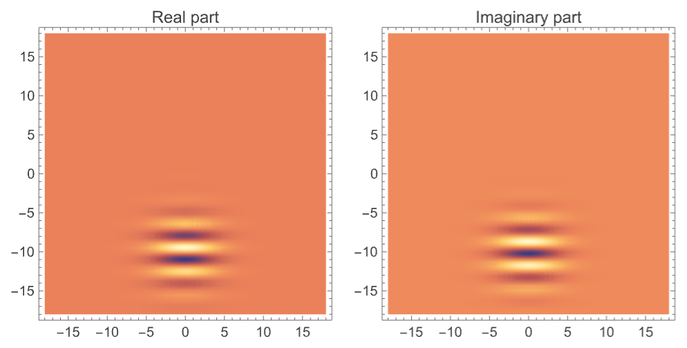
```

Multivariate integrals of oscillatory special functions over a finite range:

```wolfram
NIntegrate[{BesselJ[1,x]BesselY[2,y],BesselJ[3,x+y]},{x,10^4,2 10^4},{y,10^4,2 10^4}]
(* Output *)
{-0.00016033747487356745,0.0021835543446967662}
```

```wolfram
NIntegrate[{BesselI[1,x ⅈ]BesselK[2,y ⅈ],BesselI[3,ⅈ(x+y)]},{x,10^4,2 10^4},{y,10^4,2 10^4}]
(* Output *)
{0.00009087122246703922-0.0002518575165789955 ⅈ,-5.038725795352576×10^-17-0.0021835543446658513 ⅈ}
```

Multivariate oscillatory functions over an infinite range:

```wolfram
NIntegrate[{(Sin[x+y])/(1+x^4+y^4),(Sin[x]+Cos[y])/(1+x^4+y^4)},{x,0,∞},{y,0,∞}]
(* Output *)
{0.887680189149367,1.6074856378619184}
```

```wolfram
NIntegrate[Exp[ⅈ(x^2+y^2)],{x,-∞,∞},{y,-∞,∞},PrecisionGoal->5]//Quiet
(* Output *)
-1.3458767988971942×10^-9+3.1415926517101873 ⅈ
```

```wolfram
NIntegrate[(BesselY[1,x+y])/(x^4+y^4),{x,1,∞},{y,1,∞}]
(* Output *)
0.04294297863546234
```

```wolfram
NIntegrate[Sin[Exp[x]+y^2],{x,0,∞},{y,0,∞}]
(* Output *)
0.47093985716412573
```

Singular oscillatory functions:

```wolfram
NIntegrate[{(1)/(Sqrt[x])+Cos[x],(1)/(Sqrt[x])+BesselY[0,x]},{x,0,5000}]
(* Output *)
{140.43338979854275,141.42800613300273}
```

```wolfram
NIntegrate[{(Sin[x])/(Sqrt[x]),(BesselJ[1,x])/(Sqrt[x])},{x,0,5000}]
(* Output *)
{1.2511281929995322,0.9560716386985533}
```

Plot over $\frac{1}{10}$ the range:

```wolfram
Table[Plot[f,{x,0,500},PlotLabel->f],{f,{{(1)/(Sqrt[x])+Cos[x],(1)/(Sqrt[x])+BesselY[0,x]},{(Cos[x])/(Sqrt[x]),(BesselJ[1,x])/(Sqrt[x])}}}]
(* Output *)
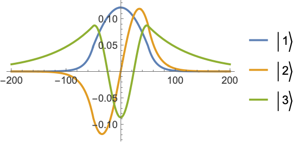
```

Composition of oscillatory functions with singular ones:

```wolfram
NIntegrate[{Sin[10^3Sqrt[x]],AiryAi[10Log[x]]},{x,0,1}]
(* Output *)
{-0.0011231043935003445,0.06392250546647643}
```

```wolfram
NIntegrate[{Sin[(1)/(x)]Cos[(1)/(1-x)],(BesselJ[1,1/x])/(x)},{x,0,1}]
(* Output *)
{-0.2102824688598899,0.5203201756559767}
```

Plot over the integration range:

```wolfram
Table[Plot[f,{x,0,1},PlotLabel->f],{f,{{Sin[10^3Sqrt[x]],AiryAi[10Log[x]]},{Sin[(1)/(x)]Cos[(1)/(1-x)],(BesselJ[1,1/x])/(x)}}}]
(* Output *)
{[Graphics],[Graphics]}
```

Piecewise oscillatory functions:

```wolfram
NIntegrate[FractionalPart[x^2]Sin[10^4x],{x,0,3}]
(* Output *)
0.00020225550175853124
```

```wolfram
NIntegrate[Round[x] AiryAi[-10^4 TriangleWave[x]^2],{x,0,3}]
(* Output *)
0.024496667106272005
```

Plot at $\frac{1}{100}$ the oscillation rate:

```wolfram
Table[Plot[f,{x,0,3},PlotLabel->f],{f,{FractionalPart[x^2]Sin[10^2x], x AiryAi[-10^2TriangleWave[x]^2]}}]
(* Output *)
{[Graphics],[Graphics]}
```

Piecewise oscillatory functions with singularities:

```wolfram
NIntegrate[Cos[(x)/(FractionalPart[x])],{x,-2,3}]
(* Output *)
-0.09965926057938226
```

```wolfram
NIntegrate[(Sin[10^2x^4])/(Sqrt[x-Floor[x]]),{x,-2,3},MaxRecursion->20]
(* Output *)
0.2372235530969064
```

Plot over the integration range:

```wolfram
Table[Plot[f,{x,-2,3},PlotLabel->f],{f,{Cos[(x)/(FractionalPart[x])],(Sin[10^2x^4])/(Sqrt[x-Floor[x]])}}]
(* Output *)
{[Graphics],[Graphics]}
```

#### Region Integrals

Different ways of integrating over a unit disk:

```wolfram
NIntegrate[Boole[x^2+y^2<1],{x,-1,1},{y,-1,1}]
(* Output *)
3.1415926509824335
```

```wolfram
NIntegrate[1,{x,y}∈Disk[]]
(* Output *)
3.1415926509824335
```

Visualize the integrand over the region:

```wolfram
Plot3D[{1,0},{x,y}∈Disk[]]
```

*([Graphics3D])*

More general integral over a unit disk:

```wolfram
NIntegrate[Abs[Sqrt[x]]Boole[x^2+y^2<1],{x,-1,1},{y,-1,1}]
(* Output *)
1.9170243735957682
```

```wolfram
NIntegrate[Abs[Sqrt[x]],{x,y}∈Disk[]]
(* Output *)
1.9170243735957682
```

Visualize the integrand over the region:

```wolfram
Plot3D[{Abs[Sqrt[x]],0},{x,y}∈Disk[]]
(* Output *)
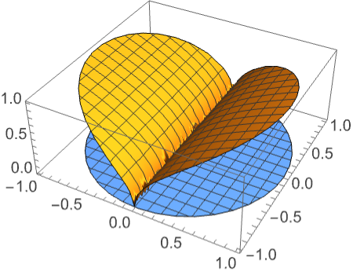
```

Integration over a 0D region corresponds to summing over the points:

```wolfram
NIntegrate[x,x∈Point[{{2},{3}}]]
(* Output *)
5.
```

```wolfram
NIntegrate[{x,y},{x,y}∈Point[{{1,2},{3,4}}]]
(* Output *)
{4.,6.}
```

```wolfram
NIntegrate[{x,y,z},{x,y,z}∈Point[{{1,2,3},{4,5,6}}]]
(* Output *)
{5.,7.,9.}
```

Integration over a 1D region corresponds to a curve integral:

```wolfram
NIntegrate[1,{x,y}∈Circle[]]
(* Output *)
6.283185307179616
```

```wolfram
NIntegrate[1,{x,y,z}∈ImplicitRegion[x^2+y^2==1&&z==0,{x,y,z}]]
(* Output *)
6.283185307179616
```

Integration over a 2D region corresponds to a surface integral:

```wolfram
NIntegrate[1,{x,y,z}∈Sphere[]]
(* Output *)
12.56637054569839
```

In general, integrals over lower-dimensional regions correspond to surface integrals:

```wolfram
NIntegrate[1,{x,y,z,w}∈Sphere[{0,0,0,0},1]]
(* Output *)
19.739208790327172
```

The region is lower dimensional:

```wolfram
RegionDimension[Sphere[{0,0,0,0},1]]<RegionEmbeddingDimension[Sphere[{0,0,0,0},1]]
(* Output *)
True
```

Integrate over any basic region including a filled parallelogram:

```wolfram
NIntegrate[Sin[x]Cos[y], {x,y}∈Parallelogram[]]
(* Output *)
0.6322609479249215
```

```wolfram
Graphics[{LightBlue,Parallelogram[]},ImageSize->Tiny]
```

*([Graphics])*

A filled cone:

```wolfram
NIntegrate[x ^2+y z ,{x,y,z}∈Cone[]]
(* Output *)
0.31415927085102996
```

```wolfram
Graphics3D[Cone[],ImageSize->Tiny]
```

*([Graphics3D])*

A sphere surface:

```wolfram
NIntegrate[x ^2+Sin[y z ],{x,y,z}∈Sphere[]]
(* Output *)
4.188790134857661
```

```wolfram
Graphics3D[Sphere[],ImageSize->Tiny]
```

*([Graphics3D])*

A filled ellipsoid:

```wolfram
NIntegrate[x ^2+y^2+z^2 ,{x,y,z}∈Ellipsoid[{0,0,0},{1,2,3}]]
(* Output *)
70.37167530528235
```

```wolfram
Graphics3D[Ellipsoid[{0,0,0},{1,2,3}],ImageSize->Tiny]
```

*([Graphics3D])*

A half-infinite line:

```wolfram
NIntegrate[Exp[-x^2]y,{x,y}∈HalfLine[{0,0},{1,1}]]
(* Output *)
0.7071067811864571
```

```wolfram
Graphics[{HalfLine[{0,0},{1,1}]},ImageSize->Tiny]
```

*([Graphics])*

Integrate over any [ImplicitRegion](https://reference.wolfram.com/language/ref/ImplicitRegion.html):

```wolfram
ℛ=ImplicitRegion[x^2+y^2==1,{x,y}];
```

```wolfram
NIntegrate[ x^2+y^2,{x,y}∈ℛ]
(* Output *)
6.283185307179616
```

```wolfram
RegionPlot[ℛ,Frame->False,ImageSize->Tiny]
```

*([Graphics])*

A full-dimensional region:

```wolfram
ℛ =ImplicitRegion[x^3+y^3-x y<=1 && x>=0 && y>=-2,{x,y}];
```

```wolfram
NIntegrate[1,{x,y}∈ℛ]
(* Output *)
3.4515535632525287
```

```wolfram
RegionPlot[ℛ,Frame->False,ImageSize->Tiny]
```

*([Graphics])*

Integrate over any [ParametricRegion](https://reference.wolfram.com/language/ref/ParametricRegion.html):

```wolfram
ℛ=ParametricRegion[{Cos[θ],Sin[θ]},{{θ,0,2π}}];
```

```wolfram
NIntegrate[x ^2+y ^2,{x,y}∈ℛ]
(* Output *)
6.283185307179593
```

```wolfram
RegionPlot[ℛ,Frame->False,ImageSize->Tiny]
```

*([Graphics])*

A full-dimensional region:

```wolfram
ℛ=ParametricRegion[{{s,t s^2},s^2+t^2<=1},{s,t}];
```

```wolfram
NIntegrate[x ^2+y ^2,{x,y}∈ℛ]
(* Output *)
0.4172427738031892
```

```wolfram
RegionPlot[ℛ,Frame->False,ImageSize->Tiny]
```

*([Graphics])*

Integrate over any [MeshRegion](https://reference.wolfram.com/language/ref/MeshRegion.html):

```wolfram
NIntegrate[x,x∈[Graphics]]
(* Output *)
3.
```

Regions in 2D:

```wolfram
NIntegrate[x,{x,y}∈[Graphics]]
(* Output *)
2.8284271247461903
```

```wolfram
NIntegrate[x,{x,y}∈[Graphics]]
(* Output *)
3.
```

Regions in 3D:

```wolfram
NIntegrate[x ^2+y z ,{x,y,z}∈[Graphics3D]]
(* Output *)
0.7270833333333333
```

```wolfram
NIntegrate[x ^2+y ^2+z^2 ,{x,y,z}∈[Graphics3D]]
(* Output *)
26.66666666666667
```

Integrate over any [BoundaryMeshRegion](https://reference.wolfram.com/language/ref/BoundaryMeshRegion.html):

```wolfram
NIntegrate[x,{x,y}∈[Graphics]]
(* Output *)
12.
```

```wolfram
NIntegrate[x ^2+y z ,{x,y,z}∈[Graphics3D]]
(* Output *)
4.6
```

### Options

#### AccuracyGoal

The [AccuracyGoal](https://reference.wolfram.com/language/ref/AccuracyGoal.html) option can be used to change the default absolute tolerance:

```wolfram
exact=Integrate[10^(-5)/(1+10^2(x-1/2)^2),{x,0,1}]
(* Output *)
(ArcTan[5])/(500000)
```

The integration process stops once the accuracy goal criterion has been exceeded:

```wolfram
NIntegrate[10^(-5)/(1+10^2(x-1/2)^2),{x,0,1},AccuracyGoal->8]-exact
(* Output *)
-4.9579365563708815×10^-12
```

The result with the default settings is different since the default uses only a precision criterion:

```wolfram
NIntegrate[10^(-5)/(1+10^2(x-1/2)^2),{x,0,1}]-exact
(* Output *)
4.466404730871926×10^-18
```

#### EvaluationMonitor

Get the number of evaluation points used in a numerical integration:

```wolfram
Block[{k=0},{NIntegrate[(1)/(Sqrt[x]),{x,0,1},EvaluationMonitor:>k++],k}]
(* Output *)
{2.000000000000003,132}
```

Show the evaluation points used in a numerical integration:

```wolfram
ListPlot[Reap[NIntegrate[1/Sqrt[x],{x,-1,0,1},EvaluationMonitor:>Sow[x]]][[2,1]],PlotRange->All]
```

*([Graphics])*

#### Exclusions

Integration by excluding the curves on which the integrand's denominator is zero:

```wolfram
NIntegrate[(1)/(Sqrt[Sin[x^2+y]]),{x,-5,5},{y,-5,5}, Exclusions->(Sin[x^2+y]==0)]
(* Output *)
81.8469092757978-84.70513309868929 ⅈ
```

The curves on which the integrand is singular:

```wolfram
ContourPlot[Sin[x^2+y]==0,{x,-5,5},{y,-5,5}]
```

*([Graphics])*

#### MaxPoints

Stop integration after a specified number of points has been exceeded:

```wolfram
NIntegrate[1/Sqrt[x], {x, 0, 1}, MaxPoints -> 20]
(* Output *)
NIntegrate
(* Output *)
1.9558072180392028
```

```wolfram
NIntegrate[1/Sqrt[Abs[x + y + z]], {x, -1, 1},
  {y, -1, 10}, {z, -1, 30},
  Method -> "AdaptiveMonteCarlo", MaxPoints -> 1000]
(* Output *)
NIntegrate
(* Output *)
197.45748669654552
```

#### MaxRecursion

Without enough adaptive recursion, the following gives a poor result:

```wolfram
NIntegrate[1/Sqrt[Sin[x]],{x,0,10}]
(* Output *)
NIntegrate
(* Output *)
NIntegrate
(* Output *)
10.303166074630907-6.742554183083223 ⅈ
```

Specifying a larger value for [MaxRecursion](https://reference.wolfram.com/language/ref/MaxRecursion.html) gives a much better result:

```wolfram
NIntegrate[1/Sqrt[Sin[x]],{x,0,10},MaxRecursion->100]
(* Output *)
NIntegrate
(* Output *)
10.488229310959058-6.7694653297438805 ⅈ
```

Specifying the singularity locations is even more efficient:

```wolfram
NIntegrate[1/Sqrt[Sin[x]],{x,0,π,2 π,3 π,10}]
(* Output *)
10.488230183119377-6.769465582609065 ⅈ
```

#### Method

Integration Rules  (10)

Left- and right-sided Riemann sum:

```wolfram
NIntegrate[Exp[Cos[x]],{x,0,10},Method->{"RiemannRule","Type"->"Left"},PrecisionGoal->2]
(* Output *)
12.173166152102363
```

```wolfram
NIntegrate[Exp[Cos[x]],{x,0,10},Method->{"RiemannRule","Type"->"Right"},PrecisionGoal->2]
(* Output *)
12.084700232141953
```

Riemann sum samples uniformly at the left or right endpoints of subregions:

```wolfram
Table[ListPlot[Last[Reap[NIntegrate[Exp[Cos[x]],{x,0,10},Method->{"RiemannRule","Type"->t,"Points"->5},MaxRecursion->0,EvaluationMonitor:>Sow[{x,Exp[Cos[x]]}]]]],Filling->0,PlotLabel->t,PlotRange->{{-1,11}},Frame->True,Axes->False],{t,{"Left","Right"}}]//Quiet
(* Output *)
{[Graphics],[Graphics]}
```

Basic trapezoidal rule with no extrapolation, corresponding to piecewise linear approximation:

```wolfram
NIntegrate[Exp[Cos[x]],{x,0,10},Method->{"TrapezoidalRule","RombergQuadrature"->False}]
(* Output *)
12.156060014681051
```

Trapezoidal rule with Romberg extrapolation:

```wolfram
NIntegrate[Exp[Cos[x]],{x,0,10},Method->"TrapezoidalRule"]
(* Output *)
12.156059217805716
```

The basic trapezoidal rule samples uniformly (when adaptivity is turned off):

```wolfram
ListPlot[Last[Reap[NIntegrate[Exp[Cos[x]],{x,0,10},Method->{"TrapezoidalRule","RombergQuadrature"->False},MaxRecursion->0,EvaluationMonitor:>Sow[{x,Exp[Cos[x]]}]]]],Filling->0]//Quiet
```

*([Graphics])*

Default adaptive method with trapezoidal rule:

```wolfram
ListPlot[Last[Reap[NIntegrate[Exp[Cos[x]],{x,0,10},Method->{"TrapezoidalRule","RombergQuadrature"->False},MaxRecursion->5,EvaluationMonitor:>Sow[{x,Exp[Cos[x]]}]]]],Filling->0]//Quiet
```

*([Graphics])*

Newton-Cotes rule with evenly spaced sampling points:

```wolfram
NIntegrate[Exp[Cos[x]],{x,0,10},Method->"NewtonCotesRule"]
(* Output *)
12.15605921036899
```

Closed formulas include endpoints, but open formulas do not:

```wolfram
NIntegrate[Exp[Cos[x]],{x,0,10},Method->{"NewtonCotesRule","Type"->"Closed"}]
(* Output *)
12.15605921036899
```

```wolfram
NIntegrate[Exp[Cos[x]],{x,0,10},Method->{"NewtonCotesRule","Type"->"Open"}]
(* Output *)
12.156059217937262
```

A Newton-Cotes rule corresponds to polynomial interpolation:

```wolfram
data=Last@Last@Reap[NIntegrate[Exp[Cos[x]],{x,0,10},Method->"NewtonCotesRule",MaxRecursion->0,EvaluationMonitor:>Sow[{x,Exp[Cos[x]]}]]]//Quiet
(* Output *)
{{0.,2.718281828459045},{2.5,0.4488153982450999},{5.,1.3279842425886166},{7.5,1.4143008610129615},{10.,0.4321115402348868}}
```

```wolfram
poly=Expand@InterpolatingPolynomial[data,x]
(* Output *)
2.718281828459045-2.429628672446627 x+0.8360376330635759 x^2-0.10069587393351159 x^3+0.0039102227063396115 x^4
```

```wolfram
Show[ListPlot[data,Filling->Axis],Plot[{poly,Exp[Cos[x]]},{x,0,10}]]
```

*([Graphics])*

The approximation with no adaptivity is the same as integrating the corresponding polynomial:

```wolfram
NIntegrate[Exp[Cos[x]],{x,0,10},Method->"NewtonCotesRule",MaxRecursion->0]
(* Output *)
NIntegrate
(* Output *)
10.845364976464321
```

```wolfram
Integrate[poly,{x,0,10}]
(* Output *)
10.84536497646431
```

The method with order $n$ is exact for polynomials up to degree $n$:

```wolfram
NIntegrate[1+x+x^3,{x,0,10},Method->{"NewtonCotesRule","Order"->3},MaxRecursion->0]//Quiet
(* Output *)
2560.
```

```wolfram
Integrate[1+x+x^3,{x,0,10}]
(* Output *)
2560
```

Clenshaw-Curtis quadrature rule with the strategy selected automatically:

```wolfram
NIntegrate[Exp[Cos[x]],{x,0,10},Method->"ClenshawCurtisRule"]
(* Output *)
12.156059217964383
```

The sampling points are nonuniform:

```wolfram
data=Last@Last@Reap[NIntegrate[Exp[Cos[x]],{x,0,10},Method->"ClenshawCurtisRule",MaxRecursion->0,EvaluationMonitor:>Sow[{x,Exp[Cos[x]]}]]]//Quiet
(* Output *)
{{0.,2.718281828459045},{0.3806023374435663,2.5305610773054616},{1.4644660940672627,1.111966403023895},{3.0865828381745515,0.36843633818452365},{5.,1.3279842425886166},{6.913417161825449,2.2431718991332272},{8.535533905932738,0.5325921896354632},{9.619397662556434,0.37489050299166704},{10.,0.4321115402348868}}
```

```wolfram
ListPlot[data,Filling->Axis]
```

*([Graphics])*

The points are rescaled versions of $cos(\pi k/8)$:

```wolfram
5.-5Cos[Pi/8 Range[0,8]]
(* Output *)
{0.,0.3806023374435661,1.4644660940672627,3.086582838174551,5.,6.913417161825449,8.535533905932738,9.619397662556434,10.}
```

```wolfram
First/@data
(* Output *)
{0.,0.3806023374435663,1.4644660940672627,3.0865828381745515,5.,6.913417161825449,8.535533905932738,9.619397662556434,10.}
```

Gaussian quadrature rule with Kronrod extension for error estimation:

```wolfram
NIntegrate[Exp[Cos[x]],{x,0,10},Method->"GaussKronrodRule"]
(* Output *)
12.15605921794829
```

Gaussian rules use nonuniform sample points:

```wolfram
ListPlot[Last[Reap[NIntegrate[Exp[Cos[x]],{x,0,10},Method->"GaussKronrodRule",MaxRecursion->0,EvaluationMonitor:>Sow[{x,Exp[Cos[x]]}]]]],Filling->0]//Quiet
```

*([Graphics])*

The method with $n$ Gauss points is exact for polynomials of degree $3 n+1$:

```wolfram
Table[NIntegrate[x^(3n+1),{x,0,2},Method->{"GaussKronrodRule","Points"->n},MaxRecursion->0]//Quiet,{n,5,10}]
(* Output *)
{7710.11764705885,52428.800000000054,364722.0869565245,2.581110153846171×10^6,1.851279006896558×10^7,1.3421772799999928×10^8}
```

```wolfram
N@Table[Integrate[x^(3n+1),{x,0,2}],{n,5,10}]
(* Output *)
{7710.117647058823,52428.8,364722.0869565217,2.581110153846154×10^6,1.8512790068965517×10^7,1.34217728×10^8}
```

The method with order $p$ uses enough points to be exact for polynomials of degree $p$:

```wolfram
Table[NIntegrate[x^p,{x,0,2},Method->{"GaussKronrodRule","Order"->p},MaxRecursion->0]//Quiet,{p,10,15}]
(* Output *)
{186.18181818181816,341.3333333333333,630.1538461538478,1170.2857142857174,2184.533343398048,4096.000000000015}
```

```wolfram
N@Table[Integrate[x^p,{x,0,2}],{p,10,15}]
(* Output *)
{186.1818181818182,341.3333333333333,630.1538461538462,1170.2857142857142,2184.5333333333333,4096.}
```

Gaussian quadrature rule at Lobatto points with Kronrod extension:

```wolfram
NIntegrate[Exp[Cos[x]],{x,0,10},Method->"LobattoKronrodRule"]
(* Output *)
12.156059217958079
```

Lobatto points are nonuniform and include the endpoints of the integration region:

```wolfram
ListPlot[Last[Reap[NIntegrate[Exp[Cos[x]],{x,0,10},Method->"LobattoKronrodRule",MaxRecursion->0,EvaluationMonitor:>Sow[{x,Exp[Cos[x]]}]]]],Filling->0]//Quiet
```

*([Graphics])*

Multipanel rule (or composite rule) applies the specified rule to multiple subintervals:

```wolfram
NIntegrate[Exp[Cos[x]],{x,0,10},Method->{"MultipanelRule",Method->"GaussKronrodRule","Panels"->8}]
(* Output *)
12.156059217947789
```

Any other rule can be used together with a multipanel rule:

```wolfram
NIntegrate[Exp[Cos[x]],{x,0,10},Method->{"MultipanelRule",Method->"NewtonCotesRule","Panels"->8}]
(* Output *)
12.156059212822328
```

```wolfram
NIntegrate[Exp[Cos[x]],{x,0,10},Method->{"MultipanelRule",Method->"ClenshawCurtisRule","Panels"->8}]
(* Output *)
12.156059217947774
```

Using the product of one-dimensional rules:

```wolfram
NIntegrate[Log[1+x^2+y],{x,0,10},{y,0,10},Method->{"CartesianRule",Method->{"GaussKronrodRule","ClenshawCurtisRule"}}]
(* Output *)
328.9037311775833
```

A list of rules is automatically interpreted as a product of rules:

```wolfram
NIntegrate[Log[1+x^2+y],{x,0,10},{y,0,10},Method->{"GaussKronrodRule","ClenshawCurtisRule"}]
(* Output *)
328.9037311775833
```

Use uniform sampling in `*x*` and nonuniform sampling in `*y*`:

```wolfram
ListPlot[Last[Reap[NIntegrate[Log[1+x^2+y],{x,0,10},{y,0,10},Method->{"NewtonCotesRule","ClenshawCurtisRule"},EvaluationMonitor:>Sow[{x,y}],MaxRecursion->0 ]]],Frame->True]//Quiet
```

*([Graphics])*

Multivariate integration using a multidimensional symmetric rule:

```wolfram
NIntegrate[Log[1+x^2+y],{x,0,10},{y,0,10},Method->"MultidimensionalRule"]
(* Output *)
328.9038401081944
```

The multidimensional rule uses a sparse symmetric grid of sample points:

```wolfram
ListPlot[Last[Reap[NIntegrate[Log[1+x^2+y],{x,0,10},{y,0,10},Method->"MultidimensionalRule",EvaluationMonitor:>Sow[{x,y}],MaxRecursion->0 ]]],Frame->True]//Quiet
```

*([Graphics])*

Increase the number of sample points:

```wolfram
ListPlot[Last[Reap[NIntegrate[Log[1+x^2+y],{x,0,10},{y,0,10},Method->{"MultidimensionalRule","Generators"->9},EvaluationMonitor:>Sow[{x,y}],MaxRecursion->0 ]]],Frame->True]//Quiet
```

*([Graphics])*

Timing can sometimes be improved with a different number of generators:

```wolfram
NIntegrate[Sin[x^2+y^2],{x,0,π},{y,0,π}]//Timing
(* Output *)
{0.26600000000000007,0.8741681576720632}
```

```wolfram
NIntegrate[Sin[x^2+y^2],{x,0,π},{y,0,π},Method->{"MultidimensionalRule","Generators"->9}]//Timing
(* Output *)
{0.03456400000000137,0.8741681932947585}
```

Integration of an oscillatory function using a Levin-type collocation rule:

```wolfram
NIntegrate[Sin[(x^3)/(1+x)],{x,0,100},Method->"LevinRule"]
(* Output *)
0.6963438096632102
```

Multivariate Levin-type rule:

```wolfram
NIntegrate[Sin[(1)/(x)]Cos[1000y],{x,0,1},{y,0,1},Method->"LevinRule"]
(* Output *)
0.0004168027405465566
```

Integration Strategies  (6)

Globally adaptive integration strategy:

```wolfram
NIntegrate[Exp[Cos[x]],{x,0,10},Method->"GlobalAdaptive"]
(* Output *)
12.15605921794829
```

Subdivide regions based on largest error until global error is sufficiently small:

```wolfram
ListPlot[Last[Reap[NIntegrate[Exp[Cos[x]],{x,0,10},Method->"GlobalAdaptive",EvaluationMonitor:>Sow[{x,Exp[Cos[x]]}]]]],Filling->0]
```

*([Graphics])*

Locally adaptive integration strategy:

```wolfram
NIntegrate[Exp[Cos[x]],{x,0,10},Method->"LocalAdaptive"]
(* Output *)
12.15605921783079
```

Subdivide every region until all local errors are sufficiently small:

```wolfram
ListPlot[Last[Reap[NIntegrate[Exp[Cos[x]],{x,0,10},Method->"LocalAdaptive",EvaluationMonitor:>Sow[{x,Exp[Cos[x]]}]]]],Filling->0,AxesOrigin->{0,0}]
```

*([Graphics])*

Trapezoidal strategy that samples uniformly at increasing density:

```wolfram
NIntegrate[Exp[Cos[x]],{x,0,10},Method->"Trapezoidal"]
(* Output *)
12.156061086172892
```

Subdivide entire region and use a lower-order method:

```wolfram
ListPlot[Last[Reap[NIntegrate[Exp[Cos[x]],{x,0,10},Method->"Trapezoidal",EvaluationMonitor:>Sow[{x,Exp[Cos[x]]}]]]],Filling->0,AxesOrigin->{0,0}]
(* Output *)
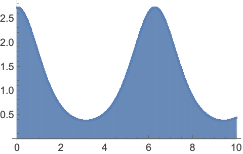
```

Double-exponential ("tanh-sinh") strategy that samples densely near the endpoints:

```wolfram
NIntegrate[Exp[Cos[x]],{x,0,10},Method->"DoubleExponential"]
(* Output *)
12.156059217947778
```

Subdivide entire region, after transformation:

```wolfram
ListPlot[Last[Reap[NIntegrate[Exp[Cos[x]],{x,0,10},Method->"DoubleExponential",EvaluationMonitor:>Sow[{x,Exp[Cos[x]]}]]]],Filling->0,AxesOrigin->{0,0}]
```

*([Graphics])*

Monte Carlo integration with uniformly random sampling points:

```wolfram
NIntegrate[Exp[Cos[x]],{x,0,10},Method->"MonteCarlo"]
(* Output *)
12.128400644737534
```

```wolfram
ListPlot[Last[Reap[NIntegrate[Exp[Cos[x]],{x,0,10},Method->"MonteCarlo",MaxPoints->100,EvaluationMonitor:>Sow[{x,Exp[Cos[x]]}]]]],Filling->0,AxesOrigin->{0,0}]//Quiet
```

*([Graphics])*

With deterministic sequences of sampling points:

```wolfram
NIntegrate[Exp[Cos[x]],{x,0,10},Method->"QuasiMonteCarlo"]
(* Output *)
12.160419691600483
```

```wolfram
ListPlot[Last[Reap[NIntegrate[Exp[Cos[x]],{x,0,10},Method->"QuasiMonteCarlo",MaxPoints->100,EvaluationMonitor:>Sow[{x,Exp[Cos[x]]}]]]],Filling->0,AxesOrigin->{0,0}]//Quiet
```

*([Graphics])*

Globally adaptive versions of Monte Carlo and quasi Monte Carlo:

```wolfram
NIntegrate[Exp[Cos[x]],{x,0,10},Method->"AdaptiveMonteCarlo"]
(* Output *)
12.019422504950013
```

```wolfram
NIntegrate[Exp[Cos[x]],{x,0,10},Method->"AdaptiveQuasiMonteCarlo"]
(* Output *)
12.156046958352047
```

Plot sampling points used by different strategies:

```wolfram
Table[ListPlot[Last[Reap[NIntegrate[Exp[Cos[x]],{x,0,10},Method->str,EvaluationMonitor:>Sow[x]]]],PlotLabel->str],{str,{"GlobalAdaptive","LocalAdaptive","Trapezoidal","DoubleExponential"}}]
(* Output *)
{[Graphics],[Graphics],[Graphics],[Graphics]}
```

Symbolic Processing  (5)

By default some symbolic processing may be performed:

```wolfram
NIntegrate[Exp[-x],{x,0,5}]
(* Output *)
0.993262053000916
```

Use the automatic numeric methods, but no symbolic processing:

```wolfram
NIntegrate[Exp[-x],{x,0,5},Method->{Automatic,"SymbolicProcessing"->False}]
(* Output *)
0.993262053000916
```

Use an explicit time limit for symbolic processing:

```wolfram
NIntegrate[Exp[-x],{x,0,5},Method->{Automatic,"SymbolicProcessing"->1}]
(* Output *)
0.993262053000916
```

Control automatic subdivision of piecewise functions:

```wolfram
NIntegrate[x Ceiling[x],{x,0,3},Method->{"SymbolicPreprocessing","SymbolicPiecewiseSubdivision"->True}]
(* Output *)
11.00000000000001
```

```wolfram
NIntegrate[x Ceiling[x],{x,0,3},Method->{"SymbolicPreprocessing","SymbolicPiecewiseSubdivision"->False}]
(* Output *)
NIntegrate
(* Output *)
NIntegrate
(* Output *)
11.000949319014198
```

Automatic subdivision of piecewise functions usually leads to fewer function evaluations:

```wolfram
Table[ListPlot[Last[Reap[NIntegrate[x Ceiling[x],{x,0,3},Method->{"SymbolicPreprocessing",o},EvaluationMonitor:>Sow[{x,x Ceiling[x]}]]]],PlotLabel->Style[o,Small],Filling->Axis],{o,{"SymbolicPiecewiseSubdivision"->True,"SymbolicPiecewiseSubdivision"->False}}]//Quiet
(* Output *)
{[Graphics],[Graphics]}
```

Control automatic simplification of even and odd integrands:

```wolfram
NIntegrate[x^2+Cos[x],{x,-3,3},Method->{"SymbolicPreprocessing","EvenOddSubdivision"->True}]
(* Output *)
18.28224001611976
```

```wolfram
NIntegrate[x^2+Cos[x],{x,-3,3},Method->{"SymbolicPreprocessing","EvenOddSubdivision"->False}]
(* Output *)
18.282240016119758
```

Automatic simplification usually leads to fewer function evaluations:

```wolfram
Table[ListPlot[Last[Reap[NIntegrate[x^2+Cos[x],{x,-3,3},Method->{"SymbolicPreprocessing",o},EvaluationMonitor:>Sow[{x,x^2+Cos[2x]}]]]],PlotLabel->o,Filling->Axis],{o,{"EvenOddSubdivision"->True,"EvenOddSubdivision"->False}}]
(* Output *)
{[Graphics],[Graphics]}
```

Control automatic method selection for highly oscillatory functions:

```wolfram
NIntegrate[Sin[x],{x,0,10},Method->{"SymbolicPreprocessing","OscillatorySelection"->True}]
(* Output *)
1.8390715290764545
```

```wolfram
NIntegrate[Sin[x],{x,0,10},Method->{"SymbolicPreprocessing","OscillatorySelection"->False}]
(* Output *)
1.8390715290764539
```

Specialized methods lead to fewer function evaluations for highly oscillatory functions:

```wolfram
Table[ListPlot[Last[Reap[NIntegrate[Sin[x],{x,0,50},Method->{"SymbolicPreprocessing",o},EvaluationMonitor:>Sow[{x,Sin[x]}]]]],PlotLabel->o,Filling->Axis],{o,{"OscillatorySelection"->True,"OscillatorySelection"->False}}]
(* Output *)
{[Graphics],[Graphics]}
```

Switching detection off can save time for non-oscillatory functions:

```wolfram
Timing[Do[NIntegrate[Exp[x],{x,0,1},Method->{"SymbolicPreprocessing","OscillatorySelection"->True}],{10}]]
(* Output *)
{0.2959999999999994,Null}
```

```wolfram
Timing[Do[NIntegrate[Exp[x],{x,0,1},Method->{"SymbolicPreprocessing","OscillatorySelection"->False}],{10}]]
(* Output *)
{0.17199999999999704,Null}
```

Control automatic subdivision at nodes of interpolating functions:

```wolfram
f=Interpolation[{1,2,4,5,2,3}];
```

```wolfram
NIntegrate[f[x]^2,{x,0,5},Method->{"SymbolicPreprocessing","InterpolationPointsSubdivision"->True}]
(* Output *)
49.677116402116454
```

```wolfram
NIntegrate[f[x]^2,{x,0,5},Method->{"SymbolicPreprocessing","InterpolationPointsSubdivision"->False}]//Quiet
(* Output *)
49.67711889630403
```

Subdivision of interpolating functions can lead to fewer evaluations:

```wolfram
Table[ListPlot[Last[Reap[NIntegrate[f[x]^2,{x,0,5},Method->{"SymbolicPreprocessing",o},EvaluationMonitor:>Sow[{x,f[x]^2}]]]],PlotLabel->Style[o,Small],Filling->Axis],{o,{"InterpolationPointsSubdivision"->True,"InterpolationPointsSubdivision"->False}}]//Quiet
(* Output *)
{[Graphics],[Graphics]}
```

Subdivision may be unnecessary for an accurate interpolation of a smooth function:

```wolfram
g=FunctionInterpolation[Sin[x],{x,0,5}];
```

```wolfram
Table[ListPlot[Last[Reap[NIntegrate[g[x]^2,{x,0,5},Method->{"SymbolicPreprocessing",o},EvaluationMonitor:>Sow[{x,g[x]^2}]]]],PlotLabel->Style[o,Small],Filling->Axis],{o,{"InterpolationPointsSubdivision"->True,"InterpolationPointsSubdivision"->False}}]//Quiet
(* Output *)
{[Graphics],[Graphics]}
```

#### MinRecursion

[NIntegrate](https://reference.wolfram.com/language/ref/NIntegrate.html) may miss sharp peaks of integrands:

```wolfram
NIntegrate[Exp[-100(x^2+y^2)],{x,-50,60},{y,-50,60}]
(* Output *)
NIntegrate
(* Output *)
0.
```

Increasing `MinRecursion` forces a finer subdivision of the integration region:

```wolfram
NIntegrate[Exp[-100(x^2+y^2)],{x,-50,60},{y,-50,60},MinRecursion->4]
(* Output *)
0.031415926458653085
```

#### PrecisionGoal

The number of samples used to evaluate $\int_{0}^{1}\int_{0}^{1}\frac{1}{\sqrt{x+y}}\mathrm{d}y \mathrm{d}x$ for different relative tolerances:

```wolfram
sampleCount[pg_]:=
Module[{k=0},
NIntegrate[1/Sqrt[x+y],{x,0,1},{y,0,1},PrecisionGoal->pg,EvaluationMonitor:>k++];
k
];
```

The number of samples needed typically increases exponentially with the [PrecisionGoal](https://reference.wolfram.com/language/ref/PrecisionGoal.html):

```wolfram
Table[sampleCount[pg],{pg,2,12}]
(* Output *)
{119,289,456,898,2122,5281,12710,32430,82342,201512,440957}
```

```wolfram
ListLogPlot[%,Joined->True]
```

*([Graphics])*

#### WorkingPrecision

[NIntegrate](https://reference.wolfram.com/language/ref/NIntegrate.html) can compute integrals using higher working precision:

```wolfram
NIntegrate[Exp[-t^2],{t,0,12},WorkingPrecision->100]2/Sqrt[Pi]
(* Output *)
0.9999999999999999999999999999999999999999999999999999999999999998643738830794095787219693843409582427333218723397521
```

The [PrecisionGoal](https://reference.wolfram.com/language/ref/PrecisionGoal.html) used is 10 less than the [WorkingPrecision](https://reference.wolfram.com/language/ref/WorkingPrecision.html):

```wolfram
NIntegrate[Exp[-t^2],{t,0,12},WorkingPrecision->100,PrecisionGoal->90]2/Sqrt[Pi]
(* Output *)
0.9999999999999999999999999999999999999999999999999999999999999998643738830794095787219693843409582427333217783048361
```

### Applications

#### Basic Applications

Compute an integral that has no closed-form solution:

```wolfram
Integrate[(BesselJ[0,x])/(1+x),{x,0,1}]
(* Output *)
∫_0^1(BesselJ[0,x])/(1+x)ⅆx
```

```wolfram
NIntegrate[(BesselJ[0,x])/(1+x),{x,0,1}]
(* Output *)
0.6465434264771616
```

Integrate a discrete set of data using [Interpolation](https://reference.wolfram.com/language/ref/Interpolation.html):

```wolfram
data=Table[{x,Sin[(1)/(x+1/2)]},{x,0,10,0.2}];
```

```wolfram
NIntegrate[Interpolation[data][x],{x,0,10}]
(* Output *)
2.7422282190307814
```

[Integrate](https://reference.wolfram.com/language/ref/Integrate.html) also works on interpolating functions:

```wolfram
Integrate[Interpolation[data][x],{x,0,10}]
(* Output *)
2.7422282190307814
```

Plot the data and the interpolation:

```wolfram
{ListPlot[data,Filling->0,AxesOrigin->{0,0}],Plot[Interpolation[data][x],{x,0,10},Filling->0,AxesOrigin->{0,0}]}
(* Output *)
{[Graphics],[Graphics]}
```

#### Probability and Expectation

Compute the probability that $(x-2)^{2}<1$ when $x$ follows a standard normal distribution:

```wolfram
pdf=PDF[NormalDistribution[0,1],x]
(* Output *)
(ℯ^(-(x^2)/(2)))/(Sqrt[2 π])
```

```wolfram
NIntegrate[Boole[(x-2)^2<1]pdf,{x,-∞,∞}]
(* Output *)
0.1573053558998275
```

Use [NProbability](https://reference.wolfram.com/language/ref/NProbability.html) directly:

```wolfram
NProbability[(x-2)^2<1,x∼NormalDistribution[0,1]]
(* Output *)
0.1573053558998275
```

Compute the expectation of $\sqrt{\left|x\right|}$ when $x$ follows a standard Cauchy distribution:

```wolfram
pdf=PDF[CauchyDistribution[0,1],x]
(* Output *)
(1)/(π (1+x^2))
```

```wolfram
NIntegrate[Sqrt[Abs[x]] pdf,{x,-∞,∞}]
(* Output *)
1.4142135623731003
```

Use [NExpectation](https://reference.wolfram.com/language/ref/NExpectation.html) directly:

```wolfram
NExpectation[Sqrt[Abs[x]],x∼CauchyDistribution[0,1]]
(* Output *)
1.4142135623731003
```

Compute the cumulative distribution function (CDF) from the probability density function (PDF):

```wolfram
pdf=PDF[NormalDistribution[0,1],ξ]
(* Output *)
(ℯ^(-(ξ^2)/(2)))/(Sqrt[2 π])
```

```wolfram
cdf[x_?NumberQ]:=NIntegrate[pdf,{ξ,-∞,x}]
```

```wolfram
Plot[cdf[x],{x,-3,3}]
```

*([Graphics])*

Compute a quantile value by solving an equation:

```wolfram
quantile[p_?NumberQ]:=x/.FindRoot[cdf[x]==p,{x,0}]
```

```wolfram
quantile[0.2]
(* Output *)
-0.8416212335727165
```

```wolfram
Plot[quantile[p],{p,0.05,0.95},PlotRange->{{0,1},Automatic}]
```

*([Graphics])*

Use [Quantile](https://reference.wolfram.com/language/ref/Quantile.html) directly:

```wolfram
Quantile[NormalDistribution[0,1],0.2]
(* Output *)
-0.8416212335729141
```

#### Lengths, Areas, and Volumes

Compute the area between two curves as a one-dimensional integral of their difference:

```wolfram
NIntegrate[Exp[Sin[x]]-Sin[Sin[x]],{x,0,2}]
(* Output *)
2.9894750989770102
```

As a two-dimensional integral over the region bounded by them:

```wolfram
NIntegrate[1,{x,0,2},{y,Sin[Sin[x]],Exp[Sin[x]]}]
(* Output *)
2.989475099036271
```

Plot the computed area:

```wolfram
Plot[{Exp[Sin[x]],Sin[Sin[x]]},{x,0,2},Filling->1->{2}]
```

*([Graphics])*

Compute the area of a disk that is given implicitly:

```wolfram
NIntegrate[Boole[x^2+y^2<=1],{x,-1,1},{y,-1,1}]
(* Output *)
3.1415926509824335
```

```wolfram
RegionPlot[x^2+y^2<=1,{x,-1,1},{y,-1,1}]
```

*([Graphics])*

Disk annulus:

```wolfram
NIntegrate[Boole[1/4<=x^2+y^2<=1],{x,-1,1},{y,-1,1}]
(* Output *)
2.3561944901381895
```

```wolfram
RegionPlot[1/4<=x^2+y^2<=1,{x,-1,1},{y,-1,1}]
```

*([Graphics])*

Ellipse:

```wolfram
NIntegrate[Boole[x^2+(2y)^2<=1],{x,-1,1},{y,-1,1}]
(* Output *)
1.5707963254912167
```

```wolfram
RegionPlot[x^2+(2y)^2<=1,{x,-1,1},{y,-1,1}]
```

*([Graphics])*

Ellipse annulus:

```wolfram
NIntegrate[Boole[1/4<=x^2+(2y)^2<=1],{x,-1,1},{y,-1,1}]
(* Output *)
1.1780972450690947
```

```wolfram
RegionPlot[1/4<=x^2+(2y)^2<=1,{x,-1,1},{y,-1,1}]
```

*([Graphics])*

Disk segment:

```wolfram
NIntegrate[Boole[x^2+y^2<=1&&y>=0&&y>=-x],{x,-1,1},{y,-1,1}]
(* Output *)
1.1780972425641958
```

```wolfram
RegionPlot[x^2+y^2<=1&&y>=0&&y>=-x,{x,-1,1},{y,-1,1}]
```

*([Graphics])*

Simple regions including a ball:

```wolfram
NIntegrate[Boole[x^2+y^2+z^2<=3],{x,-2,2},{y,-2,2},{z,-2,2}]
(* Output *)
21.765592350125832
```

```wolfram
RegionPlot3D[x^2+y^2+z^2<=3,{x,-2,2},{y,-2,2},{z,-2,2},Mesh->None]
```

*([Graphics3D])*

Half of a spherical shell:

```wolfram
NIntegrate[Boole[1<=x^2+y^2+z^2<=3&&y>=0],{x,-2,2},{y,-2,2},{z,-2,2}]
(* Output *)
8.78840106617314+4.585245263883044×10^-59 ⅈ
```

```wolfram
RegionPlot3D[1<=x^2+y^2+z^2<=3&&y>=0,{x,-2,2},{y,-2,2},{z,-2,2},Mesh->None,PlotPoints->50]
(* Output *)
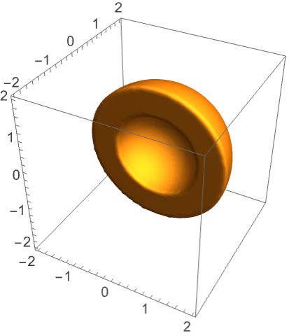
```

Ellipsoid:

```wolfram
NIntegrate[Boole[x^2+y^2+1/2z^2<=3],{x,-3,3},{y,-3,3},{z,-3,3}]
(* Output *)
30.781195894632035
```

```wolfram
RegionPlot3D[x^2+y^2+1/2z^2<=3,{x,-3,3},{y,-3,3},{z,-3,3},Mesh->None,PlotPoints->35]
```

*([Graphics3D])*

Half of an ellipsoidal shell:

```wolfram
NIntegrate[Boole[1<=x^2+y^2+1/2z^2<=3&&y>=0],{x,-3,3},{y,-3,3},{z,-3,3}]
(* Output *)
12.428675979356218+6.484516038990402×10^-59 ⅈ
```

```wolfram
RegionPlot3D[1<=x^2+y^2+1/2z^2<=3&&y>=0,{x,-3,3},{y,-3,3},{z,-3,3},Mesh->None,PlotPoints->50]
(* Output *)
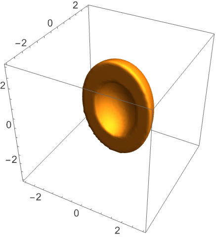
```

Spherical wedge:

```wolfram
NIntegrate[Boole[x^2+y^2+z^2<=3&&y>=0&&y>=x+z],{x,-3,3},{y,-3,3},{z,-3,3}]
(* Output *)
7.573482174117258+2.0875171654287265×10^-59 ⅈ
```

```wolfram
RegionPlot3D[x^2+y^2+z^2<=3&&y>=0&&y>=x+z,{x,-2,2},{y,-2,2},{z,-2,2},Mesh->None,PlotPoints->50]
(* Output *)
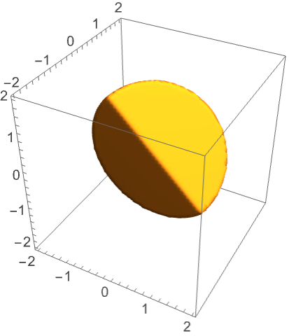
```

Compute the area of a region defined by a closed parametric curve using Green's theorem:

```wolfram
{x,y}={Cos[u],Sin[u]};
```

```wolfram
NIntegrate[x D[y,u],{u,0,2π}]
(* Output *)
3.141592653589797
```

```wolfram
ParametricPlot[{x,y},{u,0,2π}]
```

*([Graphics])*

Ellipse:

```wolfram
{x,y}={2Cos[u],Sin[u]};
```

```wolfram
NIntegrate[x D[y,u],{u,0,2π}]
(* Output *)
6.283185307179594
```

```wolfram
ParametricPlot[{x,y},{u,0,2Pi}]
```

*([Graphics])*

A periodic boundary curve:

```wolfram
{x,y}={Cos[u]+1/7Cos[7u+Pi/3],Sin[u]+1/7Sin[7u]};
```

```wolfram
NIntegrate[x D[y,u],{u,0,2π}]
(* Output *)
3.365992128846205
```

```wolfram
ParametricPlot[{x,y},{u,0,2Pi}]
```

*([Graphics])*

Compute the length of a parametric curve:

```wolfram
{x,y}={Cos[u],Sin[u]};
```

```wolfram
NIntegrate[Sqrt[D[x,u]^2+D[y,u]^2],{u,0,2π}]
(* Output *)
6.283185307179593
```

```wolfram
ParametricPlot[{x,y},{u,0,2π}]
```

*([Graphics])*

Ellipse:

```wolfram
{x,y}={2Cos[u],Sin[u]};
```

```wolfram
NIntegrate[Sqrt[D[x,u]^2+D[y,u]^2],{u,0,2π}]
(* Output *)
9.688448221816845
```

```wolfram
ParametricPlot[{x,y},{u,0,2π}]
```

*([Graphics])*

A periodic boundary curve:

```wolfram
{x,y}={Cos[u]+1/7Cos[7u+Pi/3],Sin[u]+1/7Sin[7u]};
```

```wolfram
NIntegrate[Sqrt[D[x,u]^2+D[y,u]^2],{u,0,2π}]
(* Output *)
8.090425070635233
```

```wolfram
ParametricPlot[{x,y},{u,0,2Pi}]
```

*([Graphics])*

A circle in 3D:

```wolfram
{x,y,z}={1,0,0}Cos[u]+Normalize[{0,1,1}]Sin[u];
```

```wolfram
NIntegrate[Sqrt[D[x,u]^2+D[y,u]^2+D[z,u]^2],{u,0,2π}]
(* Output *)
6.283185307179593
```

```wolfram
ParametricPlot3D[{x,y,z},{u,0,2π}]
```

*([Graphics3D])*

Ellipse in 3D:

```wolfram
{x,y,z}={1,0,0}2Cos[u]+Normalize[{0,1,1}]Sin[u];
```

```wolfram
NIntegrate[Sqrt[D[x,u]^2+D[y,u]^2+D[z,u]^2],{u,0,2π}]
(* Output *)
9.688448221816849
```

```wolfram
ParametricPlot3D[{x,y,z},{u,0,2π}]
```

*([Graphics3D])*

More general curve:

```wolfram
{x,y,z}={1,0,0}(Cos[u]+1/7Cos[7u+Pi/3])+Normalize[{1,1,1}](Sin[u]+1/7Sin[7u]);
```

```wolfram
NIntegrate[Sqrt[D[x,u]^2+D[y,u]^2+D[z,u]^2],{u,0,2π}]
(* Output *)
7.184980213384936
```

```wolfram
ParametricPlot3D[{x,y,z},{u,0,2π}]
```

*([Graphics3D])*

A toroidal spring curve:

```wolfram
{x,y,z}={Cos[u] (2+Cos[8 u]),(2+Cos[8 u]) Sin[u],Sin[8 u]};
```

```wolfram
NIntegrate[Sqrt[D[x,u]^2+D[y,u]^2+D[z,u]^2],{u,0,2π}]
(* Output *)
51.991407100984446
```

```wolfram
ParametricPlot3D[{x,y,z},{u,0,2π}]
```

*([Graphics3D])*

Compute the area of a parametrically defined surface:

```wolfram
{x,y,z}={Cos[u]Sin[v],Sin[u]Sin[v],Cos[v]};
```

```wolfram
NIntegrate[Norm[Cross[D[{x,y,z},u],D[{x,y,z},v]]],{u,0,2π},{v,0,π}]
(* Output *)
12.56637061457199
```

```wolfram
ParametricPlot3D[{x,y,z},{u,0,2π},{v,0,π}]
```

*([Graphics3D])*

Ellipsoidal surface:

```wolfram
{x,y,z}={2Cos[u]Sin[v],Sin[u]Sin[v],Cos[v]};
```

```wolfram
NIntegrate[Norm[Cross[D[{x,y,z},u],D[{x,y,z},v]]],{u,0,2π},{v,0,π}]
(* Output *)
21.478436014872564
```

```wolfram
ParametricPlot3D[{x,y,z},{u,0,2π},{v,0,π}]
```

*([Graphics3D])*

Toroidal surface:

```wolfram
{x,y,z}={(2+Cos[v])Cos[u],(2+Cos[v])Sin[u],Sin[v]};
```

```wolfram
NIntegrate[Norm[Cross[D[{x,y,z},u],D[{x,y,z},v]]],{u,0,2π},{v,0,2π}]
(* Output *)
78.95683520871486
```

```wolfram
ParametricPlot3D[{x,y,z},{u,0,2π},{v,0,2π}]
```

*([Graphics3D])*

General parametric surface:

```wolfram
{x,y,z}={(u)/(2)+v,u -(v)/(2),Sin[u v]};
```

```wolfram
NIntegrate[Norm[Cross[D[{x,y,z},u],D[{x,y,z},v]]],{u,0,3},{v,0,3}]
(* Output *)
19.476998423139115
```

```wolfram
ParametricPlot3D[{x,y,z},{v,0,3},{u,0,3}]
```

*([Graphics3D])*

Compute the volume enclosed by a parametric surface using the divergence theorem:

```wolfram
{x,y,z}={Cos[u]Sin[v],Sin[u]Sin[v],Cos[v]};
```

```wolfram
NIntegrate[({x,y,z})/(3).Cross[D[{x,y,z},u],D[{x,y,z},v]],{u,0,2π},{v,0,π}]//Abs
(* Output *)
4.18879020485733
```

```wolfram
4/3 Pi//N
(* Output *)
4.1887902047863905
```

```wolfram
ParametricPlot3D[{x,y,z},{u,0,2π},{v,0,2π}]
```

*([Graphics3D])*

Ellipsoidal volume:

```wolfram
{x,y,z}={4Cos[u]Sin[v],3Sin[u]Sin[v],2Cos[v]};
```

```wolfram
NIntegrate[({x,y,z})/(3).Cross[D[{x,y,z},u],D[{x,y,z},v]],{u,0,2π},{v,0,π}]//Abs
(* Output *)
100.53096491657593
```

```wolfram
ParametricPlot3D[{x,y,z},{u,0,2π},{v,0,2π}]
(* Output *)
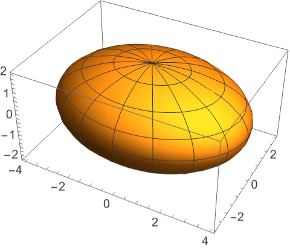
```

Toroidal volume:

```wolfram
{x,y,z}={(2+Cos[v])Cos[u],(2+Cos[v])Sin[u],Sin[v]};
```

```wolfram
NIntegrate[({x,y,z})/(3).Cross[D[{x,y,z},u],D[{x,y,z},v]],{u,0,2π},{v,0,2π}]
(* Output *)
39.47841760421106
```

```wolfram
ParametricPlot3D[{x,y,z},{u,0,2π},{v,0,2π}]
```

*([Graphics3D])*

Volume of a general parametric surface:

```wolfram
{x,y,z}={(2+Cos[v])Cos[u],(2+Cos[v])Sin[u],Sin[v](5/4-Cos[u])};
```

```wolfram
NIntegrate[({x,y,z})/(3).Cross[D[{x,y,z},u],D[{x,y,z},v]],{u,0,2π},{v,0,2π}]
(* Output *)
49.34802200220597
```

```wolfram
ParametricPlot3D[{x,y,z},{u,0,2π},{v,0,2π}]
```

*([Graphics3D])*

#### Line, Surface, and Volume Integrals

Work done by a cyclic thermodynamic process:

```wolfram
{p,v}={5+(3+Sin[3t])Cos[t],6+(3+Sin[t/2]^2)Sin[t]};
```

```wolfram
NIntegrate[p D[v,t],{t,0,2π}]
(* Output *)
32.98672286270253
```

Visualize cycle on a pressure-volume diagram:

```wolfram
ParametricPlot[{p,v},{t,0,2π},PlotRange->{{0,9},{0,10}},AxesLabel->{"V","P"}]/.Line[p___]:>{Arrowheads[Medium],Arrow[p]}
```

*([Graphics])*

Mass and center of mass of a region with uniform density:

```wolfram
m=NIntegrate[Boole[2<Abs[2x]+y^2<3&&0<y<3],{x,-∞,∞},{y,-∞,∞}]
(* Output *)
1.5784835328210247
```

```wolfram
cm=(1)/(m)NIntegrate[{x,y}Boole[2<Abs[2x]+y^2<3&&0<y<3],{x,-∞,∞},{y,-∞,∞}]
(* Output *)
{0.,0.7918992970208771}
```

Visualize the center of mass:

```wolfram
RegionPlot[2<Abs[2x]+y^2<3&&0<y<3,{x,-2,2},{y,-1,3},AxesOrigin->cm,Axes->True,AxesStyle->Dashed]
```

*([Graphics])*

Three-dimensional region:

```wolfram
m=NIntegrate[Boole[x^2+y^2+z^2<=3&&y>=0],{x,-2,2},{y,-2,2},{z,-2,2}]
(* Output *)
10.882796175062916
```

```wolfram
cm=(1)/(m)NIntegrate[{x,y,z}Boole[x^2+y^2+z^2<=3&&y>=0],{x,-2,2},{y,-2,2},{z,-2,2}]
(* Output *)
{0.,0.6495191855999844,0.}
```

Visualize the center of mass:

```wolfram
Show[RegionPlot3D[x^2+y^2+z^2<=3&&y>=0,{x,-2,2},{y,-2,2},{z,-2,2},Mesh->None,PlotPoints->50,PlotStyle->Opacity[1/2]],Graphics3D@Line[Transpose[{cm+IdentityMatrix[3]/3,cm-IdentityMatrix[3]/3},{2,3,1}]]]
(* Output *)
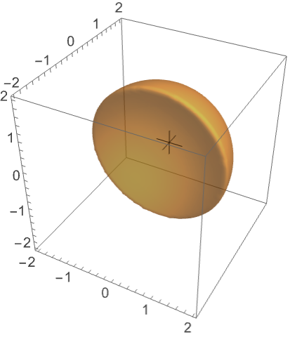
```

Center of mass of a region enclosed by a parametric surface using Stokes's theorem:

```wolfram
{x,y,z}={(2+Cos[v])Cos[u],(2+Cos[v])Sin[u],Sin[v](5/4-Cos[u])};
```

```wolfram
m=NIntegrate[({x,y,z})/(3).Cross[D[{x,y,z},u],D[{x,y,z},v]],{u,0,2π},{v,0,2π}]
(* Output *)
49.34802200220597
```

```wolfram
cm=(1)/(m)NIntegrate[DiagonalMatrix[({x,y,z}^2)/(2)].Cross[D[{x,y,z},u],D[{x,y,z},v]],{u,0,2π},{v,0,2π},AccuracyGoal->4]
(* Output *)
{-0.8500000011622358,-5.316794286643837×10^-16,-3.624976031461681×10^-16}
```

Visualize center of mass:

```wolfram
Show[ParametricPlot3D[{x,y,z},{u,0,2π},{v,0,2π},PlotStyle->Opacity[1/2],Mesh->None],Graphics3D@Line[Transpose[{cm+10IdentityMatrix[3]/3,cm-10IdentityMatrix[3]},{2,3,1}]]]
```

*([Graphics3D])*

#### Integral Transforms

Compute integral transforms including Fourier transform:

```wolfram
ft[f_,x_,ω_?NumberQ]:=(1)/(Sqrt[2π])NIntegrate[f Exp[ⅈ ω x],{x,-∞,∞},AccuracyGoal->2]
```

```wolfram
ft[Exp[-x^2],x,0.5]
(* Output *)
0.6642653470502755+0. ⅈ
```

```wolfram
Plot[Abs[ft[Exp[-x^2],x,ω]],{ω,-3,3}]
```

*([Graphics])*

Laplace transform:

```wolfram
lt[f_,x_,s_?NumberQ]:=NIntegrate[f Exp[-s x],{x,0,∞}]
```

```wolfram
lt[x^2,x,0.5]
(* Output *)
15.999999999999508
```

```wolfram
Plot[Abs@lt[x^2,x,0.5+ⅈ ω],{ω,-3,3}]
```

*([Graphics])*

Mellin transform:

```wolfram
mt[f_,x_,s_]:=NIntegrate[f x^(s-1),{x,0,∞}]
```

```wolfram
mt[Sin[x],x,0.5]
(* Output *)
1.2533141901656357
```

```wolfram
Plot[mt[Sin[x],x,s],{s,-1,1}]
```

*([Graphics])*

Hilbert transform:

```wolfram
ht[f_,x_,τ_]:=NIntegrate[f (1)/(π (x-τ)),{x,-∞,τ,∞},Method->{"PrincipalValue"}]
```

```wolfram
ht[Sinc[x],x,0.5]
(* Output *)
-0.24483487643387997
```

```wolfram
Plot[ht[Sinc[x],x,τ],{τ,-5,5}]
```

*([Graphics])*

Hartley transform:

```wolfram
ht[f_,x_,ω_]:=(1)/(Sqrt[2π])NIntegrate[f(Cos[ω x]+Sin[ω x]),{x,-∞,∞}]
```

```wolfram
ht[Exp[-x^2],x,0.5]
(* Output *)
0.6642653456845522
```

```wolfram
Plot[ht[Exp[-x^2],x,ω],{ω,-3,3}]
```

*([Graphics])*

Find the Fourier coefficients of a periodic function on `[0,1]`:

```wolfram
a[i_]:=2NIntegrate[x^2 Cos[2π i x],{x,0,1}]
```

```wolfram
b[i_]:=2 NIntegrate[x^2 Sin[2π i x],{x,0,1}]
```

```wolfram
{DiscretePlot[a[i],{i,0,10}],DiscretePlot[b[i],{i,1,10}]}
(* Output *)
{[Graphics],[Graphics]}
```

Show the approximate inverse transform:

```wolfram
Table[Plot[Evaluate[{x^2,a[0]/2+∑_i=1^na[i]Cos[2π i x]+∑_i=1^nb[i]Sin[2π i x]}],{x,0,1},Ticks->None,PlotLabel->n],{n,2,8,2}]
(* Output *)
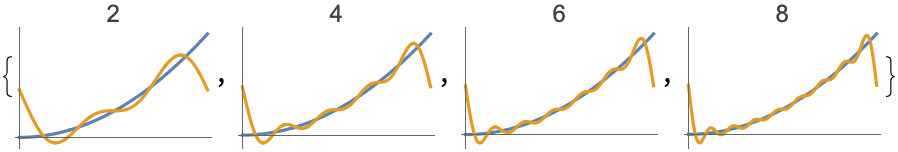
```

Compute a quadratic fractional Fourier transform:

```wolfram
fract[α_, w_]:=Sqrt[(1-I Cot[α])/(2Pi)]E^(I Cot[α] w^2/2) NIntegrate[E^(-I Csc[α] w t+I Cot[α] t^2/2) UnitBox[t], {t,-Infinity, Infinity}]
```

```wolfram
Table[DiscretePlot[{Re[fract[k Pi,w]],Im[fract[k Pi,w]]},{w,-2,2, 0.05},Joined->True, PlotStyle-> {Red, Blue},PlotRange -> All,Filling-> Axis],{k,{0.02, 0.09, 3.2,20.9}}]
(* Output *)
{[Graphics],[Graphics],[Graphics],[Graphics]}
```

Fraunhofer integral for amplitude of waves diffracted by a square aperture:

```wolfram
a[x_,y_,z_]:=(1 )/(2π z)Abs[NIntegrate[Exp[(x s+y t)/(ⅈ z)],{s,0,1},{t,0,1},PrecisionGoal->2]]
```

Diffraction pattern near optical axis:

```wolfram
MatrixPlot[ParallelTable[a[x,y,1],{x,-10,10},{y,-10,20}]]
```

*([Graphics])*

#### Integral Representations of Special Functions

Integral representation for Bessel function of the first kind $n$ on the real line:

```wolfram
j[n_,x_?NumberQ]:=NIntegrate[(Cos[t n-x Sin[t]])/(π),{t,0,π}]
```

Compare with built-in function [BesselJ](https://reference.wolfram.com/language/ref/BesselJ.html)[*n*,*x*]:

```wolfram
Table[Plot[{f[0,x],f[1,x]},{x,0,10},PlotLabel->f[0,x],f[1,x]},","]],{f,{j,BesselJ}
(* Output *)
{[Graphics],[Graphics]}
```

Gamma function $z$ on the right half of the complex plane:

```wolfram
g[z_?NumberQ]:=NIntegrate[t^(z-1)Exp[-t],{t,0,∞}]
```

Compare with built-in function [Gamma](https://reference.wolfram.com/language/ref/Gamma.html)[*z*]:

```wolfram
Table[ContourPlot[Abs[f[x+ⅈ y]],{x,1,3},{y,-1,1},PlotPoints->5,PlotLabel->f[z]],{f,{g,Gamma}}]
(* Output *)
{[Graphics],[Graphics]}
```

Incomplete elliptic integral of the second kind $z$ on the real line:

```wolfram
e[z_?NumberQ,m_?NumberQ]:=NIntegrate[Sqrt[1-m Sin[t]^2],{t,0,z}]
```

Compare with built-in function [EllipticE](https://reference.wolfram.com/language/ref/EllipticE.html)[*z*,*m*]:

```wolfram
Table[Plot[{f[z,1],f[2,z]},{z,0,1},PlotLabel->f[z,1],f[2,z]},","]],{f,{e,EllipticE}
(* Output *)
{[Graphics],[Graphics]}
```

#### Function Norms and Inner Products

$L^{p}$ norm of a function:

```wolfram
lp[p_?NumberQ,f_,x_]:=NIntegrate[Abs[f]^p,{x,-∞,∞}]^(1/p)
```

```wolfram
Table[lp[p,Exp[-5x^2],x],{p,5}]
(* Output *)
{0.7926654595188503,0.7486648927519504,0.770625014806842,0.7934416327262693,0.8126826468631299}
```

Plot $L^{p}$ norm as a function of $p$:

```wolfram
Table[Plot[lp[p,f,x],{p,1,5},PlotLabel->Subscript[Norm[f], p],AxesLabel->{p}],{f,{Exp[-x^2],Exp[-5x^2],Sin[x]Exp[-5x^2]}}]
(* Output *)
{[Graphics],[Graphics],[Graphics]}
```

Minimize $\left\|f\right\|_{p}$ as a function of $p$:

```wolfram
FindMinimum[lp[p,Exp[-5x^2],x],{p,1,5}]
(* Output *)
{0.7462092981377467,{p->1.7079468396026958}}
```

$L^{p}$ inner product with respect to weight function $w$ for functions defined on $a<x<b$:

```wolfram
ip[w_,f_,g_,{x_,a_,b_}]:=NIntegrate[w f Conjugate[g],{x,a,b},AccuracyGoal->8]
```

Orthogonality of Legendre polynomials $n$ on $-1<x<1$ with weight function $1$:

```wolfram
fs=Table[LegendreP[n,x],{n,0,4}];
```

```wolfram
MatrixForm[Outer[{f,g}↦ip[1,f,g,{x,-1,1}],fs,fs]]//Chop
(* Output *)
({{2.000000000000002, 0, 0, 0, 0}, {0, 0.6666666666666676, 0, 0, 0}, {0, 0, 0.400000000000001, 0, 0}, {0, 0, 0, 0.285714285714286, 0}, {0, 0, 0, 0, 0.22222222222222257}})
```

```wolfram
Table[(2)/(2n+1),{n,0,4}]//N
(* Output *)
{2.,0.6666666666666666,0.4,0.2857142857142857,0.2222222222222222}
```

Orthogonality of Chebyshev polynomials $T_{n}(x)$ on $-1<x<1$ with weight function $\frac{1}{\sqrt{1-x^{2}}}$:

```wolfram
fs=Table[ChebyshevT[n,x],{n,0,4}];
```

```wolfram
MatrixForm[Outer[{f,g}↦ip[(1)/(Sqrt[1-x^2]),f,g,{x,-1,1}],fs,fs]]//Chop
(* Output *)
({{3.141592653589808, 0, 0, 0, 0}, {0, 1.5707963267949, 0, 0, 0}, {0, 0, 1.5707963267948983, 0, 0}, {0, 0, 0, 1.5707963267949154, 0}, {0, 0, 0, 0, 1.5707963267948992}})
```

```wolfram
Table[If[n==0,π,(π)/(2)],{n,0,4}]//N
(* Output *)
{3.141592653589793,1.5707963267948966,1.5707963267948966,1.5707963267948966,1.5707963267948966}
```

Orthogonality of Hermite polynomials $H_{n}(x)$ on $-\infty<x<\infty$ with weight function $e^{-x^{2}}$:

```wolfram
fs=Table[HermiteH[n,x],{n,0,4}];
```

```wolfram
MatrixForm[Outer[{f,g}↦ip[Exp[-x^2],f,g,{x,-∞,∞}],fs,fs]]//Chop
(* Output *)
({{1.7724538504129486, 0, 0, 0, 0}, {0, 3.544907670872842, 0, 0, 0}, {0, 0, 14.179630807243957, 0, 0}, {0, 0, 0, 85.07778484346528, 0}, {0, 0, 0, 0, 680.6222787477307}})
```

```wolfram
Table[n!2^nSqrt[π],{n,0,4}]//N
(* Output *)
{1.7724538509055159,3.5449077018110318,14.179630807244127,85.07778484346477,680.6222787477182}
```

#### Complex Analysis

Compute the residue of $f$ at $z=c$ as an integral over a contour enclosing $c$:

```wolfram
res[f_,{z_,c_}]:=(1)/(2π ⅈ)NIntegrate[f Dt[z,t]/.z->c+Exp[ⅈ t],{t,0,2π}]
```

```wolfram
res[(2)/(z-1),{z,1}]
(* Output *)
2.000000000000002+0. ⅈ
```

Compare with exact value:

```wolfram
res[(Sin[z])/((z-2)^3),{z,2}]
(* Output *)
-0.45464871310488975-1.2090443197003527×10^-16 ⅈ
```

```wolfram
Residue[(Sin[z])/((z-2)^3),{z,2}]//N
(* Output *)
-0.45464871341284085
```

Numerical derivative of a function at $z=a$ as an integral over a contour enclosing $a$:

```wolfram
d[f_,z_,a_]:=(1)/(2π ⅈ)NIntegrate[(f)/((z-a)^2) Dt[z,t]/.z->a+Exp[ⅈ t],{t,0,2π}]
```

```wolfram
{d[Sin[z+Sin[z]],z,1.5+ⅈ],D[Sin[z+Sin[z]],z]/.z->1.5+ⅈ}
(* Output *)
{-1.9730184913670212+1.7714608463770964 ⅈ,-1.9730184913676183+1.771460846377208 ⅈ}
```

Differentiate a function defined numerically:

```wolfram
f[x_?NumericQ]:=y[1]/.First@NDSolve[{y'[s]== 1-x y[s]^3,y[0]==x},y,{s,1}]
```

```wolfram
Plot[f[x],{x,0,4}]
```

*([Graphics])*

```wolfram
d[f[x],x,2]
(* Output *)
-0.1369598244701997-2.208718528794109×10^-17 ⅈ
```

### Properties & Relations

[NIntegrate](https://reference.wolfram.com/language/ref/NIntegrate.html) computes a surface integral for lower-dimensional regions:

```wolfram
NIntegrate[1,{x,y}∈Circle[]]
(* Output *)
6.283185307179616
```

```wolfram
NIntegrate[1,{x,y,z}∈Sphere[]]
(* Output *)
12.56637054569839
```

The regions are lower dimensional:

```wolfram
RegionDimension[Circle[]]<RegionEmbeddingDimension[Circle[]]
(* Output *)
True
```

```wolfram
RegionDimension[Sphere[]]<RegionEmbeddingDimension[Sphere[]]
(* Output *)
True
```

The surface (curve etc.) integral $\int_{x \in S}g(x)$ for a parametric surface $\{f_{1}(\theta),\ldots,f_{n}(\theta)\}$ is given by the ordinary integral $\int_{\theta \in \mathcal{R}}G(\theta) g(f(\theta))$ where $G(\theta)$ is the Gram determinant:

```wolfram
GramDet[f_,v_]:=Sqrt[Det[D[f,{v}]ᵀ.D[f,{v}]]];
```

Integrating over a parametric circle curve $\{cos(\phi),sin(\phi)\}$:

```wolfram
G=Simplify@GramDet[{Cos[φ],Sin[φ]},{φ}]
(* Output *)
1
```

```wolfram
{NIntegrate[G,{φ,0,2π}],NIntegrate[1,{x,y}∈Circle[]]}
(* Output *)
{6.283185307179593,6.283185307179616}
```

Integrating over a parametric sphere surface $\{sin(\theta) cos(\phi),sin(\theta) sin(\phi),cos(\theta)\}$:

```wolfram
G=Simplify@GramDet[{Cos[φ]Sin[θ],Sin[φ]Sin[θ],Cos[θ]},{φ,θ}]
(* Output *)
Sqrt[Sin[θ]^2]
```

```wolfram
{NIntegrate[G,{φ,0,2π},{θ,0,π}],NIntegrate[1,{x,y,z}∈Sphere[]]}
(* Output *)
{12.56637061457199,12.56637054569839}
```

Integrating over a zero-dimensional region corresponds to summing over the points:

```wolfram
NIntegrate[x y,{x,y}∈Point[{{1,2},{3,1}}]]
(* Output *)
5.
```

```wolfram
Sum[p[[1]]p[[2]],{p,{{1,2},{3,1}}}]
(* Output *)
5
```

When a closed-form solution is available, [Integrate](https://reference.wolfram.com/language/ref/Integrate.html) can be used instead of [NIntegrate](https://reference.wolfram.com/language/ref/NIntegrate.html):

```wolfram
exact=Integrate[(1)/(Sqrt[x+y]),{x,0,1},{y,0,1}]
(* Output *)
(8)/(3) (-1+Sqrt[2])
```

The result of [NIntegrate](https://reference.wolfram.com/language/ref/NIntegrate.html) is close to the exact value:

```wolfram
exact-NIntegrate[(1)/(Sqrt[x+y]),{x,0,1},{y,0,1}]
(* Output *)
-4.57992288538378×10^-9
```

[NDSolve](https://reference.wolfram.com/language/ref/NDSolve.html) can be used instead of [NIntegrate](https://reference.wolfram.com/language/ref/NIntegrate.html):

```wolfram
sol=NDSolve[{D[f[x],x]==Sqrt[x],f[0]==0},f,{x,0,1}][[1,1]]
(* Output *)
f->InterpolatingFunction[...]
```

```wolfram
2/3 - (f/.sol)[1]
(* Output *)
-3.640009060834615×10^-8
```

[NIntegrate](https://reference.wolfram.com/language/ref/NIntegrate.html) will typically give a more precise result since it uses global error control:

```wolfram
2/3 - NIntegrate[Sqrt[x],{x,0,1}]
(* Output *)
-3.4416913763379853×10^-15
```

Approximate the tail of a sum using the Euler-Maclaurin formula:

```wolfram
f[x_] := 1/x^2;
```

```wolfram
Sum[f[x],{x,1,15}]+NIntegrate[f[x],{x,15,∞}]-(f[15]+f[∞])/2+Sum[(BernoulliB[2i](f^((2i-1))[∞]-f^((2i-1))[15]))/(2i)!, {i,1,6}]
(* Output *)
1.6449340668482269
```

The Euler-Maclaurin formula approximation compares well with the exact result:

```wolfram
Sum[1/x^2,{x,1,∞}]-%
(* Output *)
-6.661338147750939×10^-16
```

The Euler-Maclaurin method of [NSum](https://reference.wolfram.com/language/ref/NSum.html) uses [Integrate](https://reference.wolfram.com/language/ref/Integrate.html) or [NIntegrate](https://reference.wolfram.com/language/ref/NIntegrate.html):

```wolfram
NSum[1/x^2,{x,1,∞},Method->{"EulerMaclaurin",Method->NIntegrate}]
(* Output *)
1.6449340667600105
```

Find a cumulative distribution function from a probability density function:

```wolfram
NIntegrate[PDF[NormalDistribution[2,5],y],{y,-∞,4.}]
(* Output *)
0.6554217416098364
```

[CDF](https://reference.wolfram.com/language/ref/CDF.html) gives the same result:

```wolfram
CDF[NormalDistribution[2,5],4.]
(* Output *)
0.6554217416103242
```

The [Residue](https://reference.wolfram.com/language/ref/Residue.html) of a function at a pole is equivalent to a contour integral:

```wolfram
Residue[x^2/(x^2+1)^2,{x, ⅈ}]
(* Output *)
-(ⅈ)/(4)
```

Numerically integrate on a contour that includes the real axis from `-∞` to `∞`:

```wolfram
(1)/(2 π I) NIntegrate[x^2/(x^2+1)^2,{x,-∞,∞}]
(* Output *)
-0.2500000000000003 ⅈ
```

Several special functions are defined as integrals:

```wolfram
Block[{x=10.},{NIntegrate[1/t,{t,1,x}],(2)/(Sqrt[π])NIntegrate[Exp[-t^2],{t,0,x}],NIntegrate[t^(x-1)/E^t,{t,0,Infinity}]}]
(* Output *)
{2.3025850929940557,0.9999999999999952,362879.9999999157}
```

```wolfram
Block[{x=10.},{Log[x],Erf[x],Gamma[x]}]
(* Output *)
{2.302585092994046,1.,362880.}
```

For high precision, using the special function is usually preferable:

```wolfram
N[Erf[12],100]
(* Output *)
0.9999999999999999999999999999999999999999999999999999999999999998643738830794095787219693843409582427333217766711895
```

```wolfram
(2)/(Sqrt[π])NIntegrate[Exp[-t^2],{t,0,12},PrecisionGoal->100,WorkingPrecision->110]
(* Output *)
0.99999999999999999999999999999999999999999999999999999999999999986437388307940957872196938434095824273332177667109001743034964
```

### Possible Issues

For integrands with complicated variation, many levels of adaptive recursion may be required:

```wolfram
NIntegrate[(Cos[20000x])/(Sqrt[x]),{x,0,1}]
(* Output *)
NIntegrate
(* Output *)
0.
```

Specifying higher recursive subdivision levels gives a convergent result:

```wolfram
NIntegrate[(Cos[20000x])/(Sqrt[x]),{x,0,1},MaxRecursion->20]
(* Output *)
0.008891367476073194
```

One-dimensional integral with a singularity inside the integration region:

```wolfram
NIntegrate[Log[(1-x)^2],{x,0,2}]
(* Output *)
NIntegrate
(* Output *)
NIntegrate
(* Output *)
-3.999950393363151
```

Specify the location of the singularity to handle it with appropriate transformations:

```wolfram
NIntegrate[Log[(1-x)^2],{x,0,1,2}]
(* Output *)
-3.99999999999999
```

```wolfram
NIntegrate[Log[(1-x)^2],{x,0,2},Exclusions->{1}]
(* Output *)
-3.99999999999999
```

Since the default is to use relative tolerance, integrals that are zero may be computed slowly:

```wolfram
NIntegrate[Sin[x]Cos[y],{x,0,2π},{y,0,2π}]//Timing
(* Output *)
NIntegrate
(* Output *)
NIntegrate
(* Output *)
{32.397000000000006,0`11.824638986507319}
```

Specifying an absolute tolerance with [AccuracyGoal](https://reference.wolfram.com/language/ref/AccuracyGoal.html) will reduce the amount of work:

```wolfram
NIntegrate[Sin[x]Cos[y],{x,0,2π},{y,0,2π}, AccuracyGoal->8]//Timing
(* Output *)
{0.010000000000002479,0`14.058950510203026}
```

Higher-dimensional cubature-based integration to default precision may be slow:

```wolfram
NIntegrate[1/Sqrt[x1+x2+x3+x4+x5+x6+x7+x8+x9],{x1,0,1},{x2,0,1},{x3,0,1},{x4,0,1},{x5,0,1},{x6,0,1},{x7,0,1},{x8,0,1},{x9,0,1}]//Timing
(* Output *)
{109.507,0.4785483747985543}
```

Decreasing the [PrecisionGoal](https://reference.wolfram.com/language/ref/PrecisionGoal.html) speeds up the computation:

```wolfram
NIntegrate[1/Sqrt[x1+x2+x3+x4+x5+x6+x7+x8+x9],{x1,0,1},{x2,0,1},{x3,0,1},{x4,0,1},{x5,0,1},{x6,0,1},{x7,0,1},{x8,0,1},{x9,0,1},PrecisionGoal->2]//Timing
(* Output *)
{0.009999999999990433,0.4785535693171402}
```

Using a quasi Monte Carlo method for the same low [PrecisionGoal](https://reference.wolfram.com/language/ref/PrecisionGoal.html) may be even faster:

```wolfram
NIntegrate[1/Sqrt[x1+x2+x3+x4+x5+x6+x7+x8+x9],{x1,0,1},{x2,0,1},{x3,0,1},{x4,0,1},{x5,0,1},{x6,0,1},{x7,0,1},{x8,0,1},{x9,0,1}, Method->"QuasiMonteCarlo"]//Timing
(* Output *)
{0.010000000000000425,0.47758668191979603}
```

[NIntegrate](https://reference.wolfram.com/language/ref/NIntegrate.html) automatically uses Monte Carlo integration for dimensions higher than 15:

```wolfram
NIntegrate[1/(Sqrt(x1+x2+x3+x4+x5+x6+x7+x8+x9+x10+x11+x12+x13+x14+x15+x16)),{x1,0,1},{x2,0,1},{x3,0,1},{x4,0,1},{x5,0,1},{x6,0,1},{x7,0,1},{x8,0,1},{x9,0,1},{x10,0,1},{x11,0,1},{x12,0,1},{x13,0,1},{x14,0,1},{x15,0,1},{x16,0,1}]//Timing
(* Output *)
{0.010000000000001508,0.357578944131031}
```

It can be time-consuming to compute functions symbolically:

```wolfram
f[x_]:=Nest[Sin[#+Sin[2#]]&,x,20]
```

```wolfram
NIntegrate[f[x],{x,0,1}]//Timing
(* Output *)
{1.2037910000000238,0.9477471335169916}
```

Restricting the function definition avoids symbolic evaluation:

```wolfram
g[x_?NumericQ]:=Nest[Sin[#+Sin[2#]]&,x,20]
```

```wolfram
NIntegrate[g[x],{x,0,1}]//Timing
(* Output *)
{0.00348899999997343,0.9477471335169916}
```

Define a function that does numerical integration for a given parameter:

```wolfram
f1[a_]:=NIntegrate[(x-a)^2,{x,0,10}]
```

Compute with a parameter value of 2:

```wolfram
f1[2]
(* Output *)
173.33333333333366
```

Applying the function to a symbolic parameter generates a message from [NIntegrate](https://reference.wolfram.com/language/ref/NIntegrate.html):

```wolfram
f1[q]
(* Output *)
NIntegrate
(* Output *)
NIntegrate[(x-q)^2,{x,0,10}]
```

This can also lead to warnings when the function is used with other numerical functions like [NMinimize](https://reference.wolfram.com/language/ref/NMinimize.html):

```wolfram
NMinimize[f1[a],a]
(* Output *)
NIntegrate
(* Output *)
NIntegrate
(* Output *)
NIntegrate
(* Output *)
General
(* Output *)
{83.33333333333354,{a->4.999999968810839}}
```

Define a function that only evaluates when its argument is a numerical value to avoid these messages:

```wolfram
f2[a_?NumericQ]:=NIntegrate[(x-a)^2,{x,0,10}]
```

Compute with a numerical value:

```wolfram
f2[π]
(* Output *)
117.87011198524782
```

The function does not evaluate when its argument is non-numerical:

```wolfram
f2[q]
(* Output *)
f2[q]
```

The function can now be used with other numerical functions such as [NMinimize](https://reference.wolfram.com/language/ref/NMinimize.html):

```wolfram
NMinimize[f2[a],a]
(* Output *)
{83.33333333333354,{a->4.999999968810839}}
```

### Neat Examples

Sampling points for a three-dimensional integration, using a low-order method:

```wolfram
points=Reap[NIntegrate[Boole[(x1)^2+(x2-1)^2<1]+Boole[(x1)^2+(x3-1)^2<1],{x1,0,1},{x2,0,2},{x3,0,2},Method->{"GlobalAdaptive",Method->{"TrapezoidalRule","Points"->3},"SingularityHandler"->None},PrecisionGoal->4,EvaluationMonitor:>Sow[{x1,x2,x3}]]][[2,1]];
```

```wolfram
Graphics3D[Point[points]]
```

*([Graphics3D])*

Integrate a function with several singular curves:

```wolfram
NIntegrate[Sqrt[(1)/(Cos[5x]Sin[5y]-1/2)],{x,0,5},{y,0,5},Exclusions->Cos[5x]Sin[5y]==1/2]//Quiet
(* Output *)
6.639731126855711+32.58108606395586 ⅈ
```

```wolfram
Plot3D[{Re[Sqrt[(1)/(Cos[5x]Sin[5y]-1/2)]],Im[Sqrt[(1)/(Cos[5x]Sin[5y]-1/2)]]},{x,0,5},{y,0,5},Exclusions->Cos[5x]Sin[5y]==1/2,Mesh->None,PlotStyle->{Yellow,Magenta},PlotPoints->35]
(* Output *)
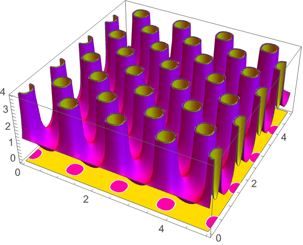
```

## Tech Notes ▪Advanced Numerical Integration in the Wolfram Language ▪Numerical Mathematics: Basic Operations ▪Numerical Integration ▪Numerical Sums, Products, and Integrals ▪Numerical Mathematics in the Wolfram Language ▪The Uncertainties of Numerical Mathematics ▪Implementation notes: Numerical and Related Functions

## Related Guides ▪Calculus ▪Geometric Computation ▪Functions of Complex Variables ▪Solvers over Regions ▪Symbolic Vectors, Matrices and Arrays ▪Numerical Evaluation & Precision ▪Mesh-Based Geometric Regions ▪Polygons ▪Polyhedra

## Related Links ▪ NIntegrate Explorer [NKS|Online](http://www.wolframscience.com/nks/search/?q=NIntegrate) ([A New Kind of Science](http://www.wolframscience.com/nks/))

## History Introduced in 1988 (1.0) | Updated in 1996 (3.0) ▪ 2003 (5.0) ▪ 2007 (6.0) ▪ 2010 (8.0) ▪ 2014 (10.0)
