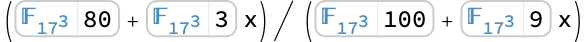
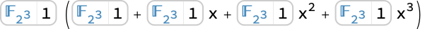

# FindInstance | [SpanFromLeft]

> [FindInstance](https://reference.wolfram.com/language/ref/FindInstance.html)[*expr*,*vars*] — finds an instance of `*vars*` that makes the statement `*expr*` be [True](https://reference.wolfram.com/language/ref/True.html).
> [FindInstance](https://reference.wolfram.com/language/ref/FindInstance.html)[*expr*,*vars*,*dom*] — finds an instance over the domain `*dom*`. Common choices of `*dom*` are [Complexes](https://reference.wolfram.com/language/ref/Complexes.html), [Reals](https://reference.wolfram.com/language/ref/Reals.html), [Integers](https://reference.wolfram.com/language/ref/Integers.html), and [Booleans](https://reference.wolfram.com/language/ref/Booleans.html).
> [FindInstance](https://reference.wolfram.com/language/ref/FindInstance.html)[*expr*,*vars*,*dom*,*n*] — finds `*n*` instances.

## Details and Options

[FindInstance](https://reference.wolfram.com/language/ref/FindInstance.html)[*expr*,{*x*_1,*x*_2,…}] gives results in the same form as [Solve](https://reference.wolfram.com/language/ref/Solve.html): `{{*x*_1->*val*_1,*x*_2->*val*_2,…}}` if an instance exists, and `{}` if it does not.

`*expr*` can contain equations, inequalities, domain specifications and quantifiers, in the same form as in [Reduce](https://reference.wolfram.com/language/ref/Reduce.html).

The statement `*expr*` can be any logical combination of:

*lhs*==*rhs* | equations
*lhs*!=*rhs* | inequations
`*lhs*>*rhs*` or `*lhs*>=*rhs*` | inequalities
*expr*∈*dom* | domain specifications
{*x*,*y*,…}∈*reg* | region specification
[ForAll](https://reference.wolfram.com/language/ref/ForAll.html)[*x*,*cond*,*expr*] | universal quantifiers
[Exists](https://reference.wolfram.com/language/ref/Exists.html)[*x*,*cond*,*expr*] | existential quantifiers

With exact symbolic input, [FindInstance](https://reference.wolfram.com/language/ref/FindInstance.html) gives exact results.

Even if two inputs define the same mathematical set, [FindInstance](https://reference.wolfram.com/language/ref/FindInstance.html) may still pick different instances to return.

The instances returned by [FindInstance](https://reference.wolfram.com/language/ref/FindInstance.html) typically correspond to special or interesting points in the set.

[FindInstance](https://reference.wolfram.com/language/ref/FindInstance.html)[*expr*,*vars*] assumes by default that quantities appearing algebraically in inequalities are real, while all other quantities are complex.

[FindInstance](https://reference.wolfram.com/language/ref/FindInstance.html)[*expr*,*vars*,[Integers](https://reference.wolfram.com/language/ref/Integers.html)] finds solutions to Diophantine equations.

[FindInstance](https://reference.wolfram.com/language/ref/FindInstance.html)[*expr*,*vars*,[Booleans](https://reference.wolfram.com/language/ref/Booleans.html)] solves Boolean satisfiability for `*expr*`.

[FindInstance](https://reference.wolfram.com/language/ref/FindInstance.html)[*expr*,*vars*,[Reals](https://reference.wolfram.com/language/ref/Reals.html)] assumes that not only `*vars*` but also all function values in `*expr*` are real. [FindInstance](https://reference.wolfram.com/language/ref/FindInstance.html)[*expr*&&*vars*∈[Reals](https://reference.wolfram.com/language/ref/Reals.html),*vars*] assumes only that the `*vars*` are real.

[FindInstance](https://reference.wolfram.com/language/ref/FindInstance.html)[…,*x*∈*reg*,[Reals](https://reference.wolfram.com/language/ref/Reals.html)] constrains `*x*` to be in the region `*reg*`. The different coordinates for `*x*` can be referred to using [Indexed](https://reference.wolfram.com/language/ref/Indexed.html)[*x*,*i*].

[FindInstance](https://reference.wolfram.com/language/ref/FindInstance.html) may be able to find instances even if [Reduce](https://reference.wolfram.com/language/ref/Reduce.html) cannot give a complete reduction.

By default, every time you run [FindInstance](https://reference.wolfram.com/language/ref/FindInstance.html) with a given input, it will return the same output.

[FindInstance](https://reference.wolfram.com/language/ref/FindInstance.html)[*expr*,*vars*,*dom*,*n*] will return a shorter list if the total number of instances is less than `*n*`.

The following options can be given:

| [Method](https://reference.wolfram.com/language/ref/Method.html) | [Automatic](https://reference.wolfram.com/language/ref/Automatic.html) | method to use |
| --- | --- | --- |
| [Modulus](https://reference.wolfram.com/language/ref/Modulus.html) | 0 | modulus to assume for integers |
| [RandomSeeding](https://reference.wolfram.com/language/ref/RandomSeeding.html) | 1234 | how to seed randomness |
| [WorkingPrecision](https://reference.wolfram.com/language/ref/WorkingPrecision.html) | [Infinity](https://reference.wolfram.com/language/ref/Infinity.html) | precision to use in internal computations |

## Examples

### Basic Examples

Find a solution instance of a system of equations:

```wolfram
FindInstance[x^2+y^2+z^2==-1&&z^2==2x-5 y,{x,y,z}]
(* Output *)
{{x->0,y->(1)/(2) (5-Sqrt[21]),z->-ⅈ Sqrt[(5)/(2) (5-Sqrt[21])]}}
```

Find a real solution instance of a system of equations and inequalities:

```wolfram
FindInstance[x^2+y^2+z^2<=1&&9z^3==2x-5 y-7,{x,y,z},Reals]
(* Output *)
{{x->(45)/(128),y->-(1)/(2),z->-(3)/(4)}}
```

Find an integer solution instance:

```wolfram
FindInstance[x^2-3y^2==1&&10<x<100,{x,y},Integers]
(* Output *)
{{x->26,y->15}}
```

Find Boolean values of variables that satisfy a formula:

```wolfram
FindInstance[Xor[a,b,c,d]&&(a||b)&&!(c||d),{a,b,c,d},Booleans]
(* Output *)
{{a->False,b->True,c->False,d->False}}
```

Find several instances:

```wolfram
FindInstance[x^2-3y^2==1&&10<x<1000,{x,y},Integers,3]
(* Output *)
{{x->362,y->209},{x->26,y->15},{x->97,y->56}}
```

Find a point in a geometric region:

```wolfram
FindInstance[{x,y}∈InfiniteLine[{{0,0},{2,1}}]&&{x,y}∈Circle[],{x,y}]
(* Output *)
{{x->-(2)/(Sqrt[5]),y->-(1)/(Sqrt[5])}}
```

```wolfram
Graphics[{{Blue,InfiniteLine[{{0,0},{2,1}}],Circle[]},{Red,Point[{x,y}]/.%}}]
```

*([Graphics])*

### Scope

#### Complex Domain

A linear system:

```wolfram
FindInstance[2 x+3y-5z==1&&3x-4y+7z==3,{x,y,z}]
(* Output *)
{{x->0,y->22,z->13}}
```

A univariate polynomial equation:

```wolfram
FindInstance[x^3-2x+1==0,x]
(* Output *)
{{x->1}}
```

Five roots of a polynomial of a high degree:

```wolfram
FindInstance[x^1234567+9x^2+7x-1==0,x,5]
(* Output *)
{{x->Root},{x->Root},{x->Root},{x->Root},{x->Root}}
```

A multivariate polynomial equation:

```wolfram
FindInstance[x^2-y z==1,{x,y,z}]
(* Output *)
{{x->-1,y->0,z->0}}
```

Systems of polynomial equations and inequations:

```wolfram
FindInstance[x^2+y^3==z&&x+2y==3z+1&&x y z≠0,{x,y,z}]
(* Output *)
{{x->1,y->Root,z->(2)/(3) Root}}
```

This gives three solution instances:

```wolfram
FindInstance[x^2+y^3==z&&x+2y==3z+1&&x y z≠0,{x,y,z},3]
(* Output *)
{{x->-(101)/(5)+(87 ⅈ)/(10),y->Root,z->(1)/(30) ((-212+87 ⅈ)+20 Root)},{x->35+(46 ⅈ)/(5),y->Root,z->(2)/(15) ((85+23 ⅈ)+5 Root)},{x->-(73)/(5)-(71 ⅈ)/(5),y->Root,z->((2)/(15)-(ⅈ)/(15)) ((-17-44 ⅈ)+(4+2 ⅈ) Root)}}
```

If there are no solutions [FindInstance](https://reference.wolfram.com/language/ref/FindInstance.html) returns an empty list:

```wolfram
FindInstance[x^2+y^3==3&&x+2y==4&&x y ==5,{x,y}]
(* Output *)
{}
```

If there are fewer solutions than the requested number, [FindInstance](https://reference.wolfram.com/language/ref/FindInstance.html) returns all solutions:

```wolfram
FindInstance[x^2+y^2==1&&x==2y+1,{x,y},5]
(* Output *)
{{x->-(3)/(5),y->-(4)/(5)},{x->1,y->0}}
```

Five out of a trillion roots of a polynomial system:

```wolfram
FindInstance[x^10000==y^2+3y+2&&y^10000==z^2+3z+2&& z^10000==x^2+3x+2,{x,y,z},5]
(* Output *)
{{x->Root,y->Root,z->Root},{x->Root,y->Root,z->Root},{x->Root,y->Root,z->Root},{x->Root,y->Root,z->Root},{x->Root,y->Root,z->Root}}
```

Quantified polynomial system:

```wolfram
FindInstance[ForAll[x,Exists[y,a x^2+b y^2-3y==1&&a y≠0]],{a,b}]
(* Output *)
{{a->1,b->-1}}
```

An algebraic system:

```wolfram
FindInstance[Sqrt[x+2y]-3x+4y==5&&x+y^(1/3)==1,{x,y}]
(* Output *)
{{x->Root,y->-(-1+Root)^3}}
```

Transcendental equations:

```wolfram
FindInstance[Sin[x]==1/3,x]
(* Output *)
{{x->-47 π-ArcSin[(1)/(3)]}}
```

```wolfram
FindInstance[ 4^(x^2)2^x==8,x]
(* Output *)
{{x->-(1)/(4)-(1)/(4) Sqrt[(-384 ⅈ π+25 Log[2])/(Log[2])]}}
```

In this case there is no solution:

```wolfram
FindInstance[Log[x]==75/11 I Pi+17,x]
(* Output *)
{}
```

A solution in terms of transcendental [Root](https://reference.wolfram.com/language/ref/Root.html) objects:

```wolfram
FindInstance[Sin[Cos[x^2-1]]-x==1&&Abs[x]<3,x]
(* Output *)
{{x->Root}}
```

Five roots of an unrestricted equation:

```wolfram
FindInstance[Sin[FresnelS[x]+BesselJ[3,x^2-1]]==2^Cos[x]-3,x, 5]
(* Output *)
{{x->Root},{x->Root},{x->Root},{x->Root},{x->Root}}
```

Systems of transcendental equations:

```wolfram
FindInstance[Sin[x+y]==1/2&&E^x-y==1,{x,y}]
```

```wolfram
{{x->Root,y->-1+ℯ^Root}}
```

```wolfram
FindInstance[Gamma[x+y+1]-Sin[x y]==1&&Erf[x^2-y]-E^y-x+4==0,{x,y}]
(* Output *)
{{x->Root,y->Root}}
```

Three roots of a transcendental system:

```wolfram
FindInstance[Sin[x+y]==x y+1&&Cos[x-y]==AiryAi[x y]+2,{x,y},3]
(* Output *)
{{x->Root,y->Root},{x->Root,y->Root},{x->Root,y->Root}}
```

#### Real Domain

A linear system:

```wolfram
FindInstance[2 x+3y-5z==1&&3x-4y+7z==3,{x,y,z},Reals]
(* Output *)
{{x->(33)/(10),y->-(737)/(10),z->-(431)/(10)}}
```

A univariate polynomial equation:

```wolfram
FindInstance[x^5-2x+1==0,x,Reals]
(* Output *)
{{x->1}}
```

A univariate polynomial inequality:

```wolfram
FindInstance[x^5-2x+1<0,x,Reals]
(* Output *)
{{x->-3}}
```

A multivariate polynomial equation:

```wolfram
FindInstance[x^2-y z==1,{x,y,z},Reals]
(* Output *)
{{x->1,y->0,z->-1}}
```

A multivariate polynomial inequality:

```wolfram
FindInstance[x^2-2y +z^2>=1,{x,y,z},Reals]
(* Output *)
{{x->1,y->(1)/(2),z->1}}
```

Systems of polynomial equations and inequalities:

```wolfram
FindInstance[x^2+y z==1&&x+2y<=3z+1&&x y z>7,{x,y,z},Reals]
(* Output *)
{{x->-Sqrt[5],y->-2,z->2}}
```

Get four solution instances:

```wolfram
FindInstance[x^2+y z==1&&x+2y<=3z+1&&x y z>7,{x,y,z},Reals,4]
(* Output *)
{{x->-371,y->-12,z->11470},{x->-137,y->-68,z->276},{x->-69,y->-94,z->(2380)/(47)},{x->-4,y->-94,z->(15)/(94)}}
```

If there are no solutions [FindInstance](https://reference.wolfram.com/language/ref/FindInstance.html) returns an empty list:

```wolfram
FindInstance[x^2+y^3==3&&x+2y>=4&&x y ==5,{x,y},Reals]
(* Output *)
{}
```

If there are fewer solutions than the requested number, [FindInstance](https://reference.wolfram.com/language/ref/FindInstance.html) returns all solutions:

```wolfram
FindInstance[x^2+y^2==1&&x==2y+1,{x,y},Reals,5]
(* Output *)
{{x->-(3)/(5),y->-(4)/(5)},{x->1,y->0}}
```

A quantified polynomial system:

```wolfram
FindInstance[ForAll[x,Exists[y,a x^2+b y^2-3y==1&&y<0]],{a,b},Reals]
(* Output *)
{{a->-18,b->0}}
```

An algebraic system:

```wolfram
FindInstance[Sqrt[x+2y]-3x+4y>=5&&x+y^(1/3)==1,{x,y},Reals]
(* Output *)
{{x->-1,y->8}}
```

Piecewise equations:

```wolfram
FindInstance[Abs[(x+Abs[x+2])^2-1]^2==9&&x≠0,x,Reals]
(* Output *)
{{x->-2}}
```

```wolfram
FindInstance[Max[x,y]==Min[y^2-x,x]&&x>0,{x,y},Reals]
(* Output *)
{{x->3,y->3}}
```

Piecewise inequalities:

```wolfram
FindInstance[Abs[3x^2-7x-6]<Abs[x^2+x],x,Reals]
(* Output *)
{{x->-(43)/(64)}}
```

```wolfram
FindInstance[1<Floor[x^2+Ceiling[x^2]]<10,x,Reals]
(* Output *)
{{x->-1}}
```

Transcendental equations:

```wolfram
FindInstance[E^x-x==7,x,Reals]
(* Output *)
{{x->-7-ProductLog[-1,-(1)/(ℯ^7)]}}
```

```wolfram
FindInstance[ (27^(2x-1))^(1/x)==Sqrt[9^(2x-1)], x , Reals]
(* Output *)
{{x->3}}
```

A solution in terms of transcendental [Root](https://reference.wolfram.com/language/ref/Root.html) objects:

```wolfram
FindInstance[E^x-Log[x]+x^2==1,x]
(* Output *)
{{x->Root}}
```

Transcendental inequalities:

```wolfram
FindInstance[1/4<Sin[x]<1/3,x,Reals]
(* Output *)
{{x->(243627)/(1159)}}
```

```wolfram
FindInstance[ (1)/(2^x-1)>(1)/(1-2^(x-1)), x ,Reals]
(* Output *)
{{x->(21)/(61)}}
```

Transcendental systems:

```wolfram
FindInstance[Sin[x+y]==1/2&&E^x-y<=1,{x,y},Reals]
(* Output *)
{{x->(4747824)/(58924787),y->Root}}
```

```wolfram
FindInstance[ 3^x-2^2y==77 && Sqrt[3^x]-2^y==7, {x, y}, Reals]
(* Output *)
{{x->4,y->1}}
```

```wolfram
FindInstance[2^z Sin[x+y]==z-1&&x Gamma[y+z]==Sin[x y]+1&&z>E^x,{x,y,z},Reals]
(* Output *)
{{x->(33221793)/(599797700),y->Root,z->Root}}
```

#### Integer Domain

A linear system of equations:

```wolfram
FindInstance[2 x+3y-5z==1&&3x-4y+7z==3,{x,y,z},Integers]
(* Output *)
{{x->0,y->22,z->13}}
```

A linear system of equations and inequalities:

```wolfram
FindInstance[2 x+3y==4&&3x-4y<=5&&x-2y>-21,{x,y,z},Integers]
(* Output *)
{{x->-7,y->6,z->0}}
```

Find more than one solution:

```wolfram
FindInstance[2 x+3y==4&&3x-4y<=5&&x-2y>-21,{x,y,z},Integers,5]
(* Output *)
{{x->-1,y->2,z->-112},{x->-1,y->2,z->88},{x->-7,y->6,z->16},{x->-1,y->2,z->92},{x->-4,y->4,z->22}}
```

A univariate polynomial equation:

```wolfram
FindInstance[x^1000-2x^777+1==0,x,Integers]
(* Output *)
{{x->1}}
```

A univariate polynomial inequality:

```wolfram
FindInstance[x^5-2x+1<0,x,Integers]
(* Output *)
{{x->-3}}
```

Binary quadratic equations:

```wolfram
FindInstance[x^2+x y+y^2==109,{x,y},Integers]
(* Output *)
{{x->-7,y->-5}}
```

```wolfram
FindInstance[x^2-3y^2==22&&x>0&&y>0,{x,y},Integers]
(* Output *)
{{x->5,y->1}}
```

```wolfram
FindInstance[x^2-6 x y+9y^2-x+2y==1,{x,y},Integers]
(* Output *)
{{x->-3,y->-1}}
```

A Thue equation:

```wolfram
FindInstance[x^3-2x^2 y+y^3==2,{x,y},Integers]
(* Output *)
{{x->1,y->-1}}
```

If there are fewer solutions than the requested number, [FindInstance](https://reference.wolfram.com/language/ref/FindInstance.html) returns all solutions:

```wolfram
FindInstance[x^3-2x^2 y+y^3==2,{x,y},Integers,3]
(* Output *)
{{x->1,y->-1},{x->5,y->3}}
```

A sum of squares equation:

```wolfram
FindInstance[x^2+y^2+z^2+t^2==123456789,{x,y,z,t},Integers]
(* Output *)
{{x->2600,y->378,z->10468,t->2641}}
```

The Pythagorean equation:

```wolfram
FindInstance[x^2+y^2==z^2&&100<x<y<z,{x,y,z},Integers]
(* Output *)
{{x->101,y->5100,z->5101}}
```

A bounded system of equations and inequalities:

```wolfram
FindInstance[x^4+y^4+z^4<=500&&x+y^2+z^3==32,{x,y,z},Integers]
(* Output *)
{{x->1,y->-2,z->3}}
```

A high-degree system with no solution:

```wolfram
FindInstance[2x^7+8y^15+14 x y z==3,{x,y,z},Integers]
(* Output *)
{}
```

Transcendental Diophantine systems:

```wolfram
FindInstance[Exp[y^2]<x&&Abs[x]<5&&Abs[y]<5,{x,y},Integers]
(* Output *)
{{x->3,y->-1}}
```

```wolfram
FindInstance[Exp[x^2-5y^2+1]+x^2-5y^2==0&&x>0&&y>0,{x,y},Integers]
(* Output *)
{{x->2,y->1}}
```

A polynomial system of congruences:

```wolfram
FindInstance[Mod[x^2+y^2,2]==1&&Mod[x-2y,3]==2,{x,y},Integers]
(* Output *)
{{x->0,y->5}}
```

#### Modular Domains

A linear system:

```wolfram
FindInstance[2 x+3y-5z==1&&3x-4y+7z==3,{x,y,z},Modulus->12]
(* Output *)
{{x->0,y->10,z->1}}
```

A univariate polynomial equation:

```wolfram
FindInstance[x^3-2x+1==0,x,Modulus->5]
(* Output *)
{{x->1}}
```

A multivariate polynomial equation:

```wolfram
FindInstance[x^2-y z==1,{x,y,z},Modulus->4]
(* Output *)
{{x->0,y->1,z->3}}
```

Find seven instances:

```wolfram
FindInstance[x^2-y z==1,{x,y,z},7,Modulus->4]
(* Output *)
{{x->1,y->0,z->2},{x->1,y->0,z->0},{x->3,y->2,z->2},{x->1,y->2,z->0},{x->1,y->2,z->2},{x->3,y->1,z->0},{x->2,y->3,z->1}}
```

A system of polynomial equations and inequations:

```wolfram
FindInstance[x^2+y^3==z&&x+2y==3z+1&&x y z≠0,{x,y,z},Modulus->7]
(* Output *)
{{x->5,y->2,z->5}}
```

A quantified polynomial system:

```wolfram
FindInstance[ForAll[x,Exists[y,a x^2+b y^2-3y==1&&y≠0]],{a,b},Modulus->3]
(* Output *)
{{a->0,b->1}}
```

#### Finite Field Domains

Univariate equations:

```wolfram
ℱ=FiniteField[53,4];
FindInstance[x^5+ℱ[123]x==ℱ[234],x]
(* Output *)
{{x-><|interpretation -> FiniteFieldElement[FiniteField[53, 2, +, 38, #, +, 9, #, ^, 2, +, #, ^, 4, &, Polynomial], 10134132], index -> 4879932, shortIndex -> 4879932, indexShortened -> True, characteristic -> 53, shortCharacteristic -> 53, extensionDegree -> 4, field -> FiniteField[...], fieldDisplayed -> False|>}}
```

```wolfram
FindInstance[x^7+2 x+3==0,x,ℱ]
(* Output *)
{{x-><|interpretation -> FiniteFieldElement[FiniteField[53, 2, +, 38, #, +, 9, #, ^, 2, +, #, ^, 4, &, Polynomial], 44301427], index -> 4060639, shortIndex -> 4060639, indexShortened -> True, characteristic -> 53, shortCharacteristic -> 53, extensionDegree -> 4, field -> FiniteField[...], fieldDisplayed -> False|>}}
```

Systems of linear equations:

```wolfram
ℱ=FiniteField[71,2];
FindInstance[ℱ[123]x+ℱ[234]y==ℱ[345]&&ℱ[321]x+ℱ[432]y==ℱ[543],{x,y}]
(* Output *)
{{x-><|interpretation -> FiniteFieldElement[FiniteField[71, 7, +, 69, #, +, #, ^, 2, &, Polynomial], 1114], index -> 1005, shortIndex -> 1005, indexShortened -> True, characteristic -> 71, shortCharacteristic -> 71, extensionDegree -> 2, field -> FiniteField[...], fieldDisplayed -> False|>,y-><|interpretation -> FiniteFieldElement[FiniteField[71, 7, +, 69, #, +, #, ^, 2, &, Polynomial], 6157], index -> 4108, shortIndex -> 4108, indexShortened -> True, characteristic -> 71, shortCharacteristic -> 71, extensionDegree -> 2, field -> FiniteField[...], fieldDisplayed -> False|>}}
```

```wolfram
FindInstance[ℱ[1234]x+ℱ[2345]y+ℱ[3456]z==ℱ[4567]&&ℱ[1]x+ℱ[2]y+ℱ[3]z==ℱ[4],{x,y,z}]
(* Output *)

```

Systems of polynomial equations:

```wolfram
ℱ=FiniteField[7,5];
FindInstance[x^2+y^2+z^2==21,{x,y,z},ℱ]
(* Output *)

```

Find three instances:

```wolfram
FindInstance[ℱ[321]x^3+ℱ[432]y^3+ℱ[543]z^3==ℱ[654]&&x^2==ℱ[333]y z+ℱ[111],{x,y,z},3]
(* Output *)

```

Systems involving quantifiers:

```wolfram
ℱ=FiniteField[2,5];
FindInstance[Exists[z,ℱ[1]x+ℱ[3]y+ℱ[5]z==ℱ[7]&&ℱ[21]x+ℱ[23]y+ℱ[25]z==ℱ[27]],{x,y}]
(* Output *)

```

```wolfram
FindInstance[Exists[{y,z},ℱ[1]x^2+ℱ[2]y^3+ℱ[3]z^4==ℱ[4]&&ℱ[5]x^4+ℱ[6]y^3+ℱ[7]z^2==ℱ[8]&&x y z!=ℱ[0]],x]
(* Output *)
{{x-><|interpretation -> FiniteFieldElement[FiniteField[2, 1, +, #, ^, 2, +, #, ^, 5, &, Polynomial], 1101], index -> 11, shortIndex -> 11, indexShortened -> True, characteristic -> 2, shortCharacteristic -> 2, extensionDegree -> 5, field -> FiniteField[...], fieldDisplayed -> False|>}}
```

#### Mixed Domains

Mixed real and complex variables:

```wolfram
FindInstance[x^2+y^2==-1&&Element[x,Reals],{x,y}]
(* Output *)
{{x->Sqrt[3],y->-2 ⅈ}}
```

Find a real value of $x$ and a complex value of $y$ for which $x^{2}+y^{2}$ is real and less than $-1$:

```wolfram
FindInstance[x^2+y^2<-1 &&Element[x,Reals],{x,y},Complexes]
(* Output *)
{{x->0,y->-2 ⅈ}}
```

An inequality involving [Abs](https://reference.wolfram.com/language/ref/Abs.html)[*z*]:

```wolfram
pts={Re[z],Im[z]}/.FindInstance[1<Abs[ (z-2)/(2z-1)]<2,z,7]
(* Output *)
{{(3215)/(3506),(20)/(127)},{(632)/(877),(73)/(223)},{(661)/(877),-(2)/(5)},{(4)/(5),-(60)/(169)},{(152)/(877),-(21)/(31)},{-(571)/(702),(3)/(29)},{(623)/(877),(27)/(56)}}
```

```wolfram
Block[{z=u+I v},RegionPlot[1<Abs[ (z-2)/(2z-1)]<2,{u,-1,1},{v,-1,1},Epilog->{Blue,PointSize[Large],Point[pts]}]]
```

*([Graphics])*

#### Geometric Regions

Find instances in basic geometric regions in 2D:

```wolfram
ℛ_1=Circle[];
ℛ_2=Line[{{-2,1},{1,-2}}];
```

```wolfram
FindInstance[{x,y}∈ℛ_1,{x,y}∈ℛ_2]
(* Output *)
{{x->0,y->-1}}
```

Plot it:

```wolfram
Graphics[{{Blue,ℛ_1,ℛ_2},{Red,Point[{x,y}]/.%}}]
```

*([Graphics])*

Find instances in basic geometric regions in 3D:

```wolfram
ℛ_1=Sphere[];
ℛ_2=InfinitePlane[{{0,0,0},{0,1,0},{1,0,1}}];
```

```wolfram
FindInstance[2 x y<=z^2&&{x,y,z}∈ℛ_1&&{x,y,z}∈ℛ_2,{x,y,z},Reals]
(* Output *)
{{x->(3 Sqrt[(15)/(2)])/(16),y->-(11)/(16),z->(3 Sqrt[(15)/(2)])/(16)}}
```

Plot it:

```wolfram
Show[{ContourPlot3D[2 x y==z^2,{x,-1.2,1.2},{y,-1.2,1.2},{z,-1.2,1.2},Mesh->None,ContourStyle->Opacity[0.5]],Graphics3D[{{Opacity[0.5],Green,ℛ_1},{Opacity[0.5],Yellow,ℛ_2},{PointSize[Large],Red,Point[{x,y,z}/.%]}}]}]
```

*([Graphics3D])*

Find a point in the projection of a region:

```wolfram
ℛ=Cone[{{1,2,3},{3,2,1}},1];
```

```wolfram
FindInstance[∃_z{x,y,z}∈ℛ,{x,y},Reals,100];
```

Plot it:

```wolfram
Graphics3D[{{Green,ℛ},{Red,Point[{x,y,0}/.%]}}]
```

*([Graphics3D])*

An implicitly defined region:

```wolfram
ℛ=ImplicitRegion[a+2 b-3 c>=1&&a b c==7,{a,b,c}];
```

```wolfram
FindInstance[{x,y,z}∈ℛ,{x,y,z},Reals]
(* Output *)
{{x->-8,y->(5)/(32),z->-(28)/(5)}}
```

A parametrically defined region:

```wolfram
ℛ=ParametricRegion[{s+t,s-t,s t},{s,t}];
```

```wolfram
FindInstance[x y>z&&{x,y,z}∈ℛ,{x,y,z},Reals]
(* Output *)
{{x->0,y->-1,z->-(1)/(4)}}
```

Derived regions:

```wolfram
ℛ_1=Disk[{0,0},2];
ℛ_2=Circle[{1,1},2];
ℛ_3=RegionIntersection[ℛ_1,ℛ_2];
```

```wolfram
FindInstance[x^2>=x y+1,{x,y}∈ℛ_3]
(* Output *)
{{x->-(15)/(16),y->(1)/(16) (16-3 Sqrt[7])}}
```

Plot it:

```wolfram
Show[{RegionPlot[x^2>=x y+1,{x,-2,3},{y,-2,3}],Graphics[{{Opacity[0.5],Yellow,ℛ_1},{Green,ℛ_2},{Red,Point[{x,y}/.%]}}]}]
```

*([Graphics])*

Regions dependent on parameters:

```wolfram
ℛ_1=InfiniteLine[{{2,0},{0,t}}];
ℛ_2=Circle[];
```

```wolfram
FindInstance[∃_{x,y}({x,y}∈ℛ_1&&{x,y}∈ℛ_2),t,Reals]
(* Output *)
{{t->(Sqrt[(5)/(2)])/(2)}}
```

Find values of parameters $a$, $b$, and $r$ for which the circles contain the given points:

```wolfram
ℛ_1=Circle[{a,b},r];
ℛ_2=Circle[{a+1,b},r];
ℛ_3=RegionIntersection[ℛ_1,ℛ_2];
```

```wolfram
FindInstance[({0,1}|{0,-1})∈ℛ_3,{a,b,r},Reals]
(* Output *)
{{a->-(1)/(2),b->0,r->(Sqrt[5])/(2)}}
```

Plot it:

```wolfram
Show[{Graphics[{{Blue,ℛ_1},{Green,ℛ_2},{Red,Point[{{0,1},{0,-1}}]}}/.%]}]
```

*([Graphics])*

Use $x \in \mathcal{R}$ to specify that $x$ is a vector in $\mathbb{R}^{2}$:

```wolfram
ℛ=RegionIntersection[Circle[],Line[{{-2,-1},{1,2}}]];
```

```wolfram
FindInstance[x∈ℛ,x]
(* Output *)
{{x->{-1,0}}}
```

In this case $x$ is a vector in $\mathbb{R}^{3}$:

```wolfram
ℛ=Sphere[];
```

```wolfram
FindInstance[x.{1,2,3}==0&&x.{-3,-2,-1}<0,x∈ℛ]
(* Output *)
{{x->{(3)/(Sqrt[10]),0,-(1)/(Sqrt[10])}}}
```

### Options

#### Modulus

Find a solution over the integers modulo 9:

```wolfram
FindInstance[x^2+3y^2==4&&3x^3-4y^2+x y==1,{x,y},Modulus->9]
(* Output *)
{{x->8,y->1}}
```

Find three solutions:

```wolfram
FindInstance[x^2+3y^2==4&&3x^3-4y^2+x y==1,{x,y},3,Modulus->9]
(* Output *)
{{x->8,y->1},{x->8,y->4},{x->8,y->7}}
```

#### RandomSeeding

Finding instances often involves random choice from large solution sets:

```wolfram
FindInstance[x^2+y^2<=1,{x,y},3]
(* Output *)
{{x->(124)/(151),y->(7)/(89)},{x->-(134)/(151),y->-(Sqrt[4845])/(151)},{x->-(38)/(151),y->(3 Sqrt[2373])/(151)}}
```

By default, [FindInstance](https://reference.wolfram.com/language/ref/FindInstance.html) chooses the same solutions each time:

```wolfram
FindInstance[x^2+y^2<=1,{x,y},3]
(* Output *)
{{x->(124)/(151),y->(7)/(89)},{x->-(134)/(151),y->-(Sqrt[4845])/(151)},{x->-(38)/(151),y->(3 Sqrt[2373])/(151)}}
```

Use [RandomSeeding](https://reference.wolfram.com/language/ref/RandomSeeding.html)->[Automatic](https://reference.wolfram.com/language/ref/Automatic.html) to generate potentially new instances each time:

```wolfram
FindInstance[x^2+y^2<=1,{x,y},3,RandomSeeding->Automatic]
(* Output *)
{{x->-(36)/(151),y->-(23)/(52)},{x->-(22)/(151),y->(Sqrt[22317])/(151)},{x->-1,y->0}}
```

#### WorkingPrecision

Finding an exact solution to this problem is hard:

```wolfram
TimeConstrained[FindInstance[x^77+3x-11==E &&y^5-x^2 y+21==Pi&&x^2y^3+z^4==E^Pi,{x,y,z},Reals],60]
(* Output *)
$Aborted
```

With a finite [WorkingPrecision](https://reference.wolfram.com/language/ref/WorkingPrecision.html), [FindInstance](https://reference.wolfram.com/language/ref/FindInstance.html) is able to find an approximate solution:

```wolfram
FindInstance[x^77+3x-11==E &&y^5-x^2 y+21==Pi&&x^2y^3+z^4==E^Pi,{x,y,z},Reals,WorkingPrecision->100]//Timing
(* Output *)
{0.0156001,{{x->1.0311665857796181003850299327558187983978525915907300005478494122259297108384978877042433394567064633516350184207416,y->-1.8167274639038495433839300362641124653279580497131933001640413505463894376352353901584623316508700192437478846912774,z->2.3308577670735283611522690701643190605025085942341545032981473280455621329673033282907520501471614528742647913322162}}}
```

### Applications

#### Geometric Problems

The region `ℛ` is a subset of `𝒮` if $\mathcal{R}\\mathcal{S}$ is empty. Show that [Disk](https://reference.wolfram.com/language/ref/Disk.html)[{0,0},{2,1}] is a subset of [Rectangle](https://reference.wolfram.com/language/ref/Rectangle.html)[{-2,-1},{2,1}]:

```wolfram
ℛ=Disk[{0,0},{2,1}];
𝒮=Rectangle[{-2,-1},{2,1}];
```

```wolfram
FindInstance[{x,y}∈RegionDifference[ℛ,𝒮],{x,y},Reals]
(* Output *)
{}
```

Plot it:

```wolfram
Graphics[{{LightRed,EdgeForm[Gray],𝒮},{LightBlue,EdgeForm[Gray],ℛ}}]
```

*([Graphics])*

Show that [Rectangle](https://reference.wolfram.com/language/ref/Rectangle.html)[] is a not a subset of [Disk](https://reference.wolfram.com/language/ref/Disk.html)[{0,0},7/5]:

```wolfram
ℛ=Rectangle[];
𝒮=Disk[{0,0},7/5];
```

```wolfram
FindInstance[{x,y}∈RegionDifference[ℛ,𝒮],{x,y},Reals]
(* Output *)
{{x->(255)/(256),y->(63)/(64)}}
```

Plot it:

```wolfram
Graphics[{{LightRed,EdgeForm[Gray],𝒮},{LightBlue,EdgeForm[Gray],ℛ},{Red,Point[{x,y}/.%]}}]
```

*([Graphics])*

Show that [Cylinder](https://reference.wolfram.com/language/ref/Cylinder.html)[]⊆[Ball](https://reference.wolfram.com/language/ref/Ball.html)[{0,0,0},2]:

```wolfram
ℛ=Cylinder[];
𝒮=Ball[{0,0,0},2];
```

```wolfram
FindInstance[{x,y,z}∈RegionDifference[ℛ,𝒮],{x,y,z},Reals]
(* Output *)
{}
```

Plot it:

```wolfram
Graphics3D[{{Opacity[0.3],𝒮},{LightBlue,EdgeForm[Gray],ℛ}}]
```

*([Graphics3D])*

Show that [Cylinder](https://reference.wolfram.com/language/ref/Cylinder.html)[][NotSubsetEqual][Ball](https://reference.wolfram.com/language/ref/Ball.html)[{0,0,0},7/5]:

```wolfram
ℛ=Cylinder[];
𝒮=Ball[{0,0,0},7/5];
```

```wolfram
FindInstance[{x,y,z}∈RegionDifference[ℛ,𝒮],{x,y,z},Reals]
(* Output *)
{{x->0,y->1,z->-(63)/(64)}}
```

Plot it:

```wolfram
Graphics3D[{{Opacity[0.3],𝒮},{LightBlue,Opacity[0.3],EdgeForm[Gray],ℛ},{Red,PointSize[Large],Point[{x,y,z}/.%]}}]
```

*([Graphics3D])*

Find a point in the intersection of two regions:

```wolfram
p={x,y}/.FindInstance[x^2-y^3<=2&&x^2+(y+2)^2<=1,{x,y}]
(* Output *)
{{0,-(5)/(4)}}
```

```wolfram
r1=RegionPlot[x^2-y^3<=2,{x,-3,3},{y,-3,3},PlotStyle->Directive[Opacity[0.5],Hue[0.3]]];
r2=RegionPlot[x^2+(y+2)^2<=1,{x,-3,3},{y,-3,3},PlotStyle->Directive[Opacity[0.5],Hue[0.7]]];
```

```wolfram
Show[{r1,r2,Graphics[{Red,PointSize[Large],Point[p]}]}]
```

*([Graphics])*

Find a counterexample to a geometric conjecture:

```wolfram
triangle=a>0&&b>0&&c>0&&a+b>c&&a+c>b&&b+c>a;
s=1/2(a+b+c);
F=Sqrt[s(s-a)(s-b)(s-c)];
conjecture=27(b^2+c^2-a^2)^2(a^2+c^2-b^2)^2(a^2+b^2-c^2)^2<=(4F)^6;
```

```wolfram
FindInstance[triangle &&!conjecture,{a,b,c},Reals]
(* Output *)
{{a->(3)/(4),b->(1)/(2),c->1}}
```

Prove the conjecture using stronger assumptions:

```wolfram
acute=a^2+b^2>c^2&&a^2+c^2>b^2&&b^2+c^2>a^2;
```

```wolfram
FindInstance[triangle &&acute&&!conjecture,{a,b,c},Reals]
(* Output *)
{}
```

#### Boolean Problems

Prove that a statement is a tautology:

```wolfram
statement=(a&&((a&&!(b||(a&&c)))||b||(a&&c)))||!a||!((a&&!(b||(a&&c)))||b||(a&&c));
```

```wolfram
FindInstance[!statement,{a,b,c},Booleans]
(* Output *)
{}
```

This can be proven with [TautologyQ](https://reference.wolfram.com/language/ref/TautologyQ.html) as well:

```wolfram
TautologyQ[statement]
(* Output *)
True
```

Show that a statement is not a tautology; get a counterexample:

```wolfram
statement=(b&&((a&&!(b||(a&&c)))||b||(a&&c)))||!a||!((a&&!(b||(a&&c)))||b||(a&&c));
```

```wolfram
FindInstance[!statement,{a,b,c},Booleans]
(* Output *)
{{a->True,b->False,c->True}}
```

This can be done with [SatisfiabilityInstances](https://reference.wolfram.com/language/ref/SatisfiabilityInstances.html) as well:

```wolfram
SatisfiabilityInstances[!statement,{a,b,c}]
(* Output *)
{{True,False,True}}
```

#### Integer Problems

Find a Pythagorean triple:

```wolfram
FindInstance[x^2+y^2==5^2&&y>x>0,{x,y},Integers]
(* Output *)
{{x->3,y->4}}
```

Find Pythagorean triples when they exist:

```wolfram
Table[z->FindInstance[x^2+y^2==z^2&&y>x>0,{x,y},Integers],{z,30}]
(* Output *)
{1->{},2->{},3->{},4->{},5->{{x->3,y->4}},6->{},7->{},8->{},9->{},10->{{x->6,y->8}},11->{},12->{},13->{{x->5,y->12}},14->{},15->{{x->9,y->12}},16->{},17->{{x->8,y->15}},18->{},19->{},20->{{x->12,y->16}},21->{},22->{},23->{},24->{},25->{{x->7,y->24}},26->{{x->10,y->24}},27->{},28->{},29->{{x->20,y->21}},30->{{x->18,y->24}}}
```

Two instances are now found when $z=25$:

```wolfram
Table[z->FindInstance[x^2+y^2==z^2&&y>x>0,{x,y},Integers,10],{z,30}]
(* Output *)
{1->{},2->{},3->{},4->{},5->{{x->3,y->4}},6->{},7->{},8->{},9->{},10->{{x->6,y->8}},11->{},12->{},13->{{x->5,y->12}},14->{},15->{{x->9,y->12}},16->{},17->{{x->8,y->15}},18->{},19->{},20->{{x->12,y->16}},21->{},22->{},23->{},24->{},25->{{x->7,y->24},{x->15,y->20}},26->{{x->10,y->24}},27->{},28->{},29->{{x->20,y->21}},30->{{x->18,y->24}}}
```

Find Pythagorean quadruples and visualize the result:

```wolfram
FindInstance[x^2+y^2+z^2==1^2,{x,y,z},Integers,1000]
(* Output *)
{{x->-1,y->0,z->0},{x->0,y->-1,z->0},{x->0,y->0,z->-1},{x->0,y->0,z->1},{x->0,y->1,z->0},{x->1,y->0,z->0}}
```

Generate all solutions for $1 \leq d \leq 20$ and visualize the result:

```wolfram
sol=Table[FindInstance[x^2+y^2+z^2==d^2,{x,y,z},Integers,1000],{d,20}];
```

```wolfram
Graphics3D[Point[{x,y,z}]/.sol]
```

*([Graphics3D])*

Show that there are no 2×2 magic squares with all numbers unequal:

```wolfram
FindInstance[a+c==b+d==a+b==c+d&&a≠b≠c≠d,{a,b,c,d},Integers]
(* Output *)
{}
```

### Properties & Relations

Solution instances satisfy the input system:

```wolfram
system=x^2+y^2+z^2<=1&&x^2-y^3+2z<=3;
```

```wolfram
system/.FindInstance[system,{x,y,z},7]
(* Output *)
{True,True,True,True,True,True,True}
```

Use [RootReduce](https://reference.wolfram.com/language/ref/RootReduce.html) to prove that algebraic numbers satisfy equations:

```wolfram
system=x^2+y^3+2x y==1;
```

```wolfram
system/.FindInstance[system,{x,y},2]
(* Output *)
{(-(81)/(4)+(742 ⅈ)/(25))-((28)/(5)+(53 ⅈ)/(5)) Root+Root^3==1,(-(33)/(25)+(544 ⅈ)/(25))+((32)/(5)+(34 ⅈ)/(5)) Root+Root^3==1}
```

```wolfram
RootReduce[%]
(* Output *)
{True,True}
```

When there are no solutions, [FindInstance](https://reference.wolfram.com/language/ref/FindInstance.html) returns an empty list:

```wolfram
FindInstance[x^2+y^2<0,{x,y},Reals]
(* Output *)
{}
```

If there are fewer solutions than the requested number, [FindInstance](https://reference.wolfram.com/language/ref/FindInstance.html) returns all solutions:

```wolfram
FindInstance[x^2-1==0,x,3]
(* Output *)
{{x->1},{x->-1}}
```

To get a complete description of the solution set use [Reduce](https://reference.wolfram.com/language/ref/Reduce.html):

```wolfram
Reduce[x^2+y^2+z^2<=1&&x^2-y^3+2z<=3,{x,y,z},Reals]
(* Output *)
(x==-1&&y==0&&z==0)||(-1<x<1&&((y==-Sqrt[1-x^2]&&z==-Sqrt[1-x^2-y^2])||(-Sqrt[1-x^2]<y<Sqrt[1-x^2]&&-Sqrt[1-x^2-y^2]<=z<=Sqrt[1-x^2-y^2])||(y==Sqrt[1-x^2]&&z==-Sqrt[1-x^2-y^2])))||(x==1&&y==0&&z==0)
```

```wolfram
Reduce[a x^2+b x+c==0,x]
(* Output *)
(a≠0&&(x==(-b-Sqrt[b^2-4 a c])/(2 a)||x==(-b+Sqrt[b^2-4 a c])/(2 a)))||(a==0&&b≠0&&x==-(c)/(b))||(c==0&&b==0&&a==0)
```

To get a generic solution of a system of complex equations use [Solve](https://reference.wolfram.com/language/ref/Solve.html):

```wolfram
Solve[a x^2+b x+c==0,x]
(* Output *)
{{x->(-b-Sqrt[b^2-4 a c])/(2 a)},{x->(-b+Sqrt[b^2-4 a c])/(2 a)}}
```

Solving a sum of squares representation problem:

```wolfram
FindInstance[x^2+y^2+z^2==12345678,{x,y,z},Integers]
(* Output *)
{{x->3338,y->1097,z->5}}
```

Use [SquaresR](https://reference.wolfram.com/language/ref/SquaresR.html) to find the number of solutions to sum of squares problems:

```wolfram
SquaresR[3,12345678]
(* Output *)
24000
```

Solving a sum of powers representation problem:

```wolfram
FindInstance[x^3+y^3+z^3==1234567&&x>0&&y>0&&z>0,{x,y,z},Integers]
(* Output *)
{{x->73,y->73,z->77}}
```

Use [PowersRepresentations](https://reference.wolfram.com/language/ref/PowersRepresentations.html) to enumerate all solutions:

```wolfram
PowersRepresentations[1234567,3,3]
(* Output *)
{{73,73,77}}
```

Find instances satisfying a Boolean statement:

```wolfram
statement=(a || b|| c)&&(!a||!b||!c);
```

```wolfram
FindInstance[statement,{a,b,c},2]
(* Output *)
{{a->True,b->True,c->False},{a->True,b->False,c->True}}
```

Use [SatisfiabilityInstances](https://reference.wolfram.com/language/ref/SatisfiabilityInstances.html) to obtain solutions represented as Boolean vectors:

```wolfram
SatisfiabilityInstances[statement,{a,b,c},2]
(* Output *)
{{True,True,False},{True,False,True}}
```

[FindInstance](https://reference.wolfram.com/language/ref/FindInstance.html) shows that the polynomial $f$ is non-negative:

```wolfram
f=x^2+2y^2+3 z^2-x y-x z-y z;
```

```wolfram
FindInstance[f<0,{x,y,z}]
(* Output *)
{}
```

Use [PolynomialSumOfSquaresList](https://reference.wolfram.com/language/ref/PolynomialSumOfSquaresList.html) to represent $f$ as a sum of squares:

```wolfram
PolynomialSumOfSquaresList[f, {x,y,z}]
(* Output *)
{-(x)/(2 Sqrt[3])-(y)/(2 Sqrt[3])+Sqrt[3] z,-(7 x)/(2 Sqrt[69])+(1)/(2) Sqrt[(23)/(3)] y,Sqrt[(17)/(23)] x}
```

```wolfram
f-%.%//Expand
(* Output *)
0
```

The Motzkin polynomial is non-negative, but is not a sum of squares:

```wolfram
m=x^4 y^2+x^2 y^4-3 x^2 y^2+1;
```

```wolfram
FindInstance[m<0,{x,y}]
(* Output *)
{}
```

```wolfram
PolynomialSumOfSquaresList[m, {x,y}]
(* Output *)
PolynomialSumOfSquaresList[1-3 x^2 y^2+x^4 y^2+x^2 y^4,{x,y}]
```

### Neat Examples

Integer solutions for a Thue equation:

```wolfram
pts={x,y}/.FindInstance[x^4-4 x^3 y-x^2 y^2+4 x y^3+y^4==1,{x,y},Integers,100]
(* Output *)
{{-8,-7},{-7,8},{-4,-1},{-1,-1},{-1,0},{-1,1},{-1,4},{0,-1},{0,1},{1,-4},{1,-1},{1,0},{1,1},{4,1},{7,-8},{8,7}}
```

```wolfram
ContourPlot[x^4-4 x^3 y-x^2 y^2+4 x y^3+y^4==1,{x,-10,10},{y,-10,10},Epilog->{PointSize[Large],Red,Point[pts]}]
```

*([Graphics])*

## Tech Notes ▪Inequalities ▪Equations and Inequalities over Domains ▪Complex Polynomial Systems

## Related Guides ▪Equation Solving ▪Plane Geometry ▪Solid Geometry ▪Inequalities ▪Number Theory ▪Diophantine Equations ▪Prime Numbers ▪Theorem Proving ▪Finite Fields ▪Solvers over Regions ▪Logic & Boolean Algebra ▪Polynomial Systems ▪Symbolic Vectors, Matrices and Arrays

## History Introduced in 2003 (5.0) | Updated in 2014 (10.0) ▪ 2017 (11.2) ▪ 2024 (14.0)
