# FiniteField | [SpanFromLeft]

> [FiniteField](https://reference.wolfram.com/language/ref/FiniteField.html)[*p*,*d*]  — gives a finite field with $p^{d}$ elements.
> [FiniteField](https://reference.wolfram.com/language/ref/FiniteField.html)[*p*,*f*] — gives the finite field $\mathbb{Z}_{p}[\alpha]/\langle f(\alpha)\rangle$, where $\mathit{f}(\mathit{\alpha})$ is an irreducible polynomial in $\mathbb{Z}_{p}[\alpha]$.
> [FiniteField](https://reference.wolfram.com/language/ref/FiniteField.html)[*p*,*…*,*rep*]  — uses field element representation `*rep*`, either `"Polynomial"` or `"Exponential"`.

## Details

Finite fields are also known as Galois fields.

Finite fields are used in algebraic computation, error-correcting codes, cryptography, combinatorics, algebraic geometry, number theory and finite geometry.

A field $\mathbb{F}$ is an algebraic system with all four arithmetic operations `+`, `-`, `*` and `÷`. A finite field $\mathbb{F}_{q}$ can have $q=p^{d}$ elements $\{e_{0},e_{1},\ldots,e_{q-1}\}$ for some prime $p$ and positive integer $d$.

The $0^{th}$ element $e_{0}$ is the additive identity where $e_{0}+e_{k}=e_{k}$ for all $k$ and the $1^{st}$ element $e_{1}$ gives the multiplicative identity where $e_{1}* e_{k}=e_{k}$ for all $k>0$.

$$
\begin{pmatrix}
\begin{pmatrix}
"+" & e_0 & e_1 & "\cdot s" & "e_q - 1" \\
e_0 & e_0 & e_1 & "\cdot s" & "e_q - 1" \\
e_1 & e_1 & e_1 & "\cdot s" & e_1 \\
"\vdots" & "\vdots" & "\vdots" & "\ddots" & "\vdots" \\
"e_q - 1" & "e_q - 1" & "e_q - 1" & "\cdot s" & "e_q - 1"
\end{pmatrix} & \begin{pmatrix}
"-" & e_0 & e_1 & "\cdot s" & "e_q - 1" \\
e_0 & e_0 & e_0 & "\cdot s" & e_0 \\
e_1 & e_1 & e_1 & "\cdot s" & e_1 \\
"\vdots" & "\vdots" & "\vdots" & "\ddots" & "\vdots" \\
"e_q - 1" & "e_q - 1" & "e_q - 1" & "\cdot s" & "e_q - 1"
\end{pmatrix} \\
\begin{pmatrix}
"*" & e_0 & e_1 & e_2 & "\cdot s" & "e_q - 1" \\
e_0 & e_0 & e_0 & e_0 & "\cdot s" & e_0 \\
e_1 & e_0 & e_1 & e_2 & "\cdot s" & "e_q - 1" \\
e_2 & e_0 & e_2 & e_2 & "\cdot s" & e_2 \\
"\vdots" & "\vdots" & "\vdots" & "\vdots" & "\ddots" & "\vdots" \\
"e_q - 1" & e_0 & "e_q - 1" & "e_q - 1" & "\cdot s" & "e_q - 1"
\end{pmatrix} & \begin{pmatrix}
" \div " & e_0 & e_1 & e_2 & "\cdot s" & "e_q - 1" \\
e_0 & "\text{UpTee}" & e_0 & e_0 & "\cdot s" & e_0 \\
e_1 & "\text{UpTee}" & e_1 & e_1 & "\cdot s" & e_1 \\
e_2 & "\text{UpTee}" & e_2 & e_2 & "\cdot s" & e_2 \\
"\vdots" & "\vdots" & "\vdots" & "\vdots" & "\ddots" & "\vdots" \\
"e_q - 1" & "\text{UpTee}" & "e_q - 1" & "e_q - 1" & "\cdot s" & "e_q - 1"
\end{pmatrix}
\end{pmatrix}
$$

[FiniteFieldElement](https://reference.wolfram.com/language/ref/FiniteFieldElement.html)[𝔽,*k*] or `𝔽[*k*]` can be used to get the $k^{th}$ element $e_{k}$ and is formatted as <|interpretation -> FiniteFieldElement[FiniteField[p, f, rep], coefficients], index -> k, shortIndex -> k, indexShortened -> True, characteristic -> p, shortCharacteristic -> p, extensionDegree -> d, field -> FiniteField[...], fieldDisplayed -> False|>.

[FiniteFieldElement](https://reference.wolfram.com/language/ref/FiniteFieldElement.html) objects in the same field are automatically combined by arithmetic operations.

Polynomial operations such as [PolynomialGCD](https://reference.wolfram.com/language/ref/PolynomialGCD.html), [Factor](https://reference.wolfram.com/language/ref/Factor.html), [Expand](https://reference.wolfram.com/language/ref/Expand.html), [PolynomialQuotientRemainder](https://reference.wolfram.com/language/ref/PolynomialQuotientRemainder.html) and [Resultant](https://reference.wolfram.com/language/ref/Resultant.html) can be used for polynomials with coefficients from a finite field. [Together](https://reference.wolfram.com/language/ref/Together.html) and [Cancel](https://reference.wolfram.com/language/ref/Cancel.html) can be used for rational functions with coefficients from a finite field.

Linear algebra operations such as [Det](https://reference.wolfram.com/language/ref/Det.html), [Inverse](https://reference.wolfram.com/language/ref/Inverse.html), [RowReduce](https://reference.wolfram.com/language/ref/RowReduce.html), [NullSpace](https://reference.wolfram.com/language/ref/NullSpace.html), [MatrixRank](https://reference.wolfram.com/language/ref/MatrixRank.html) and [LinearSolve](https://reference.wolfram.com/language/ref/LinearSolve.html) can be used for matrices with entries from a finite field.

[Solve](https://reference.wolfram.com/language/ref/Solve.html) and [Reduce](https://reference.wolfram.com/language/ref/Reduce.html) can be used to solve systems of equations over finite fields.

There are two different representations `*rep*` supported for [FiniteField](https://reference.wolfram.com/language/ref/FiniteField.html): `"Polynomial"` and `"Exponential"`.

The `"Polynomial"` representation is the analog of a Cartesian representation of complex numbers $x+i y$, easy to add and subtract but slightly harder to multiply and divide.

**Representation**: It uses an irreducible polynomial $f(\alpha)\in \mathbb{Z}_{p}[\alpha]$ of degree `*d*` to identify the field with the quotient:

$\mathbb{F}_{q}=\mathbb{Z}_{p}[\alpha]/\langle f(\alpha)\rangle$.

Each element $u \in \mathbb{F}_{q}$ is represented as a polynomial $u=\sum_{i=0}^{d-1}u_{i}\alpha^{i}$. Or you can think of it as a vector $\{u_{0},\ldots,u_{d-1}\}$ in the basis $\{\alpha^{0},\ldots,\alpha^{d-1}\}$.

**Enumeration**: The elements are enumerated in reverse lexicographic order:

$0↦\{0,0,\ldots,0 \}$,$1↦\{1,0,\ldots,0 \}$,…,$p-1↦\{p-1,0,\ldots,0 \}$,…,$p^{d}-1↦\{p-1,p-1,\ldots,p-1 \}$

**Operations**: Let $u=\sum_{i=0}^{d-1}u_{i}\alpha^{i}$ and $v=\sum_{j=0}^{d-1}v_{j}\alpha^{j}$; then you have:

$u+v=\sum_{i=0}^{d-1}(u_{i}+v_{i})\alpha^{i}$ and $u*v=\sum_{i=0}^{d-1}\sum_{j=0}^{d-1}u_{i}v_{j}\alpha^{i+j}$

and $u*v$ is reduced modulo $f(\alpha)$ ([PolynomialRemainder](https://reference.wolfram.com/language/ref/PolynomialRemainder.html)) to degree $d-1$. $u-v=u+(-v)$ with $-v=\sum_{j=0}^{d-1}(-v_{j})\alpha^{j}$. $u \div v=u*(v^{-1})$, and the multiplicative inverse $v^{-1}$ is computed using the extended polynomial GCD. Since $f$ is irreducible, you have $gcd(f,v)=1$ and hence from the extended polynomial GCD, you have $1=a v+b f$ for some polynomials $a$ and $b$. By reducing modulo $f$, you get $1=a v$ and hence you have $v^{-1}=a$.

The `"Exponential"` representation is the analog of a polar representation of complex number $\rho exp(i \theta)$, easy to multiply and divide but slightly harder to add and subtract.

**Representation**: As in the `"Polynomial"` representation, it uses an irreducible polynomial $f(\alpha)\in \mathbb{Z}_{p}[\alpha]$ of degree `*d*`, but in this case $f(\alpha)$ also needs to be primitive. Since $f(\alpha)$ is primitive, the powers of $\alpha$ represent every element in $\mathbb{F}_{q}$ except $0$:

$\mathbb{F}_{q}=\{0 \}\cup \{\alpha^{0},\alpha^{1},\alpha^{2},\ldots,\alpha^{q-2}\}$

This representation is also known as the cyclic group representation, since $\{\alpha^{0},\alpha^{1},\alpha^{2},\ldots,\alpha^{q-2}\}$ is a cyclic group under multiplication.

**Enumeration**: The elements are enumerated using the power order:

$0↦0$, $1↦\alpha^{0}=1$, $2↦\alpha^{1}$, …, $k↦\alpha^{k-1}$, …, $p^{d}-1↦\alpha^{q-2}$

**Operations**: Let $u=\alpha^{i}$ and $v=\alpha^{j}$, then you have:

$u *v=\alpha^{(i+j)}$ and $u \div v=u*(v^{-1})$

with the inversion $v^{-1}=\alpha^{-j}=\alpha^{q-1-j}$. For addition and subtraction, there is no simple rule that gives $l$ such that $u+v=\alpha^{i}+\alpha^{j}=\alpha^{l}$, and so that is stored in a lookup table that is linear in the field size $q$. This makes the operation fast at the cost of storing data. It also means that the `"Exponential"` representation is not suitable for large fields.

The practical difference between representations is:

`"Polynomial"` takes no time to create, uses no extra memory, works for large fields but has slightly slower operations.

`"Exponential"` takes some time to create, uses extra memory proportional to the size of the field, works for small fields but has slightly faster operations.

[Information](https://reference.wolfram.com/language/ref/Information.html)[FiniteField[…], *prop*] gives the property `*prop*` of the finite field. The following properties can be specified:

`"Characteristic"` | the characteristic `*p*` of the finite field
`"ExtensionDegree"` | the extension degree `*d*` of the finite field over $\mathbb{Z}_{p}$
`"FieldSize"` | the number of elements `*q**=**p*^(*d*)` of the field
`"FieldIrreducible"` | the polynomial function `*f*` used to construct the field
`"ElementRepresentation"` | `"Polynomial"` or `"Exponential"`

## Examples

### Basic Examples

Represent the prime field $\mathbb{Z}_{5}$:

```wolfram
ℱ=FiniteField[5,1]
(* Output *)
FiniteField[...]
```

Do arithmetic:

```wolfram
{ℱ[3]+ℱ[4],ℱ[2] ℱ[4]}
(* Output *)

```

Do polynomial algebra:

```wolfram
Factor[2x^2+3x+1,Extension->ℱ]
(* Output *)

```

Represent a finite field with characteristic $17$ and extension degree $3$:

```wolfram
ℱ=FiniteField[17,3]
(* Output *)
FiniteField[...]
```

Specify elements of the field using polynomial coefficients or an index:

```wolfram
{a,b}={ℱ[{1,2,3}],ℱ[123]}
(* Output *)

```

Do arithmetic:

```wolfram
(a^2+2b)/(5a b-7)
(* Output *)

```

Do polynomial algebra:

```wolfram
PolynomialRemainder[x^5-1,a x^3+b x+ a b,x]
(* Output *)

```

### Scope

#### Representation and Properties

Represent a finite field with characteristic $1009$ and extension degree $3$:

```wolfram
ℱ=FiniteField[1009,3]
(* Output *)
FiniteField[...]
```

Find the irreducible polynomial used to construct the field:

```wolfram
Information[ℱ,"FieldIrreducible"]
(* Output *)
998+3 #1+#1^3&
```

By default, the polynomial representation of field elements is used:

```wolfram
Information[ℱ,"ElementRepresentation"]
(* Output *)
"Polynomial"
```

Find other properties of the field:

```wolfram
Information[ℱ,{"Characteristic","ExtensionDegree","FieldSize"}]
(* Output *)
{1009,3,1027243729}
```

Field additive and multiplicative identity elements have indices $0$ and $1$:

```wolfram
ℱ[123]-ℱ[123]
(* Output *)
<|interpretation -> FiniteFieldElement[FiniteField[1009, 998, +, 3, #, +, #, ^, 3, &, Polynomial], ], index -> 0, shortIndex -> 0, indexShortened -> True, characteristic -> 1009, shortCharacteristic -> 1009, extensionDegree -> 3, field -> FiniteField[...], fieldDisplayed -> False|>
```

```wolfram
ℱ[345]/ℱ[345]
(* Output *)

```

Construct a finite field using a custom irreducible polynomial:

```wolfram
f=2#^4+57#^3+43 #^2+17#-500&;
```

Verify that the polynomial is irreducible:

```wolfram
IrreduciblePolynomialQ[f[x],Modulus->509]
(* Output *)
True
```

Represent the field:

```wolfram
ℱ=FiniteField[509,f,"Polynomial"]
(* Output *)
FiniteField[...]
```

The field irreducible is equal to the specified polynomial modulo the field characteristic:

```wolfram
PolynomialMod[Information[ℱ,"FieldIrreducible"][x]-f[x],509]
(* Output *)
0
```

Construct a finite field that uses exponential representation of elements:

```wolfram
ℱ=FiniteField[7,3,"Exponential"]
(* Output *)
FiniteField[...]
```

The polynomial used to represent the field is primitive:

```wolfram
PrimitivePolynomialQ[Information[ℱ,"FieldIrreducible"][x],7]
(* Output *)
True
```

Field additive and multiplicative identity elements have indices $0$ and $1$:

```wolfram
ℱ[21]-ℱ[21]
(* Output *)

```

```wolfram
ℱ[32]/ℱ[32]
(* Output *)

```

All nonzero elements of the field are powers of the element with index $2$:

```wolfram
q=Information[ℱ,"FieldSize"]
(* Output *)
343
```

```wolfram
θ=ℱ[2]
(* Output *)

```

```wolfram
And@@Table[ℱ[ind]==θ^(ind-1),{ind,q-1}]
(* Output *)
True
```

Represent a prime field:

```wolfram
FiniteField[11]
(* Output *)
FiniteField[...]
```

```wolfram
%===FiniteField[11,1]
(* Output *)
True
```

Represent a finite field with 49 elements:

```wolfram
FiniteField[49]
(* Output *)
FiniteField[...]
```

```wolfram
%===FiniteField[7,2]
(* Output *)
True
```

#### Arithmetic

Perform arithmetic operations in a finite field:

```wolfram
ℱ=FiniteField[3,6];
{a, b}={ℱ[123],ℱ[432]}
(* Output *)

```

```wolfram
{a+b,a-b,a b,a/b,a^321}
(* Output *)

```

Rational powers work only with exponent denominators $p$ and $2$:

```wolfram
{a^(1/3),Sqrt[a]}
(* Output *)

```

For some field elements, the square root may not exist:

```wolfram
Sqrt[b]
(* Output *)
Sqrt[<|interpretation -> FiniteFieldElement[FiniteField[3, 2, +, 2, #, +, #, ^, 2, +, 2, #, ^, 4, +, #, ^, 6, &, Polynomial], 000121], index -> 432, shortIndex -> 432, indexShortened -> True, characteristic -> 3, shortCharacteristic -> 3, extensionDegree -> 6, field -> FiniteField[...], fieldDisplayed -> False|>]
```

Arithmetic operations treat integers as elements of the field:

```wolfram
ℱ=FiniteField[19,3];
a=ℱ[123]
(* Output *)
<|interpretation -> FiniteFieldElement[FiniteField[19, 17, +, 4, #, +, #, ^, 3, &, Polynomial], 96], index -> 123, shortIndex -> 123, indexShortened -> True, characteristic -> 19, shortCharacteristic -> 19, extensionDegree -> 3, field -> FiniteField[...], fieldDisplayed -> False|>
```

```wolfram
{a+5,7a}
(* Output *)

```

Rational numbers need to be valid modulo the field characteristic:

```wolfram
a+7/8
(* Output *)
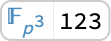
```

```wolfram
a+2/19
(* Output *)
FiniteFieldElement
(* Output *)
(2)/(19)+<|interpretation -> FiniteFieldElement[FiniteField[19, 17, +, 4, #, +, #, ^, 3, &, Polynomial], 96], index -> 123, shortIndex -> 123, indexShortened -> True, characteristic -> 19, shortCharacteristic -> 19, extensionDegree -> 3, field -> FiniteField[...], fieldDisplayed -> False|>
```

Use [Element](https://reference.wolfram.com/language/ref/Element.html) to decide which rational numbers can be identified with field elements:

```wolfram
{Element[7/8,ℱ],Element[2/19,ℱ]}
(* Output *)
{True,False}
```

For the purpose of comparison, rational numbers are identified with field elements:

```wolfram
ℱ[0]==0
(* Output *)
True
```

```wolfram
ℱ[1]==1
(* Output *)
True
```

Elements of different finite fields cannot be combined:

```wolfram
ℱ=FiniteField[389,2];
𝒢=FiniteField[389,4];
```

```wolfram
ℱ[123]-𝒢[123]
(* Output *)
FiniteFieldElement
(* Output *)
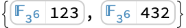
```

Fields with same characteristic and field irreducible but different element representations are allowed:

```wolfram
ℋ=FiniteField[389,Information[ℱ,"FieldIrreducible"],"Exponential"];
```

```wolfram
ℱ[123]-ℋ[123]
(* Output *)
<|interpretation -> FiniteFieldElement[FiniteField[389, 2, +, 379, #, +, #, ^, 2, &, Exponential], 76949], index -> 76949, shortIndex -> 76949, indexShortened -> True, characteristic -> 389, shortCharacteristic -> 389, extensionDegree -> 2, field -> FiniteField[...], fieldDisplayed -> False|>
```

#### Automorphisms and Embeddings

Compute all conjugates of a finite field element:

```wolfram
ℱ=FiniteField[7,5];
a=ℱ[123]
(* Output *)
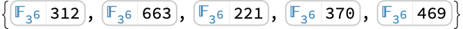
```

```wolfram
conj=Table[FrobeniusAutomorphism[a,i],{i,0,4}]
(* Output *)
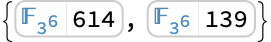
```

The conjugates are roots of the minimal polynomial of `*a*`:

```wolfram
f=MinimalPolynomial[a]
(* Output *)
2+2 #1+3 #1^2+#1^4+#1^5&
```

```wolfram
f/@conj
(* Output *)
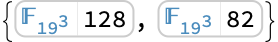
```

The Frobenius automorphism maps $a$ to $a^{p}$:

```wolfram
FrobeniusAutomorphism[a]==a^7
(* Output *)
True
```

Compute an embedding of one finite field in another:

```wolfram
𝒦=FiniteField[29,3];
ℱ=FiniteField[29,6];
emb=FiniteFieldEmbedding[𝒦,ℱ]
(* Output *)
FiniteFieldEmbedding[<|interpretation -> FiniteFieldElement[FiniteField[29, 27, +, 2, #, +, #, ^, 3, &, Polynomial], 01], index -> 29, shortIndex -> 29, indexShortened -> True, characteristic -> 29, shortCharacteristic -> 29, extensionDegree -> 3, field -> FiniteField[...], fieldDisplayed -> False|>-><|interpretation -> FiniteFieldElement[FiniteField[29, 2, +, 13, #, +, 17, #, ^, 2, +, 25, #, ^, 3, +, #, ^, 4, +, #, ^, 6, &, Polynomial], 32217165], index -> 114060686, shortIndex -> 114060686, indexShortened -> True, characteristic -> 29, shortCharacteristic -> 29, extensionDegree -> 6, field -> FiniteField[...], fieldDisplayed -> False|>]
```

Map finite field elements through the embedding:

```wolfram
emb[𝒦[123]]
(* Output *)
<|interpretation -> FiniteFieldElement[FiniteField[29, 2, +, 13, #, +, 17, #, ^, 2, +, 25, #, ^, 3, +, #, ^, 4, +, #, ^, 6, &, Polynomial], 1982628620], index -> 415171675, shortIndex -> 415171675, indexShortened -> True, characteristic -> 29, shortCharacteristic -> 29, extensionDegree -> 6, field -> FiniteField[...], fieldDisplayed -> False|>
```

Embeddings preserve arithmetic operations:

```wolfram
{a,b}={𝒦[345],𝒦[678]};
```

```wolfram
emb[a+b]==emb[a]+emb[b]
(* Output *)
True
```

```wolfram
emb[a b]==emb[a]emb[b]
(* Output *)
True
```

#### Polynomials over Finite Fields

Compute with polynomials over a finite field:

```wolfram
ℱ=FiniteField[11,3];
f=ℱ[1]x^2+ℱ[2]x+ℱ[3];
g=ℱ[12]x^5+ℱ[21]x+ℱ[33];
h=ℱ[321]x^3+ℱ[27]x^2+ℱ[53]x+ℱ[19];
```

Expand products:

```wolfram
fg=Expand[f g]
(* Output *)
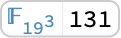
```

```wolfram
gh=Expand[g h]
(* Output *)
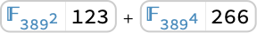
```

Compute the GCD:

```wolfram
gcd=PolynomialGCD[fg,gh]
(* Output *)
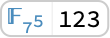
```

Cancel a fraction:

```wolfram
Cancel[gcd/g]
(* Output *)
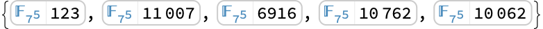
```

Compute quotient and remainder:

```wolfram
{q,r}=PolynomialQuotientRemainder[g,h,x]
(* Output *)

```

```wolfram
Expand[g-q h-r]
(* Output *)
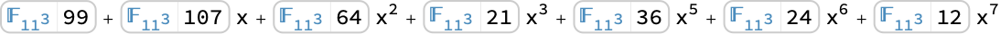
```

Factor a polynomial:

```wolfram
Factor[h]
(* Output *)
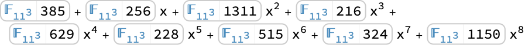
```

Compute a resultant:

```wolfram
Resultant[f,g,x]
(* Output *)
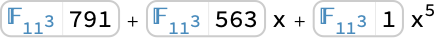
```

Compute with multivariate polynomials:

```wolfram
Expand[(f y+g z)(h z+1)]
(* Output *)

```

```wolfram
Factor[%]
(* Output *)
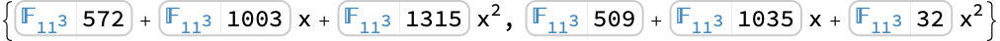
```

```wolfram
Discriminant[f y^2+g y+h,y]
(* Output *)

```

Factor a polynomial over an extension of a finite field:

```wolfram
ℱ=FiniteField[29,3];
f=ℱ[12]x^2+ℱ[34]x+ℱ[56];
```

The polynomial $f$ is irreducible over $\mathcal{F}$:

```wolfram
Factor[f]
(* Output *)
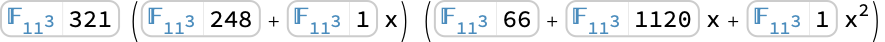
```

Factor $f$ after embedding $\mathcal{F}$ in a larger field $\mathcal{G}$:

```wolfram
𝒢=FiniteField[29,6];
ℰ=FiniteFieldEmbedding[ℱ,𝒢];
```

```wolfram
Factor[f,Extension->ℰ]
(* Output *)

```

#### Linear Algebra over Finite Fields

Products of matrices over a finite field:

```wolfram
a=({{<|interpretation -> FiniteFieldElement[FiniteField[29, 2, +, 15, #, +, 2, #, ^, 2, +, #, ^, 4, &, Polynomial], 12], index -> 12, shortIndex -> 12, indexShortened -> True, characteristic -> 29, shortCharacteristic -> 29, extensionDegree -> 4, field -> FiniteField[...], fieldDisplayed -> False|>, <|interpretation -> FiniteFieldElement[FiniteField[29, 2, +, 15, #, +, 2, #, ^, 2, +, #, ^, 4, &, Polynomial], 23], index -> 23, shortIndex -> 23, indexShortened -> True, characteristic -> 29, shortCharacteristic -> 29, extensionDegree -> 4, field -> FiniteField[...], fieldDisplayed -> False|>, <|interpretation -> FiniteFieldElement[FiniteField[29, 2, +, 15, #, +, 2, #, ^, 2, +, #, ^, 4, &, Polynomial], 51], index -> 34, shortIndex -> 34, indexShortened -> True, characteristic -> 29, shortCharacteristic -> 29, extensionDegree -> 4, field -> FiniteField[...], fieldDisplayed -> False|>}, {<|interpretation -> FiniteFieldElement[FiniteField[29, 2, +, 15, #, +, 2, #, ^, 2, +, #, ^, 4, &, Polynomial], 161], index -> 45, shortIndex -> 45, indexShortened -> True, characteristic -> 29, shortCharacteristic -> 29, extensionDegree -> 4, field -> FiniteField[...], fieldDisplayed -> False|>, <|interpretation -> FiniteFieldElement[FiniteField[29, 2, +, 15, #, +, 2, #, ^, 2, +, #, ^, 4, &, Polynomial], 271], index -> 56, shortIndex -> 56, indexShortened -> True, characteristic -> 29, shortCharacteristic -> 29, extensionDegree -> 4, field -> FiniteField[...], fieldDisplayed -> False|>, <|interpretation -> FiniteFieldElement[FiniteField[29, 2, +, 15, #, +, 2, #, ^, 2, +, #, ^, 4, &, Polynomial], 92], index -> 67, shortIndex -> 67, indexShortened -> True, characteristic -> 29, shortCharacteristic -> 29, extensionDegree -> 4, field -> FiniteField[...], fieldDisplayed -> False|>}, {<|interpretation -> FiniteFieldElement[FiniteField[29, 2, +, 15, #, +, 2, #, ^, 2, +, #, ^, 4, &, Polynomial], 202], index -> 78, shortIndex -> 78, indexShortened -> True, characteristic -> 29, shortCharacteristic -> 29, extensionDegree -> 4, field -> FiniteField[...], fieldDisplayed -> False|>, <|interpretation -> FiniteFieldElement[FiniteField[29, 2, +, 15, #, +, 2, #, ^, 2, +, #, ^, 4, &, Polynomial], 23], index -> 89, shortIndex -> 89, indexShortened -> True, characteristic -> 29, shortCharacteristic -> 29, extensionDegree -> 4, field -> FiniteField[...], fieldDisplayed -> False|>, <|interpretation -> FiniteFieldElement[FiniteField[29, 2, +, 15, #, +, 2, #, ^, 2, +, #, ^, 4, &, Polynomial], 33], index -> 90, shortIndex -> 90, indexShortened -> True, characteristic -> 29, shortCharacteristic -> 29, extensionDegree -> 4, field -> FiniteField[...], fieldDisplayed -> False|>}});b=({{<|interpretation -> FiniteFieldElement[FiniteField[29, 2, +, 15, #, +, 2, #, ^, 2, +, #, ^, 4, &, Polynomial], 74], index -> 123, shortIndex -> 123, indexShortened -> True, characteristic -> 29, shortCharacteristic -> 29, extensionDegree -> 4, field -> FiniteField[...], fieldDisplayed -> False|>, <|interpretation -> FiniteFieldElement[FiniteField[29, 2, +, 15, #, +, 2, #, ^, 2, +, #, ^, 4, &, Polynomial], 28], index -> 234, shortIndex -> 234, indexShortened -> True, characteristic -> 29, shortCharacteristic -> 29, extensionDegree -> 4, field -> FiniteField[...], fieldDisplayed -> False|>}, {<|interpretation -> FiniteFieldElement[FiniteField[29, 2, +, 15, #, +, 2, #, ^, 2, +, #, ^, 4, &, Polynomial], 2611], index -> 345, shortIndex -> 345, indexShortened -> True, characteristic -> 29, shortCharacteristic -> 29, extensionDegree -> 4, field -> FiniteField[...], fieldDisplayed -> False|>, <|interpretation -> FiniteFieldElement[FiniteField[29, 2, +, 15, #, +, 2, #, ^, 2, +, #, ^, 4, &, Polynomial], 2115], index -> 456, shortIndex -> 456, indexShortened -> True, characteristic -> 29, shortCharacteristic -> 29, extensionDegree -> 4, field -> FiniteField[...], fieldDisplayed -> False|>}, {<|interpretation -> FiniteFieldElement[FiniteField[29, 2, +, 15, #, +, 2, #, ^, 2, +, #, ^, 4, &, Polynomial], 1619], index -> 567, shortIndex -> 567, indexShortened -> True, characteristic -> 29, shortCharacteristic -> 29, extensionDegree -> 4, field -> FiniteField[...], fieldDisplayed -> False|>, <|interpretation -> FiniteFieldElement[FiniteField[29, 2, +, 15, #, +, 2, #, ^, 2, +, #, ^, 4, &, Polynomial], 1123], index -> 678, shortIndex -> 678, indexShortened -> True, characteristic -> 29, shortCharacteristic -> 29, extensionDegree -> 4, field -> FiniteField[...], fieldDisplayed -> False|>}});
a.b//MatrixForm
(* Output *)
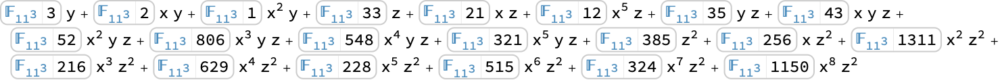
```

This includes powers of a matrix:

```wolfram
MatrixPower[a,123456789]//MatrixForm
(* Output *)
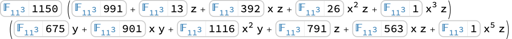
```

Basic matrix properties including determinant:

```wolfram
a=({{<|interpretation -> FiniteFieldElement[FiniteField[29, 2, +, 15, #, +, 2, #, ^, 2, +, #, ^, 4, &, Polynomial], 12], index -> 12, shortIndex -> 12, indexShortened -> True, characteristic -> 29, shortCharacteristic -> 29, extensionDegree -> 4, field -> FiniteField[...], fieldDisplayed -> False|>, <|interpretation -> FiniteFieldElement[FiniteField[29, 2, +, 15, #, +, 2, #, ^, 2, +, #, ^, 4, &, Polynomial], 23], index -> 23, shortIndex -> 23, indexShortened -> True, characteristic -> 29, shortCharacteristic -> 29, extensionDegree -> 4, field -> FiniteField[...], fieldDisplayed -> False|>, <|interpretation -> FiniteFieldElement[FiniteField[29, 2, +, 15, #, +, 2, #, ^, 2, +, #, ^, 4, &, Polynomial], 51], index -> 34, shortIndex -> 34, indexShortened -> True, characteristic -> 29, shortCharacteristic -> 29, extensionDegree -> 4, field -> FiniteField[...], fieldDisplayed -> False|>}, {<|interpretation -> FiniteFieldElement[FiniteField[29, 2, +, 15, #, +, 2, #, ^, 2, +, #, ^, 4, &, Polynomial], 161], index -> 45, shortIndex -> 45, indexShortened -> True, characteristic -> 29, shortCharacteristic -> 29, extensionDegree -> 4, field -> FiniteField[...], fieldDisplayed -> False|>, <|interpretation -> FiniteFieldElement[FiniteField[29, 2, +, 15, #, +, 2, #, ^, 2, +, #, ^, 4, &, Polynomial], 271], index -> 56, shortIndex -> 56, indexShortened -> True, characteristic -> 29, shortCharacteristic -> 29, extensionDegree -> 4, field -> FiniteField[...], fieldDisplayed -> False|>, <|interpretation -> FiniteFieldElement[FiniteField[29, 2, +, 15, #, +, 2, #, ^, 2, +, #, ^, 4, &, Polynomial], 92], index -> 67, shortIndex -> 67, indexShortened -> True, characteristic -> 29, shortCharacteristic -> 29, extensionDegree -> 4, field -> FiniteField[...], fieldDisplayed -> False|>}, {<|interpretation -> FiniteFieldElement[FiniteField[29, 2, +, 15, #, +, 2, #, ^, 2, +, #, ^, 4, &, Polynomial], 202], index -> 78, shortIndex -> 78, indexShortened -> True, characteristic -> 29, shortCharacteristic -> 29, extensionDegree -> 4, field -> FiniteField[...], fieldDisplayed -> False|>, <|interpretation -> FiniteFieldElement[FiniteField[29, 2, +, 15, #, +, 2, #, ^, 2, +, #, ^, 4, &, Polynomial], 23], index -> 89, shortIndex -> 89, indexShortened -> True, characteristic -> 29, shortCharacteristic -> 29, extensionDegree -> 4, field -> FiniteField[...], fieldDisplayed -> False|>, <|interpretation -> FiniteFieldElement[FiniteField[29, 2, +, 15, #, +, 2, #, ^, 2, +, #, ^, 4, &, Polynomial], 33], index -> 90, shortIndex -> 90, indexShortened -> True, characteristic -> 29, shortCharacteristic -> 29, extensionDegree -> 4, field -> FiniteField[...], fieldDisplayed -> False|>}});
Det[a]
(* Output *)
<|interpretation -> FiniteFieldElement[FiniteField[29, 2, +, 15, #, +, 2, #, ^, 2, +, #, ^, 4, &, Polynomial], 524261], index -> 46956, shortIndex -> 46956, indexShortened -> True, characteristic -> 29, shortCharacteristic -> 29, extensionDegree -> 4, field -> FiniteField[...], fieldDisplayed -> False|>
```

Compute the inverse:

```wolfram
Inverse[a]//MatrixForm
(* Output *)
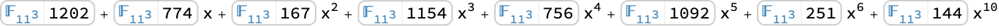
```

Verify the inverse:

```wolfram
%.a//MatrixForm
(* Output *)
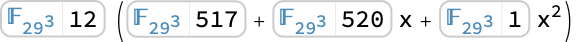
```

The characteristic polynomial of a matrix:

```wolfram
CharacteristicPolynomial[a,x]
(* Output *)
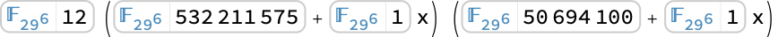
```

Verify the polynomial satisfies the Cayley-Hamilton theorem:

```wolfram
CoefficientList[%,x].(MatrixPower[a,#]&/@Range[0,3])//MatrixForm
(* Output *)
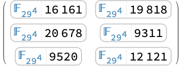
```

Compute the rank and the null space of a matrix:

```wolfram
c=({{<|interpretation -> FiniteFieldElement[FiniteField[29, 2, +, 15, #, +, 2, #, ^, 2, +, #, ^, 4, &, Polynomial], 16131], index -> 1234, shortIndex -> 1234, indexShortened -> True, characteristic -> 29, shortCharacteristic -> 29, extensionDegree -> 4, field -> FiniteField[...], fieldDisplayed -> False|>, <|interpretation -> FiniteFieldElement[FiniteField[29, 2, +, 15, #, +, 2, #, ^, 2, +, #, ^, 4, &, Polynomial], 25222], index -> 2345, shortIndex -> 2345, indexShortened -> True, characteristic -> 29, shortCharacteristic -> 29, extensionDegree -> 4, field -> FiniteField[...], fieldDisplayed -> False|>, <|interpretation -> FiniteFieldElement[FiniteField[29, 2, +, 15, #, +, 2, #, ^, 2, +, #, ^, 4, &, Polynomial], 534], index -> 3456, shortIndex -> 3456, indexShortened -> True, characteristic -> 29, shortCharacteristic -> 29, extensionDegree -> 4, field -> FiniteField[...], fieldDisplayed -> False|>, <|interpretation -> FiniteFieldElement[FiniteField[29, 2, +, 15, #, +, 2, #, ^, 2, +, #, ^, 4, &, Polynomial], 14125], index -> 4567, shortIndex -> 4567, indexShortened -> True, characteristic -> 29, shortCharacteristic -> 29, extensionDegree -> 4, field -> FiniteField[...], fieldDisplayed -> False|>}, {<|interpretation -> FiniteFieldElement[FiniteField[29, 2, +, 15, #, +, 2, #, ^, 2, +, #, ^, 4, &, Polynomial], 23216], index -> 5678, shortIndex -> 5678, indexShortened -> True, characteristic -> 29, shortCharacteristic -> 29, extensionDegree -> 4, field -> FiniteField[...], fieldDisplayed -> False|>, <|interpretation -> FiniteFieldElement[FiniteField[29, 2, +, 15, #, +, 2, #, ^, 2, +, #, ^, 4, &, Polynomial], 328], index -> 6789, shortIndex -> 6789, indexShortened -> True, characteristic -> 29, shortCharacteristic -> 29, extensionDegree -> 4, field -> FiniteField[...], fieldDisplayed -> False|>, <|interpretation -> FiniteFieldElement[FiniteField[29, 2, +, 15, #, +, 2, #, ^, 2, +, #, ^, 4, &, Polynomial], 2119], index -> 7890, shortIndex -> 7890, indexShortened -> True, characteristic -> 29, shortCharacteristic -> 29, extensionDegree -> 4, field -> FiniteField[...], fieldDisplayed -> False|>, <|interpretation -> FiniteFieldElement[FiniteField[29, 2, +, 15, #, +, 2, #, ^, 2, +, #, ^, 4, &, Polynomial], 271610], index -> 8901, shortIndex -> 8901, indexShortened -> True, characteristic -> 29, shortCharacteristic -> 29, extensionDegree -> 4, field -> FiniteField[...], fieldDisplayed -> False|>}});
```

```wolfram
MatrixRank[c]
(* Output *)
2
```

```wolfram
NullSpace[c]//MatrixForm
(* Output *)
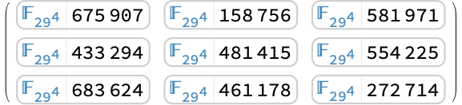
```

```wolfram
c.Transpose[%]//MatrixForm
(* Output *)
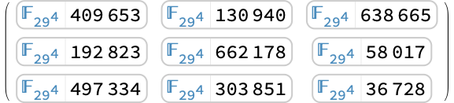
```

Row reduce a matrix:

```wolfram
RowReduce[c]//MatrixForm
(* Output *)
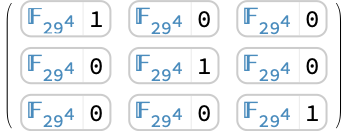
```

Solve linear equations:

```wolfram
a=({{<|interpretation -> FiniteFieldElement[FiniteField[29, 2, +, 15, #, +, 2, #, ^, 2, +, #, ^, 4, &, Polynomial], 12], index -> 12, shortIndex -> 12, indexShortened -> True, characteristic -> 29, shortCharacteristic -> 29, extensionDegree -> 4, field -> FiniteField[...], fieldDisplayed -> False|>, <|interpretation -> FiniteFieldElement[FiniteField[29, 2, +, 15, #, +, 2, #, ^, 2, +, #, ^, 4, &, Polynomial], 23], index -> 23, shortIndex -> 23, indexShortened -> True, characteristic -> 29, shortCharacteristic -> 29, extensionDegree -> 4, field -> FiniteField[...], fieldDisplayed -> False|>, <|interpretation -> FiniteFieldElement[FiniteField[29, 2, +, 15, #, +, 2, #, ^, 2, +, #, ^, 4, &, Polynomial], 51], index -> 34, shortIndex -> 34, indexShortened -> True, characteristic -> 29, shortCharacteristic -> 29, extensionDegree -> 4, field -> FiniteField[...], fieldDisplayed -> False|>}, {<|interpretation -> FiniteFieldElement[FiniteField[29, 2, +, 15, #, +, 2, #, ^, 2, +, #, ^, 4, &, Polynomial], 161], index -> 45, shortIndex -> 45, indexShortened -> True, characteristic -> 29, shortCharacteristic -> 29, extensionDegree -> 4, field -> FiniteField[...], fieldDisplayed -> False|>, <|interpretation -> FiniteFieldElement[FiniteField[29, 2, +, 15, #, +, 2, #, ^, 2, +, #, ^, 4, &, Polynomial], 271], index -> 56, shortIndex -> 56, indexShortened -> True, characteristic -> 29, shortCharacteristic -> 29, extensionDegree -> 4, field -> FiniteField[...], fieldDisplayed -> False|>, <|interpretation -> FiniteFieldElement[FiniteField[29, 2, +, 15, #, +, 2, #, ^, 2, +, #, ^, 4, &, Polynomial], 92], index -> 67, shortIndex -> 67, indexShortened -> True, characteristic -> 29, shortCharacteristic -> 29, extensionDegree -> 4, field -> FiniteField[...], fieldDisplayed -> False|>}, {<|interpretation -> FiniteFieldElement[FiniteField[29, 2, +, 15, #, +, 2, #, ^, 2, +, #, ^, 4, &, Polynomial], 202], index -> 78, shortIndex -> 78, indexShortened -> True, characteristic -> 29, shortCharacteristic -> 29, extensionDegree -> 4, field -> FiniteField[...], fieldDisplayed -> False|>, <|interpretation -> FiniteFieldElement[FiniteField[29, 2, +, 15, #, +, 2, #, ^, 2, +, #, ^, 4, &, Polynomial], 23], index -> 89, shortIndex -> 89, indexShortened -> True, characteristic -> 29, shortCharacteristic -> 29, extensionDegree -> 4, field -> FiniteField[...], fieldDisplayed -> False|>, <|interpretation -> FiniteFieldElement[FiniteField[29, 2, +, 15, #, +, 2, #, ^, 2, +, #, ^, 4, &, Polynomial], 33], index -> 90, shortIndex -> 90, indexShortened -> True, characteristic -> 29, shortCharacteristic -> 29, extensionDegree -> 4, field -> FiniteField[...], fieldDisplayed -> False|>}});b=({{<|interpretation -> FiniteFieldElement[FiniteField[29, 2, +, 15, #, +, 2, #, ^, 2, +, #, ^, 4, &, Polynomial], 74], index -> 123, shortIndex -> 123, indexShortened -> True, characteristic -> 29, shortCharacteristic -> 29, extensionDegree -> 4, field -> FiniteField[...], fieldDisplayed -> False|>, <|interpretation -> FiniteFieldElement[FiniteField[29, 2, +, 15, #, +, 2, #, ^, 2, +, #, ^, 4, &, Polynomial], 28], index -> 234, shortIndex -> 234, indexShortened -> True, characteristic -> 29, shortCharacteristic -> 29, extensionDegree -> 4, field -> FiniteField[...], fieldDisplayed -> False|>}, {<|interpretation -> FiniteFieldElement[FiniteField[29, 2, +, 15, #, +, 2, #, ^, 2, +, #, ^, 4, &, Polynomial], 2611], index -> 345, shortIndex -> 345, indexShortened -> True, characteristic -> 29, shortCharacteristic -> 29, extensionDegree -> 4, field -> FiniteField[...], fieldDisplayed -> False|>, <|interpretation -> FiniteFieldElement[FiniteField[29, 2, +, 15, #, +, 2, #, ^, 2, +, #, ^, 4, &, Polynomial], 2115], index -> 456, shortIndex -> 456, indexShortened -> True, characteristic -> 29, shortCharacteristic -> 29, extensionDegree -> 4, field -> FiniteField[...], fieldDisplayed -> False|>}, {<|interpretation -> FiniteFieldElement[FiniteField[29, 2, +, 15, #, +, 2, #, ^, 2, +, #, ^, 4, &, Polynomial], 1619], index -> 567, shortIndex -> 567, indexShortened -> True, characteristic -> 29, shortCharacteristic -> 29, extensionDegree -> 4, field -> FiniteField[...], fieldDisplayed -> False|>, <|interpretation -> FiniteFieldElement[FiniteField[29, 2, +, 15, #, +, 2, #, ^, 2, +, #, ^, 4, &, Polynomial], 1123], index -> 678, shortIndex -> 678, indexShortened -> True, characteristic -> 29, shortCharacteristic -> 29, extensionDegree -> 4, field -> FiniteField[...], fieldDisplayed -> False|>}});
(x=LinearSolve[a,b])//MatrixForm
(* Output *)
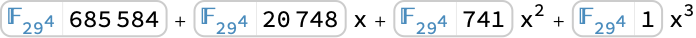
```

Verify the result:

```wolfram
a.x===b
(* Output *)
True
```

Compute the LU decomposition of `a`:

```wolfram
{l,u,p,cn}=LUDecomposition[a]
(* Output *)
{LowerTriangularMatrix[...],UpperTriangularMatrix[...],PermutationMatrix[...],0}
```

Verify the decomposition:

```wolfram
l.u===p.a
(* Output *)
True
```

Reconstruct the solution `x` using the efficient forward and back substitution of triangular matrices:

```wolfram
x==LinearSolve[u,LinearSolve[l,p.b]]
(* Output *)
True
```

#### Equations over Finite Fields

Solve equations over a finite field:

```wolfram
ℱ=FiniteField[7,5];
```

Univariate equations:

```wolfram
Solve[x^5+ℱ[123]x==ℱ[127],x]
(* Output *)
{{x-><|interpretation -> FiniteFieldElement[FiniteField[7, 4, +, #, +, #, ^, 5, &, Polynomial], 165], index -> 288, shortIndex -> 288, indexShortened -> True, characteristic -> 7, shortCharacteristic -> 7, extensionDegree -> 5, field -> FiniteField[...], fieldDisplayed -> False|>}}
```

```wolfram
Reduce[x^9+5 x+3==0,x,ℱ]
(* Output *)
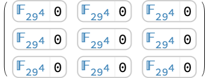
```

Systems of linear equations:

```wolfram
Solve[ℱ[123]x+ℱ[234]y==ℱ[345]&&ℱ[321]x+ℱ[432]y==ℱ[543],{x,y}]
(* Output *)
{{x-><|interpretation -> FiniteFieldElement[FiniteField[7, 4, +, #, +, #, ^, 5, &, Polynomial], 61225], index -> 12802, shortIndex -> 12802, indexShortened -> True, characteristic -> 7, shortCharacteristic -> 7, extensionDegree -> 5, field -> FiniteField[...], fieldDisplayed -> False|>,y-><|interpretation -> FiniteFieldElement[FiniteField[7, 4, +, #, +, #, ^, 5, &, Polynomial], 1066], index -> 2353, shortIndex -> 2353, indexShortened -> True, characteristic -> 7, shortCharacteristic -> 7, extensionDegree -> 5, field -> FiniteField[...], fieldDisplayed -> False|>}}
```

```wolfram
Reduce[ℱ[1234]x+ℱ[2345]y+ℱ[3456]z==ℱ[4567]&&ℱ[1]x+ℱ[2]y+ℱ[3]z==ℱ[4],{x,y,z}]
(* Output *)
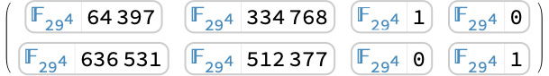
```

Systems of polynomial equations:

```wolfram
Solve[x^2+y^2==3&&x^5+y^5==5,{x,y},ℱ]
(* Output *)
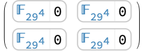
```

```wolfram
Reduce[ℱ[123]x^2+ℱ[234]y^3+ℱ[345]z^4==ℱ[456]&&ℱ[21]x+ℱ[32]y^2+ℱ[43]z^3==ℱ[54]&&x y z==ℱ[1],{x,y,z}]
(* Output *)
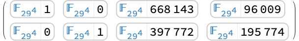
```

Find solution instances:

```wolfram
FindInstance[x^2+y^2+z^2==21,{x,y,z},ℱ]
(* Output *)
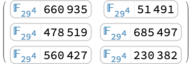
```

```wolfram
FindInstance[ℱ[321]x^3+ℱ[432]y^3+ℱ[543]z^3==ℱ[654]&&x^2==ℱ[333]y z+ℱ[111],{x,y,z},3]
(* Output *)
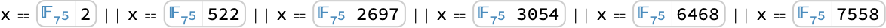
```

Eliminate quantifiers:

```wolfram
Resolve[Exists[z,ℱ[111]x+ℱ[222]y+ℱ[333]z==ℱ[444]&&ℱ[555]x+ℱ[666]y+ℱ[777]z==ℱ[888]]]
(* Output *)
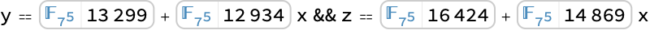
```

```wolfram
𝒦=FiniteField[2,5];
```

```wolfram
Resolve[Exists[{y,z},𝒦[1]x^2+𝒦[2]y^3+𝒦[3]z^4==𝒦[4]&&𝒦[5]x^4+𝒦[6]y^3+𝒦[7]z^2==𝒦[8]&&x y z!=𝒦[0]]]
(* Output *)
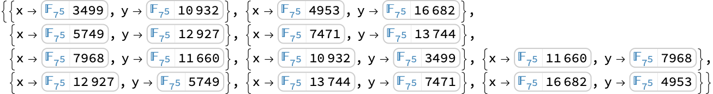
```

### Applications

Implement an error-correcting code. The $(n,k)=(2^{m}-1,2^{m}-m-1)$ Hamming code encodes a $k$-bit message in an $n$-bit sequence and is able to correct up to one error:

```wolfram
m=5;
n=2^m-1;
k=n-m;
```

Let $\mathcal{F}$ be a finite field with $2^{m}$ elements using the exponential element representation, let $f(x)$ be the irreducible polynomial used to construct $\mathcal{F}$, and let $\theta$ be the generator of $\mathcal{F}$:

```wolfram
ℱ=FiniteField[2,m,"Exponential"];
f=Information[ℱ,"FieldIrreducible"][x];
θ=ℱ[{0,1}]
(* Output *)
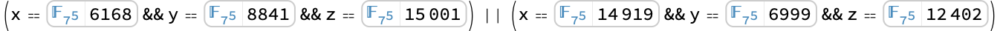
```

The encoded message is the coefficient list of $w(x)=f(x) v(x)\in \mathbb{Z}_{2}[x]$, where the coefficient list of $v(x)$ is the original message:

```wolfram
encode[kbits_]:=PadRight[Mod[CoefficientList[f(kbits.x^Range[0,k-1]),x],2],n]
```

```wolfram
msg=Table[RandomInteger[],{k}]
(* Output *)
{1,0,1,0,0,0,1,0,0,0,1,1,0,1,1,0,1,1,0,0,0,1,0,1,0,0}
```

```wolfram
enc=encode[msg]
(* Output *)
{1,0,0,0,1,1,1,1,1,0,1,0,1,0,1,0,1,1,0,0,0,0,1,0,0,1,1,0,1,0,0}
```

Let $t(x)$ be the polynomial whose coefficient list is the received message:

```wolfram
t[nbits_,x_]:=nbits.x^Range[0,n-1]
```

If the received message contains no errors, then $t(x)=w(x)$, and hence $t(\theta)=0$:

```wolfram
t[enc,θ]
(* Output *)
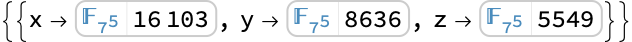
```

If the received message contains one error in position $p$, then $t(x)=w(x)+x^{p-1}$, and hence $t(\theta)=\theta^{p-1}$:

```wolfram
err=ReplaceAt[enc,e_:>1-e,RandomInteger[{1,n}]]
(* Output *)
{1,0,0,0,1,1,0,1,1,0,1,0,1,0,1,0,1,1,0,0,0,0,1,0,0,1,1,0,1,0,0}
```

```wolfram
t[err,θ]
(* Output *)
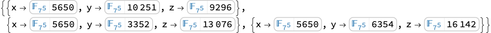
```

Check and correct the received message:

```wolfram
correct[nbits_]:=
With[{ep=t[nbits,θ]},
If[ep==0,
nbits,
ReplaceAt[nbits,e_:>1-e,ep["Index"]]]]
```

```wolfram
correct[err]===enc
(* Output *)
True
```

To decode the message, compute the coefficient list of $v(x)=w(x)/f(x)$:

```wolfram
decode[nbits_]:=PadRight[CoefficientList[PolynomialQuotient[nbits.x^Range[0,n-1],f,x,Modulus->2],x],k]
```

The decoded message is correct when the received message has no errors or one error:

```wolfram
decode[correct[enc]]===msg
(* Output *)
True
```

```wolfram
decode[correct[err]]===msg
(* Output *)
True
```

Construct $q-1$ orthogonal Latin squares of order $q$ for any prime power $q$. A Latin square of order $q$ is a $q  \times q$ array such that each row and each column contains every element of a set of $q$ elements exactly once. A pair of Latin squares is said to be orthogonal if the $q^{2}$ pairs formed by juxtaposing the two arrays are all distinct:

```wolfram
q=9;
ℱ=FiniteField[3,2];
squares=Table[Table[(ℱ[k]ℱ[i-1]+ℱ[j-1])["Index"]+1,{i,q},{j,q}],{k,q-1}];
MatrixForm/@squares
(* Output *)
{({{1, 2, 3, 4, 5, 6, 7, 8, 9}, {2, 3, 1, 5, 6, 4, 8, 9, 7}, {3, 1, 2, 6, 4, 5, 9, 7, 8}, {4, 5, 6, 7, 8, 9, 1, 2, 3}, {5, 6, 4, 8, 9, 7, 2, 3, 1}, {6, 4, 5, 9, 7, 8, 3, 1, 2}, {7, 8, 9, 1, 2, 3, 4, 5, 6}, {8, 9, 7, 2, 3, 1, 5, 6, 4}, {9, 7, 8, 3, 1, 2, 6, 4, 5}}),({{1, 2, 3, 4, 5, 6, 7, 8, 9}, {3, 1, 2, 6, 4, 5, 9, 7, 8}, {2, 3, 1, 5, 6, 4, 8, 9, 7}, {7, 8, 9, 1, 2, 3, 4, 5, 6}, {9, 7, 8, 3, 1, 2, 6, 4, 5}, {8, 9, 7, 2, 3, 1, 5, 6, 4}, {4, 5, 6, 7, 8, 9, 1, 2, 3}, {6, 4, 5, 9, 7, 8, 3, 1, 2}, {5, 6, 4, 8, 9, 7, 2, 3, 1}}),({{1, 2, 3, 4, 5, 6, 7, 8, 9}, {4, 5, 6, 7, 8, 9, 1, 2, 3}, {7, 8, 9, 1, 2, 3, 4, 5, 6}, {5, 6, 4, 8, 9, 7, 2, 3, 1}, {8, 9, 7, 2, 3, 1, 5, 6, 4}, {2, 3, 1, 5, 6, 4, 8, 9, 7}, {9, 7, 8, 3, 1, 2, 6, 4, 5}, {3, 1, 2, 6, 4, 5, 9, 7, 8}, {6, 4, 5, 9, 7, 8, 3, 1, 2}}),({{1, 2, 3, 4, 5, 6, 7, 8, 9}, {5, 6, 4, 8, 9, 7, 2, 3, 1}, {9, 7, 8, 3, 1, 2, 6, 4, 5}, {8, 9, 7, 2, 3, 1, 5, 6, 4}, {3, 1, 2, 6, 4, 5, 9, 7, 8}, {4, 5, 6, 7, 8, 9, 1, 2, 3}, {6, 4, 5, 9, 7, 8, 3, 1, 2}, {7, 8, 9, 1, 2, 3, 4, 5, 6}, {2, 3, 1, 5, 6, 4, 8, 9, 7}}),({{1, 2, 3, 4, 5, 6, 7, 8, 9}, {6, 4, 5, 9, 7, 8, 3, 1, 2}, {8, 9, 7, 2, 3, 1, 5, 6, 4}, {2, 3, 1, 5, 6, 4, 8, 9, 7}, {4, 5, 6, 7, 8, 9, 1, 2, 3}, {9, 7, 8, 3, 1, 2, 6, 4, 5}, {3, 1, 2, 6, 4, 5, 9, 7, 8}, {5, 6, 4, 8, 9, 7, 2, 3, 1}, {7, 8, 9, 1, 2, 3, 4, 5, 6}}),({{1, 2, 3, 4, 5, 6, 7, 8, 9}, {7, 8, 9, 1, 2, 3, 4, 5, 6}, {4, 5, 6, 7, 8, 9, 1, 2, 3}, {9, 7, 8, 3, 1, 2, 6, 4, 5}, {6, 4, 5, 9, 7, 8, 3, 1, 2}, {3, 1, 2, 6, 4, 5, 9, 7, 8}, {5, 6, 4, 8, 9, 7, 2, 3, 1}, {2, 3, 1, 5, 6, 4, 8, 9, 7}, {8, 9, 7, 2, 3, 1, 5, 6, 4}}),({{1, 2, 3, 4, 5, 6, 7, 8, 9}, {8, 9, 7, 2, 3, 1, 5, 6, 4}, {6, 4, 5, 9, 7, 8, 3, 1, 2}, {3, 1, 2, 6, 4, 5, 9, 7, 8}, {7, 8, 9, 1, 2, 3, 4, 5, 6}, {5, 6, 4, 8, 9, 7, 2, 3, 1}, {2, 3, 1, 5, 6, 4, 8, 9, 7}, {9, 7, 8, 3, 1, 2, 6, 4, 5}, {4, 5, 6, 7, 8, 9, 1, 2, 3}}),({{1, 2, 3, 4, 5, 6, 7, 8, 9}, {9, 7, 8, 3, 1, 2, 6, 4, 5}, {5, 6, 4, 8, 9, 7, 2, 3, 1}, {6, 4, 5, 9, 7, 8, 3, 1, 2}, {2, 3, 1, 5, 6, 4, 8, 9, 7}, {7, 8, 9, 1, 2, 3, 4, 5, 6}, {8, 9, 7, 2, 3, 1, 5, 6, 4}, {4, 5, 6, 7, 8, 9, 1, 2, 3}, {3, 1, 2, 6, 4, 5, 9, 7, 8}})}
```

Verify that all arrays are Latin squares:

```wolfram
latinQ[a_]:=Union[Sort/@Join[a,Transpose[a]]]==={Range[q]}
```

```wolfram
latinQ/@squares
(* Output *)
{True,True,True,True,True,True,True,True}
```

Verify that all pairs of arrays are orthogonal:

```wolfram
orthogonalQ[a_,b_]:=Length[Union[Transpose[{Flatten[a],Flatten[b]}]]]==q^2
```

```wolfram
orthogonalQ@@@Subsets[squares,{2}]
(* Output *)
{True,True,True,True,True,True,True,True,True,True,True,True,True,True,True,True,True,True,True,True,True,True,True,True,True,True,True,True}
```

A finite set $\{a_{1},\ldots,a_{n}\}$ of integers is a Sidon set if the sums $a_{i}+a_{j}$ for $1 \leq i \leq j \leq n$ are all distinct. Construct a Sidon set of $q$ integers in $[1,q^{2}-1]$, for a prime power $q$:

```wolfram
sidon[q_]:=
Module[{ff,g},
ff=FiniteField[q^2,"Exponential"];
g=ff[2];Prepend[Select[Range[q^2-1],Mod[(g^#-g)["Index"]-1,q+1]==0&],1]]
```

```wolfram
q=27;
a=sidon[q]
(* Output *)
{1,45,123,143,144,211,237,244,275,334,385,391,400,414,439,509,520,550,567,569,572,585,612,622,646,654,658}
```

Verify that $a$ is a Sidon set of length $q$:

```wolfram
Length[a]==q
(* Output *)
True
```

```wolfram
sums=Join@@Table[a[[i]]+a[[j]],{j,q},{i,j}];
```

```wolfram
Length[sums]==Length[Union[sums]]==q(q+1)/2
(* Output *)
True
```

A de Bruijn sequence of order $n$ for an alphabet with $q$ letters is a cyclic sequence $s$ of $q^{n}$ letters of the alphabet, such that every sequence of $n$ letters appears exactly once as a subsequence of $s$. Construct a de Bruijn sequence of order $n$ for an alphabet with $q$ letters, for a prime power $q$:

```wolfram
deBruijn[q_,n_]:=
Module[{f1,f2,emb,s,p},
f1=FiniteField[q,"Exponential"];
f2=FiniteField[q^n,"Exponential"];
emb=FiniteFieldEmbedding[f1,f2];
s=FiniteFieldIndex[emb["Projection"][FromFiniteFieldIndex[Range[q^n-1],f2]]];
p=SequencePosition[s,Table[0,{n-1}]][[1,1]];
Insert[s,0,p]]
```

```wolfram
q=8;n=3;
s=deBruijn[q,n]
(* Output *)
{1,3,5,5,2,6,2,2,3,4,4,3,3,5,3,1,5,0,7,6,7,2,5,1,5,4,2,4,5,4,1,3,2,0,0,0,4,6,3,4,1,6,7,3,4,2,0,1,6,2,7,7,7,3,0,7,3,2,5,7,0,1,5,5,0,3,4,0,4,0,7,7,5,4,3,5,7,7,4,1,4,4,5,6,6,5,5,7,5,3,7,0,2,1,2,4,7,3,7,6,4,6,7,6,3,5,4,0,0,6,1,5,6,3,1,2,5,6,4,0,3,1,4,2,2,2,5,0,2,5,4,7,2,0,3,7,7,0,5,6,0,6,0,2,2,7,6,5,7,2,2,6,3,6,6,7,1,1,7,7,2,7,5,2,0,4,3,4,6,2,5,2,1,6,1,2,1,5,7,6,0,0,1,3,7,1,5,3,4,7,1,6,0,5,3,6,4,4,4,7,0,4,7,6,2,4,0,5,2,2,0,7,1,0,1,0,4,4,2,1,7,2,4,4,1,5,1,1,2,3,3,2,2,4,2,7,4,0,6,5,6,1,4,7,4,3,1,3,4,3,7,2,1,0,0,3,5,2,3,7,5,6,2,3,1,0,7,5,1,6,6,6,2,0,6,2,1,4,6,0,7,4,4,0,2,3,0,3,0,6,6,4,3,2,4,6,6,3,7,3,3,4,5,5,4,4,6,4,2,6,0,1,7,1,3,6,2,6,5,3,5,6,5,2,4,3,0,0,5,7,4,5,2,7,1,4,5,3,0,2,7,3,1,1,1,4,0,1,4,3,6,1,0,2,6,6,0,4,5,0,5,0,1,1,6,5,4,6,1,1,5,2,5,5,6,7,7,6,6,1,6,4,1,0,3,2,3,5,1,4,1,7,5,7,1,7,4,6,5,0,0,7,2,6,7,4,2,3,6,7,5,0,4,2,5,3,3,3,6,0,3,6,5,1,3,0,4,1,1,0,6,7,0,7,0,3,3,1,7,6,1,3,3,7,4,7,7,1,2,2,1,1,3,1,6,3,0,5,4,5,7,3,6,3,2,7,2,3,2,6,1,7,0,0,2,4,1,2,6,4,5,1,2,7,0,6,4,7,5,5,5,1,0,5,1,7,3,5,0,6,3,3,0,1,2,0,2,0,5,5,3,2}
```

Verify that $s$ is a de Bruijn sequence of order $l$ for an alphabet with $q$ letters:

```wolfram
Sort[Partition[s,n,1,1]]===Tuples[Range[0,q-1],n]
(* Output *)
True
```

An $n  \times n$ matrix $H$ is a Hadamard matrix if all entries of $H$ are $-1$ or $1$ and $H.H=n I_{n}$. Construct a Hadamard matrix of order $n=q+1$ for any prime power $q$ with $q \equiv 3$:

```wolfram
ξ[e_]:=If[Head[Sqrt[e]]===FiniteFieldElement,1,-1]
h[0,_,_]:=1
h[_,0,_]:=1
h[i_,j_,ff_]:=If[i==j,-1,ξ[ff[j-1]-ff[i-1]]]
```

```wolfram
q=7^3;
ℱ=FiniteField[7,3];
(H=Table[h[i,j,ℱ],{i,0,q},{j,0,q}])//MatrixPlot
```

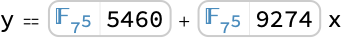

```wolfram
Union[Flatten[H]]
(* Output *)
{-1,1}
```

```wolfram
H.Transpose[H]===(q+1)IdentityMatrix[q+1]
(* Output *)
True
```

Implement the Rijndael S-box step used in the Advanced Encryption Standard (AES) algorithm. The first part, called the Nyberg S-box, uses multiplicative inverse in $F256$:

```wolfram
F256=FiniteField[2,#^8+#^4+#^3+#+1&]
(* Output *)
FiniteField[...]
```

```wolfram
NybergSbox[byte_]:=Piecewise[{{(F256[byte]^(-1))["Index"],byte!=0}},0]
```

The second part involves an affine transformation over $F2$:

```wolfram
F2=FiniteField[2];
a=Map[F2,{{1,0,0,0,1,1,1,1},{1,1,0,0,0,1,1,1},{1,1,1,0,0,0,1,1},{1,1,1,1,0,0,0,1},{1,1,1,1,1,0,0,0},{0,1,1,1,1,1,0,0},{0,0,1,1,1,1,1,0},{0,0,0,1,1,1,1,1}},{2}];
b=F2/@{1,1,0,0,0,1,1,0};
affine[byte_]:=FromDigits[Reverse[FiniteFieldIndex[a.Reverse[IntegerDigits[byte,2,8]]+b]],2]
```

The forward S-box is the composition of the two parts:

```wolfram
ForwardSbox[byte_]:=affine[NybergSbox[byte]]
```

Compute the forward S-box table in the hexadecimal notation:

```wolfram
tohex[byte_]:=StringJoin@@(FromCharacterCode[If[#<=9,#+48,#+87]]&/@IntegerDigits[byte,16,2])
```

```wolfram
Table[tohex[ForwardSbox[16i+j]],{i,0,15},{j,0,15}]//MatrixForm
(* Output *)
({{"63", "7c", "77", "7b", f2, "6b", "6f", c5, "30", "01", "67", "2b", fe, d7, ab, "76"}, {ca, "82", c9, "7d", fa, "59", "47", f0, ad, d4, a2, af, "9c", a4, "72", c0}, {b7, fd, "93", "26", "36", "3f", f7, cc, "34", a5, e5, f1, "71", d8, "31", "15"}, {"04", c7, "23", c3, "18", "96", "05", "9a", "07", "12", "80", e2, eb, "27", b2, "75"}, {"09", "83", "2c", "1a", "1b", "6e", "5a", a0, "52", "3b", d6, b3, "29", e3, "2f", "84"}, {"53", d1, "00", ed, "20", fc, b1, "5b", "6a", cb, be, "39", "4a", "4c", "58", cf}, {d0, ef, aa, fb, "43", "4d", "33", "85", "45", f9, "02", "7f", "50", "3c", "9f", a8}, {"51", a3, "40", "8f", "92", "9d", "38", f5, bc, b6, da, "21", "10", ff, f3, d2}, {cd, "0c", "13", ec, "5f", "97", "44", "17", c4, a7, "7e", "3d", "64", "5d", "19", "73"}, {"60", "81", "4f", dc, "22", "2a", "90", "88", "46", ee, b8, "14", de, "5e", "0b", db}, {e0, "32", "3a", "0a", "49", "06", "24", "5c", c2, d3, ac, "62", "91", "95", e4, "79"}, {e7, c8, "37", "6d", "8d", d5, "4e", a9, "6c", "56", f4, ea, "65", "7a", ae, "08"}, {ba, "78", "25", "2e", "1c", a6, b4, c6, e8, dd, "74", "1f", "4b", bd, "8b", "8a"}, {"70", "3e", b5, "66", "48", "03", f6, "0e", "61", "35", "57", b9, "86", c1, "1d", "9e"}, {e1, f8, "98", "11", "69", d9, "8e", "94", "9b", "1e", "87", e9, ce, "55", "28", df}, {"8c", a1, "89", "0d", bf, e6, "42", "68", "41", "99", "2d", "0f", b0, "54", bb, "16"}})
```

Define the inverse S-box transformation:

```wolfram
ainv=Inverse[a];
affineinv[byte_]:=FromDigits[Reverse[FiniteFieldIndex[ainv.(Reverse[IntegerDigits[byte,2,8]]-b)]],2]
```

```wolfram
InverseSbox[byte_]:=NybergSbox[affineinv[byte]]
```

Compute the inverse S-box table in the hexadecimal notation:

```wolfram
Table[tohex[InverseSbox[16i+j]],{i,0,15},{j,0,15}]//MatrixForm
(* Output *)
({{"52", "09", "6a", d5, "30", "36", a5, "38", bf, "40", a3, "9e", "81", f3, d7, fb}, {"7c", e3, "39", "82", "9b", "2f", ff, "87", "34", "8e", "43", "44", c4, de, e9, cb}, {"54", "7b", "94", "32", a6, c2, "23", "3d", ee, "4c", "95", "0b", "42", fa, c3, "4e"}, {"08", "2e", a1, "66", "28", d9, "24", b2, "76", "5b", a2, "49", "6d", "8b", d1, "25"}, {"72", f8, f6, "64", "86", "68", "98", "16", d4, a4, "5c", cc, "5d", "65", b6, "92"}, {"6c", "70", "48", "50", fd, ed, b9, da, "5e", "15", "46", "57", a7, "8d", "9d", "84"}, {"90", d8, ab, "00", "8c", bc, d3, "0a", f7, e4, "58", "05", b8, b3, "45", "06"}, {d0, "2c", "1e", "8f", ca, "3f", "0f", "02", c1, af, bd, "03", "01", "13", "8a", "6b"}, {"3a", "91", "11", "41", "4f", "67", dc, ea, "97", f2, cf, ce, f0, b4, e6, "73"}, {"96", ac, "74", "22", e7, ad, "35", "85", e2, f9, "37", e8, "1c", "75", df, "6e"}, {"47", f1, "1a", "71", "1d", "29", c5, "89", "6f", b7, "62", "0e", aa, "18", be, "1b"}, {fc, "56", "3e", "4b", c6, d2, "79", "20", "9a", db, c0, fe, "78", cd, "5a", f4}, {"1f", dd, a8, "33", "88", "07", c7, "31", b1, "12", "10", "59", "27", "80", ec, "5f"}, {"60", "51", "7f", a9, "19", b5, "4a", "0d", "2d", e5, "7a", "9f", "93", c9, "9c", ef}, {a0, e0, "3b", "4d", ae, "2a", f5, b0, c8, eb, bb, "3c", "83", "53", "99", "61"}, {"17", "2b", "04", "7e", ba, "77", d6, "26", e1, "69", "14", "63", "55", "21", "0c", "7d"}})
```

Verify that the inverse S-box is the inverse of the forward S-box:

```wolfram
(InverseSbox/@ForwardSbox/@Range[0,255])===Range[0,255]
(* Output *)
True
```

Implement a Diffie-Hellman public key cryptosystem with a 2049-bit prime:

```wolfram
p=32317006071311007300714876688669951960444102669715484032130345427524655138867890893197201411522913463688717960921898019494119559150490921095088152386448283120630877367300996091750197750389652106796057638384067568276792218642619756161838094338476170470581645852036305042887575891541065808607552399123930385521914333389668342420684974786564569494856176035326322058077805659331026192708460314150258592864177116725943603718461857357598351152301645904403697613233287231227125684710820209725157101726931323469678542580656697935045997268352998638215525166389437335543602135433229604645318478604952148193555853611059596248443;
ℱ=FiniteField[p];
```

Find a primitive element of the field $\mathcal{F}$:

```wolfram
g=ℱ[PrimitiveRoot[p]]
(* Output *)
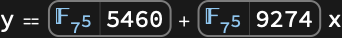
```

The first user chooses a private key $2 \leq a \leq p-2$:

```wolfram
SeedRandom[1234];a=RandomInteger[{2,p-2}]
(* Output *)
29609561362891123291332707882241052253458582749459839616466627265569512246626946991503496088175892266467663096586489061592638986319549838291876730825770077692099171181923971528354951664245186418799644351585323597159844692355998177840569025304729002674962079508370399105199068022436780534854615664546929528905449730434355525244134491287789922468916418628405623749109108910257642698752065093143313788401665973709335970209454688298526687694823295682106785908729379089437223070201980297428377487320255072434587953075753936697738193223469083279953809039078188536440852944180718159677157623175611395335744160742032904413193
```

The public key consists of $\mathcal{F}$, $g$ and $g_{1}=g^{a}$:

```wolfram
g1=g^a
(* Output *)
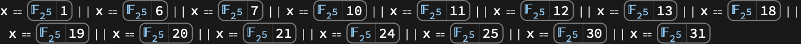
```

The second user chooses $2 \leq b \leq p-2$:

```wolfram
b=RandomInteger[{2,p-2}]
(* Output *)
8493946656882429887688396407509464696046656076972141493058444175300212153954351224557536031979922724375724804871975109732703941460487612720518440876755939118105418164808576694921477328932220228381905000041936513443405598306883368774571428554514418781923713376676857761641451719030225390901818977257220132146690796053822322326650861562486003309945769046939430250113179208360719306699518364538067349316007473905882602774027590130797737012991326462929548663335538822112197887726081854171201174720537669541975699526083619620619654145179958080366028384686773134088429127494282287487729868209798829245389957046706630602693
```

To send a 2048-bit message $m$, the second user sends $e=m g_{1}^{b}$ and $g_{2}=g^{b}$:

```wolfram
m=RandomInteger[{1,2^2048}]
(* Output *)
7161339291333572872052479193863803638938699169558208681455621324114243651878838235465931919201427275964965990594052801889364390563231012675930435302807955720054016269348063976932122497975678296327122571867648480879174082589707452835488611614907589985834432616911256644561612334057196367960438722745952443842516797975300576482976207429981596185890237598212851329670073010589213868730057367672254394753757568798683709856512552457574898102471090993291219500006841019626772702615506123491193969575196779105334765674305914326163698491440090410655037703587736072199412061804950014301780557015068144781670133056934786992522
```

```wolfram
e=m g1^b
(* Output *)
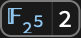
```

```wolfram
g2=g^b
(* Output *)
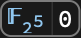
```

The first user can recover $m$ by computing $e/g_{2}^{a}$:

```wolfram
d=e/g2^a
(* Output *)
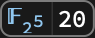
```

```wolfram
d["Index"]==m
(* Output *)
True
```

Implement a digital signature scheme. Fix a prime $p$ and find a primitive element $g$ of $\mathbb{Z}_{p}$:

```wolfram
p=179769313486231590772930519078902473361797697894230657273430081157732675805500963132708477322407536021120113879871393357658789768814416622492847430639474124377767893424865485276302219601246094119453082952085005768838150682342462881473913110540827237163350510684586298239947245938479716304835356329624224143009;
Zp=FiniteField[p];
g=Zp[PrimitiveRoot[p]]
(* Output *)

```

Pick a secret integer $1<h<p$ and publish $p$, $g$ and $c=g^{h}$:

```wolfram
SeedRandom[1234];
h=RandomInteger[{2,p-1}];
c=g^h
(* Output *)
<|interpretation -> FiniteFieldElement[FiniteField[179769313486231590772930519078902473361797697894230657273430081157732675, 805500963132708477322407536021120113879871393357658789768814416622492847430639, 474124377767893424865485276302219601246094119453082952085005768838150682342462, 881473913110540827237163350510684586298239947245938479716304835356329624224143, 009, 1559258775283944826146106259936745880191007710663592180785545871625708812, 395675768044611261158879037993084198450985791808156700960355218748709089617996, 382691960685601037523086698181288606777194603813043975878625936079683582865670, 685794797636718179551442839457496157685737255802919104947354284119760507877889, 16, +, #, &, Polynomial], 81961283466599623848029400038577521503887902282786245800549540134409990678334109170010245303464263028521868141651918629339874128485333353399430099000923497908604865781495513778823303038372917537651776867071246543484765289831440117282785558425148875312425970191397128088764852581336501288649555843185003509477], index -> 81961283466599623848029400038577521503887902282786245800549540134409990678334109170010245303464263028521868141651918629339874128485333353399430099000923497908604865781495513778823303038372917537651776867071246543484765289831440117282785558425148875312425970191397128088764852581336501288649555843185003509477, shortIndex -> "81961<<298>>09477", indexShortened -> True, characteristic -> 179769313486231590772930519078902473361797697894230657273430081157732675805500963132708477322407536021120113879871393357658789768814416622492847430639474124377767893424865485276302219601246094119453082952085005768838150682342462881473913110540827237163350510684586298239947245938479716304835356329624224143009, shortCharacteristic -> p, extensionDegree -> 1, field -> FiniteField[...], fieldDisplayed -> False|>
```

The signature for a message $1<m<p$ is a pair $\{r,s \}$ of positive integers less than $p$ such that $g^{m}=c^{r} r^{s}$. Computing the signature requires the knowledge of the secret integer $h$:

```wolfram
signature[m_]:=
Module[{k,a,b,d,r,s},
k=2;
While[GCD[k,p-1]!=1,k++];
{d,{a,b}}=ExtendedGCD[k,p-1];
r=(g^k)["Index"];
s=Mod[a(m-h r),p-1];
{r,s}]
```

The signature can be verified using the publicly known information:

```wolfram
verify[{r_,s_},m_]:=g^m==c^r Zp[r]^s
```

Compute the signature for a randomly generated message:

```wolfram
m=RandomInteger[{1,p-1}];
{r,s}=signature[m]
(* Output *)
{16807,148494123987680597670210572329658952286489973473912882951978744626375730035262428796445580940158608372311363549159356895466328258433064714421803380109002591904866964300766731992806892763242985617465456407265713016868169005434665569707476312016135452444643179919076216291582380655196762243910901332796986660088}
```

Verify the signature:

```wolfram
verify[{r,s},m]
(* Output *)
True
```

### Properties & Relations

A finite field with characteristic $p$ and extension degree $d$ has $p^{d}$ elements:

```wolfram
ℱ=FiniteField[7,10]
(* Output *)
FiniteField[...]
```

```wolfram
Information[ℱ,"FieldSize"]==7^10
(* Output *)
True
```

Elements of a finite field with characteristic $p$ satisfy $(a+b)^{p}=a^{p}+b^{p}$:

```wolfram
ℱ=FiniteField[11,3];
{a,b}={ℱ[123],ℱ[456]}
(* Output *)
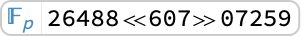
```

```wolfram
{(a+b)^11,a^11+b^11}
(* Output *)

```

Hence the mapping $x↦x^{p}$ is a field automorphism, known as [FrobeniusAutomorphism](https://reference.wolfram.com/language/ref/FrobeniusAutomorphism.html):

```wolfram
FrobeniusAutomorphism[a]==a^11
(* Output *)
True
```

The field generator $\theta=\mathcal{F}[\{0,1 \}]$ is a root of the field irreducible:

```wolfram
ℱ=FiniteField[109,5];
θ=ℱ[{0,1}]
(* Output *)
<|interpretation -> FiniteFieldElement[FiniteField[109, 103, +, 4, #, +, #, ^, 5, &, Polynomial], 01], index -> 109, shortIndex -> 109, indexShortened -> True, characteristic -> 109, shortCharacteristic -> 109, extensionDegree -> 5, field -> FiniteField[...], fieldDisplayed -> False|>
```

```wolfram
f=Information[ℱ,"FieldIrreducible"]
(* Output *)
103+4 #1+#1^5&
```

```wolfram
f[θ]
(* Output *)
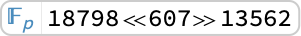
```

Use [FrobeniusAutomorphism](https://reference.wolfram.com/language/ref/FrobeniusAutomorphism.html) to find the remaining roots of $f$:

```wolfram
Table[FrobeniusAutomorphism[θ,k],{k,4}]
(* Output *)
{<|interpretation -> FiniteFieldElement[FiniteField[109, 103, +, 4, #, +, #, ^, 5, &, Polynomial], 9020674569], index -> 9798987711, shortIndex -> 9798987711, indexShortened -> True, characteristic -> 109, shortCharacteristic -> 109, extensionDegree -> 5, field -> FiniteField[...], fieldDisplayed -> False|>,<|interpretation -> FiniteFieldElement[FiniteField[109, 103, +, 4, #, +, #, ^, 5, &, Polynomial], 1813983101], index -> 14364570032, shortIndex -> 14364570032, indexShortened -> True, characteristic -> 109, shortCharacteristic -> 109, extensionDegree -> 5, field -> FiniteField[...], fieldDisplayed -> False|>,<|interpretation -> FiniteFieldElement[FiniteField[109, 103, +, 4, #, +, #, ^, 5, &, Polynomial], 21411072627], index -> 3846216858, shortIndex -> 3846216858, indexShortened -> True, characteristic -> 109, shortCharacteristic -> 109, extensionDegree -> 5, field -> FiniteField[...], fieldDisplayed -> False|>,<|interpretation -> FiniteFieldElement[FiniteField[109, 103, +, 4, #, +, #, ^, 5, &, Polynomial], 8934356421], index -> 3047622867, shortIndex -> 3047622867, indexShortened -> True, characteristic -> 109, shortCharacteristic -> 109, extensionDegree -> 5, field -> FiniteField[...], fieldDisplayed -> False|>}
```

```wolfram
f/@%
(* Output *)
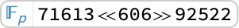
```

All elements of a finite field with $q$ elements are roots of $x^{q}-x$:

```wolfram
ℱ=FiniteField[3,5];
q=Information[ℱ,"FieldSize"]
(* Output *)
243
```

```wolfram
Union[x^q-x/.Table[{x->ℱ[i]},{i,0,q-1}]]
(* Output *)
{<|interpretation -> FiniteFieldElement[FiniteField[3, 1, +, 2, #, +, #, ^, 5, &, Polynomial], ], index -> 0, shortIndex -> 0, indexShortened -> True, characteristic -> 3, shortCharacteristic -> 3, extensionDegree -> 5, field -> FiniteField[...], fieldDisplayed -> False|>}
```

In fact, $x^{q}-x=\prod_{a \in \mathcal{F}}x-a$:

```wolfram
Expand[Product[x-ℱ[i],{i,0,q-1}]]
(* Output *)
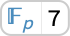
```

```wolfram
Coefficient[%,x,1]==-1
(* Output *)
True
```

Any irreducible polynomial of degree $d$ over $\mathbb{Z}_{p}$ has $d$ roots in a field with $p^{d}$ elements:

```wolfram
ℱ=FiniteField[73,6];
f=9x^6+54x^2+42x+11
(* Output *)
11+42 x+54 x^2+9 x^6
```

Use [IrreduciblePolynomialQ](https://reference.wolfram.com/language/ref/IrreduciblePolynomialQ.html) with [Modulus](https://reference.wolfram.com/language/ref/Modulus.html)->*p* to verify irreducibility over $\mathbb{Z}_{p}$:

```wolfram
IrreduciblePolynomialQ[f,Modulus->73]
(* Output *)
True
```

Use [Factor](https://reference.wolfram.com/language/ref/Factor.html) with [Extension](https://reference.wolfram.com/language/ref/Extension.html)->ℱ to verify that `*f*` is a product of linear factors over ℱ:

```wolfram
Factor[f,Extension->ℱ]
(* Output *)
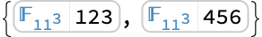
```

Use [FiniteField](https://reference.wolfram.com/language/ref/FiniteField.html)[*p*,1] to compute over the prime field $\mathbb{Z}_{p}$:

```wolfram
ℱ=FiniteField[19,1];
```

```wolfram
ℱ[12] ℱ[7]+ℱ[3]
(* Output *)

```

Compare with a result obtained using [Mod](https://reference.wolfram.com/language/ref/Mod.html):

```wolfram
Mod[12 7+3,19]
(* Output *)
11
```

Polynomial computation over $\mathbb{Z}_{p}$:

```wolfram
Discriminant[ℱ[4]x^3+ℱ[5]a x+ℱ[11],x]
(* Output *)

```

Compare with a result obtained using the [Modulus](https://reference.wolfram.com/language/ref/Modulus.html) option:

```wolfram
Discriminant[4x^3+5a x+11,x,Modulus->19]
(* Output *)
16+14 a^3
```

Use [ToFiniteField](https://reference.wolfram.com/language/ref/ToFiniteField.html) to convert integer coefficients to elements in the prime subfield of a finite field:

```wolfram
ℱ=FiniteField[29,3];
ToFiniteField[123+456x+789x^2+x^3,ℱ]
(* Output *)

```

[FromFiniteField](https://reference.wolfram.com/language/ref/FromFiniteField.html) converts the coefficients back to integers:

```wolfram
FromFiniteField[%,ℱ]
(* Output *)
7+21 x+6 x^2+x^3
```

Convert the coefficients to finite field elements, with `*t*` used to represent the field generator:

```wolfram
ToFiniteField[(t^2+3t+11)x+(21t+12)y+3t^2-11,ℱ,t]
(* Output *)

```

Convert the finite field coefficients to polynomials in `*t*`, where `*t*` represents the field generator:

```wolfram
FromFiniteField[%,ℱ,t]
(* Output *)
18+3 t^2+(11+3 t+t^2) x+(12+21 t) y
```

## Related Guides ▪Polynomial Algebra ▪Finite Fields

## History Introduced in 2023 (13.3) | Updated in 2024 (14.0)
