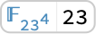
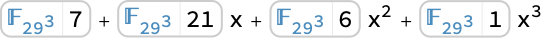
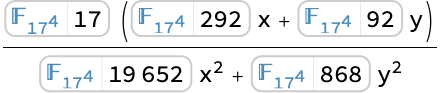
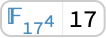
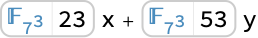

# FrobeniusAutomorphism | [SpanFromLeft]

> [FrobeniusAutomorphism](https://reference.wolfram.com/language/ref/FrobeniusAutomorphism.html)[*a*]  — gives the value of the Frobenius automorphism at the finite field element `*a*`.
> [FrobeniusAutomorphism](https://reference.wolfram.com/language/ref/FrobeniusAutomorphism.html)[*a*,*k*]  — gives the value of the `*k*^(*th*)` functional power of the Frobenius automorphism at `*a*`.

## Details

For a finite field $\mathcal{F}$ with characteristic $p$, the Frobenius automorphism is given by $\phi:\mathcal{F}∋a \longrightarrow a^{p}\in \mathcal{F}$.

All finite field automorphisms are functional powers of the Frobenius automorphism.

The number of different field automorphisms of $\mathcal{F}$ is equal to the extension degree of $\mathcal{F}$ over $\mathbb{Z}_{p}$.

Any field automorphism $\phi$ satisfies equations $\phi(a+b)=\phi(a)+\phi(b)$ and $\phi(a b)=\phi(a) \phi(b)$.

If `*n*` is the degree of the [MinimalPolynomial](https://reference.wolfram.com/language/ref/MinimalPolynomial.html) `*f*` of an element `*a*` of $\mathcal{F}$, then [Table](https://reference.wolfram.com/language/ref/Table.html)[FrobeniusAutomorphism[*a*,*k*],{*k*,*n*}] gives all the roots of `*f*` in $\mathcal{F}$.

## Examples

### Basic Examples

Represent a finite field with characteristic $71$ and extension degree $5$:

```wolfram
ℱ=FiniteField[71,5]
(* Output *)
FiniteField[...]
```

Compute the value of the Frobenius automorphism at an element of the field:

```wolfram
FrobeniusAutomorphism[ℱ[123]]
(* Output *)
<|interpretation -> FiniteFieldElement[FiniteField[71, 64, +, 18, #, +, #, ^, 5, &, Polynomial], 2949246127], index -> 708072450, shortIndex -> 708072450, indexShortened -> True, characteristic -> 71, shortCharacteristic -> 71, extensionDegree -> 5, field -> FiniteField[...], fieldDisplayed -> False|>
```

```wolfram
%===ℱ[123]^71
(* Output *)
True
```

Represent a finite field with characteristic $17$ and extension degree $7$:

```wolfram
ℱ=FiniteField[17,7]
(* Output *)
FiniteField[...]
```

Compute the third functional power of the Frobenius automorphism at an element of the field:

```wolfram
FrobeniusAutomorphism[ℱ[321],3]
(* Output *)
<|interpretation -> FiniteFieldElement[FiniteField[17, 14, +, 12, #, +, #, ^, 7, &, Polynomial], 62910151114], index -> 354848979, shortIndex -> 354848979, indexShortened -> True, characteristic -> 17, shortCharacteristic -> 17, extensionDegree -> 7, field -> FiniteField[...], fieldDisplayed -> False|>
```

```wolfram
%===((ℱ[321]^17)^17)^17
(* Output *)
True
```

### Scope

Compute the value of the Frobenius automorphism at an element of a finite field:

```wolfram
ℱ=FiniteField[23,4];
a=ℱ[123];
FrobeniusAutomorphism[a]
(* Output *)
<|interpretation -> FiniteFieldElement[FiniteField[23, 5, +, 19, #, +, 3, #, ^, 2, +, #, ^, 4, &, Polynomial], 12093], index -> 41723, shortIndex -> 41723, indexShortened -> True, characteristic -> 23, shortCharacteristic -> 23, extensionDegree -> 4, field -> FiniteField[...], fieldDisplayed -> False|>
```

Compute all conjugates of `*a*`:

```wolfram
Table[FrobeniusAutomorphism[a,k],{k,0,3}]
(* Output *)

```

Conjugates of `*a*` are roots of the minimal polynomial of `*a*`:

```wolfram
MinimalPolynomial[a]/@%
(* Output *)

```

### Applications

Compute the minimal polynomial of an element of a finite field:

```wolfram
ℱ=FiniteField[97,5];
a=ℱ[123]
(* Output *)
<|interpretation -> FiniteFieldElement[FiniteField[97, 92, +, 3, #, +, #, ^, 5, &, Polynomial], 261], index -> 123, shortIndex -> 123, indexShortened -> True, characteristic -> 97, shortCharacteristic -> 97, extensionDegree -> 5, field -> FiniteField[...], fieldDisplayed -> False|>
```

The minimal polynomial of $a$ is the product of $x-a_{k}$ over all conjugates $a_{k}$ of $a$:

```wolfram
Expand[Product[x-FrobeniusAutomorphism[a,k],{k,0,4}]]
(* Output *)

```

Convert to integer coefficients:

```wolfram
%/.e_FiniteFieldElement->e["Index"]
(* Output *)
71+48 x+4 x^2+67 x^3+64 x^4+x^5
```

Compare with the result obtained using the built-in [MinimalPolynomial](https://reference.wolfram.com/language/ref/MinimalPolynomial.html):

```wolfram
MinimalPolynomial[a,x]
(* Output *)
71+48 x+4 x^2+67 x^3+64 x^4+x^5
```

### Properties & Relations

Frobenius automorphism is a field automorphism:

```wolfram
ℱ=FiniteField[41,5];
{a,b}={ℱ[123],ℱ[456]}
(* Output *)

```

```wolfram
FrobeniusAutomorphism[a+b]==FrobeniusAutomorphism[a]+FrobeniusAutomorphism[b]
(* Output *)
True
```

```wolfram
FrobeniusAutomorphism[a b]==FrobeniusAutomorphism[a] FrobeniusAutomorphism[b]
(* Output *)
True
```

For a finite field $\mathcal{F}$ with characteristic $p$, the Frobenius automorphism is given by $\phi:\mathcal{F}∋a \longrightarrow a^{p}\in \mathcal{F}$:

```wolfram
ℱ=FiniteField[53,3];
a=ℱ[123]
(* Output *)

```

```wolfram
FrobeniusAutomorphism[a]==a^53
(* Output *)
True
```

All finite field automorphisms are functional powers of the Frobenius automorphism:

```wolfram
ℱ=FiniteField[109,5]
(* Output *)
FiniteField[...]
```

Use [FiniteFieldEmbedding](https://reference.wolfram.com/language/ref/FiniteFieldEmbedding.html) to find an automorphism of $\mathcal{F}$:

```wolfram
aut=FiniteFieldEmbedding[ℱ,ℱ]
(* Output *)
FiniteFieldEmbedding[<|interpretation -> FiniteFieldElement[FiniteField[109, 103, +, 4, #, +, #, ^, 5, &, Polynomial], 01], index -> 109, shortIndex -> 109, indexShortened -> True, characteristic -> 109, shortCharacteristic -> 109, extensionDegree -> 5, field -> FiniteField[...], fieldDisplayed -> False|>-><|interpretation -> FiniteFieldElement[FiniteField[109, 103, +, 4, #, +, #, ^, 5, &, Polynomial], 21411072627], index -> 3846216858, shortIndex -> 3846216858, indexShortened -> True, characteristic -> 109, shortCharacteristic -> 109, extensionDegree -> 5, field -> FiniteField[...], fieldDisplayed -> False|>]
```

Identify the functional power of the Frobenius automorphism that gives the same mapping:

```wolfram
Table[FrobeniusAutomorphism[ℱ[109],k],{k,4}]
(* Output *)
{<|interpretation -> FiniteFieldElement[FiniteField[109, 103, +, 4, #, +, #, ^, 5, &, Polynomial], 9020674569], index -> 9798987711, shortIndex -> 9798987711, indexShortened -> True, characteristic -> 109, shortCharacteristic -> 109, extensionDegree -> 5, field -> FiniteField[...], fieldDisplayed -> False|>,<|interpretation -> FiniteFieldElement[FiniteField[109, 103, +, 4, #, +, #, ^, 5, &, Polynomial], 1813983101], index -> 14364570032, shortIndex -> 14364570032, indexShortened -> True, characteristic -> 109, shortCharacteristic -> 109, extensionDegree -> 5, field -> FiniteField[...], fieldDisplayed -> False|>,<|interpretation -> FiniteFieldElement[FiniteField[109, 103, +, 4, #, +, #, ^, 5, &, Polynomial], 21411072627], index -> 3846216858, shortIndex -> 3846216858, indexShortened -> True, characteristic -> 109, shortCharacteristic -> 109, extensionDegree -> 5, field -> FiniteField[...], fieldDisplayed -> False|>,<|interpretation -> FiniteFieldElement[FiniteField[109, 103, +, 4, #, +, #, ^, 5, &, Polynomial], 8934356421], index -> 3047622867, shortIndex -> 3047622867, indexShortened -> True, characteristic -> 109, shortCharacteristic -> 109, extensionDegree -> 5, field -> FiniteField[...], fieldDisplayed -> False|>}
```

```wolfram
FrobeniusAutomorphism[ℱ[1234],3]==aut[ℱ[1234]]
(* Output *)
True
```

The number of different field automorphisms of $\mathcal{F}$ is equal to the extension degree of $\mathcal{F}$ over $\mathbb{Z}_{p}$:

```wolfram
ℱ=FiniteField[19,4];
a=ℱ[123]
(* Output *)

```

```wolfram
Table[FrobeniusAutomorphism[a,k],{k,0,3}]
(* Output *)

```

```wolfram
Table[FrobeniusAutomorphism[a,k+4]==FrobeniusAutomorphism[a,k],{k,0,3}]
(* Output *)
{True,True,True,True}
```

Compute all conjugates of a finite field element `*a*`:

```wolfram
ℱ=FiniteField[7,5];
a=ℱ[123];
conj=Table[FrobeniusAutomorphism[a,k],{k,0,4}]
(* Output *)

```

The absolute trace of `*a*` is equal to the sum of conjugates:

```wolfram
Plus@@conj
(* Output *)

```

Use [FiniteFieldElementTrace](https://reference.wolfram.com/language/ref/FiniteFieldElementTrace.html) to compute the absolute trace:

```wolfram
FiniteFieldElementTrace[a]
(* Output *)
6
```

The absolute norm of `*a*` is equal to the product of conjugates:

```wolfram
Times@@conj
(* Output *)

```

Use [FiniteFieldElementNorm](https://reference.wolfram.com/language/ref/FiniteFieldElementNorm.html) to compute the absolute norm:

```wolfram
FiniteFieldElementNorm[a]
(* Output *)
5
```

The conjugates are roots of [MinimalPolynomial](https://reference.wolfram.com/language/ref/MinimalPolynomial.html)[*a*]:

```wolfram
MinimalPolynomial[a]/@conj
(* Output *)

```

## Related Guides ▪Finite Fields

## History Introduced in 2023 (13.3)
