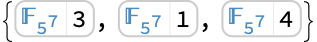
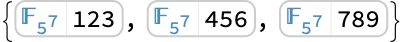

# FromFiniteFieldIndex | [SpanFromLeft]

> [FromFiniteFieldIndex](https://reference.wolfram.com/language/ref/FromFiniteFieldIndex.html)[*ind*,*ff*]  — gives the element of the finite field `*ff*` with index `*ind*`.

## Details

[FromFiniteFieldIndex](https://reference.wolfram.com/language/ref/FromFiniteFieldIndex.html) has the [Listable](https://reference.wolfram.com/language/ref/Listable.html) attribute.

[FromFiniteFieldIndex](https://reference.wolfram.com/language/ref/FromFiniteFieldIndex.html)[*ind*,*ff*] is equivalent to `*ff*[*ind*]`.

If `*ff*` is [FiniteField](https://reference.wolfram.com/language/ref/FiniteField.html)[*p*,*f*,"Polynomial"], then [FromFiniteFieldIndex](https://reference.wolfram.com/language/ref/FromFiniteFieldIndex.html)[*ind*,*ff*] is equal to [IntegerDigits](https://reference.wolfram.com/language/ref/IntegerDigits.html)[*ind*,*p*,*d*].{α^(*d*-1),…,α^(0)}, where `α` is the field generator of `*ff*` and `*d*` is the degree of `*f*`.

If `*ff*` is [FiniteField](https://reference.wolfram.com/language/ref/FiniteField.html)[*p*,*f*,"Exponential"] and `*ind*≠0, then [FromFiniteFieldIndex](https://reference.wolfram.com/language/ref/FromFiniteFieldIndex.html)[*ind*,*ff*] is equal to `α^(*ind*-1)`, where `α` is the field generator of `*ff*`. [FromFiniteFieldIndex](https://reference.wolfram.com/language/ref/FromFiniteFieldIndex.html)[0,*ff*] gives the field zero of `*ff*`.

## Examples

### Basic Examples

Create a matrix of finite field elements with given indices:

```wolfram
FromFiniteFieldIndex[{{11,12},{21,22}},FiniteField[5,2]]//MatrixForm
(* Output *)

```

### Scope

Create a finite field element with a given index:

```wolfram
FromFiniteFieldIndex[1234,FiniteField[11,3]]
(* Output *)

```

Use a finite field in the exponential representation:

```wolfram
FromFiniteFieldIndex[123,FiniteField[3,5,"Exponential"]]
(* Output *)

```

Create a vector and a matrix of finite field elements with given indices:

```wolfram
FromFiniteFieldIndex[{111,222,333},FiniteField[7,3]]
(* Output *)

```

```wolfram
FromFiniteFieldIndex[{{123,234,345},{456,567,678}},FiniteField[97,5]]//MatrixForm
(* Output *)

```

### Applications

Create a vector and a matrix of randomly generated finite field elements:

```wolfram
FromFiniteFieldIndex[RandomInteger[{0,80},3],FiniteField[3,4]]
(* Output *)

```

```wolfram
FromFiniteFieldIndex[RandomInteger[{0,80},{3,3}],FiniteField[3,4]]//MatrixForm
(* Output *)

```

### Properties & Relations

For a single index, [FromFiniteFieldIndex](https://reference.wolfram.com/language/ref/FromFiniteFieldIndex.html)[*ind*,*ff*] is equivalent to `*ff*[*ind*]`:

```wolfram
ff=FiniteField[11,3];
FromFiniteFieldIndex[1234,ff]===ff[1234]
(* Output *)
True
```

For a list of integers, `*ff*[*list*]` gives a single element with polynomial coefficients specified by `*list*`:

```wolfram
ff[{123,234,345}]
(* Output *)

```

```wolfram
123+234ff[{0,1}]+345 ff[{0,1}]^2
(* Output *)

```

[FromFiniteFieldIndex](https://reference.wolfram.com/language/ref/FromFiniteFieldIndex.html)[*list*,*ff*] gives a list of elements with indices specified by `*list*`:

```wolfram
FromFiniteFieldIndex[{123,234,345},ff]
(* Output *)

```

Use [FiniteFieldIndex](https://reference.wolfram.com/language/ref/FiniteFieldIndex.html) to get indices of field elements:

```wolfram
FromFiniteFieldIndex[{123,234,345},FiniteField[19,2]]
(* Output *)

```

```wolfram
FiniteFieldIndex[%]
(* Output *)
{123,234,345}
```

[ToFiniteField](https://reference.wolfram.com/language/ref/ToFiniteField.html) converts integers to elements of the prime subfield:

```wolfram
ToFiniteField[{123,456,789},FiniteField[5,7]]
(* Output *)

```

[FromFiniteFieldIndex](https://reference.wolfram.com/language/ref/FromFiniteFieldIndex.html) gives finite field elements with specified indices:

```wolfram
FromFiniteFieldIndex[{123,456,789},FiniteField[5,7]]
(* Output *)

```

## Related Guides ▪Finite Fields

## History Introduced in 2024 (14.0)
