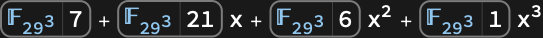

# SolveValues | [SpanFromLeft]

> [SolveValues](https://reference.wolfram.com/language/ref/SolveValues.html)[*expr*,*vars*]  — gives the values of `*vars*` determined by the solutions of the system `*expr*`.
> [SolveValues](https://reference.wolfram.com/language/ref/SolveValues.html)[*expr*,*vars*,*dom*] — uses solutions over the domain `*dom*`. Common choices of `*dom*` are [Reals](https://reference.wolfram.com/language/ref/Reals.html), [Integers](https://reference.wolfram.com/language/ref/Integers.html) and [Complexes](https://reference.wolfram.com/language/ref/Complexes.html).

## Details and Options

The system `*expr*` can be any logical combination of:

*lhs*==*rhs* | equations
*lhs*!=*rhs* | inequations
`*lhs*>*rhs*` or `*lhs*>=*rhs*` | inequalities
*expr*∈*dom* | domain specifications
{*x*,*y*,…}∈*reg* | region specification
[ForAll](https://reference.wolfram.com/language/ref/ForAll.html)[*x*,*cond*,*expr*] | universal quantifiers
[Exists](https://reference.wolfram.com/language/ref/Exists.html)[*x*,*cond*,*expr*] | existential quantifiers

[SolveValues](https://reference.wolfram.com/language/ref/SolveValues.html)[{*expr*_1,*expr*_2,…},*vars*] is equivalent to [SolveValues](https://reference.wolfram.com/language/ref/SolveValues.html)[*expr*_1&&*expr*_2&&…,*vars*].

If a single variable is specified, the result is a list of values of the variable for which `*expr*` is [True](https://reference.wolfram.com/language/ref/True.html).

If a list of variables is specified, the result is a list of lists of values for the variables for which `*expr*` is [True](https://reference.wolfram.com/language/ref/True.html).

When a single variable is specified and a particular root of an equation has multiplicity greater than one, [SolveValues](https://reference.wolfram.com/language/ref/SolveValues.html) gives several copies of the corresponding solution.

[SolveValues](https://reference.wolfram.com/language/ref/SolveValues.html)[*expr*,*vars*] assumes by default that quantities appearing algebraically in inequalities are real, while all other quantities are complex.

[SolveValues](https://reference.wolfram.com/language/ref/SolveValues.html)[*expr*,*vars*,*dom*] restricts all variables and parameters to belong to the domain `*dom*`.

If `*dom*` is [Reals](https://reference.wolfram.com/language/ref/Reals.html) or a subset such as [Integers](https://reference.wolfram.com/language/ref/Integers.html) or [Rationals](https://reference.wolfram.com/language/ref/Rationals.html), then all constants and function values are also restricted to be real.

[SolveValues](https://reference.wolfram.com/language/ref/SolveValues.html)[*expr*&&*vars*∈[Reals](https://reference.wolfram.com/language/ref/Reals.html),*vars*,[Complexes](https://reference.wolfram.com/language/ref/Complexes.html)] solves for real values of variables, but function values are allowed to be complex.

[SolveValues](https://reference.wolfram.com/language/ref/SolveValues.html)[*expr*,*vars*,[Integers](https://reference.wolfram.com/language/ref/Integers.html)] solves Diophantine equations over the integers.

[SolveValues](https://reference.wolfram.com/language/ref/SolveValues.html)[…,*x*∈*reg*,[Reals](https://reference.wolfram.com/language/ref/Reals.html)] constrains `*x*` to be in the region `*reg*`. The different coordinates for `*x*` can be referred to using [Indexed](https://reference.wolfram.com/language/ref/Indexed.html)[*x*,*i*].

Algebraic variables in `*expr*` free of `*vars*` and of each other are treated as independent parameters.

[SolveValues](https://reference.wolfram.com/language/ref/SolveValues.html) deals primarily with linear and polynomial equations.

When `*expr*` involves only polynomial equations and inequalities over real or complex domains, then [SolveValues](https://reference.wolfram.com/language/ref/SolveValues.html) can always in principle solve directly for `*vars*`.

When `*expr*` involves transcendental conditions or integer domains, [SolveValues](https://reference.wolfram.com/language/ref/SolveValues.html) will often introduce additional parameters in its results.

[SolveValues](https://reference.wolfram.com/language/ref/SolveValues.html) can give explicit representations for solutions to all linear equations and inequalities over the integers and can solve a large fraction of Diophantine equations described in the literature.

When `*expr*` involves only polynomial conditions over real or complex domains, [SolveValues](https://reference.wolfram.com/language/ref/SolveValues.html)[*expr*,*vars*] will always be able to eliminate quantifiers.

[SolveValues](https://reference.wolfram.com/language/ref/SolveValues.html) gives generic solutions only. Solutions that are valid only when continuous parameters satisfy equations are removed. Other solutions that are only conditionally valid are expressed as [ConditionalExpression](https://reference.wolfram.com/language/ref/ConditionalExpression.html) objects.

Conditions included in [ConditionalExpression](https://reference.wolfram.com/language/ref/ConditionalExpression.html) solutions may involve inequalities, [Element](https://reference.wolfram.com/language/ref/Element.html) statements, equations and inequations on non-continuous parameters and equations with full-dimensional solutions. Inequations and [NotElement](https://reference.wolfram.com/language/ref/NotElement.html) conditions on continuous parameters and variables are dropped.

[SolveValues](https://reference.wolfram.com/language/ref/SolveValues.html) may use non-equivalent transformations to find solutions of transcendental equations and hence it may not find some solutions and may not establish exact conditions on the validity of the solutions found. If this happens, an error message is issued.

[SolveValues](https://reference.wolfram.com/language/ref/SolveValues.html) uses special efficient techniques for handling sparse systems of linear equations with approximate numerical coefficients.

The following options can be given:

| [Assumptions](https://reference.wolfram.com/language/ref/Assumptions.html) | [$Assumptions](https://reference.wolfram.com/language/ref/$Assumptions.html) | assumptions on parameters |
| --- | --- | --- |
| [Cubics](https://reference.wolfram.com/language/ref/Cubics.html) | [Automatic](https://reference.wolfram.com/language/ref/Automatic.html) | whether to use explicit radicals to solve all cubics |
| [GeneratedParameters](https://reference.wolfram.com/language/ref/GeneratedParameters.html) | [C](https://reference.wolfram.com/language/ref/C.html) | how to name parameters that are generated |
| [InverseFunctions](https://reference.wolfram.com/language/ref/InverseFunctions.html) | [Automatic](https://reference.wolfram.com/language/ref/Automatic.html) | whether to use symbolic inverse functions |
| [MaxExtraConditions](https://reference.wolfram.com/language/ref/MaxExtraConditions.html) | 0 | how many extra equational conditions on continuous parameters to allow |
| [MaxRoots](https://reference.wolfram.com/language/ref/MaxRoots.html) | [Infinity](https://reference.wolfram.com/language/ref/Infinity.html) | maximum number of roots returned |
| [Method](https://reference.wolfram.com/language/ref/Method.html) | [Automatic](https://reference.wolfram.com/language/ref/Automatic.html) | what method should be used |
| [Modulus](https://reference.wolfram.com/language/ref/Modulus.html) | 0 | modulus to assume for integers |
| [Quartics](https://reference.wolfram.com/language/ref/Quartics.html) | [Automatic](https://reference.wolfram.com/language/ref/Automatic.html) | whether to use explicit radicals to solve all quartics |
| [VerifySolutions](https://reference.wolfram.com/language/ref/VerifySolutions.html) | [Automatic](https://reference.wolfram.com/language/ref/Automatic.html) | whether to verify solutions obtained using non-equivalent transformations |
| [WorkingPrecision](https://reference.wolfram.com/language/ref/WorkingPrecision.html) | [Infinity](https://reference.wolfram.com/language/ref/Infinity.html) | precision to be used in computations |

With [MaxExtraConditions](https://reference.wolfram.com/language/ref/MaxExtraConditions.html)->[Automatic](https://reference.wolfram.com/language/ref/Automatic.html), only solutions that require the minimal number of equational conditions on continuous parameters are included.

With [MaxExtraConditions](https://reference.wolfram.com/language/ref/MaxExtraConditions.html)->[All](https://reference.wolfram.com/language/ref/All.html), solutions that require arbitrary conditions on parameters are given and all conditions are included.

With [MaxExtraConditions](https://reference.wolfram.com/language/ref/MaxExtraConditions.html)->*k*, only solutions that require at most `*k*` equational conditions on continuous parameters are included.

With [Method](https://reference.wolfram.com/language/ref/Method.html)->[Reduce](https://reference.wolfram.com/language/ref/Reduce.html), [SolveValues](https://reference.wolfram.com/language/ref/SolveValues.html) uses only equivalent transformations and finds all solutions.

[SolveValues](https://reference.wolfram.com/language/ref/SolveValues.html)[*eqns*,…,[Modulus](https://reference.wolfram.com/language/ref/Modulus.html)->*m*] solves equations over the integers modulo `*m*`. With [Modulus](https://reference.wolfram.com/language/ref/Modulus.html)->[Automatic](https://reference.wolfram.com/language/ref/Automatic.html), [SolveValues](https://reference.wolfram.com/language/ref/SolveValues.html) will attempt to find the largest modulus for which the equations have solutions.

## Examples

### Basic Examples

Solve a quadratic equation:

```wolfram
SolveValues[x^2+a x+1==0,x]
(* Output *)
{(1)/(2) (-a-Sqrt[-4+a^2]),(1)/(2) (-a+Sqrt[-4+a^2])}
```

Solve simultaneous equations in $x$ and $y$:

```wolfram
SolveValues[a x+y==7&&b x-y==1,{x,y}]
(* Output *)
{{(8)/(a+b),-(a-7 b)/(a+b)}}
```

Solve an equation over the reals:

```wolfram
SolveValues[(x^2+2)(x^2-2)==0,x,Reals]
(* Output *)
{-Sqrt[2],Sqrt[2]}
```

Solve an equation over the positive integers:

```wolfram
SolveValues[x^2+2y^3==3681&&x>0 &&y>0,{x,y},Integers]
(* Output *)
{{15,12},{41,10},{57,6}}
```

Solve equations in a geometric region:

```wolfram
SolveValues[{x,y}∈InfiniteLine[{{0,0},{2,1}}]&&{x,y}∈Circle[],{x,y}]
(* Output *)
{{-(2)/(Sqrt[5]),-(1)/(Sqrt[5])},{(2)/(Sqrt[5]),(1)/(Sqrt[5])}}
```

```wolfram
Graphics[{{Blue,InfiniteLine[{{0,0},{2,1}}],Circle[]},{PointSize[Large],Red,Point[%]}}]
```

*([Graphics])*

### Scope

#### Basic Uses

Solutions are given as lists of values of the specified variables:

```wolfram
sol=SolveValues[x^2+y^2==2&&x-y==1,{x,y}]
(* Output *)
{{(1)/(2) (1-Sqrt[3]),(1)/(2) (-1-Sqrt[3])},{(1)/(2) (1+Sqrt[3]),(1)/(2) (-1+Sqrt[3])}}
```

Check that solutions satisfy the equations:

```wolfram
x^2+y^2==2&&x-y==1/.Thread[{x,y}->#]&/@%
(* Output *)
{True,True}
```

If there are no solutions, [SolveValues](https://reference.wolfram.com/language/ref/SolveValues.html) returns an empty list:

```wolfram
SolveValues[x==1&&x==2,x]
(* Output *)
{}
```

Some of the variables may appear in the solutions as free parameters:

```wolfram
SolveValues[x+y==1,{x,y}]
(* Output *)
SolveValues
(* Output *)
{{x,1-x}}
```

Find solutions over specified domains:

```wolfram
SolveValues[(x^4-1)(x^4-4)==0,x,Complexes]
(* Output *)
{-1,-ⅈ,ⅈ,1,-Sqrt[2],-ⅈ Sqrt[2],ⅈ Sqrt[2],Sqrt[2]}
```

```wolfram
SolveValues[(x^4-1)(x^4-4)==0,x,Reals]
(* Output *)
{-1,1,-Sqrt[2],Sqrt[2]}
```

```wolfram
SolveValues[(x^4-1)(x^4-4)==0,x,Integers]
(* Output *)
{-1,1}
```

Solve equations with coefficients involving a symbolic parameter:

```wolfram
sol=SolveValues[x^2+y^2==1&&x+y==a,{x,y}]
(* Output *)
{{(1)/(2) (a-Sqrt[2-a^2]),(1)/(2) (a+Sqrt[2-a^2])},{(1)/(2) (a+Sqrt[2-a^2]),(1)/(2) (a-Sqrt[2-a^2])}}
```

Plot the real parts of the solutions for `y` as a function of the parameter `a`:

```wolfram
Plot[Evaluate[Re[#[[2]]]&/@sol],{a,0,2}]
```

*([Graphics])*

Solution of this equation over the reals requires conditions on the parameters:

```wolfram
sol=SolveValues[x^2+a x+b==0,x,Reals]
(* Output *)
{-(a)/(2)-(1)/(2) Sqrt[a^2-4 b],-(a)/(2)+(1)/(2) Sqrt[a^2-4 b]}
```

Use [Normal](https://reference.wolfram.com/language/ref/Normal.html) to remove the conditions:

```wolfram
Normal[sol]
(* Output *)
{-(a)/(2)-(1)/(2) Sqrt[a^2-4 b],-(a)/(2)+(1)/(2) Sqrt[a^2-4 b]}
```

Solution of this equation over the positive integers requires introduction of a new parameter:

```wolfram
sol=SolveValues[x^2-2y^2==1&&x>0&&y>0,{x,y},Integers]
(* Output *)
{{(1)/(2) ((3-2 Sqrt[2])^1+(3+2 Sqrt[2])^1),-((3-2 Sqrt[2])^1-(3+2 Sqrt[2])^1)/(2 Sqrt[2])}}
```

List the first 10 solutions:

```wolfram
First[sol]/.Table[{1->i},{i,10}]//Simplify
(* Output *)
{{3,2},{17,12},{99,70},{577,408},{3363,2378},{19601,13860},{114243,80782},{665857,470832},{3880899,2744210},{22619537,15994428}}
```

#### Complex Equations in One Variable

Polynomial equations solvable in radicals:

```wolfram
SolveValues[x^4-x^2-5==0,x]
(* Output *)
{-ⅈ Sqrt[(1)/(2) (-1+Sqrt[21])],ⅈ Sqrt[(1)/(2) (-1+Sqrt[21])],-Sqrt[(1)/(2) (1+Sqrt[21])],Sqrt[(1)/(2) (1+Sqrt[21])]}
```

To use general formulas for solving cubic equations, set [Cubics](https://reference.wolfram.com/language/ref/Cubics.html)->[True](https://reference.wolfram.com/language/ref/True.html):

```wolfram
SolveValues[x^3-2x^2+5x+7==0,x,Cubics->True]
(* Output *)
{(1)/(3) (2-11 ((2)/(-263+3 Sqrt[8277]))^(1/3)+((1)/(2) (-263+3 Sqrt[8277]))^(1/3)),(2)/(3)-(1)/(6) (1+ⅈ Sqrt[3]) ((1)/(2) (-263+3 Sqrt[8277]))^(1/3)+(11 (1-ⅈ Sqrt[3]))/(3 2^(2/3) (-263+3 Sqrt[8277])^(1/3)),(2)/(3)-(1)/(6) (1-ⅈ Sqrt[3]) ((1)/(2) (-263+3 Sqrt[8277]))^(1/3)+(11 (1+ⅈ Sqrt[3]))/(3 2^(2/3) (-263+3 Sqrt[8277])^(1/3))}
```

By default, [SolveValues](https://reference.wolfram.com/language/ref/SolveValues.html) uses [Root](https://reference.wolfram.com/language/ref/Root.html) objects to represent solutions of general cubic equations:

```wolfram
SolveValues[x^3-2x^2+5x+7==0,x]
(* Output *)
{Root,Root,Root}
```

General polynomial equations:

```wolfram
SolveValues[x^5-2x+17==0,x]
(* Output *)
{Root,Root,Root,Root,Root}
```

Polynomial equations with multiple roots:

```wolfram
SolveValues[(x^2-1)(x^4-1)==0,x]
(* Output *)
{-1,-1,-ⅈ,ⅈ,1,1}
```

Find five roots of a polynomial of a high degree:

```wolfram
SolveValues[x^1234567+9x^2+7x-1==0,x,MaxRoots->5]
(* Output *)
{Root,Root,Root,Root,Root}
```

Polynomial equations with symbolic coefficients:

```wolfram
SolveValues[a x^2+b x+c==0,x]
(* Output *)
{(-b-Sqrt[b^2-4 a c])/(2 a),(-b+Sqrt[b^2-4 a c])/(2 a)}
```

```wolfram
SolveValues[a x^5+b x+c==0,x]
(* Output *)
{Root[c+b #1+a #1^5&,1],Root[c+b #1+a #1^5&,2],Root[c+b #1+a #1^5&,3],Root[c+b #1+a #1^5&,4],Root[c+b #1+a #1^5&,5]}
```

Algebraic equations:

```wolfram
SolveValues[Sqrt[x]+3x^(1/3)==5,x]
(* Output *)
{-2-957 ((2)/(1217+5125 Sqrt[5]))^(1/3)+3 ((1)/(2) (1217+5125 Sqrt[5]))^(1/3)}
```

Complete solutions to transcendental equations:

```wolfram
SolveValues[Sin[x]==1/3,x]
(* Output *)
{π-ArcSin[(1)/(3)]+2 π 1,ArcSin[(1)/(3)]+2 π 1}
```

```wolfram
SolveValues[(x^5-1)^x==0,x]
(* Output *)
{1,(-1)^(2/5),-(-1)^(3/5)}
```

Partial solutions to transcendental equations:

```wolfram
SolveValues[x^(2a)+2x^a+1==0,x]
(* Output *)
SolveValues
(* Output *)
{(-1)^((1)/(a))}
```

```wolfram
SolveValues[ArcTan[1/Sqrt[1+x^2],x/Sqrt[1+x^2]]==a,x]
(* Output *)
SolveValues
(* Output *)
{-(ⅈ (-1+Cos[2 a]+ⅈ Sin[2 a]))/(1+Cos[2 a]+ⅈ Sin[2 a])}
```

[SolveValues](https://reference.wolfram.com/language/ref/SolveValues.html) cannot find all solutions here:

```wolfram
SolveValues[5==x*2^(x^2),x]
(* Output *)
SolveValues
(* Output *)
{Sqrt[(ProductLog[50 Log[2]])/(2 Log[2])]}
```

Find three solutions:

```wolfram
SolveValues[5==x*2^(x^2),x,MaxRoots->3]
(* Output *)
{Root,Root,Root}
```

Univariate elementary function equations over bounded regions:

```wolfram
SolveValues[Sin[E^x]-Cos[2 x]==1&&-1<=Re[x]<=1&&-1<=Im[x]<=1,x]
(* Output *)
{Root,Root}
```

Univariate holomorphic function equations over bounded regions:

```wolfram
SolveValues[Gamma[x]-Log[x]==I/2&&Abs[x-2]<3/2,x]
(* Output *)
SolveValues
(* Output *)
{Root,Root}
```

Here [SolveValues](https://reference.wolfram.com/language/ref/SolveValues.html) finds some solutions but is not able to prove there are no other solutions:

```wolfram
SolveValues[x==E^(1/x)&&Abs[x]<5,x]
(* Output *)
SolveValues
(* Output *)
{Root,Root,Root,Root,Root}
```

Equation with a purely imaginary period over a vertical stripe in the complex plane:

```wolfram
SolveValues[Cos[Exp[x]]==3 Exp[-x]+1&&0<=Re[x]<=1,x]
(* Output *)
{2 ⅈ π 1+Root,2 ⅈ π 1+Root,2 ⅈ π 1+Root}
```

Find a specified number of roots of an unrestricted complex equation:

```wolfram
SolveValues[Sin[FresnelS[x]+BesselJ[3,x^2-1]]==2^Cos[x]-3,x,MaxRoots->5]
(* Output *)
{Root,Root,Root,Root,Root}
```

Symbolic functions:

```wolfram
SolveValues[f[x]^3+2f[x]-3==0,x]
(* Output *)
SolveValues
(* Output *)
{f^((-1))[1],f^((-1))[(1)/(2) (-1-ⅈ Sqrt[11])],f^((-1))[(1)/(2) (-1+ⅈ Sqrt[11])]}
```

Nonanalytic complex equations:

```wolfram
SolveValues[{Re[x]+Im[x]^2==1,Re[x]-Im[x]==-1},x]
(* Output *)
{-3-2 ⅈ,ⅈ}
```

```wolfram
SolveValues[{Abs[x]==1,Arg[x]==π/4},x]
(* Output *)
{(1+ⅈ)/(Sqrt[2])}
```

#### Systems of Complex Equations in Several Variables

Systems of linear equations:

```wolfram
SolveValues[{x+2y+3z==4,3x+4y+5z==6,7x+7y+8z==9},{x,y,z}]
(* Output *)
{{0,-1,2}}
```

Linear equations with symbolic coefficients:

```wolfram
SolveValues[a x+b y+c z==d &&3x+4y+5z==6&&7x+7y+8z==9,{x,y,z}]
(* Output *)
{{(3 (b-2 c+d))/(3 a-11 b+7 c),-(3 a-15 c+11 d)/(3 a-11 b+7 c),-(-6 a+15 b-7 d)/(3 a-11 b+7 c)}}
```

Underdetermined systems of linear equations:

```wolfram
SolveValues[x+2y+3z==4&&3x+4y+5z==6&&6x+7y+8z==9,{x,y,z}]
(* Output *)
SolveValues
(* Output *)
{{x,-1-2 x,2+x}}
```

Linear equations with no solutions:

```wolfram
SolveValues[x+2y+3z==4&&3x+4y+5z==6&&6x+7y+8z==0,{x,y,z}]
(* Output *)
{}
```

Systems of polynomial equations:

```wolfram
SolveValues[x^2+y^2==1&&x+2y==3,{x,y}]
(* Output *)
{{(3)/(5)-(4 ⅈ)/(5),(6)/(5)+(2 ⅈ)/(5)},{(3)/(5)+(4 ⅈ)/(5),(6)/(5)-(2 ⅈ)/(5)}}
```

Find five out of a trillion roots of a polynomial system:

```wolfram
SolveValues[x^10000==y^2+3y+2&&y^10000==z^2+3z+2&& z^10000==x^2+3x+2,{x,y,z},MaxRoots->5]
(* Output *)
{{Root,Root,Root},{Root,Root,Root},{Root,Root,Root},{Root,Root,Root},{Root,Root,Root}}
```

Polynomial equations with symbolic coefficients:

```wolfram
SolveValues[a x^2+b y^2==c&&x+2y==3,{x,y}]
(* Output *)
{{(3 b-2 Sqrt[-9 a b+4 a c+b c])/(4 a+b),(1)/(2) (3-(3 b)/(4 a+b)+(2 Sqrt[-9 a b+4 a c+b c])/(4 a+b))},{(3 b+2 Sqrt[-9 a b+4 a c+b c])/(4 a+b),(1)/(2) (3-(3 b)/(4 a+b)-(2 Sqrt[-9 a b+4 a c+b c])/(4 a+b))}}
```

Algebraic equations:

```wolfram
SolveValues[Sqrt[x y]==Sqrt[x+y]&&Sqrt[x]-y^(1/3)==1,{x,y}]
(* Output *)
SolveValues
(* Output *)
{{Root,1-7 Root-4 Root^3+Root^4}}
```

Transcendental equations:

```wolfram
SolveValues[Sin[x+y]==1&&Log[x-y]==1/2,{x,y}]
(* Output *)
{{(1)/(2) (Sqrt[ℯ]+(π)/(2)+2 π 1),(1)/(2) (-Sqrt[ℯ]+(π)/(2)+2 π 1)}}
```

```wolfram
SolveValues[3^x^2==7&&x^2-y^3==4,{x,y}]
(* Output *)
SolveValues
(* Output *)
{{-Sqrt[(Log[7])/(Log[3])],(-(4 Log[3]-Log[7])/(Log[3]))^(1/3)},{Sqrt[(Log[7])/(Log[3])],(-(4 Log[3]-Log[7])/(Log[3]))^(1/3)},{-Sqrt[(Log[7])/(Log[3])],-((4 Log[3]-Log[7])/(Log[3]))^(1/3)},{Sqrt[(Log[7])/(Log[3])],-((4 Log[3]-Log[7])/(Log[3]))^(1/3)},{-Sqrt[(Log[7])/(Log[3])],-(-1)^(2/3) ((4 Log[3]-Log[7])/(Log[3]))^(1/3)},{Sqrt[(Log[7])/(Log[3])],-(-1)^(2/3) ((4 Log[3]-Log[7])/(Log[3]))^(1/3)}}
```

Find a specified number of solutions of transcendental equations:

```wolfram
SolveValues[Sin[x+y]==x y+1&&Cos[x-y]==AiryAi[x y]+2,{x,y},MaxRoots->3]
(* Output *)
{{Root,Root},{Root,Root},{Root,Root}}
```

Square analytic systems over bounded boxes:

```wolfram
SolveValues[FresnelS[x-y]-AiryAi[x]+y==(3+I)/2&&CosIntegral[x] y-Sin[x y]==-5(1-I)/4&&1<=Re[x]<=2&&0<=Im[x]<=1&&1<=Re[y]<=2&&0<=Im[y]<=1,{x,y}]
(* Output *)
{{Root,Root}}
```

Nonanalytic equations:

```wolfram
SolveValues[{Re[x^2]+Im[y]==1,x^2-y^2==0,Im[x^3]-Im[y]^2==2},{x,y}]
(* Output *)
{{ⅈ AlgebraicNumber+AlgebraicNumber,AlgebraicNumber+ⅈ AlgebraicNumber},{ⅈ AlgebraicNumber+AlgebraicNumber,AlgebraicNumber+ⅈ AlgebraicNumber},{AlgebraicNumber+ⅈ AlgebraicNumber,AlgebraicNumber+ⅈ AlgebraicNumber},{AlgebraicNumber+ⅈ AlgebraicNumber,AlgebraicNumber+ⅈ AlgebraicNumber}}
```

#### Real Equations in One Variable

Polynomial equations:

```wolfram
SolveValues[x^5-2x+1==0,x,Reals]
(* Output *)
{1,Root,Root}
```

Polynomial equations with multiple roots:

```wolfram
SolveValues[(x^2-1)(x^4-1)==0,x,Reals]
(* Output *)
{-1,-1,1,1}
```

Polynomial equations with symbolic coefficients:

```wolfram
SolveValues[x^3+a x+a^2==0,x,Reals]
(* Output *)
{Root[a^2+a #1+#1^3&,1],Root[a^2+a #1+#1^3&,2],Root[a^2+a #1+#1^3&,3]}
```

Algebraic equations:

```wolfram
SolveValues[Sqrt[x]+3x^(1/3)==5,x,Reals]
(* Output *)
{Root^6}
```

Piecewise equations:

```wolfram
SolveValues[Abs[x]^2-x+UnitStep[x]==9,x,Reals]
(* Output *)
{(1)/(2) (1+Sqrt[33]),(1)/(2) (1-Sqrt[37])}
```

Transcendental equations, solvable using inverse functions:

```wolfram
SolveValues[E^x-x==7,x,Reals]
(* Output *)
{-7-ProductLog[-(1)/(ℯ^7)],-7-ProductLog[-1,-(1)/(ℯ^7)]}
```

```wolfram
SolveValues[ (27^(2x-1))^(1/x)==Sqrt[9^(2x-1)], x , Reals]
(* Output *)
{(1)/(2),3}
```

```wolfram
SolveValues[JacobiSN[x,y]==1,x,Reals]
(* Output *)
{EllipticK[y]+4 1 EllipticK[y]}
```

Transcendental equations, solvable using special function zeros:

```wolfram
SolveValues[AiryBi[1-x^2]==0&&2<x<3,x,Reals]
(* Output *)
{Sqrt[1-AiryBiZero[2]],Sqrt[1-AiryBiZero[3]],Sqrt[1-AiryBiZero[4]],Sqrt[1-AiryBiZero[5]]}
```

Transcendental inequalities, solvable using special function zeros:

```wolfram
SolveValues[900<AiryAiZero[2t+1]^2<1000,t,Reals]
(* Output *)
{(35)/(2),18}
```

Exp-log equations:

```wolfram
SolveValues[E^(2E^x)-Log[x^2+1]-20x==11,x,Reals]
(* Output *)
{Root,Root}
```

High-degree sparse polynomial equations:

```wolfram
SolveValues[x^1000000-2x^777777+3x^12345+9x^67-10==0,x,Reals]
(* Output *)
{Root,Root,Root,Root}
```

Algebraic equations involving high-degree radicals:

```wolfram
SolveValues[2x^(123451/67890)-x^2+4Sqrt[x]-4x-9/8==0,x,Reals]
(* Output *)
{Root^67890,Root^67890,Root^67890,Root^67890}
```

Equations involving non-rational real powers:

```wolfram
SolveValues[x^Pi-x^x^Sqrt[2]-Sqrt[3]x+2^(1/3)==0,x,Reals]
(* Output *)
{Root,Root,Root}
```

Equation with a double root:

```wolfram
SolveValues[E^(2x)+x^4+4(x^2+1)==(2x^2+4)E^x,x,Reals]
(* Output *)
{Root,Root}
```

Tame elementary function equations:

```wolfram
SolveValues[10Sin[Tan[E^-x^2]]-x==3,x,Reals]
(* Output *)
{Root,Root,Root}
```

Elementary function equations in bounded intervals:

```wolfram
SolveValues[2Sin[Exp[x]]-Cos[Pi x]==3/2&&-1<x<1,x,Reals]
(* Output *)
{Root,Root}
```

Holomorphic function equations in bounded intervals:

```wolfram
SolveValues[Cos[x]-BesselJ[5,x]==1/2&&0<=x<=10,x]
(* Output *)
SolveValues
(* Output *)
{Root,Root,Root}
```

Periodic elementary function equations over the reals:

```wolfram
SolveValues[Exp[Sin[x]]-Sin[3 Cos[x]]==0,x,Reals]
(* Output *)
{2 π 1+Root,2 π 1+Root}
```

#### Systems of Real Equations and Inequalities in Several Variables

Linear systems:

```wolfram
SolveValues[2 x+3y-5z==1&&3x-4y+7z==3,{y,z},Reals]
(* Output *)
{{22-29 x,13-17 x}}
```

Polynomial systems:

```wolfram
SolveValues[x y==z^2-x&&x y z==2&&x^2+y^2+z^2<=5,{y,z},Reals]
(* Output *)
{{(-x+Root[-2-x #1+#1^3&,1]^2)/(x),Root[-2-x #1+#1^3&,1]}}
```

Quantified polynomial systems:

```wolfram
SolveValues[Exists[x, x^2+a x+b==0&&2 x+a==0],a,Reals]
(* Output *)
{-2 Sqrt[b],2 Sqrt[b]}
```

```wolfram
SolveValues[ForAll[x,Exists[y,a x^2+b y^2-3y==1&&y<0&&a y-y==b+1]],{a,b},Reals]
(* Output *)
{{0,Root},{1,-1}}
```

Algebraic systems:

```wolfram
SolveValues[Sqrt[x+2y]-3x+4y>=5&&x+y^(1/3)==1,y,Reals]
(* Output *)
{1-3 x+3 x^2-x^3}
```

Piecewise systems:

```wolfram
SolveValues[Max[x,y]==Min[y^2-x,x]+y&&z+UnitStep[x-y]==1,{y,z},Reals]
(* Output *)
{{Sqrt[x],1},{-(1)/(2)+(1)/(2) Sqrt[1+8 x],0}}
```

Transcendental systems, solvable using inverse functions:

```wolfram
SolveValues[Sin[x+y]==1/2&&E^x-y<=1,y,Reals]
(* Output *)
{(1)/(6) (π-6 x+12 π 1),(1)/(6) (5 π-6 x+12 π 1)}
```

```wolfram
SolveValues[ 3^x-2^2y==77 && Sqrt[3^x]-2^y==7, {x, y}, Reals]
(* Output *)
{{4,1}}
```

Systems exp-log in the first variable and polynomial in the other variables:

```wolfram
SolveValues[E^x y^3+Log[x]y==1&&x y+E^x/x>=2,y,Reals]
(* Output *)
{Root[-1+Log[x] #1+ℯ^x #1^3&,1],Root[-1+Log[x] #1+ℯ^x #1^3&,2],Root[-1+Log[x] #1+ℯ^x #1^3&,3]}
```

Quantified system:

```wolfram
SolveValues[Exists[a,a x^2+Sinh[x^2+1]a^2==1&&x^2-a^2==1],x,Reals]
(* Output *)
{Root,Root,Root,Root}
```

Systems elementary and bounded in the first variable and polynomial in the other variables:

```wolfram
SolveValues[Sin[x-Cos[x]] y^3-x==1&&x^2+y^2<=1,y,Reals]
(* Output *)
{Root[-1-x+Sin[x-Cos[x]] #1^3&,1]}
```

Quantified system:

```wolfram
SolveValues[Exists[y,y^3-Cos[x] y+2 x^2 Sin[x^2-1]==0&&x^2+y^2==2],x,Reals]
(* Output *)
{Root,Root}
```

Systems holomorphic and bounded in the first variable and polynomial in the other variables:

```wolfram
SolveValues[y^3-BesselJ[2,x+2] y-y-3 x==-2&&y<0 &&x^2<2,y,Reals]
(* Output *)
SolveValues
(* Output *)
{Root[2-3 x+(-1-BesselJ[2,2+x]) #1+#1^3&,1],Root[2-3 x+(-1-BesselJ[2,2+x]) #1+#1^3&,2]}
```

Quantified system:

```wolfram
SolveValues[Exists[y,y^4-Gamma[x+2] y-y-3 ArcSin[x/3]==1&&x^2+y^3==1&&0<x<2],x,Reals]
(* Output *)
SolveValues
(* Output *)
{Root}
```

Square systems of analytic equations over bounded regions:

```wolfram
SolveValues[Gamma[x+y+1]-Sin[x y]==1&&Erf[x^2-y]-E^y-x+4==0&&0<x<3&&0<y<3,{x,y}, Reals]
(* Output *)
{{Root,Root},{Root,Root}}
```

#### Diophantine Equations

Linear systems of equations:

```wolfram
SolveValues[2 x+3y-5z==1&&3x-4y+7z==3,{x,y,z},Integers]
(* Output *)
{{1,22-29 1,13-17 1}}
```

Linear systems of equations and inequalities:

```wolfram
SolveValues[2 x+3y==4&&3x-4y<=5&&x-2y>-21,{x,y},Integers]
(* Output *)
{{-7,6},{-4,4},{-1,2}}
```

Univariate polynomial equations:

```wolfram
SolveValues[x^12345-2x^777+1==0,x,Integers]
(* Output *)
{1}
```

Binary quadratic equations:

```wolfram
SolveValues[x^2+x y+y^2==109,{x,y},Integers]
(* Output *)
{{-12,5},{-12,7},{-7,-5},{-7,12},{-5,-7},{-5,12},{5,-12},{5,7},{7,-12},{7,5},{12,-7},{12,-5}}
```

```wolfram
SolveValues[x^2-3y^2==22&&x>0&&y>0,{x,y},Integers]
(* Output *)
{{5,1},{(1)/(2) (5 (2-Sqrt[3])^1+Sqrt[3] (2-Sqrt[3])^1+5 (2+Sqrt[3])^1-Sqrt[3] (2+Sqrt[3])^1),(1)/(6) (-3 (2-Sqrt[3])^1-5 Sqrt[3] (2-Sqrt[3])^1-3 (2+Sqrt[3])^1+5 Sqrt[3] (2+Sqrt[3])^1)},{(1)/(2) (5 (2-Sqrt[3])^1-Sqrt[3] (2-Sqrt[3])^1+5 (2+Sqrt[3])^1+Sqrt[3] (2+Sqrt[3])^1),(1)/(6) (3 (2-Sqrt[3])^1-5 Sqrt[3] (2-Sqrt[3])^1+3 (2+Sqrt[3])^1+5 Sqrt[3] (2+Sqrt[3])^1)}}
```

```wolfram
SolveValues[x^2-6 x y+9y^2-x+2y==1,{x,y},Integers]
(* Output *)
{{-3-2 1+3 1^2,-1-1+1^2}}
```

Thue equations:

```wolfram
SolveValues[x^3-2x^2 y+y^3==2,{x,y},Integers]
(* Output *)
{{1,-1},{5,3}}
```

Sum of squares equations:

```wolfram
SolveValues[x^2+4y^2+9z^2+16t^2==354&&x>0&&y>0&&z>0&&t>0,{x,y,z,t},Integers]
(* Output *)
{{1,2,3,4},{1,4,5,2},{1,8,3,1},{5,4,1,4},{5,8,1,2},{7,2,5,2},{7,4,5,1}}
```

The Pythagorean equation:

```wolfram
SolveValues[x^2+y^2==z^2,{x,y,z},Integers]
(* Output *)
{{2 1 2 3,1 (2^2-3^2),1 (2^2+3^2)},{1 (2^2-3^2),2 1 2 3,1 (2^2+3^2)}}
```

Bounded systems of equations and inequalities:

```wolfram
SolveValues[x^4+y^4+z^4<=500&&x+y^2+z^3==32,{x,y,z},Integers]
(* Output *)
{{-4,-3,3},{-4,3,3},{1,-2,3},{1,2,3},{4,-1,3},{4,1,3}}
```

High[Hyphen]degree systems with no solutions:

```wolfram
SolveValues[2x^7+8y^15+14 x y z==3,{x,y,z},Integers]
(* Output *)
{}
```

Transcendental Diophantine systems:

```wolfram
SolveValues[Exp[y^2]<x&&Abs[x]<5&&Abs[y]<5,{x,y},Integers]
(* Output *)
{{2,0},{3,-1},{3,0},{3,1},{4,-1},{4,0},{4,1}}
```

```wolfram
SolveValues[Exp[x^2-5y^2+1]+x^2-5y^2==0&&x>0&&y>0,{x,y},Integers]
(* Output *)
{{2,1},{(1)/(2) (-2 (9-4 Sqrt[5])^1-Sqrt[5] (9-4 Sqrt[5])^1-2 (9+4 Sqrt[5])^1+Sqrt[5] (9+4 Sqrt[5])^1),(1)/(10) (5 (9-4 Sqrt[5])^1+2 Sqrt[5] (9-4 Sqrt[5])^1+5 (9+4 Sqrt[5])^1-2 Sqrt[5] (9+4 Sqrt[5])^1)}}
```

Polynomial systems of congruences:

```wolfram
SolveValues[Mod[x^2+y^2,2]==1&&Mod[x-2y,3]==2,{x,y},Integers]
(* Output *)
{{6 1,5+6 2},{1+6 1,4+6 2},{2+6 1,3+6 2},{3+6 1,2+6 2},{4+6 1,1+6 2},{5+6 1,6 2}}
```

#### Modular Equations

Linear systems:

```wolfram
SolveValues[2 x+3y-5z==1&&3x-4y+7z==3&&2x-10y+3z==5,{x,y,z},Modulus->12]
(* Output *)
{{6,4,7}}
```

```wolfram
SolveValues[2 x+3y-5z==1&&3x-4y+7z==3,{x,y,z},Modulus->12]
(* Output *)
SolveValues
(* Output *)
{{x,10+7 x,1+7 x}}
```

Univariate polynomial equations:

```wolfram
SolveValues[x^3-2x+1==0,x,Modulus->5]
(* Output *)
{1,2,2}
```

Systems of polynomial equations and inequations:

```wolfram
SolveValues[x^2+y^3==1&&x+2y^2==4,{x,y},Modulus->7]
(* Output *)
{{0,4},{3,5}}
```

```wolfram
SolveValues[x^2+y^3==z&&x+2y==3z+1&&x y z≠0,{x,y,z},Modulus->7]
(* Output *)
{{5,2,5},{5,6,3},{6,4,2}}
```

Quantified polynomial systems:

```wolfram
SolveValues[ForAll[x,Exists[y,a x^2+b y^2-3y==1&&y≠0]],{a,b},Modulus->3]
(* Output *)
{{0,1}}
```

#### Equations over Finite Fields

Univariate equations:

```wolfram
ℱ=FiniteField[53,4];
SolveValues[x^5+ℱ[123]x==ℱ[234],x]
(* Output *)
{<|interpretation -> FiniteFieldElement[FiniteField[53, 2, +, 38, #, +, 9, #, ^, 2, +, #, ^, 4, &, Polynomial], 10134132], index -> 4879932, shortIndex -> 4879932, indexShortened -> True, characteristic -> 53, shortCharacteristic -> 53, extensionDegree -> 4, field -> FiniteField[...], fieldDisplayed -> False|>}
```

```wolfram
SolveValues[x^7+2 x+3==0,x,ℱ]
(* Output *)

```

Systems of linear equations:

```wolfram
ℱ=FiniteField[71,2];
SolveValues[ℱ[123]x+ℱ[234]y==ℱ[345]&&ℱ[321]x+ℱ[432]y==ℱ[543],{x,y}]
(* Output *)

```

```wolfram
SolveValues[ℱ[1234]x+ℱ[2345]y+ℱ[3456]z==ℱ[4567]&&ℱ[1]x+ℱ[2]y+ℱ[3]z==ℱ[4],{y,z}]
(* Output *)

```

Systems of polynomial equations:

```wolfram
ℱ=FiniteField[7,5];
SolveValues[x^2+y^2==3&&x^5+y^5==5,{x,y},ℱ]
(* Output *)

```

```wolfram
SolveValues[ℱ[123]x^2+ℱ[234]y^3+ℱ[345]z^4==ℱ[456]&&ℱ[21]x+ℱ[32]y^2+ℱ[43]z^3==ℱ[54]&&x y z==ℱ[1],{x,y,z}]
(* Output *)

```

#### Systems with Mixed-Variable Domains

Mixed real and complex variables:

```wolfram
SolveValues[x^2+y^2==1&&Element[x,Reals],y]
(* Output *)
{-Sqrt[1-x^2],Sqrt[1-x^2],-ⅈ Sqrt[-1+x^2],ⅈ Sqrt[-1+x^2]}
```

Mixed real and integer variables:

```wolfram
SolveValues[x^2+y^2==7 &&Element[x,Integers]&&Element[y,Reals],{x,y}]
(* Output *)
{{-2,-Sqrt[3]},{-2,Sqrt[3]},{-1,-Sqrt[6]},{-1,Sqrt[6]},{0,-Sqrt[7]},{0,Sqrt[7]},{1,-Sqrt[6]},{1,Sqrt[6]},{2,-Sqrt[3]},{2,Sqrt[3]}}
```

#### Systems with Geometric Region Constraints

Solve over special regions in 2D:

```wolfram
ℛ_1=Circle[];
ℛ_2=Line[{{-2,1},{1,-2}}];
```

```wolfram
SolveValues[{x,y}∈ℛ_1&&{x,y}∈ℛ_2,{x,y}]
(* Output *)
{{-1,0},{0,-1}}
```

Plot it:

```wolfram
Graphics[{{Blue,ℛ_1,ℛ_2},{Red,Point[%]}}]
```

*([Graphics])*

Solve over special regions in 3D:

```wolfram
ℛ_1=Sphere[];
ℛ_2=InfinitePlane[{{0,0,0},{0,1,0},{1,0,1}}];
```

```wolfram
SolveValues[2 x y==z^2&&{x,y,z}∈ℛ_1&&{x,y,z}∈ℛ_2,{x,y,z},Reals]
(* Output *)
{{-(2)/(3),-(1)/(3),-(2)/(3)},{0,-1,0},{0,1,0},{(2)/(3),(1)/(3),(2)/(3)}}
```

Plot it:

```wolfram
Show[{ContourPlot3D[2 x y==z^2,{x,-1.2,1.2},{y,-1.2,1.2},{z,-1.2,1.2},Mesh->None,ContourStyle->Opacity[0.5]],Graphics3D[{{Opacity[0.5],Green,ℛ_1},{Opacity[0.5],Yellow,ℛ_2},{PointSize[Large],Red,Point[%]}}]}]
```

*([Graphics3D])*

A quantified system:

```wolfram
ℛ=Cone[{{0,0,0},{1,2,3}},4];
```

```wolfram
SolveValues[∃_z(x^2+y^2==z^2&&x+y==z-1&&{x,y,z}∈ℛ),y,Reals]
(* Output *)
{(-1-2 x)/(2+2 x)}
```

An implicitly defined region:

```wolfram
ℛ=ImplicitRegion[a+2 b-3 c>=1&&a b c==7,{a,b,c}];
```

```wolfram
SolveValues[y^2+x z==1&&{x,y,z}∈ℛ,{y,z},Reals]
(* Output *)
{{(7)/(x Root[49-x^2 #1^2+x^3 #1^3&,1]),Root[49-x^2 #1^2+x^3 #1^3&,1]}}
```

A parametrically defined region:

```wolfram
ℛ=ParametricRegion[{s+t,s-t,s t},{s,t}];
```

```wolfram
SolveValues[x y==z&&x+2 y+3 z==1&&{x,y,z}∈ℛ,{x,y,z},Reals]
(* Output *)
{{(1)/(2) (-3-Sqrt[5]),(1)/(5)-(13)/(10) (-3-Sqrt[5])+(9)/(10) (-3-Sqrt[5])^2+(9)/(40) (-3-Sqrt[5])^3,(1)/(2) (-3-Sqrt[5]) ((1)/(5)-(13)/(10) (-3-Sqrt[5])+(9)/(10) (-3-Sqrt[5])^2+(9)/(40) (-3-Sqrt[5])^3)},{(1)/(6) (1-Sqrt[5]),(1)/(5)-(13)/(30) (1-Sqrt[5])+(1)/(10) (1-Sqrt[5])^2+(1)/(120) (1-Sqrt[5])^3,(1)/(6) (1-Sqrt[5]) ((1)/(5)-(13)/(30) (1-Sqrt[5])+(1)/(10) (1-Sqrt[5])^2+(1)/(120) (1-Sqrt[5])^3)},{(1)/(2) (-3+Sqrt[5]),(1)/(5)-(13)/(10) (-3+Sqrt[5])+(9)/(10) (-3+Sqrt[5])^2+(9)/(40) (-3+Sqrt[5])^3,(1)/(2) (-3+Sqrt[5]) ((1)/(5)-(13)/(10) (-3+Sqrt[5])+(9)/(10) (-3+Sqrt[5])^2+(9)/(40) (-3+Sqrt[5])^3)},{(1)/(6) (1+Sqrt[5]),(1)/(5)-(13)/(30) (1+Sqrt[5])+(1)/(10) (1+Sqrt[5])^2+(1)/(120) (1+Sqrt[5])^3,(1)/(6) (1+Sqrt[5]) ((1)/(5)-(13)/(30) (1+Sqrt[5])+(1)/(10) (1+Sqrt[5])^2+(1)/(120) (1+Sqrt[5])^3)}}
```

Derived regions:

```wolfram
ℛ_1=Disk[{0,0},2];
ℛ_2=Circle[{1,1},2];
ℛ_3=RegionIntersection[ℛ_1,ℛ_2];
```

```wolfram
SolveValues[x^2==x y+1&&{x,y}∈ℛ_3,{x,y},Reals]
(* Output *)
{{Root,1-Sqrt[3+2 Root-Root^2]},{Root,1-Sqrt[3+2 Root-Root^2]}}
```

Plot it:

```wolfram
Show[{ContourPlot[x^2==x y+1,{x,-2,3},{y,-2,3}],Graphics[{{Opacity[0.5],Yellow,ℛ_1},{Green,ℛ_2},{Red,Point[%]}}]}]
```

*([Graphics])*

Eliminate quantifiers over a Cartesian product of regions:

```wolfram
ℛ=RegionProduct[Circle[],Circle[]];
```

```wolfram
SolveValues[∃_{a,b}(4 x y a b==1&&{x,a,y,b}∈ℛ),{x,y},Reals]
(* Output *)
{{-(1)/(Sqrt[2]),-(1)/(Sqrt[2])},{-(1)/(Sqrt[2]),(1)/(Sqrt[2])},{(1)/(Sqrt[2]),-(1)/(Sqrt[2])},{(1)/(Sqrt[2]),(1)/(Sqrt[2])}}
```

Regions dependent on parameters:

```wolfram
ℛ_1=InfiniteLine[{{2,0},{0,t}}];
ℛ_2=Circle[];
```

The answer depends on the parameter value $t$:

```wolfram
SolveValues[{x,y}∈ℛ_1&&{x,y}∈ℛ_2,{x,y},Reals]
(* Output *)
{{(2 t-2 ((4 t)/(4+t^2)-Sqrt[(4 t^2-3 t^4)/((4+t^2)^2)]))/(t),(4 t)/(4+t^2)-Sqrt[(4 t^2-3 t^4)/((4+t^2)^2)]},{(2 t-2 ((4 t)/(4+t^2)+Sqrt[(4 t^2-3 t^4)/((4+t^2)^2)]))/(t),(4 t)/(4+t^2)+Sqrt[(4 t^2-3 t^4)/((4+t^2)^2)]}}
```

Use $x \in \mathcal{R}$ to specify that $x$ is a vector in $\mathbb{R}^{2}$:

```wolfram
ℛ=RegionIntersection[Circle[],Line[{{-2,-1},{1,2}}]];
```

```wolfram
SolveValues[x∈ℛ,x]
(* Output *)
{{-1,0},{0,1}}
```

In this case, $x$ is a vector in $\mathbb{R}^{3}$:

```wolfram
ℛ=Sphere[];
```

```wolfram
SolveValues[x.{1,2,3}==0&&x.{-3,-2,-1}==0&&x∈ℛ,x]
(* Output *)
{{(1)/(3) (2 Sqrt[(2)/(3)]-(1)/(Sqrt[6])),-Sqrt[(2)/(3)],(1)/(Sqrt[6])},{(1)/(3) (-2 Sqrt[(2)/(3)]+(1)/(Sqrt[6])),Sqrt[(2)/(3)],-(1)/(Sqrt[6])}}
```

### Options

#### Assumptions

Specify conditions on parameters using [Assumptions](https://reference.wolfram.com/language/ref/Assumptions.html):

```wolfram
SolveValues[x^2==a,x,Reals,Assumptions->a>0]
(* Output *)
{-Sqrt[a],Sqrt[a]}
```

```wolfram
SolveValues[x^2==a,x,Reals,Assumptions->a<0]
(* Output *)
{}
```

By default, no solutions that require parameters to satisfy equations are produced:

```wolfram
SolveValues[s==(2t)/(1+t^2)&&c==(1-t^2)/(1+t^2),t]
(* Output *)
{}
```

With an equation on parameters given as an assumption, a solution is returned:

```wolfram
SolveValues[s==(2t)/(1+t^2)&&c==(1-t^2)/(1+t^2),t,Assumptions->s^2+c^2==1]
(* Output *)
{(s)/(1+c)}
```

Assumptions that contain solve variables are considered to be a part of the system to solve:

```wolfram
SolveValues[2^x==8,x,Assumptions->x>0]
(* Output *)
{3}
```

Equivalent statement without using [Assumptions](https://reference.wolfram.com/language/ref/Assumptions.html):

```wolfram
SolveValues[2^x==8&&x>0,x]
(* Output *)
{3}
```

With parameters assumed to belong to a discrete set, solutions involving arbitrary conditions are returned:

```wolfram
SolveValues[a x^2+b x+c==0,x,Assumptions->Element[a,Integers]]
(* Output *)
SolveValues
(* Output *)
{-(c)/(b),(-b-Sqrt[b^2-4 a c])/(2 a),(-b+Sqrt[b^2-4 a c])/(2 a)}
```

#### Cubics

By default, [SolveValues](https://reference.wolfram.com/language/ref/SolveValues.html) uses general formulas for solving cubics in radicals only when symbolic parameters are present:

```wolfram
SolveValues[x^3+a x^2+2 x+3==0,x]
(* Output *)
{-(a)/(3)-(2^(1/3) (6-a^2))/(3 (-81+18 a-2 a^3+3 Sqrt[3] Sqrt[275-108 a-4 a^2+12 a^3])^(1/3))+((-81+18 a-2 a^3+3 Sqrt[3] Sqrt[275-108 a-4 a^2+12 a^3])^(1/3))/(3 2^(1/3)),-(a)/(3)+((1+ⅈ Sqrt[3]) (6-a^2))/(3 2^(2/3) (-81+18 a-2 a^3+3 Sqrt[3] Sqrt[275-108 a-4 a^2+12 a^3])^(1/3))-((1-ⅈ Sqrt[3]) (-81+18 a-2 a^3+3 Sqrt[3] Sqrt[275-108 a-4 a^2+12 a^3])^(1/3))/(6 2^(1/3)),-(a)/(3)+((1-ⅈ Sqrt[3]) (6-a^2))/(3 2^(2/3) (-81+18 a-2 a^3+3 Sqrt[3] Sqrt[275-108 a-4 a^2+12 a^3])^(1/3))-((1+ⅈ Sqrt[3]) (-81+18 a-2 a^3+3 Sqrt[3] Sqrt[275-108 a-4 a^2+12 a^3])^(1/3))/(6 2^(1/3))}
```

For polynomials with numeric coefficients, [SolveValues](https://reference.wolfram.com/language/ref/SolveValues.html) does not use the formulas:

```wolfram
SolveValues[x^3+2 x^2+3 x+4==0,x]
(* Output *)
{Root,Root,Root}
```

With [Cubics](https://reference.wolfram.com/language/ref/Cubics.html)->[False](https://reference.wolfram.com/language/ref/False.html), [SolveValues](https://reference.wolfram.com/language/ref/SolveValues.html) never uses the formulas:

```wolfram
SolveValues[x^3+a x^2+2 x+3==0,x,Cubics->False]
(* Output *)
{Root[3+2 #1+a #1^2+#1^3&,1],Root[3+2 #1+a #1^2+#1^3&,2],Root[3+2 #1+a #1^2+#1^3&,3]}
```

With [Cubics](https://reference.wolfram.com/language/ref/Cubics.html)->[True](https://reference.wolfram.com/language/ref/True.html), [SolveValues](https://reference.wolfram.com/language/ref/SolveValues.html) always uses the formulas:

```wolfram
SolveValues[x^3+2 x^2+3 x+4==0,x,Cubics->True]
(* Output *)
{(1)/(3) (-2-(5^(2/3))/((-7+3 Sqrt[6])^(1/3))+(5 (-7+3 Sqrt[6]))^(1/3)),-(2)/(3)+(5^(2/3) (1+ⅈ Sqrt[3]))/(6 (-7+3 Sqrt[6])^(1/3))-(1)/(6) (1-ⅈ Sqrt[3]) (5 (-7+3 Sqrt[6]))^(1/3),-(2)/(3)+(5^(2/3) (1-ⅈ Sqrt[3]))/(6 (-7+3 Sqrt[6])^(1/3))-(1)/(6) (1+ⅈ Sqrt[3]) (5 (-7+3 Sqrt[6]))^(1/3)}
```

#### GeneratedParameters

[SolveValues](https://reference.wolfram.com/language/ref/SolveValues.html) may introduce new parameters to represent the solution:

```wolfram
SolveValues[x^2-3y^2==1&&x>0&&y>0,{x,y},Integers]
(* Output *)
{{(1)/(2) ((2-Sqrt[3])^1+(2+Sqrt[3])^1),-((2-Sqrt[3])^1-(2+Sqrt[3])^1)/(2 Sqrt[3])}}
```

Use [GeneratedParameters](https://reference.wolfram.com/language/ref/GeneratedParameters.html) to control how the parameters are generated:

```wolfram
SolveValues[x^2-3y^2==1&&x>0&&y>0,{x,y},Integers,GeneratedParameters->(k_#&)]
(* Output *)
{{(1)/(2) ((2-Sqrt[3])^(k_1)+(2+Sqrt[3])^(k_1)),-((2-Sqrt[3])^(k_1)-(2+Sqrt[3])^(k_1))/(2 Sqrt[3])}}
```

#### InverseFunctions

By default, [SolveValues](https://reference.wolfram.com/language/ref/SolveValues.html) uses inverse functions but prints warning messages:

```wolfram
SolveValues[f[x]==0,x]
(* Output *)
SolveValues
(* Output *)
{f^((-1))[0]}
```

```wolfram
SolveValues[x+E^x==1,x]
(* Output *)
SolveValues
(* Output *)
{0}
```

For symbols with the [NumericFunction](https://reference.wolfram.com/language/ref/NumericFunction.html) attribute, symbolic inverses are not used:

```wolfram
SolveValues[Gamma[x]==a,x]
(* Output *)
SolveValues
(* Output *)
SolveValues[Gamma[x]==a,x]
```

With [InverseFunctions](https://reference.wolfram.com/language/ref/InverseFunctions.html)->[True](https://reference.wolfram.com/language/ref/True.html), [SolveValues](https://reference.wolfram.com/language/ref/SolveValues.html) does not print inverse function warning messages:

```wolfram
SolveValues[f[x]==0,x,InverseFunctions->True]
(* Output *)
{f^((-1))[0]}
```

```wolfram
SolveValues[x+E^x==1,x,InverseFunctions->True]
(* Output *)
{0}
```

Symbolic inverses are used for all symbols:

```wolfram
SolveValues[Gamma[x]==a,x,InverseFunctions->True]
(* Output *)
{Gamma^((-1))[a]}
```

With [InverseFunctions](https://reference.wolfram.com/language/ref/InverseFunctions.html)->[False](https://reference.wolfram.com/language/ref/False.html), [SolveValues](https://reference.wolfram.com/language/ref/SolveValues.html) does not use inverse functions:

```wolfram
SolveValues[f[x]==0,x,InverseFunctions->False]
(* Output *)
SolveValues
(* Output *)
SolveValues[f[x]==0,x,InverseFunctions->False]
```

Solving algebraic equations does not require using inverse functions:

```wolfram
SolveValues[x^2+1==0,x,InverseFunctions->False]
(* Output *)
{-ⅈ,ⅈ}
```

Here, a method based on [Reduce](https://reference.wolfram.com/language/ref/Reduce.html) is used, as it does not require using inverse functions:

```wolfram
SolveValues[x+E^x==1,x,InverseFunctions->False]
(* Output *)
{0,1-ProductLog[1,ℯ]}
```

#### MaxExtraConditions

By default, no solutions requiring extra conditions are produced:

```wolfram
SolveValues[a==0&&x==0,x]
(* Output *)
{}
```

Unless the parameters are discrete:

```wolfram
SolveValues[a==0&&x==0,x,Integers]
(* Output *)
{0}
```

The default setting, [MaxExtraConditions](https://reference.wolfram.com/language/ref/MaxExtraConditions.html)->0, gives no solutions requiring conditions:

```wolfram
SolveValues[(x-a)(x-b)==0&&(x-c)(x-d)==0&& (x-a)(x-e)==0,x]
(* Output *)
{}
```

```wolfram
SolveValues[(x-a)(x-b)==0&&(x-c)(x-d)==0&& (x-a)(x-e)==0,x,MaxExtraConditions->0]
(* Output *)
{}
```

[MaxExtraConditions](https://reference.wolfram.com/language/ref/MaxExtraConditions.html)->1 gives solutions requiring up to one equation on parameters:

```wolfram
SolveValues[(x-a)(x-b)==0&&(x-c)(x-d)==0&& (x-a)(x-e)==0,x,MaxExtraConditions->1]
(* Output *)
{c,d}
```

[MaxExtraConditions](https://reference.wolfram.com/language/ref/MaxExtraConditions.html)->2 gives solutions requiring up to two equations on parameters:

```wolfram
SolveValues[(x-a)(x-b)==0&&(x-c)(x-d)==0&& (x-a)(x-e)==0,x,MaxExtraConditions->2]
(* Output *)
{c,d,e,e}
```

Give solutions requiring the minimal number of parameter equations:

```wolfram
SolveValues[(x-a)(x-b)==0&&(x-c)(x-d)==0&& (x-a)(x-e)==0,x,MaxExtraConditions->Automatic]
(* Output *)
{c,d}
```

Give all solutions:

```wolfram
SolveValues[(x-a)(x-b)==0&&(x-c)(x-d)==0&& (x-a)(x-e)==0,x,MaxExtraConditions->All]
(* Output *)
{c,d,e}
```

By default, [SolveValues](https://reference.wolfram.com/language/ref/SolveValues.html) drops inequation conditions on continuous parameters:

```wolfram
Solve[a x==1,x]
(* Output *)
{{x->(1)/(a)}}
```

With [MaxExtraConditions](https://reference.wolfram.com/language/ref/MaxExtraConditions.html)->[All](https://reference.wolfram.com/language/ref/All.html), [SolveValues](https://reference.wolfram.com/language/ref/SolveValues.html) includes all conditions:

```wolfram
SolveValues[a x==1,x,MaxExtraConditions->All]
(* Output *)
{(1)/(a)}
```

#### MaxRoots

Find $3$ out of $12345$ roots of a polynomial:

```wolfram
SolveValues[x^12345+x+1==0,x,MaxRoots->3]
(* Output *)
{Root,Root,Root}
```

Find $3$ out of $1000000000$ roots of a polynomial system:

```wolfram
SolveValues[x^1000==y^3+1&&y^1000==z^3+1&&z^1000==x^3+1,{x,y,z},MaxRoots->3]
(* Output *)
{{Root,Root,Root},{Root,Root,Root},{Root,Root,Root}}
```

Find $5$ solutions of a transcendental system:

```wolfram
SolveValues[Sin[x+y]==2x+3y+1&&AiryAi[x^2-y]==y^2-1,{x,y},MaxRoots->5]
(* Output *)
{{Root,Root},{Root,Root},{Root,Root},{Root,Root},{Root,Root}}
```

When the system contains symbolic parameters, the option value is ignored:

```wolfram
SolveValues[x^4==a,x,MaxRoots->3]
(* Output *)
SolveValues
(* Output *)
{-a^(1/4),-ⅈ a^(1/4),ⅈ a^(1/4),a^(1/4)}
```

#### Method

By default, [SolveValues](https://reference.wolfram.com/language/ref/SolveValues.html) uses inverse functions to solve non-polynomial complex equations:

```wolfram
SolveValues[x E^x==1/2,x]
(* Output *)
SolveValues
(* Output *)
{ProductLog[(1)/(2)]}
```

With [Method](https://reference.wolfram.com/language/ref/Method.html)->[Reduce](https://reference.wolfram.com/language/ref/Reduce.html), [SolveValues](https://reference.wolfram.com/language/ref/SolveValues.html) uses [Reduce](https://reference.wolfram.com/language/ref/Reduce.html) to find the complete solution set:

```wolfram
SolveValues[x E^x==1/2,x,Method->Reduce]
(* Output *)
{ProductLog[1,(1)/(2)]}
```

#### Modulus

Solve equations over the integers modulo 9:

```wolfram
SolveValues[x^2+3y^2==4&&3x^3-4y^2+x y==1,{x,y},Modulus->9]
(* Output *)
{{8,1},{8,4},{8,7}}
```

#### Quartics

By default, [SolveValues](https://reference.wolfram.com/language/ref/SolveValues.html) uses the general formulas for solving quartics in radicals only when symbolic parameters are present:

```wolfram
SolveValues[x^4+a x^2+2 x+3==0,x][[1]]
(* Output *)
(1)/(2) Sqrt(-(2 a)/(3)+(36+a^2)/(3 (54-108 a+a^3+6 Sqrt[3] Sqrt[-405-108 a+72 a^2+a^3-3 a^4])^(1/3))+(1)/(3) (54-108 a+a^3+6 Sqrt[3] Sqrt[-405-108 a+72 a^2+a^3-3 a^4])^(1/3))-(1)/(2) Sqrt(-(4 a)/(3)-(36+a^2)/(3 (54-108 a+a^3+6 Sqrt[3] Sqrt[-405-108 a+72 a^2+a^3-3 a^4])^(1/3))-(1)/(3) (54-108 a+a^3+6 Sqrt[3] Sqrt[-405-108 a+72 a^2+a^3-3 a^4])^(1/3)-4/(Sqrt(-(2 a)/(3)+(36+a^2)/(3 (54-108 a+a^3+6 Sqrt[3] Sqrt[-405-108 a+72 a^2+a^3-3 a^4])^(1/3))+(1)/(3) (54-108 a+a^3+6 Sqrt[3] Sqrt[-405-108 a+72 a^2+a^3-3 a^4])^(1/3))))
```

For polynomials with numeric coefficients, [SolveValues](https://reference.wolfram.com/language/ref/SolveValues.html) does not use the formulas:

```wolfram
SolveValues[x^4+2 x^2+3 x+4==0,x]
(* Output *)
{Root,Root,Root,Root}
```

With [Quartics](https://reference.wolfram.com/language/ref/Quartics.html)->[False](https://reference.wolfram.com/language/ref/False.html), [SolveValues](https://reference.wolfram.com/language/ref/SolveValues.html) never uses the formulas:

```wolfram
SolveValues[x^4+a x^2+2 x+3==0,x,Quartics->False]
(* Output *)
{Root[3+2 #1+a #1^2+#1^4&,1],Root[3+2 #1+a #1^2+#1^4&,2],Root[3+2 #1+a #1^2+#1^4&,3],Root[3+2 #1+a #1^2+#1^4&,4]}
```

With [Quartics](https://reference.wolfram.com/language/ref/Quartics.html)->[True](https://reference.wolfram.com/language/ref/True.html), [SolveValues](https://reference.wolfram.com/language/ref/SolveValues.html) always uses the formulas:

```wolfram
SolveValues[x^4+2 x^2+3 x+4==0,x,Quartics->True][[1]]
(* Output *)
(1)/(2) Sqrt[(1)/(3) (-4+(52)/(((1)/(2) (-317+9 ⅈ Sqrt[5703]))^(1/3))+((1)/(2) (-317+9 ⅈ Sqrt[5703]))^(1/3))]-(1)/(2) Sqrt(-(8)/(3)-(52)/(3 ((1)/(2) (-317+9 ⅈ Sqrt[5703]))^(1/3))-(1)/(3) ((1)/(2) (-317+9 ⅈ Sqrt[5703]))^(1/3)-(6)/(Sqrt[(1)/(3) (-4+(52)/(((1)/(2) (-317+9 ⅈ Sqrt[5703]))^(1/3))+((1)/(2) (-317+9 ⅈ Sqrt[5703]))^(1/3))]))
```

#### VerifySolutions

[SolveValues](https://reference.wolfram.com/language/ref/SolveValues.html) verifies solutions obtained using non-equivalent transformations:

```wolfram
eqns=Sqrt[x+Sqrt[x]]==2&&y^9-y-2 x^(1/7)==3;
(sol1=SolveValues[eqns,{x,y}]);//Timing
(* Output *)
{4.0625,Null}
```

With [VerifySolutions](https://reference.wolfram.com/language/ref/VerifySolutions.html)->[False](https://reference.wolfram.com/language/ref/False.html), [SolveValues](https://reference.wolfram.com/language/ref/SolveValues.html) does not verify the solutions:

```wolfram
(sol2=SolveValues[eqns,{x,y},VerifySolutions->False]);//Timing
(* Output *)
{2.703125,Null}
```

Some of the solutions returned with [VerifySolutions](https://reference.wolfram.com/language/ref/VerifySolutions.html)->[False](https://reference.wolfram.com/language/ref/False.html) are not correct:

```wolfram
Length/@{sol1, sol2}
(* Output *)
{9,126}
```

This uses a fast numeric test in an attempt to select correct solutions:

```wolfram
(sol3=Select[sol2,TrueQ[eqns/.Thread[{x,y}->N[#,20]]]&]);//Timing
(* Output *)
{0.0625,Null}
```

In this case, numeric verification gives the correct solution set:

```wolfram
sol3===sol1
(* Output *)
True
```

#### WorkingPrecision

By default, [SolveValues](https://reference.wolfram.com/language/ref/SolveValues.html) finds exact solutions of equations:

```wolfram
SeedRandom[0];
mat=Table[RandomInteger[{-10^100,10^100}], {200},{200}];
b=Table[RandomInteger[{-10^100,10^100}],{200}];
vars=x/@Range[200];
(sol=SolveValues[Thread[mat.vars==b],vars]);//Timing
(* Output *)
{4.125,Null}
```

Computing the solution using 100-digit numbers is faster:

```wolfram
(sol1=SolveValues[Thread[mat.vars==b],vars,WorkingPrecision->100]);//Timing
(* Output *)
{1.921875,Null}
```

The result agrees with the exact solution in the first 100 digits:

```wolfram
Max[Abs[sol-sol1]]
(* Output *)
0`96.57985499050672
```

Computing the solution using machine numbers is much faster:

```wolfram
(sol2=SolveValues[Thread[mat.vars==b],vars,WorkingPrecision->MachinePrecision]);//Timing
(* Output *)
{0.125,Null}
```

The result is still quite close to the exact solution:

```wolfram
Max[Abs[sol-sol2]]
(* Output *)
1.98507876802978×10^-13
```

### Applications

Solve a quadratic equation:

```wolfram
SolveValues[a x^2+b x+c==0,x]
(* Output *)
{(-b-Sqrt[b^2-4 a c])/(2 a),(-b+Sqrt[b^2-4 a c])/(2 a)}
```

Find intersection points of a circle and a parabola:

```wolfram
pts=SolveValues[x^2+y^2==1&&y-2x^2+3/2==0,{x,y}]
(* Output *)
{{-(1)/(2) Sqrt[(1)/(2) (5-Sqrt[5])],(1)/(4) (-1-Sqrt[5])},{(1)/(2) Sqrt[(1)/(2) (5-Sqrt[5])],(1)/(4) (-1-Sqrt[5])},{-(1)/(2) Sqrt[(1)/(2) (5+Sqrt[5])],(1)/(4) (-1+Sqrt[5])},{(1)/(2) Sqrt[(1)/(2) (5+Sqrt[5])],(1)/(4) (-1+Sqrt[5])}}
```

```wolfram
Show[{ContourPlot[{x^2+y^2==1,y-2x^2+3/2==0},{x,-1.5,1.5},{y,-1.5,1.5}],Graphics[{Red,PointSize[Medium],Point[pts]}]}]
```

*([Graphics])*

Find conditions for a quartic to have all roots equal:

```wolfram
f[x_]:= x^4 + a x^3 + b x^2 + c x + d
```

A method using [Subresultants](https://reference.wolfram.com/language/ref/Subresultants.html):

```wolfram
SolveValues[Thread[Drop[Subresultants[f[x],D[f[x],x],x],-1]==0],{b,c,d}]
(* Output *)
{{(3 a^2)/(8),(a^3)/(16),(a^4)/(256)}}
```

A method using quantifier elimination:

```wolfram
SolveValues[Exists[x,f[x]==0,ForAll[y,f[y]==0, x==y]],{b,c,d}]
(* Output *)
{{(3 a^2)/(8),(a^3)/(16),(a^4)/(256)}}
```

Plot a space curve given by an implicit description:

```wolfram
curve=x^2+y^2+z^2==1&&x^3+x y^2==z^2;
```

```wolfram
sol=SolveValues[curve,{y,z},Reals]
(* Output *)
{{-Sqrt[(1-x^2-x^3)/(1+x)],-Sqrt[x^3+(x (1-x^2-x^3))/(1+x)]},{-Sqrt[(1-x^2-x^3)/(1+x)],Sqrt[x^3+(x (1-x^2-x^3))/(1+x)]},{Sqrt[(1-x^2-x^3)/(1+x)],-Sqrt[x^3+(x (1-x^2-x^3))/(1+x)]},{Sqrt[(1-x^2-x^3)/(1+x)],Sqrt[x^3+(x (1-x^2-x^3))/(1+x)]}}
```

```wolfram
cond=Union[#[[2]]&/@Cases[sol, _ConditionalExpression, Infinity]]
(* Output *)
{0<x<Root}
```

```wolfram
{l,u}=N[{cond[[1,1]],cond[[1,5]]}]
(* Output *)
{0.,0.7548776662466927}
```

```wolfram
ParametricPlot3D[Prepend[#,x]&/@sol,{x,l,u}]
```

*([Graphics3D])*

Plot the projection of the space curve on the `{*x*,*y*}` plane:

```wolfram
proj=SolveValues[Exists[z,curve],y,Reals]
(* Output *)
{-Sqrt[(1-x^2-x^3)/(1+x)],Sqrt[(1-x^2-x^3)/(1+x)]}
```

```wolfram
ParametricPlot[{x,#}&/@proj,{x,l,u}]
```

*([Graphics])*

Find a Pythagorean triple:

```wolfram
SolveValues[x^2+y^2==5^2&&y>x>0,{x,y},Integers]
(* Output *)
{{3,4}}
```

Find a sequence of Pythagorean triples:

```wolfram
Table[SolveValues[x^2+y^2==z^2&&y>x>0,{x,y},Integers],{z,30}]
(* Output *)
{{},{},{},{},{{3,4}},{},{},{},{},{{6,8}},{},{},{{5,12}},{},{{9,12}},{},{{8,15}},{},{},{{12,16}},{},{},{},{},{{7,24},{15,20}},{{10,24}},{},{},{{20,21}},{{18,24}}}
```

Find how to pay $2.27 postage with 10-, 23-, and 37-cent stamps:

```wolfram
SolveValues[a 10 + b 23 + c 37 == 227 &&a>=0&&b>=0&&c>=0,{a,b,c},Integers]
(* Output *)
{{1,3,4},{2,9,0},{7,2,3},{13,1,2},{19,0,1}}
```

The same task can be accomplished with [IntegerPartitions](https://reference.wolfram.com/language/ref/IntegerPartitions.html):

```wolfram
IntegerPartitions[227,All,{37,23,10}]
(* Output *)
{{10,10,10,10,10,10,10,10,10,10,10,10,10,10,10,10,10,10,10,37},{10,10,10,10,10,10,10,10,10,10,10,10,10,23,37,37},{10,10,10,10,10,10,10,23,23,37,37,37},{10,10,23,23,23,23,23,23,23,23,23},{10,23,23,23,37,37,37,37}}
```

Find 200 roots of a complex analytic function:

```wolfram
rts=SolveValues[Sin[x^3]-x^5==1,x,MaxRoots->200];
```

Show the roots on the complex plot for the function:

```wolfram
ComplexPlot[Sin[x^3]-x^5-1,{x,-7.5-7.5I,7.5+7.5I},Epilog -> LightYellowPoint[ReIm[rts]], ColorFunction -> None]
```


### Properties & Relations

Solutions are given as lists and satisfy the equations:

```wolfram
eqns={x^2+y^2==1&&2x+3y==4};
```

```wolfram
SolveValues[eqns,{x,y}]
(* Output *)
{{(1)/(13) (8-3 ⅈ Sqrt[3]),(2)/(13) (6+ⅈ Sqrt[3])},{(1)/(13) (8+3 ⅈ Sqrt[3]),(2)/(13) (6-ⅈ Sqrt[3])}}
```

```wolfram
eqns/.Thread[{x,y}->#]&/@%
(* Output *)
{{True},{True}}
```

For univariate equations, [SolveValues](https://reference.wolfram.com/language/ref/SolveValues.html) repeats solutions according to their multiplicity:

```wolfram
SolveValues[(x-1)^2(x-2)^3==0,x]
(* Output *)
{1,1,2,2,2}
```

Solutions of algebraic equations are often given in terms of [Root](https://reference.wolfram.com/language/ref/Root.html) objects:

```wolfram
SolveValues[x^5-2x+7==0,x]
(* Output *)
{Root,Root,Root,Root,Root}
```

Use [N](https://reference.wolfram.com/language/ref/N.html) to compute numeric approximations of [Root](https://reference.wolfram.com/language/ref/Root.html) objects:

```wolfram
N[%,20]
(* Output *)
{-1.59059537319672062593716589056785078455,-0.36410604943474631714401295805994372603-1.4820021939508159205678773803819056729 ⅈ,-0.36410604943474631714401295805994372603+1.4820021939508159205678773803819056729 ⅈ,1.15940373603310663011259590334386965487-0.73855030709145277515102414079759491956 ⅈ,1.15940373603310663011259590334386965487+0.73855030709145277515102414079759491956 ⅈ}
```

[Root](https://reference.wolfram.com/language/ref/Root.html) objects may involve parameters:

```wolfram
SolveValues[x^5+a x+1==0,x]
(* Output *)
{Root[1+a #1+#1^5&,1],Root[1+a #1+#1^5&,2],Root[1+a #1+#1^5&,3],Root[1+a #1+#1^5&,4],Root[1+a #1+#1^5&,5]}
```

Use [Series](https://reference.wolfram.com/language/ref/Series.html) to compute series expansions of [Root](https://reference.wolfram.com/language/ref/Root.html) objects:

```wolfram
Series[%[[1]],{a,0,10}]
(* Output *)
-1+(a)/(5)+(a^2)/(25)+(a^3)/(125)-(21 a^5)/(15625)-(78 a^6)/(78125)-(187 a^7)/(390625)-(286 a^8)/(1953125)+(9367 a^10)/(244140625)+O[a]^11
```

The series satisfies the equation up to order 11:

```wolfram
x^5+a x+1/.x->%
(* Output *)
O[a]^11
```

[SolveValues](https://reference.wolfram.com/language/ref/SolveValues.html) gives values of the solutions:

```wolfram
SolveValues[x^4==4,x]
(* Output *)
{-Sqrt[2],-ⅈ Sqrt[2],ⅈ Sqrt[2],Sqrt[2]}
```

[Solve](https://reference.wolfram.com/language/ref/Solve.html) represents solutions in terms of replacement rules:

```wolfram
Solve[x^4==4,x]
(* Output *)
{{x->-Sqrt[2]},{x->-ⅈ Sqrt[2]},{x->ⅈ Sqrt[2]},{x->Sqrt[2]}}
```

[Reduce](https://reference.wolfram.com/language/ref/Reduce.html) represents solutions in terms of Boolean combinations of equations and inequalities:

```wolfram
Reduce[x^4==4,x]
(* Output *)
x==-Sqrt[2]||x==-ⅈ Sqrt[2]||x==ⅈ Sqrt[2]||x==Sqrt[2]
```

[SolveValues](https://reference.wolfram.com/language/ref/SolveValues.html) uses fast heuristics to solve transcendental equations, but may give incomplete solutions:

```wolfram
SolveValues[x-E^x==1, x]
(* Output *)
SolveValues
(* Output *)
{1-ProductLog[-ℯ]}
```

```wolfram
SolveValues[x Log[x]==a,x]
(* Output *)
SolveValues
(* Output *)
{(a)/(ProductLog[a])}
```

[Reduce](https://reference.wolfram.com/language/ref/Reduce.html) uses methods that are often slower, but finds all solutions and gives all necessary conditions:

```wolfram
Reduce[x-E^x==1,x]
(* Output *)
1∈Integers&&x==1-ProductLog[1,-ℯ]
```

```wolfram
Reduce[x Log[x]==a,x]
(* Output *)
(a≠0&&((Im[ProductLog[-1,a]]>-π&&x==ℯ^(ProductLog[-1,a]))||x==ℯ^ProductLog[a]||(Im[ProductLog[1,a]]<=π&&x==ℯ^ProductLog[1,a])))||(a==0&&x==1)
```

Use [FindInstance](https://reference.wolfram.com/language/ref/FindInstance.html) to find solution instances:

```wolfram
FindInstance[x^2+y^2+z^2==1&&2x y==z^3,{x,y,z}]
(* Output *)
{{x->-2,y->AlgebraicNumber,z->AlgebraicNumber}}
```

Like [Reduce](https://reference.wolfram.com/language/ref/Reduce.html), [FindInstance](https://reference.wolfram.com/language/ref/FindInstance.html) can be given inequalities and domain specifications:

```wolfram
FindInstance[x^2-3y^2==1&&0<x<10^10,{x,y},Integers,3]
(* Output *)
{{x->1,y->0},{x->18817,y->-10864},{x->2,y->-1}}
```

Use [DSolve](https://reference.wolfram.com/language/ref/DSolve.html) to solve differential equations:

```wolfram
DSolve[y''[x]==-y[x],y[x],x]
(* Output *)
{{y[x]->1 Cos[x]+2 Sin[x]}}
```

```wolfram
DSolve[{y''[x]==-y[x],y[0]==0,y'[0]==1},y[x],x]
(* Output *)
{{y[x]->Sin[x]}}
```

Use [RSolve](https://reference.wolfram.com/language/ref/RSolve.html) to solve recurrence equations:

```wolfram
RSolve[f[n+1]==n f[n],f[n],n]
(* Output *)
{{f[n]->1 Pochhammer[1,-1+n]}}
```

```wolfram
RSolve[{f[n+1]==n+f[n],f[0]==0},f[n],n]
(* Output *)
{{f[n]->(1)/(2) (-1+n) n}}
```

[SolveAlways](https://reference.wolfram.com/language/ref/SolveAlways.html) gives the values of parameters for which complex equations are always true:

```wolfram
SolveAlways[(a -2b+1)x^2+(a-b^2-c)x ==a^2-b+3c-1,x]
(* Output *)
{{a->-2-Sqrt[13],b->(1)/(2) (-1-Sqrt[13]),c->(1)/(2) (-11-3 Sqrt[13])},{a->-2+Sqrt[13],b->(1)/(2) (-1+Sqrt[13]),c->-(11)/(2)+(3 Sqrt[13])/(2)}}
```

The same problem can be expressed using [ForAll](https://reference.wolfram.com/language/ref/ForAll.html) and solved with [SolveValues](https://reference.wolfram.com/language/ref/SolveValues.html), [Solve](https://reference.wolfram.com/language/ref/Solve.html) or [Reduce](https://reference.wolfram.com/language/ref/Reduce.html):

```wolfram
SolveValues[ForAll[x,(a -2b+1)x^2+(a-b^2-c)x ==a^2-b+3c-1],{a,b,c}]
(* Output *)
{{-2-Sqrt[13],(1)/(2) (-1-Sqrt[13]),(1)/(2) (-11-3 Sqrt[13])},{-2+Sqrt[13],(1)/(2) (-1+Sqrt[13]),-(11)/(2)+(3 Sqrt[13])/(2)}}
```

```wolfram
Solve[ForAll[x,(a -2b+1)x^2+(a-b^2-c)x ==a^2-b+3c-1],{a,b,c}]
(* Output *)
{{a->-2-Sqrt[13],b->(1)/(2) (-1-Sqrt[13]),c->(1)/(2) (-11-3 Sqrt[13])},{a->-2+Sqrt[13],b->(1)/(2) (-1+Sqrt[13]),c->-(11)/(2)+(3 Sqrt[13])/(2)}}
```

```wolfram
Reduce[ForAll[x,(a -2b+1)x^2+(a-b^2-c)x ==a^2-b+3c-1],{a,b,c}]
(* Output *)
(a==-2-Sqrt[13]||a==-2+Sqrt[13])&&b==(1+a)/(2)&&c==(1)/(2) (-5+3 a)
```

[Resolve](https://reference.wolfram.com/language/ref/Resolve.html) eliminates quantifiers, possibly without solving the resulting quantifier-free system:

```wolfram
Resolve[Exists[x,x^2+y^2+z^2==1&&x y>z^3],Reals]
(* Output *)
(z<0&&y^2+z^2<=1)||(y^2+z^2<=1&&-y^2+y^4+y^2 z^2+z^6<0)
```

```wolfram
Resolve[ForAll[{x,y},a x^2+b x+c==0&&a y^2+b y+c==0,x==y]]
(* Output *)
(a==0&&b≠0)||(a==0&&c≠0)||(a≠0&&b^2-4 a c==0)
```

[Eliminate](https://reference.wolfram.com/language/ref/Eliminate.html) eliminates variables from systems of complex equations:

```wolfram
Eliminate[x^2+y^2+z^2==1&&x z==y^3,x]
(* Output *)
(-1+y^2) z^2+z^4==-y^6
```

This solves the same problem using [Resolve](https://reference.wolfram.com/language/ref/Resolve.html):

```wolfram
Resolve[Exists[x,x^2+y^2+z^2==1&&x z==y^3]]
(* Output *)
(y==0&&z==0)||(z≠0&&y^6-z^2+y^2 z^2+z^4==0)
```

[Reduce](https://reference.wolfram.com/language/ref/Reduce.html), [Solve](https://reference.wolfram.com/language/ref/Solve.html) and [SolveValues](https://reference.wolfram.com/language/ref/SolveValues.html) additionally solve the resulting equations:

```wolfram
Reduce[Exists[x,x^2+y^2+z^2==1&&x z==y^3],{y,z}]
(* Output *)
(y==0&&z==0)||((z==-(Sqrt[1-y^2-Sqrt[1-2 y^2+y^4-4 y^6]])/(Sqrt[2])||z==(Sqrt[1-y^2-Sqrt[1-2 y^2+y^4-4 y^6]])/(Sqrt[2])||z==-(Sqrt[1-y^2+Sqrt[1-2 y^2+y^4-4 y^6]])/(Sqrt[2])||z==(Sqrt[1-y^2+Sqrt[1-2 y^2+y^4-4 y^6]])/(Sqrt[2]))&&z≠0)
```

```wolfram
Solve[Exists[x,x^2+y^2+z^2==1&&x z==y^3],z]
(* Output *)
{{z->-(Sqrt[1-y^2-Sqrt[1-2 y^2+y^4-4 y^6]])/(Sqrt[2])},{z->(Sqrt[1-y^2-Sqrt[1-2 y^2+y^4-4 y^6]])/(Sqrt[2])},{z->-(Sqrt[1-y^2+Sqrt[1-2 y^2+y^4-4 y^6]])/(Sqrt[2])},{z->(Sqrt[1-y^2+Sqrt[1-2 y^2+y^4-4 y^6]])/(Sqrt[2])}}
```

```wolfram
SolveValues[Exists[x,x^2+y^2+z^2==1&&x z==y^3],z]
(* Output *)
{-(Sqrt[1-y^2-Sqrt[1-2 y^2+y^4-4 y^6]])/(Sqrt[2]),(Sqrt[1-y^2-Sqrt[1-2 y^2+y^4-4 y^6]])/(Sqrt[2]),-(Sqrt[1-y^2+Sqrt[1-2 y^2+y^4-4 y^6]])/(Sqrt[2]),(Sqrt[1-y^2+Sqrt[1-2 y^2+y^4-4 y^6]])/(Sqrt[2])}
```

$f(x)$ is bijective iff the equation $f(x)=y$ has exactly one solution for each $y$:

```wolfram
SolveValues[x^3+x+1==y,x,Reals]
(* Output *)
{Root[1-y+#1+#1^3&,1]}
```

```wolfram
SolveValues[x^2+x+1==y,x,Reals]
(* Output *)
{-(1)/(2)-(1)/(2) Sqrt[-3+4 y],-(1)/(2)+(1)/(2) Sqrt[-3+4 y]}
```

Use [FunctionBijective](https://reference.wolfram.com/language/ref/FunctionBijective.html) to test whether a function is bijective:

```wolfram
FunctionBijective[x^3+x+1,x]
(* Output *)
True
```

```wolfram
FunctionBijective[x^2+x+1,x]
(* Output *)
False
```

Use [FunctionAnalytic](https://reference.wolfram.com/language/ref/FunctionAnalytic.html) to test whether a function is analytic:

```wolfram
f=Sin[3x^3]-2x+1;
```

```wolfram
FunctionAnalytic[f,x,Complexes]
(* Output *)
True
```

An analytic function can have only finitely many zeros in a closed and bounded region:

```wolfram
SolveValues[f==0&&Abs[x]<=1,x]
(* Output *)
{Root,Root,Root,Root,Root}
```

```wolfram
ComplexPlot[f,{x,-1-I,1+I},RegionFunction->(Abs[#]<=1&),Epilog->{PointSize[Medium],Blue,Point[ReIm[%]]}]
```



[SolveValues](https://reference.wolfram.com/language/ref/SolveValues.html) finds an explicit function of $x$ satisfying the equation $g(x,y)=0$:

```wolfram
g=y^3-x y^2+2x^2y-x+1;
```

```wolfram
y1=SolveValues[g==0,y][[1]]
(* Output *)
(x)/(3)-(5 2^(1/3) x^2)/(3 (-27+27 x-16 x^3+Sqrt[500 x^6+(-27+27 x-16 x^3)^2])^(1/3))+((-27+27 x-16 x^3+Sqrt[500 x^6+(-27+27 x-16 x^3)^2])^(1/3))/(3 2^(1/3))
```

Use [ImplicitD](https://reference.wolfram.com/language/ref/ImplicitD.html) to find the derivative of an implicitly defined function:

```wolfram
(ImplicitD[g==0,y,x]/.y->y1)==D[y1,x]//Simplify
(* Output *)
True
```

### Possible Issues

[SolveValues](https://reference.wolfram.com/language/ref/SolveValues.html) gives generic solutions; solutions involving equations on parameters are not given:

```wolfram
SolveValues[a x^2+x==1,x]
(* Output *)
{(-1-Sqrt[1+4 a])/(2 a),(-1+Sqrt[1+4 a])/(2 a)}
```

[Reduce](https://reference.wolfram.com/language/ref/Reduce.html) gives all solutions, including those that require equations on parameters:

```wolfram
Reduce[a x^2+x==1,x]
(* Output *)
(a==0&&x==1)||(a≠0&&(x==(-1-Sqrt[1+4 a])/(2 a)||x==(-1+Sqrt[1+4 a])/(2 a)))
```

With [MaxExtraConditions](https://reference.wolfram.com/language/ref/MaxExtraConditions.html)->[All](https://reference.wolfram.com/language/ref/All.html), [SolveValues](https://reference.wolfram.com/language/ref/SolveValues.html) also gives non-generic solutions:

```wolfram
SolveValues[a x^2+x==1,x,MaxExtraConditions->All]
(* Output *)
{1,(-1-Sqrt[1+4 a])/(2 a),(-1+Sqrt[1+4 a])/(2 a)}
```

[SolveValues](https://reference.wolfram.com/language/ref/SolveValues.html) results do not depend on whether some of the input equations contain only parameters. The following two systems are equivalent and have no generic solutions:

```wolfram
SolveValues[x==1&& a==2,x]
(* Output *)
{}
```

```wolfram
SolveValues[x==1&&x+a==x+2,x]
(* Output *)
{}
```

Use [MaxExtraConditions](https://reference.wolfram.com/language/ref/MaxExtraConditions.html) to specify the number of parameter conditions allowed:

```wolfram
SolveValues[x==1&& a==2,x,MaxExtraConditions->1]
(* Output *)
{1}
```

```wolfram
SolveValues[x==1&& x+a==x+2,x,MaxExtraConditions->1]
(* Output *)
{1}
```

Use the [Exists](https://reference.wolfram.com/language/ref/Exists.html) quantifier to find solutions that are valid for some value of parameter $a$:

```wolfram
SolveValues[Exists[a,x==1&& a==2],x]
(* Output *)
{1}
```

```wolfram
SolveValues[Exists[a,x==1&& x+a==x+2],x]
(* Output *)
{1}
```

[SolveValues](https://reference.wolfram.com/language/ref/SolveValues.html) does not eliminate solutions that are neither generically correct nor generically incorrect:

```wolfram
SolveValues[Sqrt[((1-z)/(1+z))^2]==(1-a)/(1+a),z]
(* Output *)
{(1)/(a),a}
```

The solutions are correct for $0<|a|<1$ and incorrect for $|a|>1$:

```wolfram
Sqrt[((1-z)/(1+z))^2]-(1-a)/(1+a)/.z->#&/@%
(* Output *)
{Sqrt[((1-(1)/(a))^2)/((1+(1)/(a))^2)]-(1-a)/(1+a),Sqrt[((1-a)^2)/((1+a)^2)]-(1-a)/(1+a)}
```

```wolfram
%/.{{a->(2+3I)/4},{a->2+3I}}
(* Output *)
{{0,0},{(4)/(3)+(2 ⅈ)/(3),(4)/(3)+(2 ⅈ)/(3)}}
```

For transcendental equations, [SolveValues](https://reference.wolfram.com/language/ref/SolveValues.html) may not give all solutions:

```wolfram
SolveValues[x+E^x==1/2,x]
(* Output *)
SolveValues
(* Output *)
{(1)/(2) (1-2 ProductLog[Sqrt[ℯ]])}
```

Use [Reduce](https://reference.wolfram.com/language/ref/Reduce.html) to get all solutions:

```wolfram
Reduce[x+E^x==1/2,x]
(* Output *)
1∈Integers&&x==(1)/(2)-ProductLog[1,Sqrt[ℯ]]
```

[SolveValues](https://reference.wolfram.com/language/ref/SolveValues.html) with [Method](https://reference.wolfram.com/language/ref/Method.html)->"Reduce" uses [Reduce](https://reference.wolfram.com/language/ref/Reduce.html) to find solutions, but returns solution values:

```wolfram
SolveValues[x+E^x==1/2,x,Method->"Reduce"]
(* Output *)
{(1)/(2)-ProductLog[1,Sqrt[ℯ]]}
```

Using inverse functions allows [Solve](https://reference.wolfram.com/language/ref/Solve.html)Values to find some solutions fast:

```wolfram
SolveValues[x^n==1,x]//Timing
(* Output *)
SolveValues
(* Output *)
{0.,{1}}
```

Finding the complete solution may take much longer, and the solution may be large:

```wolfram
(red=Reduce[x^n==1,x])//LeafCount//Timing
(* Output *)
{4.078125,611}
```

This finds the values of `n` for which `x==2 is a solution:

```wolfram
Reduce[red/.x->2,n]
(* Output *)
(1∈Integers&&n==0)||(1∈Integers&&1>=1&&n==(2 ⅈ π 1)/(Log[2]))||(1∈Integers&&1<=-1&&n==(2 ⅈ π 1)/(Log[2]))
```

```wolfram
Simplify[x^n/.{x->2,n->2I Pi 1/Log[2]},Element[1,Integers]]
(* Output *)
1
```

Interpretation of assumptions depends on their syntactic properties. Here the solution is generic in the parameter space restricted by the assumptions:

```wolfram
SolveValues[x==a&&x==b,x, Assumptions->a==b]
(* Output *)
{b}
```

This mathematically equivalent assumption contains the solve variable, and hence is treated as a part of the system to solve:

```wolfram
SolveValues[x==a&&x==b,x, Assumptions->a+x==b+x]
(* Output *)
{}
```

There are no generic solutions, because the input is interpreted as:

```wolfram
SolveValues[x==a &&x==b&&a+x==b+x,x]
(* Output *)
{}
```

The solution is non-generic, since it requires the parameters to satisfy an equation:

```wolfram
SolveValues[x==a &&x==b&&a+x==b+x,x, MaxExtraConditions->All]
(* Output *)
{b}
```

When parameters are restricted to a discrete set, the notion of genericity is not well defined, and all solutions are returned:

```wolfram
SolveValues[a x^2+b x==1,x,Assumptions->Element[a|b,Integers]]
(* Output *)
{(1)/(b),(-b-Sqrt[4 a+b^2])/(2 a),(-b+Sqrt[4 a+b^2])/(2 a)}
```

Removable singularities of input equations are generally not considered valid solutions:

```wolfram
SolveValues[(x^2-2Sqrt[2]x+2)/(x-Sqrt[2])==0,x]
(* Output *)
{}
```

```wolfram
Limit[(x^2-2Sqrt[2]x+2)/(x-Sqrt[2]),x->Sqrt[2]]
(* Output *)
0
```

However, solutions may include removable singularities that are cancelled by automatic simplification:

```wolfram
SolveValues[x^2/x==0,x]
(* Output *)
{0}
```

The removable singularity at $x=0$ is cancelled by evaluation:

```wolfram
x^2/x==0
(* Output *)
x==0
```

Here the removable singularity at $x=1$ is cancelled by [Together](https://reference.wolfram.com/language/ref/Together.html), which is used to preprocess the equation:

```wolfram
SolveValues[(x^2-2x+1)/(x-1)==0,x]
(* Output *)
{1}
```

```wolfram
Together[(x^2-2x+1)/(x-1)==0]
(* Output *)
-1+x==0
```

The value of [MaxRoots](https://reference.wolfram.com/language/ref/MaxRoots.html) is used only for systems with numeric coefficients:

```wolfram
SolveValues[x^4==y,{x,y},MaxRoots->3]
(* Output *)
{{0,0},{(-(3)/(13))^(1/3) 2^(2/3),-(12)/(13) (-(3)/(13))^(1/3) 2^(2/3)},{-((3)/(13))^(1/3) 2^(2/3),(12)/(13) ((3)/(13))^(1/3) 2^(2/3)}}
```

When symbolic parameters are present, the option value is ignored:

```wolfram
SolveValues[x^4==y,{x},MaxRoots->3]
(* Output *)
SolveValues
(* Output *)
{{-y^(1/4)},{-ⅈ y^(1/4)},{ⅈ y^(1/4)},{y^(1/4)}}
```

Expressions given as variables are treated as atomic objects and not as functions of their subexpressions:

```wolfram
SolveValues[x+Sin[x]==1,Sin[x]]
(* Output *)
{1-x}
```

Effectively, variables are replaced with new symbols before the equations are solved:

```wolfram
SolveValues[f[x]+Integrate[f[x],{x,0,1}]==2x,f[x]]
(* Output *)
{x}
```

The result comes from:

```wolfram
f[x]+Integrate[f[x],{x,0,1}]==2x/.f[x]->z
(* Output *)
2 z==2 x
```

## Tech Notes ▪Symbolic Mathematics: Basic Operations ▪Solving Equations ▪Simultaneous Equations ▪Solving Equations Involving Power Series ▪Solving Linear Systems ▪Solving Logical Combinations of Equations ▪Generic and Non[Hyphen]Generic Solutions ▪Eliminating Variables

## Related Guides ▪Equation Solving ▪Polynomial Algebra ▪Polynomial Equations ▪Precollege Education ▪Symbolic Vectors, Matrices and Arrays ▪Solvers over Regions ▪Finite Fields

## History Introduced in 2021 (12.3) | Updated in 2024 (14.0)
