# What Makes Wolfram QuantumFramework Unique: A Verified Showcase

Five differentiators. Each is broken into a few worked examples cut along *that claim's natural axis*: object type (Claim 1), object category (Claim 2), Wolfram Language operation (Claim 3), interop target (Claim 4), and view type (Claim 5). Every code block was executed in a live kernel (Wolfram 15.0, `Wolfram/QuantumFramework` 2.0.0); each output shown is the real captured result.

**Setup** (run once):

```wolfram
Needs["Wolfram`QuantumFramework`"]
```

One-sentence positioning: *other platforms are excellent numerical circuit runners; QuantumFramework is a symbolic, full-theory quantum laboratory embedded in Mathematica that also talks to all of them.*

Design notes and the assumptions behind these choices live in [QF-Showcase-Pipeline.md](QF-Showcase-Pipeline.md).

---

## Claim 1: It is symbolic-first, not numeric-first

**Unique mechanism:** symbolic algebra pervades the *whole* object model, not one function. The building blocks you reach for, a **state** (`QuantumState`), a **Hamiltonian** (`QuantumOperator`), its **time evolution** (`QuantumEvolve`), and a **circuit** (`QuantumCircuitOperator`), are each fully symbolic, and they compose into closed-form results with no sampling. The first rungs are deliberately small warm-ups; the final one is a 2-qubit Hamiltonian-simulation computation whose closed-form output a numeric platform structurally cannot produce.

### A symbolic state
A `QuantumState` can carry free symbols. Read off its exact Bloch geometry, no numbers.
```wolfram
psi = QuantumState[{Cos[\[Alpha]], Sin[\[Alpha]] Exp[I \[Beta]]}];
psi["StateVector"] // Normal      (* {Cos[\[Alpha]], E^(I \[Beta]) Sin[\[Alpha]]} *)
psi["BlochVector"]                (* exact, symbolic *)
```
$$
\text{Bloch vector} = \bigl(\sin 2\alpha\,\cos\beta,\ \ \sin 2\alpha\,\sin\beta,\ \ \cos 2\alpha\bigr)
$$

### A symbolic Hamiltonian
Build a Hamiltonian as a `QuantumOperator` with free parameters and read off its exact spectrum.
```wolfram
H = J QuantumOperator["Z"] + h QuantumOperator["X"];
H["Matrix"] // Normal
H["Eigenvalues"] // Simplify
```
$$
H = \begin{pmatrix}J & h\\ h & -J\end{pmatrix}, \qquad \text{eigenvalues } = \left\{-\sqrt{J^2+h^2},\ \ \sqrt{J^2+h^2}\right\}
$$

### Symbolic time evolution from that Hamiltonian
Hand the same symbolic Hamiltonian to `QuantumEvolve`. It integrates the Schrodinger equation and returns the evolution operator $U(t) = e^{-iHt}$ in closed form, with $t$ left symbolic.
```wolfram
U = QuantumEvolve[H, None];   (* evolution operator generated from H *)
U["Matrix"] // Normal // FullSimplify
```
$$
U(t) = \cos\!\big(t\,\omega\big)\,I \;-\; i\,\frac{\sin\!\big(t\,\omega\big)}{\omega}\,(J\,Z + h\,X), \qquad \omega \equiv \sqrt{J^2+h^2}
$$
The oscillation frequency $\omega = \sqrt{J^2+h^2}$ is exactly the energy gap from the eigenvalues above: the spectrum and the dynamics agree, symbolically.

### A parametric circuit
A parametric ansatz (the shape of every VQE / QAOA circuit) compiles to a closed-form unitary, and its observable is a closed-form cost landscape, with no sampling.
```wolfram
qc = QuantumCircuitOperator[{"RY"[\[Theta]] -> 1, "RZ"[\[Phi]] -> 1}];
qc["QuantumOperator"]["Matrix"] // Normal // Simplify   (* compiled symbolic unitary *)
v = Normal[qc[QuantumState["0"]]["StateVector"]];
FullSimplify[Conjugate[v] . Normal[QuantumOperator["Z"]["Matrix"]] . v,
  Assumptions -> {\[Theta] \[Element] Reals, \[Phi] \[Element] Reals}]
```
$$
U(\theta,\phi) = \begin{pmatrix} e^{-i\phi/2}\cos\frac\theta2 & -e^{-i\phi/2}\sin\frac\theta2 \\ e^{i\phi/2}\sin\frac\theta2 & e^{i\phi/2}\cos\frac\theta2\end{pmatrix}, \qquad \langle Z\rangle(\theta,\phi) = \cos\theta
$$

### A circuit can contain states: $\langle\psi|H|\psi\rangle$ in one object
A `QuantumCircuitOperator` takes states as elements too: put a ket first and a bra (`["Dagger"]`) last, with the operator in between. The whole circuit then *is* the matrix element $\langle\psi|H|\psi\rangle$, the VQE cost, computed symbolically with no manual inner product.
```wolfram
Hab = QuantumOperator[{{a, b}, {b, -a}}];                 (* symbolic Hamiltonian *)
psi = QuantumState[{Cos[\[Alpha]/2], Sin[\[Alpha]/2]}];   (* symbolic trial state *)
braket = QuantumCircuitOperator[{psi, Hab -> 1, psi["Dagger"]}];   (* <psi|H|psi> *)
braket["QuantumOperator"]["Matrix"] // Normal // FullSimplify
```
$$
\langle\psi|H|\psi\rangle = a\cos\alpha + b\sin\alpha, \qquad \min_\alpha = -\sqrt{a^2+b^2}
$$
The minimum $-\sqrt{a^2+b^2}$ matches `NMinimize` to $10^{-9}$ and equals the exact eigenvalue above: a VQE that provably reaches the true ground state, in symbols, with the operator *and* the states all free symbols inside one object. The same construction with the parametric unitary gives the transition amplitude $\langle\psi|U|\psi\rangle = \cos\frac\theta2\cos\frac\phi2 - i\cos\!\big(\alpha+\tfrac\theta2\big)\sin\frac\phi2$.

### The payoff: a computation no numeric platform can match
The rungs above are warm-ups; the same machinery scales to a genuine many-body computation. Simulate a 2-qubit Heisenberg quench $H = J\,(XX + YY + ZZ)$ from the product state $|01\rangle$, fully symbolically (Hamiltonian simulation, the workhorse application of a quantum computer):
```wolfram
H  = J (QuantumOperator["XX"] + QuantumOperator["YY"] + QuantumOperator["ZZ"]);
st = QuantumEvolve[H, QuantumState["01"]];
st["StateVector"] // Normal // FullSimplify
```
$$
|\psi(t)\rangle = e^{iJt}\big[\cos(2Jt)\,|01\rangle \;-\; i\,\sin(2Jt)\,|10\rangle\big]
$$
Now read off the **entanglement entropy of one qubit as a function of time**, a derived, nonlinear quantity:
```wolfram
QuantumPartialTrace[st, {2}]["VonNeumannEntropy"]
```
$$
S(t) = -\cos^2(2Jt)\,\log_2\!\cos^2(2Jt) \;-\; \sin^2(2Jt)\,\log_2\!\sin^2(2Jt)
$$
This is the result a numeric simulator structurally cannot give. Qiskit, Cirq, and PennyLane return $S$ at one chosen $t$; QF returns the **entire curve as a formula**, so you can watch entanglement born and destroyed ($0$ at the product state, a full bit at the Bell point), differentiate it, or solve $S(t)=1$ in closed form. Scaling the same idea to a symbolic $n$-qubit chain is exactly what brute-force statevector tools cannot do.

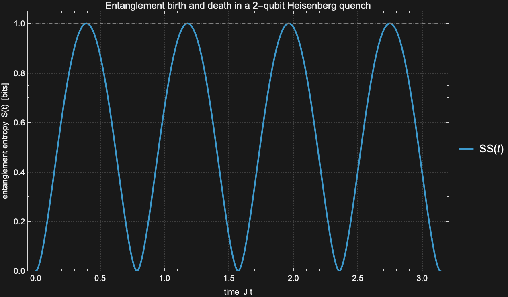

---

## Claim 2: One object model covers all of quantum theory, not just gate circuits

**Unique mechanism:** whole *categories* of object exist in QF that a gate-only framework simply does not have. Each example below is a different such category, and each result is deliberately **numeric**, to keep this claim about *scope* (what exists) and not about symbolics (which is Claim 1's job).

### An open-system object: a quantum channel
A noise process is a first-class `QuantumChannel`, not a gate. Applied to a pure state it returns a genuinely mixed one (purity drops below 1).
```wolfram
before = QuantumState["+"]["Purity"];
after  = QuantumChannel["AmplitudeDamping"[0.5]][QuantumState["+"]]["Purity"];
{before, after}
```
Verified: `{1, 0.875}`. The pure input becomes mixed: irreversible, non-unitary dynamics that a circuit of gates cannot express.

### A generalized measurement: a POVM
Real detectors are not always projective. A SIC-POVM is a `QuantumMeasurementOperator` with **more outcomes than the Hilbert-space dimension**, impossible for projective (gate-model) measurement.
```wolfram
sic = QuantumMeasurementOperator["TetrahedronSICPOVM"];
{Length[sic["POVMElements"]], sic["TargetDimension"], sic["POVMQ"]}
```
Verified: `{4, 2, True}`. Four measurement outcomes on a single 2-dimensional qubit.

### Continuous-variable quantum optics
Bosonic Fock space, not qubits. The second-order coherence $g^{(2)}(0)$ classifies light by its photon statistics.
```wolfram
Needs["Wolfram`QuantumFramework`SecondQuantization`"];
{G2Coherence[FockState[1]], G2Coherence[CoherentState[20][1.5]], G2Coherence[ThermalState[1.0, 20]]}
```
Verified: Fock $|1\rangle \to 0$ (antibunching, nonclassical), coherent $\to 1.0$ (laser), thermal $\to 2.0$ (bunching).

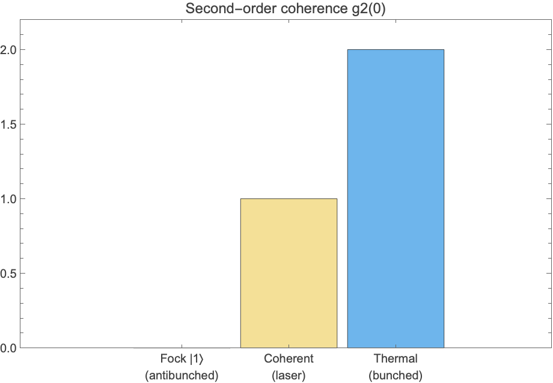

### A phase-space quasi-probability
The Wigner function lives in continuous phase space, and its **negativity** is a signature of nonclassicality with no classical or gate-circuit analogue.
```wolfram
w = WignerRepresentation[FockState[1], {-4, 4}, {-4, 4}, "GridSize" -> 90];
w[0, 0]
```
Verified: $W(0,0) = -0.318 < 0$. The single photon has a negative dip at the origin.

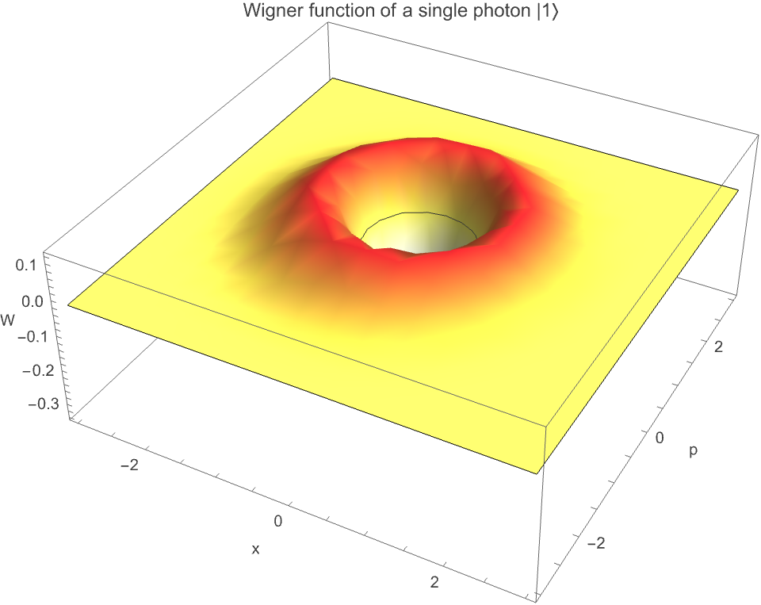

### And these object categories are symbolic too
The scope and the symbolics compose: an open-system channel with a *free* damping rate $\gamma$ returns an exact density matrix, so you can study the whole decoherence trajectory at once.
```wolfram
QuantumChannel["AmplitudeDamping"[\[Gamma]]][QuantumState["+"]]["DensityMatrix"] // Simplify
```
$$
\rho_{\text{out}} = \begin{pmatrix}\dfrac{1+\gamma}{2} & \dfrac{\sqrt{1-\gamma}}{2}\\[2mm] \dfrac{\sqrt{1-\gamma}}{2} & \dfrac{1-\gamma}{2}\end{pmatrix}, \qquad \text{coherence} = \frac{\sqrt{1-\gamma}}{2}
$$

---

## Claim 3: A quantum object is a first-class Wolfram Language expression

**Unique mechanism:** a QF object is an ordinary Wolfram Language expression, so the same `obj["..."]` dispatch and the same built-in functions (`Plot`, `Reduce`, `Dataset`, ...) apply to it directly. Each example below is a different WL operation flowing through a QF object.

### Property dispatch: one object, many questions
Ask one object many questions, get answers, no extra packages.
```wolfram
bell = QuantumState["Bell"];
{bell["Purity"], bell["VonNeumannEntropy"], QuantumEntangledQ[bell],
 QuantumEntanglementMonotone[bell, "Concurrence"]}
```
Verified: `{1, Quantity[0, "Bits"], True, 1}` (pure, zero global entropy, entangled, maximal concurrence).

The same dispatch returns **closed forms** when the state carries a symbol. A Werner state's purity and entropy as exact functions of $p$:
```wolfram
w = QuantumState["Werner"[p, 2]];
{w["Purity"], w["VonNeumannEntropy"]} // Simplify
```
$$
\text{purity}(p) = \left|\,1 - 2p + \tfrac{4p^2}{3}\,\right|, \qquad S(p) = \frac{(p-1)\log(1-p) - p\,\log\frac{p}{3}}{\log 2}\ \text{bits}
$$

### Straight into `Plot`
A QF call goes directly inside a built-in. The concurrence of $\cos\theta\,|00\rangle+\sin\theta\,|11\rangle$ is computed by QF and plotted by Mathematica.
```wolfram
conc[t_?NumericQ] := QuantumEntanglementMonotone[
  QuantumState[{Cos[t], 0, 0, Sin[t]}, 2], {1}, "Concurrence"];
Plot[conc[t], {t, 0, Pi/2}, Frame -> True,
 FrameLabel -> {"\[Theta]", "Concurrence"}, PlotTheme -> "Detailed"]
```
QF also returns the closed form: concurrence $= \sin(2\theta)$.

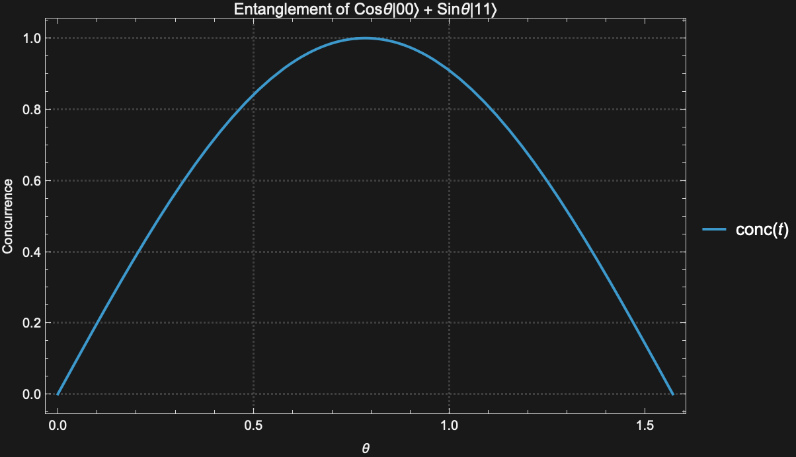

### Straight into `Reduce`
Feed a QF measure into `Reduce` to find a phase boundary. The realignment criterion of a Werner state gives the exact entanglement threshold.
```wolfram
wern = QuantumState["Werner"[p, 2]];
crit = QuantumEntanglementMonotone[wern, "Realignment"] // Simplify;
Reduce[crit > 0 && 0 < p < 1, p]
```
$$
\text{criterion}(p) = \frac{-1 + |\,3 - 4p\,|}{2} > 0 \ \Longleftrightarrow\ 0 < p < \tfrac{1}{2}
$$

### Straight into `Dataset`
Automate a metric sweep across a family of states into a structured table.
```wolfram
states = <|"|00>" -> QuantumState["00"], "Bell" -> QuantumState["Bell"],
  "Werner[0.3]" -> QuantumState["Werner"[0.3, 2]], "Werner[0.9]" -> QuantumState["Werner"[0.9, 2]]|>;
metric[s_] := <|"Purity" -> Round[s["Purity"], 0.001],
  "Entropy(bits)" -> Round[QuantityMagnitude[s["VonNeumannEntropy"]], 0.001],
  "EntangledQ" -> QuantumEntangledQ[s],
  "Concurrence" -> Round[QuantumEntanglementMonotone[s, "Concurrence"], 0.001]|>;
Dataset[metric /@ states]
```
Verified output:

| State | Purity | Entropy (bits) | EntangledQ | Concurrence |
|---|---|---|---|---|
| `\|00>` | 1.0 | 0.0 | False | 0.0 |
| Bell | 1.0 | 0.0 | True | 1.0 |
| Werner[0.3] | 0.52 | 1.357 | True | 0.4 |
| Werner[0.9] | 0.28 | 1.895 | False | 0.0 |

---

## Claim 4: Open, inspectable, and an interoperability hub

**Unique mechanism:** a QF object can *leave* QF for the rest of the ecosystem. (This is the boundary with Claim 5: Claim 5 is about alternative *views that stay inside* QF; Claim 4 is about *exporting to other tools and hardware*.) OpenQASM 3.0 export needs no external account; the other bridges need their Python or credentials.

### Export to OpenQASM 3.0, the universal IR
A circuit becomes the standard text format consumed by Qiskit, Cirq, and most hardware stacks.
```wolfram
QuantumCircuitOperator["GHZ"[3]]["QASM"]
```
```text
OPENQASM 3.0;
qubit[3] q;
bit[0] c;
U(1.5708, 0., 3.14159) q[0];
ctrl(1) @ negctrl(0) @ U(3.14159, 0., 3.14159) q[0] q[1];
ctrl(1) @ negctrl(0) @ U(3.14159, 0., 3.14159) q[1] q[2];
```

### Faithful for non-trivial algorithms
A 3-qubit QFT exports with its controlled-phase gates and final swap intact, not just one-qubit gates.
```wolfram
QuantumCircuitOperator["Fourier"[3]]["QASM"]
```
```text
OPENQASM 3.0;
qubit[3] q;
bit[0] c;
U(1.5708, 0., 3.14159) q[0];
ctrl(1) @ negctrl(0) @ U(0., 0., 1.5708) q[1] q[0];
ctrl(1) @ negctrl(0) @ U(0., 0., 0.785398) q[2] q[0];
U(1.5708, 0., 3.14159) q[1];
ctrl(1) @ negctrl(0) @ U(0., 0., 1.5708) q[2] q[1];
U(1.5708, 0., 3.14159) q[2];
swap q[0] q[2];
```

### Bridges to external tools and hardware
The same object also targets Qiskit, the ZX-calculus engine pyzx, the QuEST simulator, and real IBM / AWS hardware. The QASM above is the artifact these paths build on.
```wolfram
qc = QuantumCircuitOperator["GHZ"[3]];
qc["Qiskit"]                                  (* -> a Qiskit QuantumCircuit object *)
qc["ZXTensorNetwork"]                         (* -> pyzx ZX-calculus graph         *)
qc[QuantumState["000"], Method -> "QuEST"]    (* -> QuEST simulator backend        *)
qc["Qiskit"][QuantumState["000"],
  "Provider" -> "IBM", "Backend" -> Automatic, "Shots" -> 1024]   (* -> IBM QPU; "AWS" for Braket *)
```
> Honesty note: Python/qiskit was **not** available on the machine that produced this document, so this rung is shown but **not executed** (`QuantumCircuitOperatorToQiskit` returned unevaluated when probed). The two QASM rungs above are verified; these bridges are accurate to the audited API but unverified here.

### No symbolic example here, and that is the honest boundary
This is the one claim where a symbolic example does **not** apply. Interop targets are inherently numeric: OpenQASM and real hardware need concrete angles. A symbolic angle fails to export (verified: `QuantumCircuitOperator[{"RY"[\[Theta]] -> 1}]["QASM"]` errors with `StringJoin::string`). Keep your parameters symbolic inside QF (Claims 1, 3, 5); resolve them to numbers at the export boundary.

---

## Claim 5: The same object, many faithful representations

**Unique mechanism:** one object renders as many views *inside QF*, all computed from the same ground truth, so they always agree. (Boundary with Claim 4: these are internal representations, not exports to other tools.) Each example below is a different view.

### As a Bloch sphere
A single-qubit state as a point on the sphere. Here $\cos\frac{\pi}{6}\,|0\rangle + \sin\frac{\pi}{6}\,e^{i\pi/4}|1\rangle$.
```wolfram
QuantumState[{Cos[Pi/6], Sin[Pi/6] Exp[I Pi/4]}]["BlochPlot"]
```
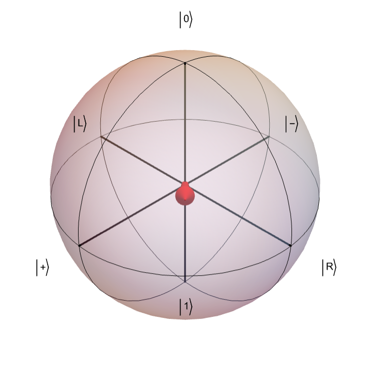

### As a circuit diagram and a matrix
One `GHZ(3)` object, shown as a drawn circuit and as the exact unitary it implements.
```wolfram
qc = QuantumCircuitOperator["GHZ"[3]];
qc["Diagram"]
qc["QuantumOperator"]["Matrix"] // MatrixForm
```
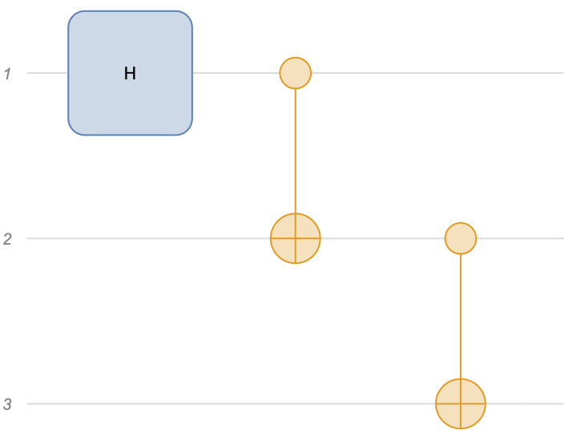
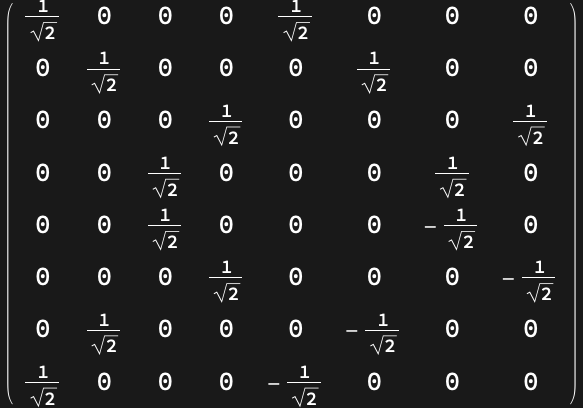

### As a tensor network and a multiway graph
The same circuit as a tensor network (for contraction) and as a multiway graph (Wolfram-Physics-style branching).
```wolfram
qc["TensorNetworkGraph"]
QuantumCircuitMultiwayGraph[QuantumCircuitOperator["GHZ"[2]]]
```
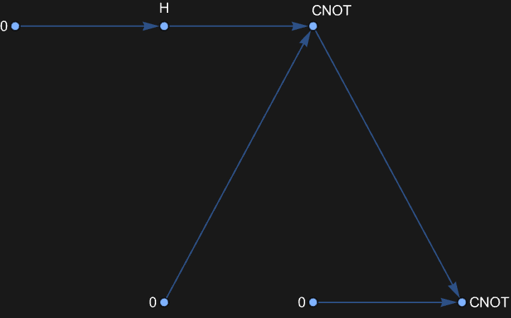
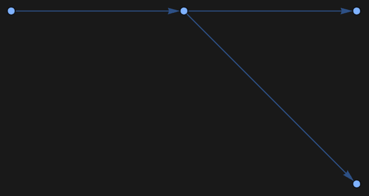

### As a measurement histogram
The outcome distribution as a chart, directly from the state.
```wolfram
probs = QuantumState["GHZ"[3]]["Probabilities"];
BarChart[Values[probs], ChartLabels -> {"000","001","010","011","100","101","110","111"}]
```
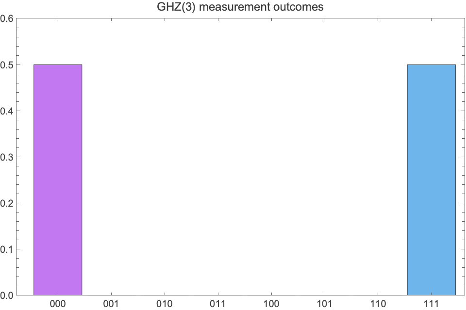

### The views work on symbolic objects too
The representations do not require numbers. A parametric circuit renders as a diagram with the symbols in place, and its matrix view is the exact unitary in the angles.
```wolfram
qc = QuantumCircuitOperator[{"RY"[\[Theta]] -> 1, "RZ"[\[Phi]] -> 2, "CNOT" -> {1, 2}}];
qc["Diagram"]
qc["QuantumOperator"]["Matrix"] // Normal // Simplify
```
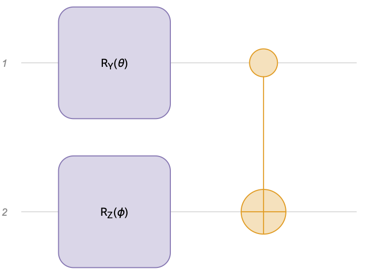

---

## Reproducibility

All examples were run on `Wolfram/QuantumFramework` 2.0.0 (Wolfram Language 15.0). Verification scripts are under `/tmp/qfshow/`; images in `img/showcase/` were exported by the same kernel sessions that produced the numeric and symbolic results. The only unverified block (Claim 4, the external-bridges rung) is explicitly labeled, because the Qiskit/Python bridge was not available in this environment.
