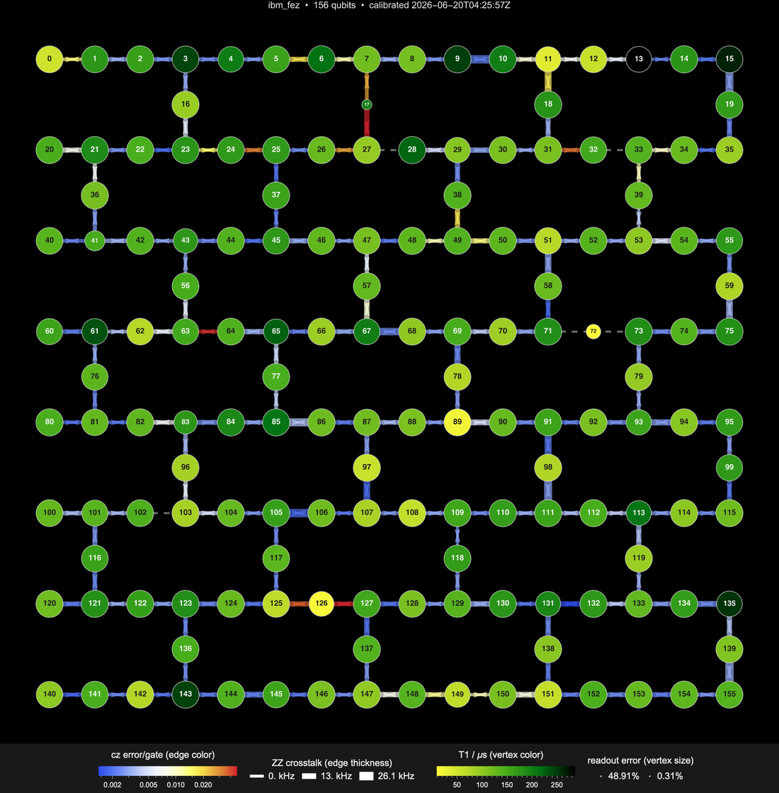

A quantum processor is only as good as its current calibration, and that calibration drifts from hour to hour. This note draws a single picture of an IBM device's instantaneous health: the qubit connectivity graph with the live per-qubit and per-bond calibration painted onto it. It is the IBM analogue of QUALink's <code>QUAConnect[*backend*]["ErrorMap"]</code>, and it reads only the free metadata endpoints, so it runs no circuit and spends no quantum time.

The example below is `ibm_fez`, a 156-qubit Heron r2 device.



## What IBM actually exposes

Two read-only endpoints carry everything the map needs. The device's [ServiceConnect]() connection to `"IBMQuantumPlatform"` already defines both as raw requests.

- **`configuration`** gives the static layout: the coupling map (the list of physically connected qubit pairs), a per-qubit grid coordinate, and the native gate set ($\{cz, id, rx, rz, rzz, sx, x\}$ on Heron).
- **`properties`** gives the live calibration, each value time-stamped: per qubit the relaxation time $T_1$, the dephasing time $T_2$, the single-shot readout error, and the asymmetric state-preparation-and-measurement probabilities; per gate the error and duration; and, in a `general` block, the static $ZZ$ crosstalk for every coupled pair.

One thing is worth stating plainly, because it differs from QUALink: **IBM publishes no Bell-state fidelity**. There is no two-qubit fidelity number beyond the `cz` gate error itself. So the `cz` error becomes the bond *color*, and the natural second per-bond channel is the static $ZZ$ crosstalk: the always-on residual coupling a pair carries even while idle, an error source independent of the gate error.

## Building the map

The error map is a property of the `"IBMQuantumPlatform"` [ServiceConnect]() connection. It needs IBM credentials for the read-only metadata fetch: an API key, and the IBM Cloud resource name stored as `LocalSymbol["ibm_crn"]`.

```wl
#| eval: false
LocalSymbol["ibm_crn"] = "crn:v1:bluemix:public:quantum-computing:us-east:...";
ibm = ServiceConnect["IBMQuantumPlatform", "New", Authentication -> {"apikey" -> api}]
```

Draw the map. A bare call uses the curated default styling shown above and the first available device:

```wl
#| eval: false
ibm["ErrorMap"]
```

Pick a device by name with the `"Backend"` parameter:

```wl
#| eval: false
ibm["ErrorMap", "Backend" -> "ibm_fez"]
```

The connection also exposes the underlying error model and its projections, each keyed by the sorted qubit pair, so the map's numbers are independently queryable (still no circuit, no quantum time):

```wl
#| eval: false
ibm["DeviceModel", "Backend" -> "ibm_fez"]
```

The accessor family is `"DeviceModel"`, `"CouplingMap"`, `"CZErrors"`, `"ZZ"`, `"GateErrors"` (which takes a `"GateName"` parameter, default `"cz"`), `"ReadoutErrors"`, `"Coherence"`, and `"Qubits"`. `"DeviceModel"` fetches once and carries every projection as a key, so it is the efficient path when you need several at once; nothing device-specific is hardcoded, so a metric the device adds later is ingested with no change.

## Reading the map

The drawing carries four calibration channels at once, plus the qubit labels and the defect markers.

- **Bond color** is the $\log_{10}$ of the `cz` gate error, on a temperature scale: blue is a clean coupler, red a lossy one.
- **Bond thickness** is the static $ZZ$ crosstalk (0 to about 26 kHz on `ibm_fez`): a thick bond leaks more always-on coupling.
- **Vertex color** is $T_1$ on an avocado scale. Larger $T_1$ is better, so a long-lived qubit is dark green and a short-lived one glows yellow.
- **Vertex size** is the readout error, but *inverted* so that a big disk is a good (low-readout) qubit. The single worst qubit is therefore the smallest dot.
- **Vertex label** is the physical qubit index, so a problem qubit can be named, not just pointed at.

A coupler IBM currently flags as uncalibrated (gate error reported as exactly 1, the analogue of QUALink's 0 sentinel) is drawn as a dashed gray defect bond, and a qubit with no readout number as a dashed defect site, so the full physical lattice is always visible. The bonds carry double-headed arrows; the next section says why.

## Options

Every channel is a parameter of the `"ErrorMap"` request, so the look is fully steerable; the defaults are the curated dark look above. Pass one override directly after the request name, or several wrapped in a list (the standard `ServiceConnect` parameter form).

| Parameter | Default | Meaning |
|---|---|---|
| `"EdgeColorScheme"` | `"TemperatureMap"` | gradient for the `cz`-error bond color |
| `"VertexColorScheme"` | `"AvocadoColors"` | gradient for the $T_1$ vertex color |
| `"VertexColorReversed"` | `True` | map low $T_1$ to the gradient's bright end |
| `"VertexSizeReversed"` | `True` | big disk = low readout error (good); set `False` for big = bad |
| `"EdgeThicknessMetric"` | `"ZZ"` | bond thickness source: `"ZZ"` crosstalk, `"Duration"` (`cz` length), or `None` |
| `"EdgeThicknessRange"` | `{4., 12.}` | thinnest-to-thickest bond width in points |
| `"EdgeArrows"` | `True` | double-headed arrows on the bonds |
| `"ShowQubitLabels"` | `True` | print the qubit index in each disk |
| `"BackgroundColor"` | `Black` | canvas; the title, legends, and outlines follow its luminance |

A single override goes right after the request name:

```wl
#| eval: false
ibm["ErrorMap", "BackgroundColor" -> White]
```

Several overrides are passed as one list of rules:

```wl
#| eval: false
ibm["ErrorMap", {"Backend" -> "ibm_fez", "BackgroundColor" -> White, "EdgeThicknessMetric" -> "Duration"}]
```

## Why the bonds are bidirectional

IBM's native two-qubit gate is the controlled-$Z$, $\mathrm{CZ} = \mathrm{diag}(1, 1, 1, -1)$, which is **symmetric**: swapping the two qubits leaves the gate unchanged, and the hardware calibrates both orderings to identical numbers. There is therefore no control or target for a `cz`, which is why the bonds are undirected and the arrows are drawn double-headed (bidirectional) rather than one-way.

A directional `CNOT` is synthesized from a `cz` and single-qubit gates, with the basis-change Hadamards placed on whichever qubit you choose. So a `CNOT` can be realized in either orientation on the same physical bond: either qubit can serve as control or target.

## How it works

The map lives entirely on the `"IBMQuantumPlatform"` connection. The `"ErrorMap"` request reads `"RawBackendConfiguration"` and `"RawBackendProperties"` (the same IAM-token and service-CRN authentication the connection already carries), folds them into one normalized, provider-neutral device model, and draws it. The drawing uses only built-in graphics, so the feature adds no dependency on the quantum paclet. This mirrors QUALink's <code>QUAConnect[*backend*]["ErrorMap"]</code>, with the per-pair $ZZ$ crosstalk standing in for the Bell-state fidelity that QUA exposes and IBM does not.
