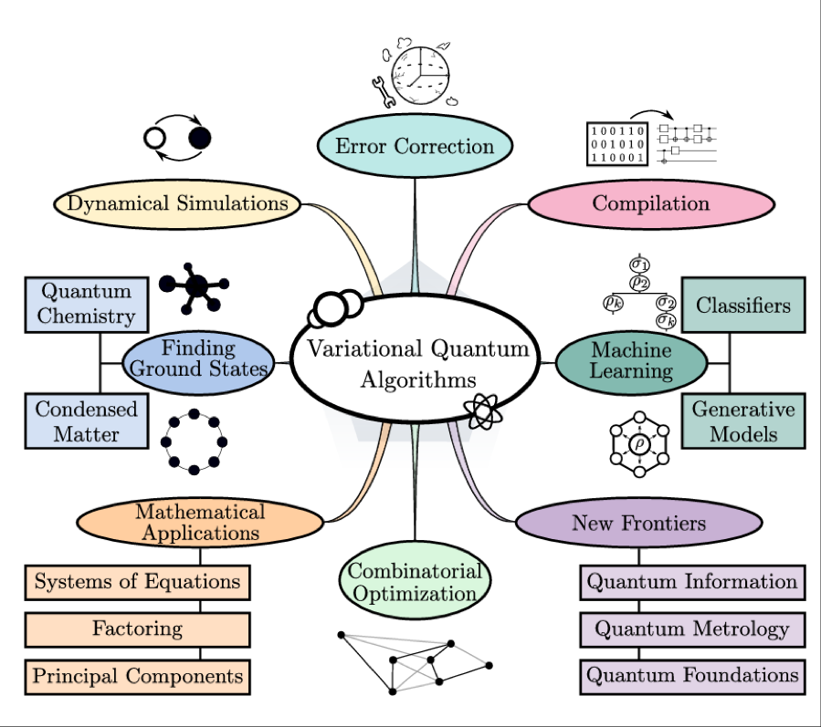
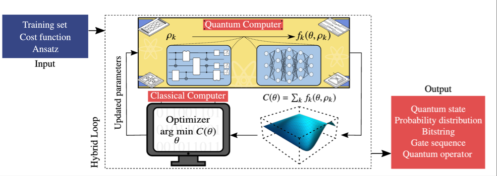
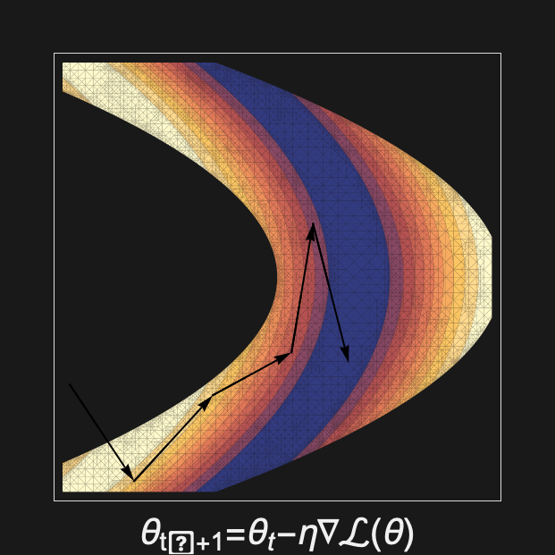
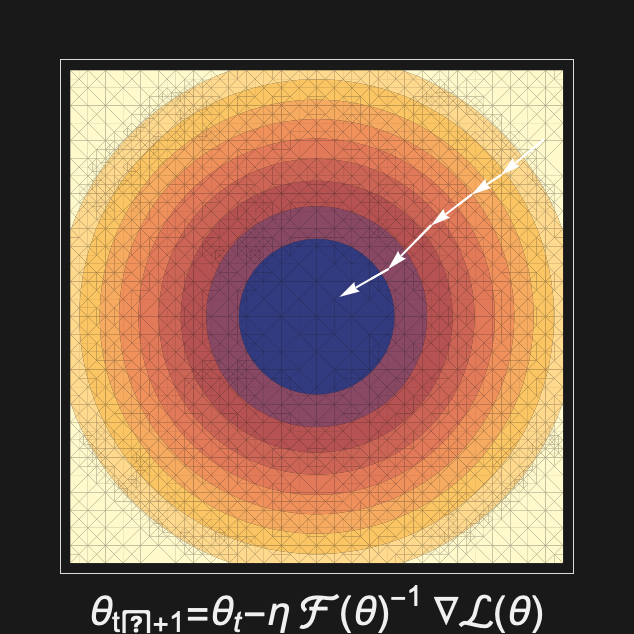
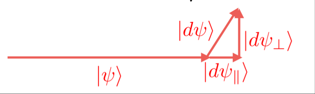
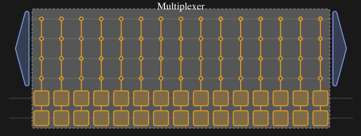
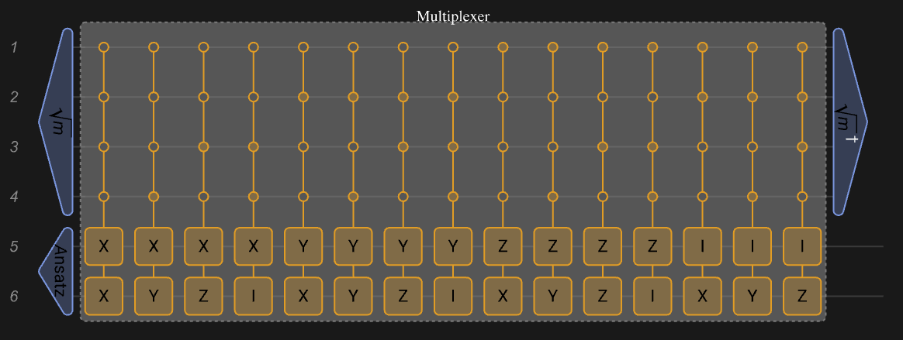
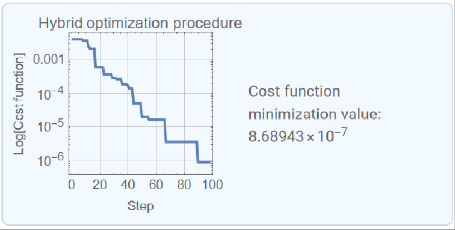

This technical note presents documentation for the functionalities utilized in the implementation of quantum optimization algorithms. The document systematically outlines the core features, methodologies, and application contexts of the framework, offering insights into its integration within the quantum computational paradigm.

By providing a comprehensive overview and usage guidelines for these functions, we aim to introduce new and experienced users into quantum optimization techniques and quantum computing research.

```wl
<< Wolfram`QuantumFramework`
<< Wolfram`QuantumFramework`QuantumOptimization`
```

## Variational Quantum Algorithms

### Introduction

Quantum computing has long been envisioned as a transformative technology, with the potential to tackle problems that are intractable for classical computers. Quantum algorithms promise exponential speedups in areas such as number factorization, quantum system simulation, and solving linear systems of equations.

The introduction of cloud-based quantum computers in 2016 provided public access to real quantum hardware. However, due to noise and the limited number of qubits, running large-scale quantum algorithms remained impractical. This led to growing interest in what could be achieved with these early devices, commonly referred to as Noisy Intermediate-Scale Quantum (NISQ) computers. Today’s state-of-the-art NISQ devices contain up to 1000 qubits, with only two quantum processors having over 1,000 qubits, making it possible to surpass classical supercomputers in specific, carefully designed computational tasks—a milestone known as quantum supremacy.

Variational Quantum Algorithms (VQAs) have emerged as the leading approach for using the power of NISQ devices. Given the constraints of current quantum hardware, VQAs employ a hybrid quantum-classical optimization framework. They utilize parameterized quantum circuits executed on a quantum computer, while classical optimizers adjust the parameters to minimize a given cost function. This strategy mirrors machine-learning techniques, such as neural networks, which rely on optimization-based learning methods.

### Applications

VQAs have been explored for a wide range of applications, spanning nearly all areas initially envisioned for quantum computing. As illustrated in the following image, VQAs are applied across various domains, including error correction, machine learning, combinatorial optimization, ground-state estimation, and mathematical problem-solving.



Cerezo, M., Arrasmith, A., Babbush, R. et al. Variational quantum algorithms. Nat Rev Phys 3, 625–644 (2021)

While they hold promise for achieving near-term quantum advantage, significant challenges remain, including issues related to trainability, accuracy, and efficiency. Addressing these challenges is crucial for the continued advancement of VQAs and their practical implementation in solving real-world problems.

In simple terms, Variational Quantum Algorithms (VQAs) are one of the most popular approaches for running quantum algorithms on today’s early-stage quantum computers. You can think of VQAs like “putting the carriage before the horses”, we know what problem we want to solve, but we don’t yet know the exact quantum circuit to do it. Instead of designing the circuit manually, VQAs use classical optimization techniques to “learn” the best circuit for the task.

### Pipeline

The core components of this algorithms include a parameterized quantum circuit, known as the ansatz, which is used to represent possible solutions. This ansatz is evaluated through a cost function that encodes the problem we are trying to solve. Finally, a training procedure, primarily driven by a classical optimizer, adjusts the parameters of the ansatz to improve the solution iteratively.

```wl
v1 = "Circuit Ansatz"; v2 = "Problem-Specific\nCost Function"; v3 = \
"Training Procedure";
edges = DirectedEdge @@@ {v1 -> v2, v2 -> v3, v3 -> v1};

GraphPlot[edges, PlotTheme -> "VibrantColor" , VertexSize -> Large, 
 VertexLabels -> Placed["Name", {1/2, 1/2}], 
 VertexLabelStyle -> Directive[White, Italic, 15], 
 VertexCoordinates -> {v1 -> {0.125, 0.1}, v2 -> {.1, 0.05}, 
   v3 -> {.15, .05}}, PlotLabel -> "VQA Components", 
 ImageSize -> Large]
```

This process is best illustrated in the Hybrid Loop shown in the next image. The quantum computer runs the ansatz, the results are evaluated through the cost function, and the classical optimizer processes this information to update the parameters for the next iteration.



Cerezo, M., Arrasmith, A., Babbush, R. et al. Variational quantum algorithms. Nat Rev Phys 3, 625–644 (2021)

Now, rather than just describing it, let’s dive into parametrized circuits!

## Variational Circuits

The area of Quantum Optimization depends heavily in variational algorithms. This algorithms work by exploring and comparing variational states $|\phi \, (\theta )\rangle $ that depends on a set of $\{\, \theta \, \}_{n}$ parameters.

You can build this variational states using a fixed initial state as $|0\rangle $ and a parametrized or variational quantum circuit $V(\theta )$:

$$|\phi \, (\theta )\rangle =V(\theta )|0\rangle $$

We aim to train these variational quantum circuits using an optimizer in conjunction with a cost function that reflects the objective of our optimization. Many of the algorithms presented here are Hybrid Algorithms, meaning they combine a quantum circuit with a classical optimizer.

Wolfram Quantum Framework supports *"free parameters"* in their quantum circuits. In order to implement a variational quantum circuit, you only need to specify this tunable parameters by using the "Parameters" option:

```wl
vqc = QuantumCircuitOperator[{"00", "RX"[\[Theta]1] -> {1}, 
    "RY"[\[Theta]2] -> {2}}, "Parameters" -> {\[Theta]1, \[Theta]2}];
```

```wl
vqc["Diagram"]
```

The parameters defined for a Wolfram Quantum Framework Operator are heritable, so you do not need to redefine it in later steps. For example we can calculate the resultant $|\phi \, (\theta )\rangle $ state from our defined variational circuit:

```wl
vqs = vqc[]
```

We can verify that the "Parameters" option values:

```wl
vqs["Parameters"]
```

This option simplifies the repeated execution of the circuit by using the symbolic computation capabilities provided by the Wolfram Quantum Framework:

```wl
vqc["Formula"]
```

Replace θ1 value as follows:

```wl
vqc[<|\[Theta]1 -> 0|>]["Formula"]
```

As mentioned earlier, you can use the parameters at any stage of your algorithm, as they are carried through each step:

```wl
vqs["Formula"]
```

```wl
vqs[<|\[Theta]2 -> 0, \[Theta]1 -> 0|>]["Formula"]
```

You can directly replace the values for each parameter following the same order you defined them:

```wl
vqs[0, 0]["Formula"]
```

```wl
vqs[a, b]["Formula"]
```

In the following sections, we will explore variational algorithms, which will require an understanding of how to properly design (ansatz circuits) and train (classical optimizers) these variational circuits.

### Initial State Preparation

A reference state serves as the fixed starting point for our problem. To prepare a reference state, we apply a non-parameterized unitary gate $U_{R}$​ at the beginning of our quantum circuit, ensuring that our initial state is given by:

$\begin{matrix}|\psi_{i}\rangle =U_{R}|0\rangle \end{matrix}$

If you have an educated guess or an existing optimal solution, using it as the reference state can help the variational algorithm converge faster.

The simplest reference state is the default state, where we initialize an n-qubit quantum circuit in the all-zero state:

$\begin{matrix}|\psi_{i}\rangle =|0\rangle^{\otimes n},\, U_{R}=\mathbb{1}\end{matrix}$

For this default state, our unitary operator is simply the identity operator. Due to its simplicity, this default state is widely used as a reference state in many applications.

If we want to start with a more complex reference state that involves superposition and entanglement, we can prepare a state such as:

```wl
qc = QuantumCircuitOperator[{"H" -> 1, "CNOT" -> {1, 2}}, 
   "Label" -> "\!\(\*SubscriptBox[\(U\), \(R\)]\)"];
qc = QuantumCircuitOperator[{"00", qc}];
qc["Diagram", ImageSize -> Small]
```

Which is also called a Bell State:

```wl
qc[]["Formula"]
```

### Ansatz Circuits

In physics and mathematics, the German word “Ansatz” refers to an educated guess for solving a problem. You may have done this before—trying out a potential solution based on intuition or prior knowledge. However, an ansatz is not just any guess; it must be well-informed.

In Variational Quantum Algorithms (VQAs), what we are guessing is the quantum circuit that will solve our problem. This is why we refer to this circuit simply as the ansatz

Generate a collection of parametrized states:

$\begin{matrix}|\psi (\overset{ \to }{\theta })\rangle =U_{V}(\overset{ \to }{\theta })U_{R}|0\rangle \end{matrix}$

**How Do We Choose an Ansatz?**

- Problem-Inspired Ansatz

  - If we have prior knowledge about the problem, we can use physical intuition or mathematical insights to design a circuit tailored to the task. This approach typically leads to more efficient circuits with fewer parameters, making optimization easier. These are usually referred to generally as Hardware-Efficient ansatz.

- Problem-Agnostic Ansatz

  - If we lack detailed knowledge about the problem, we can use a more general universal ansatz that does not rely on problem-specific intuition. These ansatze are more expressive, meaning they can represent a wide range of solutions. However, they also tend to be larger, with more gates and parameters, making the optimization process significantly harder.

If we consider this simple ansatz, consisting of a pair of rotations and a CNOT gate, we can evaluate it and examine the states that can be generated:

```wl
ansatz = 
  QuantumCircuitOperator[{"00", "RY"[2 \[Theta]1], 
    "RY"[2 \[Theta]2] -> {2}, "CNOT"}];
ansatz["Diagram"]
```

As we observe, the possible states generated by this ansatz are limited to those determined by the sine and cosine functions. Therefore, even with an excellent optimizer, there will be certain values that this ansatz will never be able to reach:

```wl
ansatz["Table"]
```

**How good is an ansatz?**

- Expressibility

  - This measures the range of functions that the quantum circuit can represent. Higher expressibility is generally linked to more entanglement and a greater number of parameters. The more expressive an ansatz is, the more problems it can potentially solve.

- Trainability

  - This refers to how easy it is to find the right parameters for the circuit. Larger, highly expressive circuits are harder to optimize because the optimizer must explore a vast parameter space. The difficulty of training also depends on the cost function and the classical optimizer used.

There is a natural trade-off between expressibility and trainability. Highly expressive circuits are powerful but harder to train, while simpler circuits may be easier to optimize but might not capture the necessary complexity of the problem.

The goal is to find an ansatz in the “sweet spot”—one that is expressive enough to solve the problem but still trainable within a reasonable amount of time.

Now, let’s explore this concept further with an exercise!

- Exercise 1:

Express the collection of parametrized states generated by the following ansatz:

```wl
QuantumCircuitOperator[{"RX"[\[Theta]], "CNOT"}]["Diagram", 
 ImageSize -> Small]
```

Step by step:

```wl
QuantumOperator["RX"[\[Theta]]]@QuantumState["00"] // TraditionalForm
```

```wl
result1 = QuantumOperator["CNOT"]@%
```

```wl
result1["Formula"]
```

- Exercise 2:

Express the collection of parametrized states generated by the following ansatz:

```wl
QuantumCircuitOperator[{"RX"[\[Theta]1], "RX"[\[Theta]2] -> {2}, 
   "CNOT"}]["Diagram", ImageSize -> Small]
```

Following the same steps:

```wl
QuantumOperator[{"RX"[\[Theta]1] -> 1, "RX"[\[Theta]2] -> 2}, 
  "Parameters" -> {\[Theta]1, \[Theta]2}]@QuantumState["00"]
```

```wl
result2 = QuantumOperator["CNOT"]@%
```

```wl
result2["Formula"]
```

We can verify that the second ansatz has more expressibility by the simple fact that:

```wl
result2[\[Theta], 0]["Formula"]
```

The first ansatz is a specific case of the second ansatz:

```wl
result1["Formula"]
```

#### Layered Circuit Architecture

What happens if we have no idea about the problem solution?

Layered gate architectures, where the ansatz is repeated multiple times, have been shown to offer a good balance between expressibility and relatively low circuit depth, making them effective for tackling a broad range of problems.

If the problem we are trying to solve doesn’t require a large number of parameters, a good option might be to use an ansatz called the Basic Entangler. This ansatz is often favored for its simplicity and efficiency in cases where the problem doesn’t demand an overly complex parameterized quantum circuit. This layers consist of one-parameter single-qubit rotations on each qubit, followed by a closed chain or ring of CNOT gates.

```wl
basicentanglement = 
  QuantumCircuitOperator[{"000", "RX"[\[Theta]1] -> 1, 
    "RX"[\[Theta]2] -> 2, "RX"[\[Theta]3] -> 3, "CNOT" -> {1, 2}, 
    "CNOT" -> {2, 3}, "CNOT" -> {3, 1}}];
basicentanglement["Diagram"]
```

```wl
basicentanglement["Table"]
```

In order to generate multiple layers of parametrized gates or controlled gates you can use the following functionalities:

<!-- #| style: DefinitionBox -->
|   |   |
|---|---|
| `GenerateParameters[n,m,opts]` | generate *n x m *parameters, indicating the *n* number of qubits and *m* number of layers. The parameters are named $\theta_{i}$ for i ∈ {1,…, *n x m*} |
| ParametrizedLayer[gate,qubits,index, opts] ParametrizedLayer[gate,index, opts] | generates a layer of parameterized gates on the specified *qubits*. The parameters are denoted as $\theta_{i}$ where i ∈ *index*. If only *index* is provided (with no $qubits$), a layer of gates with the same length is generated for all qubits. |
| `EntanglementLayer[cgate,qubits]` | generate a layer of controlled cgate connecting each qubits |

#### ParametrizedLayer & GenerateParameters

<!-- #| style: Subsubsubsection -->
**ParametrizedLayer**

The **ParametrizedLayer** function reduces redundant code in layered quantum circuit architectures by applying parameterized gates and automatically generating the necessary parameters.

It is possible to specify both the qubits on which the parameterized gates will be applied and the index for each parameter:

```wl
ParametrizedLayer["RY", Range[1, 3], {a, b, c}]
```

```wl
ParametrizedLayer["RY", Range[97, 99], Range[3]]
```

Alternatively, you can specify only the parameter indices, and the gates will be generated sequentially for each qubit, starting from qubit 1:

```wl
ParametrizedLayer["RY", Range[4, 6]]
```

```wl
QuantumCircuitOperator[{%}]["Diagram", ImageSize -> Small]
```

<!-- #| style: Subsubsubsection -->
**GenerateParameters**

The **GenerateParameters** function generates a list of symbols; you only need to specify the number of qubits and layers in the quantum circuit:

```wl
GenerateParameters[3, 3]
```

<!-- #| style: Subsubsubsection -->
Example

```wl
basicentaglement = QuantumCircuitOperator[{"00000",
    ParametrizedLayer["RY", Range[5]],
    EntanglementLayer["CNOT", Range[5], "Entanglement" -> "Linear"],
    "Barrier",
    ParametrizedLayer["RY", Range[6, 10]],
    EntanglementLayer["CNOT", Range[5], "Entanglement" -> "Linear"],
    "Barrier",
    ParametrizedLayer["RY", Range[11, 15]]},
   "Parameters" -> GenerateParameters[5, 3]
   ];
```

```wl
basicentaglement["Diagram", ImageSize -> Full]
```

<!-- #| style: Subsubsubsection -->
**Options**

<!-- #| style: DefinitionBox3Col -->
|   |   |   |
|---|---|---|
| `"Symbol"` | "θ" | define the main symbol used for the parameters |

GenerateParameters and ParametrizedLayer functions use "θ" as default symbol:

```wl
GenerateParameters[3, 3]
```

```wl
ParametrizedLayer["RY", Range[4, 6]]
```

Use "Symbol" option to change the default symbol:

```wl
GenerateParameters[3, 3, "Symbol" -> "\[Phi]"]
```

```wl
ParametrizedLayer["RY", Range[4, 6], "Symbol" -> "\[Phi]"]
```

#### EntanglementLayer

The **EntanglementLayer** function is designed to reduce redundant code in layered quantum circuit architectures by facilitating controlled operations between qubits.

```wl
EntanglementLayer["CNOT", {1, 2, 3}]
```

The **EntanglementLayer** function returns a Sequence of multiple Rules, each representing a controlled gate applied to connected qubits according to the chosen entanglement strategy. Currently, the function supports only named controlled gates between two qubits.

```wl
QuantumCircuitOperator[{
   EntanglementLayer["CH", Range[10], "Entanglement" -> "Linear"]
   }]["Diagram"]
```

<!-- #| style: Subsubsubsubsection -->
Entanglement

The "Entanglement" option specifies the strategy used for entanglement. It supports the following values:

<!-- #| style: DefinitionBox -->
|   |   |
|---|---|
| `Automatic` | each qubit is entangled with all the others. |
| `"Linear"` | each qubit is entangled with the following qubit in the sequence |
| `"Circular"` | each qubit is entangled with all others, with an additional connection between the first and last qubit before the sequence. |
| `"ReverseLinear"` | each qubit is entangled with the following one, in reverse order from last to first |
| `"Pairwise"` | consists of two layers: one for even-positioned qubits and another for odd-positioned qubits, each entangled with the next. |

```wl
qubits = Range[5];
strategy = {Automatic, "Linear", "ReverseLinear", "Pairwise", 
   "Circular"};
subqc = QuantumCircuitOperator[{EntanglementLayer["CNOT", qubits, 
       "Entanglement" -> #]}, "Label" -> #] & /@ strategy;
```

```wl
QuantumCircuitOperator[subqc]["Diagram", ImageSize -> Large]
```

## Variational Quantum Eigensolver (VQE)	

The variational quantum eigensolver (VQE) is a hybrid algorithm that combines classical and quantum computing to determine the ground state energy of a Hamiltonian. It utilizes quantum algorithms to calculate expected energy values and classical optimization techniques for minimizing that energy.

VQE plays a crucial role in quantum optimization, particularly in solving complex problems in quantum chemistry and materials science. By enabling efficient simulations of intricate systems, VQE can address optimization tasks that are challenging for classical methods alone.

Given a Hamiltonian operator *H*, this method consist of two main components:

- A variational circuit ansatz $V(\theta )$.

- A cost function $\mathcal{L}=\langle \phi (\theta )|H|\phi (\theta )\rangle $, where $|\phi \, (\theta )\rangle =V(\theta )|0\rangle $ .

The method involves iteratively adjusting θ to minimize the average energy or cost function 𝒻.

#### Implementation

In order to understand how to proceed with the VQE algorithm, let's drive the a variational state$|\phi \, (\theta )\rangle $ to the ground state of the following Hamiltonian:

```wl
H = QuantumOperator["X" + "Z"]
```

Define the ansatz circuit V(θ):

```wl
V = QuantumCircuitOperator[{"0", "RX"[\[Theta]1] -> {1}, 
    "RY"[\[Theta]2] -> {1}}, "Parameters" -> {\[Theta]1, \[Theta]2}];
"Diagram" // V
```

Calculate $|\phi \, (\theta )\rangle $ from the ansatz circuit V:

```wl
\[Phi] = V[];
"Formula" // \[Phi]
```

Implement the cost function ℒ as stated before:

```wl
\[ScriptCapitalL][\[Theta]1_, \[Theta]2_] = 
  ComplexExpand["Scalar" // SuperDagger[\[Phi]]@H@\[Phi]];
\[ScriptCapitalL][\[Theta]1, \[Theta]2] // Simplify
```

Calculate the ground state eigenvalue of *H* by minimizing 𝒻:

```wl
MinValue[\[ScriptCapitalL][\[Theta]1, \[Theta]2], {\[Theta]1, \
\[Theta]2}]
```

#### Visualizations

In order to visualize the optimization process, we need to get all the parameter values during the evolution, in this case we will use a simple gradient descent method:

```wl
initialPosition = {0.1, 0.1};
```

```wl
params = GradientDescent[\[ScriptCapitalL], initialPosition];
```

It would be also useful to calculate all the cost function values during each step of the parameter evolution:

```wl
costs = \[ScriptCapitalL] @@@ params;
```

<!-- #| style: Subsubsubsection -->
Cost curve

We can visualize the evolution of our optimization during time in an Cost Curve, also known as Loss Curve:

```wl
ListLinePlot[costs, PlotRange -> {{0, 15}, {-1.5, 0.1}}, 
 PlotLabel -> "Loss Curve", Frame -> True, GridLines -> Automatic, 
 FrameLabel -> {"Step", "Cost function"}, ImageMargins -> 1, 
 Epilog -> {{Red, Dashed, 
    Line[{{0, -Sqrt[2]}, {15, -Sqrt[2]}}]}, {Red, 
    Inset["-\!\(\*SqrtBox[\(2\)]\)", {2, -1.3}]}}]
```

<!-- #| style: Subsubsubsection -->
Parameter Space

We can visualize the evolution of our optimization in the parameter space in a Contour Plot:

```wl
ContourPlot[\[ScriptCapitalL][\[Theta]1, \[Theta]2], {$CellContext`\
\[Theta]1, -2, 2}, {$CellContext`\[Theta]2, -3, 1}, ImageMargins -> 1, 
 FrameLabel -> {"\[Theta]1", "\[Theta]2"}, 
 PlotLabel -> "Cost Function Parameter Space", ContourStyle -> None, 
 Contours -> 10, 
 Epilog -> {{Dashed, Line[$CellContext`params]}, 
   PointSize[Large], {Blue, Point[First[$CellContext`params]]}, {Red, 
    Point[Last[$CellContext`params]]}, 
   Inset["Initial Value", First[$CellContext`params], {-1, -2}], 
   White, Inset["Final Value", Last[$CellContext`params], {-1.5, -2}]}, 
 ImageSize -> Medium]
```

<!-- #| style: Subsubsubsection -->
Gradient Vector Plot

The stream plot of the gradient of our cost function can provide insight into the behavior of the evolution as observed in its parameter space:

```wl
StreamPlot[
 Evaluate[-Grad[\[ScriptCapitalL][\[Theta]1, \[Theta]2], {\[Theta]1, \
\[Theta]2}]], {$CellContext`\[Theta]1, -2, 
  2}, {$CellContext`\[Theta]2, -3, 1}, ImageMargins -> 1, 
 FrameLabel -> {"\[Theta]1", "\[Theta]2"}, 
 PlotLabel -> "Cost Function Gradient Vector Plot", 
 Epilog -> {PointSize[Large], {Blue, 
    Point[First[$CellContext`params]]}, {Red, 
    Point[Last[$CellContext`params]]}, 
   Inset[Style["Initial Value", Bold], 
    First[$CellContext`params], {-2, 0}], 
   Inset[Style["Final Value", Bold], 
    Last[$CellContext`params], {-2.5, 0}]}, ImageSize -> Medium]
```

#### Quantum Chemistry

The Variational Quantum Eigensolver (VQE) is a valuable tool in quantum chemistry for finding the minimal energy of a molecule. The task is essentially an optimization problem, where the goal is to minimize the total energy of the molecule with respect to the positions of the atomic nuclei.

In the case of VQE, we use parameterized quantum circuits to approximate the ground state energy of the system. This results in the determination of the minimal energy of the system, which corresponds to the lowest energy configuration of the molecule in its ground state.

This minimal energy result can be incredibly useful in determining the geometry of the molecule as well, as the lowest energy corresponds to the optimized configuration of the atomic nuclei. Therefore, although the main goal is to minimize the energy, this process can also provide insights into the stable arrangement of atoms in the molecule.

<!-- #| style: Subsubsubsection -->
Toy $H_{2}$ Molecule

The current problem is finding the ground state of the $H_{2}$ molecule;,the Hamiltonian can be reduced and modeled using two qubits as:

```wl
H2 = QuantumOperator[\[Alpha] ("ZI" + "IZ") + \[Beta]*"XX"]
```

Implement the algorithm as we learned last class:

- **First:** Parametrized quantum circuits, state and ansatz preparation.

In this case we will use a typical hardware-efficient ansatz: Two layers of Rotations and a CNOT to ensure the entanglement.

```wl
HEAnsatz = 
  QuantumCircuitOperator[{"00", "RY"[2 \[Theta]1] -> 1, 
    "RY"[2 \[Theta]2] -> 2, "CNOT" -> {1, 2}, "RY"[2 \[Theta]3] -> 1, 
    "RY"[2 \[Theta]4] -> 2}];
HEAnsatz["Diagram"]
```

- Second: Cost function $\langle \, H(\theta )\, \rangle $

We need a cost function, so let’s obtain the QuantumState from the QuantumCircuit and define the bra and ket.

```wl
Ket[{\[Phi]}] = HEAnsatz[]; 
Bra[{\[Phi]}] = SuperDagger[Ket[{\[Phi]}]];
```

Finally lets compute the energy of our system and define a function that will work as the cost function. In this step we should help the optimizer by Simplifying and replacing fixed values.

```wl
energy = Bra[{\[Phi]}]@H2@Ket[{\[Phi]}] ;
```

```wl
values = {\[Alpha] -> 0.4, \[Beta] -> 0.2};
costH2[\[Theta]1_, \[Theta]2_, \[Theta]3_, \[Theta]4_] = 
 FullSimplify[
   "Scalar" // 
    energy, {\[Theta]1, \[Theta]2, \[Theta]3, \[Theta]4} \[Element] 
    Reals] /. values
```

As I mentioned, the cost function we are working with is not trivial, but the advantage is that we can compute it symbolically, which significantly helps in the optimization process.

- Third: Optimization

To find the optimal parameters for our quantum circuit, we can use the NMinimize function in Mathematica.

```wl
resultH2 = 
 NMinimize[
  costH2[\[Theta]1, \[Theta]2, \[Theta]3, \[Theta]4], {\[Theta]1, \
\[Theta]2, \[Theta]3, \[Theta]4}]
```

This function allows us to minimize the cost function by adjusting the parameters, and after performing this minimization, we obtain the optimized parameters and the minimum value of the cost function, which in this case is approximately -0.824.

```wl
paramH2 = Last[resultH2] // Association
```

Now that we have the optimal value, it is insightful to inspect the behavior of the cost function around these points. Since we have four variables (the parameters in the ansatz), we need to fix two of the values in order to visualize the function.

We can do this by using a **ContourPlot**, which will allow us to observe the shape of the cost function in two dimensions.

```wl
ContourPlot[
 costH2[\[Theta]1, \[Theta]2, paramH2[\[Theta]3], 
  paramH2[\[Theta]4]], {\[Theta]1, -\[Pi]/2, \[Pi]/
   2}, {\[Theta]2, -\[Pi]/2, \[Pi]/2}, FrameLabel -> Automatic]
```

**ContourPlot** is useful here because it highlights where the cost function attains higher and lower values. In this plot, the lighter sections correspond to higher values, and the blue sections represent the lowest values of the cost function.

```wl
ContourPlot[
 costH2[\[Theta]1, paramH2[\[Theta]2], \[Theta]3, 
  paramH2[\[Theta]4]], {\[Theta]1, -\[Pi]/2, \[Pi]/
   2}, {\[Theta]3, -\[Pi]/2, \[Pi]/2}, FrameLabel -> Automatic]
```

If the optimization algorithm has started with a point near the blue section (where the minimum lies), we can expect it to converge towards this blue region, as this represents the optimal set of parameters. The algorithm searches for regions where the cost is minimized, and this plot helps visualize the “shape” of the function.

```wl
ContourPlot[
 costH2[paramH2[\[Theta]1], 
  paramH2[\[Theta]2], \[Theta]3, \[Theta]4], {\[Theta]3, -\[Pi]/
   2, \[Pi]/2}, {\[Theta]4, -\[Pi]/2, \[Pi]/2}]
```

When the cost function is relatively simple and can be expressed symbolically, the ContourPlot can exhibit repetitive patterns. This repetition often results from the periodic nature of trigonometric functions (e.g., sin⁡and cos) that may appear in the cost function due to the rotation gates used in the ansatz.

Example from https://arxiv.org/pdf/1909.05074v1

<!-- #| style: Subsubsubsection -->
Trihydrogen cation

In this example we will obtain the minimal energy for the molecule Cation $H_{3}^{+}$.

First we will use some python code from *PennyLane* to obtain the Hamiltonian corresponding to the H3 cation.

We just need to indicate the molecules “H” and the coordinates:

```python
import pennylane as qml
from pennylane import numpy as np

symbols = ["H", "H", "H"]
coordinates = np.array([0.028, 0.054, 0.0, 0.986, 1.610, 0.0, 1.855, 0.002, 0.0])

# Building the molecular hamiltonian for the trihydrogen cation
hamiltonian, qubits = qml.qchem.molecular_hamiltonian(symbols, coordinates, charge=1)

qml.matrix(hamiltonian)
```

In case Python is not available, you can import it from this location:

```wl
Import["https://wolfr.am/1uXbew3vg"]
```

Finally we obtain a NumericArray which we will turn into a QuantumOperator:

```wl
H3 = QuantumOperator[% // Normal]
```

If we have no prior knowledge of the structure of the circuit, a reasonable starting point could be a layered circuit consisting of rotations around the Y-axis and CNOT gates.

To encode the occupation numbers of the molecular spin-orbitals, we would need six qubits.

```wl
param = GenerateParameters[6, 2];
basicMixAnsatz = QuantumCircuitOperator[{
    ParametrizedLayer["RY", Range[1, 6]],
    EntanglementLayer["CNOT", Range[6]],
    "Barrier",
    ParametrizedLayer["RY", Range[7, 12]]
    },
   "Parameters" -> param
   ];
```

If you’d like to learn how to construct layered circuits using **ParametrizedLayer** and **EntanglementLayer **please refer to the [Quantum Optimization documentation](https://resources.wolframcloud.com/PacletRepository/resources/Wolfram/QuantumFramework/tutorial/QuantumOptimization.html).

```wl
basicMixAnsatz["Diagram", ImageSize -> Full]
```

In this case, you can expect a very complex symbolic cost function. To handle this, we could choose to implement a numerical function instead.

```wl
stateAnsatz = basicMixAnsatz[];
```

```wl
matrixH3 = H3["Matrix"];
```

We begin by using Module to define the quantum state with parameters replaced by real numbers. Next, we define the ket and bra, and then compute the scalar resulting from the expectation value of the Hamiltonian *H*.

```wl
ClearAll[meanEnergy]
meanEnergy[values_, H_] := Module[{ket, bra, state},
  state = stateAnsatz[AssociationThread[param, values]];
  ket = state["StateVector"];
  bra = SuperDagger[state]["StateVector"];
  Re[bra . H . ket]
  ]
```

After defining the cost function, we can apply a classical optimizer starting from an initial guess to find the minimum energy value.

```wl
init = Thread[{param, {\[Pi], 0, 0, 0, \[Pi]/2, \[Pi], 0, 0, 0, 
     0, \[Pi], 0}}];
```

```wl
FindMinimum[meanEnergy[param, matrixH3], init] // Quiet
```

## Adiabatic Quantum Computing

### Introduction

Adiabatic quantum computing provides an alternative paradigm for quantum algorithms, where the solution to a problem is encoded in the ground state of a final Hamiltonian. Instead of applying a sequence of quantum gates, the system is initialized in the ground state of a simple Hamiltonian and then slowly evolved toward a problem Hamiltonian whose ground state contains the desired answer.

In practical implementations, however, the success of the algorithm depends on spectral properties such as the minimum energy gap between the ground and first excited states and related quantities that bound the required evolution time.

In this post we illustrate these ideas with an extremely simple one-qubit example, using the Wolfram Quantum Framework to construct the Hamiltonians, visualize the spectral gap, estimate the adiabatic condition, and simulate the quantum evolution. Despite its simplicity, this example clearly shows how the spectral gap governs whether the adiabatic algorithm succeeds or fails, and how small perturbations on the system can dramatically affect the outcome.

### Adiabatic Framework

In adiabatic quantum computing, a computational problem is solved by evolving a quantum system from the ground state of a simple Hamiltonian to the ground state of a second Hamiltonian whose ground state encodes the solution. Instead of applying a sequence of discrete quantum gates, one prepares the system in the easy initial ground state and lets it evolve under a Hamiltonian that slowly interpolates between the two:

$$H(s)=(1-s)H_{B}+s\, H_{P},\, s\in [0,1]$$

Time appears through a rescaled parameter $s\, =\, t/T$ , where T is the total evolution time. The state obeys the time‑dependent Schrödinger equation:

$$i\frac{d}{dt}|\psi (t)\rangle =H(t)|\psi (t)\rangle $$

and at every instant the Hamiltonian has a complete set of instantaneous eigenstates and eigenvalues defined by:

$$H(s)|l\, ;s\rangle =E_{l}(s)|l\, ;s\rangle \, ,\, E_{0}(s) \le E_{1}(s) \le \ldots  \le E_{N-1}(s)$$

where $N$ is the dimension of the Hilbert space. If the system is initialized in the ground state of the initial Hamiltonian $H(s=0)$:

$$|\psi_{0}(s=0)\rangle =|l=0;s=0\rangle $$

then the Adiabatic Theorem states that if the energy gap between the two lowest levels $g(s)=E_{1}(s)-E_{0}(s)$ remains strictly greater than zero for all $s\in [0,1]$, and the evolution time 𝑇 is sufficiently large, the system will remain arbitrarily close to the instantaneous ground state throughout the evolution:

$$lim_{𝑇 \to \infty }|\langle l=0;s=1|\psi (𝑇)\rangle |=1$$

A nonzero gap forces the dynamics to follow the instantaneous ground state from the trivial start to the informative end, rather than wandering through the rest of Hilbert space . The minimum value of $g(s)$ along the path therefore plays a privileged role : it sets how slow the evolution must be.

How slow exactly? A more precise statement of the adiabatic condition involves not only the gap but also how strongly the changing Hamiltonian couples the ground and first excited states. The transition probability from the ground state to the first excited state depends on the matrix element:

$$|\langle 1;s|\frac{dH}{ds}|0;s\rangle |$$

which measures how strongly the changing Hamiltonian couples the instantaneous ground state and the excited state. Then we define:

$$\xi =max_{s\, \in \, [0,1]}|\langle 1;s|\frac{dH}{ds}|0;s\rangle |$$

the adiabatic theorem implies that the total evolution time must satisfy approximately:

$$𝑇>>\frac{\xi }{g_{min}^{2}}\, ,\, g_{min}=min_{s\, \in \, [0,1]}\, g(s)$$

Two quantities, then, control the algorithm: $g_{min}$ measures how close the relevant levels come, and 𝜉 measures how strongly the Hamiltonian mixes them. We will compute both in the example below and then watch what happens when each one fails.

### QuantumAdiabaticEvolve

#### Usage

<!-- #| style: DefinitionBox -->
|   |   |
|---|---|
| `QuantumAdiabaticEvolve[Hb,Hp]` | constructs an adiabatic interpolation between the Hamiltonians Hb and Hp and returns a `QuantumAdiabaticEvolution` object. |

#### Details and Options

## Details & Options

- The interpolating Hamiltonian is defined as $H(s)=(1-s)H_{b}+s\, H_{p}$, where $s\, \in \, [0,1]$.

- The evolution is used to prepare the ground state of the target Hamiltonian $H_{p}$ from the ground state of $H_{b}$.

- The function computes the eigensystem along the interpolation, the spectral gap, the minimum gap, the adiabatic coupling and the estimated evolution time.

- The eigensystem is internally ordered by energy to identify the ground state and first excited state along the interpolation.

- The adiabatic condition is evaluated using the gap and coupling between these two lowest energy levels, which typically dominate non-adiabatic transitions.

- These are the available options for `QuantumAdiabaticEvolve`:

<!-- #| style: DefinitionBox3Col -->
|   |   |   |
|---|---|---|
| `"Parameter"` | `\[FormalS]` | Symbol used as interpolation parameter |
| `"TimeScaling"` | `10` | A dimensionless adiabatic scaling factor for time evolution |

- In the resulting `QuantumAdiabaticEvolution` object, the following properties are supported:

<!-- #| style: DefinitionBox -->
|   |   |
|---|---|
| `"Hamiltonian"` | interpolating Hamiltonian $H(s)=(1-s)H_{0}+s\, H_{m}$ |
| `"Energies"` | eigenvalues of the Hamiltonian as functions of the interpolation parameter |
| `"Eigenvectors"` | eigenvectors corresponding to each energy level |
| `"Eigensystem"` | complete eigensystem $\{E_{i},\psi_{i}\}$ |
| `"LowestEnergies"` | lowest two energy levels, used to define the spectral gap |
| `"EnergyGap"` | spectral gap $g(s)=E_{1}(s)-E_{0}(s))$ |
| `"MinimalEnergyGap"` | minimum value of the spectral gap and the parameter at which it occurs |
| `"LowestEnergyEigenvector"` | ground state $\psi_{0}(s)$ of the interpolating Hamiltonian |
| `"AdiabaticCoupling"` | adiabatic coupling function $|\langle 1;s|\frac{dH}{ds}|0;s\rangle |$ |
| `"MaxAdiabaticCoupling"` | maximum value of the adiabatic coupling and the parameter at which it occurs $\xi =max_{0 \le s \le 1}|\langle 1;s|\frac{dH}{ds}|0;s\rangle |$ |
| `"AdiabaticTimeEstimate"` | estimate of the total evolution time based on the adiabatic condition $𝑇~\lambda \frac{\xi }{g_{min}^{2}}$ |
| `"Parameters"` | interpolation parameter used in the Hamiltonian |
| `"Properties"` | list of all available properties for the object |

- The following properties can also be visualized using built-in plotting options:

<!-- #| style: DefinitionBox -->
|   |   |
|---|---|
| `"EnergySpectrumPlot"` | plots the full energy spectrum $E_{i}(s)$ as a function of the interpolation parameter |
| `"SpectralGapPlot"` | plots the spectral gap $g(s)=E_{1}(s)-E_{0}(s))$ |
| `"AdiabaticCouplingPlot"` | plots the adiabatic coupling function $|\langle 1;s|\frac{dH}{ds}|0;s\rangle |$ |
| `"AdiabaticPathPlot"` | ground state probability distribution evolution along the adiabatic path |

#### Examples

Use `QuantumAdiabaticEvolve` to prepare and analyze the ground state of a target Hamiltonian via adiabatic evolution.

Construct a simple single-qubit adiabatic interpolation:

```wl
Hi = 1/2 (1 - QuantumOperator["X"]);
Ht = 1/2 (1 + QuantumOperator["Z"]);
```

```wl
evol = QuantumAdiabaticEvolve[Hi, Ht]
```

Compute the interpolating Hamiltonian and the corresponding eigensystem:

```wl
evol["Hamiltonian"] // TraditionalForm
```

```wl
evol["Eigensystem"]
```

Inspect its spectral properties, plotting the energy spectrum:

```wl
evol["EnergySpectrumPlot"]
```

Analyze the EnergyGap and the AdiabaticCoupling

```wl
evol[{"EnergyGap", "AdiabaticCoupling"}]
```

```wl
evol[{"SpectralGapPlot", "AdiabaticCouplingPlot"}]
```

Estimate the required evolution time using the minimum spectral gap and the maximum adiabatic coupling:

```wl
evol[{"MinimalEnergyGap", "MaxAdiabaticCoupling"}]
```

By default, the function uses a scaling factor λ=10 to enforce the adiabatic condition when estimating the total evolution time:

```wl
evol["AdiabaticTimeEstimate"]
```

---

From the previous example, we now analyze the instantaneous ground state along the interpolation:

```wl
ground = evol["LowestEnergyEigenvector"]
```

Visualize how the ground state evolves in the computational basis:

```wl
evol["AdiabaticPathPlot"]
```

Observe the transition from the ground state of the initial Hamiltonian to that of the target Hamiltonian:

```wl
ground[0]["Probability"]
```

```wl
Limit[#, s -> 1] & /@ ground[s]["Probability"]
```

The ground state matches the target ground state of $H_{p}$, confirming the success of the adiabatic evolution.

#### Scope

Extend the analysis to more general Hamiltonians, such as perturbed systems, where the target ground state is not known analytically:

```wl
perturbation = (10^-2.*QuantumOperator["X"]);
Hz = 1/2 (1 - QuantumOperator["Z"]);
```

```wl
evol = QuantumAdiabaticEvolve[Hz + perturbation, Ht]
```

Avoided crossing induced by a small perturbation:

```wl
evol["Energies"]
```

```wl
evol["EnergySpectrumPlot"]
```

The perturbation lifts the degeneracy, opening a small but nonzero spectral gap that enables adiabatic evolution:

```wl
evol["MinimalEnergyGap"]
```

A finite gap ensures the success of the adiabatic evolution:

```wl
evol["AdiabaticPathPlot"]
```

#### Applications

Apply the method to a search problem, where the target Hamiltonian encodes the marked state, illustrating how adiabatic evolution can be used to perform quantum search:

```wl
H0 = QuantumOperator["I", 6] - 
   QuantumState["UniformSuperposition"[6]]["Operator"];
```

```wl
Hm = QuantumOperator["I", 6] - 
   QuantumState["Register"[6, 2]]["Operator"];
```

```wl
search = QuantumAdiabaticEvolve[H0, Hm]
```

We analyze the energy spectrum:

```wl
search["Energies"]
```

```wl
search["EnergySpectrumPlot"]
```

Verify that the spectral gap remains nonzero:

```wl
search[{"EnergyGap", "AdiabaticCoupling"}]
```

```wl
search[{"SpectralGapPlot", "AdiabaticCouplingPlot"}]
```

Confirm that the final ground state corresponds to the marked state:

```wl
search["AdiabaticPathPlot"]
```

#### Possible Issues

If the minimum spectral gap is zero, a message is issued and the function returns `$Failed`, as the adiabatic condition cannot be satisfied.

```wl
evolerror = QuantumAdiabaticEvolve[Hz, Ht]
```

---

If the eigensystem contains Root objects, symbolic expressions may remain unresolved and the computation proceeds using numerical approximations instead of exact arithmetic:

```wl
hbroot = QuantumOperator["XI" + "IX"];
hproot = QuantumOperator["ZZ" + 0.6*"ZI" - 0.8*"IZ" + 0.5*"XZ"];
```

```wl
resroot = QuantumAdiabaticEvolve[hbroot, hproot]
```

Properties contain Root objects and also depend on the time parameter $(s)$:

```wl
resroot["EnergyGap"]
```

`QuantumAdiabaticEvolve` evaluates quantities numerically with finite precision:

```wl
resroot[{"MinimalEnergyGap", "MaxAdiabaticCoupling"}]
```

This allows the adiabatic evolution to be analyzed correctly:

```wl
resroot["AdiabaticPathPlot"]
```

## Quantum Approximate Optimization Algorithm (QAOA)

The Quantum Approximate Optimization Algorithm (QAOA) is a well-studied approach for solving combinatorial optimization problems.

The QAOA process involves the following steps:

- Defining a Cost Hamiltonian $H_{C}:$ This Hamiltonian is designed such that its ground state encodes the optimal solution to the combinatorial optimization problem.

- Defining a Mixer Hamiltonian $H_{M}:$ This Hamiltonian is used to explore the solution space by driving transitions between different states.

- Defining the Oracles:

$$U_{C}(t)=e^{-i t H_{C}},\, U_{M}(\theta )=e^{-i \theta H_{M}}$$

- Applying the Oracles alternately in layers, forming the unitary:

$$U(t,\theta )=\prod _{i=1}^{N}U_{c}U_{M}$$

- Preparing an Initial State and Applying $U(t,\theta ):$ The initial state is typically a superposition of all possible states. The alternating application of $U_{C}$ and $U_{M}$ evolves this state according to the chosen parameters.

- Optimizing Parameters and Measuring: Classical optimization techniques are used to adjust the parameters *t *and θ to maximize the expectation value of the cost Hamiltonian $H_{C}.$ The measurement of the final state provides an approximate solution to the original problem.

<!-- #| style: Subsubsubsection -->
Quantum Combinational Optimization

The combinatorial optimization problem involves finding an optimal solution from a finite set of possibilities. This problem can be formulated as maximizing an objective function, which is expressed as a sum of Boolean functions.

Each Boolean function $C_{i}:\{0,1\}^{n} \to \{0,1\}$ takes a *n*-bit string $z=z_{1}z_{2}\ldots z_{n}$ as input and produces a single bit (0 or 1) as output.

For a problem with *n* bits and *m* clauses, the goal is to find a *n*-bit string *z* that maximizes the function:

$$C(z)=\sum _{i=1}^{m}C_{i}(z)$$

Approximate optimization aims to find a near-optimal solution to this problem, which is often NP-hard. The approximate solution is an *n*-bit string *z *that closely maximizes the objective function 𝐶(*t)*.

#### Max-Cut Problem

The Max–Cut problem is a well-known optimization problem in graph theory. The Maximum Cut problem involves partitioning the set of vertices V of a graph into two disjoint subsets, such that the number of edges connecting nodes in different subsets is maximized.

<!-- #| style: Subsubsubsection -->
Formulating Max-Cut with Classical Binary Variables

```wl
g = Graph[Range[4], UndirectedEdge @@@ {{1, 2}, {1, 4}, {2, 3}, {3, 4}},
    GraphStyle -> "NameLabeled", EdgeStyle -> Directive[Black, Thick]];
highlited = 
  HighlightGraph[g, (Subgraph[g, #] &) /@ Last[FindMaximumCut[g]], 
   VertexLabels -> 
    Table[$CellContext`i -> 
      Placed[(-1)^$CellContext`i, Center], {$CellContext`i, 4}]];
cut = Show[{Graphics[{Red, Dashed, 
      BSplineCurve[{{-1.2, -1}, {-0.5, 1.8}, {0.5, 1.8}, {1.2, -1}}]}],
     highlited}, PlotRange -> {{-1.2, 1.2}, {-1.2, 1.2}}, 
   ImageSize -> Medium];
GraphicsRow[{g, cut}]
```

Consider a graph, our goal is to find a partition $\mathcal{p}$ of the graph's vertices $V$ into two sets, $A$ and $B$ , that maximizes the following cost function that counts the number of edges cut. To represent this problem mathematically, we assign each vertex a binary variable $s=\pm 1$

$$C=\frac{1}{2}\sum _{\mathcal{i},\mathcal{j}\, \in \, V}(1-s_{\mathcal{i}}s_{\mathcal{j}}),\, s\in \{-1,+1\}$$

  - If $s_{i}$ and $s_{j}$ have opposite signs:  The cut contributes to the objective function because the vertices are placed in different sets. Mathematically, this happens because $C_{ij}=1-s_{\mathcal{i}}s_{\mathcal{j}}=1$.

  - If $s_{i}$ and $s_{j}$ have same sign:  Then they remain in the same subset, meaning there is no cut and the edge does not contribute to the objective function because $C_{ij}=1-s_{\mathcal{i}}s_{\mathcal{j}}=0$.

Solve the classical Max-Cut problem:

```wl
FindMaximumCut[g]
```

This follows the solution given in the first image:

```wl
cut
```

<!-- #| style: Subsubsubsection -->
Formulating Max-Cut with Quantum Mechanics

To solve the Max-Cut problem on a quantum computer, we need to reformulate it in terms of quantum mechanics. Specifically, we convert the classical optimization problem into one of finding the eigenstate of a quantum Hamiltonian.

In the classical case, we represent a solution using a binary string where each $vertex$ has an associated value $s_{\mathcal{i}}=\pm 1$. In the quantum case, we represent each vertex using a qubit. Since the eigenvalues of Z are also ±1, we map these classical binary variables onto the eigenvalues of the Pauli-Z operator.

Our goal now shifts from finding a binary string to identifying the highest-energy eigenstate of a quantum Hamiltonian.

Max-Cut Hamiltonian obtained by mapping the binary variables $s$ onto Pauli-Z eigenvalues:

$$H_{C}=\frac{1}{2}\sum _{\mathcal{i},\mathcal{j}\, \in \, V}(\mathbb{1}-Z_{\mathcal{i}}Z_{\mathcal{j}})$$

where:

$$Z_{i}Z_{j}|x_{0}\ldots x_{n}\rangle =(-1)^{x_{i}}(-1)^{x_{j}}|x_{0}\ldots x_{n}\rangle ,x_{i}\in \{0,1\}$$

We redefine our variables as $x_{i}=0\, or\, 1$.

Considering the initial image, we can implement $H_{C}$:

```wl
Hc = QuantumOperator[
  1/2 ("IIII" - "ZZII") + 1/2 ("IIII" - "IZZI") + 
   1/2 ("IIII" - "IIZZ") + 1/2 ("IIII" - "ZIIZ")]
```

We just need to express the summatory and for each term indicate which qubits are connected with a Z operator.

Represent each node as a qubit, then we have the bitstring:

$$|x_{1}\ldots x_{n}\rangle $$

where $x_{i}=0$ or $x_{i}=1$ if the node is in set $A$ or $B$.

For the previous problem, we obtained as solution $|0101\rangle \to C=4$.

<!-- #| style: Subsubsubsection -->
Understanding QAOA Ansatz

To implement the Max-Cut problem on a quantum computer, we start by putting the nodes in superposition. This ensures that each node (qubit) has an equal probability of being in either partition.

```wl
superposition = 
  QuantumCircuitOperator[{"00", "HH"}, 
   "Label" -> 
    "\!\(\*SuperscriptBox[TemplateBox[{\"+\"},\n\"Ket\"], \(\
\[TensorProduct]\(4\)\)]\)"];
superposition["Diagram", ImageSize -> Small]
```

We apply a Hadamard gate (H) to each qubit, This transforms the initial state $|0\rangle $ of all qubits into a superposition of all possible cuts:

```wl
superposition["Formula"]
```

```wl
superposition["Probabilities"]
```

Some initial intuition comes from our first example, which involves identifying a periodic pattern, such as 0101 or 1010, within a bitstring.

To achieve this, we need to establish connections between nodes or qubits that reflect the structure of the cost Hamiltonian. For this initial idea, we can evaluate the gate sequence CNOT + RZ + CNOT.

```wl
qcrzz = QuantumCircuitOperator[{"CNOT", "RZ"[\[Gamma]] -> {2}, "CNOT"},
    "Label" -> "Cost"];
qcrzz["Diagram"]
```

We can verify that it distinguish the *possible* correct solutions from the non-periodic bitstrings in order to solve the problem:

```wl
qcrzz[QuantumState["++"]]["Formula"]
```

We can gain some initial insights and visualize the differences in the solution amplitudes in the following plot:

```wl
Plot[Evaluate[Im[Values[#]]], {\[Gamma], -2 \[Pi], 2 \[Pi]}, 
   PlotLegends -> Keys[#1], PlotLabels -> Placed[Automatic, Above], 
   AxesLabel -> {"\[Gamma]", "Amplitude"}] &@
 Normal[qcrzz[QuantumState["++"]]["Amplitudes"]][[;; 2]]
```

The concept becomes clearer when we observe that the probabilities of regular bitstrings are minimal when the probabilities of periodic bitstrings are maximal, and vice versa:

```wl
qcrzz[QuantumState["++"]]["Probability"]
```

```wl
Plot[Evaluate[
    Values[#] /. Im[\[Gamma]] :> \[Gamma]], {\[Gamma], -2 \[Pi], 
    2 \[Pi]}, PlotLegends -> Keys[#1], 
   AxesLabel -> {"\[Gamma]", "Probability"}, 
   PlotLabels -> (Placed[#1[[1]], {#1[[2]], 0.49}] & ) /@ 
     Thread[{Values[#1], {4, -4}}]] &@
 Normal[qcrzz[QuantumState["++"]]["Probability"][[;; 2]]]
```

The set of gates outlined earlier is commonly referred to as an RZZ gate, which combines rotations and controlled operations:

```wl
QuantumCircuitOperator[{{"R", \[Gamma], "ZZ"}}]["Diagram", 
 ImageSize -> Small]
```

```wl
QuantumCircuitOperator[{{"R", \[Gamma], "ZZ"}}]["Table"]
```

Now that we understand this, we can apply it to every pair of qubits connected in the graph. In other words, we apply the RZZ gate to every edge in the graph. This ensures that the quantum state evolves according to the problem constraints.

The previous step does not explore all possible cuts because some amplitudes remain unchanged, so we need to mix things a little bit!

```wl
miniMixer = 
  QuantumCircuitOperator[{"RX"[\[Theta]] -> {1, 2}}, 
   "Label" -> "Mixer"];
miniqaoa = QuantumCircuitOperator[{qcrzz, miniMixer}];
miniqaoa["Diagram"]
```

Visualize the symbolic function corresponding to each possible state:

```wl
miniqaoa["Simplify"]["Table"]
```

Considering the initial state preparation, we recover a *mini*-QAOA:

```wl
miniqaoa[superposition]["Diagram"]
```

The increased expressibility of the resulting state from this ansatz, as compared to previous circuits, comes from the final mixing performed by the mixing layer of gates:

```wl
miniqaoa[superposition]["Simplify"]["Table"]
```

From the following plot, we can observe how the probabilities for regular and periodic bitstrings oscillate, similar to the previous plots. The new parameter θ does not interfere with this behavior; instead, it expands the parameter space, providing additional expressibility to our ansatz:

```wl
Plot3D[Evaluate[ComplexExpand@Values[#]], {\[Gamma], -2 \[Pi], 
    2 \[Pi]}, {\[Theta], -\[Pi], \[Pi]}, PlotLegends -> Keys[#], 
   AxesLabel -> {"\[Gamma]", "\[Theta]", "Probability"}] &@
 Normal[miniqaoa[superposition]["Probabilities"][[;; 2]]]
```

<!-- #| style: Subsubsubsection -->
Step–by–Step: 4-Edge Graph Example

Find the Max-Cut for the following graph:

```wl
g = Graph[Range[4], UndirectedEdge @@@ {{1, 2}, {1, 4}, {2, 3}, {3, 4}},
   GraphStyle -> "NameLabeled", EdgeStyle -> Directive[Black, Thick]]
```

Implement the Cost Hamiltonian:

```wl
Hc = QuantumOperator[
  1/2 ("IIII" - "ZZII") + 1/2 ("IIII" - "IZZI") + 
   1/2 ("IIII" - "IIZZ") + 1/2 ("IIII" - "ZIIZ")]
```

Initial state preparation for superposition:

```wl
stateprep = 
  QuantumCircuitOperator[{"0000", "H" -> {1, 2, 3, 4}}, 
   "Label" -> 
    "\!\(\*SuperscriptBox[TemplateBox[{\"+\"},\n\"Ket\"], \(\
\[TensorProduct]\(4\)\)]\)"];
```

We can use Wolfram Mathematica's **Graph** functionalities to establish connections between qubits within the Cost-Circuit:

```wl
qpairs = List @@@ EdgeList[g]
```

```wl
qcost = QuantumCircuitOperator[
   Map[{"R", \[Gamma], "ZZ"} -> # &, qpairs], 
   "Parameters" -> {\[Gamma]}, 
   "Label" -> "\!\(\*SubscriptBox[\(U\), \(Cost\)]\)"];
qcost["Diagram"]
```

This layer of gates actually corresponds to the operator generated by the Cost Hamiltonian we defined earlier:

$$H_{c}=\frac{1}{2}\sum _{\mathcal{i},\mathcal{j}\, \in \, V}(\mathbb{1}-Z_{\mathcal{i}}Z_{\mathcal{j}}) \to U_{Cost}=\prod _{\mathcal{i},\mathcal{j}}e^{-\frac{i\, t}{2}*(\mathbb{1}-Z_{\mathcal{i}}Z_{\mathcal{j}})}$$

```wl
qcost == (E^(-2 I t)*E^(I*t*Hc))
```

To ensure full exploration, we need a mixer Hamiltonian that allows transitions between different states:

$$H_{M}=\sum _{\mathcal{j}\, \in \, V}X_{j} \to U_{Mixer}=\prod _{\mathcal{j}=1}^{n}e^{-i\theta *X_{\mathcal{j}}}$$

```wl
mixer = QuantumCircuitOperator[{"RX"[\[Theta]] -> VertexList[g]}, 
   "Label" -> "\!\(\*SubscriptBox[\(U\), \(Mixer\)]\)", 
   "Parameters" -> {\[Theta]}];
```

```wl
qaoa = QuantumCircuitOperator[{stateprep, qcost, mixer}, 
   "Parameters" -> {\[Theta], \[Gamma]}];
qaoa["Diagram"]
```

Define the variational states to calculate the Cost function:

```wl
Ket[{\[Phi]}] = qaoa[]; Bra[{\[Phi]}] = SuperDagger[Ket[{\[Phi]}]];
```

```wl
costfunction = 
 FullSimplify[
   Bra[{\[Phi]}]@Hc@Ket[{\[Phi]}], {\[Theta], \[Gamma]} \[Element] 
    Reals]["Scalar"]
```

Let's try out the NMaximize optimizer:

```wl
qaoaOpt = NMaximize[costfunction, {\[Theta], \[Gamma]}]
```

Visualize the most probable solutions:

```wl
qaoa[<|Last@qaoaOpt|>][]["ProbabilityPlot"]
```

We obtain an initial approximate result. We detect that the solutions with higher probability are the correct answers. However, the exact solution for this problem is $C=4$, so we haven't reached the desired outcome yet.

We can enhance the precision of our solution by increasing the number of QAOA layers. This is easy to do since we can use QuantumCircuitOperator with the previous circuit but replacing the parameters:

```wl
twolayers = 
  QuantumCircuitOperator[{stateprep, qcost[\[Gamma]1], 
    mixer[\[Theta]1] -> {1, 2, 3, 4}, qcost[\[Gamma]2], 
    mixer[\[Theta]2] -> {1, 2, 3, 4}}, 
   "Parameters" -> {\[Gamma]1, \[Gamma]2, \[Theta]1, \[Theta]2}];
```

We can utilize the Parameters option from the Wolfram Quantum Framework to re-name the gate parameters, allowing us to distinguish one layer from another.

```wl
twolayers["Diagram", ImageSize -> Large]
```

Implement the cost function:

```wl
Ket[{\[CapitalPhi]}] = twolayers[]; 
Bra[{\[CapitalPhi]}] = SuperDagger[Ket[{\[CapitalPhi]}]];
```

```wl
costFunction = 
 FullSimplify[
   Bra[{\[CapitalPhi]}]@
    Hc@Ket[{\[CapitalPhi]}], {\[Gamma]1, \[Gamma]2, \[Theta]1, \
\[Theta]2} \[Element] Reals]["Scalar"]
```

Optimimize:

```wl
result = 
 NMaximize[costFunction, {\[Theta]1, \[Theta]2, \[Gamma]1, \[Gamma]2}]
```

Now, we obtain the exact result.

```wl
twolayers[<|Last@result|>][]["ProbabilityPlot"]
```

This solution represents the cut shown in the first image of this section:

```wl
Replace[cut, -1 -> 0, {9}]
```

We can see that $|0101\rangle $ is represented in this image by reading the nodes according to their indexing order. A symmetric solution can be obtained by renaming the nodes to $|1010\rangle $. Ultimately, what matters most is that the qubits are divided into two distinct sets, labeled as 0 or 1.

<!-- #| style: Subsubsubsection -->
Example: 5-Edge Graph

With a clear understanding of each step involved in solving the Max-Cut problem using QAOA, we are now ready to proceed with the direct implementation of the solution.

Find the Max-Cut for the following graph:

```wl
g2 = Graph[Range[4], 
  UndirectedEdge @@@ {{1, 2}, {1, 3}, {2, 3}, {2, 4}, {3, 5}, {4, 5}},
   GraphStyle -> "NameLabeled", EdgeStyle -> Directive[Black, Thick]]
```

In this more challenging example, we will generate the Hamiltonian programmatically instead of writing it explicitly:

```wl
index2 = MapApply[List, EdgeRules[g2]] /. x_Integer :> {x, x};
op\[DoubleStruckOne]2 = StringRepeat["I", VertexCount[g2]];
sum2 = Total[
  1/2 (op\[DoubleStruckOne]2 - 
       StringReplacePart[op\[DoubleStruckOne]2, "Z", #]) & /@ index2]
```

```wl
Hc2 = QuantumOperator[sum2];
ArrayPlot[Hc2["Matrix"], ColorFunction -> "IslandColors", 
 ImageSize -> Small]
```

Implement directly the QAOA circuit using the **Graph **functionalities:

```wl
qaoa2 = QuantumCircuitOperator[{
    "0" -> VertexList[g2],
    "H" -> VertexList[g2],
    Sequence @@ 
     Map[{"R", \[Gamma], "ZZ"} -> # &, List @@@ EdgeList[g2]],
    "RX"[\[Theta]] -> VertexList[g2]
    },
   "Label" -> None, "Parameters" -> {\[Theta], \[Gamma]}];
```

```wl
qaoa2["Diagram"]
```

Implement the symbolic cost function using the Cost Hamiltonian and the resulting parametrized state from the previous circuit:

```wl
Ket[{\[Phi]2}] = qaoa2[]; 
Bra[{\[Phi]2}] = SuperDagger[Ket[{\[Phi]2}]];
```

```wl
costfunction2 = 
 FullSimplify[
   Bra[{\[Phi]2}]@Hc2@Ket[{\[Phi]2}], {\[Gamma], \[Theta]} \[Element] 
    Reals]["Scalar"]
```

Use **NMaximize** for the optimization:

```wl
result2 = NMaximize[costfunction2, {\[Theta], \[Gamma]}]
```

We obtain multiple possible solutions; however, with just a single QAOA layer, we observe four solutions with higher probability:

```wl
(qaoa2 @@ Values[Last[result2]])["ProbabilityPlot", BarOrigin -> Left,
  "Range" -> {.02, 1}]
```

Solve it clasically:

```wl
FindMaximumCut[g2]
```

The quantum algorithm does not achieve the maximum value compared to the classical solution, but we can analyze the four most probable solutions indicated by the ProbabilityPlot:

```wl
ReverseSortBy[
  Normal[(qaoa2 @@ Values[Last[result2]])["Probabilities"]], #[[
    2]] &][[;; 4]]
```

Following the labels in the vertex, the solution $|10110\rangle $ is the one found by the classical method. The following diagram corresponds to this solution:

```wl
maxcut2 = 
 HighlightGraph[g2, (Subgraph[g2, #1] &) /@ Last[FindMaximumCut[g2]], 
  VertexLabels -> 
   Flatten[Thread /@ 
     Thread[Last[
        FindMaximumCut[$CellContext`g2]] -> (Placed[#1, 
           Center] & ) /@ {0, 1}]]]; cut2 = 
 Show[{maxcut2, 
   Graphics[{Red, Dashed, 
     BSplineCurve[{{-1, 1.5}, {3, -2.5}, {-0.1, 3}}]}]}, 
  PlotRange -> {{-0.3, 2}, {-0.5, 1.5}}, ImageSize -> 10^2.6];
GraphicsRow[{g2, cut2}, ImageSize -> Large]
```

<!-- #| style: Subsubsubsection -->
Example: 6-Edge Graph

Find the Max-Cut for the following graph:

```wl
g3 = Graph[Range[5], 
  UndirectedEdge @@@ {{1, 2}, {1, 3}, {2, 3}, {2, 4}, {3, 5}, {4, 
     5}, {4, 6}}, GraphStyle -> "NameLabeled", 
  EdgeStyle -> Directive[Black, Thick], ImageSize -> Medium]
```

In this more challenging example, we have a graph with six nodes, which results in a much larger cost Hamiltonian:

```wl
index3 = MapApply[List, EdgeRules[g3]] /. x_Integer :> {x, x};
op\[DoubleStruckOne]3 = StringRepeat["I", VertexCount[g3]];
sum3 = Total[
  1/2 (op\[DoubleStruckOne]3 - 
       StringReplacePart[op\[DoubleStruckOne]3, "Z", #]) & /@ index3]
```

```wl
Hc3 = QuantumOperator[sum3];
ArrayPlot[Hc3["Matrix"], ColorFunction -> "IslandColors", 
 ImageSize -> Small]
```

Implement directly the QAOA circuit using the **Graph **functionalities:

```wl
qaoa3 = QuantumCircuitOperator[{
    "0" -> VertexList[g3],
    "H" -> VertexList[g3],
    Sequence @@ 
     Map[{"R", \[Gamma], "ZZ"} -> # &, List @@@ EdgeList[g3]],
    "RX"[\[Theta]] -> VertexList[g3]
    },
   "Label" -> None, "Parameters" -> {\[Theta], \[Gamma]}];
```

```wl
qaoa3["Diagram"]
```

Implement the symbolic cost function using the Cost Hamiltonian and the resulting parametrized state from the previous circuit:

```wl
Ket[{\[Phi]3}] = qaoa3[]; 
Bra[{\[Phi]3}] = SuperDagger[Ket[{\[Phi]3}]];
```

```wl
costfunction3 = 
 "Scalar" // Bra[{\[Phi]3}]@Hc3@Ket[{\[Phi]3}] // ComplexExpand // 
  Simplify
```

Use **NMaximize** for the optimization:

```wl
result3 = NMaximize[costfunction3, {\[Theta], \[Gamma]}]
```

We obtain multiple possible solutions; however, with just a single QAOA layer, we observe four solutions with higher probability:

```wl
(qaoa3 @@ Values[Last[result3]])["ProbabilityPlot", BarOrigin -> Left,
  "Range" -> {.02, 1}]
```

Solve it clasically:

```wl
FindMaximumCut[g3]
```

The quantum algorithm does not achieve the maximum value compared to the classical solution, but we can analyze the four most probable solutions indicated by the ProbabilityPlot:

```wl
ReverseSortBy[
  Normal[(qaoa3 @@ Values[Last[result3]])["Probabilities"]], #[[
    2]] &][[;; 4]]
```

Following the labels in the vertex, the solution $|010011\rangle $ is the one found by the classical method. The following diagram corresponds to this solution:

```wl
maxcut3 = 
 HighlightGraph[g3, (Subgraph[g3, #1] &) /@ Last[FindMaximumCut[g3]], 
  VertexLabels -> 
   Flatten[Thread /@ 
     Thread[Last[
        FindMaximumCut[$CellContext`g2]] -> (Placed[#1, 
           Center] & ) /@ {0, 1}]]]; cut3 = 
 Show[{maxcut3, 
   Graphics[{Red, Dashed, 
     BSplineCurve[{{-0.1, 2}, {2.2, -2.7}, {1.5, 2}, {2.4, 0.7}}]}]}, 
  PlotRange -> {{-0.2, 3.5}, {-0.2, 1.5}}, ImageSize -> Medium];
GraphicsColumn[{g3, cut3}, ImageSize -> Medium]
```

#### QAOA-in-QAOA

To tackle large graphs, we use a method called QAOA-in-QAOA, inspired by the Divide and Conquer algorithm.

Here’s the idea:

- First, we partition the graph into smaller subgraphs.

- Next, we solve a mini-QAOA on each subgraph and combine the solutions.

- Then, to correct any possible issue with the solutions between the subgraphs, we treat each subgraph as a node in a new coarse-grained graph.

- Finally, we apply QAOA again to this higher-level graph and correct the final solution.

This process is recursive and scalable, making it suitable for large problem instances.

Now let’s see how the Wolfram Quantum Framework enables us to symbolically model and analyze this algorithm. Given the following graph:

```wl
\[ScriptX]1 = 
  UndirectedEdge @@@ {{1, 2}, {2, 3}, {3, 4}, {2, 4}, {1, 3}};
\[ScriptX]2 = 
  UndirectedEdge @@@ (4 + {{1, 2}, {2, 3}, {3, 4}, {1, 4}, {2, 
       4}, {1, 3}});
\[ScriptX]3 = UndirectedEdge @@@ (8 + {{1, 2}, {2, 3}, {3, 1}});
\[ScriptX]4 = UndirectedEdge @@@ (11 + {{1, 2}});
connection = 
  UndirectedEdge @@@ {{4, 11}, {10, 7}, {9, 12}, {13, 5}, {3, 7}, {1, 
     8}};
edges = {\[ScriptX]1, \[ScriptX]2, \[ScriptX]3, \[ScriptX]4};
fullEdges = 
  Flatten[{{\[ScriptX]4, \[ScriptX]2, \[ScriptX]1, \[ScriptX]3}, 
    connection}];
g = Graph[fullEdges, PlotTheme -> "NameLabeled", 
  EdgeWeight -> Thread[fullEdges -> 1]]
```

Given the following partition:

```wl
subgraphs = 
  Graph[#, EdgeWeight -> Thread[Rule[#, 1]], 
     PlotTheme -> "NameLabeled"] & /@ edges;
gsub = HighlightGraph[fullEdges, subgraphs, 
  VertexLabelStyle -> Directive[Black, 12], EdgeLabels -> "EdgeWeight", 
  GraphHighlightStyle -> "Thick", PlotTheme -> "NameLabeled"]
```

### Divide (Subgraphs)

We load the Hamiltonian for each minigraph:

```wl
subweights = <|
     Thread[List @@@ EdgeList[#] -> 
       PropertyValue[#, EdgeWeight]]|> & /@ subgraphs;
subHc = Total[
    Table[1/2 #[
       i]*(QuantumOperator["I", i] - QuantumOperator["Z", i]), {i, 
      Keys@#}]] & /@ subweights
```

We then construct symbolic QAOA circuits, with qubit indices mapping directly to graph nodes:

```wl
subQAOA = QuantumCircuitOperator[{
      "+" -> VertexList[#1],
      Sequence @@ ({"R", t, "ZZ"} -> #1 &) /@ List @@@ EdgeList[#1],
      "RX"[\[Theta]] -> VertexList[#1]
      },
     "Label" -> None, "Parameters" -> {\[Theta], t}] & /@ subgraphs;
```

```wl
GraphicsGrid[
 Partition[#["Diagram", "ShowEmptyWires" -> False] & /@ subQAOA, 2], 
 ImageSize -> Large]
```

After simulating the states, we can observe how the symbolic computation can give insights about cost functions for each subgraph. We can visualize the parameter space using contour plots, giving us deep insight into the optimization behavior.

```wl
QAOAstates = QuantumOperator[#]["State"] & /@ subQAOA;
```

```wl
subcost = 
  Module[{ket, bra, hc}, ket = #1[[2]]["StateVector"]; 
     bra = SuperDagger[#1[[2]]]["StateVector"]; 
     hc = #1[[1]]["Matrix"]; (bra . hc . ket) // ComplexExpand // 
      FullSimplify] & /@ Thread[{subHc, QAOAstates}];
```

```wl
contours = 
  ContourPlot[#, {\[Theta], -\[Pi], \[Pi]}, {t, -\[Pi], \[Pi]}, 
     Contours -> 10, ImageSize -> Small] & /@ subcost;
```

```wl
sg = Subgraph[gsub, #, ImageSize -> Small] & /@ {Range[4], 
    Range[5, 8], {9, 10, 11}, {12, 13}};
minigrids = 
  Grid[{{#[[1]], #[[2]]}, {Text[#[[3]], FormatType -> TraditionalForm],
        SpanFromLeft}}, Frame -> All, 
     Background -> {White, {None, Lighter[Yellow, .9]}}, 
     ItemStyle -> #[[4]]] & /@ 
   Thread[{sg, contours, subcost, {8, 12, 12, 12}}];
Grid[List /@ minigrids, Frame -> All, BaselinePosition -> Baseline, 
 Alignment -> Top, Background -> Lighter[Blend[{Blue, Green}], .8]]
```

After just a single QAOA layer, we already discover useful solutions:

```wl
subres = NMaximize[#, {\[Theta], t}] & /@ subcost;
```

```wl
result = (#1[[1]] @@ Values[Last[#1[[2]]]] &) /@ 
   Thread[{subQAOA, subres}];
GraphicsGrid[
 Partition[#["ProbabilityPlot", BarOrigin -> Left, 
     "Range" -> {0.02, 1}, ImageSize -> Medium] & /@ result, 2], 
 ImageSize -> Large]
```

Each minigraph contributes to a partial solution, illustrated by colored nodes yellow and red:

```wl
states = Keys@ReverseSortBy[#["Probabilities"], #[[2]]] & /@ result;
groups = 
  Map[states[[Sequence @@ ##1]][[1]] &, {{1, 2}, {2, 6}, {3, 1}, {4, 
     1}}];
solution = 
  Flatten[Thread /@ 
    Thread[(First[#1["Order"]] &) /@ subQAOA -> groups]];
minig = Graph[g, 
  VertexLabels -> 
   MapAt[Placed[#1, Center] & , $CellContext`solution, {All, 
     2}]]; incompleteHigh = 
 HighlightGraph[
  minig, (Subgraph[$CellContext`g, #1] & ) /@ 
   GatherBy[$CellContext`solution, Last][[All, All, 1]], 
  VertexLabelStyle -> Directive[Black, 12], 
  GraphHighlightStyle -> "Thick"];
GraphicsRow[{gsub, incompleteHigh}, ImageSize -> Full]
```

### Conquer (Big graph)

In the Conquer phase, we construct a new graph where each node represents a subgraph, and the edges are based on their prior connections:

```wl
as = <|solution|>;
bigEdges = 
  Complement[EdgeList[g], 
   Flatten[EdgeList /@ Map[Subgraph[g, #] &, edges]]];
smallToBig = 
  Flatten[Thread /@ 
    Thread[VertexList /@ {\[ScriptX]1, \[ScriptX]2, \[ScriptX]3, \
\[ScriptX]4} -> Range[4]]];
bigedges = 
  EdgeList[bigEdges] /. 
     z : UndirectedEdge[x_, y_] :> 
      Rule[z /. smallToBig, (-1)^as[x]*(-1)^as[y]] // 
    Merge[#, Total] & // Normal;
g2 = Graph[Reverse@#[[All, 1]], EdgeWeight -> #, 
     EdgeLabels -> "EdgeWeight", EdgeLabelStyle -> 20, 
     PlotTheme -> "NameLabeled", 
     VertexStyle -> {1 -> Hue[0, 0.57, 0.78, 0.4], 
       2 -> Hue[0.15, 0.82, 0.87, 0.4], 3 -> Hue[0.75, 0.5, 0.66, 0.4],
        4 -> Hue[0.05, 0.62, 0.87, 0.6]}, ImageSize -> Medium] &@
   bigedges;
ggg = Show[{Graphics[{
      Hue[0.15, 0.82, 0.87, 0.4], Disk[{1.7, 0.5}, 0.8],
      Hue[0, 0.57, 0.78, 0.4], Disk[{0.45, 1.8}, {0.8, 1}],
      Hue[0.75, 0.5, 0.66, 0.4], Disk[{2.43, 2.5}, 0.75],
      Hue[0.05, 0.62, 0.87, 0.6], Disk[{3.65, 1.4}, {0.3, 1}]
      }], incompleteHigh
    }];
GraphicsRow[{ggg, g2}, ImageSize -> 10^2.9]
```

We then assign weights based on inter-subgraph interactions and repeat the QAOA process at this higher level:

```wl
subweights2 = <|
     Thread[List @@@ EdgeList[#] -> (
       1 - PropertyValue[#, EdgeWeight])/2]|> &@g2;
```

```wl
subHc2 = 
  Total[Table[
      1/2 #[i]*(QuantumOperator["I", i] - 
         QuantumOperator["Z", i]), {i, Keys@#}]] &@subweights2;
```

```wl
subQAOA2 = QuantumCircuitOperator[{
     "+" -> VertexList[#1],
     Sequence @@ ({"R", t, "ZZ"} -> #1 &) /@ List @@@ EdgeList[#1],
     "RX"[\[Theta]] -> VertexList[#1]
     },
    "Label" -> None, "Parameters" -> {\[Theta], t}] &@g2
```

```wl
QAOAstates2 = QuantumOperator[#]["State"] &@subQAOA2;
subcost2 = ("Scalar" // 
     SuperDagger[QAOAstates2]@subHc2["State"]@QAOAstates2) // 
   ComplexExpand // Simplify
```

```wl
subres2 = NMaximize[subcost2, {\[Theta], t}];
```

Finally, we observe the resulting probability distribution and solve the MaxCut problem for the higher-level graph:

```wl
result2 = subQAOA2["State"][<| Last[subres2]|>];
```

```wl
probplot = 
  result2["ProbabilityPlot", BarOrigin -> Left, "Range" -> {0.02, 1}, 
   ImageSize -> Large];
groups2 = 
  Part[Keys@ReverseSortBy[#["Probabilities"], #[[2]]], 2][[1]] &@
   result2;
solution2 = 
  Flatten[Thread /@ Thread[First[#["Order"]] &@subQAOA2 -> groups2]];
grouped2 = 
  HighlightGraph[g2, 
   Map[Subgraph[g, #] &, GatherBy[solution2, Last][[All, All, 1]]], 
   VertexLabelStyle -> Directive[Black, 12], 
   GraphHighlightStyle -> "Thick", ImageSize -> Large];
GraphicsRow[{probplot, grouped2}, ImageSize -> Large]
```

n the final step, we take the subgraphs that are yellow nodes in the higher level graph and flip their node values. For instance, in some subgraphs, yellow nodes may become red, as the global optimization balances local and global constraints.

```wl
flip = Keys[Select[solution2, MatchQ[#, Rule[_, 1]] &]];
newsolution = # -> 1 - as[#] & /@ 
   Keys[Select[smallToBig, MatchQ[#, Rule[_, Alternatives @@ flip]] &]];
finalsolution = Normal[Association[Join @@ {solution, newsolution}]];
finalsol = 
 HighlightGraph[g, 
  Map[Subgraph[g, #] &, GatherBy[finalsolution, Last][[All, All, 1]]],
   VertexLabelStyle -> Directive[Black, 12], 
  GraphHighlightStyle -> "Thick", ImageSize -> Medium]
```

## Quantum Natural Gradient Descent

Gradient-based optimization methods represent a cornerstone in the field of numerical optimization, offering powerful techniques to minimize or maximize objective functions in various domains, ranging from machine learning and deep learning to physics and engineering. These methods utilize the gradient, or derivative, of the objective function with respect to its parameters to iteratively update them in a direction that reduces the function's value.

This section will include a brief introduction to the Gradient Descent methods, the Fubini-Study metric tensor and Quantum Natural Gradient Descent. We will provide illustrative examples and compare these methods to regular gradient descent algorithms.

### Quantum Circuit Derivative? 

Now, you might be wondering: *how do we compute the derivative of a quantum circuit? *

Great question! While it may seem complex at first, the process is actually quite manageable,and, thanks to the **Parameter Shift Rule** (PSR), it can even be done analytically!

PSR is a mathematical technique that enables the computation of a quantum circuit’s gradient by evaluating the expectation value twice, each time with one parameter shifted by a fixed amount.

The expected value of a circuit in relation to a measurement operator $A$ varies smoothly with the circuit’s gate parameters $\theta $:

```wl
QuantumCircuitOperator[{
   QuantumCircuitOperator[{"0",
     "0" -> {2},
     QuantumOperator["RandomUnitary", {1}, "Label" -> "Any gate"],
     QuantumOperator["RandomUnitary", {2}, "Label" -> "Any gate"]}, 
    "Label" -> "Initial preparation"],
   QuantumCircuitOperator[{QuantumOperator["PauliZ", "Label" -> "\!\(\*
StyleBox[\"U\",\nFontSlant->\"Italic\"]\)(\[Theta])"]}, 
    "Label" -> "Gate to be differentiated"],
   QuantumCircuitOperator[{
     QuantumOperator["RandomUnitary", {1}, "Label" -> "Any gate"],
     QuantumOperator["RandomUnitary", {2}, "Label" -> "Any gate"],
     QuantumMeasurementOperator["PauliZ", "Label" -> "A'"]
     }, "Label" -> "Posterior gates and measurement"]
   }]["Diagram", ImageSize -> Large, 
 "WireLabels" -> {{Placed["1st qubit", Left], 
    Placed[Style["\[LeftAngleBracket] A' \[RightAngleBracket]", 
      FontSize -> 20], Right]}, Placed["2nd qubit", Left]}]
```

Typically, the quantum circuit whose gradient we seek consists of multiple gates. Here, we’ll focus on computing the gradient for a specific type of unitary gate $U(\theta )$.

Any unitary gate can be cast in the form $U=e^{i\theta G}$, where $G$ is the Hermitian generator of the gate $U$. Then let’s assume that every gate before it is the initial state and then every gate after is part of the measurement. Let’s call this expected value of A:

```wl
QuantumCircuitOperator[{
   "0",
   QuantumCircuitOperator[{QuantumOperator["RandomUnitary", 
      "Label" -> 
       "\!\(\*SuperscriptBox[\(\[ExponentialE]\), \(\[ImaginaryI]\
\[Theta]\[InvisibleComma]\[InvisibleComma]G\)]\)"]}, 
    "Label" -> "Gate to be differentiated"],
   QuantumMeasurementOperator["Computational", "Label" -> "A"]
   }]["Diagram", ImageSize -> Large, "ShowMeasurementWire" -> False, 
 "WireLabels" -> {Placed[
    Style["\[LeftAngleBracket] A \[RightAngleBracket]", 
     FontSize -> 20], Right]}]
```

In order to apply the parameter shift rule we need to “shift” our parameter for a given value, you can use pi/2. Then we calculate the difference between the shifted expected values of A:

```wl
QuantumCircuitOperator[{
   "0",
   QuantumCircuitOperator[
    QuantumOperator["RandomUnitary", 
     "Label" -> 
      "\!\(\*SuperscriptBox[\(\[ExponentialE]\), \
\(\[ImaginaryI]\:f88c \((\[InvisibleComma]\(\[Theta]\\\  \
\[PlusMinus] \\\ \*FractionBox[\(\[Pi]\), \(2\)]\)\(\
\[InvisibleComma]\))\) G\)]\)"], "Label" -> "PSR Gate"],
   QuantumMeasurementOperator["Computational", 
    "Label" -> "A(\[Theta]\[ImplicitPlus] \[PlusMinus] \[Pi]/2)"]
   }]["Diagram", "ShowMeasurementWire" -> False, ImageSize -> Large, 
 "WireLabels" -> {Placed[
    Style["\[LeftAngleBracket]\!\(\*SubscriptBox[\(r\), \(\
\[PlusMinus]\)]\)\[RightAngleBracket]", FontSize -> 20], Right]}]
```

The parameter–shift rule states that in order to obtain the derivative $\nabla_{\theta }\langle A\rangle $ from gate $U$, we need to compute:

$$\nabla_{\theta }\langle A\rangle =\frac{1}{2}(\, \langle A(\theta +\frac{\pi }{2})\rangle -\langle A(\theta -\frac{\pi }{2})\rangle \, )$$

Let’s say that we have this simple circuit with a rotation in x with a measurement in Z:

```wl
RXCircuit = 
  QuantumCircuitOperator[{"RX"[\[Theta]], 
    QuantumMeasurementOperator["Z" -> {1, -1}]}, 
   "Parameters" -> {\[Theta]}];
RXCircuit[\[Theta]]["Diagram", ImageSize -> Small]
```

If we check the mean value it is:

```wl
RXCircuit[\[Theta]][]["Mean"] // ComplexExpand // Simplify
```

Applying the parameter shift rule shows that indeed we obtain the derivative:

```wl
1/2 (RXCircuit[\[Theta] + \[Pi]/2][]["Mean"] - 
     RXCircuit[\[Theta] - \[Pi]/2][]["Mean"]) // 
  ComplexExpand // Simplify
```

The main benefit of Parameter Shift Rule is that it enables the use of the Gradient Descent optimizer for variational circuits.

#### Stochastic Parameter Shift–Rule 

The Stochastic Parameter Shift Rule (SPSR) represents a powerful optimization technique specifically tailored for parameterized quantum circuits. Unlike conventional gradient-based methods, SPSR offers a stochastic approach to computing gradients, making it particularly well-suited for scenarios involving noisy quantum devices or large-scale quantum circuits. At its core, SPSR leverages the principles of quantum calculus to estimate gradients by probabilistically sampling from parameter space and evaluating the quantum circuit's expectation values. By incorporating random perturbations in parameter values and exploiting symmetry properties, SPSR effectively mitigates the detrimental effects of noise and provides robust optimization solutions.

<!-- #| style: DefinitionBox -->
|   |   |
|---|---|
| `SPSRGradientValues[GeneratorMatrix[θ], PauliOperator]` | calculates the numeric derivative of a QuantumOperator corresponding to the Hermitian GeneratorMatrix. The PauliOperator correspond to the parameter θ being differentiated. |

By the other hand, the Approximate Stochastic Parameter Shift Rule (ASPSR) emerges as a pragmatic solution to address the computational complexity associated with exact Stochastic Parameter Shift Rule (SPSR) calculations, particularly in scenarios involving high-dimensional parameter spaces or resource-constrained environments. ASPSR strategically balances computational efficiency with optimization accuracy by employing approximation techniques to streamline gradient estimation procedures. By leveraging simplified or truncated calculations while preserving the essential characteristics of SPSR, ASPSR facilitates faster gradient computations without significantly compromising optimization quality.

<!-- #| style: DefinitionBox -->
|   |   |
|---|---|
| `ASPSRGradientValues[GeneratorMatrix[θ], PauliOperator,H]` | calculates the approximate derivative of a QuantumOperator corresponding to the Hermitian GeneratorMatrix. The PauliOperator correspond to the parameter θ being differentiated and H correspond to the operator associated with different parameters. |

#### Example using SPSRGradientValues 

For this example we will use the following generator:

$$G_{CR}(\theta_{1},\theta_{2},\theta_{3})=\theta_{1}X\otimes \mathbb{1}\, -\, \theta_{2}\, Z\otimes X\, +\, \theta_{3}\, \mathbb{1}\otimes X$$

```wl
generator = 
  QuantumOperator[(\[Theta]1*
      QuantumOperator[{"X" -> {1}, "I" -> {2}}] - \[Theta]2*
      QuantumOperator[{"Z" -> {1}, "X" -> {2}}] + \[Theta]3*
      QuantumOperator[{"I" -> {1}, "X" -> {2}}]), 
   "Parameters" -> {\[Theta]1, \[Theta]2, \[Theta]3}];
```

We will differentiate θ1. Implement the correspondant matrix fixing other parameters:

```wl
generatorMatrix[\[Theta]1_] = 
 generator[<|\[Theta]2 -> 0.15, \[Theta]3 -> 1.6|>]["Matrix"] // 
  Normal
```

Calculate the gradient using **SPSRGradientValues **indicating the Pauli matrix associated with θ1:

```wl
generatorGradient = SPSRGradientValues[generatorMatrix, "PauliX"];
```

Check the result and find a suitable fit:

```wl
ListLinePlot[generatorGradient, 
 AxesLabel -> {"\!\(\*SubscriptBox[\(\[Theta]\), \(1\)]\)"},
 PlotLabel -> "SPSR\[Dash]Gradient value", PlotRange -> All]
```

```wl
Fit[generatorGradient, 
    Table[Exp[I n \[Theta]], {n, -5, 5}], \[Theta]] // Re // 
  ComplexExpand // Chop[#, 10^-2] &
```

#### Example using ASPSRGradientValues

For this example we will use the following generator:

$$G_{CR}(\theta_{1},\theta_{2},\theta_{3})=\theta_{1}X\otimes \mathbb{1}\, -\, \theta_{2}\, Z\otimes X\, +\, \theta_{3}\, \mathbb{1}\otimes X$$

```wl
generator = 
  QuantumOperator[(\[Theta]1*
      QuantumOperator[{"X" -> {1}, "I" -> {2}}] - \[Theta]2*
      QuantumOperator[{"Z" -> {1}, "X" -> {2}}] + \[Theta]3*
      QuantumOperator[{"I" -> {1}, "X" -> {2}}]), 
   "Parameters" -> {\[Theta]1, \[Theta]2, \[Theta]3}];
```

We will differentiate θ1. Implement the correspondant matrix fixing other parameters:

```wl
generatorMatrix[\[Theta]1_] = 
 generator[<|\[Theta]2 -> 0.15, \[Theta]3 -> 1.6|>]["Matrix"] // 
  Normal
```

For this algorithm we need the operator not associated with θ1:

```wl
H = -0.15*QuantumOperator[{"Z" -> {1}, "X" -> {2}}] + 
   1.6*QuantumOperator[{"I" -> {1}, "X" -> {2}}];
```

Calculate the gradient using **SPSRGradientValues **indicating the Pauli matrix associated with θ1 and the H opeator defined before:

```wl
generatorGradient = ASPSRGradientValues[generatorMatrix, "PauliX", H];
```

Check the result and find a suitable fit:

```wl
ListLinePlot[generatorGradient, 
 AxesLabel -> {"\!\(\*SubscriptBox[\(\[Theta]\), \(1\)]\)"},
 PlotLabel -> "SPSR\[Dash]Gradient value", PlotRange -> All]
```

```wl
Fit[generatorGradient, 
    Table[Exp[I n \[Theta]], {n, -5, 5}], \[Theta]] // Re // 
  ComplexExpand // Chop[#, 10^-1] &
```

### Gradient Descent

<!-- #| style: DefinitionBox -->
|   |   |
|---|---|
| GradientDescent[*f*,$\{\mathit{value}_{1},\mathit{value}_{2},\ldots \, \},\, \mathit{opts}$]] | calculates the gradient descent of *f* using $value_{i}$ as initial parameters. |

From an analytical perspective, setting the gradient equal to zero and solving for the parameters would give us the solution. However, this is not something a computer can easily compute. Instead, computers rely on calculating the gradient to “move toward the minimum.”

One optimizer that stands out in this context is the well-known Gradient Descent!

Gradient Descent is a fundamental optimization technique used to minimize a function. It is widely used across various fields, such as machine learning, numerical optimization, and quantum computing.

The goal of Gradient Descent is to find the minimum of a cost function by adjusting the parameters iteratively in the direction of the steepest descent of the function being minimized as you can see in this image equation:



where ℒ(θ) is the cost function with parameters θ, and η is the step rate.

#### Workflow

- Initialization

  - Begin with an initial set of parameters. This initial guess can either be random or from a heuristic approach.

- Calculate the gradient $\nabla \mathcal{L}$

  - Represented as the vector in the previous image, which are the partial derivatives of the objective function $\mathcal{L}$ with respect to each parameter $\theta $. The gradient indicates the direction of the steepest ascent.

- Update parameters

  - Adjust the parameters in the opposite direction of the gradient to minimize the function. The update rule is the one in the image.

  - The learning rate, is a small positive scalar that controls the step size towards the minimum.

- Iterate Until Convergence

  - Repeat steps 2 and 3 until a stopping criterion is satisfied.

The convergence criterion could be based on a threshold for changes in the function value or when the gradient’s magnitude falls below a specific limit, indicating that further updates won’t substantially improve the result. In some cases, steps 2 and 3 may simply be performed for a fixed number of iterations.

Also, selecting an appropriate learning rate is critical: if it’s too small, convergence will be slow; if it’s too large, it can lead to oscillations or even divergence.

#### Example

Implement a simple function

```wl
f[x_, y_] := x^2 + y^2
```

Set initial parameters and use **GradientDescent** to minimize the function:

```wl
initial = {3, 4};
```

```wl
parameters = GradientDescent[f, initial];
```

**GradientDescent** returns all the parameters obtained until convergence. We can check how the minimization evolved:

```wl
ListLinePlot[f @@@ parameters, 
 FrameLabel -> {"Optimization steps", "f"},
 Frame -> True, GridLines -> Automatic]
```

The last parameters obtained correspond to the minimized function:

```wl
{f @@ #, x -> #[[1]], y -> #[[2]]} &@Last[parameters]
```

We can contrast the result using NMinimize:

```wl
NMinimize[f[x, y], {x, y}]
```

#### Options

<!-- #| style: DefinitionBox3Col -->
|   |   |   |
|---|---|---|
| `"Gradient"` | `None` | indicate correspondant gradient function $\nabla f$ to be used |
| `"MaxIterations"` | `50` | maximum number of iterations to use |
| `"LearningRate"` | `0.8` | step size taken during each iteration |

<!-- #| style: Subsubsubsection -->
Gradient

You can specify the correspondant gradient function $\nabla f$:

```wl
df[x_, y_] = \!\(
\*SubscriptBox[\(\[Del]\), \({x, y}\)]\(f[x, y]\)\)
```

```wl
parameters = GradientDescent[f, initial, "Gradient" -> df];
```

```wl
{f @@ #, x -> #[[1]], y -> #[[2]]} &@Last[parameters]
```

If the gradient is not specified, it is calculated numerically using a center finite differnece algorithm.

<!-- #| style: Subsubsubsection -->
MaxIterations

Specify the maximum number of iterations to use:

```wl
parameters1 = GradientDescent[f, initial, "MaxIterations" -> 5];
parameters2 = GradientDescent[f, initial, "MaxIterations" -> 15];
```

```wl
Grid[{
  ListLinePlot[{f @@@ #},
     FrameLabel -> {"Optimization steps", "f"},
     Frame -> True, GridLines -> Automatic, 
     ImageSize -> Small] & /@ {parameters1, parameters2}}
 ]
```

<!-- #| style: Subsubsubsection -->
LearningRate

Specify step size (η) taken during each iteration, compare the following gradient descent setups:

```wl
parameters1 = 
  GradientDescent[f, initial, "LearningRate" -> 0.9, 
   "MaxIterations" -> 5];
parameters2 = 
  GradientDescent[f, initial, "LearningRate" -> 0.5, 
   "MaxIterations" -> 5];
```

In this case, the optimization is done almost instantly by "LearningRate" -> 0.5:

```wl
ListLinePlot[{f @@@ parameters1, f @@@ parameters2}, 
 FrameLabel -> {"Optimization steps", "f"},
 PlotLegends -> {"\[Eta] = 0.9", "\[Eta] = 0.5"},
 Frame -> True, GridLines -> Automatic]
```

We can visually verify that η = 0.9 was not efficent to find the solution:

```wl
ListPlot[{
  Table[Labeled[parameters1[[n]], n], {n, 5}]
  },
 FrameLabel -> {"x", "y"},
 Frame -> True, GridLines -> Automatic, PlotRange -> All]
```

### Natural Gradient Descent

When using a regular gradient descent, we assume a flat or Euclidean parameter space. The algorithm does not consider the intrinsic geometry of the cost function, which can result in not–unique parametrizations which would lead to inefficient search for the minimum value, specially near to singular points.

To account for the geometry of our cost function, we can generalize the Gradient Descent to the Natural Gradient Descent by incorporating a metric tensor ℱ. Specifically, we utilize the inverse of the corresponding metric tensor to adjust the gradient direction. This approach can lead to improved optimization results.

The step of the Natural Gradient Descent is given by:



where η is the learning rate, ∇ℒ(θ) the gradient cost function and ℱ(θ) the metric tensor that inform us about the geometry of parameter space.

### The Fubini–Study Metric Tensor 

<!-- #| style: DefinitionBox -->
|   |   |
|---|---|
| `FubiniStudyMetricTensor[QuantumState[...]\, ,\mathit{opts}]` | calculates the Fubini–Study metric tensor as defined by the VQE approach from a *QuantumState* with defined parameters |

So what happens when we have a quantum optimization problem? When using a Quantum Variational Algorithm, we will face a similar problem. In this case the parameter space is defined in the space of quantum states.

In the search for a metric tensor for the quantum state space, we found the Fubini–Study metric tensor $g_{ij}$:

$$g_{ij}=Re(\langle \partial_{i}\psi |\partial_{j}\psi \rangle )-\langle \partial_{i}\psi |\psi \rangle \langle \psi |\partial_{j}\psi \rangle ,|\partial_{i}\psi (\theta )\rangle =\partial_{i}|\psi (\theta )\rangle /\partial \theta_{i}\, $$

The Fubini-Study metric is a way to measure the “distance” between two quantum states, helping us understand how different or similar they are. For qubits, you can picture it as part of the way we understand their movement on the Bloch sphere.

In order to understand this, we should think about “distance” in the quantum state:

- Definition for distance:

  - $D(x,y) \ge 0$ and $D(x,y)=0\, ⇔x=y$

    - The distance between any two points is always greater than or equal to zero. Furthermore, the distance between two points is zero if and only if those two points are the same.

  - Symmetry: $D(x,y)=D(y,x)$

    - The distance between two points is the same regardless of the order in which we measure them. That is, the distance from x to y is equal to the distance from y to x.

  - Triangle inequality: $D(x,z) \le D(x,y)+D(y,z)$

    - The distance between two points x and z must be less than or equal to the sum of the distances from x to y and from y to z

The first property is key for defining a correct distance function for quantum states.

How to define a distance between quantum states? Since two vectors of Hilbert space that differ by a constant actually correspond to the same quantum state, one would like to have a definition of distance that should be zero between states that differ by a constant, like $|\psi \rangle $ and $|\psi \rangle $ multiplied by a constant lambda.

- Extra physical condition:

  - $|\psi \rangle \equiv \lambda |\psi \rangle $

This means that the distance will be defined in a projective Hilbert space. A projective space is obtained from a vector space by identifying vectors that differ by a nonzero factor. We need a differential form that does not distinguish parallel vectors ( this means that we are looking for a metric in projective space, which includes non-normalized states).

Now let’s consider $|d\psi \rangle $ an infinitesimal variation of state $|\psi \rangle $ such that:

$$|d\psi_{⟂}\rangle =|d\psi \rangle -\frac{|\psi \rangle \langle \psi |}{\langle \psi |\psi \rangle }|d\psi \rangle $$

which defines the component of the differential of psi orthogonal to the state psi. This equation becomes easier to understand when you refer to the vectors in the image:



Aiming to get rid of the “information” from the state projections:.

From normalizing this expression, the norm of this “measurement of changes in the projective space” gives the differential form of the distance which is the Fubini-Study metric:

$$ds_{FS}^{2}=\frac{\langle d\psi_{⟂}|d\psi_{⟂}\rangle }{\langle \psi |\psi \rangle }=\frac{\langle d\psi |d\psi \rangle }{\langle \psi |\psi \rangle }-\frac{|\langle \psi |d\psi \rangle |{}^{2}}{\langle \psi |\psi \rangle^{2}}$$

With this concept in mind, we can now understand how the formula for the Fubini-Study metric is derived. For further exploration of the theory, you can refer to literature on the Quantum Geometric Tensor.

Implement a simple single qubit state:

```wl
state = QuantumState[{Cos[\[Theta]1], 
   Exp[2*I*\[Theta]2]*Sin[\[Theta]1]}, 
  "Parameters" -> {\[Theta]1, \[Theta]2}]
```

```wl
state["Formula"]
```

Let’s calculate the ket, bra and cost function by applying the VQE over a single Pauli X hamiltonian:

```wl
ClearAll[cost];
Ket[{\[Psi]}] = state["StateVector"]; 
Bra[{\[Psi]}] = SuperDagger[state]["StateVector"];
cost = Bra[{\[Psi]}] . PauliMatrix[1] . Ket[{\[Psi]}] // 
   ComplexExpand // Simplify
```

Now, we can calculate by ourselves the Fubini-Study metric tensor by calculating all the derivatives of $|\psi \rangle $, in this case 2 for θ1 and θ2:

```wl
d\[Psi] = Table[D[Ket[{\[Psi]}], i], {i, {\[Theta]1, \[Theta]2}}];
fubini = Table[
    Re[ConjugateTranspose[d\[Psi][[i]]] . 
       d\[Psi][[j]]] - (ConjugateTranspose[d\[Psi][[i]]] . 
        Ket[{\[Psi]}]) (ConjugateTranspose[Ket[{\[Psi]}]] . 
        d\[Psi][[j]]),			
    {i, Length@d\[Psi]}, {j, Length@d\[Psi]}
    ] // ComplexExpand // FullSimplify
```

Apply the **FubiniStudyMetricTensor** function to obtain the calculated QuantumOperator:

```wl
metric = FubiniStudyMetricTensor[state]
```

```wl
FubiniStudyMetricTensor[state, "MatrixForm"]
```

The Fubini-Study metric tensor plays a crucial role in Quantum Natural Gradient Descent. Originating from the field of differential geometry, the Fubini-Study metric tensor enables the quantification of distances between quantum states on the complex projective Hilbert space.

#### Properties

<!-- #| style: DefinitionBox -->
|   |   |
|---|---|
| `"Matrix"` | obtain the correspondant Fubini-Study metric tensor matrix in as a list. |
| `"MatrixForm"` | obtain the correspondant Fubini-Study metric tensor matrix in MatrixForm. |
| `"Parameters"` | obtain parameters used for the differentiation process. |
| `"SparseArray"` | obtain the correspondant Fubini-Study metric tensor matrix as a SparseArray. |

Use "Matrix" and "MatrixForm" to obtain a simplified matrix expression which assumes Real-valued parameters:

```wl
FubiniStudyMetricTensor[state, "Matrix"]
```

```wl
FubiniStudyMetricTensor[state, "MatrixForm"]
```

Use "Parameters" to obtain the parameters pre-defined in the QuantumState used as input:

```wl
FubiniStudyMetricTensor[state, "Parameters"]
```

Use "SparseArray" for a non-simplified result:

```wl
FubiniStudyMetricTensor[state, "SparseArray"]
```

Request them all using [All]() as third argument:

```wl
FubiniStudyMetricTensor[state, All]
```

### Quantum Natural Gradient Descent

Quantum Natural Gradient Optimization Method represent a cutting-edge approach to optimizing parameterized quantum circuits in the field of quantum computing. Unlike classical gradient-based methods, Quantum Natural Gradient techniques account for the unique geometry of the quantum state manifold, mitigating issues such as barren plateaus and enabling faster convergence rates.

The quantum state space features an invariant metric tensor referred to as the Fubini–Study metric tensor $g_{ij}$ , which can be used to develop a *quantum* version of a natural gradient descent. Then each optimization step is given by:

$$\theta_{t+1}=\, \theta_{t}-\eta \, g^{+}(\theta )\nabla \mathcal{L}(\theta )$$

where $g^{+}$ the Fubini-Study metric tensor pseudo-inverse.

<!-- #| style: DefinitionBox -->
|   |   |
|---|---|
| `QuantumNaturalGradientDescent[f,\mathit{metric}\, ,\mathit{opts}]` | calculates the gradient descent of *f* using the defined *metric* tensor for the parameters space. |

We will briefly demonstrate how to apply all these functions in Wolfram quantum framework.

QuantumNaturalGradientDescent function follows the fundamental process of the Variational Quantum Eigensolver (VQE) which involves using a brief quantum circuit U(θ), characterized by parameters $\theta =\{\theta_{1},\ldots \theta_{m}\}$ to iteratively adjust θ to minimize the average energy or cost function: $f(\theta )=\langle \phi (\theta )|H|\phi (\theta )\rangle $ for the ansatz $|\phi (\theta )\rangle =U(\theta )|0\rangle $.

#### Example

Implement a simple single qubit state:

```wl
state = QuantumState[{Cos[\[Theta]1], 
    Exp[2*I*\[Theta]2]*Sin[\[Theta]1]}, 
   "Parameters" -> {\[Theta]1, \[Theta]2}];
```

```wl
state["Formula"]
```

Calculate the Fubiny-Study metric tensor:

```wl
metric = FubiniStudyMetricTensor[state]
```

```wl
FubiniStudyMetricTensor[state, "Matrix"]
```

Calculate a $|\phi (\theta )\rangle $ state vector:

```wl
Ket[{\[Phi]}] = state["StateVector"]; 
Bra[{\[Phi]}] = SuperDagger[state]["StateVector"];
```

Implement a cost function 〈ϕ(θ)|H |ϕ(θ)〉 :

```wl
cost[\[Theta]1_, \[Theta]2_] = 
  Bra[{\[Phi]}] . PauliMatrix[1] . Ket[{\[Phi]}];
```

```wl
FullSimplify[
 cost[\[Theta]1, \[Theta]2], {\[Theta]1, \[Theta]2} \[Element] Reals]
```

Use **QuantumNaturalGradientDescent** to minimize the function:

```wl
qp = QuantumNaturalGradientDescent[cost, metric, 
   "InitialPoint" -> {\[Pi]/12, \[Pi]/12}, "LearningRate" -> 0.05];
```

**QuantumNaturalGradientDescent** returns all the parameters obtained until convergence. We can check how the minimization evolved:

```wl
ListLinePlot[cost @@@ qp, FrameLabel -> {"Optimization steps", "f"},
 Frame -> True, GridLines -> Automatic]
```

Check optimization results:

```wl
Chop[{#, cost @@ #}] &@Last[qp]
```

#### Options

<!-- #| style: DefinitionBox3Col -->
|   |   |   |
|---|---|---|
| `"Gradient"` | `None` | indicate correspondant gradient function $\nabla f$ to be used |
| `"InitialPoint"` | `Automatic` | initial starting point for the optimization process |
| `"LearningRate"` | `0.8` | step size taken during each iteration |
| `"MaxIterations"` | `50` | maximum number of iterations to use |

<!-- #| style: Subsubsubsection -->
Gradient

You can specify the correspondant gradient function $\nabla f$:

```wl
costgrad[\[Theta]1_, \[Theta]2_] = 
 Grad[FullSimplify[
   cost[\[Theta]1, \[Theta]2], {\[Theta]1, \[Theta]2} \[Element] 
    Reals], {\[Theta]1, \[Theta]2}]
```

```wl
parameters = QuantumNaturalGradientDescent[
   cost, metric,
   "InitialPoint" -> {\[Pi]/12, \[Pi]/12},
   "LearningRate" -> 0.05,
   "Gradient" -> costgrad];
```

```wl
Chop[{#, cost @@ #}] &@Last[parameters]
```

If the gradient is not specified, it is calculated numerically using a center finite differnece algorithm.

<!-- #| style: Subsubsubsection -->
InitialPoint

Specify the initial point to start the iteration, compare the following gradient descent setups:

```wl
qp = QuantumNaturalGradientDescent[
     cost,
     metric,
     "InitialPoint" -> #,
     "LearningRate" -> 0.1] & /@ {{5 \[Pi]/12, \[Pi]/12}, {\[Pi]/
      12, \[Pi]/12}};
```

Analyze the parameters evolution with different starting point:

```wl
ListLinePlot[Chop[qp], PlotRange -> All, 
 PlotStyle -> {{Dashed}, {Dashed}}, 
 FrameLabel -> {"\!\(\*SubscriptBox[\(\[Theta]\), \(1\)]\)", 
   "\!\(\*SubscriptBox[\(\[Theta]\), \(2\)]\)"}, Frame -> True, 
 GridLines -> Automatic,
 PlotLabel -> 
  "Trajectories of the parameters \!\(\*SubscriptBox[\(\[Theta]\), \
\(1\)]\) & \!\(\*SubscriptBox[\(\[Theta]\), \(2\)]\)",
 Epilog -> {
   PointSize[Large],
   Black, Point[{Re@Last@Last@qp}],
   Text["\!\(\*SubscriptBox[\(P\), \(final\)]\)", 
    Re@Last@Last@qp, {0, -2.5}],
   Orange, Point[{{\[Pi]/12, \[Pi]/12}}],
   Text["\!\(\*SubscriptBox[\(P\), \(1\)]\)", {\[Pi]/12, \[Pi]/
     12}, {-2, -1}],
   Hue[0.67, 0.6, 0.6], Point[{{(5 \[Pi])/12, \[Pi]/12}}],
   Text["\!\(\*SubscriptBox[\(P\), \(2\)]\)", {(5 \[Pi])/12, \[Pi]/
     12}, {2.5, -1}]
   
   }
 ]
```

<!-- #| style: Subsubsubsection -->
LearningRate

Specify step size (η) taken during each iteration, compare the following gradient descent setups:

```wl
qp = QuantumNaturalGradientDescent[cost, metric, 
     "InitialPoint" -> {\[Pi]/12, \[Pi]/12}, 
     "LearningRate" -> #] & /@ {0.1, 0.5};
```

In this case, the optimization is done almost instantly by "LearningRate" -> 0.1:

```wl
ListLinePlot[{cost @@@ First[qp], cost @@@ Last[qp]}, 
 FrameLabel -> {"Optimization steps", "Cost Function"},
 PlotLegends -> {"\[Eta] = 0.1", "\[Eta] = 0.5"},
 Frame -> True, GridLines -> Automatic]
```

Verify the trajectory generated by "LearningRate" -> 0.5 and "LearningRate" -> 0.1:

```wl
ListLinePlot[Re@qp, PlotRange -> All, PlotStyle -> {{Dashed}, {Dashed}},
  FrameLabel -> {"\!\(\*SubscriptBox[\(\[Theta]\), \(1\)]\)", 
   "\!\(\*SubscriptBox[\(\[Theta]\), \(2\)]\)"}, Frame -> True, 
 GridLines -> Automatic,
 PlotLabel -> 
  "Trajectories of the parameters \!\(\*SubscriptBox[\(\[Theta]\), \
\(1\)]\) & \!\(\*SubscriptBox[\(\[Theta]\), \(2\)]\)", 
 PlotLegends -> {"\[Eta] = 0.1", "\[Eta] = 0.5"}, 
 Epilog -> {Black, Point[{{\[Pi]/12, \[Pi]/12}}],
   Text["\!\(\*SubscriptBox[\(P\), \(initial\)]\)", {\[Pi]/12, \[Pi]/
     12}, {-1, -1}]}]
```

<!-- #| style: Subsubsubsection -->
MaxIterations

Specify the maximum number of iterations to use:

```wl
qp = QuantumNaturalGradientDescent[cost, metric,
     "LearningRate" -> 0.05, "InitialPoint" -> {\[Pi]/12, \[Pi]/12}, 
     "MaxIterations" -> #] & /@ {5, 15};
```

```wl
Grid[{
  ListLinePlot[{cost @@@ #},
     FrameLabel -> {"Optimization steps", "f"},
     Frame -> True, GridLines -> Automatic, ImageSize -> Small] & /@ 
   qp}
 ]
```

#### Results Overview

Use the cost function from previous section and compare results using **GradientDescent** and **QuantumNaturalGradient** functions with $\eta =0.05$:

```wl
quantump = 
  QuantumNaturalGradientDescent[cost, metric, 
   "InitialPoint" -> {\[Pi]/12, \[Pi]/12}, "LearningRate" -> 0.05];
```

```wl
vanillap = 
  GradientDescent[cost, {\[Pi]/12, \[Pi]/12}, "LearningRate" -> 0.05];
```

In the following plot, regular gradient descent passes directly through the singularity, eventually finding a minimum, while Quantum Natural Gradient Descent appears to avoid the singularity and finds a different minimum value:

```wl
ContourPlot[
 cost[\[Theta]1, \[Theta]2], {\[Theta]1, -0.8`, 1}, {\[Theta]2, -0.5`,
   1.6`}, ContourStyle -> None, ImageSize -> Large, 
 Epilog -> {{White, Line[$CellContext`qparameters]}, 
   Null, {Cyan, 
    Line[$CellContext`parameters]}, {Thickness[0.004], {Dashed, 
     Line[{{0, -0.5}, {0, 1.6}}]}}, 
   Text[Style["Singularity", FontSize -> 20], {0, 0.9}, {1.1, 1}], 
   PointSize[Large], Black, Point[{{Pi/12, Pi/12}}], 
   Text["\!\(\*SubscriptBox[\(P\), \(0\)]\)", {Pi/12, Pi/12}, {-2, -1}], 
   Cyan, Point[{{-(Pi/4), 0}}], White, 
   Text[Style["\!\(\*SubscriptBox[\(P\), \(GD\)]\)", 
     FontSize -> 20], {-(Pi/4), 0}, {-2, 0}], White, 
   Point[{{Pi/4, Pi/2}}], 
   Text[Style["\!\(\*SubscriptBox[\(P\), \(QNGD\)]\)", 
     FontSize -> 20], {Pi/4, Pi/2}, {1, 1.5}]}]
```

This phenomenon is more clearly illustrated by looking at the StreamPlots generated for the gradient and the preconditioned gradient. On the left, the standard gradient allows us to pass through $\theta_{1}=0$, while on the right, the corrected gradient prevents this from happening.:

```wl
GraphicsRow[{StreamPlot[
   Evaluate[-Grad[
      cost, {\[Theta]1, \[Theta]2}]], {$CellContext`\[Theta]1, -0.8, 
    1}, {$CellContext`\[Theta]2, -0.5, 1.6}, 
   "PlotLabel" -> Style["Gradient Descent", FontSize -> 15]], 
  StreamPlot[
   Evaluate[
    Inverse[fubini] . -Grad[
       cost, {\[Theta]1, \[Theta]2}]], {$CellContext`\[Theta]1, -0.8, 
    1}, {$CellContext`\[Theta]2, -0.5, 1.6}, 
   "PlotLabel" -> 
    Style["Quantum Natural Gradient Descent", FontSize -> 15]]}]
```

#### Block-diagional approximation

We can calculate $g$ using an approximation of the Fubini-Study metric tensor for a variational quantum circuit, named the block-diagonal approach:

$$g_{ij}^{(l)}=\langle \psi_{l-1}|K_{i}K_{j}|\psi_{l-1}\rangle -\langle \psi_{l-1}|K_{i}|\psi_{l-1}\rangle \langle \psi_{l-1}|K_{j}|\psi_{l-1}\rangle \, $$

The circuit is given by:

$$U(\theta )|\psi_{0}\rangle =V_{L}(\theta_{L})W_{L}...V_{l}(\theta_{l})W_{l}...V_{0}(\theta_{0})W_{0}|\psi_{0}\rangle $$

where W are layers of non-parametrized gates and $K_{i}^{(l)}$ are the generators of the parametrized gates V of the form $e^{i\theta^{(l)}_{i}K^{(l)}_{i}}$.

The quantum state before the application of layer l is:

$$|\psi_{l-1}\rangle =V_{l-1}(\theta_{l-1})W_{l-1}...V_{0}(\theta_{0})W_{0}|\psi_{0}\rangle $$

Let’s build a circuit for the following example:

```wl
\[ScriptCapitalR] = {"RY"[\[Pi]/4] -> 1, "RY"[\[Pi]/3] -> 2, 
   "RY"[\[Pi]/7] -> 3};
V1 = {"RZ"[\[Theta]1] -> 1, "RZ"[\[Theta]2] -> 2};
V2 = {"RY"[\[Theta]3] -> 2, "RX"[\[Theta]4] -> 3};
W = {QuantumOperator["CNOT", {1, 2}], QuantumOperator["CNOT", {2, 3}]};
```

```wl
VQC = QuantumCircuitOperator[Join[\[ScriptCapitalR], V1, W, V2, W], 
   "Parameters" -> {\[Theta]1, \[Theta]2, \[Theta]3, \[Theta]4}, 
   "Label" -> None];
VQCState = VQC[];
VQC2 = QuantumMeasurementOperator["PauliY" -> {1, -1}][VQC];
VQC2["Diagram"]
```

<!-- #| style: Subsubsubsection -->
Exact Fubini-Study metric tensor

First, we will implement the exact metric tensor based on our current formulation:

```wl
metric = FubiniStudyMetricTensor[VQCState]
```

Test with the following initial parameters:

```wl
metric["Parameters"]
```

```wl
initParameters = {0.432, -0.123, 0.543, 0.233};
```

```wl
Chop["Matrix" // metric @@ initParameters, 10^-10] // Re // MatrixForm
```

<!-- #| style: Subsubsubsection -->
Block-diagional metric tensor approximation

sing the block-diagonal approximation, we will try to match the earlier result.

In this case we got 2 parametrized layers with two parameters each, then following the block-diagonal approach:

$$g=\begin{pmatrix}g^{(1)} & 0 \\ 0 & g^{(2)}\end{pmatrix}$$

Let’s define some helping functions:

```wl
variance[state_, 
  qmo_] := (#[[2]]*(1 - #[[2]])) &@
   Values[qmo[state]["Probabilities"]] // N
```

```wl
covariance[state_, qmo1_, 
  qmo2_] := (#[[4]] - (#[[3]] + #[[4]])*(#[[2]] + #[[4]])) &@
   Values[qmo2[qmo1[state]]["Probabilities"]] // N
```

Calculate the first layer using the following formula:

$$g^{(1)}=\begin{pmatrix}\langle Z_{1}^{2}\rangle -\langle Z_{1}\rangle^{2} & \langle Z_{1}Z_{2}\rangle -\langle Z_{1}\rangle \langle Z_{2}\rangle  \\ \langle Z_{2}Z_{1}\rangle -\langle Z_{2}\rangle \langle Z_{1}\rangle  & \langle Z_{2}^{2}\rangle -\langle Z_{2}\rangle^{2}\end{pmatrix}$$

```wl
st1 = QuantumCircuitOperator[\[ScriptCapitalR]][];
```

```wl
g1 = {
  {variance[st1, QuantumMeasurementOperator["Z", {1}]], 
   covariance[st1, QuantumMeasurementOperator["PauliZ", {2}], 
    QuantumMeasurementOperator["PauliZ", {1}]]},
  {covariance[st1, QuantumMeasurementOperator["PauliZ", {1}], 
    QuantumMeasurementOperator["PauliZ", {2}]], 
   variance[st1, QuantumMeasurementOperator["Z", {2}]]}
  }
```

The second layer:

$$g^{(2)}=\begin{pmatrix}\langle Y_{2}^{2}\rangle -\langle Y_{2}\rangle^{2} & \langle Y_{2}X_{3}\rangle -\langle Y_{2}\rangle \langle X_{3}\rangle  \\ \langle X_{3}Y_{2}\rangle -\langle X_{3}\rangle \langle Y_{2}\rangle  & \langle X_{3}^{2}\rangle -\langle X_{3}\rangle^{2}\end{pmatrix}$$

```wl
st2 = QuantumCircuitOperator[{\[ScriptCapitalR], 
     V1 /. Thread[Rule[{\[Theta]1, \[Theta]2}, {0.432, -0.123}]], W}][];
```

```wl
g2 = {
  {variance[st2, QuantumMeasurementOperator["Y", {2}]], 
   covariance[st2, QuantumMeasurementOperator["Y", {2}], 
    QuantumMeasurementOperator["X", {3}]]},
  {covariance[st2, QuantumMeasurementOperator["X", {3}], 
    QuantumMeasurementOperator["Y", {2}]], 
   variance[st2, QuantumMeasurementOperator["X", {3}]]}
  }
```

Then the block diagonal matrix is the following:

```wl
BlockDiagonalMatrix[Chop[{g1, g2}, 10^-8]] // MatrixForm
```

<!-- #| style: Subsubsubsubsection -->
Cost function

Continuing with the usual workflow, consider the system Hamiltonian to be $H=\sigma_{Y}\otimes \, 1\, \otimes \, 1\, $

```wl
VQCCost[\[Theta]1_, \[Theta]2_, \[Theta]3_, \[Theta]4_] = 
  "Scalar" // SuperDagger[VQCState]@QuantumOperator["YII"]@VQCState;
```

```wl
VQCCost[\[Theta]1, \[Theta]2, \[Theta]3, \[Theta]4] // 
  ComplexExpand // FullSimplify
```

Proceed to calculate the correspondent gradient for each $\theta_{i}$:

```wl
VQCCostGrad[\[Theta]1_, \[Theta]2_, \[Theta]3_, \[Theta]4_] = 
 Grad[VQCCost[\[Theta]1, \[Theta]2, \[Theta]3, \[Theta]4] // 
    ComplexExpand // 
   Simplify, {\[Theta]1, \[Theta]2, \[Theta]3, \[Theta]4}]
```

<!-- #| style: Subsubsubsubsection -->
Optimization

For this example we will test using $\eta \, =\, 0.01$ for 200 steps using $\theta_{\, initial}=\{0.432,-0.123,0.543,0.233\}$

```wl
VQCQuantumParameters = QuantumNaturalGradientDescent[VQCCost, metric,
   "Gradient" -> VQCCostGrad,
   "LearningRate" -> 0.01,
   "InitialPoint" -> {0.432, -0.123, 0.543, 0.233},
   "MaxIterations" -> 200
   ];
```

```wl
VQCStateVainillaParameters = 
  GradientDescent[VQCCost, {0.432, -0.123, 0.543, 0.233},
   "LearningRate" -> 0.01,
   "MaxIterations" -> 200
   ];
```

The ground state is reached in less steps by the quantum gradient descent.

```wl
ListLinePlot[
 {VQCCost @@@ VQCQuantumParameters, 
  VQCCost @@@ VQCStateVainillaParameters},
 PlotRange -> All,
 PlotLegends -> {"Quantum Natural Gradient Descent", 
   "Gradient Descent"},
 FrameLabel -> {"Optimization steps", "Cost Function Value"}, 
 Frame -> True, GridLines -> Automatic]
```

## Quantum Linear Solvers 

### Harrow–Hassidim–Lloyd algorithm (HHL)

The main goal of HHL algorithm is too solve a linear system `A.x=b` by preparing a quantum state of the solution: HHL outputs $x\propto A^{-1}.b$, enabling estimation of properties of $x$ with (under sparsity, good conditioning, and oracle access) runtime polylogarithmic in the dimension.

#### Theory

The Harrow–Hassidim–Lloyd (HHL) algorithm is a quantum procedure designed to solve systems of linear equations of the form:

$A\vec{x}=\vec{b}$

where $A$ is a Hermitian matrix and $b$ is a known vector. The importance of HHL lies in its potential to provide exponential speedup over classical algorithms under certain conditions, and in the fact that it serves as a foundation for several advanced algorithms in areas such as machine learning, optimization, and quantum simulation.

The quantum circuit implementing HHL (as shown in the schematic) is organized into five main sections:

```wl
pe = QuantumCircuitOperator[{
    QuantumOperator["RandomUnitary", 
      "Label" -> 
       "\!\(\*SuperscriptBox[\(H\), \(\[TensorProduct]\(n\)\)]\)"] -> \
{2},
    "C"[QuantumOperator["RandomUnitary", 
       "Label" -> 
        "\!\(\*SuperscriptBox[\(\[ExponentialE]\), \
\(\[ImaginaryI]*A*t\)]\)"]] -> {2, 3},
    QuantumOperator["RandomUnitary", "Label" -> "IQFT"] -> {2}
    }, "Label" -> "Quantum Phase Estimation (QPE)"];
ipe = QuantumCircuitOperator[{
    QuantumOperator["RandomUnitary", "Label" -> "QFT"] -> {2},
    "C"[QuantumOperator["RandomUnitary", 
       "Label" -> 
        "\!\(\*SuperscriptBox[\(\[ExponentialE]\), \(\(-\[ImaginaryI]\
\)*A*t\)]\)"]] -> {2, 3},
    QuantumOperator["RandomUnitary", 
      "Label" -> 
       "\!\(\*SuperscriptBox[\(H\), \(\[TensorProduct]\(n\)\)]\)"] -> \
{2}
    }, "Label" -> "Inverse Quantum Phase Estimation (IQPE)"];
im = QuantumCircuitOperator[{
    "I" -> Range[2],
    QuantumState["RandomPure", 
      "Label" -> 
       "\!\(\*OverscriptBox[\(b\), \(\[RightVector]\)]\)"] -> {3},
    pe,
    "C"[QuantumOperator["RY"[\[Theta]]]] -> {2, 1},
    {1},
    "I" -> {2, 3},
    ipe
    }];
im["Diagram", ImageSize -> Full,
 "WireLabels" -> {"1\nLSB\!\(\*SubscriptBox[TemplateBox[{\"0\"},\n\
\"Ket\"], \(a\)]\)", 
   "c-register\n\!\(\*SuperscriptBox[TemplateBox[{\"0\"},\n\"Ket\"], \
\(\[TensorProduct]\(n\)\)]\)", 
   "b-register\n\!\(\*TemplateBox[{\nRowBox[{\nSubscriptBox[\"b\", \n\
RowBox[{\"0\", \"\[Ellipsis]\"}]], \nSubscriptBox[\"b\", \n\
SubscriptBox[\"n\", \"b\"]]}]},\n\"Ket\"]\)"},
 "GateBackgroundStyle" -> {
   	"State\n Preparation" -> LightOrange,
   	"\!\(\*SuperscriptBox[\(H\), \(\[TensorProduct]\(n\)\)]\)" | 
     "\!\(\*SuperscriptBox[\(\[ExponentialE]\), \
\(\[ImaginaryI]*A*t\)]\)" | 
     "\!\(\*SuperscriptBox[\(\[ExponentialE]\), \
\(\(-\[ImaginaryI]\)*A*t\)]\)" | "IQFT" | "QFT" -> 
    Lighter@Hue[0.33, 0.3, 0.79]
   	},
 "GateBoundaryStyle" -> {
   	"State\n Preparation" -> Orange,
   	"\!\(\*SuperscriptBox[\(H\), \(\[TensorProduct]\(n\)\)]\)" | 
     "\!\(\*SuperscriptBox[\(\[ExponentialE]\), \
\(\[ImaginaryI]*A*t\)]\)" | 
     "\!\(\*SuperscriptBox[\(\[ExponentialE]\), \
\(\(-\[ImaginaryI]\)*A*t\)]\)" | "IQFT" | "QFT" -> 
    Darker@Hue[0.33, 0.3, 0.79]
   	}
 ]
```

- **State **$\vec{b}$** preparation**

  - The vector $\vec{b}$ is encoded into the amplitudes of a register of qubits (the b-register). This step translates the classical problem into a quantum state $|b\rangle .$

- **Quantum Phase Estimation (QPE)**

  - QPE is applied to decompose $|b\rangle $ in the eigenbasis of $A.$ The eigenvalues $\lambda_{i}$ of $A$ are encoded into an auxiliary register of clock qubits (the c-register).

- **Controlled Rotation & Measurement of the ancilla qubit**

  - An auxiliary qubit (the ancilla, Least Significant Bit - **LSB**) is rotated in a way that depends on the eigenvalues stored in the c-register. This step effectively implements the action of $A^{-1}$, since the amplitudes are scaled by $1/\lambda_{i}\, .$ Measure the ancilla and keep only outcomes $|1\rangle_{a}$.

- **Inverse Quantum Phase Estimation (IQPE)**

  - The inverse QPE is applied to disentangle the c-register from the b-register, ensuring that the solution is properly isolated in the latter.

- **Measurement**

  - After post-selecting the ancilla in the desired state, the quantum system in the b-register encodes the solution $|x\rangle =A^{-1}|b\rangle .$ While the algorithm does not yield the classical solution vector directly, it enables the estimation of global properties of the solution, such as norms, probability distributions, or expectation values of observables.

This way, HHL combines three central tools of quantum computing:

    - superposition

    - phase estimation

    - controlled operations

And turn it into a coherent algorithm that addresses a fundamental problem in science and engineering.

#### Encoding Scheme

We implement the HHL algorithm for the following system of linear equations:

$\begin{cases}\begin{matrix}x_{1}-\frac{1}{3}x_{2}=0 \\ -\frac{1}{3}x_{1}+x_{2}=1\end{matrix} & or\, equivalently\, \begin{pmatrix}1 & -1/3 \\ -1/3 & 1\end{pmatrix}\begin{pmatrix}x_{1} \\ x_{2}\end{pmatrix}=\begin{pmatrix}0 \\ 1\end{pmatrix}\, \end{cases}$

with

$A=\begin{pmatrix}1 & -1/3 \\ -1/3 & 1\end{pmatrix}\, ,\, \vec{b}=\begin{pmatrix}0 \\ 1\end{pmatrix}$

```wl
A = {{1, -1/3}, {-1/3, 1}};
b = {0, 1};
```

The eigenvalues and eigenvectors of 𝐴 are:

```wl
Eigensystem[A]
```

```wl
{\[Lambda]1, \[Lambda]0} = Eigenvalues[A]
```

To encode the eigenvalues in the clock register, we use basis encoding. Two qubits are sufficient to represent the eigenvalues while maintaining their ratio:

$\overset{~}{\lambda }_{0}=1$ encoded as $|01\rangle $, $\overset{~}{\lambda }_{1}=2$ encoded as $|10\rangle $

This preserves the ratio $\lambda_{0}/\lambda_{1}=0$:

```wl
n = Divide @@ Eigenvalues[A]
```

This gives a perfect encoding with $𝑛=2$ (i.e., $𝑁=2^{n}=4$). The evolution time 𝑡 is chosen to satisfy:

$\overset{~}{\lambda }_{j}=N\lambda_{j}t/2\pi $

```wl
Solve[1 == (2^n*\[Lambda]0*t)/(2 \[Pi]), {t}]
```

```wl
Solve[2 == (2^n*\[Lambda]1*t)/(2 \[Pi]), {t}]
```

Since $\vec{b}$ is a 2-dimensional vector, it can be encoded using one qubit, so $n_{b}=1$

The exact solution to the linear system is:

```wl
LinearSolve[A, b]
```

We can verify the ratio of the squared amplitudes $|x_{1}|^{2}:|x_{2}|^{2}=1:9$:

```wl
Divide @@ (Reverse[%]^2)
```

#### Implementation of the controlled-rotation of ancilla qubit

The next step is to rotate the ancilla qubit $|0\rangle_{a}$ using a controlled RY(θ) rotation, where the control comes from the encoded eigenvalues in the clock (c-) register.

The rotation maps:

$|0\rangle_{a}\, \to \, \sqrt{1-\frac{C}{\overset{~}{\lambda_{j}}^{2}}}|0\rangle_{a}+\frac{C}{\overset{~}{\lambda }_{j}}|1\rangle_{a}$

with $\theta =2ArcSin[\frac{C}{\overset{~}{\lambda }_{j}}]$ and *C* is a constant chosen to maximize the probability of measuring $|1\rangle_{a}$.

The sum of the squares of the coefficients of $|0\rangle $ and $|1\rangle $ is 1, as required for a normalized quantum state. This also implies that $C \le \overset{~}{\lambda }_{j}$ for all eigenvalues. Since the minimal $\overset{~}{\lambda }_{j}=1$ in our example, we set $C=1$ to maximize the probability of measuring $|1\rangle_{a}$ during the ancilla measurement.

To implement this rotation in the algorithm,we solve for θ in terms of the encoded eigenvalues:

```wl
rotation = QuantumOperator["RY"[\[Theta]]]@QuantumState["0"];
rotation["Formula"]
```

```wl
\[Theta]solutions = Solve[rotation["AmplitudeList"] == {Sqrt[1 - 1/
\!\(\*OverscriptBox[\(\[Lambda]\), \(~\)]\)^2], 1/
\!\(\*OverscriptBox[\(\[Lambda]\), \(~\)]\)}, {\[Theta]}] /. 
    ArcCos[x_] :> ArcSin[Sqrt[1 - x^2]] // FullSimplify // Quiet
```

Assigning the actual eigenvalues:

```wl
\[Theta]values = \[Theta] /. Last[\[Theta]solutions] /. 
\!\(\*OverscriptBox[\(\[Lambda]\), \(~\)]\) -> {1, 2}
```

When the ancilla qubit is measured, it collapses to either $|0\rangle_{a}$ or $|1\rangle_{a}$:

- If it collapses to $|0\rangle_{a}$, the computation is discarded and repeated.

- If it collapses to $|1\rangle_{a}$, the resulting state is proportional to the solution $|x\rangle $, but the b-register is still entangled with the clock register.

To obtain the correct amplitudes in the computational basis, we need to uncompute the clock register. This disentangles the b-register from the clock qubits.

#### Quantum Phase Estimation

Quantum Phase Estimation (QPE) is a core eigenvalue estimation algorithm used in HHL. It consists of three main steps:

- Creating a superposition of the clock qubits using Hadamard gates.

- Applying controlled-unitary operations $CU$, where $U=e^{i*A*t}$.

- Performing the inverse quantum Fourier transform (IQFT) on the clock register.

The goal of QPE is to estimate the phase of the eigenvalues of the unitary operator $U$. In HHL, the controlled-𝑈 operation is applied to the b-register, conditioned on the clock qubits:

```wl
img = QuantumCircuitOperator[{
    "I" -> Range[4],
    "C"[QuantumOperator["RandomUnitary", 
       "Label" -> 
        "\!\(\*SuperscriptBox[\(U\), \(\\\ \*SuperscriptBox[\(2\), \
\(n\:f88c - 1\)]\)]\)"]] -> {5, 6},
    Sequence @@ 
     Map[QuantumOperator["X", 
         "Label" -> Style["\[Ellipsis]", 15, Bold]] -> {#} &, Range[6]],
    "C"[QuantumOperator["RandomUnitary", 
       "Label" -> 
        "\!\(\*SuperscriptBox[\(U\), \(\\\ \*SuperscriptBox[\(2\), \
\(1\)]\)]\)"]] -> {3, 6},
    "C"[QuantumOperator["RandomUnitary", 
       "Label" -> 
        "\!\(\*SuperscriptBox[\(U\), \(\\\ \*SuperscriptBox[\(2\), \
\(0\)]\)]\)"]] -> {2, 6}
    
    }];
img["Diagram", 
 "WireLabels" -> {1, 2, 3, 
   Style[Rotate["\[Ellipsis]", \[Pi]/2], 20, Bold], "n", 
   "\!\(\*SubscriptBox[\(n\), \(b\)]\)"}, "GateBackgroundStyle" -> {
   	Style["\[Ellipsis]", 15, Bold] -> None,
   	"\!\(\*SuperscriptBox[\(U\), \(\\\ \*SuperscriptBox[\(2\), \(n\
\:f88c - 1\)]\)]\)" | 
     "\!\(\*SuperscriptBox[\(U\), \(\\\ \*SuperscriptBox[\(2\), \
\(1\)]\)]\)" | 
     "\!\(\*SuperscriptBox[\(U\), \(\\\ \*SuperscriptBox[\(2\), \
\(0\)]\)]\)" -> Lighter@Hue[0.33, 0.3, 0.79]
   	},
 "GateBoundaryStyle" -> {
   	Style["\[Ellipsis]", 15, Bold] -> None,
   "\!\(\*SuperscriptBox[\(U\), \(\\\ \*SuperscriptBox[\(2\), \(n\
\:f88c - 1\)]\)]\)" | 
     "\!\(\*SuperscriptBox[\(U\), \(\\\ \*SuperscriptBox[\(2\), \
\(1\)]\)]\)" | 
     "\!\(\*SuperscriptBox[\(U\), \(\\\ \*SuperscriptBox[\(2\), \
\(0\)]\)]\)" -> Darker@Hue[0.33, 0.3, 0.79]
   	}
 ]
```

For our 2×2 example (𝑛=2), the required operations are:

$U^{2^{1}}=U^{2}$ and $U^{2^{0}}=U$

To construct these gates, we first derive the unitary $U=e^{i*A*t}$ by performing a similarity transformation on *A*, exponentiating, and transforming back to the original basis:

```wl
U = QuantumOperator[MatrixExp[((3 Pi)/4) I A]]
```

Inspecting the resulting matrix:

```wl
U["Matrix"] // MatrixForm
```

and for $U^{2}:$

```wl
(U^2)["Matrix"] // MatrixForm
```

This gate encodes the Hamiltonian defined by the matrix *A.* Since $U$ is unitary, its eigenvalues are roots of unity meaning that the phase of each eigenvalue of $U$ is proportional to the corresponding eigenvalue of *A*. Consequently, when QPE is applied in HHL, the eigenvalues of *A* are encoded in the clock (c-) register through basis encoding, rather than storing their exact numerical values.

We can also implement QPE directly using the built-in “PhaseEstimation” gate in Wolfram Language:

```wl
QPE = QuantumCircuitOperator["PhaseEstimation"[U, n]][[2 ;; -3]]
```

```wl
QPE["Diagram"]
```

Note that in our framework, the controlled-unitary gates are constructed in the opposite direction compared to this paper conventions. **(remove this, focus only on our convention, we do not want to say we reproduce exactly a specific result etc)**

#### Circuit Implementation

We can now implement the full HHL algorithm as a quantum circuit in Wolfram Language. The circuit includes the following steps:

- Initialize the b-register with the state $|b\rangle .$

- Apply Quantum Phase Estimation (QPE) on the clock qubits.

- Perform controlled RY(θ) rotations on the ancilla qubit, using the angles computed from the encoded eigenvalues.

- Uncompute the QPE to disentangle the b-register from the clock qubits.

- Measure the b-register to extract the solution.

```wl
HHL = QuantumCircuitOperator[{
   QuantumState[b] -> {4}, "Barrier",
   QPE -> {2, 3, 4}, "Barrier",
   "C"["RY"[\[Theta]values[[1]]]] -> {2, 1},
   "C"["RY"[\[Theta]values[[2]]]] -> {3, 1},
   "Barrier", {1}, "Barrier",
   SuperDagger[QPE] -> {2, 3, 4},
   {4}
   }]
```

We can visualize the circuit:

```wl
HHL["Diagram", Expand -> 2, ImageSize -> Full]
```

Perform the measurement:

```wl
measurement = HHL[]
```

After executing the circuit and measuring the qubits, the probabilities of each computational basis state are:

```wl
result = Normal[measurement["Probabilities"]] // FullSimplify
```

The solution correspond to the measured probabilities of the b-register. Selecting the relevant outcomes:

```wl
x = Values[result][[{3, 4}]]
```

Finally, we verify that the ratio of the measured amplitudes matches the ratio of squared solutions obtained classically:

```wl
Divide @@ x == Divide @@ (LinearSolve[A, b]^2)
```

This confirms that the HHL implementation successfully encodes the solution to the linear system in the amplitudes of the b-register, consistent with the classical solution.

### Variational Quantum Linear Solver (VQLS)

The Variational Quantum Linear Solver (VQLS) is a a hybrid quantum-classical technique designed to address Quantum Linear Systems Problem (QLSP). It aims to find linear system solutions using quantum computing techniques. The corresponding quantum algorithm can be summarized as follows:

Given:

- A quantum state $|b\rangle $ such that $|b\rangle =U|0\rangle $

- $2^{n}\, x\, 2^{n}\, $dimensional matrix $A$ such that $A=\sum_{0}^{L-1}c_{l}A_{l}$ where $c_{l}\, \epsilon \, \mathbb{C}\, $and $A_{l}$are unitary gates

One wants to prepare:

- A quantum state $|x\, \rangle $ such that $|\psi \rangle =A|x\, \rangle $ and $\frac{|\psi \rangle }{\sqrt{\langle \psi |\psi \rangle }} \to |b\rangle $

<!-- #| style: Subsubsubsection -->
VQLS Approach

We will get an approximate $|x\, \rangle $ state using a variational quantum circuit $V$(ω), in other words:

$$|x\rangle =V(\omega )|0\rangle $$

Then, we look to optimize the parameters $\omega =\{\omega_{0},\omega_{1},...\, \}$ in order to minimize the cost function. We can propose the following cost function:

$$C_{G} = \frac{1}{\langle\psi|\psi\rangle}\langle x|H_{G}|x\rangle = \frac{1}{\langle\psi|\psi\rangle}\operatorname{Tr}\big[|\psi\rangle\langle\psi|(\mathbb{1}-|b\rangle\langle b|)\big] = 1 - |\langle b|\boldsymbol{\psi}\rangle|^{2}$$

where $|\psi \rangle =\frac{|\psi \rangle }{\sqrt{\langle \psi |\psi \rangle }}$.

You can write $C_{G}$ explicitly as:

$$C_{G}=1-\, (\sum_{l,l'}c_{l}c_{l'}^{*}\langle 0|V^{\dagger }A_{l'}^{\dagger }U|0\rangle \langle 0|U^{\dagger }A_{l}V|0\rangle )/(\sum_{l,l'}c_{l}c_{l'}^{*}\langle 0|V^{\dagger }A_{l'}^{\dagger }A_{l}V|0\rangle )$$

As [Bravo-Prieto](https://doi.org/10.48550/ARXIV.1909.05820) explains, a barren plateau might arise from using this global cost function. In other words, it indicates that the gradients of the cost function with respect to the parameters of the quantum circuit vanish exponentially as the number of qubits *n* increases. When gradients become extremely small, it becomes hard for optimization algorithms to make meaningful progress in adjusting the parameters of the quantum circuit to minimize the cost function.

Instead, we can work with a “local” version of it and apply the Hadamard test to estimate the expectation values. According to Bravo-Prieto, the local version is calculaton by changing $H_{G} \to H_{L}=[A^{\dagger }U(\mathbb{1}-\frac{1}{n}\sum \, |0\rangle_{j}\langle 0|_{j}\otimes \mathbb{1}_{\overset{-}{j}})U^{\dagger }A]$, where *j *is the qubit index and $\mathbb{1}_{\overset{-}{j}}$ the indentity on all qubits except *j*.

Finally we can express the local cost function explicitly as:

$$C_{L} = \frac{1}{2} - \frac{1}{2n}\sum_{j=0}^{n-1} \frac{\sum_{l,l'} c_{l} c_{l'}^{*}\langle 0|V^{\dagger}A_{l'}^{\dagger} U Z_{j} U^{\dagger} A_{l} V|0\rangle}{\sum_{l,l'} c_{l} c_{l'}^{*}\langle 0|V^{\dagger}A_{l'}^{\dagger} A_{l} V|0\rangle} = \frac{1}{2} - \frac{1}{2n}\sum_{j=0}^{n-1}\frac{\sum_{l,l'} c_{l} c_{l'}^{*}\mu_{l,l',j}}{\sum_{l,l'} c_{l} c_{l'}^{*}\mu_{l,l',-1}}$$

where $\mu_{l\, ,\, l',j}=\, \langle 0|V^{\dagger }A_{l'}^{\dagger }U\, Z_{J}\, U^{\dagger }A_{l}V|0\rangle $ , $Z_{-1} \to \mathbb{1}$ and $C_{G} \to 0\, \leftrightarrow C_{L} \to 0$.

References used for this section:

- Bravo-Prieto, C., LaRose, R., Cerezo, M., Subasi, Y., Cincio, L., & Coles, P. J. (2019). Variational Quantum Linear Solver. arXiv. https://doi.org/10.48550/ARXIV.1909.05820

- Mari, A. Variational Quantum Linear Solver. PennyLane Demos. https://pennylane.ai/qml/demos/tutorial_vqls/

#### QLSP introductory example 

In this implementation we will consider the first qubit as our auxiliary qubit, since in the Wolfram QuantumFramework negative qubits and qubit 0 are used only for classical bits.

For this example we will consider a 2 qubits system plus an auxiliary qubit.

$$A=X_{2}H_{3}$$

$$|b\rangle =U|0\rangle =H_{2}H_{3}|0\rangle $$

where the operator’s index indicate the qubit it is applied on.

Given the ansatz:

$$|x\rangle =V(\omega )|0\rangle =[R_{y}(\omega_{2})\otimes R_{y}(\omega_{3})]H_{2}H_{3}|0\rangle $$

We will proceed to build the circuit to minimize $C_{L}$.

<!-- #| style: Subsubsubsection -->
Circuit Implementation

First we define the gates associated with the example:

The unitary matrix such that $|b\rangle =U_{b}|0\rangle $ :

```wl
Ub = QuantumCircuitOperator[{"H" -> {2}, "H" -> {3}}, 
   "Label" -> "\!\(\*SubscriptBox[\(U\), \(b\)]\)"];
```

Because our goal is to conduct a Hadamard test, it’s necessary for the unitary operation $A$ to be controlled by the state of an auxiliary qubit:

```wl
ControlledAGate = 
  QuantumCircuitOperator[{"CNOT" -> {1, 2}, "CH" -> {1, 3}}, 
   "Label" -> "\!\(\*SubscriptBox[\(A\), \(2\)]\)"];
```

Next, we implement the variational quantum circuit that generates a guess for $|x\rangle $:

$$|x\rangle =V(\omega )|0\rangle =[R_{x}(\omega_{1})\otimes R_{x}(\omega_{2})]H_{2}H_{3}|0\rangle $$

The first layer prepare an equal superposition of states and the second layer is the ansatz proposed before:

```wl
VariationalBlock = QuantumCircuitOperator[
   {"H" -> {1, 2},
    "RY"[\[Omega]1] -> {1}, "RY"[\[Omega]2] -> {2}},
   "Label" -> "V(\[Omega])", "Parameters" -> {\[Omega]1, \[Omega]2}];
```

In order to obtain $\mu_{l\, ,\, l',\, j}$ we will implement a circuit that will deploy a Hadamard test:

**1. **We first apply a Hadamard in the auxiliar qubit to prepare a state in superposition. **2. **We apply a Phase Shift to estimate the imaginary or real part of the μ: Re[μ] when θ -> 0 and Im[μ] when θ -> $-\frac{\pi }{2}$.

**3.** Apply the Variational Circuit to generare a guess on $|x\rangle $. **4.** Apply the Controlled Gate corresponding to the $A_{l\, }$component. **5. **Apply the adjoint $U_{b}$, but in this case is the same as $U_{b}$. **6.** Implement a controlled Z operator from the auxiliar qubit to the system qubit *j*. For the normalization calculation, we will use *j* = -1 to apply the identity. **7.** From this step, we will “undo” our operations, first by applying $U_{b}$. **8. **Apply the $A_{l}$ Controlled gate‘s adjoint, which is the same as $A_{l}$. **9.** Last Hadamard gate for the Hadamard test At the end we apply a QuantumMeasureOperator to measure the expectation values.

```wl
Clear[LocalHadamardCircuit];
LocalHadamardCircuit[j_] := QuantumCircuitOperator[{
   "Hadamard" -> {1},
   "P"[\[Theta]],
   VariationalBlock -> {2, 3},
   ControlledAGate,
   Ub,
   If[! MatchQ[j, -1], "CZ" -> {1, j}, Nothing],
   Ub,
   ControlledAGate,
   "Hadamard" -> {1},
   QuantumMeasurementOperator["Z" -> {-1, 1}, {1}]
   },
  "Parameters" -> {\[Omega]1, \[Omega]2, \[Theta]}
  ]
```

You can test the multiple variations of the circuit for each controlled gate:

```wl
LocalHadamardCircuit[2]["Diagram", ImageSize -> Large]
```

<!-- #| style: Subsubsubsection -->
Optimized Circuit Implementation

As you might notice, the past implementation might be slow if we want to obtain the expected value for each combination. Moreover, the local cost function that we will implement later to optimize will need to calculate the mean value multiple times.

Instead we could try to use the useful **KroneckerProduct** to build the same circuit with all the variations.

We can re-implement $CZ$ gate, since it depends in which qubit it will be applied on:

```wl
ControlledGateZ = QuantumOperator[
   QuantumOperator["CZ" -> {1, 2}]*KroneckerDelta[j, 2] + 
    QuantumOperator["CZ" -> {1, 3}]*KroneckerDelta[j, 3] + 
    QuantumOperator["I"]*KroneckerDelta[j, -1],
   "Label" -> "Controlled \!\(\*SubscriptBox[\(Z\), \(j\)]\) Gate"
   ];
```

As you might notice, we just apply a KroneckerDelta to get rid of the qubits we won’t be using for each case, this is possible since we already know how many qubits we are working on.

As the previous subsection, we implement the Hadamard test:

```wl
ClearAll[LocalHadamardCircuit];
LocalHadamardCircuit = QuantumCircuitOperator[{
    "Hadamard" -> {1},
    "P"[\[Theta]],
    VariationalBlock -> {2, 3},
    ControlledAGate,
    Ub,
    ControlledGateZ,
    Ub,
    ControlledAGate,
    "Hadamard" -> {1}
    }, "Parameters" -> {\[Omega]1, \[Omega]2, j, \[Theta]}];
```

Check out the newly implemented circuit diagram:

```wl
LocalHadamardCircuit["Diagram", ImageSize -> Large]
```

<!-- #| style: Subsubsubsection -->
Local Cost Function

You might noticed that we didn’t include the QuantumMeasurementOperator. In order to calculate even faster the mean values, we will calculate $\langle \phi |H|\phi \rangle $ where $H=\sigma_{z}\, \otimes \mathbb{1}\, \otimes \mathbb{1}$:

```wl
ket = Normal[LocalHadamardCircuit[]["StateVector"]];
```

```wl
bra = ConjugateTranspose[ket];
```

Finally we use the $ket$ and $bra$ obtained to calculate the expected value:

```wl
H = Normal[QuantumOperator[{"Z" -> {1}, "I" -> {2, 3}}]["Matrix"]];
```

```wl
LocalMean = bra . H . ket;
```

We just obtained the Symbolic Mean value of our circuit, in order to replace the variables quickly we define the following function:

```wl
ClearAll[LocalMeanValues];
LocalMeanValues[\[Omega]1_, \[Omega]2_, j_, \[Theta]_] = LocalMean;
```

Now we will implement all the functions needed for the cost function defined in the Theory section:

Define $\mu_{l,v,j}$ , note that you get Re[μ] when θ -> 0 and Im[μ] when θ -> $-\frac{\pi }{2}$:

```wl
ClearAll[\[Mu]]
\[Mu][\[Omega]1_, \[Omega]2_, j_] := Module[{\[Mu]Re, \[Mu]Im},
  
  \[Mu]Re = LocalMeanValues[\[Omega]1, \[Omega]2, j, 0];
  \[Mu]Im = LocalMeanValues[\[Omega]1, \[Omega]2, j, -\[Pi]/2.];
  
  
  N[\[Mu]Re + j  \[Mu]Im]
  ]
```

Next, implement the normalization term:

```wl
ClearAll[PsiNorm];
PsiNorm[\[Omega]1_, \[Omega]2_] := Abs[\[Mu][\[Omega]1, \[Omega]2, -1]];
```

Following the $C_{L}$ equation, we define the cost function:

```wl
ClearAll[LocalCost];
LocalCost[\[Omega]1_, \[Omega]2_] := 
 0.5 - (0.5/(
    3 PsiNorm[\[Omega]1, \[Omega]2])) Abs[\[Mu][\[Omega]1, \[Omega]2, 
      2] + \[Mu][\[Omega]1, \[Omega]2, 3]]
```

<!-- #| style: Subsubsubsection -->
Symbolic Cost Function Optimization

Let’s calculate the symbolic equation for the cost function. It is not that huge of an expression, but surely not visually pleasant to show here:

```wl
ClearAll[LocalCostFunction];
LocalCostFunction[\[Omega]1_, \[Omega]2_] = 
   Simplify[
    LocalCost[\[Omega]1, \[Omega]2], {\[Omega]1, \[Omega]2} \[Element] 
     Reals]; // AbsoluteTiming
```

Since we have the symbolic function, we can use **NMinize**:

```wl
GradientParameters = 
 NMinimize[
  LocalCostFunction[\[Omega]1, \[Omega]2], {\[Omega]1, \[Omega]2}]
```

<!-- #| style: Subsubsubsection -->
Numerical Cost Function Optimization

We can use our previously defined LocalCost for numerical calculations using a numerical gradient descent:

```wl
\[Omega] = 0.001 *RandomVariate[NormalDistribution[], 2];
```

```wl
NGradientParameters = 
   GradientDescent[LocalCost, \[Omega], "LearningRate" -> 0.8, 
    "MaxIterations" -> 15]; // AbsoluteTiming
```

```wl
ListPlot[LocalCostFunction @@@ NGradientParameters, Joined -> True, 
 GridLines -> Automatic, PlotRange -> All, Frame -> True, 
 FrameLabel -> {"Optimization steps", "Cost Function Value"}, 
 PlotLegends -> {"1 \[Dash] \
\[VerticalSeparator]\!\(\*TemplateBox[{\"b\", \"\[Psi]\"},\n\
\"BraKet\"]\)\!\(\*SuperscriptBox[\(\[VerticalSeparator]\), \(2\)]\)"}]
```

<!-- #| style: Subsubsubsection -->
Classical Linear System Solving

We can build the *A* matrix and state$|b\rangle $of the present problem:

$$A=X_{2}H_{3}$$

$$|b\rangle =U|0\rangle =H_{2}H_{3}|0\rangle $$

Solve the system by operating over the correspondant matrices:

```wl
A = KroneckerProduct[PauliMatrix[1], HadamardMatrix[2]];
b = ConstantArray[1/Sqrt[8], 4];
{"A" -> MatrixForm[A], 
 "\!\(\*TemplateBox[{\"b\"},\n\"Ket\"]\)" -> MatrixForm[b]}
```

Finally, compute the probabilities:

```wl
LinearSystemResult = Normalize[LinearSolve[A, b]]^2;
Thread[Ket[{Delete[0]@#}] & /@ Tuples[{"0", "1"}, 2] -> 
  LinearSystemResult]
```

<!-- #| style: Subsubsubsection -->
Symbolic & Numeric Quantum Circuit Result

Test the Variational circuit with the optimized parameters results:

```wl
VariationalMeasurement = 
  QuantumCircuitOperator[{VariationalBlock, {1}, {2}}][];
```

The symbolic optimization resultant probabilities:

```wl
SymbolicResult = 
 VariationalMeasurement[Association[GradientParameters[[2]]]][
  "Probabilities"]
```

The numerical optimization resultant probabilities:

```wl
NumericalResult = 
 VariationalMeasurement[
   AssociationThread[{\[Omega]1, \[Omega]2}, Last@NGradientParameters]][
  "Probabilities"]
```

We can calculate how different one distribution is from another using a Kolmogorov Smirnov Test:

```wl
KolmogorovSmirnovTest[Values@SymbolicResult, LinearSystemResult]
```

```wl
KolmogorovSmirnovTest[Values@NumericalResult, LinearSystemResult]
```

In this case, the number is considered big enough to indicate that the results are from the reference distribution.

Let’s plot the probabilities for a visual comparison:

```wl
BarChart[
 Transpose[{LinearSystemResult, Values@SymbolicResult, 
   Values@NumericalResult}], ChartLayout -> "Grouped", 
 ChartLabels -> {Ket[{Delete[0]@#}] & /@ Tuples[{"0", "1"}, 2], None},
  ChartLegends -> {"Classical Linear System Solving", 
   "Symbolic Quantum Circuit", "Numerical Quantum Circuit"}, 
 ImageSize -> Large, AxesLabel -> {"States", "Probabilities"}]
```

#### QLSP implemented in Rigetti Quantum Computer  

This QLSP was already tested by Bravo-Prieto using Rigetti’s quantum chip 16Q Aspen-4.

For this example we will consider a 3 qubits system plus an auxiliar qubit.

$$A=c_{2}A_{2}+c_{3}A_{3}+c_{4}A_{4}=\mathbb{1}+0.2X_{2}Z_{3}+0.2X_{2}$$

$$|b\rangle =U|0\rangle =H_{2}H_{3}H_{4}|0\rangle $$

where the operator’s index indicate the qubit it is applied on.

Given the ansatz:

$$|x\rangle =V(\omega )|0\rangle =[R_{y}(\omega_{2})\otimes R_{y}(\omega_{3})\otimes R_{y}(\omega_{4})]H_{2}H_{3}H_{4}|0\rangle $$

We will proceed to build the circuit to minimize $C_{L}$.

<!-- #| style: Subsubsubsection -->
Circuit Implementation

As the previous QLSP, we define the gates associated with the example:

The unitary matrix such that $|b\rangle =U_{b}|0\rangle $ :

```wl
Ub = QuantumCircuitOperator[{"H" -> {2, 3, 4}}, 
   "Label" -> "\!\(\*SubscriptBox[\(U\), \(b\)]\)"];
```

In this case we have multiple controlled $A_{l}$ gates to perform the Hardamard–test and controlled $Z_{j}$ gates as the previous example, so we will directly implement an optimized version of the circuit using KroneckerProduct:

```wl
ControlledGateA = 
  QuantumOperator[
   QuantumOperator["I"]*KroneckerDelta[l, 2] + 
    QuantumOperator[{"CNOT" -> {1, 2}, "CZ" -> {1, 3}}]*
     KroneckerDelta[l, 3] + 
    QuantumOperator[{"CNOT" -> {1, 2}}]*KroneckerDelta[l, 4],
   "Parameters" -> {l},
   "Label" -> "Controlled \!\(\*SubscriptBox[\(A\), \(l\)]\) Gate"];
```

```wl
ControlledGateZ = QuantumOperator[
   QuantumOperator["CZ" -> {1, 2}]*KroneckerDelta[j, 2] + 
    QuantumOperator["CZ" -> {1, 3}]*KroneckerDelta[j, 3] + 
    QuantumOperator["CZ" -> {1, 4}]*KroneckerDelta[j, 4] + 
    QuantumOperator["I"]*KroneckerDelta[j, -1],
   "Parameters" -> {j},
   "Label" -> "Controlled \!\(\*SubscriptBox[\(Z\), \(j\)]\) Gate"
   ];
```

Next, we implement the variational quantum circuit that generates a guess for $|x\rangle $:

$$|x\rangle =V(\omega )|0\rangle =[R_{y}(\omega_{1})\otimes R_{y}(\omega_{2})\otimes R_{y}(\omega_{3})]H_{2}H_{3}H_{4}|0\rangle $$

```wl
VariationalBlock = QuantumCircuitOperator[{
    "Hadamard" -> {1, 2, 3},
    "RY"[\[Omega]1] -> {1}, "RY"[\[Omega]2] -> {2}, 
    "RY"[\[Omega]3] -> {3}
    },
   "Label" -> "V(\[Omega])",
   "Parameters" -> {\[Omega]1, \[Omega]2, \[Omega]3}];
```

In order to obtain $\mu_{l\, ,\, l',\, j}$ we will implement a circuit that will deploy a Hadamard test:

```wl
ClearAll[LocalHadamardCircuit];
LocalHadamardCircuit = QuantumCircuitOperator[{
    "Hadamard" -> {1},
    "P"[\[Theta]],
    VariationalBlock -> {2, 3, 4},
    ControlledGateA,
    Ub,
    ControlledGateZ,
    Ub,
    ControlledGateA[<|l -> lp|>],
    "Hadamard" -> {1}
    }, "Parameters" -> {\[Omega]1, \[Omega]2, \[Omega]3, l, lp, 
     j, \[Theta]}];
```

```wl
LocalHadamardCircuit["Diagram", ImageSize -> Large]
```

<!-- #| style: Subsubsubsection -->
Local Cost Function

Now let’s calculate the symbolic mean value:

```wl
ket = Normal[LocalHadamardCircuit[]["StateVector"]];
```

```wl
bra = ConjugateTranspose[ket];
```

Finally we use the ket and bra obtained to calculate the expected value:

```wl
H = Normal[QuantumOperator[{"Z" -> {1}, "I" -> {2, 3, 4}}]["Matrix"]];
```

```wl
LocalMean = bra . H . ket;
```

Now we redefine the functions, since we are dealing with more $\omega_{i}$ variables from our Variational Circuit:

```wl
ClearAll[LocalMeanValues];
LocalMeanValues[\[Omega]1_, \[Omega]2_, \[Omega]3_, l_, lp_, 
   j_, \[Theta]_] = LocalMean;
```

Now we will implement all the functions needed for the cost function defined in the Theory section:

Define $\mu_{l,v,j}$ :

```wl
ClearAll[\[Mu]]
\[Mu][\[Omega]1_, \[Omega]2_, \[Omega]3_, l_, lp_, j_] := 
 Module[{\[Mu]Re, \[Mu]Im},
  
  \[Mu]Re = 
   LocalMeanValues[\[Omega]1, \[Omega]2, \[Omega]3, l, lp, j, 0];
  \[Mu]Im = 
   LocalMeanValues[\[Omega]1, \[Omega]2, \[Omega]3, l, lp, 
    j, -\[Pi]/2.];
  
  
  N[\[Mu]Re + j  \[Mu]Im]
  ]
```

We prepend a 0 value in the constants from the $A$ problem matrixso it later matches with the system qubits index:

```wl
c = {0., 1.0, 0.2, 0.2};
```

Now we will implement the normalization term. In this case *l* and *lp* values correspond to our system qubits:

```wl
ClearAll[PsiNorm];
PsiNorm[\[Omega]1_, \[Omega]2_, \[Omega]3_] := 
  Abs[Sum[c[[l]]*
     Conjugate[c[[lp]]]*\[Mu][\[Omega]1, \[Omega]2, \[Omega]3, l, 
      lp, -1], {l, {2, 3, 4}}, {lp, {2, 3, 4}}]];
```

Following the $C_{L}$ equation, we define the cost function:

```wl
ClearAll[LocalCost];
LocalCost[\[Omega]1_, \[Omega]2_, \[Omega]3_] := 
 0.5 - (0.5/(3 PsiNorm[\[Omega]1, \[Omega]2, \[Omega]3])) Abs[
    Sum[c[[l]]*
      Conjugate[c[[lp]]]*\[Mu][\[Omega]1, \[Omega]2, \[Omega]3, l, lp,
        j],
     {l, {2, 3, 4}}, {lp, {2, 3, 4}}, {j, {2, 3, 4}}]]
```

<!-- #| style: Subsubsubsection -->
Symbolic Cost Function Optimization

Let’s calculate the symbolic equation for the cost function. It is not that huge of an expression, but surely not visually pleasant to show here:

```wl
ClearAll[LocalCostFunction];
LocalCostFunction[\[Omega]1_, \[Omega]2_, \[Omega]3_] = 
   Simplify[
    LocalCost[\[Omega]1, \[Omega]2, \[Omega]3], {\[Omega]1, \
\[Omega]2, \[Omega]3} \[Element] Reals]; // AbsoluteTiming
```

Since we have the symbolic function, we can use NMinimize:

```wl
GradientParameters = 
 NMinimize[
  LocalCostFunction[\[Omega]1, \[Omega]2, \[Omega]3], {\[Omega]1, \
\[Omega]2, \[Omega]3}]
```

<!-- #| style: Subsubsubsection -->
Numerical Cost Function Optimization

We can use our previously defined LocalCost for numerical calculations using a numerical gradient descent:

```wl
\[Omega] = 0.001 *RandomVariate[NormalDistribution[], 3];
```

```wl
NGradientParameters = 
   GradientDescent[LocalCost, \[Omega], "LearningRate" -> 0.8, 
    "MaxIterations" -> 15]; // AbsoluteTiming
```

```wl
ListPlot[LocalCostFunction @@@ NGradientParameters, Joined -> True, 
 GridLines -> Automatic, PlotRange -> All, Frame -> True, 
 FrameLabel -> {"Optimization steps", "Cost Function Value"}, 
 PlotLegends -> {"1 \[Dash] \
\[VerticalSeparator]\!\(\*TemplateBox[{\"b\", \"\[Psi]\"},\n\
\"BraKet\"]\)\!\(\*SuperscriptBox[\(\[VerticalSeparator]\), \(2\)]\)"}]
```

<!-- #| style: Subsubsubsection -->
Classical Linear System Solving

We can build the *A* matrix and state$|b\rangle \, $of the present problem:

$$A=c_{2}A_{2}+c_{3}A_{3}+c_{4}A_{4}=\mathbb{1}+0.2X_{2}Z_{3}+0.2X_{2}$$

$$|b\rangle =U|0\rangle =H_{2}H_{3}H_{4}|0\rangle $$

Solve the system by operating over the corresponding matrices:

```wl
A = c[[2]]*IdentityMatrix[8] +
   c[[3]]*KroneckerProduct[PauliMatrix[1], PauliMatrix[3], 
     IdentityMatrix[2]] + 
   c[[4]]*KroneckerProduct[PauliMatrix[1], IdentityMatrix[2], 
     IdentityMatrix[2]];
b = ConstantArray[1/Sqrt[8], 8];
{"A" -> MatrixForm[A], 
 "\!\(\*TemplateBox[{\"b\"},\n\"Ket\"]\)" -> MatrixForm[b]}
```

Finally, compute the probabilities:

```wl
LinearSystemResult = Normalize[LinearSolve[A, b]]^2;
Thread[Ket[{Delete[0]@#}] & /@ Tuples[{"0", "1"}, 3] -> 
  LinearSystemResult]
```

<!-- #| style: Subsubsubsection -->
Symbolic & Numeric Quantum Circuit Result

Test the Variational circuit with the optimized parameters results:

```wl
VariationalMeasurement = 
  QuantumCircuitOperator[{VariationalBlock, {1, 2, 3}}][];
```

The symbolic optimization resultant probabilities:

```wl
SymbolicResult = 
 VariationalMeasurement[Association[GradientParameters[[2]]]][
  "Probabilities"]
```

The numerical optimization resultant probabilities:

```wl
NumericalResult = 
 VariationalMeasurement[
   AssociationThread[{\[Omega]1, \[Omega]2, \[Omega]3}, 
    Last@NGradientParameters]]["Probabilities"]
```

We can calculate how different one distribution is from another using the Kullback–Leibler divergence:

```wl
Total[#[[1]]*Log[#[[1]]/#[[2]]] & /@ 
  Thread[{LinearSystemResult, Values@SymbolicResult}]]
```

```wl
Total[#[[1]]*Log[#[[1]]/#[[2]]] & /@ 
  Thread[{LinearSystemResult, Values@NumericalResult}]]
```

Since the results are small, it is an indicator that the distributions are similar.

We can also employ a Kolmogorov Smirnov Test:

```wl
KolmogorovSmirnovTest[Values@SymbolicResult, LinearSystemResult]
```

```wl
KolmogorovSmirnovTest[Values@NumericalResult, LinearSystemResult]
```

In this case, the number is considered big enough to indicate that the results are from the reference distribution.

Let’s plot the probabilities for a visual comparison:

```wl
BarChart[
 Transpose[{LinearSystemResult, Values@SymbolicResult, 
   Values@NumericalResult}], ChartLayout -> "Grouped", 
 ChartLabels -> {Ket[{Delete[0]@#}] & /@ Tuples[{"0", "1"}, 3], None},
  ChartLegends -> {"Classical Linear System Solving", 
   "Symbolic Quantum Circuit", "Numerical Quantum Circuit"}, 
 ImageSize -> Large, AxesLabel -> {"States", "Probabilities"}]
```

#### QLSP randomly generated

Bravo-Prieto showcase a Randomly generate $A$ matrix:

$$A=\xi_{1}(\mathbb{1}+\xi_{2}\sum_{j}\sum_{k\, \ne j}p\, a_{j,k}\sigma^{\alpha }_{j}\sigma^{\beta }_{k})$$

where $p$ follows a binominal distribution, $a$ ϵ (-1,1) and $\sigma $ are Pauli matrices.

Following the equation, we will consider the following $A$ matrix:

$$A=\frac{1}{8\kappa }(4(\kappa +1)\mathbb{1}+(\kappa -1)Z_{4}+Z_{3}+2Z_{2})=_{\kappa  \to 2}\, (0.75\mathbb{1}+0.0625 Z_{4}+0.0625 Z_{3}+0.125 Z_{2})$$

and we are given the state:

$$|b\rangle =H_{2}H_{3}H_{4}|0\rangle $$

Given the ansatz

$$|x\rangle =V(\omega )|0\rangle =[R_{y}(\omega_{1})\otimes R_{y}(\omega_{2})\otimes R_{y}(\omega_{3})]CZ_{2,3}CZ_{2,4}[R_{y}(\omega_{4})\otimes R_{y}(\omega_{5})\otimes R_{y}(\omega_{6})]CZ_{3,4}CZ_{2,4}[R_{y}(\omega_{7})\otimes R_{y}(\omega_{8})\otimes R_{y}(\omega_{9})]H_{2}H_{3}H_{4}|0\rangle $$

<!-- #| style: Subsubsubsection -->
Circuit Implementation

Following the same steps, we define the gates associated with the example:

The unitary matrix such that $|b\rangle =U_{b}|0\rangle $ :

```wl
Ub = QuantumCircuitOperator[{"Hadamard" -> {2, 3, 4}}, 
   "Label" -> "\!\(\*SubscriptBox[\(U\), \(b\)]\)"];
```

Controlled gates $A_{l}$ and controlled $Z_{j}$ :

```wl
ControlledGateA = 
  QuantumOperator[
   QuantumOperator["I"]*KroneckerDelta[l, 2] + 
    QuantumOperator[{"CZ" -> {1, 4}}]*KroneckerDelta[l, 3] + 
    QuantumOperator[{"CZ" -> {1, 3}}]*KroneckerDelta[l, 4] +
    QuantumOperator[{"CZ" -> {1, 2}}]*KroneckerDelta[l, 5]
   ,
   "Parameters" -> {l},
   "Label" -> "Controlled \!\(\*SubscriptBox[\(A\), \(l\)]\) Gate"];
```

```wl
ControlledGateZ = QuantumOperator[
   QuantumOperator["CZ" -> {1, 2}]*KroneckerDelta[j, 2] + 
    QuantumOperator["CZ" -> {1, 3}]*KroneckerDelta[j, 3] + 
    QuantumOperator["CZ" -> {1, 4}]*KroneckerDelta[j, 4] + 
    QuantumOperator["I"]*KroneckerDelta[j, -1],
   "Parameters" -> {j},
   "Label" -> "Controlled \!\(\*SubscriptBox[\(Z\), \(j\)]\) Gate"
   ];
```

Ansatz variational circuit:

```wl
VariationalBlock = QuantumCircuitOperator[
   {"Hadamard" -> {1, 2, 3},
    "RY"[\[Omega]1] -> {1}, "RY"[\[Omega]2] -> {2}, 
    "RY"[\[Omega]3] -> {3},
    "CZ" -> {1, 2}, "CZ" -> {1, 3},
    "RY"[\[Omega]4] -> {1}, "RY"[\[Omega]5] -> {2}, 
    "RY"[\[Omega]6] -> {3},
    "CZ" -> {2, 3}, "CZ" -> {1, 3},
    "RY"[\[Omega]7] -> {1}, "RY"[\[Omega]8] -> {2}, 
    "RY"[\[Omega]9] -> {3}
    },
   "Label" -> "V(\[Omega])", 
   "Parameters" -> {\[Omega]1, \[Omega]2, \[Omega]3, \[Omega]4, \
\[Omega]5, \[Omega]6, \[Omega]7, \[Omega]8, \[Omega]9}];
```

In order to obtain $\mu_{l\, ,\, l',\, j}$ we will implement a circuit that will deploy a Hadamard test:

As the previous example, we implement the Hadamard test:

```wl
ClearAll[LocalHadamardCircuit];
LocalHadamardCircuit = QuantumCircuitOperator[{
    "Hadamard" -> {1},
    "P"[\[Theta]],
    VariationalBlock -> {2, 3, 4},
    ControlledGateA,
    Ub,
    ControlledGateZ,
    Ub,
    ControlledGateA[<|l -> lp|>],
    "Hadamard" -> {1}
    }, "Parameters" -> {\[Omega]1, \[Omega]2, \[Omega]3, \[Omega]4, \
\[Omega]5, \[Omega]6, \[Omega]7, \[Omega]8, \[Omega]9, l, lp, 
     j, \[Theta]}];
```

```wl
LocalHadamardCircuit["Diagram", ImageSize -> Large]
```

<!-- #| style: Subsubsubsection -->
Local Cost Function

Calculate the symbolic mean value of our function:

```wl
LocalHadamardState = LocalHadamardCircuit[];
```

```wl
LocalHadamardStateVector = Normal[LocalHadamardState["StateVector"]];
```

Since it can be a heavy computation, we will compute the state vector variations on the variables that are not part of the Variational Circuit $V(\omega )$. Remember that $l$ and $lp$ correspond to the controlled $A_{l}$ gates index (from 2 to 5) and $j$ to the qubits (from 2 to 4 and -1 for the normalization term):

```wl
LocalHadamardStateVectors = Association@Table[
     Rule[{\[DoubleStruckL], \[DoubleStruckL]\[DoubleStruckP], \
\[DoubleStruckJ]}, 
      N@Replace[
        LocalHadamardStateVector, {l -> \[DoubleStruckL], 
         lp -> \[DoubleStruckL]\[DoubleStruckP], 
         j -> \[DoubleStruckJ]}, {7, 12}]],
     {\[DoubleStruckL], {2, 3, 4, 
       5}}, {\[DoubleStruckL]\[DoubleStruckP], {2, 3, 4, 
       5}}, {\[DoubleStruckJ], {-1, 2, 3, 4}}]; // AbsoluteTiming
```

Now we will implement the functions to calculate the local cost for this circuit:

```wl
H = Normal[QuantumOperator[{"Z" -> {1}, "I" -> {2, 3, 4}}]["Matrix"]];
```

In this LocalHadamardMeanValues version, we call **LocalHadamardStateVectors[***{l, lp, j}*] for the state vector already computed to save time per each execution of **LocalCost**:

```wl
ClearAll[LocalHadamardMeanValues];
LocalHadamardMeanValues[v1_, v2_, v3_, v4_, v5_, v6_, v7_, v8_, v9_, 
  l_, lp_, j_] := Module[{ket, bra},
  ket = Replace[LocalHadamardStateVectors[{l, lp, j}], 
    Thread[Rule[{\[Omega]1, \[Omega]2, \[Omega]3, \[Omega]4, \
\[Omega]5, \[Omega]6, \[Omega]7, \[Omega]8, \[Omega]9}, {v1, v2, v3, 
       v4, v5, v6, v7, v8, v9}]], {6, 23}];
  bra = ConjugateTranspose[ket];
  bra . H . ket
  ]
```

Define $\mu_{l,v,j}$ :

```wl
ClearAll[\[Mu]]
\[Mu][v1_, v2_, v3_, v4_, v5_, v6_, v7_, v8_, v9_, l_, lp_, j_] := 
 Module[{mu, \[Mu]Re, \[Mu]Im},
  mu = LocalHadamardMeanValues[v1, v2, v3, v4, v5, v6, v7, v8, v9, l, 
    lp, j];
  \[Mu]Re = Replace[mu, \[Theta] -> 0, {6, 7}];
  \[Mu]Im = Replace[mu, \[Theta] -> -\[Pi]/2, {6, 7}];
  N[\[Mu]Re + j \[Mu]Im]
  ]
```

Implement the normalization term:

```wl
c = {0, 0.75, 0.0625, 0.0625, 0.125};
```

```wl
ClearAll[PsiNorm];
PsiNorm[w1_?NumericQ, w2_?NumericQ, w3_?NumericQ, w4_?NumericQ, 
   w5_?NumericQ, w6_?NumericQ, w7_?NumericQ, w8_?NumericQ, 
   w9_?NumericQ] := Abs[
   Sum[
    c[[l]]*
     Conjugate[c[[lp]]]*\[Mu][w1, w2, w3, w4, w5, w6, w7, w8, w9, l, 
      lp, -1],
    {l, {2, 3, 4, 5}}, {lp, {2, 3, 4, 5}}
    ]
   ];
```

Following the $C_{L}$ equation, we define the cost function:

```wl
ClearAll[LocalCost];
LocalCost[w1_?NumericQ, w2_?NumericQ, w3_?NumericQ, w4_?NumericQ, 
   w5_?NumericQ, w6_?NumericQ, w7_?NumericQ, w8_?NumericQ, 
   w9_?NumericQ] := 
  0.5 - ((0.5/(3*PsiNorm[w1, w2, w3, w4, w5, w6, w7, w8, w9]))*Abs[
      Sum[
       c[[l]]*
        Conjugate[c[[lp]]]*\[Mu][w1, w2, w3, w4, w5, w6, w7, w8, w9, 
         l, lp, j],
       {l, {2, 3, 4, 5}}, {lp, {2, 3, 4, 5}}, {j, {2, 3, 4}}
       ]
      ]
    );
```

<!-- #| style: Subsubsubsection -->
Cost Function Optimization

We will calculate the gradient descent for our cost function:

```wl
w = 0.001 *RandomVariate[NormalDistribution[], 9];
```

```wl
GradientParameters = 
   GradientDescent[LocalCost, w, "MaxIterations" -> 40, 
    "LearningRate" -> 0.8]; // AbsoluteTiming
```

```wl
lc = LocalCost @@@ GradientParameters; // AbsoluteTiming
```

```wl
ListPlot[lc, Joined -> True, GridLines -> Automatic, PlotRange -> All,
  Frame -> True, 
 FrameLabel -> {"Optimization steps", "Cost Function Value"}, 
 PlotLegends -> {"1 \[Dash] \
\[VerticalSeparator]\!\(\*TemplateBox[{\"b\", \"\[Psi]\"},\n\
\"BraKet\"]\)\!\(\*SuperscriptBox[\(\[VerticalSeparator]\), \(2\)]\)"}]
```

<!-- #| style: Subsubsubsection -->
Classical Linear System Solving

We can build the *A* matrix and state$|b\rangle $ of the present problem:

$$A=\, (0.75\mathbb{1}+0.0625 Z_{4}+0.0625 Z_{3}+0.125 Z_{2})$$

$$|b\, \rangle =H_{2}H_{3}H_{4}|0\rangle $$

Solve the system by operating over the correspondent matrices:

```wl
A2 = IdentityMatrix[8];
A3 = KroneckerProduct[IdentityMatrix[2], IdentityMatrix[2], 
   PauliMatrix[3]];
A4 = KroneckerProduct[IdentityMatrix[2], PauliMatrix[3], 
   IdentityMatrix[2]];
A5 = KroneckerProduct[PauliMatrix[3], IdentityMatrix[2], 
   IdentityMatrix[2]];
```

```wl
A = c[[2]]*A2 + c[[3]]*A3 + c[[4]]*A4 + c[[5]]*A5;
b = ConstantArray[1/Sqrt[8], 8];
{"A" -> MatrixForm[A], 
  "\!\(\*TemplateBox[{\"b\"},\n\"Ket\"]\)" -> MatrixForm[b]} // N
```

Finally, compute the probabilities:

```wl
LinearSystemResult = Normalize[LinearSolve[A, b]]^2;
Thread[Ket[{Delete[0]@#}] & /@ Tuples[{SubPlus[z], SubMinus[z]}, 3] ->
   LinearSystemResult]
```

<!-- #| style: Subsubsubsection -->
Symbolic & Numeric Quantum Circuit Result

We can build the Variational circuit from the example and test it with the optimized parameters result:

Test the Variational circuit with the optimized parameters results:

```wl
VariationalMeasurement = 
  QuantumCircuitOperator[{VariationalBlock, 
     QuantumMeasurementOperator["Z" -> {1, -1}, {1, 2, 3}]}][];
```

The optimization resultant probabilities:

```wl
NumericalResult = 
 VariationalMeasurement[
   AssociationThread[{\[Omega]1, \[Omega]2, \[Omega]3, \[Omega]4, \
\[Omega]5, \[Omega]6, \[Omega]7, \[Omega]8, \[Omega]9}, 
    Last@GradientParameters]]["Probabilities"]
```

We can calculate how different one distribution is from another using the Kullback–Leibler divergence:

```wl
Total[#[[1]]*Log[#[[1]]/#[[2]]] & /@ 
  Thread[{LinearSystemResult, Values@NumericalResult}]]
```

Since the results are small, it is an indicator that the distributions are similar.

We can also employ a Kolmogorov Smirnov Test:

```wl
KolmogorovSmirnovTest[Values@NumericalResult, LinearSystemResult]
```

In this case, the number is considered big enough to indicate that the results are from the reference distribution.

Let’s plot the probabilities for a visual comparison:

```wl
BarChart[Transpose[{LinearSystemResult, Values@NumericalResult}], 
 ChartLayout -> "Grouped", 
 ChartLabels -> {Ket[{Delete[0]@#}] & /@ 
    Tuples[{SubPlus[z], SubMinus[z]}, 3], None}, 
 ChartLegends -> {"Classical Linear System Solving", 
   "Numerical Quantum Circuit"}, ImageSize -> Large, 
 AxesLabel -> {"States", "Probabilities"}]
```

### Multiplexer-based Variational Quantum Linear Solver (MB-VQLS)

The Variational Quantum Linear Solver (VQLS) is a hybrid quantum-classical technique designed to address Quantum Linear Systems Problems (QLSP). The main goal is to find linear solutions for systems as $m.x=b$.

In this Tech Note we will explain the applications and options of [QuantumLinearSolve]() function implemented in the Wolfram Quantum Computation Framework to solve QLSP problems.

<!-- #| style: DefinitionBox -->
|   |   |
|---|---|
| [QuantumLinearSolve]()[*m*,*b*,*opts*] | uses a hybrid optimization algorithm to find a quantum state described by the state vector $x$ that satisfies $m.x=b$. |
| [QuantumLinearSolve]()[$m,b,\mathit{prop},\mathit{opts}$] | solves $m.x=b$ by including the specified properties $prop$. |

We will briefly demonstrate how to apply all these functions in Wolfram quantum framework.

#### Details and Options

QuantumLinearSolve works on numerical matrices. The argument *b* must be a vector, while the argument *m* must be a square matrix. QuantumLinearSolve is able to compute solutions for $2^{n}$–dimension problems.

QuantumLinearSolve utilizes a multiplexer-based variational quantum linear solver algorithm. The primary distinctions from a conventional variational quantum linear solver algorithm are as follows:

- The multiplication of the matrix $m$ is implemented by a multiplexer, enabling the accurate representation of the operation $A.x$ within the quantum circuit.

- The solution to the linear system is encoded directly in the amplitudes of the resultant quantum state.

This approach simplifies the standard variational quantum linear solver by reducing the need for multiple circuits used in the real-imaginary decomposition of the solution and the term-by-term computation within quantum circuits. A detailed step-by-step implementation is outlined in this documentation.

The basic steps to implement the algorithm are the following:



- Start with a variational circuit ansatz $V(\omega_{i})$ or directly an state ansatz $x(\omega_{i})=V(\omega_{i})|0\rangle $

- Apply the multiplexer to perform $m.x(\omega_{i})$ and obtain resultant $\psi (\omega_{i})$ state

- Use $\psi (\omega_{i})$ state as the input for the optimizer with the cost function $f(\omega )=1-\, |\langle b|\psi (\omega )\rangle |{}^{\, 2}\, $to obtain new $\omega_{j}$ parameters

- Use new $\omega_{j}$ parameters with the variational circuit $V(\omega_{i})$ or state ansatz $x(\omega_{j})$

- Repeat the process until you obtain $f(\omega_{opt})=1-\, |\langle b|\psi (\omega_{opt})\rangle |{}^{\, 2}=0$

#### Example

<!-- #| style: Subsubsubsection -->
Simple example

Generate a random 4×4 real matrix:

```wl
m = RandomReal[{0, 1}, {4, 4}];
m // MatrixForm
```

Generate a random complex vector of the length 4:

```wl
b = RandomComplex[{-0.1 - 0.1 I, 0.1 + 0.1 I}, 4]
```

Use them as input in the [QuantumLinearSolve]():

```wl
QuantumLinearSolve[m, b]
```

When running above code, you may see a progress box describing steps and estimated time.

Find the solution using [LinearSolve]():

```wl
LinearSolve[m, b]
```

Compare the results:

```wl
%% - % // Abs
```

<!-- #| style: Subsubsubsection -->
Properties

You can request the components used during the calculation using a third property argument:

<!-- #| style: DefinitionBox -->
|   |   |
|---|---|
| `"Ansatz"` | Returns only the QuantumState ansatz used to solve the QLSP. |
| `"CircuitOperator"` | Returns only the QuantumCircuitOperator variational circuit ψ used to solve the QLSP. |
| `"GlobalPhase"` | Includes in solution the calculated global phase 〈$e^{i\phi }$〉 between the optimized ψ and vector *b* problem. |
| `"OptimizedParameters"` | Return optimized values of defined parameters. |
| `"Parameters"` | Return systems defined parameters. |

Show the ansatz quantum state used for parameter optimization"

```wl
QuantumLinearSolve[m, b, "Ansatz"]
```

Show the quantum circuit used for parameter optimization:

```wl
QuantumLinearSolve[m, b, "CircuitOperator"]
```

```wl
%["Diagram", ImageSize -> Full]
```

Request more than one property:

```wl
QuantumLinearSolve[m, b, {"Result", "Ansatz", "GlobalPhase"}]
```

Request them all using [All]() as third argument:

```wl
QuantumLinearSolve[m, b, All]
```

#### Algorithm Components

<!-- #| style: Subsubsubsection -->
Ansatz

Generate a variational state in 4D:

```wl
QuantumState[{Subscript[\[Omega], 1], Subscript[\[Omega], 2], 
  Subscript[\[Omega], 3], Subscript[\[Omega], 4]}, 
 "Parameters" -> {Subscript[\[Omega], 1], Subscript[\[Omega], 2], 
   Subscript[\[Omega], 3], Subscript[\[Omega], 4]}, 
 "Label" -> "Ansatz"]
```

Show its formula:

```wl
%["Formula"]
```

Represent it directly in a quantum circuit:

```wl
%%["CircuitDiagram", ImageSize -> Small]
```

Request "Ansatz" from QuantumLinearSolve function:

```wl
QuantumLinearSolve[
 RandomReal[{0, 1}, {4, 4}],
 RandomComplex[(1 + I) {-.1, .1}, 4],
 "Ansatz"
 ]
```

```wl
%["Formula"]
```

All parameters are real in above equation.

<!-- #| style: Subsubsubsection -->
Multiplexer

The Multiplexer encodes all the information from *m *matrix problem into the quantum circuit and simulates the *m.x *operation in the quantum circuit. First, we need to decompose a $2^{n}x2^{n}$ *m*–matrix in Pauli matrices such that $m=\sum _{i}m_{i}(\otimes^{n}\sigma )$.

```wl
m = RandomReal[{-1, 1}, {4, 4}];
m // MatrixForm
```

```wl
x = RandomComplex[{-1 - 1*I, +1 + 1*I}, 4]
```

Use QuantumOperator property to obtain the Pauli decomposition of matrix *m*:

```wl
\[Sigma] = QuantumOperator[m]["PauliDecompose"]
```

It is possible to apply the tensor product of Pauli matrices as controlled operations:

```wl
QuantumCircuitOperator["Multiplexer" @@ Keys[\[Sigma]]]["Diagram"]
```

Use the squared-roots constants $\sqrt{m_{i}}$ to define a quantum state to act on the control qubits and use vector *x* QuantumState in the taget qubits:

```wl
QuantumCircuitOperator[{QuantumState[x, "Label" -> "x"] -> {5, 6},
  QuantumState[Sqrt[Values[\[Sigma]]], 
   "Label" -> "\!\(\*SqrtBox[\(m\)]\)"],
  "Multiplexer" @@ Keys[\[Sigma]],
  SuperDagger[
  QuantumState[Sqrt[Values[\[Sigma]]], 
    "Label" -> "\!\(\*SqrtBox[\(m\)]\)"]["Conjugate"]]
  }
 ]
```

```wl
%["Diagram", ImageSize -> Full]
```

Visualize the application the multiplexer as the representation of $m.x$ operation:

```wl
%%[]["AmplitudesList"]
```

```wl
m . x
```

In contrast with the circuit implemented above, in this variational problem we are given matrix *m* and vector $b$, so we do not know the value for *x* such that $A.x=b$. In order to look up for it, we need to change $x \to x(\omega )$. This change will establish our variational circuit, necessitating the design of an ansatz circuit to generate the corresponding state. In this case, we can use Wolfram Quantum Framework tools to generate a variational state $x(\omega )$ symbolically.

Request "CircuitOperator" from QuantumLinearSolve function to obtain the variational circuit including the multiplexer and the variational ansatz:

```wl
QuantumLinearSolve[
 RandomReal[{0, 1}, {4, 4}],
 RandomReal[{-0.1, +0.1}, 4],
 "CircuitOperator"
 ]
```

```wl
%["Diagram", ImageSize -> Full]
```



The resultant state $\psi (\omega )$ from this variational circuit:

```wl
\[Psi] = %%
```

<!-- #| style: Subsubsubsection -->
Cost Function

We are recovering our results from state’s amplitudes and there are some consideration to take on account. The cost function $f(\omega )$ we defined previously depends heavily on the quantum fidelity from b and $\psi $ states:

$$f(\omega )=0\leftrightarrow \mathcal{F}=|\langle b|\psi (\omega_{opt})\rangle |{}^{2}=1\, $$

```wl
CostFunction[v1_, v2_, v3_, v4_] :=
  QuantumDistance[
   QuantumState[b]["Normalize"], \[Psi][v1, v2, v3, v4]["Normalize"], 
   "Fidelity"];
```

The cost function minimization ensures that the probability distributions of $b$ and $\psi $ are identical, such that:

$$|\psi (\omega_{opt})\rangle =e^{i\phi }|b\rangle $$

In other words, this cost function does not ensure that the amplitudes of both states are identical, but rather that they are proportional by a global phase:

$$|\psi \rangle =\sum \alpha_{i}|i\rangle ,\quad |b\rangle =\sum \beta_{i}|i\rangle \quad \to \alpha_{i}=e^{i\phi }\beta_{i}$$

In order to correct our result, we need to find the global phase and apply it along with the normalization terms for both *b* and *m* once our calculation is done such that:

$$x_{sol}=\frac{1}{e^{i\phi }}\frac{||b||}{||m||}x(\omega_{opt})$$

#### Algorithm Implementation

<!-- #| style: Subsubsubsection -->
Initial problem setup

In order to implement this algorithm, we will start coding a simple example using a random vector $b$ and a random $A$ matrix:

```wl
matrixA = RandomReal[{0, 1}, {4, 4}];
```

```wl
matrixA // MatrixForm
```

```wl
vectorb = RandomReal[{-0.1, +0.1}, 4]
```

We need to save the normalization terms, since we will be working with the normalized matrix and vector:

```wl
normA = Norm[matrixA];
normb = Norm[vectorb];
```

In later steps, we will refer to $\hat{b}$ and $\hat{A}$ as the normalized vector $b$ and matrix $A$, respectively. Then the solution for the $\hat{A}$ and $\hat{b}$ problem would be called $\hat{x}(\theta_{opt})$. Applying $b$ and $A$ normalization terms will help us recover the original $A.x(\theta_{opt})=b$ solution.

<!-- #| style: Subsubsubsection -->
Multiplexer implementation

First, we need to decompose $\hat{A}$ in Pauli matrices such that $\hat{A}=\sum c_{i}A_{i}$:

```wl
pauliDecompose = QuantumOperator[matrixA/normA]["PauliDecompose"];
```

```wl
pauliDecompose
```

Next, implement the multiplexer:

```wl
multiplexer = 
  QuantumCircuitOperator["Multiplexer" @@ Keys[pauliDecompose]];
```

```wl
ancillary = 
  QuantumState[Sqrt@Values[pauliDecompose], 
   "Label" -> "\!\(\*SqrtBox[\(c\)]\)"];
```

We obtain the first section of the variational circuit for the VQLS:

```wl
qlscircuit = QuantumCircuitOperator[{
    ancillary,
    multiplexer,
    SuperDagger[(ancillary["Conjugate"])]
    }];
```

```wl
qlscircuit["Diagram", ImageSize -> Full]
```

<!-- #| style: Subsubsubsection -->
General symbolic ansatz

Define a general state ansatz for 4-qubits with real amplitudes. Remember we are working with $\hat{x}(\omega )$ instead of $x(\omega )$; label it so we do not forget about it:

```wl
parameters = GenerateParameters[1, 4];
ansatz = 
  QuantumState[parameters, 
   "Label" -> "\!\(\*OverscriptBox[\(x\), \(^\)]\)(\[Theta])", 
   "Parameters" -> parameters];
```

```wl
ansatz["Formula"]
```

Finally, we implement the circuit and the correspondent state:

```wl
vqlscircuit = qlscircuit[QuantumOperator[ansatz -> {5, 6}]];
```

```wl
vqlscircuit["Diagram", ImageSize -> Large]
```

Wolfram Quantum Framework quantum states (and measurements) keep the parameters defined in previously used circuits, so it would be optimum to work with the resultant state:

```wl
\[Psi] = vqlscircuit[]
```

We can perform a first test to obtain $\psi (\omega_{init})=\hat{A}.\hat{x}(\theta_{init})$:

```wl
init = Normalize[0.01*RandomVariate[NormalDistribution[], 4]]
```

```wl
\[Psi][AssociationThread[parameters -> init]]["Table"]
```

As we can see, it is not close enough to $\hat{b}$ in order to call it a good approximation:

```wl
QuantumState[vectorb/normb]["Table"]
```

<!-- #| style: Subsubsubsection -->
Optimization

Implement the cost functions previously defined, remember to use the normalized vector b:

```wl
qb = QuantumState[vectorb/normb]["Normalize"];
```

```wl
fidelity[v1_, v2_, v3_, v4_] := 
  QuantumDistance[qb, \[Psi][v1, v2, v3, v4]["Normalize"], "Fidelity"];
```

Now, let’s optimize the cost function using **FindMinimum**, with our initial guess as the starting point:

```wl
ip = Thread[{parameters, init}];
optFM = FindMinimum[
    fidelity[\[Theta]1, \[Theta]2, \[Theta]3, \[Theta]4], 
    ip]; // Quiet
```

```wl
optFM
```

As we can see, **FindMinimum** is having some difficulty finding the minimal value, so we might switch to **NMinimize**, which will return a value for the cost function that is very close to zero:

```wl
optNM = NMinimize[
   fidelity[\[Theta]1, \[Theta]2, \[Theta]3, \[Theta]4], {\[Theta]1, \
\[Theta]2, \[Theta]3, \[Theta]4}];
```

```wl
optNM
```

Let’s compare the probability distribution of $|\psi (\theta )\rangle $ and $|b\rangle $ probability distributions:

```wl
Dataset[<|
   "\!\(\*TemplateBox[{\"\[Psi]\"},\n\"Ket\"]\)" -> \[Psi][<|
       Last[optNM]|>]["Probabilities"], 
   "\!\(\*TemplateBox[{\"b\"},\n\"Ket\"]\)" -> 
    QuantumState[vectorb/normb]["Probabilities"]|>] // Transpose
```

As we can notice, the values are quite close! However, as mentioned earlier, while the probability distributions match, the amplitudes do not necessarily align:

```wl
Dataset[<|
   "\!\(\*TemplateBox[{\"\[Psi]\"},\n\"Ket\"]\)" -> \[Psi][<|
       Last[optNM]|>]["Amplitudes"], 
   "\!\(\*TemplateBox[{\"b\"},\n\"Ket\"]\)" -> 
    QuantumState[vectorb/normb]["Amplitudes"]|>] // Transpose
```

This is basically is saying that we found $\psi (\theta_{opt})=e^{i\phi }\hat{b}$:

```wl
opt\[Psi] = \[Psi][<|Last@optNM|>]["AmplitudesList"]
```

The following step is to obtain the global phase $e^{i\phi }$. We can check that it is the same for each amplitude:

```wl
globalphase = opt\[Psi]/(vectorb/normb)
```

We can verify $\frac{1}{e^{i\phi }}\psi (\omega_{opt})=\hat{b}$ using the mean value of the global phase:

```wl
1/Mean[globalphase]*opt\[Psi] - qb["AmplitudesList"] // Chop
```

Calculate $\hat{x}(\theta_{opt})$:

```wl
optX = ansatz[<|Last@optNM|>]["AmplitudesList"]
```

Now recover $x(\omega_{opt})$ by applying the global phase and normalization terms: $x(\omega_{opt})=\frac{1}{e^{i\phi }}\frac{||b||}{||A||}\hat{x}(\omega_{opt})$:

```wl
1/Mean[globalphase]*normb/normA*optX // Chop
```

We can verify our result:

```wl
LinearSolve[matrixA, vectorb]
```

```wl
%% - % // Abs
```

<!-- #| style: Subsubsubsection -->
Optimization using Quantum Natural Gradient Descent

As explained in a [previous example](https://community.wolfram.com/groups/-/m/t/3131997), we can optimize using [QuantumNaturalGradientDescent](https://resources.wolframcloud.com/PacletRepository/resources/Wolfram/QuantumFramework/tutorial/ExampleRepositoryFunctions.html#14652158), calculating their correspondent Fubini–Study metric tensor.

A useful question to consider is: “Which state are we using in the Fubini-Study metric tensor function?” In this context, the ansatz does not capture the full geometry of the problem, so the most appropriate choice is the variational state $|\psi \rangle $, which is parameterized and encodes the essential information about the system.

```wl
fubini = FubiniStudyMetricTensor[\[Psi]];
```

Let’s try with a pair of steps on the optimizer with $\eta \to 0.6$:

```wl
opt = GradientDescent[fidelity, init, "LearningRate" -> 0.6, 
   "MaxIterations" -> 2];
```

```wl
qopt = QuantumNaturalGradientDescent[fidelity, fubini, 
   "InitialPoint" -> init, "LearningRate" -> 0.6, 
   "MaxIterations" -> 2];
```

The result is quite remarkable: the Quantum Natural Gradient Descent outperforms regular gradient descent and reaches the minimum value in only two steps!

```wl
ListLinePlot[{fidelity @@@ opt, fidelity @@@ qopt},
 Frame -> True, FrameLabel -> {"Steps", "Cost function"},
 GridLines -> Automatic, FrameTicks -> {Automatic, {Range[3], None}}]
```

We can verify that the minimization approaches to 0:

```wl
fidelity @@@ qopt // Last
```

Check$|\psi (\theta )\rangle $ and $|b\rangle $ probability distributions:

```wl
association = AssociationThread[parameters, Last@qopt];
```

```wl
Dataset[<|
   "\!\(\*TemplateBox[{\"\[Psi]\"},\n\"Ket\"]\)" -> \[Psi][
      association]["Probabilities"], 
   "\!\(\*TemplateBox[{\"b\"},\n\"Ket\"]\)" -> 
    QuantumState[vectorb/normb]["Probabilities"]|>] // Transpose
```

As you may have noticed, the probabilities match, but with less precision in this case. However, the amplitudes are completely different, and they even have different signs!

```wl
Dataset[<|
   "\!\(\*TemplateBox[{\"\[Psi]\"},\n\"Ket\"]\)" -> \[Psi][
      association]["Amplitudes"], 
   "\!\(\*TemplateBox[{\"b\"},\n\"Ket\"]\)" -> 
    QuantumState[vectorb/normb]["Amplitudes"]|>] // Transpose
```

This is basically is saying that we found $\psi (\theta_{opt})=e^{i\phi }\hat{b}$:

```wl
opt\[Psi] = \[Psi][association]["AmplitudesList"]
```

The following step is to obtain the global phase $e^{i\phi }$:

```wl
globalphase = opt\[Psi]/(vectorb/normb)
```

Now, during the process of obtaining the global phase, we observe that the values are not exactly the same. In this case, when we use the mean value of the global phase, we can check that the deviation is small enough for the desired precision.

Calculate $x(\theta_{opt})$:

```wl
optX = ansatz[association]["AmplitudesList"]
```

Now recover $x(\omega_{opt})$ by applying the global phase and normalization terms $x(\omega_{opt})=\frac{1}{e^{i\phi }}\frac{||b||}{||A||}\hat{x}(\omega_{opt})$:

```wl
1/Mean[globalphase]*normb/normA*optX // Chop
```

We can verify our result approximation:

```wl
LinearSolve[matrixA, vectorb]
```

```wl
%% - % // Abs
```

After repeating all the same steps from the previous example, we get a final result that is close to the true result but with slightly less precision. What’s remarkable about this solution is that we achieved it in only two steps! Of course, the results depend heavily on the learning rate eta, so it’s important to fine-tune it to ensure that the optimization is done efficiently.

#### Options

<!-- #| style: DefinitionBox3Col -->
|   |   |   |
|---|---|---|
| `"Ansatz"` | `Automatic` | use specified ansatz instead of the one generated by the function |
| `"GlobalPhaseAccuracy"` | $10^-5$ | expected accuracy for global phase estimation |
| [AccuracyGoal](https://reference.wolfram.com/language/ref/AccuracyGoal.html) | `Automatic` | number of digits of final accuracy sought |
| [MaxIterations](https://reference.wolfram.com/language/ref/MaxIterations.html) | `Automatic` | maximum number of iterations to use |
| [Method](https://reference.wolfram.com/language/ref/Method.html) | `Automatic` | method to use |
| [PrecisionGoal](https://reference.wolfram.com/language/ref/PrecisionGoal.html) | `Automatic` | number of digits of final precision sought |
| [WorkingPrecision](https://reference.wolfram.com/language/ref/WorkingPrecision.html) | [MachinePrecision](https://reference.wolfram.com/language/ref/MachinePrecision.html) | the precision used in internal computations |

<!-- #| style: Subsubsubsection -->
Ansatz

You can specify the ansatz to be used as a [QuantumState]() or [QuantumCircuitOperator]():

```wl
ansatz = 
  QuantumState[{\[Alpha]1, \[Alpha]2, \[Alpha]3, \[Alpha]4}, {1, 2}, 
   "Parameters" -> {\[Alpha]1, \[Alpha]2, \[Alpha]3, \[Alpha]4}];
ansatz["Formula"]
```

```wl
m = RandomReal[{0, 1}, {4, 4}]
```

```wl
b = RandomReal[{0, 1}, 4]
```

```wl
QuantumLinearSolve[m, b, "Ansatz" -> ansatz]
```

Compare the result with the classical method:

```wl
LinearSolve[m, b]
```

```wl
% - %% // Abs
```

<!-- #| style: Subsubsubsection -->
GlobalPhaseAccuracy

The [QuantumLinearSolve]() function does an approximation to recover the result once the variational circuit ψ(ω) is close enough to the vector 𝕓 problem such that $\psi \simeq \langle e^{i\phi }\rangle \mathbb{b}$. "GlobalPhaseAccuracy" option sets the accuracy of the global phase calculated.

```wl
m = RandomReal[{0, 1}, {4, 4}]
```

```wl
b = RandomReal[{0, 1}, 4]
```

Let's indicate a high accuracy:

```wl
QuantumLinearSolve[m, b, "GlobalPhaseAccuracy" -> 10^-10]
```

<!-- #| style: Subsubsubsection -->
AccuracyGoal & PrecisionGoal

This enforces the convergence criteria $\lVert x_{k}-x^{*}\rVert \le \max(10^{-10},\, 10^{-9}\lVert x_{k}\rVert)$ and $\nabla\,\mathrm{Fidelity}(x_{k}) \le 10^{-10}$, considering `AccuracyGoal -> 10` and `PrecisionGoal -> 9`:

```wl
m = RandomReal[{0, 1}, {4, 4}]
```

```wl
b = RandomReal[{0, 1}, 4]
```

```wl
QuantumLinearSolve[m, b, AccuracyGoal -> 10, 
  PrecisionGoal -> 9] // AbsoluteTiming
```

We can change them in order to get less precision but faster timing:

```wl
QuantumLinearSolve[m, b, AccuracyGoal -> 2, 
  PrecisionGoal -> 1] // AbsoluteTiming
```

Compare both approximate results with the original result:

```wl
LinearSolve[m, b]
```

<!-- #| style: Subsubsubsection -->
Method

Heuristic methods include:

<!-- #| style: DefinitionBox -->
|   |   |
|---|---|
| `"NelderMead"` | use only convex methods |
| `"DifferentialEvolution"` | use differential evolution |
| `"SimulatedAnnealing"` | use simulated annealing |
| `"RandomSearch"` | use the best local minimum found from multiple random starting points |
| `"Couenne"` | use the Couenne library for non-convex mixed-integer nonlinear problems |

Plot progression is shown when using methods other than [Automatic]():



```wl
m = RandomReal[{0, 1}, {4, 4}]
```

```wl
b = RandomReal[{0, 1}, 4]
```

```wl
QuantumLinearSolve[m, b, Method -> "DifferentialEvolution"]
```

Some methods may give suboptimal results for certain problems:

```wl
solutions = (# -> 
      QuantumLinearSolve[m, b, Method -> #]) & /@ {Automatic, 
    "NelderMead", "DifferentialEvolution", "SimulatedAnnealing"};
```

```wl
solutions // TableForm
```

<!-- #| style: Subsubsubsection -->
WorkingPrecision

With the working precision set to 8 , by default AccuracyGoal and PrecisionGoal are set to $\frac{8}{2}$:

```wl
m = RandomReal[{0, 1}, {4, 4}]
```

```wl
b = RandomReal[{0, 1}, 4]
```

```wl
QuantumLinearSolve[m, b, WorkingPrecision -> 8]
```

```wl
% - LinearSolve[m, b] // Abs
```

## Classiq Integration

#### Register an account with Classiq

In order to authenticate with the Classiq servers, you will need to follow [Classiq's registration instructions](https://docs.classiq.io/latest/classiq_101/registration_installations/), and be logged in to https://platform.classiq.io/

This takes less than five minutes. Much of Classiq’s library can be used without registration. However, the circuit synthesis and state vector simulation for a very large circuit will require this registration and authentication step.

```python
from classiq import authenticate
authenticate(overwrite=True)
```

#### Functionalities

<!-- #| style: DefinitionBox -->
|   |   |
|---|---|
| `ClassiqSetup[prop,opts]` | This support function automates the installation and management of the Classiq platform within a dedicated Python session embedded in Wolfram Mathematica. |

You can run the following line to install Classiq and retrieve information about the Python session that will be used for subsequent operations:

```wl
#| eval: false
classiq = ClassiqSetup[]
```

```wl
session = classiq["Session"]
```

#### Properties

<!-- #| style: DefinitionBox -->
|   |   |
|---|---|
| `"Evaluators"` | retrieve information about the Python Evaluators installed in your computer |
| `"Session"` | retrieve the Python Session that will be used along with Classiq |
| `"ClassiqVersion"` | retrieve the ClassiqVersion installed |

<!-- #| style: Subsubsubsection -->
Examples

```wl
#| eval: false
ClassiqSetup["ClassiqVersion"]
```

```wl
#| eval: false
ClassiqSetup[{"Session", "Evaluators"}]
```

You can also retrieve all available properties by using All as the argument.

```wl
#| eval: false
ClassiqSetup[All]
```

<!-- #| style: Subsubsubsection -->
Session

The Session object can be especially useful when integrating information from Python into Mathematica, as it provides a persistent context for data exchange and function evaluation:

```wl
session = classiq["Session"]
```

```python
python_variable = 1 + 1
```

```wl
ExternalEvaluate[session, "python_variable"]
```

You can also define functions in Python and call them from within Mathematica. For more information, click [here](https://reference.wolfram.com/language/guide/ExternalLanguageInterfaces.html).

#### Options

<!-- #| style: DefinitionBox -->
|   |   |
|---|---|
| `"CheckDependencies"` | option to verify if an specific library is already installed. Often used to check dependencies from Classiq but you can use it to check any other package installed in your python session |
| `"InstallPackages"` | option to install an specific library by indicating the library name |

<!-- #| style: Subsubsubsection -->
CheckDependencies

When installing Classiq, you can verify if any dependencies are missing by indicating their name:

```wl
#| eval: false
ClassiqSetup[{"Session", "ClassiqVersion"}, 
 "CheckDependencies" -> {"pyomo", "networkx"}]
```

<!-- #| style: Subsubsubsection -->
InstallPackages

In case there is a library missing, you can install it by indicating their name:

```wl
#| eval: false
ClassiqSetup[{"Session", "ClassiqVersion"}, 
 "CheckDependencies" -> {"pyomo", "plotly", "simpy"}, 
 "InstallPackages" -> {"simpy"}]
```
