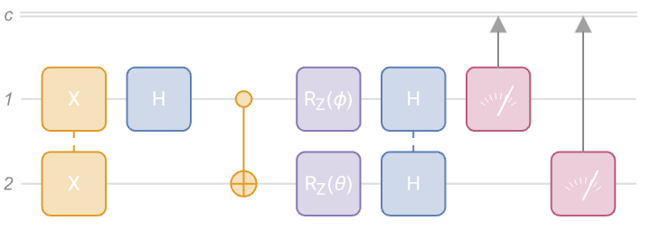
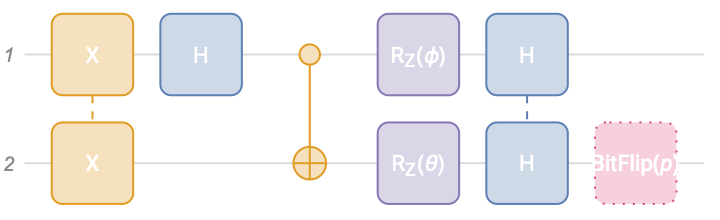
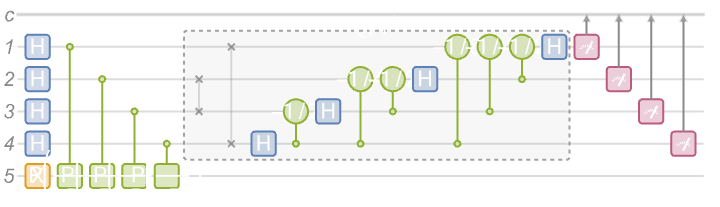
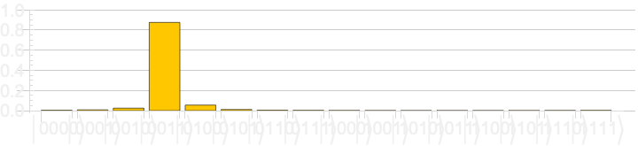
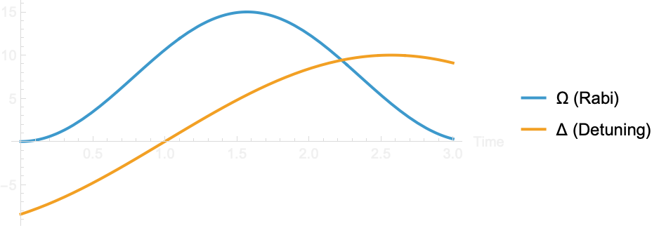
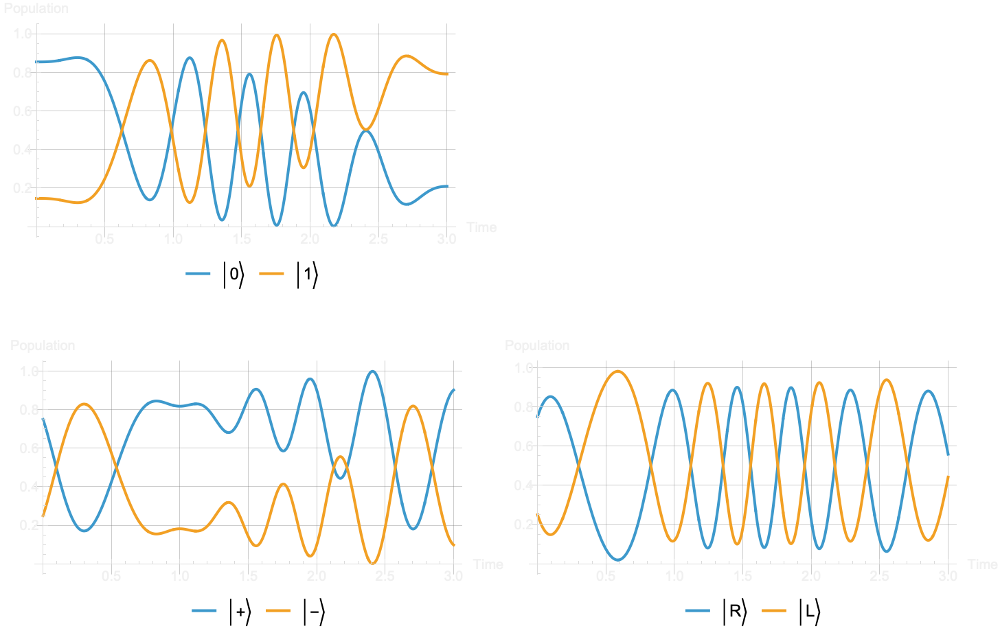
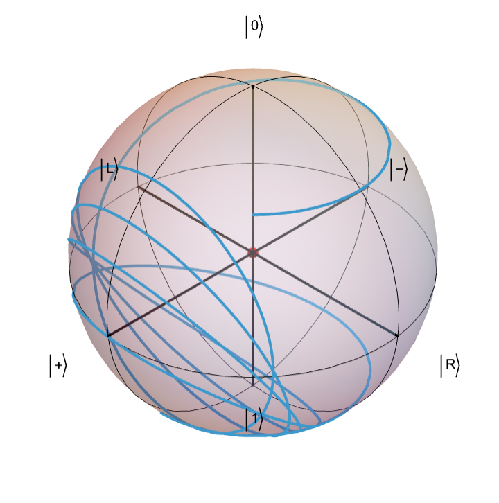
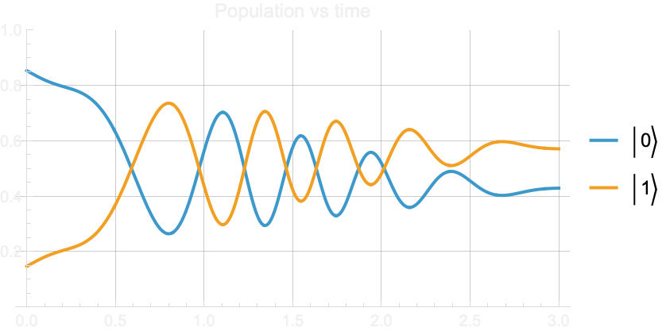
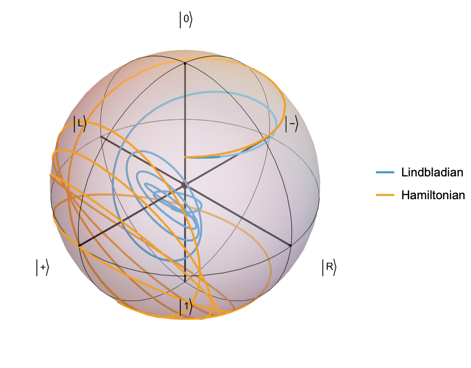

[The Wolfram Quantum Framework](https://resources.wolframcloud.com/PacletRepository/resources/Wolfram/QuantumFramework/) brings a broad, coherent design for quantum computation, together with a host of leading-edge capabilities, and full integration into Mathematica and Wolfram Language. Starting from discrete quantum mechanics, the Framework provides a high-level symbolic representation of quantum basis, states, and operations. The Framework can perform measurements and is equipped with various well-known states and operations, such as Bell states, multiplexers and quantum channels. Using such simulation capabilities, one can use the Framework to model and simulate the time evolution of isolated or open quantum systems, quantum circuits and algorithms.

Install and use the development version:
```
PacletInstall["https://www.wolfr.am/DevWQCF", ForceVersionInstall -> True]
<< Wolfram`QuantumFramework`
```

Load the local installation:
```
PacletDirectoryLoad["path_to_the_paclet_source/QuantumFramework"]
<< Wolfram`QuantumFramework`
```

To contact [Wolfram quantum team](https://www.wolfram.com/quantum-computation-framework/), please contact us at quantum [at] wolfram [dot] com.

### Some examples
The Wolfram quantum framework handles many different quantum objects, including states, operators, channels, measurements, circuits, and more. It offers specialized functions for various computations like quantum evolution, entanglement monotones, partial tracing, Wigner or Weyl transformations, stabilizer formalism, and additional capabilities. Each functionality incorporates common named operations, such as Schwinger basis, GHZ state, Fourier operator, Grover circuit, and others. Perform computations seamlessly with the Wolfram quantum framework using the standard Wolfram kernel, such as the usual evaluation of codes in Mathematica. Alternatively, leverage the framework to send jobs to quantum processing units via service connections. Here are some examples.

#### Example 1
Create a quantum circuit composed of Pauli-X on qubits 1 and 2, Hadamard on qubit 1, CNOT with qubit 1 as the controlled and qubit 2 as the target, rotation around the z-axis by a symbolic angle ϕ on qubit 1, rotation around the z-axis by a symbolic angle θ on qubit 2, Hadamard on qubits 1 and 2, and finally, measurement in the computational basis on qubits 1 and 2.

```wl
qc = QuantumCircuitOperator[{"X" -> {1, 2}, "H", "CNOT", "RZ"[\[Phi]],"RZ"[\[Theta]] -> 2, "H" -> {1, 2}, {1}, {2}}];
 qc["Diagram"]
```


Generate the multivariate distribution of measurement results based on the assumption that the angles are real:

```wl
$Assumptions = {\[Phi], \[Theta]} \[Element] Reals;
 \[ScriptCapitalD] = qc[]["MultivariateDistribution"]
```

Calculate the quantum correlation $P_{00}-P_{10}-P_{01}+P_{11}$

```wl
Sum[(-1)^(i + j) PDF[\[ScriptCapitalD], {i, j}], {i, 0, 1}, {j, 0, 1}] // FullSimplify
```
which gives returns $$-\cos(\theta - \phi)$$.

Calculate the state before measurements and show it in the Dirac notation:

```wl
qc[[;; -3]][] // FullSimplify // TraditionalForm
```
which gives returns $$\frac{i \sin \left(\frac{\theta -\phi }{2}\right)}{\sqrt{2}}|00\rangle -\frac{\cos \left(\frac{\theta -\phi }{2}\right)}{\sqrt{2}}|01\rangle +\frac{\cos \left(\frac{\theta -\phi }{2}\right)}{\sqrt{2}}|10\rangle -\frac{i \sin \left(\frac{\theta -\phi }{2}\right)}{\sqrt{2}}|11\rangle$$.

Calculate the entanglement monotone of that state:

```wl
QuantumEntanglementMonotone[qc[[;; -3]][]] // FullSimplify
```
which gives returns 1.

Add a bit-flip channel with a probability $p$ only on the qubit-2:

```wl
qc2 = qc[[;; -3]]/*{QuantumChannel["BitFlip"[p], {2}]};
 qc2["Diagram"]
```



Calculate the corresponding density matrix of the final quantum state of this circuit:

```wl
FullSimplify[Normal[qc2[]["DensityMatrix"]], 0 < p < 1] // MatrixForm
```
which returns:

$$
\rho = \begin{pmatrix}
 \frac{1}{4} ((2 p-1) \cos (\theta -\phi )+1) & \frac{1}{4} i (2 p-1) \sin (\theta -\phi ) & -\frac{1}{4} i (2 p-1) \sin (\theta -\phi ) & \frac{1}{4} ((1-2 p) \cos (\theta -\phi )-1) \\
 -\frac{1}{4} i (2 p-1) \sin (\theta -\phi ) & \frac{1}{4} ((1-2 p) \cos (\theta -\phi )+1) & \frac{1}{4} ((2 p-1) \cos (\theta -\phi )-1) & \frac{1}{4} i (2 p-1) \sin (\theta -\phi ) \\
 \frac{1}{4} i (2 p-1) \sin (\theta -\phi ) & \frac{1}{4} ((2 p-1) \cos (\theta -\phi )-1) & \frac{1}{4} ((1-2 p) \cos (\theta -\phi )+1) & -\frac{1}{4} i (2 p-1) \sin (\theta -\phi ) \\
 \frac{1}{4} ((1-2 p) \cos (\theta -\phi )-1) & -\frac{1}{4} i (2 p-1) \sin (\theta -\phi ) & \frac{1}{4} i (2 p-1) \sin (\theta -\phi ) & \frac{1}{4} ((2 p-1) \cos (\theta -\phi )+1)
\end{pmatrix}
$$


#### Example 2
Create the quantum phase estimation circuit for a phase operator with a given angle and a given number of qubits:

```wl
qc = QuantumCircuitOperator["PhaseEstimation"[QuantumOperator["Phase"[2 \[Pi]/5]], 4]];
 qc["Diagram"]
```



Calculate the outcome of circuit:

```wl
measurement = N[qc][]
```

Calculate the corresponding probabilities:

```wl
measurement["ProbabilityPlot", AspectRatio -> 1/6, PlotRange -> {Automatic, 1}, GridLines -> Automatic]
```




#### Example 3
Set time and other variables of a Hamiltonian (Rabi drive and detuning):

```wl
\[CapitalOmega] = 15. Sin[t]^2;
 \[CapitalDelta] = 10. Sin[t - 1];
 Plot[{\[CapitalOmega], \[CapitalDelta]}, {t, 0, 3}, PlotLegends -> {"\[CapitalOmega] (Rabi)", "\[CapitalDelta] (Detuning)"},AspectRatio -> 1/2, AxesLabel -> {"Time"}]
```



Create a Hamiltonian operator as $\frac{\Omega }{2}\sigma _x-\frac{\Delta }{2}\left(I+\sigma _z\right)$
```wl
hamiltonian = \[CapitalOmega]/2 QuantumOperator["X"] - \[CapitalDelta]/2 QuantumOperator["I" + "Z"];
```

Evolve an initial quantum state using the Hamiltonian:

```wl
\[Psi] = QuantumEvolve[hamiltonian, QuantumState[{Cos[\[Pi]/8], Exp[I \[Pi]/4] Sin[\[Pi]/8]}], {t, 0, 3.}];
```

Plot the measurement probabilities in the different basis:
```wl
Row[{Plot[Evaluate@Normal@\[Psi]["ProbabilitiesList"], {t, 0, 3.}, 
   PlotLegends -> Placed[{Ket[{"0"}], Ket[{"1"}]}, Bottom], 
   AspectRatio -> 1/2, ImageSize -> Medium, GridLines -> Automatic, 
   AxesLabel -> {"Time", "Population"}], "  ",
  Plot[Evaluate@
    Normal@QuantumState[\[Psi], "X"]["ProbabilitiesList"], {t, 0, 3.},
    PlotLegends -> Placed[{Ket[{"+"}], Ket[{"-"}]}, Bottom], 
   AspectRatio -> 1/2, ImageSize -> Medium, GridLines -> Automatic, 
   AxesLabel -> {"Time", "Population"}], 
  Plot[Evaluate@
    Normal@QuantumState[\[Psi], "Y"]["ProbabilitiesList"], {t, 0, 3.},
    PlotLegends -> Placed[{Ket[{"R"}], Ket[{"L"}]}, Bottom], 
   AspectRatio -> 1/2, ImageSize -> Medium, GridLines -> Automatic, 
   AxesLabel -> {"Time", "Population"}]}, Frame -> All]
```



Plot the Bloch vector evolution:

```wl
Show[QuantumState["UniformMixture"]["BlochPlot"], ParametricPlot3D[\[Psi]["BlochVector"], {t, 0, 3}]]
```



Define Lindblad operators (inducing jump from 1 to 0, and vice versa) with given rates:
```wl
\[Gamma]1 = .4; \[Gamma]2 = .5;
ls = {Sqrt[\[Gamma]1] QuantumOperator["Up"], Sqrt[\[Gamma]2] QuantumOperator["Down"]};
```

Evolve the same initial state using the Lindblad equation:

```wl
\[Rho] = QuantumEvolve[hamiltonian, ls, QuantumState[{Cos[\[Pi]/8], Exp[I \[Pi]/4] Sin[\[Pi]/8]}], {t, 0, 3.}];
```

Plot the measurement probabilities in the computational basis:

```wl
Plot[Evaluate@Normal@\[Rho]["ProbabilitiesList"], {t, 0, 3.}, PlotLabel -> "Population vs time", PlotLegends -> {Ket[{"0"}], Ket[{"1"}]}, AspectRatio -> 1/2, PlotRange -> {0, 1}, GridLines -> Automatic]
```



Plot the Bloch vector evolution vs the Hamiltonian one:

```wl
Show[QuantumState["UniformMixture"]["BlochPlot"], ParametricPlot3D[{\[Rho]["BlochVector"], \[Psi]["BlochVector"]}, {t, 0, 3}, PlotLegends -> {"Lindbladian", "Hamiltonian"}]]
```


