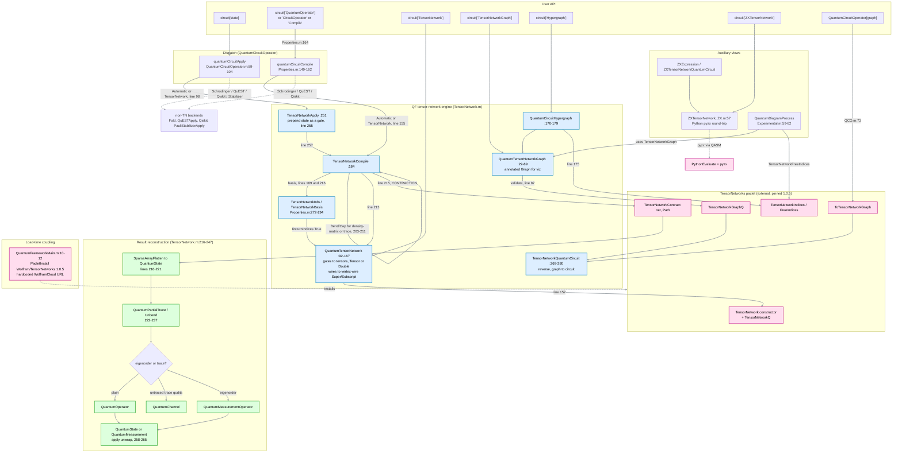

# How QuantumFramework Uses the TensorNetworks Paclet to Evaluate Circuits

Anchored to a full read of every TensorNetworks-touching kernel function (read directly from
source, not summarized). Repo state: branch `main`, with the TN version pin at `1.0.5`
(commit `468f2dac`).

Kernel files audited in full for this report:

- `QuantumFramework/Kernel/QuantumCircuitOperator/TensorNetwork.m` (all 281 lines)
- `QuantumFramework/Kernel/QuantumCircuitOperator/Properties.m` (TN handlers: 9-40, 58-131, 147-166, 272-294, 410-416)
- `QuantumFramework/Kernel/QuantumCircuitOperator/QuantumCircuitOperator.m` (73, 87-104)
- `QuantumFramework/Kernel/ZX.m` (all 140 lines)
- `QuantumFramework/Kernel/Experimental.m` (`QuantumDiagramProcess`, 59-82)
- `QuantumFramework/Kernel/QuantumFrameworkMain.m` (10-12)

## Summary

QuantumFramework (QF) uses the separate `Wolfram/TensorNetworks` (TN) paclet as its **default**
engine for circuit evaluation. When you apply a circuit to a state (`circuit[state]`) or compile
it to an operator (`circuit["QuantumOperator"]`), QF converts the `QuantumCircuitOperator` into a
TN data structure, hands it to the TN paclet's `TensorNetworkContract` to contract, then
reassembles the contracted tensor into a `QuantumState` / `QuantumOperator` / `QuantumChannel` /
`QuantumMeasurementOperator`. The whole pipeline lives in
`QuantumCircuitOperator/TensorNetwork.m`.

## 1. Dependency and loading

TN is a **hard runtime dependency that is not declared in `PacletInfo.wl`**. It is installed
imperatively at load time in `QuantumFrameworkMain.m:10-12`:

```wolfram
If[ ! pacletInstalledQ["Wolfram/TensorNetworks", "1.0.5"],
    PacletInstall["https://www.wolframcloud.com/obj/wolframquantumframework/TensorNetworks.paclet"]
]
```

Key facts, all verified:

- **Version pin is `1.0.5`**, and it lives only in this one `If`. It must be hand-bumped per TN
  release. Commit `468f2dac` ("Update TensorNetworks paclet version", Nikolay Murzin, 2026-05-26)
  bumped it from `1.0.4` to `1.0.5`, a one-line change.
- The download URL is a **hardcoded WolframCloud object**, not the public paclet server.
- The TN context is brought into each consuming file via `PackageImport["Wolfram`TensorNetworks`"]`
  (in `TensorNetwork.m`, `Properties.m`, `QuantumCircuitOperator.m`, `Experimental.m`, and `ZX.m`).
- **No graceful fallback for the default path.** If the install fails (offline, dead URL), the TN
  symbols never resolve and the default evaluation path breaks with no in-product message. Users
  can still route around TN with `Method -> "Schrodinger"`, `"Qiskit"`, `"QuEST"`, or
  `"Stabilizer"`.

## 2. Entry points that trigger TN

| User call | Dispatch site | Routes to |
|---|---|---|
| `circuit[state]` | `QuantumCircuitOperator.m:98` | `TensorNetworkApply` |
| `circuit["QuantumOperator"]` / `["CircuitOperator"]` / `["Compile"]` | `Properties.m:164` to `quantumCircuitCompile` to `Properties.m:154-155` | `TensorNetworkCompile` |
| `circuit["TensorNetwork", opts]` | `Properties.m:412` | `QuantumTensorNetwork` (the TN object) |
| `circuit["TensorNetworkGraph", opts]` | `Properties.m:410` | `QuantumTensorNetworkGraph` (annotated `Graph`) |
| `circuit["TensorNetworkInfo"]`, `["TensorNetworkBasis"]` | `Properties.m:272-294` | metadata |
| `circuit["Hypergraph"]` | `Properties.m:414` | `QuantumCircuitHypergraph` |
| `circuit["ZXTensorNetwork"]` | `Properties.m:416` | `ZXTensorNetwork` |
| `QuantumCircuitOperator[graph]` (reverse) | `QuantumCircuitOperator.m:81` | `TensorNetworkQuantumCircuit[ToTensorNetworkGraph[...]]` (was `GraphTensorNetwork`, `4f2e2034`) |

The `Automatic` method is the TN method. From `QuantumCircuitOperator.m:89-103`:

```wolfram
"Schrodinger" :> Block[...Fold gates...],
Automatic | "TensorNetwork" | {"TensorNetwork", args___} :>
    TensorNetworkApply[qco["Flatten"], qs, args, FilterRules[{opts}, Options[TensorNetworkApply]]],
"QuEST" :> QuESTApply[qco, qs],
"Qiskit" | {"Qiskit", subOpts___} :> qco["Qiskit"][qs, subOpts],
"Stabilizer" :> PauliStabilizerApply[qco, qs],
```

Note (`f9dc1cdc`): the `"Schrodinger"` `Fold` now applies each gate with `Method -> {"TensorNetwork", "Computational" -> False}` (`QuantumCircuitOperator.m:99`), so even the "non-TN" Schrödinger fallback re-enters `TensorNetworkApply` once per gate (single-gate networks). This is the post-`77b9ccba` nested-`Method` contract; the prior bare `"Computational" -> False` was being dropped and emitting `OptionValue::nodef` per gate. The TN contraction path itself is unchanged. Separately, the property-cache refactor of the same commit range sped up the whole apply path (warm 12-qubit 105-gate apply 836 → 273 ms) but did not touch this file's contraction logic.

## 3. Circuit to tensor network construction

`QuantumTensorNetwork` (`TensorNetwork.m:92-167`) builds the `TensorNetwork[...]` object. The
index scheme:

- **Precondition** (line 95): every gate's `["Order"]` must equal its `["FullOrder"]` (fully
  specified wires).
- **Optional computational-basis change** (lines 99-105): when `"Computational" -> True`,
  non-computational input/output wires are sandwiched with `ReducedMatrix` / inverse operators
  labeled `"I"[...]` so all bonds are computational before contraction.
- **Initial states** (lines 107-110): when `"PrependInitial" -> True`, a
  `QuantumState[{1}, dim, "Label" -> "0"]` (the |0> ket) is prepended as a node on each input
  wire. These get non-positive vertex ids (line 112: `vertices = Range[Length[ops]] - arity`).
- **Edges / index labels** (lines 113-138): a `FoldPairList` sweeps gates left to right, tracking
  per wire the id of the last tensor that wrote it. Each contracted bond is
  `Superscript[producerVertex, wire] -> Subscript[consumerVertex, wire]` (line 121). So **an index
  is `(vertex, wire)`; a contraction glues a producer's `Superscript` to a consumer's
  `Subscript`.** Dangling wires (`None[...]`) become free output/input indices.
- **Tensors** (line 155): `tensors = If[#["MatrixQ"], #["Double"], #]["Tensor"] & /@ ops`
  (density-matrix gates are doubled first).

The TN object (lines 156-165):

```wolfram
TensorNetwork[
    tensors, indices,
    With[{free = Keys[Select[Counts[Catenate[indices]], # == 1 &]]},
        FindPermutation[free, tensorNetworkIndexSort[free]]
    ]
]
```

That is the TN-paclet constructor: parallel lists of numeric tensors and index labels, plus a
`FindPermutation` that reorders the free (count == 1) indices into QF's canonical order (outputs
before inputs, by wire, via `tensorNetworkIndexSort`, line 16). The result is validated with
`TensorNetworkQ`.

`QuantumTensorNetworkGraph` (lines 22-89) builds the **same structure as an annotated `Graph`**
for visualization, hypergraph, and `QuantumDiagramProcess`. Note the one real difference between
the two builders: the graph stores each bond as a 2-list `{Superscript[...], Subscript[...]}` in
the edge tag (line 51), while `QuantumTensorNetwork` stores it as a rule `Superscript -> Subscript`
(line 121). The two builders are otherwise near-identical, flagged with
`(* TODO: refactor with above *)` at line 91.

## 4. Contraction via TensorNetworks

The single contraction call is in `TensorNetworkCompile` at `TensorNetwork.m:213-215`:

```wolfram
net = ConfirmBy[QuantumTensorNetwork[circuit, "Computational" -> computationalQ,
        FilterRules[{opts}, Options[QuantumTensorNetwork]], "PrependInitial" -> False], TensorNetworkQ];
...
res = Confirm @ TensorNetworkContract[net, OptionValue["Path"], FilterRules[{opts}, Options[TensorNetworkContract]]];
```

`TensorNetworkContract` is the TN-paclet contraction engine. The second argument is the contraction
**path**: which pair of tensors to contract at each step. **Since `77b9ccba` this is a user-exposed
option.** `TensorNetworkCompile` carries `"Path" -> Automatic` (`TensorNetwork.m:182`), passed as
the second argument (`TensorNetwork.m:215`); the old code hardcoded `Automatic` here. `Automatic`
still lets TN pick the order, but a user can now supply an explicit path.

The path is reachable from the public surface through the **`Method` sub-option** form. `qco[state]`
and `qco["QuantumOperator"]` dispatch on `Method`; the TensorNetwork branch is
`{"TensorNetwork", subOpts___}` and the `subOpts` are `FilterRules`-forwarded into
`TensorNetworkApply` / `TensorNetworkCompile` (`QuantumCircuitOperator.m:106`,
`QuantumCircuitOperator/Properties.m:155-156`). So:

```wolfram
qco[state, Method -> {"TensorNetwork", "Path" -> path}]
qco["QuantumOperator", Method -> {"TensorNetwork", "Path" -> path}]
```

This is the NDSolve-style nested-`Method` design from the contraction-path report; it replaces the
prior behavior where `Options[TensorNetworkApply]`/`Options[TensorNetworkCompile]` leaked into
`Options[quantumCircuitApply]`/`Options[quantumCircuitCompile]` at top level. Those top-level joins
were **removed** (`QuantumCircuitOperator.m:95`, `QuantumCircuitOperator/Properties.m:150`); options
now flow only through the `Method` sub-option list.

TensorNetworks-paclet symbols QF invokes (all confirmed by reading): `TensorNetwork` (constructor,
TN.m:157), `TensorNetworkQ` (165, 213), `TensorNetworkGraphQ` (87, 269), `TensorNetworkContract`
(215), `TensorNetworkIndices` (175), `TensorNetworkFreeIndices` (`Experimental.m:64`),
`ToTensorNetworkGraph` (`QuantumCircuitOperator.m:81`, `QuantumCircuitOperator[g_?GraphQ]`,
repointed from `GraphTensorNetwork` at `4f2e2034`; the file now carries an explicit
`PackageImport["Wolfram`TensorNetworks`"]`).

## 5. Result reconstruction (TN tensor to QF object)

Still in `TensorNetworkCompile` (`TensorNetwork.m:216-247`):

1. **Wrap to a state** (216-221): `SparseArrayFlatten[res]` flattens the contracted array into a
   vector, given a basis from `circuit["TensorNetworkBasis"]`.
2. **Trace** (222-229): if tracing and trace qudits are present, `QuantumPartialTrace` is applied.
3. **Bend / Unbend** (203-211, 230-237): if any gate is a density matrix (`MatrixQ`) or there are
   trace qudits (and not phase space), `bendQ` is true: the circuit is doubled with
   `circuit["Bend"]`, trace wires are capped with `"Cap"` operators, and the contracted result is
   `["Unbend"]`-ed back.
4. **Final type** (238-245): wrapped as `QuantumMeasurementOperator` (if eigenorder present),
   `QuantumChannel` (untraced trace qudits), or plain `QuantumOperator`.

`TensorNetworkApply` (251-266) is the state-application wrapper: it prepends the input state as a
gate (`{qs -> circuit["FullInputOrder"]} /* circuit`, line 255), calls `TensorNetworkCompile`,
then unwraps to `res["State"]` (line 262), or to a `QuantumMeasurement` when the targets are fully
covered (line 260).

The **reverse** mapping `TensorNetworkQuantumCircuit` (269-280) turns a TN graph back into a
circuit: each vertex's `"Tensor"` + `"Index"` annotations become a `QuantumOperator` (output =
`Superscript` indices, input = `Subscript` indices); a `Subscript["Measurement", ...]` label
becomes a `QuantumMeasurementOperator`.

## 6. Auxiliary views

- **`QuantumDiagramProcess`** (`Experimental.m:59-82`): builds
  `qco["TensorNetworkGraph", "PrependInitial" -> False]`, reads `EdgeTags`, calls the TN-paclet
  `TensorNetworkFreeIndices` to render a string diagram via a deployed `DiagramProcess` resource
  function.
- **`QuantumCircuitHypergraph`** (`TensorNetwork.m:170-179`): builds the TN graph, reads
  `TensorNetworkIndices`, converts to a `WolframInstitute`Hypergraph`` object (a separate
  lazily-loaded dependency, aliased `H`` at `QuantumFrameworkMain.m:14`).
- **ZX integration** (`ZX.m`): `ZXTensorNetwork` (ZX.m:57) does **not** call
  `QuantumTensorNetworkGraph`. It round-trips through **Python + pyzx** (`toZX`, ZX.m:11-52: QF to
  Qiskit QASM to `pyzx`), then hand-builds a `Graph` reusing the same `(vertex, wire)`
  Super/Subscript convention (inserting extra `H` vertices for Hadamard edges). Only
  `ZXTensorNetworkQuantumCircuit` (ZX.m:108) consumes a `TensorNetworkQ` object. Of the ZX
  symbols, only `"ZXTensorNetwork"` is a circuit property (`Properties.m:416`); `ZXExpression` and
  `ZXTensorNetworkQuantumCircuit` are public top-level functions.

State, operator, partial-trace, and qudit-basis modules do **not** call the TN paclet. Their
`TensorContract` / `SparseArrayFlatten` usages are built-in or QF-local utilities, unrelated to
the TN paclet.

## 7. End-to-end data flow (text)

```
circuit[state]                              circuit["QuantumOperator"]
   |  Method=Automatic                          |  Method=Automatic
QuantumCircuitOperator.m:98               Properties.m:164 -> quantumCircuitCompile
   -> TensorNetworkApply                      Properties.m:155 -> TensorNetworkCompile
   (prepend state as a gate, line 255)             |
        +---------------------------------------->  TensorNetworkCompile  (TensorNetwork.m:184)
                                                    |
                            basis = circuit["TensorNetworkBasis"];  decide computationalQ / bendQ
                            optionally Bend + Cap (trace / density-matrix gates)
                                                    |
                            QuantumTensorNetwork  (TensorNetwork.m:92)
                              gates -> tensors (["Tensor"] / ["Double"])
                              wires -> (vertex,wire) Super/Subscript indices
                              -> TensorNetwork[tensors, indices, perm]      <- TN paclet
                                                    |
                  TensorNetworkContract[net, OptionValue["Path"], ...]      <- TN paclet
                                                    |
                            SparseArrayFlatten -> QuantumState[..., basis]
                              optional QuantumPartialTrace / Unbend
                                                    |
                            QuantumOperator | QuantumChannel | QuantumMeasurementOperator
   |
 (Apply) -> res["State"]  or  QuantumMeasurement[res]
```

## 8. Pitfalls, caveats, TODOs

1. **Undeclared, URL-pinned dependency.** TN is absent from `PacletInfo.wl`; the only coupling
   point is `QuantumFrameworkMain.m:10`. A failed download silently breaks the default evaluation
   path with no fallback message.
2. **Manual version lockstep.** The `1.0.5` pin must track TN releases by hand (commit `468f2dac`
   is the precedent).
3. **Code duplication.** `QuantumTensorNetwork` and `QuantumTensorNetworkGraph` share copy-pasted
   index/edge logic. Explicit `(* TODO: refactor with above *)` at `TensorNetwork.m:91`.
4. **Known-incomplete bend bookkeeping.** `TensorNetwork.m:205-206` carries a commented-out
   `ConfirmAssert` with `(* TODO: handle this case somehow *)` around the positive-order invariant
   for bent (density-matrix / trace) circuits.
5. **Heavy results are cached on the symbol.** `"TensorNetwork"`, `"TensorNetworkGraph"`,
   `"TensorNetworkInfo"`, `"TensorNetworkBasis"` are NOT in `$QuantumCircuitPreventCache`
   (`Properties.m:28-31`), so a `Graph` object can get memoized onto the QCO. Fine for immutable
   circuits.
6. **`TensorNetworkBasis` recomputed twice** in `TensorNetworkCompile` (lines 189 and 216), mildly
   wasteful given the local cache.
7. **ZX path has a second external dependency**: Python + `pyzx` via `PythonEvaluate` (ZX.m:12),
   separate from the TN paclet.

## 9. Mermaid diagram



Pink = external (TensorNetworks paclet + Python/pyzx + the loader that installs them). Blue = QF's
own TN engine in `TensorNetwork.m`. Green = the reconstructed QF objects handed back to the user.
The one solid contraction hop is `TensorNetworkCompile` line 215 to `TensorNetworkContract`;
everything upstream is QF building the network, everything downstream is QF rebuilding a
`QuantumState` / `QuantumOperator` / `QuantumChannel` / `QuantumMeasurement`.
